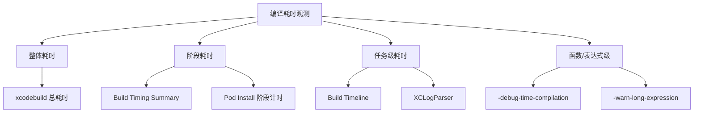
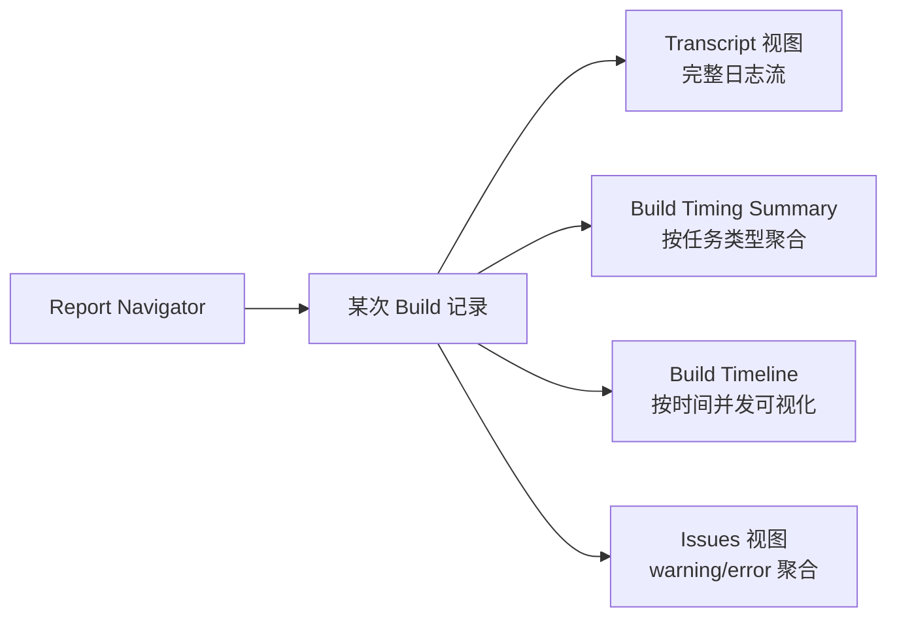
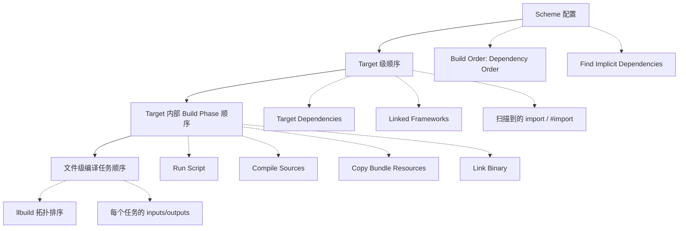
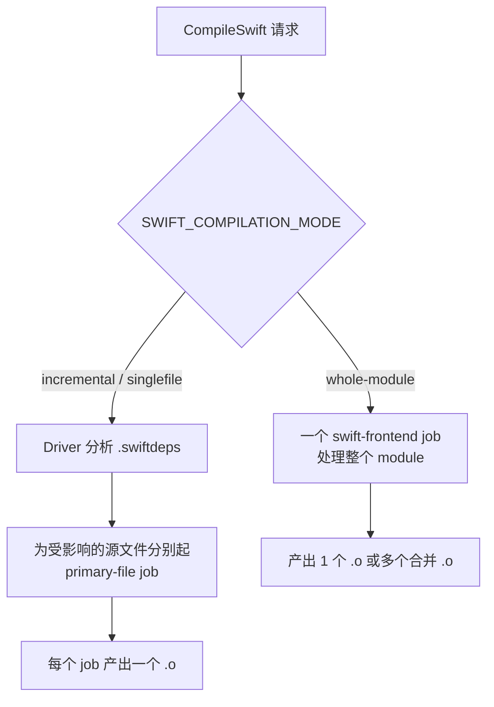
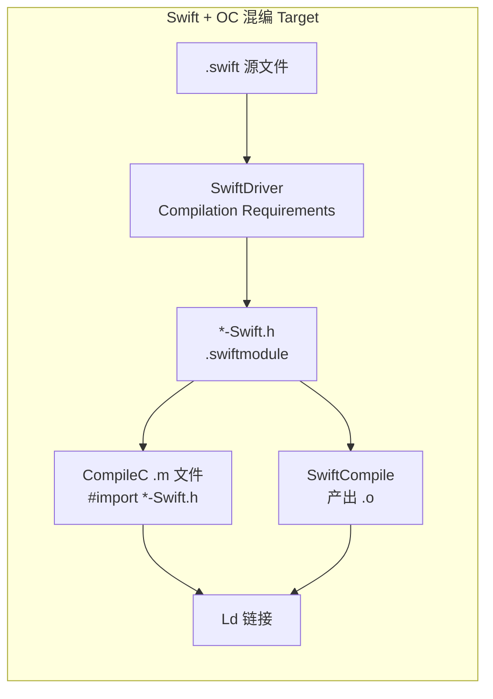
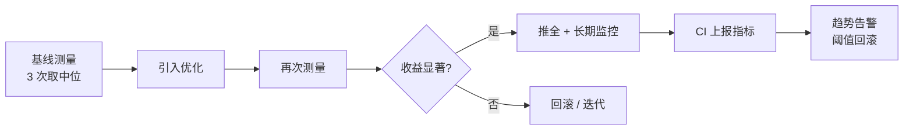

+++
title = "编译优化-观测"
date = '2026-05-05T00:41:41+08:00'
draft = false
weight = 10
tags = ["iOS", "工程化", "编译"]
categories = ["iOS开发", "工程化"]
+++
"无法度量就无法优化"。在开始任何编译优化动作之前，必须先建立一套可重复、可对比的观测手段，否则改动的真实收益无从谈起。本文介绍 iOS 编译耗时观测的主要工具链和原理。

---

## 观测目标分层

不同层次的观测工具回答不同的问题：



| 观测层次 | 典型问题 | 工具 |
|---------|---------|------|
| 整体 | 一次构建花了多久？ | `time xcodebuild`、MetricKit |
| 阶段 | 哪个阶段最慢？ | `-showBuildTimingSummary`、Build Timing Summary |
| 任务 | 哪个文件/目标最慢？ | Xcode Build Timeline、XCLogParser |
| 函数级 | 哪个函数/表达式让前端卡住？ | `-debug-time-function-bodies`、`-warn-long-expression-type-checking` |

---

## 整体耗时

### xcodebuild 命令行计时

最简单也最稳定的方式是直接给 `xcodebuild` 加 `time`：

```bash
time xcodebuild \
  -workspace MyApp.xcworkspace \
  -scheme MyApp \
  -configuration Debug \
  -destination 'generic/platform=iOS Simulator' \
  clean build
```

CI 上建议固定机器型号、关闭其他应用、重复 3 次取中位数，排除环境噪声。

### Incremental 场景复现

冷启动、增量、空改动三种场景的优化目标并不一致：

```bash
# 冷启动（clean build）
xcodebuild clean
xcodebuild ... build

# 增量（修改一个文件后）
echo "// $(date)" >> Sources/Foo.swift
xcodebuild ... build

# 空改动（文件时间戳不变）
xcodebuild ... build
```

空改动还能触发构建说明依赖追踪有误，这本身就是优化点。

---

## Xcode Build Timing Summary

### 命令行参数

`xcodebuild` 的 `-showBuildTimingSummary` 会在构建结束后输出各类任务的累计耗时：

```bash
xcodebuild -showBuildTimingSummary ... build
```

输出示例：

```text
Build Timing Summary
====================
CompileSwift (324 tasks) | 412.34 seconds
CompileC (1203 tasks)    | 287.11 seconds
Ld (48 tasks)            |  62.03 seconds
CodeSign (12 tasks)      |   8.51 seconds
...
```

Timing Summary 按 **任务类型** 聚合，能快速识别是编译慢、链接慢，还是脚本慢，是首选的入门工具。

### Xcode GUI

Xcode 本身是最直观的观测入口，相比命令行的文本输出，GUI 能一眼看到**任务依赖图、并发度、关键路径**。下面把常用的几个面板拆开讲。

#### 入口：Report Navigator

```text
Cmd + 9   → 打开 Report Navigator（左侧导航栏第 9 个 Tab）
            列出最近每一次 Build / Test / Archive / Profile 记录
选中某次 Build
右键 → Show Build Timing Summary    // 文本化 + 聚合视图
或顶栏切换到 Timeline 视图（Xcode 14+）// 可视化时间轴
```

默认面板左侧是 **Target / Task 树**，右侧是详细输出。



#### Build Timing Summary 视图

`Show Build Timing Summary` 会在右侧呈现聚合表，维度包括：

- **Task type**：`CompileC` / `CompileSwift` / `Ld` / `CodeSign` / `PhaseScriptExecution` / `CpResource` / `CpHeader` / `GenerateDSYMFile`…
- **Count**：该类型任务的总数（如 1203 个 `CompileC`）
- **Duration**：累计墙钟耗时（不是 CPU 时间，所以和实际耗时不完全相等）

这里要理解两点：

1. **累计耗时 ≠ 构建总耗时**：`CompileC 287s` 是 1203 个任务**累加**，实际并行跑只用了不到一分钟，Summary 主要用于横向对比任务类型占比
2. **按类型而非按 Target**：想看哪个 Target 慢，要切到 Timeline 或用 XCLogParser

#### Build Timeline 视图（Xcode 14+）

Timeline 是最像 Chrome DevTools Performance 的视图：

- **横轴**：时间（从 Build 开始到结束）
- **纵轴**：每一行是一个可并行槽位，通常对应 `-jobs` / `NSProcessInfo.processorCount`
- **色块**：一个块就是一次任务执行，颜色按 Target 或任务类型区分
- **空白**：任务之间的 "waiting for dependency"，意味着并行度没被吃满

常见的可读信号：

| Timeline 现象 | 大概率原因 | 优化方向 |
|--------------|----------|---------|
| 右端长尾单色块 | 某 Target 的 WMO 作业独占后期 | Target 拆分、模块二进制化 |
| 大量列级空白 | 依赖深链导致串行 | 检查隐式依赖、减少 public header 重导出 |
| Script Phase 块横贯全程 | 某个 Run Script 阻塞 | 把 Script 改为 parallelizable 或下沉到构建前 |
| Swift 块早开始、OC 块晚开始 | bridging header 依赖 | 检查 `*-Swift.h` 的生成位置 |
| `Ld` 块持续 > 全程 20% | 链接慢 | 见 [编译优化-链接优化](./编译优化-链接优化.md) |

点击某个色块右侧会展开任务详情：完整命令行、`stdin/stdout`、`DEPENDENCY_FILE`、输入/输出列表——这是排查"某个任务为什么被触发"时最值钱的信息。

#### 查看单个任务的完整命令

Timeline / Transcript 里任意一条任务（如 `CompileSwift normal arm64 Foo.swift`）点开左侧小三角，会展示该任务真实的 shell 调用：

```bash
/Applications/Xcode.app/Contents/Developer/Toolchains/XcodeDefault.xctoolchain/usr/bin/swift-frontend \
  -frontend -c \
  -primary-file /.../Foo.swift \
  ... \
  -module-name MyKit \
  -output-file-map /.../MyKit-OutputFileMap.json \
  -serialize-diagnostics-path /.../Foo.dia \
  -emit-dependencies-path /.../Foo.d \
  -emit-reference-dependencies-path /.../Foo.swiftdeps \
  -o /.../Foo.o
```

这份命令行能回答绝大多数 "为什么这个任务慢 / 被触发 / 输出去了哪里" 的问题。几个关键参数：

- `-primary-file`：该任务主编译的源文件（增量模式），不带 primary-file 表示 WMO
- `-output-file-map`：驱动级别的输入输出表，增量判断的核心依据
- `-emit-reference-dependencies-path`：Swift 的 `.swiftdeps` 文件，下一次增量编译会用它计算被影响的文件

#### 编译顺序是怎么确定的？

Xcode 的编译顺序不是开发者直接指定的，而是由多层依赖合成的一张 **DAG（有向无环图）**，再由 `llbuild` 做拓扑排序和并行调度。来源按从大到小的粒度分为：



1. **Scheme 层**：`Edit Scheme → Build → Build Order`
   - 新版 Xcode 使用 `Dependency Order` / `Manual Order` 描述构建顺序，`Dependency Order` 是默认 / 推荐方式，Xcode 会按依赖关系尽可能并行构建，`Manual Order` 已不建议使用
   - `Find Implicit Dependencies`：打开后 Xcode 会扫描源码中的 `import Foo` / `#import <Foo/Foo.h>`，自动把 Foo Target 加到依赖中；关掉就只按 Target Dependencies 配置走
2. **Target 层**：
   - `General → Frameworks, Libraries, and Embedded Content` 会生成显式依赖
   - `Build Phases → Target Dependencies` 是强依赖，无论隐式开关如何都生效
3. **Target 内**：`Build Phases` 列表自上而下顺序执行，但 `Compile Sources` 内部文件是并行的
4. **文件层**：Xcode 把每个 Compile Sources 文件转成一个 llbuild task，task 间通过 `inputs`/`outputs` 建立依赖。比如某个 `.m` 文件 `#import` 了另一个 Target 生成的 `*-Swift.h`，那个 header 的输出就是它的 input，必须等前者完成。

换句话说，Timeline 里看到的并行度是**输入输出关系**允许的最大并行度，而不是开发者控制的。要增加并行度，本质上就是**削减 task 之间的依赖边**：减少 public header、打破循环 import、开启 Explicit Modules（见 [编译优化-Explicit Modules](./编译优化-Explicit%20Modules.md)）。

#### OC / Swift 编译任务是怎么划分的？

Xcode 的 Build System（XCBBuildService）会按**文件扩展名**把源文件分派给不同的工具链：

| 扩展名 | 任务类型 | 工具 | 粒度 |
|--------|---------|------|------|
| `.c` / `.m` / `.mm` / `.cpp` | `CompileC` | `clang` | **每文件一个任务** |
| `.swift` | `CompileSwift` / `SwiftCompile` | `swift-frontend`（由 `swift-driver` 调度） | **每 Target 一个或多个任务**（见下） |
| `.metal` | `CompileMetalFile` | `metal` | 每文件 |
| `.xib` / `.storyboard` | `CompileStoryboard` | `ibtool` | 每文件 |
| `.xcassets` | `CompileAssetCatalog` | `actool` | 每 Target 一个 |

OC 和 Swift 最大的差别在**粒度**：

**OC（CompileC）每个 `.m` 文件都独立成一个 task**，clang 前端对每个 translation unit 处理，完全独立，天然可并行。在 Timeline 里会看到密密麻麻、颗粒很细的 `CompileC` 色块。

**Swift 则由 `swift-driver` 整体调度一个 Module 内的所有 `.swift`**，具体分成几种模式：



- **WMO（Whole Module Optimization）**：Release 默认开启。`SWIFT_COMPILATION_MODE = wholemodule`，整个 module 打成一个 `swift-frontend` 进程，内部也有并行但对 llbuild 来说是一个大 task，Timeline 看到的是一根长色块
- **Incremental**：Debug 默认。Driver 读 `.swiftdeps` / `.swiftsourceinfo` 判断哪些文件需要重编，再为每个受影响的文件起一个带 `-primary-file` 的 frontend 进程，Timeline 看到的是多条细长的 `CompileSwift` 色块
- **Batch Mode**：Driver 把多个 primary-file 合并进一个进程以减少 fork 开销，Xcode 13+ 默认开启

#### WMO vs Incremental 的进程模型

上面提到的"一个 `swift-frontend` 进程"是字面意思——操作系统层面只 fork 一次可执行文件，用 `ps` 能看到对应的一个 PID。要理解这一点，需要先知道 Swift 和 Clang 一样是**两层架构**：

```text
swift-driver   （调度器，对应 clang driver）
     │
     ▼  fork/exec
swift-frontend （真正的编译器，对应 clang -cc1）
```

- **`swift-driver`**：Xcode 直接调用的入口，负责读 `.swiftdeps`、算出哪些文件要编、总共要起几个编译进程
- **`swift-frontend`**：真正做 Parse / Sema / SILGen / SIL 优化 / IRGen / LLVM 的进程，吃源码吐 `.o`

**起几个 `swift-frontend` 进程由 driver 决定**，这就是 WMO 和 Incremental 最本质的差别。把两种模式下 Timeline 色块点开看真实命令行，一眼就能分辨。

WMO 模式下只有**一条**命令，命令行里列出 module 所有 `.swift`，没有 `-primary-file`：

```bash
swift-frontend -frontend -c \
  A.swift B.swift C.swift D.swift E.swift \
  -module-name MyKit \
  -O \
  -num-threads 8 \
  -o A.o -o B.o -o C.o -o D.o -o E.o
```

一个进程内部用 `-num-threads` 多线程做 codegen，可以并行，但对 `llbuild` 来说就是**一个 task**。因为整个 module 在同一个进程里被一起看到，SIL 优化阶段可以做跨文件的**内联、泛型特化、死代码剔除**，产出代码性能最好；代价是任何一个文件改动都要整根色块重跑。

Incremental 模式下 Driver 为**每个受影响的文件**分别 fork 一个 `swift-frontend`：

```bash
# 进程 1：主编 B.swift
swift-frontend -frontend -c \
  A.swift -primary-file B.swift C.swift D.swift E.swift \
  -module-name MyKit -o B.o

# 进程 2：主编 D.swift
swift-frontend -frontend -c \
  A.swift B.swift C.swift -primary-file D.swift E.swift \
  -module-name MyKit -o D.o
```

每个进程命令行里**有且仅有一个 `-primary-file`**，它才是这个进程负责产出 `.o` 的目标；其他 `.swift` 是 **secondary file**，只为 primary 提供类型检查的符号上下文，不会为它们生成 `.o`。Batch Mode 再把 N 个 primary-file 合并进 M 个进程（M < N）以减少 fork 开销。

两者的关键权衡：

| 维度 | WMO | Incremental |
|------|-----|-------------|
| `swift-frontend` 进程数 | 1 | 每个受影响文件 1 个（Batch 后更少）|
| 命令行特征 | 无 `-primary-file`，列出全部 `.swift` | 有 `-primary-file`，其他为 secondary |
| Timeline 形态 | 一根长色块 | 多条细长色块 |
| 跨文件 SIL 优化 | 能做（inline、泛型特化等）| 不能 |
| 改一个文件的代价 | 整个 module 重编 | 只编受影响文件 |
| 产物性能 | 好 | 一般 |
| 典型用途 | Release | Debug |

这也解释了两件事：

1. 为什么 Debug 构建极度依赖 incremental 的稳定性——少一丁点误判就会退化成半个 WMO
2. 为什么 Xcode 14+ 要在 WMO 基础上引入 `SwiftEmitModule` 单独产出 `.swiftmodule`——让下游 Target 的等待时间从"整根 WMO 色块结束"提前到"只等 `.swiftmodule` 产出"，这也是 Timeline 里能看到两段前后色块的原因

此外 Swift 还会插入一些**额外的任务**在 Timeline 里可见：

| 任务名 | 作用 | 出现时机 |
|-------|------|---------|
| `SwiftDriver Compilation Requirements` | 生成下游 Target 需要的 `.swiftmodule` / `*-Swift.h` | 每个 Swift Target 都会先跑这一步 |
| `SwiftEmitModule` | 单独产出 `.swiftmodule`，加速下游等待 | Xcode 14+ |
| `SwiftMergeGeneratedHeaders` | 合并 `@objc` 生成的 `*-Swift.h` | Swift → OC 桥接时 |
| `SwiftCompile` | 实际 `.o` 产出，依赖上面的 requirements | 每个 Target |

**混编 Target 的任务依赖链**：



这就是为什么 Timeline 里经常能看到：**Swift 的 SwiftDriver Compilation Requirements 先跑完，OC 的 CompileC 才大批开始**——它们通过 `*-Swift.h` 建立了显式依赖。这也是混编工程并行度劣化的主要原因，优化方向是把 bridging header 尽量瘦身，或用 Explicit Modules 让 module 扫描更细粒度。

#### 小贴士

- **Timeline 没显示**：确认 Xcode 14+、Build System 为 "New Build System"（默认）
- **想看旧版文本日志**：右键任意 Build Record → `Expand All Transcripts`，完整还原命令行日志
- **保留 Build Log 文件**：`xcodebuild -resultBundlePath out.xcresult`，之后用 `xcrun xcresulttool` 或 XCLogParser 离线分析
- **DerivedData 里**：`~/Library/Developer/Xcode/DerivedData/<Proj>/Logs/Build/*.xcactivitylog` 是 GUI 展示的底层数据，SLF0 格式压缩，能直接喂给 XCLogParser

---

## Swift 编译器诊断

Swift 前端内置了丰富的计时能力，通过在 `OTHER_SWIFT_FLAGS` 添加参数开启。

### 编译耗时分桶

```text
-Xfrontend -debug-time-compilation
-Xfrontend -debug-time-function-bodies
-Xfrontend -debug-time-expression-type-checking
```

- `debug-time-compilation` 输出每个编译 job 的各阶段耗时（Parse、Sema、SILGen、SILOptimization、IRGen、LLVM）
- `debug-time-function-bodies` 输出每个函数体的类型检查耗时
- `debug-time-expression-type-checking` 输出每个表达式的类型检查耗时

开启后在 Xcode Log 里会看到类似输出：

```text
1234.56ms  /path/MyView.swift:42:10  body()
 987.65ms  /path/Foo.swift:17:23  complexExpression
```

### 耗时告警

生产环境不需要全量输出，更常用的是告警阈值：

```text
-Xfrontend -warn-long-function-bodies=200
-Xfrontend -warn-long-expression-type-checking=100
```

超过阈值（毫秒）的函数体或表达式会以 warning 形式出现在 Xcode Issue Navigator，便于直接跳转修复。这是定位"expression too complex"潜在热点最高效的手段。

### Driver 诊断

```text
-driver-show-incremental
-driver-show-job-lifecycle
```

- `show-incremental` 打印每个源文件被重新编译的原因（某个依赖被修改、某个接口变化等）
- `show-job-lifecycle` 打印编译任务的调度、执行、完成时机

用于诊断"为什么小改动触发了大量文件重新编译"。

---

## Clang 编译器诊断

C/C++/Objective-C 侧可以通过 `OTHER_CFLAGS` 添加：

```text
-ftime-trace
-ftime-report
```

- `-ftime-report` 输出前端、LLVM IR、优化、CodeGen 的各项耗时
- `-ftime-trace` 生成 Chrome Tracing JSON，每个编译单元一个 `.json`，可以用 [ui.perfetto.dev](https://ui.perfetto.dev) 或 `chrome://tracing` 打开可视化分析

`ftime-trace` 能直观看到 `#include` 解析、模板实例化、函数优化的逐项耗时，对头文件爆炸和模块过大有直观帮助。

---

## 日志二次加工：XCLogParser

Xcode 把构建日志保存在 `DerivedData/<project>/Logs/Build/*.xcactivitylog`，是 SLF0 格式压缩文件。直接阅读不方便，社区工具 [XCLogParser](https://github.com/MobileNativeFoundation/XCLogParser) 可以导出为 JSON/HTML/CSV：

```bash
xclogparser parse \
  --project MyApp \
  --reporter html \
  --output build_report.html
```

生成的 HTML 报告包含：
- 每个 target、每个文件的编译耗时
- 编译错误/警告聚合
- 增量编译原因

大厂基本都会基于 XCLogParser 做二次采集，将数据上报到内部 APM 平台做趋势分析。

---

## Pod Install 观测

CocoaPods 自带 Ruby 级 profiler：

```bash
gem install ruby-prof
export COCOAPODS_PROFILE=/tmp/pod-install.html
bundle exec pod install
```

输出 CallGrind / HTML 报告，定位 Ruby 方法级热点。但 ruby-prof 粒度偏细，难以直接映射到 Pod Install 的业务阶段。抖音 seer-optimize 自研了阶段 profiler：

```text
install! consume              : 5.376132s
  prepare consume             : 0.002049s
  resolve_dependencies consume: 4.065177s
  download_dependencies       : 0.001196s
  validate_targets consume    : 0.037846s
  generate_pods_project       : 0.697412s
  integrate_user_project      : 0.009258s
```

原理是在 CocoaPods 的关键方法上 monkey patch 打点，通过 `Process.clock_gettime(Process::CLOCK_MONOTONIC)` 记录起止时间，并把数据上报到远端做趋势和告警。

---

## 线上 / CI 观测

### MetricKit

iOS 13+ 的 MetricKit 能够从线上设备收集 `MXAppLaunchMetric` 等指标，但并不覆盖构建耗时。构建耗时属于研发端指标，必须在 CI / 本地通过上述方案采集。

### Bitrise / GitHub Actions 埋点

CI 上通常通过两种方式上报：

1. 包装 `xcodebuild`，在结束后解析 `xcactivitylog` 并打点到 Datadog / Prometheus
2. 直接在 `post-build` 脚本中读取 Build Timing Summary 文本并上报

典型的核心指标：

| 指标 | 说明 |
|-----|------|
| `build.total_duration` | 构建总耗时（中位数、P90） |
| `build.swift_compile_duration` | Swift 编译累计耗时 |
| `build.link_duration` | 链接耗时 |
| `build.incremental_file_count` | 增量编译触发的文件数 |
| `build.cache_hit_rate` | 编译缓存命中率 |

---

## 观测流程闭环



每一次优化都必须走完这个闭环：**先测基线、再改、再测、再决定是否推全**。线上稳定后还需要在 CI 建立趋势告警，避免新引入的代码悄悄劣化编译性能。
