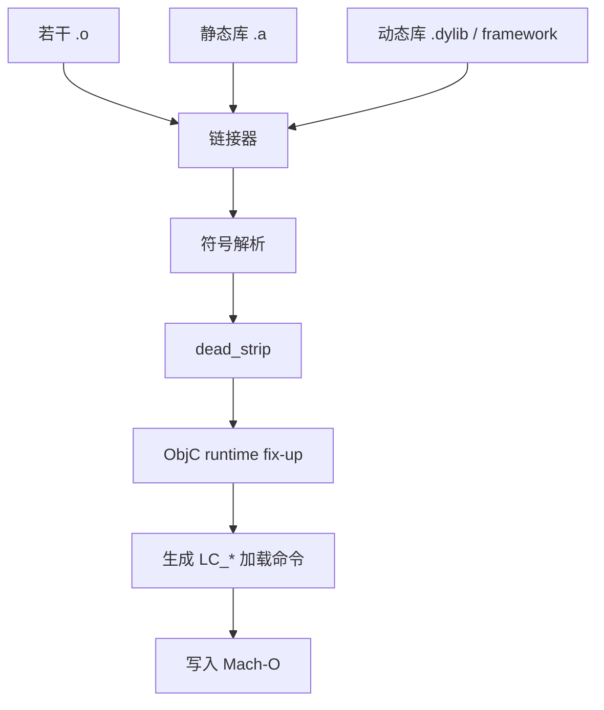
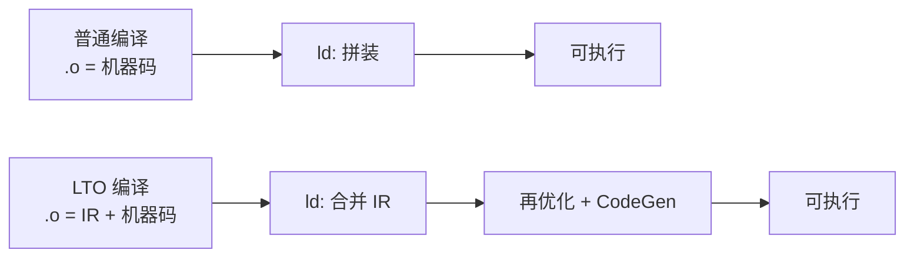
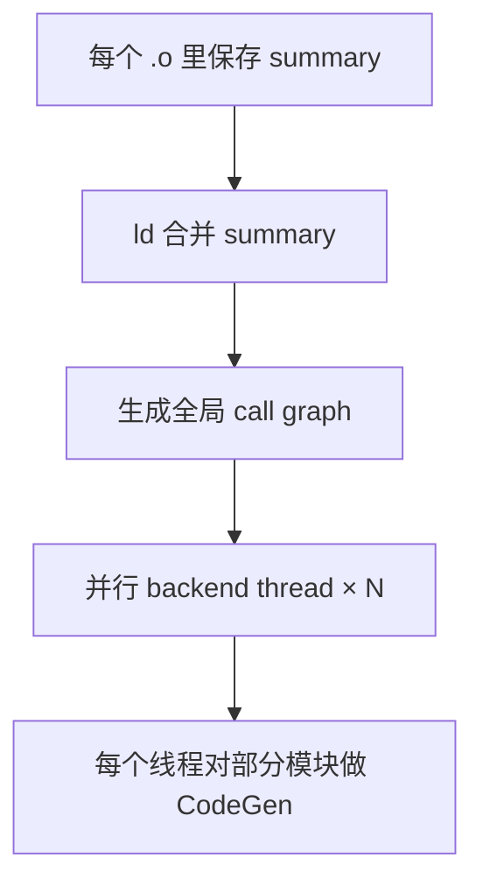
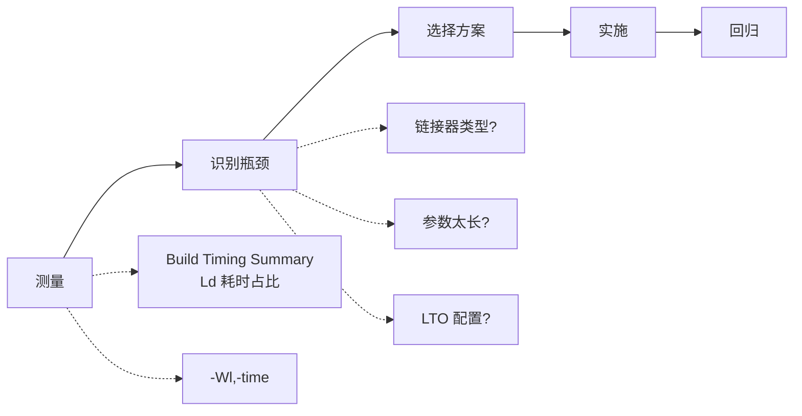

+++
title = "编译优化-链接优化"
date = '2026-05-02T22:32:27+08:00'
draft = false
weight = 11
tags = ["iOS", "工程化", "编译"]
categories = ["iOS开发", "工程化"]
+++
链接是 iOS 编译的最后一个阶段，也是大型工程里经常被忽略的瓶颈。Apple 在 WWDC22 的 "Link fast: Improve build and launch times" 演讲中公开：Xcode 14 新的 `ld-prime` 链接器比 `ld64` 快 **2 倍**。随着 Xcode 17、ThinLTO、Mergeable Libraries 等改进，链接优化已经成为编译加速的重要一环。

---

## 链接器的职责

链接器把多个 `.o` 合并成最终可执行文件或库：



关键任务：

- **符号解析**：所有 undefined symbol 必须在某个 .o / .a / .dylib 里找到
- **重定位**：把符号引用的偏移写入正确位置
- **Dead Strip**：去掉未被使用的代码/数据
- **ObjC 元数据修复**：把分散的类、分类信息合并成 ObjC runtime 能识别的结构
- **生成 Mach-O**：写 Load Commands、`__LINKEDIT` 等段

---

## 链接器对比

### ld64（经典）

`ld64` 是 Apple 长期使用的经典链接器，源代码在 [apple-oss-distributions/ld64](https://github.com/apple-oss-distributions/ld64)。单线程为主，在大工程上明显偏慢。

### ld-prime（Xcode 14+）

Xcode 14 引入的新默认链接器，开源于 LLVM 的 `lld/MachO`（并非社区 lld，两者代号一致但实现不同）。特点：

- 并行化符号解析
- 并行化 dead_strip
- 更快的 atom 处理
- ObjC 元数据处理优化

Apple 的测量：Chromium 链接从 30s 降到 10s，达 3 倍加速。开发者不需要特别配置，Xcode 14+ 新工程默认启用。

### lld（开源 LLVM）

社区 LLVM 的 `lld` 有 Mach-O 后端，功能上支持 iOS 链接。Michael Eisel 的博客测试显示在大型 iOS 工程上 lld 比 ld64 快 20–50%。但 Xcode 原生不支持切换到 lld，需要通过 `LD` build setting 或 xcconfig 覆盖。

### mold（第三方）

Linux 上知名的快速链接器，macOS 支持是通过作者商业化版本 `sold`。iOS 侧生态尚不成熟。

### 选择建议

| 链接器 | 场景 |
|-------|------|
| ld-prime | Xcode 14+ 默认，无特殊需求都用它 |
| ld64 | 仅当 ld-prime 遇到兼容问题时回退 |
| lld | Xcode 13 及以下、或 ld-prime 仍不够快的极端场景 |

切换方式：

```text
# xcconfig
LD = ld-prime
# 或回到老版本
LD = ld64.ld-classic
```

---

## Link-Time Optimization (LTO)

### 原理

没有 LTO 时，链接器只做符号拼装，不能跨 `.o` 做内联或死代码消除。LTO 让每个 `.o` 里保存 LLVM IR（而非纯机器码），链接时把 IR 拼起来再整体优化一次。



### Monolithic vs Thin

- **Monolithic LTO**（`-flto=full`）：把所有 IR 合并到一个大模块里优化。效果好但内存、时间开销巨大，大工程常 OOM
- **Thin LTO**（`-flto=thin`）：只合并每个模块的 **summary**（函数签名、调用图），在链接阶段并行地对每个模块做 cross-module 内联和死代码消除。内存、时间开销可控

Thin LTO 的链接流程：



### Xcode 配置

```text
LLVM_LTO = YES_THIN          # Thin LTO（推荐）
LLVM_LTO = YES               # Full LTO（仅极端场景）
LLVM_LTO = NO                # 关闭
```

注意：

- **DEBUG 不要开 LTO**，编译会显著变慢
- **Thin LTO 可以搭配 ThinLTO Cache**：`-Wl,-cache_path_lto,<path>`，让增量 LTO 命中缓存
- Swift 的 Thin LTO 需要在 `-emit-bc` 模式配合使用

### ThinLTO 参数调优

```text
OTHER_LDFLAGS = -Wl,-mllvm,-threads=8   # 控制 backend 线程
OTHER_LDFLAGS = -Wl,-cache_path_lto,$(DERIVED_FILE_DIR)/lto-cache
```

Apple Silicon 设备建议 `-threads` 设置为性能核数量。

---

## Dead Strip 与死代码消除

### 链接期 Dead Strip

`DEAD_CODE_STRIPPING = YES`（默认开启）让链接器从 `main` / ObjC runtime 入口开始可达性分析，移除未使用的函数和全局变量。

注意事项：

- Swift 函数天然可被 strip
- Objective-C 类/方法要走运行时查找，默认不会被 strip
- Category 方法也不被 strip（有可能在运行时被调用）
- 需要额外配合 **`-dead_strip_dylibs`** 才能移除未使用的动态库

```text
OTHER_LDFLAGS = -Wl,-dead_strip,-dead_strip_dylibs
```

### Link Once / Mergeable

Xcode 15 引入 **Mergeable Libraries**，允许链接器把多个动态库合并到一个：

- 开发期：多个 dylib 仍独立，保持模块化构建
- 发布期：链接器合并，运行时只剩一个二进制

配置：

```text
MAKE_MERGEABLE = YES          # library 侧
MERGED_BINARY_TYPE = automatic # app 侧
```

本质是在"动态库的可维护性"与"静态库的启动性能"之间取中间值，特别适合有几十个内部 framework 的大型 App。

---

## Arguments Too Long 问题

### 现象

大型工程链接阶段常见报错：

```text
Build operation failed without specifying any errors;
Verify final result code for completed build operation
```

根因是依赖多导致 `OTHER_LDFLAGS`、`LIBRARY_SEARCH_PATHS` 等环境变量累加到 2MB+，触发 Unix `ARG_MAX`。

### filelist 方案

`-filelist` 允许把链接输入放到文件里一次性传入，不占环境变量：

```text
# xxx.filelist
${PODS_CONFIGURATION_BUILD_DIR}/AFNetworking/AFNetworking.a
${PODS_CONFIGURATION_BUILD_DIR}/SDWebImage/SDWebImage.a
...

# 用法
OTHER_LDFLAGS[arch=*] = $(inherited) \
  -filelist "Pods-App-relative.filelist,${PODS_CONFIGURATION_BUILD_DIR}"
```

抖音 seer-optimize 就基于这个方案彻底解决了 Arguments Too Long 问题，还顺便通过减少 `-l` 标志的数量提升了链接速度。

### HEADER_SEARCH_PATHS 收敛

见 [编译优化-头文件与HMap]()，用 HMap 把几百条 Header Search Path 压缩成一个 `.hmap`，同样缓解 Arguments Too Long。

---

## Order File 与启动/链接的关系

Order File 不是链接阶段的"加速"手段，但它是链接器的一个重要能力，直接影响启动速度。见 [启动优化-二进制重排]()。

```text
ORDER_FILE = $(SRCROOT)/MyApp.order
```

Order File 会让链接器按给定顺序排列函数，让启动期用到的函数落在同一页，减少 Page Fault。

---

## 静态库 vs 动态库

### 对链接的影响

| 方式 | 链接耗时 | 包大小 | 启动 |
|-----|---------|-------|------|
| 静态库 | 较慢（全部 symbol 解析） | 较大 | 最快 |
| 动态库 | 较快（只记录引用） | 较小 | 慢（dyld 加载） |

### 选择建议

- 绝大多数业务代码：**静态库**
- 跨 App 复用（Today Extension、Watch App）：**动态库**
- 内部复用很多的 framework：**Mergeable Library**（见上）
- 详见 [启动优化-减少动态库]()

---

## 链接期 ObjC 元数据合并

ObjC 链接期有一步"Runtime Fixup"：合并分散在各 `.o` 里的 `__objc_classlist`、`__objc_catlist` 等 section，填充 VMAddr。大工程这个步骤会占链接时间的 20–40%。ld-prime 已经对它做了并行化。

优化方向：
- 减少 Category（[启动优化-Rebase与Bind]()）
- 减少不必要的 `@objc` 暴露
- 合并分散的 Category

---

## 观测与调优



`-Wl,-time` 让链接器输出详细阶段耗时：

```text
ld total time: 12.3s
  atom processing: 4.2s
  dead stripping: 1.8s
  writing output: 2.1s
  ...
```

据此决定优先优化 dead strip（更小依赖）、atom processing（换链接器/减少 `.o`）还是写磁盘（SSD、APFS snapshot）。

---

## 小结

链接阶段的优化矩阵：

| 场景 | 推荐做法 |
|-----|---------|
| DEBUG | ld-prime，关闭 LTO，filelist，减小依赖 |
| RELEASE | ld-prime + Thin LTO + cache，dead_strip_dylibs |
| 超大工程 | Mergeable Libraries + HMap + filelist + Bazel 远程缓存 |
| 链接失败 (Arguments Too Long) | filelist + HMap |

链接优化与模块化、二进制化、启动优化互相影响，在推进任何一个方案时都要同步评估对链接阶段的影响，避免顾此失彼。
