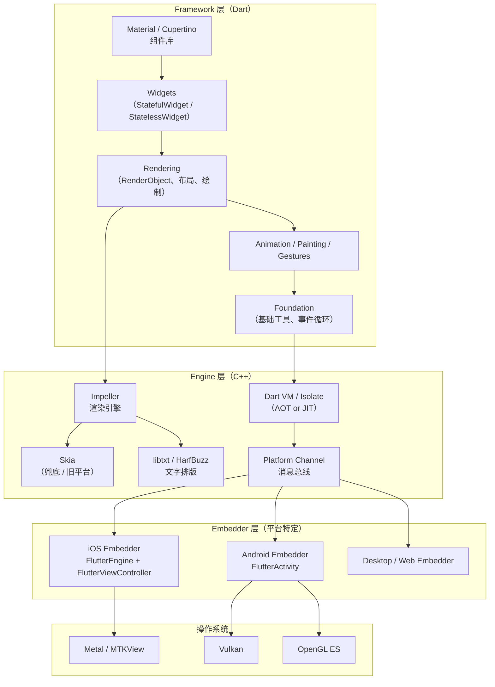
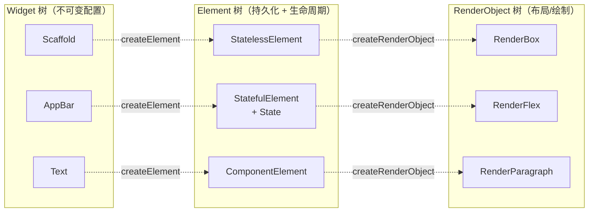
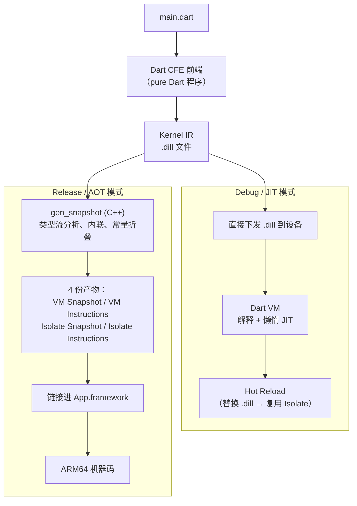
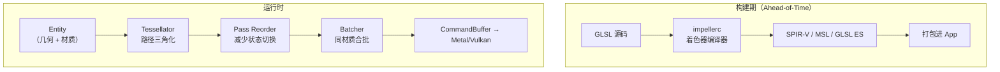
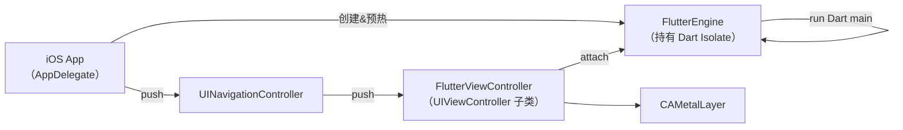
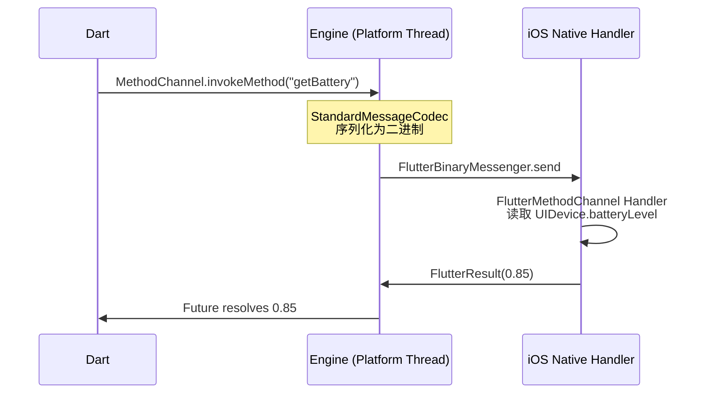

+++
title = "Flutter 详解"
date = '2026-05-02T22:32:27+08:00'
draft = false
weight = 1
tags = ["跨平台", "面试"]
categories = ["跨平台", "面试"]
+++
Flutter 是 Google 推出的跨平台 UI 工具包，用 Dart 写一份代码即可编译到 iOS、Android、Web、macOS、Windows、Linux、嵌入式设备。它与 KMP/RN 的最大区别是"**不映射到原生控件，也不跑在 WebView 里**"——Flutter 自带一套 **Impeller 渲染引擎**，直接向 GPU（Metal / Vulkan）提交绘制命令，从按钮到滚动条的每一个像素都是自己画出来的。

这种"自绘"架构让 Flutter 拥有"**双端像素级一致**"的超能力，也带来了"**iOS 原生设计语言永远慢半拍**"的原罪。在 AI Coding 时代，Flutter 的统一性和 GenUI 生态让它成为 LLM 生成 UI 的理想容器，但端侧 AI、Liquid Glass 等 Apple 独占能力的缺失也让它在 iOS 26 时代面临新的挑战。

本文从架构出发，穿透到 Dart VM 编译链、Impeller 渲染管线、iOS 嵌入原理，再到 AI 时代的机遇与陷阱，是一篇写给 iOS 开发者的 Flutter 体系化导读。

## 一、Flutter 是什么

### 1.1 一句话定义

Flutter 是一套"**声明式 UI + 自绘渲染 + AOT 原生代码**"的跨平台框架：

- **声明式 UI**：UI 是 `build(context) => Widget` 的纯函数结果，状态变 → 重新 build → diff → 更新。
- **自绘渲染**：所有控件都是 Flutter 自己用 Impeller 绘制出来的，**不使用 UIKit / SwiftUI 组件**。
- **AOT 编译**：发布时 Dart 代码被 `gen_snapshot` 编译为 ARM64 机器码，与 C++ 引擎一起链接到 `Flutter.framework` 内。

一句话记忆：**Flutter 不是跑在 iOS 上，它是借 iOS 的一块 CAMetalLayer 画自己的东西。**

### 1.2 和其他跨平台方案的根本差异

| 技术 | UI 落地方式 | 业务逻辑 | 语言 | 一致性 |
|------|----------|----------|------|--------|
| **Flutter** | 自绘引擎（Impeller → Metal/Vulkan） | Dart AOT | Dart | 双端像素一致 |
| **React Native（Old Arch）** | JS 调桥，映射 UIKit/Android View | JS 引擎（Hermes/JSC） | JS/TS | 跟随原生 |
| **React Native（New Arch / Fabric）** | JSI + Fabric（C++）同步调用原生 View | JS/C++ | JS/TS | 跟随原生 |
| **KMP（无 UI）** | 原生 UIKit/SwiftUI | Kotlin → .framework | Kotlin + Swift | 业务一致、UI 原生 |
| **Compose Multiplatform** | Compose 自绘（Skia） | Kotlin Native | Kotlin | 双端一致 |
| **Hybrid（WebView）** | H5 | JS | JS | Web 一致 |

Flutter 走的是最激进的"**绕过系统 UI 栈**"路线。它换来了：

- ✅ **跨端一致**：iOS 和 Android 上的按钮像素级相同，UI Bug 不分平台。
- ✅ **热重载**：Debug 模式下改代码毫秒级生效，UI 状态保留。
- ✅ **高性能动画**：60/120 FPS 自绘，不走 UIKit 主线程。
- ❌ **原生感缺失**：iOS 新设计语言（如 iOS 26 Liquid Glass）必须等 Flutter 团队跟进。
- ❌ **无障碍/系统能力需桥接**：VoiceOver、Live Activities、ARKit 全要走 Platform Channel。

### 1.3 发展历程

| 时间 | 事件 |
|------|------|
| 2015.04 | Google I/O 发布 "Sky"（Flutter 前身），基于 Dart + Skia |
| 2017.05 | Flutter Alpha 0.0.6 |
| 2018.12 | **Flutter 1.0 发布**（Dart 2.1） |
| 2020.05 | Flutter 1.17，引入 Metal 渲染器（iOS） |
| 2021.03 | **Flutter 2.0**，Web 稳定、Null Safety 正式版 |
| 2022.05 | Flutter 3.0，桌面端稳定 |
| 2023.05 | Flutter 3.10，**Impeller 成为 iOS 默认渲染器** |
| 2024.12 | Flutter 3.27，Cupertino 组件大规模升级 |
| 2025.02 | Flutter 3.29，Material 3 `FadeForwardsPageTransitionsBuilder`、`CupertinoSheetRoute` |
| 2025.08 | **Flutter 3.35**，Web 端 Stateful Hot Reload 默认开启、Widget Previews 实验性上线 |
| 2025.11 | Flutter 3.38，`WebParagraph` 初版、MultiPreview、`CupertinoSlidingSegmentedControl.momentary` |
| 2026.02 | Flutter 3.41 发布 |
| 2026 | **GenUI + A2UI 协议**成熟，Dart/Flutter 官方推 "AI-first" 方向 |

## 二、整体架构

Flutter 架构自上而下分四层：**Framework（Dart） → Engine（C++） → Embedder（平台） → OS**。



### 2.1 Framework 层：纯 Dart 构建的 UI 框架

- **`dart:ui`**：引擎暴露给 Dart 的最底层接口（`Canvas`、`Picture`、`Scene`、`FrameCallback`）。
- **Rendering**：`RenderObject` 负责布局（layout）、绘制（paint）、命中测试（hit test）。
- **Widgets**：`StatelessWidget` / `StatefulWidget` 是不可变配置，构建出 `Element → RenderObject` 两棵树。
- **Material / Cupertino**：两套"**主题化组件库**"，前者是 Google Material 3，后者模仿 iOS HIG。

### 2.2 Engine 层：C++ 写的运行时

- 用 C++ 实现 **Dart VM、Impeller 渲染器、文字排版、平台消息分发**。
- 以 `Flutter.framework`（iOS）/ `libflutter.so`（Android）的形式发布，**每个 Flutter App 都会打包一份引擎**。
- 引擎线程模型固定为：**Platform Thread / UI Thread / Raster Thread / IO Thread**（3.35 之后可合并 UI 和 Platform 线程，即 "**Great Thread Merge**"）。

### 2.3 Embedder 层：胶水

- **iOS Embedder**：`FlutterEngine` + `FlutterViewController`，用 `CAMetalLayer` 作为画布，把触摸事件包装成 `PointerData` 送入 Dart。
- **Android Embedder**：`FlutterActivity` / `FlutterFragment`，用 `SurfaceView` / `TextureView`。
- **Desktop / Web Embedder**：Windows GLFW、macOS NSView、Web 用 `CanvasKit` 或 `HTML DOM` 渲染。

### 2.4 三棵树：Widget / Element / RenderObject

Flutter 性能模型的核心在于"**三棵树**"——用"配置-持久化-实际绘制"三层分离实现 O(N) 甚至 O(log N) 的重建。



| 树 | 是否可变 | 关键职责 | 创建开销 |
|----|---------|----------|----------|
| **Widget 树** | 不可变（`@immutable`） | 描述"应该是什么" | 极轻，setState 时大量重建 |
| **Element 树** | 可变，持久化 | 桥接 Widget 与 RenderObject，持有 `State`，负责 diff | 中等，尽量复用 |
| **RenderObject 树** | 可变，持久化 | 布局（`performLayout`）、绘制（`paint`）、命中测试 | 重，几乎不重建 |

**关键算法**：当 `setState` 调用时，Flutter 会对比新旧 Widget 的 `runtimeType` 和 `key`：

1. **类型相同 + key 相同** → 复用 Element 和 RenderObject，只更新属性。
2. **类型不同** → 销毁 Element，创建新的子树。
3. **key 不同** → 即使类型相同也不复用（用于强制刷新或在 List 里保持状态）。

这让 UI 更新永远不会"**重建整棵树**"，而是沿着脏节点做 sublinear reconciliation。

## 三、Dart 编译原理：JIT 与 AOT 双生子

Flutter 的"热重载毫秒级生效 + 发布版本性能堪比 Swift"的秘密，在于 Dart 语言的**双编译模式**。

### 3.1 编译管线全景



### 3.2 Debug 模式（JIT）

1. `flutter run` 时，CFE 把 Dart 源码编译为 `kernel_blob.bin`（`.dill`）。
2. 这个 `.dill` 被直接推送到设备上，**Dart VM 在设备上做懒惰 JIT**。
3. 函数第一次调用时编译，内联缓存（Inline Caching）记录类型反馈，热点函数升级为优化代码。
4. **Hot Reload** 的原理：重新编译 `.dill` → 替换 Isolate 里的函数表 → 调用 `reassemble()` 触发 UI 重建，**Isolate 状态（Map、List、Stream）完全保留**。

这也是为什么 Debug 模式下 Flutter 性能显著低于 Release——它跑的是解释器 + JIT，而不是原生码。

### 3.3 Release 模式（AOT）

`flutter build ios --release` 时：

1. CFE → Kernel IR。
2. **`gen_snapshot`**（C++ 工具）对 Kernel 做**类型流分析（TFA）**：通过全程序分析推断每个变量的可能类型集合，从而删掉无用代码、内联虚调用。
3. 生成 4 份产物：
   - `vm_snapshot_data`：全 App 共享的堆初始化数据。
   - `vm_snapshot_instructions`：VM 公共运行时的 AOT 代码。
   - `isolate_snapshot_data`：主 Isolate 的堆（含常量池、字符串表）。
   - `isolate_snapshot_instructions`：主 Isolate 的 ARM64 代码。
4. 这 4 份产物被打进 **`App.framework/App`**（iOS）或 `libapp.so`（Android），由引擎加载后以 mmap 方式映射。

**关键优化**：Tree Shaking、去虚拟化、逃逸分析、常量折叠，都在 AOT 阶段完成。Release 包里的 Dart 代码已经是**原生 ARM64 指令**，没有解释器介入。

### 3.4 Isolate：Dart 的并发模型

| 概念 | 含义 |
|------|------|
| **Isolate** | Dart 的"线程"抽象，**不共享内存**，通过 `SendPort/ReceivePort` 传消息 |
| **Event Loop** | 每个 Isolate 有自己的事件循环，处理 Microtask 队列 + Event 队列 |
| **Main Isolate** | 承载 UI 的 Isolate，`runApp(MyApp())` 就运行在这里 |
| **Background Isolate** | `Isolate.spawn` 或 `compute()` 创建，用于 JSON 解析、图片解码等重活 |

Flutter 3.35+ 引入了 **Isolate.run + TransferableTypedData**，可以让大 `Uint8List` 零拷贝地跨 Isolate 传递。3.35 还合并了 UI 和 Platform 线程（Great Thread Merge），**FFI 调用不再需要跨线程**，native 回调可以直接在 UI Thread 同步返回。

## 四、渲染引擎 Impeller

Impeller 是 Flutter 团队从 2021 年开始重写的现代渲染引擎，替代了旧的 Skia。从 Flutter 3.10 起，**Impeller 是 iOS 唯一支持的渲染器**（连 `--no-enable-impeller` 开关都在 2024 年被删除）。

### 4.1 为什么要重写？Skia 的痛点

Skia 是 Google 2005 年起的 2D 图形库，也是 Chrome 的渲染底座。但它在 Flutter 上有两个致命问题：

1. **运行时着色器编译（Shader Compilation Jank）**：每次遇到新的绘制组合（比如第一次出现阴影+圆角+模糊），Skia 会在 GPU 线程编译 GLSL/Metal Shader，**编译耗时 200~500ms，直接导致首次动画掉帧**。
2. **不可预测的性能**：Skia 内部做了大量即时缓存决策，同样的代码在不同机型/不同帧上表现不一致。

### 4.2 Impeller 的核心设计



核心创新：

1. **AOT 编译所有着色器**：`impellerc` 在构建期把 GLSL 编译为目标平台字节码（iOS 上是 MSL，Android 上是 SPIR-V）。**运行时零着色器编译**。
2. **显式的 Pipeline State Object**：Impeller 固定了几套 Pipeline，通过组合 Shader + Blend State + Sampler State 覆盖所有绘制场景。
3. **Tessellation-based 路径绘制**：圆角、阴影、贝塞尔曲线都在 CPU 上三角化，再交给 GPU 画三角形。不依赖 SDF、Stencil 等 GPU 特性。
4. **Draw Call 重排**：按"材质-纹理绑定"分组，减少 GPU 状态切换（性能关键）。
5. **显式资源生命周期**：纹理/Buffer 的销毁时机由 Impeller 自己追踪，不依赖 GL 驱动的延迟回收。

### 4.3 iOS 上的渲染链路

```
Dart UI 构建 ──► RenderObject.paint(Canvas) ──► dart:ui PictureRecorder
                                                        │
                                                        ▼
                                                   LayerTree
                                                        │
                                        （上报给 Engine Raster 线程）
                                                        ▼
                                          Impeller Entity Pass
                                                        │
                                                        ▼
                                        Metal CommandBuffer（MTLRenderCommandEncoder）
                                                        │
                                                        ▼
                                               CAMetalLayer Drawable
                                                        │
                                                        ▼
                                              CADisplayLink 提交到屏幕
```

### 4.4 Impeller 的代价

| 维度 | Skia | Impeller |
|------|------|----------|
| 首帧稳定性 | 差（Shader 编译卡顿） | 优 |
| 包体积 | 较小 | **约 +2~3 MB**（预编译 Shader + 新引擎） |
| 内存占用 | 稳定 | 略高（AOT Pipeline 驻留） |
| 复杂自定义 Shader | 灵活 | 受限（需走 `FragmentProgram`） |

**iOS 开发者视角**：Impeller 让 Flutter 的动画终于能和 Core Animation 抗衡，但 Metal Instruments 对 Impeller 的可观测性仍然有限——你看到的是一堆 `IMPE...` 标签，而非语义化的调用栈。

## 五、iOS 嵌入原理：FlutterEngine 与 Platform Channel

对 iOS 开发者来说，最常见的 Flutter 使用方式不是"**纯 Flutter 项目**"，而是"**Add-to-App**"：在现有的 UIKit/SwiftUI App 里嵌入几个 Flutter 页面。

### 5.1 FlutterEngine 与 FlutterViewController



核心概念：

| 类 | 职责 |
|----|------|
| **`FlutterEngine`** | 承载一个 Dart Isolate，可脱离 UI 独立运行（headless），生命周期 ≥ `FlutterViewController` |
| **`FlutterViewController`** | `UIViewController` 子类，持有 `CAMetalLayer`，负责触摸、生命周期、TextInput |
| **`FlutterDartProject`** | 指定 `flutter_assets`、`App.framework` 位置 |

典型预热写法（Swift）：

```swift
@main
class AppDelegate: FlutterAppDelegate {
    lazy var flutterEngine = FlutterEngine(name: "main_engine")
    
    override func application(_ application: UIApplication,
                              didFinishLaunchingWithOptions launchOptions: [UIApplication.LaunchOptionsKey: Any]?) -> Bool {
        flutterEngine.run()
        GeneratedPluginRegistrant.register(with: flutterEngine)
        return super.application(application, didFinishLaunchingWithOptions: launchOptions)
    }
}

func showFlutter() {
    let vc = FlutterViewController(engine: (UIApplication.shared.delegate as! AppDelegate).flutterEngine,
                                   nibName: nil, bundle: nil)
    UIApplication.topVC()?.present(vc, animated: true)
}
```

**预热的意义**：`FlutterEngine.run()` 会启动 Dart Isolate 并初始化 Framework，耗时约 200~500ms（取决于设备）。在 `didFinishLaunching` 里预热可以把这个开销隐藏在启动流程中，用户点进 Flutter 页面时已是"**热身完毕**"状态。

### 5.2 Flutter Engine Group（多实例共享）

一个 App 里经常需要多个 Flutter 页面，甚至混合导航栈（iOS 原生 → Flutter A → iOS 原生 → Flutter B）。如果每个页面都新建一个 `FlutterEngine`，每个要吃掉 **20~30 MB 内存**。

Flutter 2.0+ 引入了 **`FlutterEngineGroup`**：

```swift
let engines = FlutterEngineGroup(name: "group", project: nil)
let engine1 = engines.makeEngine(withEntrypoint: "homePage", libraryURI: nil)
let engine2 = engines.makeEngine(withEntrypoint: "cartPage", libraryURI: nil)
```

多个 Engine **共享同一份 VM Snapshot + Framework**，内存开销减半，但**彼此的 Isolate 仍然隔离**（符合 Dart 内存模型）。

### 5.3 Platform Channel：Dart ↔ Native 的消息总线

Flutter 不允许 Dart 直接调用 ObjC/Swift API（除非走 FFI）。所有平台能力——定位、相机、摇一摇——都通过 **Platform Channel** 传递。



三种 Channel：

| Channel | 用途 |
|---------|------|
| **`MethodChannel`** | 单次方法调用 + 返回值（RPC） |
| **`EventChannel`** | Native 主动推送流数据（电池变化、传感器） |
| **`BasicMessageChannel`** | 自由格式的双向消息，自带编码器 |

**编码器**（`MessageCodec`）：

- `StandardMessageCodec`（默认）：二进制协议，支持 bool/num/String/Uint8List/List/Map。
- `JSONMessageCodec`：文本 JSON。
- `BinaryCodec`：原始 `ByteBuffer`。

**性能陷阱**：Platform Channel 的每一次调用都涉及**序列化 + 线程切换（Dart UI Thread ↔ Platform Thread）**。大量小调用会让 UI 线程阻塞。Flutter 3.35 的 **Great Thread Merge** 和 **Pigeon** 代码生成器可以把开销降到最小。

### 5.4 Pigeon：类型安全的 Channel 代码生成

手写 `MethodChannel` 调用有两大痛点：**参数/返回值字段无类型**、**名字拼错编译期发现不了**。Pigeon 是官方的代码生成工具：

```dart
// pigeons/api.dart
@HostApi()
abstract class BatteryApi {
  int getBatteryLevel();
}
```

生成：

- `lib/battery_api.g.dart`：Dart 侧调用方。
- `ios/Runner/BatteryApi.swift`：Swift 侧待实现的 Protocol。

一次生成、两端类型对齐，是 Add-to-App 场景下**必用**的工具。

### 5.5 FFI：跳过 Channel 直接调 C

对于高频调用（如音视频、加解密），Platform Channel 的序列化开销过高。Dart 提供了 **FFI（Foreign Function Interface）**：

```dart
import 'dart:ffi';
final dylib = DynamicLibrary.process();
final sqrt = dylib.lookupFunction<Double Function(Double), double Function(double)>('sqrt');
print(sqrt(4.0)); // 2.0
```

FFI **零序列化、零线程切换**，在 3.35 的 Thread Merge 之后，Native 函数可以直接在 UI 线程同步返回。这是 Flutter 集成端侧 AI 推理（ONNXRuntime、CoreML）的标准方式。

## 六、状态管理：2025 年的格局

Flutter 本身只提供 `setState`——重建当前 Widget 及其子树。生态里围绕"**如何优雅地管理跨 Widget 状态**"诞生了无数方案，2025 年格局基本收敛为三派：

| 方案 | 适用场景 | 特点 | 代表版本 |
|------|----------|------|---------|
| **Riverpod** | 中大型 App | 编译期安全、Provider 化、AsyncValue 完美支持异步 | v3.x + `@riverpod` macro |
| **BLoC** | 企业级、严格架构 | Event/State 显式、单向数据流、可观测性强 | 9.x |
| **Signals** | UI 级、小组件状态 | 零样板、细粒度响应式 | 2024 Q4 原生推出 |
| **Provider** | 遗留项目 | InheritedWidget 的封装，已进入维护期 | — |
| **GetX** | 快速原型 | 反模式争议多，不建议新项目 | — |

### 6.1 Riverpod（推荐新项目起手）

```dart
@riverpod
Future<User> currentUser(CurrentUserRef ref) async {
  final api = ref.watch(apiProvider);
  return api.fetchUser();
}

class HomePage extends ConsumerWidget {
  @override
  Widget build(BuildContext context, WidgetRef ref) {
    final user = ref.watch(currentUserProvider);
    return user.when(
      loading: () => CircularProgressIndicator(),
      error: (e, st) => Text('Error: $e'),
      data: (u) => Text(u.name),
    );
  }
}
```

优点：**无需 `BuildContext` 即可读写状态**（便于测试）、编译期校验依赖图、自动处理加载/错误态。

### 6.2 BLoC（企业级首选）

```dart
class CounterCubit extends Cubit<int> {
  CounterCubit() : super(0);
  void increment() => emit(state + 1);
}

BlocBuilder<CounterCubit, int>(
  builder: (ctx, count) => Text('$count'),
)
```

BLoC 的价值在于**强制事件/状态分离**，大型团队的代码走向一致。代价是样板代码多、每个 Feature 至少 3 个文件（Bloc/Event/State）。

### 6.3 Signals（细粒度响应式）

```dart
final count = signal(0);
Widget build() => Watch((_) => Text('${count.value}'));
```

Signals 只让"**读过这个值的 Widget**"重建，不触发整个 `State`，在频繁变更场景（比如输入框字符计数）性能最佳。

### 6.4 实际经验

**不要神化任一方案**。真正稳定的 Flutter 项目多采用混合：

- 全局跨页面状态、异步数据 → **Riverpod / BLoC**
- 页面内 UI 局部态（展开/折叠、选中项）→ **setState / Signals**
- 依赖注入 → Riverpod 的 `Provider`

## 七、AI Coding 时代：Flutter 的优势与劣势

2024 年起，Cursor / Claude Code / Gemini CLI 等 AI IDE 爆发，"LLM 生成代码的质量"成为技术选型的新维度。Flutter 在这一时代呈现出鲜明的双面性。

### 7.1 Flutter 在 AI 时代的五大优势

#### 优势 1：声明式 + 单文件语言，天然适合 LLM 生成

Dart 是**纯声明式、强类型、单一语言栈**。相比之下：

- iOS 原生需要 Swift + ObjC + C + CMake + Xcode 配置，LLM 很容易在工程文件（`.pbxproj`）上出错。
- RN 需要 JS/TS + ObjC/Kotlin + Gradle/Podfile，多栈切换。
- Flutter 生成一个完整 App 只需写 `.dart` 文件 + `pubspec.yaml`，**两个文件就能跑**。

实测中，Claude Sonnet / GPT-5 生成"一个带登录和列表的 App"的正确率：**Flutter > RN > iOS 原生**。

#### 优势 2：GenUI + A2UI 协议让 UI 本身成为 AI 的返回值

2025 年 Flutter 官方发布 **GenUI**：LLM 可以用 JSON 结构化描述 UI（按钮、表单、图表），Flutter 在客户端实时反序列化为 Widget Tree。配合 Google 的 **A2UI（AI-to-UI）协议**，Gemini 可以直接返回一个"带输入框和滑块的聊天响应"，而不是一段 Markdown。

```json
{
  "type": "column",
  "children": [
    {"type": "text", "content": "请选择金额"},
    {"type": "slider", "min": 0, "max": 1000, "onChange": "quote"}
  ]
}
```

这让 Flutter 在 **Agent UI / 可变形对话界面**赛道上领先同行。iOS 虽然有 FoundationModels 的 `@Generable`，但缺乏对应的 UI 序列化协议。

#### 优势 3：Hot Reload = LLM 的"即时反馈回路"

Cursor / Claude Code 的核心工作流是"**生成 → 运行 → 看错误 → 修复**"。Flutter 的 Hot Reload 让这个回路降到毫秒级：

- Dart 改动 < 500ms 生效，**无需重启**、**状态保留**。
- 3.35 起 Web 平台也默认 Stateful Hot Reload。
- Widget Previews（3.35 实验、3.38 成熟）让 LLM 甚至可以只预览单个组件。

对比 iOS：Swift 编译一次 30 秒到几分钟，iOS Simulator 重启也要 10+ 秒。Xcode Previews 虽快，但对复杂依赖经常 build failed。

#### 优势 4：跨端一致性 = LLM 的"单一事实源"

LLM 最难处理的是"**同一业务逻辑在 iOS 和 Android 上有微妙差异**"。Flutter 的"像素级一致"让 LLM 只需理解一个代码库、一个 UI 模型，不必在两套规范间切换。

#### 优势 5：庞大的公共训练语料

Pub.dev 上 5 万+ 公开包、GitHub 上数百万 Flutter 仓库、Stack Overflow 大量问答——LLM 对 Flutter 的掌握度在跨平台框架中**仅次于 RN**。iOS 原生的 SwiftUI 反而是相对新的技术（iOS 13+），训练语料少，LLM 生成 SwiftUI 的错误率显著高于 Flutter。

### 7.2 Flutter 在 AI 时代的四大劣势

#### 劣势 1：iOS 原生设计语言永远慢半拍（iOS 26 Liquid Glass 之痛）

Apple 每年 WWDC 都会更新 HIG。2025 年 iOS 26 推出 **"Liquid Glass"** 设计语言——实时反射、折射、动态光照，深度依赖 Metal 管线和 SwiftUI 新 API。

Flutter 官方只能**等**：

1. 先等 Cupertino 库跟进新样式。
2. 再等 Impeller 支持新的着色器效果。
3. 最后等各 Plugin 作者更新。

结果就是 Flutter App 在 iOS 26 上看起来像"**穿着旧皮肤的角色**"，Apple 从未给它"Look & Feel"的一等公民待遇。**LLM 再强也生成不出它根本不知道的 API**。

#### 劣势 2：端侧 AI 与系统独占能力缺失

2025~2026 年 iOS 的关键 AI 能力：

| 能力 | iOS 原生支持 | Flutter 支持 |
|------|-------------|-------------|
| **FoundationModels（端侧 LLM）** | SwiftUI 原生 | ❌ 需自己写 Swift Plugin |
| **Writing Tools** | 免费继承 | ❌ TextField 拿不到 |
| **Live Activities / Dynamic Island** | WidgetKit | 部分支持（需 Native） |
| **App Intents / Siri Shortcuts** | 编译期注解 | ❌ |
| **ARKit 6 / RoomPlan** | 原生 | ❌ Plugin 长期滞后 |
| **Core NFC** | 原生 | 🟡 Plugin 不稳定 |

在"AI 设备"趋势下，iOS 越来越多能力依赖系统级集成（端侧 LLM、隐私沙盒、神经引擎）。Flutter 的"**大一统引擎**"模型与 Apple 的"**系统级 AI**"路线存在根本矛盾。

#### 劣势 3：LLM 仍然高频写出过时/反模式代码

尽管 Flutter 语料丰富，但官方 API 演进极快：

- `RaisedButton` → `ElevatedButton`（2020 年）
- `FlatButton` → `TextButton`
- `ScaffoldMessenger.of(context).showSnackBar`（旧版是 `Scaffold.of`）
- Material 2 → Material 3（2024 年切换默认）
- `Provider` → `Riverpod`

LLM 的训练语料参差不齐，经常生成 2019~2021 年的 API。社区调研显示 **79% 的 Flutter 开发者使用 AI 助手，但 46% 表示不信任 AI 对关键任务（如调试、Bug 修复）的准确性**，形成所谓的"**Verification Tax（验证税）**"。

#### 劣势 4：Instruments 和 Xcode 调试链路薄弱

当 AI 生成的代码出 Bug 时，iOS 原生开发者有 Xcode + Instruments + LLDB 的强大链路。Flutter 里：

- Stack trace 经常穿过 Dart VM、Engine C++、Impeller 三层，难以定位。
- Xcode Instruments 看不懂 Impeller 的渲染命令。
- DevTools 虽然专业，但 LLM 不擅长读它的 JSON 报告。

这让 AI 在 Flutter 上的**修复能力**明显弱于**生成能力**。

### 7.3 决策矩阵：AI 时代要不要选 Flutter？

| 项目类型 | 推荐 |
|---------|------|
| **创业 MVP、快速迭代、多端并重** | ✅ **Flutter**，AI 生成效率最高 |
| **Agent/对话式 App、UI 动态可变** | ✅ **Flutter + GenUI/A2UI** |
| **重视 iOS 原生观感、Liquid Glass、HIG 最新规范** | ❌ 用 **SwiftUI + Swift Concurrency** |
| **深度端侧 AI（Apple Intelligence / CoreML）** | ❌ **原生**，Flutter Plugin 永远滞后 |
| **超大型存量 iOS App 里加几个页面** | ⚠️ **Flutter Add-to-App**，注意内存 + 设计一致性 |
| **游戏 / 图像处理 / AR** | ❌ 用 **Unity / 原生 Metal** |

## 八、工程最佳实践

### 8.1 目录结构（推荐）

```
lib/
  main.dart
  app/                  // 应用级配置（路由、主题、Provider 根）
  core/                 // 通用基础（Network、Logger、Storage）
  features/
    home/
      data/             // Repository、DataSource
      domain/           // Entity、UseCase
      presentation/     // Widget、Controller
    auth/
      ...
  shared/               // 跨 feature 共享的 Widget、工具
  l10n/                 // 国际化
```

这是"**Clean Architecture + Feature-first**"的典型布局，社区主流写法。

### 8.2 性能优化清单

1. **避免在 `build()` 里做重活**：build 可能每帧都被调用，重逻辑放到 `initState` 或 `useMemoized`。
2. **善用 `const` 构造器**：Dart 编译器会复用 const 实例，**整棵子树跳过 rebuild**。
3. **`RepaintBoundary`**：给频繁重绘的子树（如动画）加边界，隔离绘制区域。
4. **`ListView.builder` / `SliverList`**：永远不要用 `Column(children: list)` 渲染长列表。
5. **异步解码图片**：大图走 `precacheImage` 或 `Image.network` 的 `cacheWidth/cacheHeight`。
6. **用 `compute()` / `Isolate.run` 解析大 JSON**：避免主 Isolate 卡顿。
7. **Release 模式测性能**：Debug 模式下 JIT 性能不代表真实体验。

### 8.3 Add-to-App 避坑

1. **全局共享一个 `FlutterEngine`**（或 `FlutterEngineGroup`），不要每次 present 都 new。
2. **Plugin 注册时机**：`GeneratedPluginRegistrant.register(with:)` 必须在 `engine.run()` 之后。
3. **内存管理**：Flutter 引擎常驻 20~30MB，低端机上需要监控 `UIApplicationDidReceiveMemoryWarning` 时主动释放 Engine。
4. **生命周期对齐**：`FlutterViewController.viewDidDisappear` 时引擎**不会**自动停止 Dart 执行，Isolate 仍在跑定时器。需要手动通知 Dart 侧 pause。
5. **iOS Deployment Target**：3.29+ 要求 iOS 12+，3.38+ 可能进一步抬高。
6. **Pigeon 强制使用**：手写 Channel 在大型项目维护成本太高。
7. **不要混用 Flutter 路由和 Native 导航**：选一个作为主导航器。主流方案是"**Native 为主，Flutter 页面作为叶子**"。

### 8.4 CI / 发布

- **Flavor**：用 `--flavor dev --flavor prod` 区分环境，iOS 对应 Xcode Scheme。
- **`--obfuscate --split-debug-info`**：Release 包必加，混淆 Dart 符号 + 输出符号文件用于线上堆栈还原。
- **`dart pub deps --json` + 审计工具**：检测依赖的许可证和 CVE。
- **崩溃：Sentry / Firebase Crashlytics**：都支持 Dart stack 符号化，构建时上传 `app.ios-arm64.symbols`。

### 8.5 AI Coding 集成建议

1. **给 LLM 提供 `pubspec.yaml` 上下文**：它才能知道项目用的是 Riverpod 还是 BLoC。
2. **配置 `analysis_options.yaml`**：严格的 lint 能在 LLM 生成后立刻发现 API 过时、null safety 问题。
3. **用 Widget Preview（3.35+）做粒度最小的单元迭代**：LLM 改一个组件 → Preview 立刻验证。
4. **抽象出 Repository 接口**：LLM 在面对"**接口 + mock 实现**"时生成质量远高于直接操作数据库。
5. **业务逻辑走 Pigeon + FFI**：避免让 LLM 手写易错的 `MethodChannel` 字符串。

## 九、参考资料

- [Flutter 官方文档](https://docs.flutter.dev/)
- [Inside Flutter](https://docs.flutter.dev/resources/inside-flutter)
- [Impeller 渲染引擎](https://docs.flutter.dev/perf/impeller)
- [Platform Channels](https://docs.flutter.dev/platform-integration/platform-channels)
- [Add Flutter to an existing iOS app](https://docs.flutter.dev/add-to-app/ios)
- [Flutter 3.35 Release Notes](https://docs.flutter.dev/release/release-notes/release-notes-3.35.0)
- [Flutter 3.38 Release Notes](https://docs.flutter.dev/release/release-notes/release-notes-3.38.0)
- [How Dart and Flutter are thinking about AI in 2026](https://blog.flutter.dev/how-dart-and-flutter-are-thinking-about-ai-in-2026-e2fd64e1fdd0)
- [dart-lang/sdk: Dart VM AOT docs](https://github.com/dart-lang/sdk/blob/main/runtime/docs/aot.md)
- [flutter/engine: Impeller README](https://github.com/flutter/engine/blob/main/impeller/README.md)
