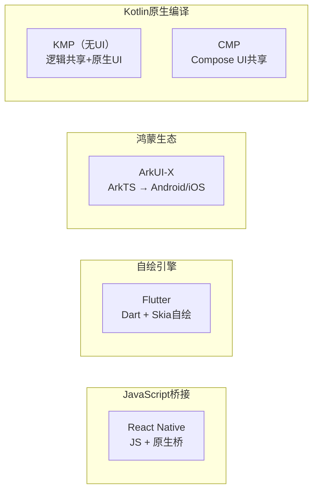
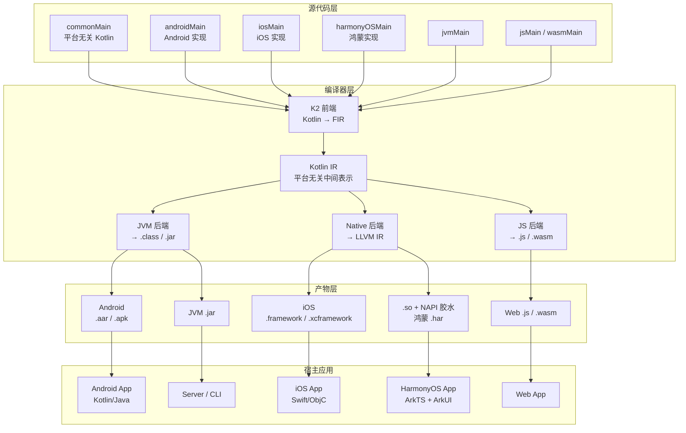
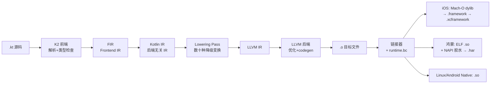
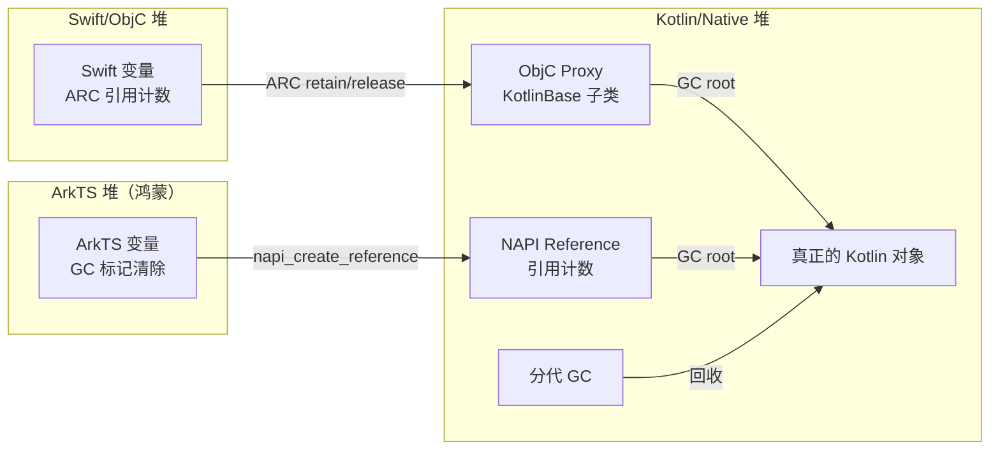
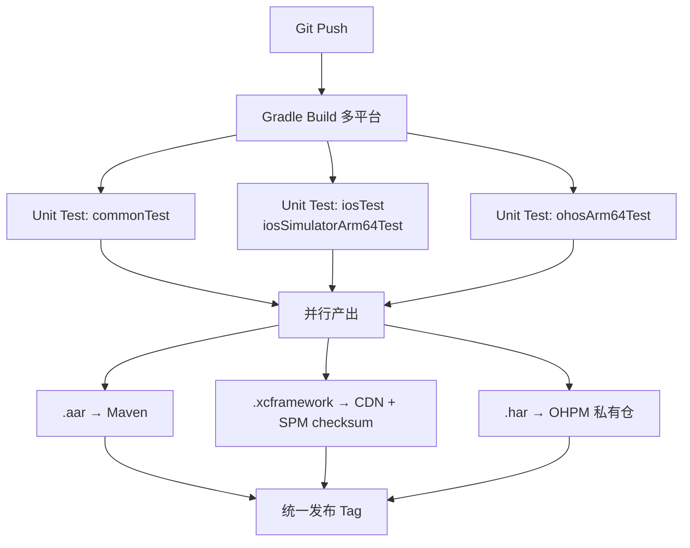

+++
title = "KMP（Kotlin Multiplatform）详解"
date = '2026-05-02T22:32:27+08:00'
draft = false
weight = 2
tags = ["跨平台", "面试"]
categories = ["跨平台", "面试"]
+++
KMP（Kotlin Multiplatform）是 JetBrains 推出的跨平台代码共享方案。它与 Flutter、React Native 的"一套代码一套 UI"思路不同，走的是"**业务逻辑共享，UI 原生**"的路线：Kotlin 写的网络、数据库、ViewModel、业务规则等代码编译成 iOS/Android/HarmonyOS/Web 可直接使用的二进制产物，而 UI 仍然由各平台原生框架（SwiftUI/UIKit、Jetpack Compose、ArkUI、DOM/Compose Web）自己实现。2023 年 11 月 KMP 正式 Stable；2024 年 6 月华为开发者大会（HDC 2024）上 JetBrains 与华为合作宣布 Kotlin 原生支持 HarmonyOS NEXT，KMP 正式扩展到"Android + iOS + 鸿蒙 + Web"的四端矩阵；随后 Compose Multiplatform for iOS 经历 Alpha → Beta 演进，使得"连 UI 也可以一起共享"成为可选项。

对 iOS 开发者而言，KMP 的意义在于：**Android/鸿蒙同事写的 Kotlin 代码你可以像 Swift 一样调用**，而代价只是多一个 `XCFramework` 和一点桥接代码。本文从架构开始，一路讲到编译原理、内存模型、iOS/鸿蒙互操作细节与工程最佳实践。

## 一、KMP 是什么

### 1.1 一句话定义

KMP 是 Kotlin 官方的跨平台编译工具链，允许你用 Kotlin 写一份"业务逻辑"代码，编译到多个目标平台：

- **JVM**：Android App、服务端、CLI 工具
- **Apple Native**：iOS、macOS、watchOS、tvOS（通过 Kotlin/Native + LLVM 编译为 Mach-O framework）
- **HarmonyOS Native**：HarmonyOS NEXT / OpenHarmony（通过 Kotlin/Native 编译为 `.so`，再以 NAPI 桥接到 ArkTS）
- **其他 Native**：Linux、Windows、MinGW
- **JS / Wasm**：浏览器、Node.js、Wasm 宿主

- **共享的是什么**：网络、数据库、缓存、业务模型、ViewModel、日志、埋点……一切"非 UI"的逻辑。
- **不共享的是什么**：原生 UI、系统 API 调用（相机、蓝牙等）需要用 `expect/actual` 机制分平台实现。

### 1.2 KMP、KMM、CMP 的关系

KMP 家族里有三个容易混淆的名字：

| 名称 | 全称 | 定位 |
|------|------|------|
| KMP | Kotlin Multiplatform | 跨平台代码共享的**通用**技术，覆盖 JVM/Native/JS/Wasm |
| KMM | Kotlin Multiplatform Mobile | 2022 年的旧称，仅指"Android + iOS 移动端代码共享"场景，**已并入 KMP，名字废弃** |
| CMP | Compose Multiplatform | 基于 KMP 的**UI 框架**，让 Jetpack Compose 可以运行在 iOS/Desktop/Web |

简单记忆：KMP 是"**共享底层**"，CMP 是"**共享 UI**"。二者可单独使用，也可叠加使用。

### 1.3 与其他跨平台方案对比



| 维度 | KMP | CMP | Flutter | React Native | ArkUI-X |
|------|-----|-----|---------|--------------|---------|
| 编程语言 | Kotlin | Kotlin | Dart | JS/TS | ArkTS（TS 超集） |
| UI 方案 | 原生 | Compose 自绘 | Skia/Impeller 自绘 | 原生映射 | ArkUI 自绘 + 声明式 |
| 共享范围 | 业务逻辑 | 逻辑 + UI | 逻辑 + UI | 逻辑 + UI | 逻辑 + UI |
| 覆盖平台 | **Android/iOS/鸿蒙/Web/Desktop/Server** | Android/iOS/Desktop/Web | Android/iOS/Desktop/Web/鸿蒙 | Android/iOS/鸿蒙 | 鸿蒙/Android/iOS |
| 包体积增量（iOS） | 3-8 MB（仅逻辑） | 10-20 MB（含渲染栈） | 5-10 MB | 10+ MB | 15+ MB |
| 性能 | 接近原生 | 接近原生 | 接近原生 | 桥消息瓶颈 | 接近原生 |
| 调试 | Xcode + IDE 都可 | IDE 为主 | DevTools | RN Debugger | DevEco Studio |
| 学习曲线 | iOS 侧几乎无感 | 需掌握 Compose | 全新技术栈 | 全新技术栈 | 需学 ArkTS |
| 官方态度 | Google/JetBrains/华为 主推 | JetBrains 主推 | Google 主推 | Meta 维护 | 华为主推 |

KMP 的**最大优势**是"**渐进式 + 多端对齐**"——你可以只把一个网络模块换成 KMP，其他代码继续用 Swift/ArkTS，风险极低。而且它是目前唯一能在"**Android + iOS + 鸿蒙**"三端同时用**原生 UI**的方案（Flutter 和 RN 都要带一层运行时）。这也是为什么它在"大型成熟 App"里的接受度高于 Flutter/RN，并且被华为选为鸿蒙生态的官方代码共享方向之一。

### 1.4 发展历程

| 时间 | 事件 |
|------|------|
| 2017 | Kotlin/Native 初版发布，IR 编译到 LLVM 的实验性支持 |
| 2019 | Multiplatform 概念首次亮相（Alpha） |
| 2020 | 引入 `expect/actual` 语法，Native Memory Model 1.0（冻结模型） |
| 2021 | Kotlin 1.5，Multiplatform 进入 Beta |
| 2022 | 引入新内存模型（New Memory Model），放弃"共享对象必须 Freeze"的限制 |
| 2023.11 | Kotlin 1.9.20，**KMP 正式 Stable** |
| 2024.02 | Compose Multiplatform 1.6.0 发布，iOS 支持进入 Alpha |
| 2024.05 | Kotlin 2.0，K2 编译器默认开启，编译速度提升 2× |
| 2024.06 | HDC 2024，华为与 JetBrains 宣布 Kotlin 原生支持 **HarmonyOS NEXT**（Preview） |
| 2024.11 | Compose Multiplatform 1.7，iOS 进入 **Beta** |
| 2025 | Compose Multiplatform for iOS 稳定演进，K2 成为唯一编译器；KMP for HarmonyOS 工具链持续完善 |

## 二、整体架构



### 2.1 三个核心概念

#### SourceSet（源集）

KMP 工程不是"一份代码"，而是"**多份代码的 DAG**"：

```
commonMain               ← 所有平台共享
├── androidMain          ← 只给 Android 用
├── appleMain            ← iOS/macOS/watchOS 共享的 Apple 平台逻辑
│   └── iosMain          ← 只给 iOS 用
│       ├── iosArm64Main ← iOS 真机
│       ├── iosX64Main   ← iOS 模拟器（Intel）
│       └── iosSimulatorArm64Main ← iOS 模拟器（M 芯片）
├── harmonyOSMain        ← 只给鸿蒙用（Preview 阶段目标名为 ohosArm64）
├── jvmMain
└── jsMain
```

编译 iOS 时，`commonMain + appleMain + iosMain + iosArm64Main` 会被一起编译；`androidMain`、`harmonyOSMain`、`jvmMain` 不会被看到。编译鸿蒙时，只有 `commonMain + harmonyOSMain + ohosArm64Main` 会进入编译流水线。

#### expect / actual

当 `commonMain` 需要用平台能力（如获取当前时间戳、UUID、屏幕尺寸）时，使用 `expect` 声明接口，各平台用 `actual` 实现：

```kotlin
// commonMain
expect class Platform() {
    val name: String
    fun currentTimestamp(): Long
}

// androidMain
actual class Platform {
    actual val name: String = "Android ${android.os.Build.VERSION.SDK_INT}"
    actual fun currentTimestamp(): Long = System.currentTimeMillis()
}

// iosMain
import platform.Foundation.NSDate
import platform.Foundation.timeIntervalSince1970

actual class Platform {
    actual val name: String = "iOS ${UIDevice.currentDevice.systemVersion}"
    actual fun currentTimestamp(): Long =
        (NSDate().timeIntervalSince1970 * 1000).toLong()
}

// harmonyOSMain（通过 NAPI 调用鸿蒙系统能力）
import ohos.systemCapability.deviceInfo

actual class Platform {
    actual val name: String = "HarmonyOS ${deviceInfo.osFullName}"
    actual fun currentTimestamp(): Long = platform.posix.time(null) * 1000L
}
```

`expect/actual` 和"接口+实现"的区别：前者是**编译期**匹配（不产生 vtable 调用），后者是运行期多态。一个 `expect class` 必须在每个编译目标都能找到一个且只有一个 `actual`，否则编译失败。

#### Target（编译目标）

Target 是 KMP 里的"平台实例"。一个典型的"Android + iOS + 鸿蒙"三端工程会声明：

```kotlin
kotlin {
    androidTarget()

    iosX64()            // Intel 模拟器
    iosArm64()          // iOS 真机
    iosSimulatorArm64() // M 芯片模拟器

    // HarmonyOS NEXT 目标（Preview 阶段，需启用实验性插件）
    ohosArm64 {
        binaries.sharedLib {
            baseName = "shared"  // 生成 libshared.so
        }
    }
}
```

三个 iOS target 分别会产出三份独立的 `.framework`，最终通过 `xcodebuild -create-xcframework` 合成一个 `.xcframework`；`ohosArm64` target 会产出鸿蒙的 `libshared.so`，需要再打包进 `.har` 供 DevEco Studio 工程使用。

### 2.2 典型工程结构

```
my-kmp-project/
├── build.gradle.kts
├── shared/                     # KMP 共享模块
│   ├── build.gradle.kts
│   └── src/
│       ├── commonMain/kotlin/  # 业务逻辑
│       ├── commonTest/kotlin/
│       ├── androidMain/kotlin/
│       ├── androidUnitTest/kotlin/
│       ├── iosMain/kotlin/
│       ├── iosTest/kotlin/
│       ├── harmonyOSMain/kotlin/   # 鸿蒙实现
│       └── harmonyOSTest/kotlin/
├── androidApp/                 # Android 宿主
│   └── build.gradle.kts
├── iosApp/                     # iOS 宿主（纯 Swift 工程）
│   ├── iosApp.xcodeproj
│   └── iosApp/
│       ├── ContentView.swift   # import shared
│       └── Info.plist
└── harmonyApp/                 # 鸿蒙宿主（DevEco Studio 工程）
    ├── build-profile.json5
    ├── oh-package.json5
    └── entry/
        ├── src/main/ets/       # ArkTS 代码
        │   └── pages/Index.ets # import shared via NAPI
        └── src/main/cpp/       # NAPI 胶水层
```

## 三、Kotlin/Native 编译流程

Kotlin 到 iOS `.framework`、到鸿蒙 `.so` 的编译链路比想象中复杂。了解它可以帮你在遇到"找不到符号"、"iOS 包过大"、"调试符号丢失"、"鸿蒙 NAPI 桥接失败"等问题时定位根因。

### 3.1 完整编译链路



iOS 与鸿蒙共享前八个阶段，只在**链接阶段**分叉：iOS 链接器产出 Mach-O 格式的 `.framework`，鸿蒙产出 ELF 格式的 `.so`（因为 HarmonyOS NEXT 基于 OpenHarmony 内核，可执行格式兼容 Linux）。

### 3.2 关键阶段详解

#### 1. K2 与 FIR

K2 是 Kotlin 2.0 默认启用的新前端。它抛弃了老版 PSI（Program Structure Interface）树的反复遍历模式，改用 **FIR（Frontend IR）**——一次构建，多次变换。编译速度提升约 2×，类型推断也更稳定。

#### 2. Kotlin IR

Kotlin IR 是**和后端无关**的中间表示，设计上类似 LLVM IR 但更高层（保留 class、属性、挂起函数等 Kotlin 特有概念）。同一份 IR 可以喂给 JVM、Native、JS 三个后端。

#### 3. Lowering

Native 后端比 JVM 后端走更多的 lowering pass：

- **挂起函数降级**：`suspend fun` 转为状态机 + 连续传递风格（CPS）。
- **Inline 类展开**：`value class` 在有必要时消除装箱。
- **默认参数桩生成**：生成 `$default` 函数支持默认值。
- **协变反协变桥接**：处理泛型方差。
- **内存管理插桩**：自动插入 `Kotlin_mm_safePointFunctionPrologue` 等 GC 安全点调用。

#### 4. LLVM IR 生成

Kotlin IR 被进一步降级为 LLVM IR：Kotlin 的对象头（`ObjHeader`）、类型描述符（`TypeInfo`）、vtable 等都在此阶段生成为 LLVM 结构体和全局变量。

#### 5. 链接与 Runtime

Kotlin/Native 有自己的 `runtime.bc`（LLVM bitcode），包含：

- **Memory Manager**：对象分配与 GC。
- **Interop Runtime**：
  - iOS：`$sk` 前缀的导出函数、ObjC 消息转发桩、`KotlinBase` 基类元数据。
  - 鸿蒙：NAPI 导出函数、`napi_env` 管理、ArkTS 值 ↔ Kotlin 对象的双向引用表。
- **Coroutines Runtime**：协程调度、Continuation 实现。
- **Standard Library**：`kotlin.collections` 等的 Native 实现。

链接器把用户代码 `.o` 与 `runtime.bc` 合并，iOS 目标产出 Mach-O dylib 包装成 `.framework`；鸿蒙目标产出 ELF `.so`，再由配套工具生成 NAPI 注册入口（`napi_module_register`），最终打成 `.har` 归档。

### 3.3 klib：Kotlin 的"中间二进制"

`.klib` 是 Kotlin/Native 自己的"预编译库"格式，类似 Swift 的 `.swiftmodule + .o` 组合。它包含：

- `default/ir/`：序列化的 Kotlin IR（二进制）。
- `default/manifest`：平台、ABI 版本、依赖信息。
- `default/targets/ios_arm64/native/`：已编译的 `.bc`。
- `default/targets/ohos_arm64/native/`：鸿蒙架构对应的 `.bc`。

klib 的存在让"**依赖库不必每次从源码编译**"。Gradle 下载 Ktor、SQLDelight 等依赖时拉取的就是 `.klib`。

### 3.4 Fat Framework 与 XCFramework

一个"能同时在真机和模拟器运行"的 iOS 产物有两种方式：

- **Fat Framework**：用 `lipo` 把多架构合并进同一个 `.framework`，一个 `.framework` 多 slice。**Apple 从 Xcode 12 开始不推荐**（模拟器和真机存在 arm64 架构冲突）。
- **XCFramework**：每个平台 / 架构一个独立 `.framework`，外层用元数据描述，**官方推荐**。

KMP 1.5.30 起原生支持 XCFramework：

```kotlin
// shared/build.gradle.kts
import org.jetbrains.kotlin.gradle.plugin.mpp.apple.XCFramework

kotlin {
    val xcf = XCFramework("Shared")
    listOf(iosX64(), iosArm64(), iosSimulatorArm64()).forEach {
        it.binaries.framework {
            baseName = "Shared"
            xcf.add(this)
        }
    }
}
```

执行 `./gradlew assembleSharedXCFramework` 后，产物在 `shared/build/XCFrameworks/release/Shared.xcframework`。

## 四、Kotlin ↔ Swift 互操作原理

互操作是 KMP 体验的核心。Kotlin 编译器会为每一个 iOS `framework` 生成一份 **Objective-C 头文件**（`Shared.framework/Headers/Shared.h`），Swift 通过这个头文件看到 Kotlin 的类。

### 4.1 类型映射规则


| Kotlin | Objective-C（生成） | Swift（看到） |
|--------|---------------------|--------------|
| `class Foo` | `@interface Foo : KotlinBase` | `class Foo : KotlinBase` |
| `interface Bar` | `@protocol Bar` | `protocol Bar` |
| `data class User` | `@interface User : KotlinBase` | `class User` |
| `sealed class State` + 子类 | `@interface State` + `@interface State.Loading` | 同上，子类作为嵌套类型 |
| `object Singleton` | `@interface Singleton` + `+ (instancetype)shared` | `Singleton.shared` |
| `Int`, `Long`, `Double` | `int32_t`, `int64_t`, `double` | `Int32`, `Int64`, `Double`（注意：**不是 `Int`**） |
| `String` | `NSString *` | `String` |
| `List<T>` | `NSArray<T> *` | `[T]` |
| `Map<K, V>` | `NSDictionary<K, V> *` | `[K: V]` |
| `Set<T>` | `NSSet<T> *` | `Set<T>` |
| `Unit` | `void` | `Void` |
| `Nothing` | `void` | `Never` |
| `T?` | `T * _Nullable` | `T?` |
| `Array<Int>` | `KotlinArray<KotlinInt *> *` | `KotlinArray<KotlinInt>` |
| `enum class Color` | `@interface Color : KotlinEnum` | `class Color`（**不是 Swift enum**） |
| `fun f(x: Int): Int` | `- (int32_t)fWithX:(int32_t)x` | `func f(x: Int32) -> Int32` |
| `suspend fun` | 带 completionHandler 的方法 | `async` 方法 |
| `Flow<T>` | 需要手动桥接（SKIE 或 Flow wrapper） | `AsyncSequence` / Combine Publisher |

### 4.2 几个典型的"坑"

#### Int 不是 Int

Kotlin 的 `Int` 是 32 位，Swift 的 `Int` 是 64 位。KMP 生成的 Swift API 里 Kotlin `Int` 映射为 `Int32`：

```swift
// Kotlin: fun add(a: Int, b: Int): Int
let result: Int32 = shared.add(a: 1, b: 2)  // 注意是 Int32
```

如果要和 Swift 的 `Int` 互通，Kotlin 侧应使用 `Long`（→ `Int64`）或者在桥接层做一次转换。

#### sealed class 不是 Swift enum

Kotlin 的 `sealed class` 在 Swift 里看到的是一个基类 + 若干子类，**不能直接 switch**：

```swift
// 需要类型判断 + as 转换
if let loading = state as? State.Loading {
    // ...
} else if let success = state as? State.Success {
    // ...
}
```

想要 Swift 原生 enum 体验需要借助 **SKIE**（第三方工具），它会为每个 sealed class 生成 Swift enum 包装。

#### 包名变成前缀

Kotlin 类名 `com.example.User` 在 ObjC 头里会变成 `ComExampleUser`。可以通过注解定制：

```kotlin
@ObjCName("User", exact = true)
class User(val name: String)
```

加上 `exact = true` 后在 Swift 里就叫 `User`，否则默认带包名前缀。

### 4.3 协程与 Swift 并发

Kotlin 1.8.20 起，`suspend` 函数在 iOS framework 的头文件中会自动生成 `async` 版本：

```kotlin
// Kotlin
suspend fun fetchUser(id: String): User
```

```swift
// Swift 自动获得 async 方法
let user = try await shared.fetchUser(id: "42")
```

背后的原理是：编译器给每个 `suspend fun` 生成一个"带 completionHandler 的 ObjC 方法"，Swift 再通过**自动完成处理器转换（automatic completion handler translation）**把它当作 `async` 使用：

```objc
// 生成的 ObjC 方法
- (void)fetchUserWithId:(NSString *)id
      completionHandler:(void (^)(User * _Nullable, NSError * _Nullable))completionHandler;
```

`NSError` 分支对应 Kotlin 侧抛出的"标注为 `@Throws`"的异常。**没有标注 `@Throws` 的异常一旦发生会直接导致 app 崩溃**，这是新手最容易踩的坑。

### 4.4 Flow 的桥接

`Flow<T>` 是 KMP 协程的响应流，但 Swift 没有直接对应物。常见做法：

**方案 1：手写 Wrapper**

```kotlin
class FlowWrapper<T : Any>(private val origin: Flow<T>) {
    fun subscribe(
        onNext: (T) -> Unit,
        onComplete: () -> Unit,
        onError: (Throwable) -> Unit
    ): Closeable {
        val job = CoroutineScope(Dispatchers.Main).launch {
            try {
                origin.collect { onNext(it) }
                onComplete()
            } catch (e: Throwable) {
                onError(e)
            }
        }
        return Closeable { job.cancel() }
    }
}
```

**方案 2：SKIE（推荐）**

SKIE（Swift Kotlin Interface Enhancer）由 Touchlab 开发，它在 KMP 编译后插入一层"Swift 编译器插件"，把 Flow 自动转为 `AsyncSequence`：

```swift
for try await user in shared.userFlow {
    print(user)
}
```

并且把 sealed class 转为 Swift enum：

```swift
switch state {
case .loading: ...
case .success(let user): ...
case .error(let e): ...
}
```

SKIE 是目前 KMP 社区事实标准，强烈建议引入。

### 4.5 Kotlin ↔ ArkTS（鸿蒙）互操作

鸿蒙侧的互操作原理和 iOS 完全不同。iOS 是"Kotlin → ObjC → Swift"三层桥接（编译器自动生成 ObjC 头），鸿蒙是"**Kotlin → C ABI → NAPI → ArkTS**"四层桥接。

#### NAPI 简介

NAPI（Native API）是 HarmonyOS 的 C 侧扩展机制，和 Node.js 的 N-API 设计几乎一致：

- ArkTS 侧通过 `import nativeBinding from 'libshared.so'` 加载动态库。
- C 侧通过 `napi_module_register` 注册模块，导出函数签名形如 `napi_value MyFunc(napi_env env, napi_callback_info info)`。
- 参数和返回值通过 `napi_value` 传递，这是一个 opaque handle，需要用 `napi_get_value_string_utf8` / `napi_create_int32` 等 API 解包打包。

#### 编译器为鸿蒙生成什么

KMP for HarmonyOS 的工具链会为每个 `@OhosExport`（目前仍在演进的注解名）标记的类生成：

1. **C 头文件 `shared_api.h`**：声明 Kotlin 类型对应的 C 结构体（不透明指针）与函数。
2. **NAPI 胶水 `shared_napi.cpp`**：自动生成 `napi_value → C 类型 → Kotlin 类型` 的三层转换代码。
3. **ArkTS 声明 `shared.d.ts`**：让 ArkTS 侧获得 TypeScript 式的类型提示。

```
Kotlin 源码                NAPI 胶水（编译器生成）               ArkTS
───────────────────────────────────────────────────────────────────────
class UserRepo {    →      napi_value UserRepo_getUser(...)     →  class UserRepo {
    fun getUser(id)         {                                          getUser(id: string): User
    : User                    // 1) napi_value → string
}                            // 2) 调 Kotlin 函数                    }
                             // 3) User → napi_value
                           }
```

#### 类型映射表（简化版）

| Kotlin | C 侧（胶水） | ArkTS（看到） |
|--------|-------------|--------------|
| `Int` | `int32_t` | `number` |
| `Long` | `int64_t` | `bigint` |
| `Double` | `double` | `number` |
| `Boolean` | `bool` | `boolean` |
| `String` | `const char*` | `string` |
| `List<T>` | 引用句柄 | `Array<T>` |
| `class Foo` | opaque handle | `class Foo`（通过 NAPI wrapping） |
| `suspend fun` | 回调式 `napi_async_work` | `async` / `Promise<T>` |
| `Flow<T>` | 回调+取消句柄 | `Observable` / 事件订阅 |
| `Unit` | `void` | `void` |

#### 调用示例

Kotlin 侧：

```kotlin
// harmonyOSMain
@OhosExport
class Calculator {
    fun add(a: Int, b: Int): Int = a + b
    suspend fun fetchUser(id: String): User = httpClient.get("/users/$id").body()
}
```

ArkTS 侧（鸿蒙宿主工程）：

```typescript
import shared from 'libshared.so';

const calc = new shared.Calculator();
const sum: number = calc.add(1, 2);

// suspend 函数自动映射为 Promise
const user: User = await calc.fetchUser('42');
```

#### 鸿蒙侧独有的坑

- **线程模型不同**：ArkTS 采用"**Actor 模型**"，跨线程要通过 Worker + `postMessage`；Kotlin/Native 的协程在独立线程跑，回调到 ArkTS 主线程需要通过 `napi_threadsafe_function` 中转，直接调用会 crash。
- **对象生命周期**：ArkTS 是 GC 语言，Kotlin 也是 GC 语言，两边对 NAPI 句柄都持有引用计数。必须通过 `napi_create_reference` + `napi_delete_reference` 明确告诉 ArkTS GC "别回收这个 Kotlin 对象"。
- **StringUTF 问题**：ArkTS 字符串默认 UTF-16，NAPI 传递时需要 `napi_get_value_string_utf8` 做转换，大字符串场景注意性能。
- **无 ObjC 互操作那套便利**：鸿蒙桥接全部走 C ABI，没有 `KotlinBase`、没有自动方法重命名，符号冲突需要手动处理。
- **Preview 阶段 API 变化快**：注解名、Gradle 插件名、产物路径都有可能变，生产项目建议锁定 Kotlin 版本。

## 五、内存管理

Kotlin/Native 的内存管理经历过一次"翻天覆地"的重构，面试和实战都很重要。

### 5.1 旧内存模型（Legacy MM）

Kotlin/Native 早期（2017-2021）使用"**严格线程隔离 + 冻结（Freeze）**"模型：

- 每个线程持有自己的堆。
- 跨线程传递对象必须先 `freeze()`（变为不可变）。
- 未冻结对象传过线程会抛 `IncorrectDereferenceException`。

这个设计借鉴自 Rust 的所有权思想，但对 iOS 开发者太反直觉——SwiftUI 的异步回调动辄跨线程，到处都是 freeze 陷阱。

### 5.2 新内存模型（New MM，2022-至今）

Kotlin 1.7.20 起默认启用 **新内存模型**：

- 使用**分代并发 GC**（类似 JVM 的分代回收）。
- 对象可以在多个线程间自由共享，不再需要 freeze。
- GC 触发时会暂停所有 Kotlin 协程（Stop-The-World），但对 Swift/UI 线程影响小（只在进入 Kotlin 代码时检查 safepoint）。
- 与 ObjC 的 ARC 通过**引用代理**互通：Swift 持有 Kotlin 对象时，Kotlin 侧会增加一个 GC root；Swift 释放时 GC root 减少。



Kotlin/Native 的 GC 同时兼容两种引用协议：

- **iOS 侧**：通过 `KotlinBase` 基类的 `retain` / `release` 方法接入 ObjC 的 ARC，Swift 看到就是普通 ObjC 对象。
- **鸿蒙侧**：通过 `napi_create_reference` 把 Kotlin 对象注册为 NAPI 弱/强引用；ArkTS GC 回收句柄时触发 `napi_delete_reference`，Kotlin 侧 GC root 才会减少。

### 5.3 循环引用

跨语言循环引用是新 MM 下仍然存在的问题：

```
Swift/ArkTS ViewModel ──strong──→ Kotlin Repo ──strong──→ 跨语言回调 ──strong──→ Swift/ArkTS ViewModel
```

这条链 iOS 侧的 ARC 看不见 Kotlin 那段、鸿蒙侧 ArkTS GC 看不见 Kotlin 那段，反之 Kotlin GC 也看不见 Swift/ArkTS 那段，两边各认为自己"无环"，实际上谁也不会释放。

**规避手段**：

1. Kotlin 回调持有 Swift / ArkTS 回调时，用 `kotlin.native.ref.WeakReference` 包装（Native 侧的 `WeakReference` 是"弱 GC root"）。
2. Swift 侧传闭包进 Kotlin 时，显式 `[weak self]`。
3. ArkTS 侧向 Kotlin 注册回调时，Kotlin 只保存 `napi_ref` 的弱引用（`napi_reference_ref` 计数 = 0），必要时再升级为强引用。
4. 在模块边界使用"令牌式取消"（Token Cancellation）：返回 `Closeable`，用户显式 `close()`。

### 5.4 GC 调优

Kotlin/Native 的 GC 可通过二进制参数调优：

```kotlin
kotlin {
    targets.withType<KotlinNativeTarget> {
        binaries.all {
            freeCompilerArgs += listOf(
                "-Xgc=pmcs",           // 并行标记清除（默认）
                "-Xbinary=gcMarkSingleThreaded=false",
                "-Xbinary=gcSchedulerType=adaptive"
            )
        }
    }
}
```

常用参数：

- `gcMarkSingleThreaded`：标记阶段是否单线程。iOS / 鸿蒙（多核）建议 false（并发）。
- `gcSchedulerType`：`aggressive`（激进）/`adaptive`（自适应，默认）/`manual`（手动触发）。
- `appStateTracking=enabled`：iOS 监听 `UIApplicationDidEnterBackgroundNotification`、鸿蒙监听 Ability `onBackground`，应用进入后台时主动 GC，降低内存警告概率。

## 六、工程集成

把 KMP 产物接入 iOS 工程，有三种主流方式。

### 6.1 方式一：CocoaPods 集成（最常用）

在 `shared/build.gradle.kts` 加：

```kotlin
kotlin {
    cocoapods {
        version = "1.0"
        summary = "Shared module"
        homepage = "https://example.com"
        ios.deploymentTarget = "15.0"

        framework {
            baseName = "Shared"
            isStatic = false  // 动态库
        }
    }
}
```

根目录运行 `./gradlew podspec` 生成 `Shared.podspec`，然后在 iOS 工程的 `Podfile`：

```ruby
target 'iosApp' do
  pod 'Shared', :path => '../shared'
end
```

`pod install` 时会触发一次 `./gradlew syncFramework`，把当前构建配置（Debug/Release、arm64/simulator）对应的 framework 拷贝到 Pods 目录。

### 6.2 方式二：Swift Package Manager

KMP 本身没有一键生成 SPM 包的 Gradle 任务，主流做法是**先产出 XCFramework，再用 SPM 的 `binaryTarget` 引用**（Touchlab 开源的 `KMMBridge` 把这个流程自动化了）：

```kotlin
kotlin {
    val xcf = XCFramework("Shared")
    listOf(iosArm64(), iosSimulatorArm64()).forEach {
        it.binaries.framework {
            baseName = "Shared"
            xcf.add(this)
        }
    }
}
```

构建后把 `Shared.xcframework` 压缩上传到 S3 或 Git LFS，手动维护一个 `Package.swift`：

```swift
// swift-tools-version:5.9
import PackageDescription

let package = Package(
    name: "Shared",
    platforms: [.iOS(.v15)],
    products: [.library(name: "Shared", targets: ["Shared"])],
    targets: [
        .binaryTarget(
            name: "Shared",
            url: "https://cdn.example.com/Shared-1.0.0.xcframework.zip",
            checksum: "..."
        )
    ]
)
```

### 6.3 方式三：直接嵌入（开发期）

在 iOS 工程的 Build Phase 加入一个 Run Script：

```bash
cd "$SRCROOT/../shared"
./gradlew :shared:embedAndSignAppleFrameworkForXcode
```

Gradle 任务会根据 Xcode 传入的 `SDK_NAME`、`ARCHS`、`CONFIGURATION` 环境变量，自动选择 iosArm64 / iosSimulatorArm64 / Debug / Release 组合，把 framework 拷贝到 `$BUILT_PRODUCTS_DIR`。

优点：改 Kotlin 代码无需重启 pod install，适合开发阶段。
缺点：每次 clean build 都要重新编译 Kotlin，首次构建慢。

### 6.4 鸿蒙工程集成

鸿蒙侧没有 CocoaPods 这类依赖管理工具，**主流做法是通过 `.har` 归档 + `oh-package.json5` 依赖声明**。

#### 步骤一：Gradle 产出 `.har`

```kotlin
// shared/build.gradle.kts
kotlin {
    ohosArm64 {
        binaries.sharedLib {
            baseName = "shared"
        }
    }
}

// 自定义任务：把 .so + NAPI 胶水 + d.ts 打包成 .har
tasks.register<Zip>("assembleSharedHar") {
    archiveFileName.set("shared.har")
    destinationDirectory.set(layout.buildDirectory.dir("harmony"))
    from("build/bin/ohosArm64/releaseShared") {
        into("libs/arm64-v8a")
        include("libshared.so")
    }
    from("build/harmony/napi") {
        into("src/main/cpp")
    }
    from("build/harmony/ets") {
        into("Index.d.ts")
    }
    from("oh-package.json5")
}
```

#### 步骤二：DevEco Studio 引用

在鸿蒙 `entry/oh-package.json5`：

```json5
{
  "name": "entry",
  "version": "1.0.0",
  "dependencies": {
    "shared": "file:../shared/build/harmony/shared.har"
  }
}
```

ArkTS 代码：

```typescript
import shared from 'shared';

@Entry
@Component
struct Index {
  @State message: string = ''

  aboutToAppear() {
    const repo = new shared.UserRepo()
    repo.fetchUser('42').then((user) => {
      this.message = user.name
    })
  }

  build() {
    Text(this.message)
  }
}
```

#### 步骤三：直接嵌入（开发期）

类似 iOS 的 `embedAndSignAppleFrameworkForXcode`，鸿蒙侧可以用 hvigor（DevEco Studio 的构建工具）的 pre-build hook 直接调用 Gradle：

```javascript
// hvigorfile.ts
export default {
  system: hapTasks,
  plugins: [
    {
      apply: 'kmp-shared',
      onPrepare: () => {
        execSync('cd ../../shared && ./gradlew :shared:assembleSharedHar')
      }
    }
  ]
}
```

### 6.5 CI/CD 流程

一个典型的"KMP SDK 三端发布"流水线：



一些要点：

- **iOS 单元测试**跑在 macOS runner 上，需要 Xcode，用 `./gradlew iosSimulatorArm64Test`。
- **鸿蒙单元测试**目前需要真机或鸿蒙模拟器，可通过 DevEco Studio 的 CLI 工具跑 `hvigorw test`。
- **bitcode 已于 Xcode 14 弃用**，KMP 默认不再生成。
- **签名**：XCFramework 可选签名（Xcode 15+ 要求 SDK 必须包含 `PrivacyInfo.xcprivacy`）；`.har` 在上架华为应用市场前需华为签名工具（`hap-sign-tool`）签名。
- **OHPM**：华为的 ohpm（OpenHarmony Package Manager）是鸿蒙生态的 `npm`，支持私有仓发布。

## 七、最佳实践

### 7.1 模块化

一个成熟的 KMP 项目不应该把所有代码塞进一个 `shared` 模块。按职责拆分：

```
:shared:core             ← 基础工具（Logger、Result、DateUtil）
:shared:network          ← 网络层（Ktor Client + 拦截器）
:shared:database         ← 数据持久化（SQLDelight）
:shared:domain           ← 业务模型 + UseCase
:shared:feature-login
:shared:feature-profile
:shared:ios-umbrella     ← 给 iOS 用的总出口（.xcframework）
:shared:harmony-umbrella ← 给鸿蒙用的总出口（.har）
```

`:shared:ios-umbrella` 作为唯一 `iosTarget`，通过 `export` 把下层模块暴露给 Swift：

```kotlin
kotlin {
    iosArm64 {
        binaries.framework {
            baseName = "Shared"
            export(project(":shared:feature-login"))
            export(project(":shared:feature-profile"))
            export(project(":shared:domain"))
        }
    }
}
```

`:shared:harmony-umbrella` 类似，通过 `export` 决定哪些类走 NAPI 暴露给 ArkTS：

```kotlin
kotlin {
    ohosArm64 {
        binaries.sharedLib {
            baseName = "shared"
            export(project(":shared:feature-login"))
            export(project(":shared:feature-profile"))
        }
    }
}
```

**只有 `export` 的模块，宿主（Swift / ArkTS）才能直接看到；没 export 的只能通过 export 过的模块间接使用。** 合理利用 `export` 可以大幅降低生成头文件 / `.d.ts` 的体积，也减少意外暴露内部 API 的风险。

### 7.2 依赖注入

KMP 推荐两个 DI 框架：

- **Koin**：纯 Kotlin 运行时 DI，iOS 侧通过 `KoinApplication.koin.get<T>()` 使用，配置最简单。
- **Kotlin-Inject**：编译期 DI（类似 Dagger），性能更好但 iOS 使用略繁琐。

Koin iOS 启动：

```kotlin
// commonMain
val appModule = module {
    single<HttpClient> { HttpClient(CIO) }
    single<UserRepository> { UserRepositoryImpl(get()) }
}

// iosMain：给 Swift 用的 helper
fun initKoin() {
    startKoin {
        modules(appModule)
    }
}
```

```swift
// AppDelegate.swift
@main
class AppDelegate: UIResponder, UIApplicationDelegate {
    func application(_: UIApplication, didFinishLaunchingWithOptions _: ...) -> Bool {
        KoinKt.doInitKoin()
        return true
    }
}
```

### 7.3 网络层

**Ktor Client** 是 KMP 的官方网络库，接口风格类似 Retrofit，底层在 iOS 用 `NSURLSession`，在 Android 用 OkHttp：

```kotlin
class UserApi(private val client: HttpClient) {
    suspend fun getUser(id: String): UserDto = client.get("$BASE_URL/users/$id").body()
}
```

在 iOS 侧调用：

```swift
let user = try await userApi.getUser(id: "42")
```

**注意**：Ktor 默认的 iOS 引擎 `Darwin` 基于 `NSURLSession`，自动遵循系统代理、证书、DNS 设置。HTTP/3 / QUIC 依赖底层 URLSession 的能力（iOS 15+ 可通过 `supportsHTTP3` 配置启用），但不同 iOS 版本行为差异较大，对 HTTP/3 有强诉求的场景建议自行测试或切换到 `Curl` 引擎（代价是包体积增加）。

### 7.4 数据库

**SQLDelight** 是 KMP 最流行的 SQLite 方案。它在编译期读取 `.sq` 文件生成类型安全的 Kotlin API：

```sql
-- User.sq
CREATE TABLE User (
    id TEXT PRIMARY KEY,
    name TEXT NOT NULL
);

selectAll:
SELECT * FROM User;

insert:
INSERT INTO User VALUES (?, ?);
```

生成的 Kotlin：

```kotlin
val db = Database(driver)
db.userQueries.insert(id = "1", name = "Alice")
val users: List<User> = db.userQueries.selectAll().executeAsList()
```

iOS 侧的驱动：

```kotlin
// iosMain
actual fun provideDriver(): SqlDriver =
    NativeSqliteDriver(Database.Schema, "my.db")
```

### 7.5 调试技巧

#### 从 Xcode 调试 Kotlin

Kotlin/Native 会生成标准 DWARF 调试符号，Xcode LLDB 可以直接单步进 Kotlin 代码，但会显示 LLVM IR 级别的调用栈，不如 IntelliJ 直观。

**推荐**：在 iOS 工程运行时用 Xcode 调试 Swift 层，Kotlin 逻辑放到 `commonTest` 或 `iosTest` 里用 IntelliJ/Android Studio 调试。

#### 查看生成的 Swift 头文件

```bash
open shared/build/bin/iosArm64/releaseFramework/Shared.framework/Headers/Shared.h
```

或用 `swiftinterface`：

```bash
xcrun -sdk iphoneos swift-api-diff-tool \
  -dump-sdk -module Shared \
  -sdk-path /path/to/Shared.framework
```

#### 符号化 crash

Kotlin/Native 的堆栈是 Mach-O 符号，和 Swift 一样用 `atos` 或 Xcode Organizer 符号化，dsym 在 `shared/build/bin/.../releaseFramework/Shared.framework.dSYM`。

### 7.6 性能优化

#### 启动优化

KMP framework 默认是动态库，dyld 加载有成本。大型 App 建议改成静态库：

```kotlin
framework {
    baseName = "Shared"
    isStatic = true  // 静态库
}
```

静态库会被链接进 App 可执行文件，启动快但不能热更新。

#### 减小包体积

- **开启 ProGuard / R8 不适用**：那是 JVM 的。Native 走 LLVM 的 `-dead_strip`，默认开启。
- **减少 export 模块**：export 的类会被强制保留，不 export 的会被 dead-code elimination。
- **关闭调试信息**：Release 配置加 `-Xbinary=stripDebugInfoFromNativeLibs=true`。
- **压缩 stdlib**：Kotlin/Native runtime 约 3-5 MB，无法进一步裁剪，这是"硬成本"。

#### 协程调度

iOS 侧的 `Dispatchers.Main` 底层实现是 `dispatch_get_main_queue()`（GCD 主队列），因此协程切回主线程等同于一次 `dispatch_async` 到主队列；`Dispatchers.Default` 在 Native 上是 Kotlin 协程自管的工作线程池（基于 POSIX 线程），与 GCD 的 global queue 无关。长任务尽量用 `withContext(Dispatchers.Default)` 切到后台，避免堵塞主线程。

### 7.7 错误处理

**永远不要把 Kotlin 异常直接抛给 Swift**。Kotlin 异常在 ObjC 边界默认触发 `abort()`，除非你在 `suspend fun` 上标注：

```kotlin
@Throws(CancellationException::class, MyException::class)
suspend fun risky(): String
```

Swift 侧就可以 `try await`：

```swift
do {
    let result = try await shared.risky()
} catch let e as MyException {
    // ...
}
```

更好的做法是用 `Result` 或密封类表达错误，完全避免异常跨边界：

```kotlin
sealed class ApiResult<out T> {
    data class Success<T>(val value: T) : ApiResult<T>()
    data class Error(val message: String, val code: Int) : ApiResult<Nothing>()
}
```

### 7.8 引入 SKIE

前面提过，SKIE 是社区必备。在 `shared/build.gradle.kts` 加：

```kotlin
plugins {
    id("co.touchlab.skie") version "0.9.0"
}

skie {
    features {
        group {
            SwiftInteropEnabled(true)
            FlowInterop.Enabled(true)
            SealedInterop.Enabled(true)
        }
    }
}
```

引入后获得：

- `Flow<T>` → `AsyncSequence`
- `StateFlow<T>` → `ObservableObject` 风格封装
- `sealed class` → Swift `enum`
- Kotlin 默认参数 → Swift 默认参数
- Suspend function 发生的异常保留类型信息

## 八、常见坑与排查

### 8.1 iOS 侧

| 问题 | 根因 | 解决 |
|------|------|------|
| `Symbol not found: _OBJC_CLASS_$_Xxx` | 模块未 export | 在 umbrella 模块 `export(project(...))` |
| `IncorrectDereferenceException` | 仍在使用旧内存模型（冻结模型） | 升级到 Kotlin 1.7.20+（默认启用新 MM）；旧版本可手动设置 `kotlin.native.binary.memoryModel=experimental` |
| 崩溃无堆栈 | Kotlin 异常未标注 `@Throws` | 加 `@Throws` 或改用 `Result` |
| iOS 包突然 +30 MB | 静态库重复链接 stdlib | 项目只保留一个 `isStatic=true` 模块作为出口 |
| `Unresolved reference` 找 iosMain 代码 | sourceSet 依赖没配对 | 检查 `dependsOn(commonMain)` |
| 模拟器能跑真机报 `Undefined symbols` | 只编译了 iosX64 没编译 iosArm64 | 补齐 target + XCFramework |
| Flow 在 Swift 里拿不到值 | Flow 在错误的 Dispatcher 上 | `.flowOn(Dispatchers.Main.immediate)` 或用 SKIE |
| 首次调用 Kotlin 卡顿 | Kotlin/Native runtime 与类元数据初始化 | 在 `didFinishLaunching` 预热一次（如访问任意 Kotlin 对象） |
| 调试 Kotlin 看不到源码 | dsym 未附加 | Build Settings → Debug Information Format → DWARF with dSYM |

### 8.2 鸿蒙侧

| 问题 | 根因 | 解决 |
|------|------|------|
| ArkTS 调用 Kotlin 回调直接 crash | 回调在 Kotlin 工作线程，未切到 ArkTS 主线程 | 使用 `napi_threadsafe_function` 把回调发到 ArkTS 主 Worker |
| `Cannot find module 'shared'` | `oh-package.json5` 未声明或 `.har` 路径错 | 检查 `dependencies` 的 `file:` 路径，重新 `ohpm install` |
| NAPI 调用返回 `undefined` | C 侧未正确用 `napi_create_XXX` 包装返回值 | 检查胶水层日志，确认 `napi_status` 是 `napi_ok` |
| `.har` 运行时 `dlopen` 失败 | `.so` 架构不匹配（例如鸿蒙平板需要 arm64，部分开发板需要 x86） | 检查 `ohosArm64` / `ohosX64` target 是否都编了 |
| 鸿蒙 GC 内存暴涨 | NAPI reference 忘记 `napi_delete_reference` | ArkTS 侧主动 `null` 引用，或 Kotlin 侧持有 `napi_ref` 的一方在析构时调用 `napi_delete_reference` |
| 字符串传输性能差 | UTF-16 ↔ UTF-8 转换开销 | 大字符串避免跨边界，改用 `ArrayBuffer`（对应 Kotlin 侧 `ByteArray`） |
| Preview 阶段 API 变更导致编译失败 | Kotlin + HarmonyOS 插件版本不匹配 | 锁定 `kotlin.ohos.plugin` 版本，跟随 JetBrains 发版说明升级 |

## 九、什么时候该选 KMP

### 9.1 适合的场景

- 已有成熟 iOS / Android / 鸿蒙 App，希望**渐进式**引入代码共享，不想大改 UI。
- 多端业务逻辑高度一致（SaaS、工具类、电商后端模型），且面临"国内需要鸿蒙 + 海外需要 iOS/Android"的三端发布诉求。
- 团队 Kotlin 基础好（Android 同学多）。
- 对包体积、性能、原生体验要求高，不接受 Flutter/RN 的"桥代价"。

### 9.2 不适合的场景

- 纯 iOS 团队且 Android / 鸿蒙 侧代码量极小——投入产出比低。
- 高度依赖某一平台特有 UI/交互（复杂的 UIKit 动画、ARKit、鸿蒙分布式能力）。
- 团队强诉求"**完全写一次**"，KMP 仍要在各平台写 UI。
- 希望热更新——Kotlin/Native 不支持动态加载。
- 生产项目短期需要大量使用鸿蒙端——目前 KMP HarmonyOS 支持仍在 Preview，工具链与文档不完善，需评估风险。

### 9.3 在 AI Coding 时代的优势与劣势

Cursor、Copilot、Claude Code、Codex 等 AI 编码工具已经成为日常生产力的一部分。跨平台方案的选型在"AI 友好度"这个维度上出现了**新的分水岭**：同样让 LLM 写一份"登录 + 持久化 + 列表"的功能，不同框架的产出质量、一次通过率、调试成本差异明显。

#### 优势

**1. 语言主流，训练语料充足**

Kotlin 是 GitHub 上的 Top 10 语言，公开代码远多于 Dart、ArkTS，更远多于 ObjC。LLM 对 Kotlin 的语法、习惯写法、主流库（Ktor、Coroutines、SQLDelight）都非常熟悉，"**一次生成、编译即过**"的概率显著高于 Flutter / 鸿蒙 ArkTS。

**2. 强静态类型 + 编译期检查**

Kotlin 是静态类型语言，KMP 工程又普遍使用 `sealed class`、`value class`、`@Serializable` 等约束。AI 生成的代码在进入运行期之前，就会被 K2 前端、IDE inspection 拦截掉大量"幻觉"——对比 RN 的 TS 可选类型、Flutter 的弱契约，调试闭环短得多。

**3. 一份 prompt，多端产出**

让 AI 生成一个 `UserRepository`，它只需要理解一次业务语义，产物自动在 Android / iOS / 鸿蒙三端生效。对比让 AI 分别生成 Swift、Kotlin、ArkTS 三份等价逻辑，**一致性问题直接消失**，也不再需要"我上次让它改 Android 版，忘了同步 iOS 版"这种人肉追踪。

**4. `expect/actual` 对 AI 很友好**

`expect/actual` 是非常"套路化"的 DSL：commonMain 定义接口 → 每个平台给一个 actual 实现。这种**模板化的代码结构**正是 LLM 最擅长的，补全一个平台的 actual 往往只需要"参考 androidMain 帮我写 iosMain"这样的 prompt。

**5. UI 与逻辑分离匹配 AI 的能力边界**

LLM 生成**UI 代码**的幻觉率较高（忘了约束、忘了深色模式、忘了 safe area），但生成**纯业务逻辑**准确度高。KMP 的"逻辑共享、UI 原生"恰好让 AI 做它擅长的事——写 ViewModel、UseCase、Repository、网络模型；UI 部分交给人 + 各端 AI（SwiftUI / Compose / ArkUI 都有成熟的 AI 补全）。

**6. 协程和 Flow 已有大量训练语料**

AI 写 `suspend fun`、`Flow` 的链式操作几乎从不出错——这是 Kotlin 标准库最成熟的部分。对比之下，让 AI 写 Combine / RxSwift 的复合操作符（如 `flatMapLatest` 等价物）仍然经常踩坑。

**7. 多端共享的测试也能被 AI 复用**

`commonTest` 里的单元测试在三端共用，AI 补一份测试可以覆盖所有平台。对比 Flutter widget test 只能覆盖 Flutter 一端，RN 的端到端覆盖需要 Detox + XCUITest + Espresso 三套方案。

**8. 编译器反馈可以直接喂给 Agent**

Cursor Agent / Claude Code 这类可执行命令的 Agent 可以把 `./gradlew compileKotlinMetadata` 的错误直接作为下一轮 prompt 输入。Kotlin 错误信息具体、可操作（"type mismatch: expected X got Y at line Z"），形成紧凑的 **"生成 → 编译 → 自修复"** 循环，比 Flutter 的运行时错误、RN 的 JS runtime 错误更容易自动化。

#### 劣势

**1. 多 SourceSet 结构容易让 AI 产生定位错误**

AI 有时会把"只能在 iosMain 里用的 `UIDevice`"写进 `commonMain`，或者反过来把"只在 commonMain 需要的抽象"散落到各平台实现里。**SourceSet 的拓扑结构对 AI 是非直觉的**，需要人显式在 prompt 里限定文件路径或明确声明"这段只在 commonMain"。

**2. Gradle KTS + KMP DSL 配置容易写错**

`kotlin { ... }`、`cocoapods { ... }`、`XCFramework()`、`binaries.sharedLib { ... }` 是 KMP 特有的嵌套 DSL，AI 经常混淆正确的嵌套位置，或把新版 API 和旧版混用（比如 `android()` vs `androidTarget()`）。对比纯 Android 的 `build.gradle.kts`，AI 的一次通过率明显更低，**需要人工校对构建文件**。

**3. iOS/ObjC 桥接"反直觉"规则 AI 经常错**

前面 4.2 节提到的坑——Kotlin `Int` → Swift `Int32`、sealed class 不是 Swift enum、类名前缀、`@Throws`——AI 在生成 Swift 调用端代码时会频繁翻车。典型例子是 AI 生成：

```swift
let result: Int = sharedLib.compute(a: 1, b: 2)  // 编译失败，应为 Int32
```

或忘写 `do { try } catch`，导致运行期崩溃。这类问题在"Swift → Kotlin"**跨边界处**最密集，需要针对性地给 AI 补规则提示或使用 SKIE 消除差异。

**4. 鸿蒙端 AI 支持几乎为零**

KMP HarmonyOS 2024 才发布 Preview，公网可见的真实项目极少，**LLM 完全没有训练数据**。NAPI 胶水层、ArkTS 声明、`napi_threadsafe_function` 的正确用法 AI 大概率写不出来，甚至经常把 ArkTS 混写为 TypeScript。涉及鸿蒙端时，**人类工程师仍然是主要生产力**，AI 只能做机械翻译。

**5. 社区工具新版 API 易被 AI 写旧**

SKIE、KMMBridge、Compose Multiplatform、Ktor 3.x 都在快速迭代，破坏性变更频繁。LLM 的训练数据截止日期一过，就会推荐"已 deprecated 的 API"或"尚不存在的 API"。在 Cursor 里必须配合 `@docs` 或手动贴文档，否则一次编辑后常常要回滚。

**6. 跨语言错误堆栈给 AI 理解困难**

当崩溃发生在 "Swift → ObjC proxy → Kotlin → runtime.bc" 这种四层链路上，堆栈里混杂 `$s`、`_kfun$`、`objc_msgSend` 等符号，即使人类也需要 `atos` + `swift demangle` 才能看懂。AI 阅读这种 mixed stack 的准确率远低于单语言栈，**难以像纯 Swift 项目那样放心地让 AI 自主调试崩溃**。

**7. 全量构建慢，Agent 循环节奏拖长**

KMP 首次全量构建（Kotlin 编译 + XCFramework + CocoaPods 同步）动辄几分钟，比 Swift 单模块编译、Flutter 的 hot reload 都慢。这让"Agent 自动修复编译错误"的循环节奏明显拖长，每轮反馈延迟 1-5 分钟。相比之下，Flutter 的 hot reload 和 RN 的 Metro 快刷新更适合 AI 反复试错。

**8. IDE 生态割裂影响 AI 上下文**

KMP 的理想工作流是 Android Studio 写 Kotlin、Xcode 写 Swift、DevEco Studio 写 ArkTS，AI 编码工具对前者支持最好（Cursor 目前不原生支持 Android Studio，JetBrains AI Assistant 则不能很好集成 Xcode）。**单一 AI IDE 很难完整看到三端上下文**，跨端改动经常需要在多个 IDE 之间跳转、手动喂 prompt。

#### 一句话总结

KMP 在"**逻辑层** AI 友好度"上显著优于 Flutter / RN：**语言主流、类型强、模板固定、错误可反馈**；但在"**跨语言边界** AI 友好度"上明显弱于单端原生项目：**SourceSet 拓扑、Gradle DSL、ObjC/NAPI 桥接、跨栈崩溃**都是 AI 的弱项。实践中**最理想的姿势**是：

- **commonMain 交给 AI 高强度编写**（业务逻辑、数据模型、Repository、UseCase）。
- **iosMain / androidMain / harmonyOSMain 让 AI 做模板化补全**，人工校对。
- **Swift / ArkTS 调用端代码让 AI 参考 SKIE 输出或手写范例**，避免桥接陷阱。
- **Gradle 配置、Podspec、hvigorfile 等工程元数据以人工为主**。

## 十、KMP 生态速览

| 领域 | 推荐方案 | 多端支持情况 |
|------|---------|-------------|
| 网络 | Ktor Client + kotlinx.serialization | Android / iOS 稳定，鸿蒙可用（Darwin/Cinterop 引擎在鸿蒙上走 CIO/OkHttp 路径） |
| 数据库 | SQLDelight / Room-KMP | Android / iOS / Desktop；鸿蒙需通过 NAPI 桥接 SQLite 原生库 |
| 依赖注入 | Koin / Kotlin-Inject | 全平台 |
| 日期时间 | kotlinx-datetime | 全平台 |
| 协程扩展 | kotlinx.coroutines + SKIE（仅 iOS） | 全平台；SKIE 专用于 iOS |
| 图片 | Coil 3（2024 起支持 KMP） | Android / iOS / Desktop / Web |
| UI 框架 | Compose Multiplatform | Android / iOS / Desktop / Web；鸿蒙上 CMP 处于早期探索 |
| 鸿蒙 UI | ArkUI（原生，不共享）/ ArkUI-X（鸿蒙出发，反向跨端） | 仅鸿蒙原生；ArkUI-X 可跨到 Android/iOS，但与 KMP 定位相反 |
| 导航（CMP） | Decompose / Voyager | 全 CMP 平台 |
| 状态管理 | StateFlow / MVIKotlin / Molecule | 全平台 |
| 持久化 KV | Multiplatform Settings | Android / iOS / Desktop / JS；鸿蒙需自实现 `expect/actual` |
| 加密 | libsodium-kmp / cryptography-kotlin | 全平台 |
| 日志 | Kermit（Touchlab） | 全平台 |
| 埋点 | 自建（通过 `expect/actual` 桥到 Firebase / Sensors / 华为 HMS Analytics） | 依平台 SDK 而定 |

## 十一、总结

KMP 不是"又一个跨平台框架"，而是 **Kotlin 语言本身的跨平台能力延伸**。它给各端开发者带来的最大价值，不是让你抛弃 SwiftUI / ArkUI / Jetpack Compose，而是让你**把重复的业务逻辑只写一次**：同一份 `UserRepository`、`PaymentRules`、`FeedViewModel`，在 Android、iOS、HarmonyOS 同步生效，BUG 同步修复，单元测试同步覆盖。

它的学习曲线比 Flutter/RN 低得多——你只需要：

1. 能看懂 Kotlin（iOS / 鸿蒙 开发者上手大约一周）。
2. 了解 `expect/actual`、`suspend`、`Flow` 三个核心概念。
3. 学会各端集成方式：iOS 的 XCFramework / CocoaPods、鸿蒙的 `.har` / OHPM、Android 的 `.aar`。
4. iOS 侧引入 SKIE；鸿蒙侧理解 NAPI 与 ArkTS Worker 的线程模型。

剩下的事情和各平台的常规开发没有本质区别——Kotlin 对象在 Swift 里就是一个普通的类，在 ArkTS 里就是一个普通的 TS 模块。KMP 的哲学是"**尊重每个平台**"，这既是它的保守，也是它能覆盖"iOS + Android + 鸿蒙"这种异构组合、成为大厂"可以放心用"的核心原因。面对国内应用市场必须同时支持鸿蒙的现实，KMP 提供了目前最平滑的"一次开发、多端分发"路径——而不需要重写任何一端的 UI。
