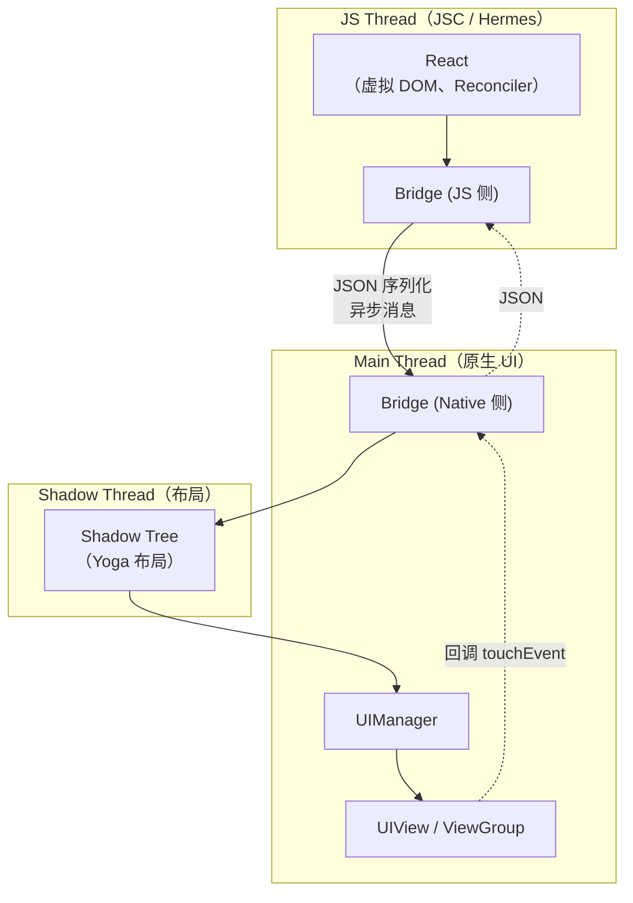
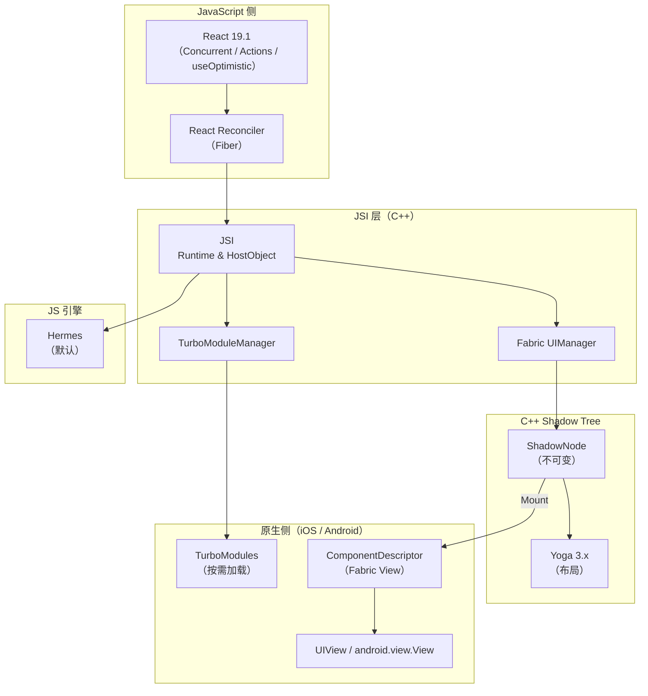
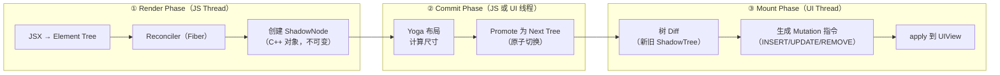
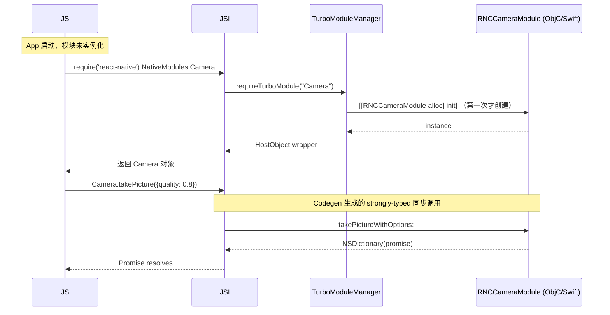
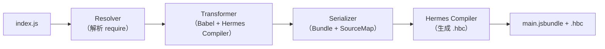
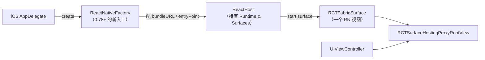

+++
title = "React Native 详解"
date = '2026-05-02T22:32:27+08:00'
draft = false
weight = 3
tags = ["跨平台", "面试"]
categories = ["跨平台", "面试"]
+++
React Native 是 Meta 2015 年开源的跨平台框架，用 JavaScript/TypeScript 写一份业务代码，在 iOS 和 Android 上渲染出**真正的原生控件**（`UIView` / `android.view.View`），而不是像 Flutter 那样自绘，也不是像 H5 那样跑在 WebView 里。经过 2018~2024 年的"新架构"大重构，RN 在 0.76 让 **New Architecture（Fabric + TurboModules + JSI + Codegen + Bridgeless）成为默认**，并在 0.82（2025 年 10 月）彻底告别旧的 Bridge 时代——这是 RN 十年来最大的一次范式迁移。

对 iOS 开发者而言，RN 的定位很特殊：**UI 仍然是 UIKit，但控制 UI 的大脑换成了 JS**。这让它一方面拥有"**原生 Look & Feel**"的天然优势（iOS 26 Liquid Glass 不用等框架跟进），另一方面又背负着"**JS/原生边界抖动**"的原罪。在 AI Coding 时代，RN 凭借 Web 生态庞大的训练语料和 Expo 工具链成为 LLM 生成代码正确率最高的移动框架，但 JSI 的 C++ 层和 Bridgeless 的新调试链路也让"AI 修 Bug"变得比以前更难。

本文从架构出发，讲透 Bridge → New Architecture 的演化、JSI/Fabric/TurboModules 的工作原理、Hermes 引擎、Metro 打包、iOS 嵌入与 Expo 生态，再到 AI 时代的选型矩阵，是一篇写给 iOS 开发者的 RN 体系化导读。

## 一、React Native 是什么

### 1.1 一句话定义

React Native 是"**用 React 写原生 App**"的框架：

- **编程模型**：React 的 `Component`、`Hooks`、声明式 UI、虚拟 DOM/Fiber。
- **UI 落地**：JS 里的 `<View>` 在 iOS 上最终对应 `UIView`，`<Text>` 对应 `RCTTextView`，`<ScrollView>` 对应 `UIScrollView`——都是**真正的原生视图**。
- **业务逻辑**：JavaScript 跑在 Hermes 引擎里，通过 JSI 同步调用原生代码。

一句话记忆：**React Native 不是把 Web 套进 App，它是用 React 的心智模型去驱动 UIKit。**

### 1.2 和其他跨平台方案的根本差异

| 技术 | UI 落地方式 | 业务逻辑 | 语言 | 一致性 |
|------|----------|----------|------|--------|
| **React Native（New Arch / Fabric）** | JSI + Fabric（C++）同步调用 UIKit/Android View | JS 引擎（Hermes） | JS/TS | **跟随原生** |
| React Native（Old Arch / Bridge） | JS 异步发消息到原生，桥消息序列化 | JS 引擎（JSC/Hermes） | JS/TS | 跟随原生，但桥会卡 |
| Flutter | Impeller 自绘（Metal/Vulkan） | Dart AOT | Dart | 双端像素一致 |
| KMP（无 UI） | UIKit/SwiftUI | Kotlin → .framework | Kotlin + Swift | 业务一致、UI 原生 |
| Compose Multiplatform | Compose 自绘（Skia） | Kotlin Native | Kotlin | 双端一致 |
| Hybrid（WebView） | H5 | JS | JS | Web 一致 |

RN 最独特的权衡是：

- ✅ **原生观感一等公民**：iOS 26 Liquid Glass、Dynamic Type、Dark Mode、VoiceOver——统统免费继承。
- ✅ **React 心智模型**：前端工程师零成本上手；Hooks / Suspense / Concurrent Features 在移动端照样好使。
- ✅ **热更新**（CodePush / Expo Updates）：JS Bundle 可 OTA，绕过 App Store 审核发 Bug 修复。
- ❌ **双端差异不可消除**：`UIScrollView` 的惯性滚动和 Android `NestedScrollView` 天生不一样，LLM 常常写出"iOS 正常，Android 崩"的代码。
- ❌ **调试链路三层穿越**：JS ↔ JSI ↔ C++ ↔ ObjC/Swift，Stack Trace 跨栈。

### 1.3 发展历程

| 时间 | 事件 |
|------|------|
| 2013 | Jordan Walke 在 Facebook Hackathon 上实现"JS 调 iOS View"的原型 |
| 2015.03 | F8 大会开源 React Native for iOS |
| 2015.09 | React Native for Android |
| 2018.06 | Meta 宣布"**新架构**"工程：JSI、Fabric、TurboModules |
| 2019.07 | Hermes 引擎发布（Android 先行） |
| 2020.07 | Hermes on iOS |
| 2021.04 | 0.64 默认启用 Hermes |
| 2022.03 | 0.68 第一个公开支持新架构的版本（Opt-in） |
| 2023.05 | 0.71 正式进入"新架构就绪"阶段 |
| 2023.11 | **0.73** 引入 **Bridgeless Mode**（全面移除旧 Bridge） |
| 2024.04 | 0.74，默认 Yoga 3.0 + New Arch 稳定 |
| 2024.08 | 0.75 |
| 2024.10 | **0.76 发布：New Architecture 成为默认**，Bridgeless on by default |
| 2025.01 | 0.77，Android 模块化 Header |
| 2025.02 | 0.78，升级到 **React 19**（Actions / `useActionState` / `useOptimistic`） |
| 2025.04 | 0.79，**Metro 0.82**（deferred hashing 启动快 3×）、删除远程 JS 调试 |
| 2025.06 | 0.80，升级 React 19.1，**Legacy Architecture 官方 Frozen** |
| 2025.08 | 0.81，Android 16 edge-to-edge、`SafeAreaView` 废弃、iOS precompiled 实验 |
| 2025.10 | **0.82，"A New Era"——第一个只跑新架构的版本**，旧 Bridge 彻底失效 |
| 2026.Q1~Q2 | 0.83~0.84，Hermes V1、旧架构类开始从核心代码中移除 |

**关键里程碑**：**0.76 是默认切换的分水岭**，**0.82 是旧时代的终结**。如果你 2026 年才开始学 RN，只需要看新架构文档。

## 二、整体架构

RN 的架构经历了**两个时代**：

- **旧架构（Bridge Era）**：2015~2023，核心是 **JSON 序列化的异步 Bridge**。
- **新架构（New Architecture Era）**：2024~，核心是 **JSI 同步调用 + Fabric + TurboModules + Codegen + Bridgeless**。

### 2.1 旧架构（Bridge）：为什么要被淘汰



**Bridge 的三宗罪**：

1. **所有跨语言调用必须 JSON 序列化**。滚动手势每帧都要把 `{x, y, velocity}` 编码再解码。
2. **完全异步**。JS 要读一个原生模块的返回值只能等 callback，不能同步 `return`。
3. **启动慢**。App 启动时 `NativeModules` 里所有模块（Geolocation、Camera、Alert、Push……）都会被**立刻实例化**，哪怕你一辈子用不到。

这些问题在 2018 年被 Meta 定性为**架构级缺陷**，催生了新架构重写。

### 2.2 新架构总览



**四大支柱**：

| 支柱 | 作用 |
|------|------|
| **JSI（JavaScript Interface）** | C++ 层暴露"**JS 可以直接持有原生对象**"的能力，替代 Bridge 的 JSON 消息 |
| **Fabric** | 新的 UI 渲染系统，`ShadowTree` 在 C++ 层不可变、支持同步布局、优先级调度 |
| **TurboModules** | 新的原生模块系统，**懒加载 + 同步调用**，替代 `NativeModules` |
| **Codegen** | 根据 TypeScript/Flow 类型声明**自动生成** JSI 绑定代码和 ObjC/Java 接口，保证类型安全 |

再加上"**Bridgeless Mode**"（0.73 引入，0.76 默认，0.82 强制）——把 Timer、EventEmitter、错误处理等最后残留的 Bridge 功能也迁移到 JSI，App 启动时**不再有 Bridge 这个对象**。

### 2.3 JSI：一切的基石

JSI 是一段约 1000 行的 C++ 代码，它不是"引擎"，而是一套"**与 JS 引擎对话的抽象协议**"。它的核心接口只有几个：

```cpp
// 极度简化的 JSI 接口
namespace facebook::jsi {
  class Runtime {
  public:
    virtual Value evaluateJavaScript(const Buffer&, const string& sourceURL) = 0;
    virtual Object global() = 0;
    // ...
  };

  class HostObject {
  public:
    virtual Value get(Runtime&, const PropNameID&) = 0;
    virtual void set(Runtime&, const PropNameID&, const Value&) = 0;
  };
}
```

`HostObject` 让 C++ 对象**冒充成一个普通 JS 对象**。当 JS 写 `nativeModule.getDeviceName()`：

1. JS 引擎在 `global` 上找到 `nativeModule`，发现它是 `HostObject`。
2. 调用 C++ 的 `HostObject::get("getDeviceName")`，返回一个 `HostFunction`。
3. JS 同步调用这个 function，C++ 的 lambda 被执行，直接读 iOS `UIDevice.current.name`。
4. 返回值装进 `jsi::Value`，**同一栈帧同步返回给 JS**。

**关键差异**：
- Bridge 里同样的调用需要序列化 `"getDeviceName"` 字符串 → 放进消息队列 → 切到原生线程 → 反序列化 → 执行 → 再反过来一遍。
- JSI 里它就是一次 C++ 虚函数调用，**零拷贝、零线程切换、零序列化**。

这也是为什么"**Reanimated 3 + JSI**"可以在 UI 线程驱动 120 FPS 动画，而 Bridge 时代的动画必须写 `Animated.Value` + `useNativeDriver` 才能勉强流畅。

### 2.4 Fabric：渲染管线

Fabric 把 RN 的渲染切成三个确定的阶段：**Render → Commit → Mount**。



**Fabric 相对 Bridge 的关键改进**：

| 维度 | 旧 UIManager | Fabric |
|------|-------------|--------|
| Shadow Tree 位置 | Java/ObjC 里，逻辑分散 | **C++ 统一实现**，双端共用 |
| 可变性 | 可变，易被竞态污染 | 不可变（Immutable），每次更新生成新节点 |
| 线程模型 | 强制 Shadow Thread 布局 | 支持**同步布局**（例如 `measure()` 可以立即返回结果） |
| 背压 | 无，JS 一直狂推消息 | 优先级调度，触摸响应优先 |
| 2025 新增 | — | **Dual-Revision 分支**：JS commit 和 Native commit 各走一棵树，事件循环尾部 merge |

2025 年 RN 给 Fabric 加了一个里程碑级优化——**Commit 分支**（`enableBranchingCommits`）：
- **React 的 commit** 写到 `JS Revision`；
- **Reanimated / 原生动画** 写到 `Main Revision`；
- 事件循环收尾时把 JS Revision 的变化 merge 到 Main。

这解决了旧架构里"**JS 重渲染会打断原生动画**"的经典问题，让协同更新彻底解耦。

### 2.5 TurboModules：懒加载的原生模块



**三个改变**：
1. **懒加载**：用到才 init，启动快。
2. **同步调用**（可选）：不需要 callback hell。
3. **Codegen 生成类型安全接口**：写错方法名/参数类型编译期报错。

### 2.6 Codegen：从 TS 类型到 C++ / ObjC / Java

开发者的视角：

```ts
// MyTurboModule.ts
import type {TurboModule} from 'react-native';
import {TurboModuleRegistry} from 'react-native';

export interface Spec extends TurboModule {
  readonly getBatteryLevel: () => number;
  readonly openURL: (url: string) => Promise<boolean>;
}

export default TurboModuleRegistry.getEnforcing<Spec>('BatteryModule');
```

`npx react-native codegen` 之后，在 `build/generated/` 下会产生：

- `NativeBatteryModuleSpecJSI.h/.cpp`（C++ JSI 绑定）
- `RCTNativeBatteryModuleSpec.h`（iOS Protocol）
- `NativeBatteryModuleSpec.java`（Android 抽象类）

开发者只需要**实现**这个 Protocol，类型一致性由编译器保证。这是 RN "**类型安全互操作**"的基石，也是 LLM 生成 Native 模块代码正确率大幅提升的根因。

### 2.7 Bridgeless Mode：终局

Bridgeless 的目标不是"只加 JSI"，而是"**让 Bridge 这个对象彻底消失**"。在 0.76 默认开启后：

- `new NativeEventEmitter()` 不再依赖 `RCTBridge`，而是直接用 `RCTEventEmitter` + JSI 回调。
- `setTimeout` / `setInterval` 改走 JSI 注册的 `HostFunction`。
- 错误处理走 `JSError`，不再靠 Bridge 的 `RCTFatal`。
- 线程模型重构：**不再有 "Bridge Queue"**，JS Runtime 直接持有 CallInvoker，负责调度。

**对 App 的可感知收益**：
- 冷启动快 **~43%**（Meta 内部数据），TurboModule 懒加载贡献 30%。
- 第一次渲染快 **~39%**。
- 老模块仍可用：RN 提供 "**Interop Layer**"，兼容旧的 `RCTBridgeModule`。

## 三、JavaScript 引擎：Hermes

### 3.1 Hermes 是什么

Hermes 是 Meta 为 RN 专门设计的 JS 引擎，**2021 年 iOS/Android 全面默认**。新架构里它是"**唯一官方支持**"的引擎——JSC 已在 0.79 迁入社区包 `@react-native-community/javascriptcore`。

核心设计：

1. **AOT 字节码**：Metro 打包时把 JS 编译成 **Hermes Bytecode（`.hbc`）**，App 加载时**零解析**，直接开始执行。对比 JSC 每次冷启动都要 parse 整个 bundle，Hermes 冷启动快 3~5×。
2. **小堆内存**：针对移动端设计，默认堆比 V8/JSC 小得多。
3. **紧凑字符串表**：字符串常量池全局去重。
4. **内建 GC**：Mark-Sweep + Compact，可配置代际 GC。
5. **调试协议**：支持 Chrome DevTools Protocol，接入 Flipper / React DevTools。

### 3.2 Hermes V1（2025~2026）

0.82 引入了 **Hermes V1** 的实验版。V1 的两个突破：

- **Hermes Compiler Infrastructure（HCI）**：新的后端，类似 V8 TurboFan 的优化 IR。
- **Baseline JIT**（可选）：在某些平台允许 JIT（非 iOS，Apple 禁止运行时代码生成）。在 Android 上可以带来 2~3× 的 JS 性能提升。

**iOS 限制**：Apple 沙盒禁止动态代码生成，所以 iOS 永远不能启用 JIT。Hermes 在 iOS 上的性能依靠更好的 AOT 优化和 inline caches。

## 四、Metro：RN 的打包器

Metro 是 RN 官方的 JS 打包器，类似前端的 Webpack/Vite，但针对移动端做了特化。

### 4.1 打包流程



1. **Resolver**：按 Node.js 规则（`node_modules`、`package.json` exports）解析 `require`/`import`。0.79 起 **`package.json exports/imports`** 默认启用。
2. **Transformer**：用 Babel 把 JSX/TS 转成 ES5/ES6，再跑 Flow/TS 类型剥离、react-native 插件链。
3. **Serializer**：生成最终的 JS Bundle，计算模块 ID 映射。
4. **Hermes Compiler**：Release 模式下把 Bundle 喂给 `hermesc` 生成 `.hbc`。

### 4.2 关键演进

| 时间 | Metro 版本 | 重要特性 |
|------|----------|---------|
| 2024 | 0.80 | 并发模块解析 |
| 2025.04 | **0.82** | **Deferred Hashing**——启动快 3× |
| 2025.Q4 | 0.85 | **Lazy bundling 默认开启**，开发期只打包看到的路由 |

**Deferred Hashing 原理**：Metro 之前每次修改都要重新哈希所有模块来生成 Bundle ID；0.82 改成"**增量哈希**"，改一个文件只重算一个 ID。冷启动 `metro start` 从 30+ 秒降到 10 秒内。

### 4.3 Dev Server 与 Hot Reload

- **Fast Refresh**：修改 React 组件时保留 state，组件树热替换。
- **Full Reload**：修改非组件文件（比如 Native 配置）时自动全量刷新。
- **远程 JS 调试**（Legacy，0.79 **已删除**）：以前可以把 JS 拉到 Chrome V8 里跑，但因为引擎不一致（V8 vs Hermes）行为会漂移，已被废弃。推荐用 **React Native DevTools**（基于 Chrome DevTools Protocol 直接调 Hermes）。

## 五、iOS 嵌入原理

和 Flutter 一样，RN 支持"**纯 RN 项目**"和"**Add-to-App**"两种模式。对 iOS 开发者而言，Add-to-App 才是常见场景。

### 5.1 核心对象



| 类 | 职责 |
|----|------|
| **`ReactNativeFactory`**（0.78 新增） | 简化的启动入口，替代手写 `RCTAppDelegate` 模板，便于 brownfield 嵌入 |
| **`ReactHost`** | 管理一个 JS Runtime 的生命周期，可承载多个 Surface |
| **`RCTFabricSurface`** | 一个"**可挂载到任意 UIView 上**"的 RN 渲染表面 |
| **`RCTSurfaceHostingProxyRootView`** | 把 Surface 包装成一个普通 `UIView` |

### 5.2 典型集成代码（0.82+）

```swift
// AppDelegate.swift
import React

@main
class AppDelegate: UIResponder, UIApplicationDelegate {
    var window: UIWindow?
    var reactNativeFactory: RCTReactNativeFactory?

    func application(_ application: UIApplication,
                     didFinishLaunchingWithOptions _: [UIApplication.LaunchOptionsKey: Any]?) -> Bool {
        let config = RCTReactNativeFactoryConfiguration()
        config.bundleURL = Bundle.main.url(forResource: "main", withExtension: "jsbundle")
        config.moduleName = "MyApp"

        reactNativeFactory = RCTReactNativeFactory(configuration: config)
        window = UIWindow(frame: UIScreen.main.bounds)
        window?.rootViewController = reactNativeFactory?.rootViewController()
        window?.makeKeyAndVisible()
        return true
    }
}
```

**Brownfield**（把 RN 嵌入现有 iOS App）只需要在某个 `UIViewController` 里插入 Surface：

```swift
func presentRNScreen(moduleName: String) {
    let surface = reactNativeFactory!.createSurface(moduleName: moduleName, initialProperties: nil)
    let rnVC = UIViewController()
    rnVC.view = surface.view
    navigationController?.pushViewController(rnVC, animated: true)
}
```

### 5.3 多 Surface 共享 Runtime

和 `FlutterEngineGroup` 类似，RN 多个 Surface 可以共享同一个 `ReactHost`，**省去 JS 引擎重启的 100~300ms**。实测一个 JS Runtime 大约占用 **15~25 MB** 内存，比 Flutter Engine 略小。

### 5.4 iOS 预编译依赖（0.80+）

长期以来，RN 最被诟病的点之一是"**首次 `pod install` 要编译 200+ Pod，动辄 15 分钟**"。

0.80 引入 **iOS Prebuilt Dependencies**（实验），0.81 扩展到更多核心 Pod：
- `React-Core`、`React-Fabric`、`React-RCTFabric`、`React-runtimescheduler` 等预编译为 `.xcframework`。
- Apple Silicon Mac 上 `pod install` 从 10+ 分钟降到 30 秒左右。
- Xcode clean build 降到 2~3 分钟。

配合 **Expo** 的 `EAS Build` 云端缓存，实际项目体验已接近"开箱即用"。

## 六、生态：Expo、Navigation、State

RN 的官方定位是"**框架内核**"，上层的**路由、导航、状态管理**都靠社区。2026 年格局基本定型：

### 6.1 Expo：事实标准

2024 年 Meta 官方 blog **明确推荐用 Expo 启动新项目**。Expo 的定位从"RN 的简易封装"演化为"**RN 的正式发行版**"：

| 功能 | Expo 提供 |
|------|----------|
| 项目初始化 | `npx create-expo-app`，一条命令出工程 |
| **Expo Router**（基于 React Navigation） | 文件系统路由：`app/(tabs)/home.tsx` 自动成为 Route |
| **EAS Build** | 云端 iOS/Android 构建，不用本地 Xcode |
| **EAS Update** | OTA JS Bundle 更新（代替 CodePush） |
| **Expo Modules API** | 用 Swift/Kotlin 写 Native 模块的现代方式，含 Codegen |
| **Expo Go** | 开发期扫码即用（有限制：不能用自定义 Native 模块） |
| **Dev Client** | 开发期的自定义客户端，解决 Expo Go 的限制 |

从 **Expo SDK 52（2024.11） → SDK 54（2025.06） → SDK 56（2026.01）**，它已经是 RN 开发的默认选择。iOS 开发者完全可以忽略底层 Pod 细节，把精力放在 TS 代码上。

### 6.2 导航：React Navigation 7 / Expo Router

```tsx
// app/(tabs)/home.tsx —— Expo Router 文件路由
import { Text } from 'react-native';
import { Link } from 'expo-router';

export default function Home() {
  return (
    <>
      <Text>Hello</Text>
      <Link href="/profile/123">Go to profile</Link>
    </>
  );
}
```

**亮点**：
- **Typed Routes**：TS 严格类型化 `<Link href>` 的路径。
- **Dynamic Routes**：`[id].tsx` 自动对应 `/user/:id`。
- **Server Components 实验支持**：配合 React 19 `use` hook 做数据预取。

### 6.3 状态管理：2026 收敛

| 方案 | 体积 | 场景 | 趋势 |
|------|------|-----|------|
| **Zustand** | ~1KB | **中小型 App 首选** | ⬆️ 快速上升 |
| **Jotai** | ~3KB | 细粒度原子化状态 | ⬆️ 稳步上升 |
| **Redux Toolkit + RTK Query** | ~15KB | 大型企业级、严格架构 | ➡️ 稳定 |
| **TanStack Query** | ~12KB | 服务端状态（REST/GraphQL） | ⬆️ 成为默认选择 |
| **MobX** | ~15KB | OO 风格团队 | ⬇️ 衰退 |
| **Context + useReducer** | 0 | UI 级小状态 | ➡️ 稳定 |

**推荐组合**：
- **客户端状态**：Zustand / Jotai（视偏好）
- **服务端状态**：TanStack Query
- **表单**：React Hook Form + Zod
- **局部 UI 态**：`useState` / `useReducer`

```tsx
// Zustand 示例
import { create } from 'zustand';

interface CartState {
  items: Item[];
  add: (item: Item) => void;
}

export const useCart = create<CartState>((set) => ({
  items: [],
  add: (item) => set((s) => ({ items: [...s.items, item] })),
}));

// 组件里
const items = useCart((s) => s.items);
const add = useCart((s) => s.add);
```

### 6.4 动画：Reanimated 4 + Gesture Handler

Reanimated 把动画从 JS 线程迁移到 **UI 线程原生执行**，核心技术就是 JSI + `WorkletRuntime`。

```tsx
import Animated, { useSharedValue, useAnimatedStyle, withSpring } from 'react-native-reanimated';

function Box() {
  const x = useSharedValue(0);
  const style = useAnimatedStyle(() => ({ transform: [{ translateX: x.value }] }));
  return (
    <Animated.View style={[styles.box, style]}>
      <Button onPress={() => (x.value = withSpring(200))} />
    </Animated.View>
  );
}
```

`useSharedValue` 创建的变量**不跨线程拷贝**，直接驻留在 UI 线程。JS 里赋值会通过 JSI 零拷贝同步过去。这让 120 FPS 动画在新架构下真正可行。

### 6.5 UI 库：兼容 Liquid Glass

| 库 | 定位 | iOS 26 Liquid Glass |
|-----|------|-------------------|
| **React Native Paper** | Material 3 | 🟡 样式偏 Android |
| **Tamagui** | 跨端 + 编译期样式优化 | ✅ 支持自定义毛玻璃 |
| **NativeWind** | Tailwind for RN | ✅ 靠 CSS-like 语法 |
| **Gluestack UI** | Unstyled Headless | ✅ |
| **React Native iOS UI** | 直接桥接 SwiftUI 组件 | ✅ **原生 Liquid Glass** |

**关键事实**：RN 的 `<View>` 底层就是 `UIView`，**iOS 系统样式（Liquid Glass、Dynamic Type、Dark Mode）自动生效**。这是 RN 相对 Flutter 的根本优势：**不需要等框架实现新设计语言**。

## 七、AI Coding 时代：React Native 的优势与劣势

2024 年起，Cursor / Claude Code / Codex 等 AI 编程工具爆发。RN 在这场变革中的表现非常有意思——**生成容易、调试难**。

### 7.1 RN 在 AI 时代的六大优势

#### 优势 1：Web 生态 = LLM 训练数据的金矿

LLM 对某门技术的掌握度**直接正比于训练语料规模**。React 生态是**人类历史上最大的前端代码库**：
- npm 上 **300 万+ 包**
- GitHub 上**数亿**含 React 的仓库
- Stack Overflow 上 **130 万+** React 问答

RN 共享了 95% 的 React 心智模型：Hooks、Context、Suspense、Reconciler……**LLM 对 RN 的生成准确率是所有跨平台框架里最高的**。实测写一个"带登录 + 列表 + 详情页"的 App：

| 框架 | Claude Sonnet 一次通过率 |
|------|----------------------|
| React Native + Expo Router | ~85% |
| Flutter | ~75% |
| SwiftUI | ~55% |
| Android Jetpack Compose | ~60% |

#### 优势 2：TypeScript 严格类型 = AI 的自我纠错闭环

现代 RN 项目默认 **TypeScript Strict Mode + ESLint + `@typescript-eslint/strict`**。LLM 生成代码之后，`tsc --noEmit` 和 `eslint --fix` 可以把大部分"幻觉 API"打回来：
- Claude Code / Cursor 的 **Agent Mode**：生成代码 → 运行 `tsc` → 发现错误 → 自动修复 → 再跑 → 直到通过。
- Codegen 的 TurboModule 接口写错参数类型？TS 立刻报错。
- `zod` schema 校验的 API 返回值？幻觉的字段名会被 runtime 检测到。

这个"**生成 + 验证**"的循环让 RN 成为目前 AI 辅助效率最高的移动开发栈之一。

#### 优势 3：Fast Refresh = 亚秒级反馈

RN 的 **Fast Refresh** 改代码 < 1 秒生效、**React state 保留**，非常契合 LLM 的"**小步快跑**"工作流：

| 框架 | 改一行 UI 的反馈延迟 |
|------|------------------|
| RN Fast Refresh | ~500ms |
| Flutter Hot Reload | ~300ms |
| SwiftUI Preview | ~1~5 秒（大型项目易失败） |
| UIKit | 30 秒+（整编译） |

Cursor / Claude Code 让 AI 改 UI 变成"**对着屏幕持续对话**"——AI 改一个属性，0.5 秒后用户就能在模拟器里看到新样子。

#### 优势 4：Expo + EAS = 零配置工具链

AI IDE 生成代码时最容易出错的地方是**工程配置**：`Podfile`、`pbxproj`、`Gradle`、`build.gradle`、签名证书。Expo **把这些全部黑盒掉了**：

```bash
# 这一条命令就完成了初始化 + iOS 构建 + TestFlight 提交
npx create-expo-app my-app && cd my-app && eas build --platform ios --auto-submit
```

LLM 不需要学怎么改 `pbxproj`，也不需要知道 iOS 证书的格式，Expo 帮它搞定。这在"**完全自主开发**"的 Agent 场景下是决定性优势。

#### 优势 5：GenUI / AI Agent 场景友好

RN 的 UI 就是 JSON 化的 React 元素树。让 LLM **直接输出 UI 结构**非常自然：

```tsx
// LLM 可以返回一个 JSON，客户端动态渲染
const uiSpec = {
  type: 'Screen',
  children: [
    { type: 'TextInput', placeholder: '输入金额' },
    { type: 'Button', title: '下单', onPress: 'handleSubmit' },
  ],
};
```

配合 `react-native-dynamic-ui` / `@lynx-js/core` 这类协议库，**Agent 可以动态生成整屏 UI**。Meta 自家的 Threads、Instagram 部分页面就是这种"**服务端驱动 UI**"（Server-Driven UI, SDUI）模式。

#### 优势 6：跨 iOS / Android / Web 同栈

2025 年起 RN 官方 **React Native Web** 已经能把同一份 React 代码跑进浏览器。LLM 只用维护一份代码，就能在"**手机 + 网页 + 桌面（Tauri/Electron）**"三端复用。这个"**代码单源**"对 AI 的价值是：
- 不必处理三套平台差异。
- 不必纠结 iOS/Android/Web 版本差。
- Bug 修一次，三端都好。

### 7.2 RN 在 AI 时代的五大劣势

#### 劣势 1：双端边界差异——LLM 最容易踩的坑

"RN 一套代码跑两端"是**误读**。实际上：

| 差异点 | iOS | Android |
|-------|-----|---------|
| `<ScrollView>` 滑动惯性 | 原生 `UIScrollView` 曲线 | Material `OverScroller` 曲线 |
| 键盘弹起行为 | `keyboardAvoidingView` 自动 | 需要 `adjustResize` 配置 |
| `<SafeAreaView>` | 对应 iOS 刘海 / Dynamic Island | Android 16 强制 edge-to-edge，需要单独处理 |
| 权限 | `Info.plist` 字符串 | `AndroidManifest.xml` + 运行时请求 |
| 字体 | `UIFont` 路径 | `R.font.xxx` 资源 |

**LLM 经常写出"iOS 看起来正常，Android 崩"的代码**。因为训练语料里 iOS 示例更多，LLM 常默认 iOS 行为，忽略 Android 差异。解决方案：在 prompt 里明确强调"**两端都要测试**"，并在 CI 里跑 Detox 双端 E2E。

#### 劣势 2：Native 层调试难——穿透三语言栈

新架构的调用链是 **JS → Hermes → JSI → C++ → ObjC/Swift**。出 Bug 时：

```
JSError: Cannot read property 'foo' of undefined
  at MyComponent.render (App.bundle:12345)
  at Fabric::UIManager::completeSurface (in native, 0x103abf123)
  at -[RCTFabricUIManager completeSurfaceWithRootTag:] (RCTFabricUIManager.mm:215)
  at JSI HostObject dispatch (jsi/jsi.h:89)
```

Stack Trace 跨越 **JS → C++ → ObjC**，Xcode / Chrome DevTools **谁都只能看到一段**。LLM 读到这种 trace 经常只猜到 JS 侧错误，忽略真正的根因（比如 Codegen 生成的接口参数类型和 Swift 实现不一致）。

**2026 年的改善**：React Native DevTools 集成了 **Unified Stack Trace**，把 JS / C++ / Native 合并展示，但 LLM 的解析能力仍然显著弱于纯 JS 场景。

#### 劣势 3：Native Module 手写——AI 容易出错的雷区

纯 JS 逻辑 LLM 写得很好；一旦涉及"**写个相机模块**"、"**写个 BLE 模块**"，就要写 Swift/ObjC + Kotlin + Codegen 规范：

```swift
// Codegen 生成的 Protocol（LLM 要严格匹配）
@objc(RTNBatteryModule)
public class RTNBatteryModule: NSObject, RTNBatteryModuleSpec {
    public func getBatteryLevel() -> NSNumber {
        UIDevice.current.isBatteryMonitoringEnabled = true
        return NSNumber(value: UIDevice.current.batteryLevel)
    }
}
```

LLM 常见错误：
- 忘记 `@objc` 注解 → Codegen 找不到实现。
- `NSNumber` vs `Double` 类型不匹配 → 运行时崩溃。
- 异步接口忘记写 `RCTPromiseResolveBlock`。
- 直接用旧的 `RCT_EXPORT_METHOD` 宏（Bridge 时代写法）。

**缓解方案**：用 **Expo Modules API**，它的 Swift DSL 比原生 Codegen 更高阶，AI 出错率低一倍：

```swift
// Expo Modules API（LLM 生成友好）
public class BatteryModule: Module {
  public func definition() -> ModuleDefinition {
    Name("Battery")
    Function("getBatteryLevel") { () -> Double in
      Double(UIDevice.current.batteryLevel)
    }
  }
}
```

#### 劣势 4：iOS 26 独占能力的"等一等"

虽然 RN 继承 UIKit 样式没压力，但**新 API**仍需要桥接：

| iOS 26 独占能力 | RN 支持 |
|----------------|--------|
| **FoundationModels（端侧 LLM）** | ❌ 需要手写 Expo Module |
| **Writing Tools** | ✅（`UITextField` 自动继承） |
| **Live Activities / Dynamic Island** | 🟡 有 `expo-live-activity`，但 Widget 逻辑仍需 Swift |
| **App Intents / Siri Shortcuts** | ❌ 编译期注解无法从 JS 生成 |
| **ARKit 6 / RoomPlan** | 🟡 社区 Plugin，但滞后主版本 |
| **Core NFC** | 🟡 `react-native-nfc-manager` |

和 Flutter 的情况类似：**端侧 AI / 系统级集成是 RN 的弱项**。LLM 再强也生成不出它没见过的桥接代码，而大部分桥接需要 iOS 专家补课。

#### 劣势 5：新架构迁移期的"代码语料污染"

RN 0.82 之后**旧架构彻底失效**，但 **LLM 的训练语料里 70% 以上仍然是旧架构代码**：

- 生成 `NativeModules.Camera.takePic(cb)` → 旧 Bridge API，新架构用 Promise。
- 生成 `RCTBridgeModule` → 应该用 `RCTTurboModule` + Codegen。
- 生成 `useNativeDriver: true` → 新架构里所有动画都走 JSI，这个 flag 无效。
- 生成 `Animated.Value` → 推荐改用 Reanimated 3+ 的 `useSharedValue`。

这类**过时 API 幻觉**在 Claude / GPT-5 上仍然普遍存在。**建议给 LLM 明确提示**：
- `pubspec.yaml` / `package.json` 上下文。
- "必须使用 New Architecture（0.82+）API"。
- `.cursorrules` / `CLAUDE.md` 里明确禁止 `RCTBridgeModule`、`Animated.Value`。

### 7.3 决策矩阵：AI 时代要不要选 RN？

| 项目类型 | 推荐 |
|---------|------|
| **创业 MVP、需要 Web + iOS + Android 三端** | ✅ **RN + Expo + React Native Web** |
| **Agent 应用、动态 UI 生成** | ✅ **RN + SDUI** |
| **强 iOS 原生体验、严格跟随 iOS HIG** | ✅ **RN 优于 Flutter**（系统样式免费） |
| **深度端侧 AI（Apple Intelligence / CoreML）** | ❌ 用 **SwiftUI + 原生** |
| **图像 / 游戏 / AR** | ❌ 用 **Unity / 原生 Metal** |
| **大型存量 iOS App 加新模块** | ✅ **RN Brownfield + `ReactNativeFactory`** |
| **极度重视 UI 一致性** | ❌ **Flutter 更合适** |

**一个实用判别**：如果团队已经有 React 前端能力，**立刻选 RN**；如果团队是纯 iOS+Android 背景，**Flutter 的学习曲线更平滑**。

## 八、工程最佳实践

### 8.1 项目目录结构（推荐）

```
my-app/
  app/                    // Expo Router 路由（文件即路由）
    (tabs)/
      _layout.tsx
      home.tsx
      profile.tsx
    [id].tsx              // 动态路由
  src/
    features/             // Feature-first 拆分
      auth/
        api/              // TanStack Query
        components/
        hooks/
        store.ts          // Zustand store
      order/
        ...
    shared/
      ui/                 // 共享 UI 组件
      hooks/
      utils/
    services/             // 跨 feature 服务（Network、Logger）
  modules/                // Expo Modules（Swift/Kotlin 原生）
  assets/                 // 图片、字体
  app.json                // Expo 配置
  eas.json                // EAS Build 配置
  tsconfig.json           // strict: true
  .cursorrules            // AI 约束规则
```

### 8.2 性能优化清单

1. **`<FlatList>` / `<FlashList>`**：绝不用 `ScrollView + map` 渲染长列表；Shopify 的 `@shopify/flash-list` 性能比原生 `FlatList` 好 3~5 倍。
2. **`React.memo` + `useCallback`**：避免不必要的子组件重渲染。
3. **`InteractionManager`** 或 **`useDeferredValue`**：把非紧急更新延后到交互之后。
4. **图片走 `react-native-fast-image` 或 `expo-image`**：原生缓存 + 渐进式加载。
5. **Reanimated 3 替代 `Animated` API**：所有动画跑在 UI 线程。
6. **Hermes + `--dead-code-elimination`**：Release 打包时 Tree-shake 未使用代码。
7. **Bundle 分析**：`npx react-native-bundle-visualizer`，找出异常大的依赖。
8. **启动优化**：预加载 `ReactHost` 在 `didFinishLaunching`，同 Flutter Engine 预热思路。
9. **减少 JSI / Native 往返**：批量操作能合并就合并；高频数据用 Reanimated SharedValue。
10. **Memory Warning 时释放 Surface**：`ReactHost.invalidateSurface()`。

### 8.3 Add-to-App（Brownfield）避坑

1. **全局共享 `ReactHost`**：不要每个 `UIViewController` 新建 Runtime。
2. **Plugin 注册**：用 Expo Modules 自动注册，不要手写 `RCTBridgeModuleClasses`。
3. **线程安全**：JSI 对象**只能在 JS 线程访问**；iOS 侧拿到的 `HostObject` 千万不要跨线程传。
4. **生命周期对齐**：RN Surface 隐藏后 Hermes Runtime 仍在跑定时器，需要 `ReactHost.pause()`。
5. **iOS Deployment Target**：0.82 要求 iOS 15.1+（Expo SDK 56 要求 iOS 16+）。
6. **Pod 预编译**：启用 0.80+ 的 `RCT_USE_PREBUILT_RNCORE=1`，Xcode build 时间减半。
7. **不混用原生/RN 导航**：要么 UIKit 做主容器，RN 做叶子；要么 Expo Router 做主容器，原生页面用 `expo-router` 的 `Stack.Screen`。

### 8.4 CI / 发布

- **EAS Build**：Expo 官方云构建，`eas build -p ios --profile production`。
- **EAS Update**：OTA JS Bundle，绕过 App Store 审核。iOS 需要 `Info.plist` 配置 `ExpoRuntimeVersion`。
- **App Bundle 对接**：Release 产物是 `.ipa` / `.apk`/`.aab`，EAS 自动处理签名。
- **崩溃**：Sentry 支持 Hermes SourceMap 符号化，打包时 `npx sentry-expo-upload-sourcemaps`。
- **分发**：TestFlight / Firebase App Distribution。

### 8.5 AI Coding 集成建议

1. **`.cursorrules` / `AGENTS.md` 强制规则**：
   ```
   - 永远使用 React Native 0.82+ New Architecture API
   - 禁止 RCTBridgeModule、Animated.Value、useNativeDriver
   - 所有 Native 模块必须用 Expo Modules API（Swift/Kotlin）
   - UI 组件默认包 React.memo，列表必须用 FlashList
   - 跨平台代码必须用 Platform.OS 分支，不允许假设
   ```
2. **TypeScript Strict Mode**：`strict: true`、`noUncheckedIndexedAccess`、`exactOptionalPropertyTypes`。
3. **Lint**：`@react-native/eslint-config`、`eslint-plugin-react-hooks`、`eslint-plugin-react-native`。
4. **给 LLM 提供最小验证循环**：`pnpm tsc --noEmit && pnpm lint && pnpm test`，Agent 生成代码后自动跑。
5. **Expo Snack / Dev Client 预览**：LLM 每改一次立刻在设备上看到效果。
6. **组件级单测**：`@testing-library/react-native`，Agent 生成组件时附带测试用例。
7. **Codegen 前置**：让 Agent **先写 `.ts` 接口声明**，再让它写 Swift/Kotlin 实现，避免类型不一致。
8. **Prompt 模板**：约定"**用 Expo Router + Zustand + TanStack Query + Reanimated 3**"作为默认技术栈，减少 LLM 的幻觉空间。

### 8.6 与原生 iOS 开发的对比清单

| 关注点 | iOS 原生（Swift/SwiftUI） | React Native |
|-------|--------------------------|--------------|
| 编译时间（增量） | 15~60 秒 | < 1 秒（Fast Refresh） |
| 冷启动 | 极快 | 慢 ~100~300ms（JS Runtime 启动） |
| UI 原生感 | 满分 | 几乎满分（UIView 驱动） |
| 包体积增量 | 0 | +10~15MB（Hermes + JS + 依赖） |
| 端侧 AI 能力 | 一等公民 | 需桥接，滞后 |
| Live Activities / Widget | 原生 | 需写 Swift |
| iOS 26 Liquid Glass | 原生 | 自动继承系统样式 |
| AI 生成代码正确率 | 低（SwiftUI 语料少） | **高**（React 语料多） |
| 热更新 | App Store 审核 | **EAS Update OTA** |
| 跨平台（Android）| 不支持 | 90% 代码复用 |
| 跨平台（Web） | 不支持 | React Native Web |
| 双端差异调试 | 不存在 | iOS/Android 行为差需反复测 |

## 九、参考资料

- [React Native 官方文档](https://reactnative.dev/)
- [React Native 0.82 - A New Era](https://reactnative.dev/blog/2025/10/08/react-native-0.82)
- [React Native 0.80 - Legacy Freeze](https://reactnative.dev/blog/2025/06/12/react-native-0.80)
- [React Native 0.79 - Metro 0.82](https://reactnative.dev/blog/2025/04/08/react-native-0.79)
- [React Native 0.78 - React 19](https://reactnative.dev/blog/2025/02/19/react-native-0.78)
- [New Architecture is here（2024）](https://reactnative.dev/blog/2024/10/23/the-new-architecture-is-here)
- [React Native New Architecture Working Group](https://github.com/reactwg/react-native-new-architecture)
- [Fabric Deep Dive](https://github.com/reactwg/react-native-new-architecture/discussions/1)
- [Bridgeless Mode（0.73）](https://github.com/reactwg/react-native-new-architecture/discussions/154)
- [Render, Commit, Mount](https://reactnative.dev/docs/next/render-pipeline)
- [Hermes 引擎](https://hermesengine.dev/)
- [Expo 官方文档](https://docs.expo.dev/)
- [Expo Router](https://docs.expo.dev/router/introduction/)
- [Expo Modules API](https://docs.expo.dev/modules/overview/)
- [Reanimated 文档](https://docs.swmansion.com/react-native-reanimated/)
- [TanStack Query for RN](https://tanstack.com/query/latest)
- [Zustand](https://github.com/pmndrs/zustand)
- [FlashList by Shopify](https://shopify.github.io/flash-list/)
