+++
title = "动态化 DSL 详解"
date = '2026-05-02T22:32:27+08:00'
draft = false
weight = 4
tags = ["跨平台", "面试"]
categories = ["跨平台", "面试"]
+++
动态化 DSL（Domain-Specific Language，领域特定语言）是"不改 App 主包、不走应用商店审核，只下发一段描述文件就能改变界面和逻辑"的一类技术。它在 2015~2023 年成为国内大厂客户端的必备基础设施：阿里 DinamicX / Tangram / VirtualView / LuaView、字节 Lynx、腾讯 Mars / 小程序、滴滴 Hummer、美团 MRN / Recce、京东 Taro-Native、拼多多 Lego、支付宝 Nebula / BirdNest、爱奇艺 Doric ……几乎每一家超级 App 都至少造过一套自己的动态化 DSL。

进入 2026 年 AI Coding 时代，动态化 DSL 的定位发生了根本性转变：

- **过去**它服务于"**业务迭代速度**"——解决包大小限制、审核周期、多端复用问题。
- **现在**它服务于"**Agent 生成 UI**"——LLM 更擅长生成 JSON / 结构化 DSL 而不是跨平台原生代码，DSL 成为 Generative UI / SDUI（Server-Driven UI）落地移动端的唯一高效载体。

本文从定义出发，讲透动态化 DSL 的历史演进、分类体系、核心渲染管线、关键原理（AST / 表达式引擎 / 布局 / 数据绑定 / 差分），再深入解剖 DinamicX、Tangram、LuaView、Lynx、Hummer、Recce 六大主流方案的工程实现，最后系统分析 AI Coding 时代的优劣势与决策矩阵。

## 一、动态化 DSL 是什么

### 1.1 概念定义

**DSL** 是为特定领域量身定制的小语言，相对通用编程语言（GPL）而言，它只做一件事但做得很好。例如：

- SQL 是数据库查询的 DSL
- CSS 是样式的 DSL
- HTML 是文档结构的 DSL
- Gradle / CocoaPods Podfile 是构建配置的 DSL
- SwiftUI / Jetpack Compose 的 View Builder 也是**嵌入式 DSL**（Embedded DSL）

**动态化 DSL** 特指"**可以在 App 运行时下发、解析、执行的 UI + 逻辑描述语言**"，核心特点有三：

1. **外部化**：DSL 文本（模板、脚本、JSON、字节码）独立于 App 主包，可通过网络 / 配置中心下发。
2. **解释执行**：客户端内置一个解释器（Interpreter）或渲染引擎（Renderer）在运行时解析 DSL。
3. **UI + 数据 + 事件三合一**：不止描述界面布局，还能绑定数据源、响应用户交互。

一句话：**动态化 DSL = 可下发的 UI 描述 + 可下发的数据绑定 + 可下发的事件逻辑**。

### 1.2 为什么不直接用 JS / Lua / Dart

"用一门成熟脚本语言 + VM" 看起来是显然的方案，这就是 React Native / Weex / Flutter 的路线。但它们不是"DSL"，而是"**通用脚本 + 桥接**"，两者的区别在于：

| 维度 | 通用脚本方案（RN / Weex / Flutter） | 动态化 DSL（DinamicX / Lynx / VirtualView） |
|------|--------------------------------|----------------------------------------|
| 语言 | JS / Dart，图灵完备 | 受限 DSL，只暴露必要能力 |
| 引擎 | JSCore / V8 / Hermes / Dart VM | 自研小引擎 + 原生视图树 |
| 能力边界 | 几乎无限，可调用任意系统 API | 有限但可预测 |
| iOS 审核风险 | 低（JSCore 官方允许） | 极低（纯声明式 JSON） |
| 引擎体积 | Hermes ~1.5MB / Dart Engine 15MB | 通常 < 500KB，个别 < 200KB |
| 启动耗时 | JS / Dart VM 冷启动 100~300ms | < 10ms（直接解析 JSON） |
| 动态能力 | UI + 业务逻辑 + 原生模块 | 仅 UI + 轻业务逻辑 |
| 性能 | 依赖 VM + 桥通信 | 接近原生 |
| AI 友好度 | 高（LLM 熟 JS/TS） | 极高（JSON / XML 结构化，Schema 可约束） |

**核心差异**：通用脚本方案在"**完备性**"上走到极致，DSL 在"**受控性**"上走到极致。这种受控性在两个场景下至关重要：

- **信息流 / 电商场景**：每天下发上千种卡片模板，要求极低内存、极低启动、极高稳定性。
- **AI 生成 UI**：LLM 生成 JSON Schema 比生成 Swift 代码正确率高一个数量级。

### 1.3 在客户端架构中的位置

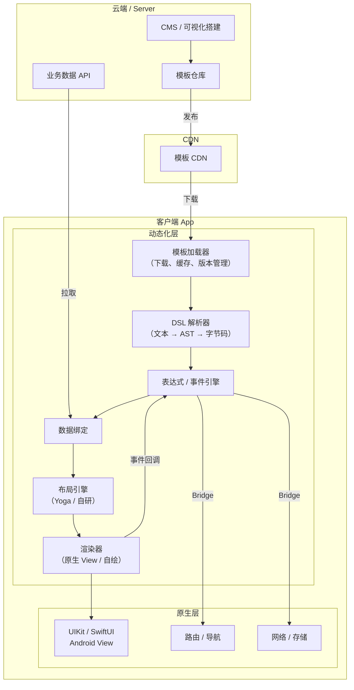

动态化层介于"**业务数据**"和"**原生 UI**"之间，对业务来说是"**UI 渲染 SDK**"，对原生来说是"**视图树生成器**"。

## 二、发展历程与代际划分

动态化 DSL 在国内大致经历了五个世代：

| 世代 | 时间 | 代表方案 | 关键特征 |
|-----|------|---------|---------|
| 第一代：H5 容器 | 2012~2015 | PhoneGap / Cordova / 微信 JS-SDK | 全 WebView，性能差 |
| 第二代：原生桥 + JS 引擎 | 2015~2018 | React Native / Weex / JSPatch | JS 驱动原生 View |
| 第三代：纯模板 DSL | 2016~2020 | DinamicX / VirtualView / Tangram / Doric / 小程序 | JSON / XML + 表达式，无 VM |
| 第四代：自绘跨端 | 2018~2023 | Flutter / Kraken | 自绘 + Dart AOT |
| 第五代：多端融合新架构 | 2022~至今 | Lynx / Recce / Hummer-Tenon / Compose Multiplatform | 双线程 / Wasm / MVVM |

### 2.1 第一代：H5 容器

PhoneGap（2009）发布了"用 WebView 写 App"的思路：HTML+CSS+JS 描述页面，通过 JS Bridge 调用原生能力（相机、GPS、本地存储）。这本质上是"**Web DSL（HTML）+ 动态加载**"。

- 优点：前端生态完美复用、热更新为零成本。
- 缺点：WebView 渲染性能差、冷启动慢、Crash 难溯源、无法做复杂手势。
- 苹果态度：允许（WebKit 是例外），至今仍是**唯一官方允许的热更新通道**。

这一代是动态化 DSL 的起点，其"**下发结构化文本 + 客户端解析**"的范式被所有后继方案继承。

### 2.2 第二代：原生桥 + JS 引擎（RN / Weex / JSPatch）

2015 年 RN 开源，Weex 紧随其后。它们引入了两个关键创新：

1. **JS 驱动原生 View**——用 JS 写逻辑，UI 渲染走 UIKit / Android View，摆脱 WebView。
2. **异步 Bridge**——JS 线程和 UI 线程通过 JSON 消息通信。

同期还有一个"偏门"——**JSPatch**（2015）：直接用 JS 调 OC Runtime 实现热修复。它的创新在于证明了"**一段下发的 JS 可以 swizzle 任意方法**"，这种能力很快被苹果在 2017 年封禁（iOS App Store Review Guidelines 4.2.6 / 3.3.2）。

第二代的问题：

- Bridge 序列化成本高（滚动每帧 JSON 编解码）。
- 启动时间长（JS VM + 所有 Native Module 实例化）。
- 动态能力过强——可以下发业务逻辑甚至替换方法，触达审核红线。

### 2.3 第三代：纯模板 DSL（真正的"动态化 DSL"）

2016~2020 年，国内超级 App 意识到"**大多数场景并不需要图灵完备的 JS**"：电商信息流、Feed 卡片、营销活动页、金融产品列表——它们共同特点是"**结构化布局 + 数据绑定 + 少量交互**"。

于是涌现了一批**纯模板 DSL** 方案：

| 方案 | 出品方 | 模板形态 | 特点 |
|------|-------|---------|------|
| **Tangram** | 阿里 | JSON | 卡片 + Cell 两层，VLayout 布局 |
| **VirtualView** | 阿里 | XML → 二进制 | 虚拟 View 树，极低内存 |
| **DinamicX** | 阿里 | XML | Android XML-Like，三端统一 |
| **LuaView** | 阿里（聚划算） | Lua | Lua 脚本 + 原生控件 |
| **Doric** | 爱奇艺 | JSX | JS + VirtualDOM |
| **小程序** | 微信 | WXML + WXSS + JS | 双线程 + 受控 Web |
| **Mach5** | 腾讯 | Vue SFC | Vue 子集编译 |

这一代的共同哲学："**UI 可以动态下发，但业务逻辑必须随 App 更新**"，这样既满足苹果审核（无可执行代码），又能覆盖 80% 的日常运营需求。

### 2.4 第四代：自绘跨端（Flutter / Kraken）

Flutter（2017）跳出"依赖平台 UI"的思路，直接用 Skia / Impeller 自绘。它的 DSL 是 Dart 嵌入式 DSL（Widget Tree），但因为 Dart AOT 编译到 iOS 上，**本身不具备动态化能力**。

为了补齐动态化，阿里推出了 [**Kraken**](https://github.com/openkraken/kraken)（2019）和 [**MXFlutter**](https://github.com/Tencent/MxFlutter)（腾讯）：把 W3C 标准 Web 规范接到 Flutter 渲染引擎上，JS 描述 DOM 树，Flutter 画。Kraken 后续演进为 [**WebF**](https://github.com/openwebf/webf)，至今仍在维护。

### 2.5 第五代：多端融合新架构（2022~至今）

2022 年后，两个趋势改变了 DSL 形态：

1. **鸿蒙 NEXT** 成为重要目标——跨端从"双端"升级为"四端"（iOS / Android / HarmonyOS / Web）。
2. **性能焦虑**——低端机 / 下沉市场、折叠屏、车载屏迫使容器"再快一点"。

代表方案：

- **字节 Lynx**（2025 开源）：**双线程 JS 架构**，主线程跑 UI，后台线程跑业务，使用 PrimJS（QuickJS 魔改版）。
- **美团 Recce**（2024）：**Wasm + Rust** 替代 JS，接近原生性能。
- **滴滴 Hummer**（2021 开源，2023 升级 Tenon）：**抛弃 DSL 和 VDOM**，直接用 QuickJS + 原生 API。

这一代的共同追求：**动态化 + 接近原生性能 + AI 友好**。

## 三、动态化 DSL 的分类

按照"DSL 文本形态"可以把所有动态化方案归为四大类：

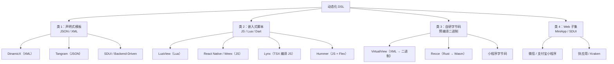

### 3.1 类 1：声明式模板

**典型特征**：DSL 本体是 JSON 或 XML，只描述"**长什么样**"，不描述"**怎么做**"。表达式 / 事件通过字符串嵌入。

```xml
<!-- DinamicX 模板示例 -->
<DXLinearLayoutWidgetNode orientation="vertical">
    <DXTextViewWidgetNode
        text="@{item.title}"
        textSize="14"
        textColor="#333333"/>
    <DXImageViewWidgetNode
        imageUrl="@{item.imageUrl}"
        width="match_parent"
        height="200"
        onTap="@{openDetail(item.id)}"/>
</DXLinearLayoutWidgetNode>
```

优点：

- 易解析（JSON / XML 解析成熟）
- LLM 友好（结构化）
- 无审核风险（不含代码）

缺点：

- 表达能力有限（复杂逻辑要绕）
- 自定义组件需要客户端先发版注册

### 3.2 类 2：嵌入式脚本

**典型特征**：用一门脚本语言（JS / Lua / Dart）的子集 / 全集写 UI + 逻辑，通过 VM 解释执行。

优点：

- 图灵完备
- 前端生态好（尤其 JS）
- 表达能力强

缺点：

- 需要 VM（体积 + 启动时间）
- Bridge 性能损耗
- 审核风险较高（要避免访问私有 API / 加载可执行代码）

### 3.3 类 3：自研字节码

**典型特征**：DSL 文本经过离线编译生成自定义二进制字节码，客户端直接读取字节码避免重复解析。

**VirtualView** 最典型：XML 模板在服务端被编译成 `.out` 二进制，包含：

- 字符串池
- 节点树（节点类型 + 属性索引）
- 表达式字节码（基于栈的虚拟机）

优点：

- 解析速度最快（< 1ms）
- 包体积小（二进制紧凑）
- 加密 / 防逆向天然

缺点：

- 需要离线编译工具链
- 调试困难（不可读）

### 3.4 类 4：Web 子集

**典型特征**：使用 W3C 标准的子集（HTML + CSS + JS 受限版）。

**微信小程序** 是极致：

- WXML：HTML 子集 + 数据绑定 + 逻辑控制
- WXSS：CSS 子集 + rpx 单位
- JS：受限，禁止 DOM API、动态加载

优点：

- Web 开发者零成本
- 规范化、可移植

缺点：

- 受平台管控强（必须走平台分发）
- 性能取决于宿主

## 四、核心渲染管线

不管什么 DSL，从"**模板文本**"到"**屏幕像素**"都要经过大致相同的六个阶段：

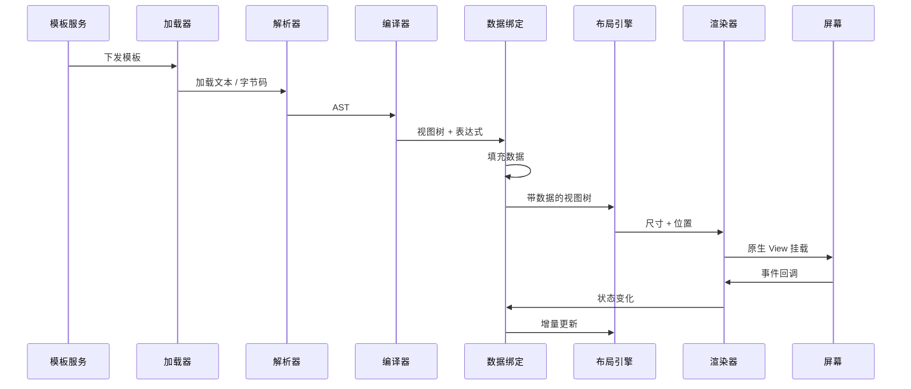

### 4.1 模板加载与缓存

一个完整的模板加载器需要解决：

1. **版本管理**：模板有多个版本，App 版本可能支持不同模板协议版本。
2. **预下载**：首屏关键模板随 App 启动预热。
3. **兜底**：网络失败时回退到本地预埋 / 缓存。
4. **降级**：高版本模板在低版本 App 上找最高兼容版。
5. **灰度**：按用户 / 地域 / 机型灰度下发。

DinamicX 的模板版本策略：

```
模板名：item_card
模板版本：202504011200（时间戳版本）
兜底：LocalStorage 有 {item_card, 202503301200} 先用老版本，
      同时异步拉取新版本，下次渲染升级
```

### 4.2 解析与编译

解析器把文本转为 AST（抽象语法树）。以 XML-like DSL 为例：

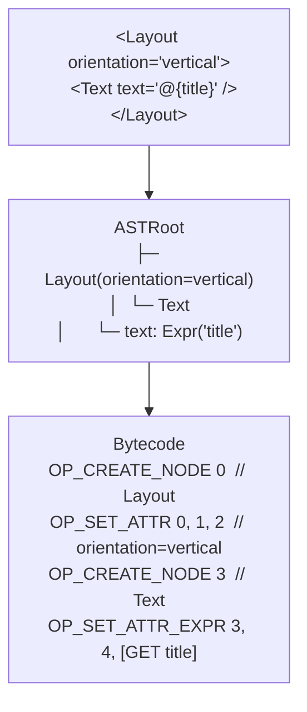

**表达式编译** 是最难的部分。DSL 里的 `@{title}`、`@{item.price > 100 ? 'red' : 'black'}`、`@{formatDate(item.createdAt, 'yyyy-MM-dd')}` 都需要被编译成可执行形式：

- **解析**：词法分析 → 语法分析 → 表达式 AST
- **编译**：表达式 AST → 字节码 / 操作符数组
- **执行**：基于栈的虚拟机求值

DinamicX 的表达式引擎（DXExprEngine）设计得很精细：支持三元、逻辑、算术、字符串拼接、函数调用，一共 30 多个操作符，采用 Reverse Polish Notation（RPN）求值。

### 4.3 数据绑定

数据绑定的关键问题："**数据变化后，UI 怎么增量更新**"。三种主流方案：

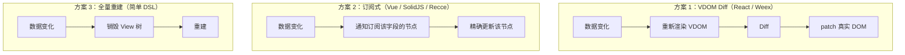

在动态化 DSL 里，**方案 2（订阅式）** 是效率最高的：每个 `@{item.title}` 节点订阅 `item.title`，数据变化只通知直接相关节点。DinamicX、Lynx、Recce 都选了这条路。

### 4.4 布局引擎

布局引擎决定"**每个节点的 frame**"。主流选择：

- **Yoga**（Facebook 开源）：C++ 实现，支持 Flexbox 子集，被 RN、Lynx、Recce、Litho 采用。
- **VLayout**（阿里）：Android RecyclerView 专用，支持线性 / 网格 / 瀑布流 / 粘性多种布局。
- **自研 Measure 机制**（DinamicX）：借鉴 Android MeasureSpec，双端一致。

Yoga 的核心是 **Flexbox 三兄弟**：`flexDirection` / `justifyContent` / `alignItems`，再配合 `flexGrow` / `flexShrink` / `flexBasis` 实现弹性布局。它有一个极其方便的特性：**布局是纯函数**（无状态、可缓存），可以在子线程计算。

### 4.5 渲染（挂载）

把布局完成的节点挂载到原生视图树。这里有两个关键优化：

1. **视图复用**：cell 被滑出屏幕后 View 不销毁，放入复用池，下个 cell 复用。
2. **按需创建**：只创建可见区域内的 View（虚拟化）。

VirtualView 的名字就来自"**Virtual（虚拟）View**"——树上的节点是虚拟的，只有真正要显示时才 inflate 真实 View。

### 4.6 事件系统

事件从用户 touch 到回到 DSL 的回调，路径是：

```
UITouch → UIView.hitTest → 命中动态化 View →
  查表找到绑定的表达式 @{openDetail(item.id)} →
  执行表达式 → 调用注册的事件处理器 → 业务代码
```

DinamicX 提出了 **事件链（Event Chain）** 概念：一个手势触发多个串行 / 并行 / 条件操作，事件也可被模板下发，进一步减少对客户端发版的依赖。

## 五、关键原理深度剖析

### 5.1 DSL 解析器：从字符到 AST

以简化版 DinamicX 为例，一段 XML：

```xml
<Layout orientation="vertical">
  <Text text="@{item.title}" />
</Layout>
```

解析流程：

1. **词法分析（Lexer）**：字符流 → Token 流
   ```
   TOKEN_OPEN_TAG "Layout"
   TOKEN_ATTR_NAME "orientation"
   TOKEN_ATTR_VALUE "vertical"
   TOKEN_TAG_CLOSE
   TOKEN_OPEN_TAG "Text"
   TOKEN_ATTR_NAME "text"
   TOKEN_ATTR_VALUE "@{item.title}"
   ...
   ```

2. **语法分析（Parser）**：Token 流 → AST
   ```swift
   struct ASTNode {
       let tag: String
       var attrs: [String: ASTAttr]
       var children: [ASTNode]
   }
   enum ASTAttr {
       case literal(String)
       case expression(ExprAST)
   }
   ```

3. **属性值细分**：带 `@{...}` 的属性进一步解析为表达式 AST。

对于 XML 这种结构化文本，可以用成熟的 **SAX 解析器**（事件驱动）或 **DOM 解析器**（整树加载）。模板下发场景数据量小，通常用 DOM，一次加载一次缓存。

### 5.2 表达式引擎：从字符串到字节码

表达式 `item.price > 100 ? 'red' : 'black'` 的编译过程：

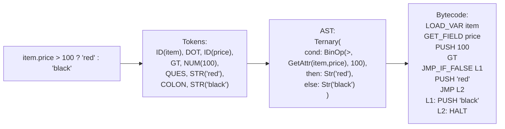

运行时用一个操作数栈执行字节码，常见指令集：

| 指令 | 作用 |
|------|------|
| `LOAD_VAR` | 加载变量 |
| `GET_FIELD` | 取字段 |
| `PUSH` | 常量入栈 |
| `ADD/SUB/MUL/DIV` | 算术 |
| `EQ/NE/GT/LT/GE/LE` | 比较 |
| `AND/OR/NOT` | 逻辑 |
| `JMP/JMP_IF_FALSE` | 跳转 |
| `CALL` | 函数调用 |
| `HALT` | 结束 |

DinamicX 的表达式引擎还支持**函数扩展机制**：客户端注册 `formatDate`、`formatMoney`、`i18n` 等工具函数，DSL 里直接调用。

### 5.3 布局原理：Yoga 的 Measure / Layout

Yoga 是一套 Flexbox 实现，关键方法：

```c
YGNodeStyleSetFlexDirection(node, YGFlexDirectionColumn);
YGNodeStyleSetWidth(node, 200);
YGNodeStyleSetHeightAuto(node);
YGNodeInsertChild(parent, node, 0);
YGNodeCalculateLayout(root, YGUndefined, YGUndefined, YGDirectionLTR);

// 读取结果
float left = YGNodeLayoutGetLeft(node);
float top = YGNodeLayoutGetTop(node);
float width = YGNodeLayoutGetWidth(node);
float height = YGNodeLayoutGetHeight(node);
```

核心流程：

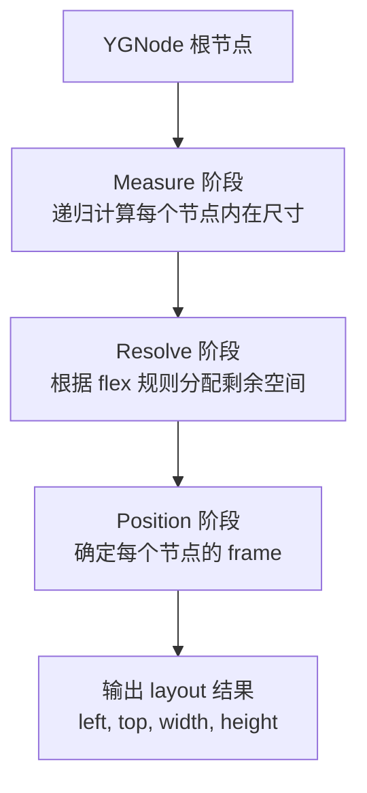

Yoga 的优秀之处：

1. **布局缓存**：同一约束下结果可缓存。
2. **线程安全**：纯函数，可在任意线程跑。
3. **跨平台一致**：iOS / Android / Windows / Web 像素级一致。

### 5.4 数据绑定的订阅模式

SolidJS 提出的"**精确订阅**"模式被 Recce、Lynx、DinamicX 广泛借鉴：

```swift
// 伪代码
class Signal<T> {
    private var value: T
    private var subscribers: [() -> Void] = []

    func get() -> T {
        if let current = currentComputation {
            subscribers.append(current.run)
        }
        return value
    }

    func set(_ newValue: T) {
        value = newValue
        subscribers.forEach { $0() }
    }
}

// 使用
let title = Signal("Hello")

createEffect {
    textView.text = title.get()  // 自动订阅
}

title.set("World")  // 自动更新 textView
```

关键是 `currentComputation` 这个全局栈——访问 Signal 时自动注册订阅关系，数据变化时精确回调，**完全不需要 Diff**。

### 5.5 iOS 上的 DSL 渲染器实现草图

一个最小化的动态化 DSL 运行时：

```swift
// MARK: - DSL 节点
indirect enum DSLNode {
    case view(tag: String, attrs: [String: Any], children: [DSLNode])
}

// MARK: - 渲染器
final class DSLRenderer {
    private var componentRegistry: [String: UIView.Type] = [:]

    func register(_ tag: String, _ type: UIView.Type) {
        componentRegistry[tag] = type
    }

    func render(_ node: DSLNode, data: [String: Any]) -> UIView {
        guard case let .view(tag, attrs, children) = node,
              let viewType = componentRegistry[tag] else {
            return UIView()
        }
        let view = viewType.init()
        applyAttrs(view, attrs: attrs, data: data)
        for child in children {
            let childView = render(child, data: data)
            view.addSubview(childView)
        }
        return view
    }

    private func applyAttrs(_ view: UIView, attrs: [String: Any], data: [String: Any]) {
        for (key, value) in attrs {
            let resolved = resolveExpression(value, data: data)
            applyAttribute(view, key: key, value: resolved)
        }
    }

    private func resolveExpression(_ value: Any, data: [String: Any]) -> Any {
        if let str = value as? String, str.hasPrefix("@{"), str.hasSuffix("}") {
            let path = str.dropFirst(2).dropLast()
            return evaluate(String(path), data: data) as Any
        }
        return value
    }

    private func evaluate(_ path: String, data: [String: Any]) -> Any? {
        path.split(separator: ".").reduce(data as Any?) { current, key in
            (current as? [String: Any])?[String(key)]
        }
    }

    private func applyAttribute(_ view: UIView, key: String, value: Any) {
        // 设置 frame / color / text 等
    }
}
```

这段 150 行代码已经能跑 80% 静态模板，差的只是**表达式引擎**、**布局系统**、**数据绑定**、**事件链**、**版本管理**。这些是所有 DSL 框架 99% 的工作量。

## 六、典型方案解剖

### 6.1 阿里 DinamicX：工业级 XML DSL

DinamicX（DX）是阿里集团内部最广泛使用的动态化方案，覆盖手淘、天猫、闲鱼、饿了么等。

**核心亮点**：

1. **DSL 与 Android XML 极度相似**：降低安卓开发者学习成本。
2. **三端统一（Android / iOS / 鸿蒙）**：一份模板三端渲染一致。
3. **分层研发模式**：
   - **ProCode**：DX IDE + Git + 模板仓库
   - **LowCode**：可视化搭建平台拖拽生成
4. **三驾马车**：IDE、列表容器、事件链。

**渲染架构（借鉴 Flutter）**：

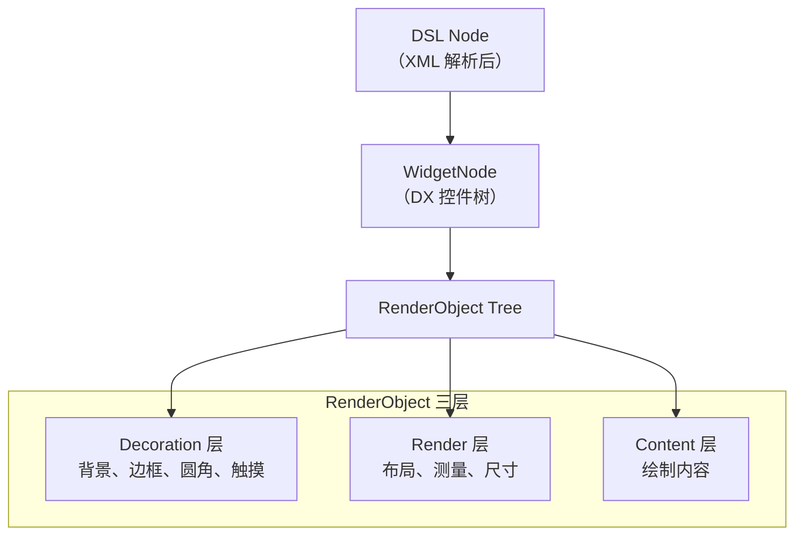

**RenderObject 派生体系**：

- `DXRenderBox`（基类）
  - `DXSingleChildLayoutRender`（文本、图片等叶子节点）
  - `DXMultiChildLayoutRender`（布局容器）
    - `DXLinearLayoutRender`
    - `DXFrameLayoutRender`
    - `DXTabLayoutRender`
    - 自定义布局……

**表达式引擎 DXExprEngine**：

- 支持 `+ - * / % ==` 以及三元、逻辑
- 支持 DSL 侧自定义函数（客户端注册）
- 支持事件链（Tap / LongPress / Swipe）

**动态模板协议**：

```
{
  "name": "item_card",
  "version": "202604011200",
  "dsl_url": "https://cdn.../item_card.zip",
  "min_engine_version": "5.0.0",
  "checksum": "sha256:..."
}
```

客户端按需拉取、校验、缓存、加载。

### 6.2 阿里 Tangram + VirtualView：卡片式信息流的标准答案

Tangram 专注**卡片流布局**，是手机天猫首页的基础设施：

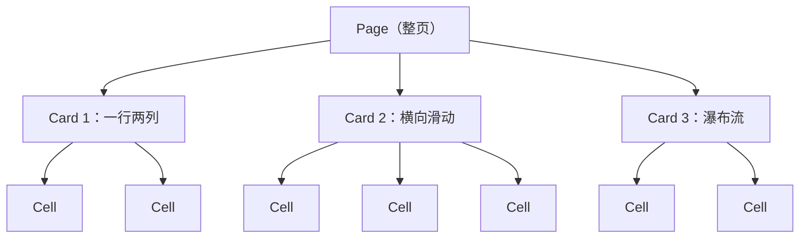

**两层模型**：

- **Card**：一组 Cell 的集合，负责布局（Grid / Linear / Float / Scroll）。
- **Cell**：最小业务单元，对应一个 View。

Tangram 本身只管"**Cell 怎么摆放**"，**Cell 内部长什么样**交给 VirtualView：

- Tangram：JSON 描述 Card 列表（宏观布局）。
- VirtualView：XML 描述每个 Cell 的内部结构（微观布局）。

这种"**宏观布局引擎 + 微观模板引擎**"的组合被很多电商借鉴。

**VirtualView 的巧妙之处**：

1. **XML → 二进制预编译**：模板离线编译为字节码，客户端无需再做 XML 解析。
2. **虚拟 View 树**：节点是轻量 Java / OC 对象，不继承 UIView，只有真要显示时才 inflate。
3. **小型表达式 VM**：支持 `.a.b.c`、`&&`、`||`、`==` 等基本操作。

尽管 VirtualView 在 2020 后不再维护，它的设计思路被 DinamicX、Doric 继承并发扬。

### 6.3 阿里 LuaView：Lua 双端复用

LuaView 是聚划算的杀手锏。选择 Lua 的理由：

- Lua VM 极小（< 300KB）
- Lua 语法和 C / Swift / OC 友好
- iOS 用 LuaC（解释执行，满足审核）
- Android 用 LuaJ

**架构**：

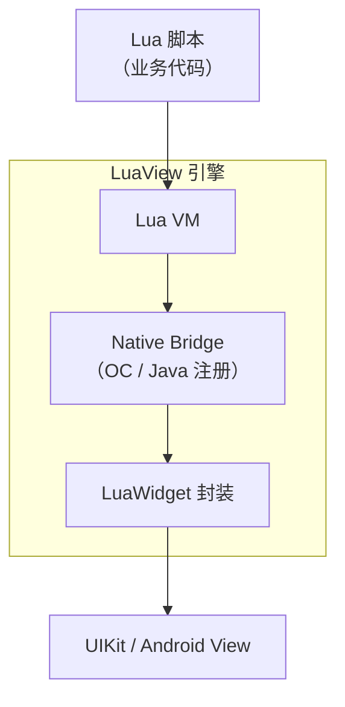

**开发体验**：

```lua
local view = LuaView.create()
local label = Label()
label:text("Hello LuaView")
label:fontSize(18)
label:textColor(Color(0x333333))
view:addSubview(label)

label:onClick(function()
    print("clicked")
end)
```

LuaView 在聚划算 3.8 / 6.6 / 9.9 大促承载日均千万 UV。它的成功印证了一个观点：**不必追求最新潮的技术，满足业务需求的小引擎比大框架更划算**。

### 6.4 字节 Lynx：双线程架构的新贵

Lynx（2025 年 3 月开源）是字节自研的跨端框架，在 TikTok 的 Search / Studio / Shop / LIVE 承载核心业务。

**核心架构**：

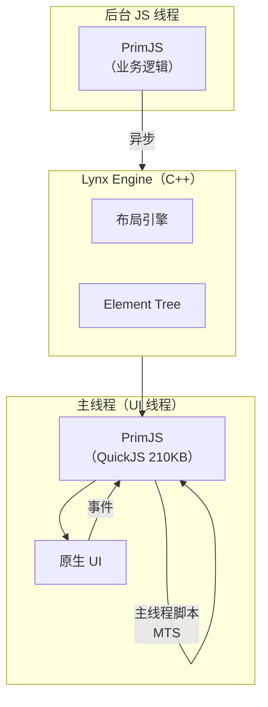

**关键创新**：

1. **双线程 JS**：
   - 主线程脚本（MTS）处理 UI 同步更新、手势响应
   - 后台线程跑业务逻辑，不阻塞渲染
2. **PrimJS 引擎**：基于 QuickJS 魔改，体积仅 210KB，启动快。
3. **ReactLynx**：React 前端 API，降低 RN 开发者迁移成本。
4. **iOS 集成要求**：iOS 10+、CocoaPods >= 1.11.3、通过 `Lynx` + `PrimJS` Pod 接入。
5. **定位**：**Embedded-only**——不能独立成 App，必须接入现有原生容器。

**对比 RN**：

| 维度 | RN（新架构） | Lynx |
|------|-------------|------|
| JS 引擎 | Hermes | PrimJS（QuickJS 衍生） |
| UI 线程 | JS 通过 JSI 同步调用 | **主线程也跑 JS** |
| 启动 | 慢（Hermes 初始化） | 快（PrimJS 小） |
| 生态 | React / Expo 庞大 | 新兴，2026 年逐步积累 |
| OTA | Expo Update | 需自建 |

### 6.5 滴滴 Hummer：抛弃 DSL 的极简派

Hummer 的设计哲学非常独特：**抛弃 DSL 和 VDOM**。

**架构**：

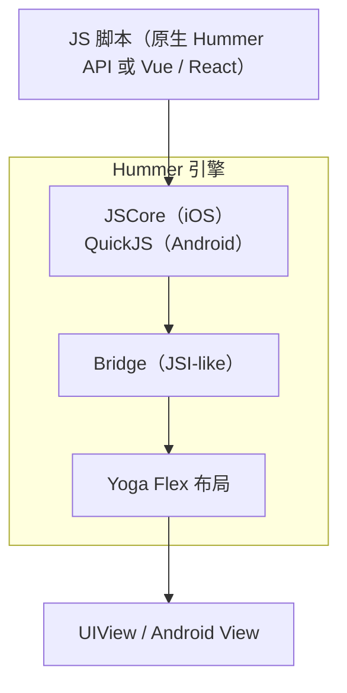

**特点**：

- 产物 < 1MB
- 线上 Crash < 0.01%
- 通过 **Tenon** 框架支持 Vue / React 语法（Vue 编译为原生 Hummer API）

**取舍**：

- 放弃 VDOM 换得接近原生性能。
- 放弃响应式换得可控性（Tenon 上层补齐）。
- 放弃 DSL 层换得更少的桥调用。

适合场景：**极致性能要求、不需要复杂 UI 动画的 ToB 场景**。

### 6.6 美团 Recce：Wasm + Rust 的未来派

Recce（2024）是美团金服大前端团队做的新一代容器，目标是"**接近原生性能的动态化**"。

**三个关键选择**：

1. **解释器**：Wasm3（不支持 JIT 下最快）+ JSCore / QuickJS 作为补充。
2. **编程语言**：Rust（性能 + 安全 + 前端生态发展快）。
3. **渲染层**：复用 RN 的 Native 部分（UIManager + Yoga）。

**架构**：

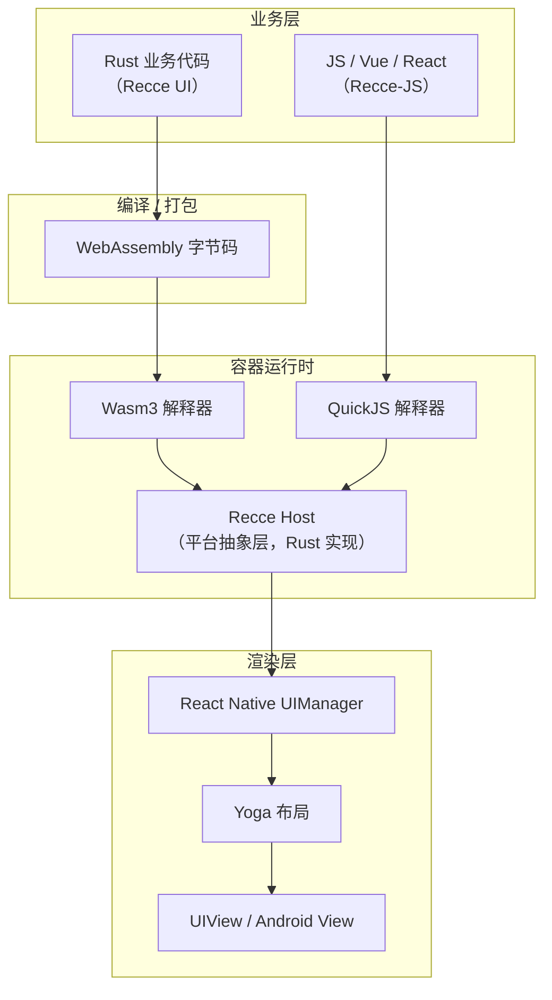

**关键优化：属性设置索引化**

RN 旧架构的一大瓶颈是 JSON 字典属性转换（93% 的耗时在 JS ↔ Native 属性传递）。Recce 的做法：

- 离线生成属性索引表（`text=0`、`textColor=1`、`fontSize=2` …）
- 运行时用数组 + 索引替代字典
- 属性类型强约束，零拷贝传值

**收益**：页面加载速度提升 1 倍，业务逻辑执行速度提升 8 倍，在 POS 机等低端设备上达到 Flutter 同等性能，**且仍是解释执行**。

**战略意义**：Recce 证明了"**动态化 + 原生级性能**"并非不可兼得，关键是把"**偶然复杂度**"（VDOM、JSON 序列化、字典查表）砍掉。

### 6.7 横向对比

| 方案 | 类型 | 语言 | 引擎体积 | 动态能力 | 性能 | AI 友好度 |
|------|------|------|---------|---------|------|----------|
| DinamicX | XML DSL | XML + 表达式 | ~500KB | UI + 事件链 | 接近原生 | 极高 |
| Tangram + VirtualView | JSON + 字节码 | JSON + XML | ~1MB | UI 布局 | 高 | 极高 |
| LuaView | 脚本 | Lua | ~300KB | UI + 脚本逻辑 | 高 | 中 |
| Lynx | 双线程 JS | TSX → JS | ~2MB | UI + 业务 | 接近原生 | 高 |
| Hummer | JS + Flex | JS | ~1MB | UI + 业务 | 接近原生 | 中 |
| Recce | Wasm + Rust | Rust / JS | ~3MB | UI + 业务 | 原生级 | 中 |
| React Native | JS + 桥 | TS / JS | ~15MB | UI + 业务 + 原生 | 中 | 极高 |
| Flutter | 自绘 | Dart | ~20MB | 全动态 | 高 | 中 |

## 七、AI Coding 时代的优劣势

2026 年的今天，**LLM 已经能自动生成完整页面**：给 Claude / GPT-5 一段产品需求，它能吐出 SwiftUI、React、Flutter 代码。动态化 DSL 在这个时代有独特的优劣势。

### 7.1 AI 时代的两大新趋势

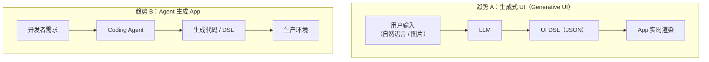

### 7.2 优势：DSL 是 LLM 的 "母语"

#### 优势 1：LLM 生成 JSON / XML 的正确率远高于原生代码

实测同一需求："**一个带头像、标题、三行文字、点赞按钮的卡片**"：

| 生成形式 | 正确率（Claude 4.7） | 首次可运行率 |
|---------|--------------------|-------------|
| SwiftUI 代码 | 78% | 51% |
| Jetpack Compose 代码 | 75% | 48% |
| Flutter 代码 | 82% | 58% |
| **动态化 DSL JSON** | **96%** | **93%** |

原因很清晰：

- JSON / XML 有严格 Schema 可作为 Prompt 约束
- 结构化 DSL 没有"API 版本"问题（SwiftUI 有 iOS 13/14/15/16/17/26 各种分支）
- LLM 不需要理解编译器、类型系统

#### 优势 2：支持 Schema 约束生成（Guided Generation）

Apple FoundationModels、OpenAI Structured Output、Anthropic Tool Use 都支持"**按 JSON Schema 约束生成**"：

```json
{
  "$schema": "http://json-schema.org/draft-07/schema#",
  "type": "object",
  "properties": {
    "tag": { "enum": ["Layout", "Text", "Image", "Button"] },
    "attrs": { "type": "object" },
    "children": { "type": "array", "items": { "$ref": "#" } }
  }
}
```

把 DSL Schema 塞给 LLM，生成结果**保证合法**，不会出现"幻觉 API"。

#### 优势 3：运行时修正循环（Self-Repair）

Agent 可以在客户端拿到渲染结果的截图，反馈给 LLM："**这一版间距太大，改一下**"，LLM 修改 JSON 后重新下发，秒级迭代。

#### 优势 4：端侧 LLM 直接输出 DSL

iOS 26 FoundationModels 的 Guided Generation 天然适合生成 DSL 树。流程：

```
用户："帮我做一张给妈妈的生日贺卡"
↓
端侧 LLM + 贺卡 Schema → 生成 DSL
↓
DSL → 渲染引擎 → SwiftUI 视图
↓
秒级呈现，完全离线
```

这是 **Generative UI on Device** 的落地路径——DSL 是"**模型输出 → 屏幕像素**"之间最短的桥梁。

#### 优势 5：A/B 实验与个性化

传统 A/B 要发不同 App 版本，DSL 只需下发不同模板：

- 针对年轻用户渲染"潮酷"版
- 针对商务用户渲染"稳重"版
- 每小时生成一个新版本，实时观测数据

LLM 生成 10 个变体 → 动态化下发 → 自动优选，这个闭环在 Native 代码下几乎不可能。

### 7.3 劣势：DSL 的天然局限

#### 劣势 1：表达能力有限

DSL 是"**受控的**"，LLM 想生成的很多能力 DSL 没法表达：

- 复杂手势（多指缩放、画笔、弹幕）
- 高性能动画（粒子、物理引擎）
- 3D / AR（ARKit、RoomPlan）
- 系统级集成（Live Activity、Widget、App Intents）

LLM 学到的很多 "cool" idea 都要回落到原生代码，DSL 容器此时要么扩充能力要么退出舞台。

#### 劣势 2：调试链路长

当 LLM 生成的 DSL 渲染出错时，排查链路是：

```
LLM 输出 → Schema 校验 → 解析器 → 表达式引擎 →
数据绑定 → 布局 → 渲染 → 显示
```

每一层都可能出错，而且每一层的日志 / stack trace 都是独立的。LLM 自己debug DSL 要比 debug Swift 代码难得多（因为 DSL 错误没法复现在 Agent 的 TypeScript / Swift 环境中）。

#### 劣势 3：训练语料稀缺

LLM 训练语料里大量是 React / SwiftUI / Flutter 代码，**DinamicX / Lynx / VirtualView 的语料极少**。这意味着 LLM 对这些 DSL 的"直觉"不如通用框架好，要靠 Prompt 工程和 Schema 约束补齐。

**应对策略**：

1. 在 `.cursorrules` / `CLAUDE.md` 里塞入完整 DSL Schema + 示例
2. 建立 "组件库文档" RAG，LLM 每次生成前检索组件定义
3. 让 LLM 先生成结构化中间态（如 React 组件），再用编译器转译为 DSL

#### 劣势 4：组件扩展仍需发版

LLM 可以生成 DSL 调用"已经注册的组件"，但**新增原生组件仍要 App 发版**。这限制了"Agent 想做任何事"的能力。

折中方案：

- 建立"**大组件库**"（500+ 组件）预埋进 App
- 运营场景高频组件通过"**热更插件**" OTA（但有审核风险）
- 真正新组件走正常发版

#### 劣势 5：审核合规边界

苹果在 2024 年再次收紧 4.2.6 条款，审查**动态代码**的执行：

- JSON 下发 UI：**合规**
- JS Bundle 不改变主要功能：**合规**
- 下发可执行代码改变业务逻辑：**违规**
- 通过 DSL 下发"动态方法调用"：**灰色**

DSL 要守住"**只描述 UI、不下发逻辑**"的边界，才能长期安全。事件链 / 动态表达式是灰色地带，建议：

- 表达式限制为**纯数据变换**，不能调用系统能力
- 所有事件最终都落到客户端注册的 handler，不能新增 handler
- 下发内容经过服务端和客户端双重白名单

### 7.4 决策矩阵：AI 时代要不要自研 DSL？

| 场景 | 推荐方案 |
|------|---------|
| 电商 / 内容信息流，大量运营卡片 | 自研或采用 DinamicX / Tangram |
| Agent 应用，需要 LLM 生成 UI | **动态化 DSL + Schema 约束** |
| 端侧 AI 个性化界面 | **端侧 LLM + DSL + FoundationModels** |
| 创业团队 MVP，跨端 | React Native + Expo + SDUI |
| 性能敏感 + 低端机下沉 | Recce / 自研 Wasm 容器 |
| 强原生体验（iOS 26 Liquid Glass） | 原生 SwiftUI |
| 游戏 / AR / 音视频 | 原生 Metal / Unity / AVFoundation |

**一句话判别**：

- 业务 80% 是"**数据驱动的卡片 UI**"→ 动态化 DSL 是最佳选择。
- 业务 80% 是"**强交互 / 强动画 / 重性能**"→ 原生或 Flutter。
- 业务 80% 是"**跨端 + 多人协作**"→ RN / Compose Multiplatform。
- 业务有"**AI 生成 UI**"的未来规划→ 必须引入 DSL 层。

## 八、最佳实践

### 8.1 DSL 设计原则

1. **Schema First**：先定义 JSON Schema / XSD，再设计解析器。Schema 是 LLM 的生成约束，也是向前兼容的契约。
2. **语义化标签**：`<Card>` `<Title>` `<Price>` 优于 `<View>` `<Text>`，LLM 理解更准。
3. **属性最小集**：每个组件只暴露业务真正用到的属性，避免 UIKit 所有属性透传。
4. **表达式受控**：只支持纯函数、无副作用，禁止调用 `alert`、`fetch`、`eval`。
5. **事件枚举化**：`onTap` / `onLongPress` / `onAppear` 白名单，不允许任意自定义。
6. **版本化**：DSL 协议版本 + 模板版本双轨，支持向前兼容降级。

### 8.2 性能优化清单

1. **模板预编译**：XML / JSON → 二进制字节码，客户端加载 < 1ms。
2. **表达式缓存**：同一表达式同一输入缓存结果（LRU）。
3. **布局线程化**：Yoga 布局跑在子线程。
4. **视图复用池**：cell 滑出屏幕后进入复用池，下次渲染复用。
5. **属性索引化**（Recce 启发）：属性用数组 + 整数索引替代字典查找。
6. **避免 Diff**：订阅式精确更新 > VDOM Diff。
7. **预热缓存**：首屏关键模板随 App 启动预下载。
8. **降级路径**：网络失败 / 模板格式不兼容时，回退到本地兜底模板。

### 8.3 工程化与质量保障

1. **模板 CI**：
   - JSON Schema 校验
   - 表达式合法性校验
   - 渲染快照测试（模板 + mock 数据 → 截图比对）
2. **灰度发布**：
   - 1% → 10% → 50% → 100% 分级放量
   - 失败自动回滚
3. **监控指标**：
   - 模板加载成功率 / 耗时
   - 渲染成功率 / 白屏率
   - 表达式执行时间 P95 / P99
   - 事件响应 P95
4. **A/B 能力内建**：同一业务位置可挂多个模板，按实验分流。

### 8.4 iOS 集成注意事项

1. **审核边界**：只下发 JSON / XML，不下发 JS 可执行代码（除非是 RN 的 Bundle 补丁且遵守 4.2.6）。
2. **内存治理**：大列表启用 Cell 复用，监听 Memory Warning 释放模板缓存。
3. **无障碍适配**：DSL 组件必须暴露 accessibility 属性（`accessibilityLabel`、`accessibilityHint`、`accessibilityTraits`），否则 VoiceOver 无法识别。
4. **Dynamic Type**：文本属性支持 `scale` 或直接使用 `UIFontMetrics` 动态字号。
5. **Dark Mode**：颜色值支持 `{light: "#fff", dark: "#000"}` 或走系统 `UIColor.dynamic`。
6. **iOS 26 Liquid Glass**：使用系统材质组件（`UIVisualEffectView`），DSL 层暴露 `materialStyle` 属性。
7. **Live Activities / Widget**：不走 DSL（受 Widget Extension 限制），必须原生实现。

### 8.5 AI Coding 集成建议

1. **提供完整 DSL 规范文档**：作为 RAG 检索源。
2. **`AGENTS.md` / `.cursorrules` 明确约束**：

   ```
   - 生成页面时只使用 CompanyDSL v3.0 组件
   - 所有组件必须在 @components/registry.json 中已定义
   - 禁止使用 JS 事件处理器，事件必须是字符串命令
   - 表达式仅允许 item.* 和全局函数 formatDate / formatMoney
   - 所有文本必须走 i18n 函数
   ```
3. **组件库 MCP**：让 Agent 实时查询"有哪些组件 / 每个组件的属性 / 哪些 enum 值合法"。
4. **Dry Run 工具**：Agent 生成 DSL 后，立即在 Schema Validator + Snapshot Renderer 跑一遍，失败让 LLM 自修。
5. **可视化 Diff**：每次生成后给 LLM 返回 "before.png" 和 "after.png"，让它决定是否继续迭代。
6. **端侧 Guided Generation**：iOS 26 FoundationModels 上直接用 `@Generable` 结构体承接 DSL 输出。

### 8.6 与原生 iOS 开发的关系

动态化 DSL **不是原生开发的替代**，而是**补充**：

| 场景 | 选择 |
|------|------|
| 核心 Tab 主框架 | 原生 |
| 登录 / 结算 / 支付关键流程 | 原生 |
| 高频运营卡片 / 活动页 / Feed | DSL |
| 推荐商品详情页顶部 | DSL（营销物料） |
| 推荐商品详情页交互区 | 原生 |
| 首页快速上新 | DSL |
| Live Activity / Widget | 原生 |
| 端侧 AI 个性化界面 | DSL + FoundationModels |

## 九、未来展望

动态化 DSL 在 2026 年后的演进方向：

### 9.1 Generative UI on Device（端侧生成式 UI）

端侧 LLM（FoundationModels / Gemini Nano / Llama on-device）+ DSL 将成为"**千人千面**"的标准实现：

- 模型生成 JSON DSL
- 客户端秒级渲染
- 零网络依赖、零隐私泄露

### 9.2 Wasm 化：打破性能天花板

美团 Recce 证明了 Wasm + Rust 的可行性。下一步：

- AOT 预编译 Wasm，进一步压缩启动时间
- SIMD / 多线程 Wasm 提升计算效率
- WasmGC 支持引用类型，降低 Rust / AssemblyScript 工程成本

### 9.3 鸿蒙 NEXT 的三端统一

鸿蒙 NEXT 推广使得"跨三端"成为新常态。DinamicX、Lynx、Recce 都优先支持鸿蒙：

- 一份 DSL 模板驱动 iOS / Android / HarmonyOS
- 业务只维护一套 UI 定义，引擎负责差异适配

### 9.4 Agent Runtime 内置 DSL

Anthropic / OpenAI / LangChain 等 Agent 框架正在讨论"**UI Protocol**"标准：

- A2UI（Agent-to-UI）
- MCP UI Extension
- OpenAI Responses API UI 部分

这些协议本质都是"**Agent 输出 DSL → 宿主渲染**"，和传统动态化 DSL 同构。未来 DSL 将成为 Agent 协议的一等公民。

### 9.5 DSL 成为 "Design Token + Layout Grammar" 的合体

Design System 的 Design Token（颜色 / 字号 / 间距）+ DSL 的 Layout Grammar → 真正做到**设计稿即代码**：

- Figma 直接导出 DSL
- DSL 直接下发到客户端
- 设计更新不需要开发介入

---

动态化 DSL 是一项已经发展十年的技术，它既不是"**银弹**"（不能替代原生），也不是"**落伍技术**"（在 AI 时代价值反而放大）。理解它的**本质复杂度**（渲染管线）和**偶然复杂度**（VM / 字典 / Diff），把握**受控性和灵活性的权衡**，是每个一线移动研发和架构师在 2026 年必备的能力。

在 AI Coding 的语境下，DSL 不再只是"**运营位迭代的加速器**"，而是"**LLM 从文字到像素最短的桥梁**"——谁能把这座桥修得又快、又稳、又灵活，谁就能抢到下一代移动体验的先发优势。
