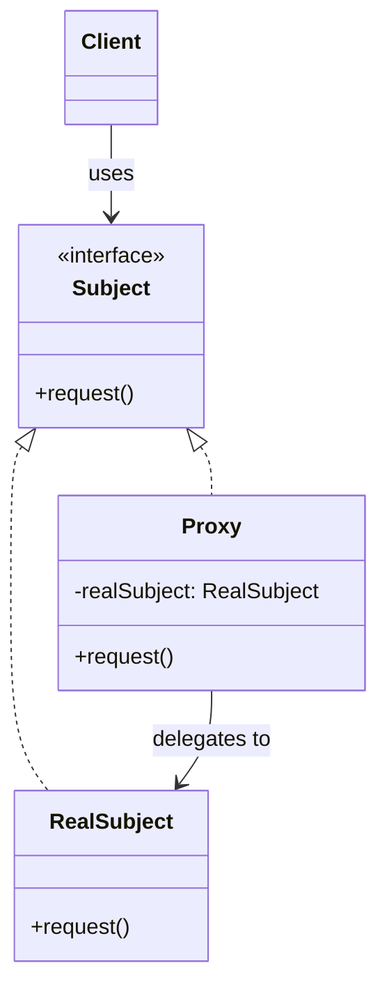
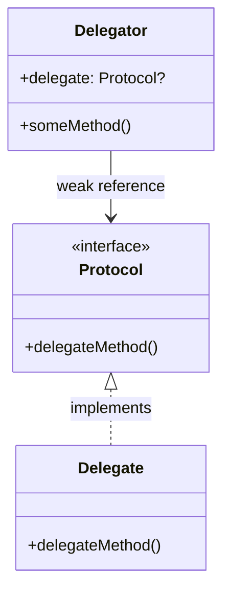

+++
title = "代理模式"
date = '2026-05-02T22:32:27+08:00'
draft = false
weight = 1
tags = ["设计模式", "面试"]
categories = ["设计模式", "面试"]
+++
在iOS开发中，"代理"这个词通常有两层含义：
1. **设计模式中的代理模式（Proxy Pattern）**：提供目标对象的替代品或占位符，控制对目标对象的访问
2. **iOS中的代理模式（Delegate Pattern）**：一种基于协议的回调机制，用于对象间通信

虽然中文都叫"代理"，但它们是不同的设计模式，解决不同的问题。本文将两者都进行详细介绍。

---

## 一、Proxy Pattern（代理模式）

### 定义

代理模式（Proxy Pattern）是一种**结构型设计模式**，它为其他对象提供一种代理以控制对这个对象的访问。

**核心思想**：代理对象作为真实对象的"替身"，客户端通过代理间接访问真实对象。代理可以在访问前后添加额外逻辑，而调用者对此毫不知情。

```
Client  →  Proxy  →  RealSubject
            ↑
         控制访问
         添加功能
         延迟创建
```

**关键特征**：
- 代理对象与真实对象**实现相同的接口**
- 客户端**不知道**自己使用的是代理还是真实对象
- 代理对象**持有**真实对象的引用（通常是强引用）

### 模式结构



### Proxy的类型

#### 1. 虚拟代理（Virtual Proxy）

虚拟代理用于延迟创建开销大的对象，只有在真正需要时才创建：

```swift
// 图片协议
protocol Image {
    func display()
}

// 真实图片对象 - 加载开销大
class RealImage: Image {
    private let filename: String
    
    init(filename: String) {
        self.filename = filename
        loadFromDisk()
    }
    
    private func loadFromDisk() {
        print("Loading image: \(filename)")
        // 模拟耗时加载
        Thread.sleep(forTimeInterval: 1)
    }
    
    func display() {
        print("Displaying image: \(filename)")
    }
}

// 虚拟代理 - 延迟加载
class ImageProxy: Image {
    private let filename: String
    private var realImage: RealImage?
    
    init(filename: String) {
        self.filename = filename
        // 不立即加载图片
    }
    
    func display() {
        // 只有在真正需要显示时才加载
        if realImage == nil {
            realImage = RealImage(filename: filename)
        }
        realImage?.display()
    }
}

// 使用
let image: Image = ImageProxy(filename: "large_photo.jpg")
// 此时图片还未加载

image.display() // 此时才加载并显示
image.display() // 第二次直接显示，无需再次加载
```

#### 2. 保护代理（Protection Proxy）

保护代理用于控制对原始对象的访问权限：

```swift
// 文档协议
protocol Document {
    func read() -> String
    func write(_ content: String)
}

// 真实文档
class RealDocument: Document {
    private var content: String
    
    init(content: String) {
        self.content = content
    }
    
    func read() -> String {
        return content
    }
    
    func write(_ content: String) {
        self.content = content
    }
}

// 用户角色
enum UserRole {
    case guest
    case editor
    case admin
}

// 保护代理
class DocumentProxy: Document {
    private let document: RealDocument
    private let userRole: UserRole
    
    init(document: RealDocument, userRole: UserRole) {
        self.document = document
        self.userRole = userRole
    }
    
    func read() -> String {
        // 所有用户都可以读取
        return document.read()
    }
    
    func write(_ content: String) {
        // 只有编辑者和管理员可以写入
        switch userRole {
        case .guest:
            print("Access denied: Guests cannot edit documents")
        case .editor, .admin:
            document.write(content)
            print("Document updated successfully")
        }
    }
}

// 使用
let doc = RealDocument(content: "Original content")

let guestProxy = DocumentProxy(document: doc, userRole: .guest)
guestProxy.read()  // OK
guestProxy.write("New content")  // Access denied

let editorProxy = DocumentProxy(document: doc, userRole: .editor)
editorProxy.write("New content")  // OK
```

#### 3. 远程代理（Remote Proxy）

远程代理用于代表远程对象，封装网络通信细节：

```swift
// 用户模型
struct User: Codable {
    let id: String
    let name: String
    let email: String
}

// 用户服务协议
protocol UserService {
    func getUser(id: String, completion: @escaping (Result<User, Error>) -> Void)
    func updateUser(_ user: User, completion: @escaping (Result<Void, Error>) -> Void)
}

// 远程代理 - 封装网络请求
class RemoteUserServiceProxy: UserService {
    private let baseURL: URL
    private let session: URLSession
    
    init(baseURL: URL, session: URLSession = .shared) {
        self.baseURL = baseURL
        self.session = session
    }
    
    func getUser(id: String, completion: @escaping (Result<User, Error>) -> Void) {
        let url = baseURL.appendingPathComponent("users/\(id)")
        
        session.dataTask(with: url) { data, response, error in
            if let error = error {
                completion(.failure(error))
                return
            }
            
            guard let data = data else {
                completion(.failure(NetworkError.noData))
                return
            }
            
            do {
                let user = try JSONDecoder().decode(User.self, from: data)
                completion(.success(user))
            } catch {
                completion(.failure(error))
            }
        }.resume()
    }
    
    func updateUser(_ user: User, completion: @escaping (Result<Void, Error>) -> Void) {
        // 实现更新逻辑
    }
}

enum NetworkError: Error {
    case noData
}
```

#### 4. 缓存代理（Caching Proxy）

缓存代理用于缓存操作结果，避免重复计算或请求：

```swift
// 数据获取协议
protocol DataFetcher {
    func fetchData(for key: String) -> Data?
}

// 真实数据获取器
class RealDataFetcher: DataFetcher {
    func fetchData(for key: String) -> Data? {
        print("Fetching data for key: \(key)")
        // 模拟耗时操作
        Thread.sleep(forTimeInterval: 0.5)
        return "Data for \(key)".data(using: .utf8)
    }
}

// 缓存代理
class CachingDataFetcherProxy: DataFetcher {
    private let fetcher: DataFetcher
    private var cache: [String: Data] = [:]
    private let cacheQueue = DispatchQueue(label: "cache.queue")
    
    init(fetcher: DataFetcher) {
        self.fetcher = fetcher
    }
    
    func fetchData(for key: String) -> Data? {
        // 先检查缓存
        var cachedData: Data?
        cacheQueue.sync {
            cachedData = cache[key]
        }
        
        if let data = cachedData {
            print("Cache hit for key: \(key)")
            return data
        }
        
        // 缓存未命中，获取数据
        print("Cache miss for key: \(key)")
        if let data = fetcher.fetchData(for: key) {
            cacheQueue.sync {
                cache[key] = data
            }
            return data
        }
        
        return nil
    }
    
    func clearCache() {
        cacheQueue.sync {
            cache.removeAll()
        }
    }
}

// 使用
let fetcher = RealDataFetcher()
let cachingFetcher = CachingDataFetcherProxy(fetcher: fetcher)

cachingFetcher.fetchData(for: "user_1")  // Cache miss, fetches data
cachingFetcher.fetchData(for: "user_1")  // Cache hit
cachingFetcher.fetchData(for: "user_2")  // Cache miss
```

### NSProxy的使用

`NSProxy`是Foundation框架提供的代理基类，专门用于实现代理模式：

```objectivec
// Objective-C中使用NSProxy实现消息转发
@interface WeakProxy : NSProxy

+ (instancetype)proxyWithTarget:(id)target;

@end

@implementation WeakProxy {
    __weak id _target;
}

+ (instancetype)proxyWithTarget:(id)target {
    WeakProxy *proxy = [WeakProxy alloc];
    proxy->_target = target;
    return proxy;
}

- (id)target {
    return _target;
}

- (NSMethodSignature *)methodSignatureForSelector:(SEL)sel {
    return [_target methodSignatureForSelector:sel];
}

- (void)forwardInvocation:(NSInvocation *)invocation {
    if (_target) {
        [invocation invokeWithTarget:_target];
    }
}

// 重要: NSProxy没有响应respondsToSelector等基础方法,需要转发
- (BOOL)respondsToSelector:(SEL)aSelector {
    return [_target respondsToSelector:aSelector];
}

@end
```

Swift版本的弱引用代理：

```swift
class WeakProxy<T: AnyObject> {
    private(set) weak var target: T?
    
    init(target: T) {
        self.target = target
    }
}

// 用于解决Timer循环引用
class WeakTimerProxy: NSObject {
    private weak var target: AnyObject?
    private let selector: Selector
    
    init(target: AnyObject, selector: Selector) {
        self.target = target
        self.selector = selector
        super.init()
    }
    
    @objc func timerFired(_ timer: Timer) {
        if let target = target {
            _ = target.perform(selector, with: timer)
        } else {
            timer.invalidate()
        }
    }
}

// 使用
class ViewController: UIViewController {
    private var timer: Timer?
    
    override func viewDidLoad() {
        super.viewDidLoad()
        
        let proxy = WeakTimerProxy(target: self, selector: #selector(handleTimer))
        timer = Timer.scheduledTimer(
            timeInterval: 1.0,
            target: proxy,
            selector: #selector(WeakTimerProxy.timerFired(_:)),
            userInfo: nil,
            repeats: true
        )
    }
    
    @objc func handleTimer(_ timer: Timer) {
        print("Timer fired")
    }
    
    deinit {
        timer?.invalidate()
        print("ViewController deallocated")
    }
}
```

---

## 二、Delegate Pattern（iOS代理模式）

### 定义

iOS的代理模式（Delegate Pattern）是一种**行为型设计模式**，也是iOS开发中最重要的设计模式之一。

**核心思想**：对象将某些职责"外包"给另一个对象处理。委托者（Delegator）不关心具体由谁来处理，只要对方遵循约定的协议即可。

```
Delegator  ←→  Protocol  ←  Delegate
    ↓              ↑           ↑
  触发事件       定义契约      实现处理
```

**关键特征**：
- 通过 **协议（Protocol）** 定义回调接口
- 委托者**不知道**delegate的具体类型，只知道它遵循协议
- 使用**弱引用**持有delegate，避免循环引用
- 是一种**一对一**的通信机制

### 与Proxy Pattern的本质区别

| Proxy Pattern | Delegate Pattern |
|---------------|------------------|
| 代理"冒充"真实对象 | delegate是独立的对象 |
| 调用者以为在调用真实对象 | 委托者明确知道在调用delegate |
| 代理主动拦截请求 | delegate被动响应事件 |
| 目的是控制/增强访问 | 目的是解耦和回调 |

一个形象的比喻：
- **Proxy**：你的秘书帮你接电话，对方以为是在和你通话
- **Delegate**：你接到电话后，请专家帮你回答技术问题

### 基本结构



### 实现示例

```swift
// 定义协议
protocol DownloadManagerDelegate: AnyObject {
    func downloadDidStart(_ manager: DownloadManager)
    func downloadDidComplete(_ manager: DownloadManager, data: Data)
}

// 委托者
class DownloadManager {
    weak var delegate: DownloadManagerDelegate?
    
    func startDownload(url: URL) {
        delegate?.downloadDidStart(self)
        // 模拟下载完成
        let data = Data()
        delegate?.downloadDidComplete(self, data: data)
    }
}

// 委托实现者
class ViewController: UIViewController, DownloadManagerDelegate {
    private let downloadManager = DownloadManager()
    
    override func viewDidLoad() {
        super.viewDidLoad()
        downloadManager.delegate = self
    }
    
    func downloadDidStart(_ manager: DownloadManager) {
        print("Download Start")
    }
    
    func downloadDidComplete(_ manager: DownloadManager, data: Data) {
        print("Download completed")
    }
}
```

### UIKit中的委托模式

#### UITableViewDelegate & UITableViewDataSource

```swift
class TableViewController: UIViewController {
    private let tableView = UITableView()
    private var items: [String] = []
    
    override func viewDidLoad() {
        super.viewDidLoad()
        
        tableView.delegate = self
        tableView.dataSource = self
    }
}

extension TableViewController: UITableViewDataSource {
    func tableView(_ tableView: UITableView, numberOfRowsInSection section: Int) -> Int {
        return items.count
    }
    
    func tableView(_ tableView: UITableView, cellForRowAt indexPath: IndexPath) -> UITableViewCell {
        let cell = tableView.dequeueReusableCell(withIdentifier: "Cell", for: indexPath)
        cell.textLabel?.text = items[indexPath.row]
        return cell
    }
}

extension TableViewController: UITableViewDelegate {
    func tableView(_ tableView: UITableView, didSelectRowAt indexPath: IndexPath) {
        print("Selected: \(items[indexPath.row])")
    }
    
    func tableView(_ tableView: UITableView, heightForRowAt indexPath: IndexPath) -> CGFloat {
        return 60
    }
}
```

### 多播委托（Multicast Delegate）

当需要向多个对象广播事件时，可以使用多播委托：

```swift
class MulticastDelegate<T> {
    private var delegates = NSHashTable<AnyObject>.weakObjects()
    private let lock = NSLock()
    
    func add(_ delegate: T) {
        lock.lock()
        defer { lock.unlock() }
        delegates.add(delegate as AnyObject)
    }
    
    func remove(_ delegate: T) {
        lock.lock()
        defer { lock.unlock() }
        delegates.remove(delegate as AnyObject)
    }
    
    func invoke(_ invocation: (T) -> Void) {
        // 先复制一份代理列表,避免遍历时被修改
        let currentDelegates: [AnyObject]
        lock.lock()
        currentDelegates = delegates.allObjects
        lock.unlock()
        
        for delegate in currentDelegates {
            if let delegate = delegate as? T {
                invocation(delegate)
            }
        }
    }
}

// 使用示例
protocol PlayerDelegate: AnyObject {
    func playerDidStart(_ player: Player)
    func playerDidStop(_ player: Player)
}

class Player {
    let delegates = MulticastDelegate<PlayerDelegate>()
    
    func play() {
        delegates.invoke { $0.playerDidStart(self) }
    }
    
    func stop() {
        delegates.invoke { $0.playerDidStop(self) }
    }
}

// 多个监听者
class AnalyticsObserver: PlayerDelegate {
    func playerDidStart(_ player: Player) {
        print("Analytics: Player started")
    }
    
    func playerDidStop(_ player: Player) {
        print("Analytics: Player stopped")
    }
}

class UIObserver: PlayerDelegate {
    func playerDidStart(_ player: Player) {
        print("UI: Update play button")
    }
    
    func playerDidStop(_ player: Player) {
        print("UI: Reset UI")
    }
}

// 注册多个委托
let player = Player()
let analytics = AnalyticsObserver()
let uiObserver = UIObserver()

player.delegates.add(analytics)
player.delegates.add(uiObserver)

player.play()  // 两个观察者都会收到通知
```

### 最佳实践

### 1. 使用weak引用避免循环引用

```swift
protocol SomeDelegate: AnyObject {  // 必须继承AnyObject
    func doSomething()
}

class SomeClass {
    weak var delegate: SomeDelegate?  // 使用weak
}
```

### 2. 协议命名规范

```swift
// 好的命名
protocol TableViewDelegate { }
protocol DownloadManagerDelegate { }
protocol NetworkServiceDelegate { }

// 方法命名 - 使用委托者名称作为第一个参数
func tableView(_ tableView: UITableView, didSelectRowAt indexPath: IndexPath)
func downloadManager(_ manager: DownloadManager, didFinishWith data: Data)
```

### 3. 可选方法的处理

```swift
// 方式1: 使用extension提供默认实现
protocol MyDelegate: AnyObject {
    func requiredMethod()
    func optionalMethod()
}

extension MyDelegate {
    func optionalMethod() {
        // 默认空实现
    }
}

// 方式2: 使用@objc optional（需要协议标记为@objc）
@objc protocol ObjCDelegate {
    func requiredMethod()
    @objc optional func optionalMethod()
}
```

---

## 三、使用场景对比

### Proxy Pattern 使用场景

| 类型 | 场景 | 示例 |
|------|------|------|
| 虚拟代理 | 延迟创建开销大的对象 | 图片懒加载、大文件延迟读取 |
| 保护代理 | 控制对资源的访问权限 | 权限验证、敏感操作拦截 |
| 远程代理 | 封装网络通信细节 | API客户端、RPC调用 |
| 缓存代理 | 避免重复计算或请求 | 数据缓存、结果复用 |
| 智能代理 | 附加操作管理 | 引用计数、日志记录 |

### Delegate Pattern 使用场景

| 场景 | 示例 |
|------|------|
| UI事件回调 | `UITableViewDelegate`、`UITextFieldDelegate` |
| 生命周期通知 | `UIApplicationDelegate` |
| 数据源提供 | `UITableViewDataSource`、`UICollectionViewDataSource` |
| 自定义组件通信 | 自定义View与ViewController的交互 |
| 反向传值 | 子页面向父页面传递数据 |

## 四、优缺点

### Proxy Pattern

| 优点 | 缺点 |
|------|------|
| 职责分离，代理与真实对象各司其职 | 引入额外的代理类，增加复杂度 |
| 保护真实对象，可在访问前进行检查 | 可能增加调用层级，影响性能 |
| 延迟加载，优化性能和资源使用 | 代理过多时难以维护 |
| 对客户端透明，无需修改调用方式 | |

### Delegate Pattern

| 优点 | 缺点 |
|------|------|
| 松耦合，委托者不依赖具体实现 | 一对一通信，多播需要额外实现 |
| 灵活，运行时可更换delegate | 委托链复杂时难以追踪 |
| 清晰的接口契约（协议） | 过多的delegate方法会使协议臃肿 |
| iOS生态广泛使用，开发者熟悉 | 弱引用可能导致delegate提前释放 |
