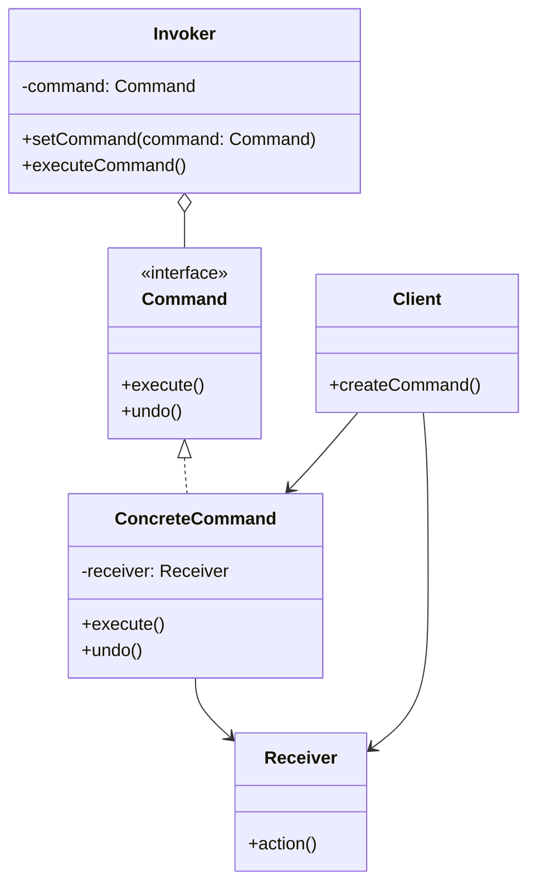

+++
title = "命令模式"
date = '2026-05-02T22:32:27+08:00'
draft = false
weight = 3
tags = ["设计模式", "面试"]
categories = ["设计模式", "面试"]
+++
## 定义

命令模式（Command Pattern）是一种行为型设计模式，它将请求封装成对象，从而可以用不同的请求对客户进行参数化，对请求排队或记录请求日志，以及支持可撤销的操作。

命令模式的核心思想是：将"请求"封装成一个对象，使得可以用不同的请求、队列或日志来参数化其他对象，同时支持可撤销操作。

## 为什么需要命令模式

命令模式要解决的核心问题是：**将请求（操作）封装成对象，使得可以对请求进行存储、传递、撤销等操作**。

**问题场景**：假设我们正在开发一个文本编辑器，需要支持撤销/重做功能。

最直接的方式可能是这样：

```swift
class TextEditor {
    var text: String = ""
    
    func insertText(_ newText: String, at position: Int) {
        let index = text.index(text.startIndex, offsetBy: position)
        text.insert(contentsOf: newText, at: index)
    }
    
    func deleteText(from start: Int, length: Int) {
        let startIndex = text.index(text.startIndex, offsetBy: start)
        let endIndex = text.index(startIndex, offsetBy: length)
        text.removeSubrange(startIndex..<endIndex)
    }
}

// 用户操作
let editor = TextEditor()
editor.insertText("Hello", at: 0)
editor.insertText(" World", at: 5)
editor.deleteText(from: 5, length: 6)

// 如何实现撤销？需要记住每次操作的类型、参数、以及如何逆向执行
// 这变得非常复杂...
```

这种方式有什么问题？

1. **无法撤销**：操作执行后，没有记录如何逆向操作
2. **操作无法存储**：不能保存操作历史，无法实现重做
3. **操作无法传递**：不能将操作放入队列延迟执行
4. **调用者与执行者紧耦合**：调用代码直接依赖具体的操作方法

**命令模式的解决思路**：

将每个操作封装成命令对象，命令对象知道如何执行和撤销自己：

```swift
// 命令协议
protocol Command {
    func execute()
    func undo()
}

// 插入文本命令
class InsertTextCommand: Command {
    private let editor: TextEditor
    private let text: String
    private let position: Int
    
    init(editor: TextEditor, text: String, at position: Int) {
        self.editor = editor
        self.text = text
        self.position = position
    }
    
    func execute() {
        editor.insertText(text, at: position)
    }
    
    func undo() {
        editor.deleteText(from: position, length: text.count)
    }
}

// 命令管理器
class CommandManager {
    private var history: [Command] = []
    
    func execute(_ command: Command) {
        command.execute()
        history.append(command)
    }
    
    func undo() {
        guard let command = history.popLast() else { return }
        command.undo()
    }
}

// 使用
let manager = CommandManager()
manager.execute(InsertTextCommand(editor: editor, text: "Hello", at: 0))
manager.execute(InsertTextCommand(editor: editor, text: " World", at: 5))

// 撤销最后一步操作
manager.undo()  // " World" 被删除
```

**命令模式的好处**：
- **支持撤销/重做**：命令对象保存了执行和撤销所需的所有信息
- **操作可存储**：命令对象可以被存储到队列或日志中
- **操作可组合**：多个命令可以组合成宏命令
- **解耦调用者和执行者**：调用者不需要知道操作的具体实现

## 模式结构



## 角色说明

- **Command（命令接口）**：声明执行操作的接口
- **ConcreteCommand（具体命令）**：将一个接收者对象绑定于一个动作
- **Invoker（调用者）**：要求该命令执行请求
- **Receiver（接收者）**：知道如何实施与执行请求相关的操作
- **Client（客户端）**：创建具体命令对象并设定其接收者

## iOS中的Target-Action机制

iOS中的Target-Action是命令模式的一种体现，它将动作封装并延迟执行：

```swift
class ViewController: UIViewController {
    override func viewDidLoad() {
        super.viewDidLoad()
        
        let button = UIButton(type: .system)
        button.setTitle("Click Me", for: .normal)
        
        // 添加target-action
        button.addTarget(self, action: #selector(buttonTapped), for: .touchUpInside)
        
        view.addSubview(button)
    }
    
    @objc func buttonTapped() {
        print("Button was tapped")
    }
}
```

## 实际应用场景

### 1. WebView JS Bridge

WebView 的 JS Bridge 是命令模式的典型应用场景。每个 JS 调用的 Native 方法都可以封装为一个命令对象：

```swift
import WebKit

// Bridge 命令协议
protocol BridgeCommand {
    /// 命令名称，对应 JS 调用的方法名
    var name: String { get }
    /// 执行命令
    func execute(params: [String: Any], callback: @escaping (Result<Any?, Error>) -> Void)
}

// 接收者 - Native 服务层
class UserService {
    func getUserInfo() -> [String: Any] {
        return ["userId": "123", "name": "张三", "avatar": "https://example.com/avatar.jpg"]
    }
    
    func logout() {
        print("User logged out")
    }
}

class DeviceService {
    func getDeviceInfo() -> [String: Any] {
        return [
            "platform": "iOS",
            "version": UIDevice.current.systemVersion,
            "model": UIDevice.current.model
        ]
    }
    
    func vibrate() {
        // 触发震动
        print("Device vibrated")
    }
}

// 具体命令 - 获取用户信息
class GetUserInfoCommand: BridgeCommand {
    var name: String { "getUserInfo" }
    
    private let userService: UserService
    
    init(userService: UserService) {
        self.userService = userService
    }
    
    func execute(params: [String: Any], callback: @escaping (Result<Any?, Error>) -> Void) {
        let userInfo = userService.getUserInfo()
        callback(.success(userInfo))
    }
}

// 具体命令 - 退出登录
class LogoutCommand: BridgeCommand {
    var name: String { "logout" }
    
    private let userService: UserService
    
    init(userService: UserService) {
        self.userService = userService
    }
    
    func execute(params: [String: Any], callback: @escaping (Result<Any?, Error>) -> Void) {
        userService.logout()
        callback(.success(nil))
    }
}

// Bridge 错误类型
enum BridgeError: Error {
    case commandNotFound
    case invalidParams
    case executionFailed(String)
}

// 调用者 - JS Bridge 管理器
class JSBridge: NSObject {
    private var commands: [String: BridgeCommand] = [:]
    private weak var webView: WKWebView?
    
    init(webView: WKWebView) {
        self.webView = webView
        super.init()
        setupMessageHandler()
    }
    
    /// 注册命令
    func register(_ command: BridgeCommand) {
        commands[command.name] = command
    }
    
    private func setupMessageHandler() {
        webView?.configuration.userContentController.add(self, name: "nativeBridge")
    }
    
    /// 处理 JS 调用
    func handleMessage(name: String, params: [String: Any], callbackId: String?) {
        guard let command = commands[name] else {
            sendCallback(callbackId: callbackId, result: .failure(BridgeError.commandNotFound))
            return
        }
        
        command.execute(params: params) { [weak self] result in
            self?.sendCallback(callbackId: callbackId, result: result)
        }
    }
    
    /// 回调 JS
    private func sendCallback(callbackId: String?, result: Result<Any?, Error>) {
        guard let callbackId = callbackId else { return }
        
        let response: [String: Any]
        switch result {
        case .success(let data):
            response = ["code": 0, "data": data ?? NSNull()]
        case .failure(let error):
            response = ["code": -1, "message": error.localizedDescription]
        }
        
        if let jsonData = try? JSONSerialization.data(withJSONObject: response),
           let jsonString = String(data: jsonData, encoding: .utf8) {
            let js = "window.bridgeCallback('\(callbackId)', \(jsonString))"
            DispatchQueue.main.async {
                self.webView?.evaluateJavaScript(js, completionHandler: nil)
            }
        }
    }
}

// MARK: - WKScriptMessageHandler
extension JSBridge: WKScriptMessageHandler {
    func userContentController(_ userContentController: WKUserContentController, 
                               didReceive message: WKScriptMessage) {
        guard let body = message.body as? [String: Any],
              let name = body["name"] as? String else { return }
        
        let params = body["params"] as? [String: Any] ?? [:]
        let callbackId = body["callbackId"] as? String
        
        handleMessage(name: name, params: params, callbackId: callbackId)
    }
}

// MARK: - 使用示例
class WebViewController: UIViewController {
    private var webView: WKWebView!
    private var bridge: JSBridge!
    
    override func viewDidLoad() {
        super.viewDidLoad()
        setupWebView()
        setupBridge()
    }
    
    private func setupWebView() {
        let config = WKWebViewConfiguration()
        webView = WKWebView(frame: view.bounds, configuration: config)
        view.addSubview(webView)
    }
    
    private func setupBridge() {
        let userService = UserService()
        let deviceService = DeviceService()
        
        bridge = JSBridge(webView: webView)
        
        // 注册所有命令
        bridge.register([
            GetUserInfoCommand(userService: userService),
            LogoutCommand(userService: userService)
        ])
    }
}
```

这个示例展示了命令模式的核心优势：
- **解耦**：JS 层不需要知道 Native 的具体实现
- **可扩展**：添加新功能只需注册新命令
- **统一入口**：所有 JS 调用通过 Bridge 统一处理
- **参数化**：同一命令可以接收不同参数

### 2. 任务队列

```swift
// 异步命令
protocol AsyncCommand {
    func execute(completion: @escaping (Result<Void, Error>) -> Void)
    func cancel()
}

// 任务队列
class CommandQueue {
    private var pendingCommands: [AsyncCommand] = []
    private var isExecuting = false
    private var currentCommand: AsyncCommand?
    
    func enqueue(_ command: AsyncCommand) {
        pendingCommands.append(command)
        executeNextIfPossible()
    }
    
    private func executeNextIfPossible() {
        guard !isExecuting, !pendingCommands.isEmpty else { return }
        
        isExecuting = true
        let command = pendingCommands.removeFirst()
        currentCommand = command
        
        command.execute { [weak self] result in
            self?.isExecuting = false
            self?.currentCommand = nil
            
            switch result {
            case .success:
                self?.executeNextIfPossible()
            case .failure(let error):
                print("Command failed: \(error)")
                // 可以选择继续或停止队列
                self?.executeNextIfPossible()
            }
        }
    }
    
    func cancelAll() {
        currentCommand?.cancel()
        pendingCommands.removeAll()
    }
}

// 上传文件命令
class UploadFileCommand: AsyncCommand {
    private let fileURL: URL
    private var uploadTask: URLSessionTask?
    
    init(fileURL: URL) {
        self.fileURL = fileURL
    }
    
    func execute(completion: @escaping (Result<Void, Error>) -> Void) {
        print("Uploading file: \(fileURL.lastPathComponent)")
        
        // 模拟上传
        DispatchQueue.global().asyncAfter(deadline: .now() + 2) {
            print("Upload completed: \(self.fileURL.lastPathComponent)")
            completion(.success(()))
        }
    }
    
    func cancel() {
        uploadTask?.cancel()
        print("Upload cancelled: \(fileURL.lastPathComponent)")
    }
}

// 使用
let queue = CommandQueue()
queue.enqueue(UploadFileCommand(fileURL: URL(fileURLWithPath: "/path/to/file1.jpg")))
queue.enqueue(UploadFileCommand(fileURL: URL(fileURLWithPath: "/path/to/file2.jpg")))
```

### 3. 事务处理

```swift
// 事务命令
protocol TransactionCommand {
    var isExecuted: Bool { get }
    func execute() throws
    func undo()
}

// 事务管理器
class TransactionManager {
    private var commands: [TransactionCommand] = []
    
    func addCommand(_ command: TransactionCommand) {
        commands.append(command)
    }
    
    func commit() throws {
        var executedCommands: [TransactionCommand] = []
        
        do {
            for var command in commands {
                try command.execute()
                executedCommands.append(command)
            }
            commands.removeAll()
        } catch {
            // 回滚已执行的命令
            for command in executedCommands.reversed() {
                command.undo()
            }
            throw error
        }
    }
    
    func rollback() {
        for command in commands.reversed() where command.isExecuted {
            command.undo()
        }
        commands.removeAll()
    }
}

// 数据库操作命令
class DatabaseCommand: TransactionCommand {
    private let operation: () throws -> Void
    private let rollbackOperation: () -> Void
    private(set) var isExecuted = false
    
    init(operation: @escaping () throws -> Void, rollback: @escaping () -> Void) {
        self.operation = operation
        self.rollbackOperation = rollback
    }
    
    func execute() throws {
        try operation()
        isExecuted = true
    }
    
    func undo() {
        if isExecuted {
            rollbackOperation()
            isExecuted = false
        }
    }
}
```

### 4. 宏命令（组合命令）

```swift
// 宏命令 - 组合多个命令
class MacroCommand: Command {
    private var commands: [Command] = []
    
    func addCommand(_ command: Command) {
        commands.append(command)
    }
    
    func execute() {
        commands.forEach { $0.execute() }
    }
    
    func undo() {
        commands.reversed().forEach { $0.undo() }
    }
}

// 使用宏命令实现一键格式化
class TextFormatterMacro {
    private let editor: TextEditor
    
    init(editor: TextEditor) {
        self.editor = editor
    }
    
    func createBoldAndItalicCommand(at position: Int, length: Int) -> MacroCommand {
        let macro = MacroCommand()
        // 实际应用中会添加格式化相关的命令
        // macro.addCommand(BoldCommand(editor: editor, position: position, length: length))
        // macro.addCommand(ItalicCommand(editor: editor, position: position, length: length))
        return macro
    }
}
```

### 5. NSInvocation（Objective-C）

在Objective-C中，`NSInvocation`是命令模式的典型体现：

```objectivec
// Objective-C中的NSInvocation
@interface Calculator : NSObject
- (NSInteger)addA:(NSInteger)a toB:(NSInteger)b;
@end

@implementation Calculator
- (NSInteger)addA:(NSInteger)a toB:(NSInteger)b {
    return a + b;
}
@end

// 使用NSInvocation封装方法调用
Calculator *calculator = [[Calculator alloc] init];
SEL selector = @selector(addA:toB:);
NSMethodSignature *signature = [calculator methodSignatureForSelector:selector];
NSInvocation *invocation = [NSInvocation invocationWithMethodSignature:signature];

[invocation setTarget:calculator];
[invocation setSelector:selector];

NSInteger a = 5;
NSInteger b = 3;
[invocation setArgument:&a atIndex:2];
[invocation setArgument:&b atIndex:3];

[invocation invoke];

NSInteger result;
[invocation getReturnValue:&result];
NSLog(@"Result: %ld", (long)result);  // Result: 8
```

## 使用场景

1. **需要撤销/重做功能**：如文本编辑器、绘图应用
2. **需要支持事务**：一组操作要么全部成功，要么全部撤销
3. **需要记录操作历史**：日志记录、审计追踪
4. **需要队列化请求**：任务队列、请求调度
5. **需要在不同时刻执行请求**：延迟执行、定时任务
6. **回调的替代方案**：将操作封装为对象传递

## 优缺点

### 优点

1. **单一职责原则**：将调用操作的对象与执行操作的对象解耦
2. **开闭原则**：可以在不修改现有代码的情况下引入新命令
3. **撤销/重做**：可以实现可撤销操作
4. **延迟执行**：可以将命令排队，稍后执行
5. **组合命令**：可以将简单命令组合成复杂命令

### 缺点

1. **类数量增加**：每个操作都需要一个命令类
2. **复杂度提升**：增加了额外的抽象层
3. **命令状态管理**：需要正确管理命令的状态

## 面试常见问题

### Q1: iOS中哪些地方使用了命令模式？

**答**：
- **Target-Action机制**：将UI事件封装为方法调用
- **NSInvocation**：封装方法调用作为对象传递
- **NSUndoManager**：使用命令模式实现撤销/重做功能
- **WebView JS Bridge**：每个 JS 调用的 Native 方法都是一个命令对象，通过统一的 Bridge 管理器分发执行

### Q2: 命令模式如何实现撤销功能？

**答**：命令接口中定义undo方法，每个具体命令实现execute和undo方法。执行命令时保存到历史栈，撤销时从栈中弹出命令并调用undo方法。需要在execute前保存必要的状态信息以支持undo。

### Q3: 命令模式和策略模式的区别？

**答**：命令模式将操作封装为对象，强调"做什么"，支持撤销、队列、日志等；策略模式将算法封装为对象，强调"怎么做"，用于算法的替换。命令通常只有execute方法，策略方法可以有返回值。
