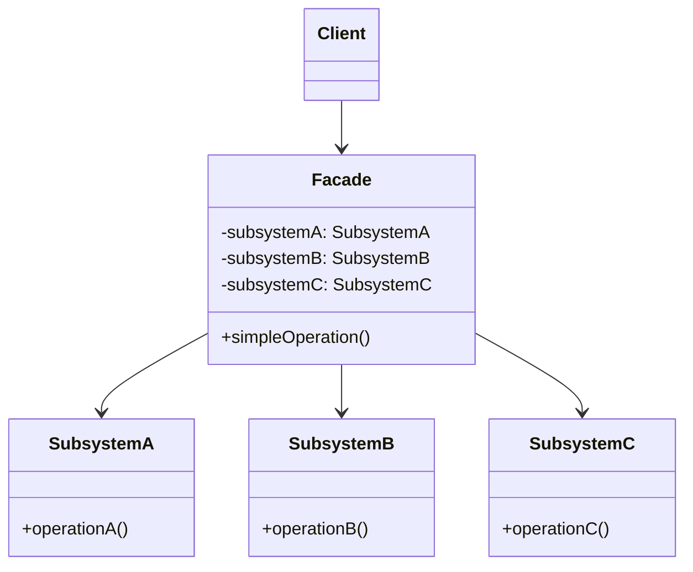

+++
title = "外观模式"
date = '2026-05-02T22:32:27+08:00'
draft = false
weight = 4
tags = ["设计模式", "面试"]
categories = ["设计模式", "面试"]
+++
## 定义

外观模式（Facade Pattern）是一种结构型设计模式，它为子系统中的一组接口提供一个统一的高层接口。外观模式定义了一个高层接口，使得子系统更加容易使用。

外观模式的核心思想是通过引入一个外观类，将复杂子系统的内部复杂性隐藏起来，只暴露一个简单的接口给客户端。

## 为什么需要外观模式

外观模式要解决的核心问题是：**简化复杂子系统的使用，为客户端提供一个更简单的接口**。

**问题场景**：假设我们正在开发一个视频播放功能，需要处理音频、视频、字幕等多个子系统。

直接使用各个子系统：

```swift
class VideoPlayerController {
    func playVideo(url: URL) {
        // 1. 初始化音频引擎
        let audioEngine = AudioEngine()
        audioEngine.configure(sampleRate: 44100)
        audioEngine.setOutputDevice(.speaker)
        
        // 2. 初始化视频解码器
        let videoDecoder = VideoDecoder()
        videoDecoder.setCodec(.h264)
        videoDecoder.configureHardwareAcceleration(true)
        
        // 3. 初始化渲染器
        let renderer = VideoRenderer()
        renderer.setResolution(1920, 1080)
        renderer.setFrameRate(30)
        
        // 4. 加载字幕
        let subtitleLoader = SubtitleLoader()
        let subtitles = subtitleLoader.load(from: url)
        
        // 5. 同步各个组件
        let synchronizer = AVSynchronizer()
        synchronizer.link(audio: audioEngine, video: videoDecoder)
        
        // 6. 开始播放
        let data = loadVideoData(url)
        let decodedVideo = videoDecoder.decode(data)
        renderer.render(decodedVideo)
        audioEngine.play()
        
        // 还要处理暂停、seek、音量调节...
    }
}
```

这种方式有什么问题？

1. **使用复杂**：客户端需要了解所有子系统的细节和调用顺序
2. **高度耦合**：客户端与多个子系统直接依赖
3. **重复代码**：每个需要播放视频的地方都要写类似的代码
4. **难以维护**：子系统API变化时，所有使用处都需要修改

**外观模式的解决思路**：

创建一个外观类，封装所有子系统的复杂交互，对外提供简单接口：

```swift
// 外观类 - 简化视频播放
class VideoPlayerFacade {
    private let audioEngine = AudioEngine()
    private let videoDecoder = VideoDecoder()
    private let renderer = VideoRenderer()
    private let subtitleLoader = SubtitleLoader()
    private let synchronizer = AVSynchronizer()
    
    // 简单的初始化
    func setup(in view: UIView) {
        // 内部完成所有初始化和配置
        audioEngine.configure(sampleRate: 44100)
        videoDecoder.setCodec(.h264)
        renderer.attachTo(view)
        synchronizer.link(audio: audioEngine, video: videoDecoder)
    }
    
    // 简单的播放接口
    func play(url: URL) {
        // 内部处理所有复杂逻辑
    }
    
    // 简单的控制接口
    func pause() { ... }
    func seek(to time: TimeInterval) { ... }
    func setVolume(_ volume: Float) { ... }
}

// 客户端使用 - 简洁明了
let player = VideoPlayerFacade()
player.setup(in: playerView)
player.play(url: videoURL)
player.setVolume(0.8)
```

**外观模式的好处**：
- **简化使用**：客户端只需要调用简单的方法，不需要了解内部细节
- **降低耦合**：客户端只依赖外观类，与子系统解耦
- **便于维护**：子系统变化时，只需修改外观类
- **分层清晰**：为子系统提供统一的入口点

**常见使用场景**：
- 网络层封装（将URLSession、缓存、认证等封装）
- SDK封装（简化第三方库的复杂API）
- 多媒体播放器（封装AVFoundation的复杂操作）
- 认证模块（封装Keychain、网络认证、生物识别等）

## 模式结构



## iOS中的应用

### 1. 网络层封装

将复杂的网络请求、缓存、错误处理封装成简单接口：

```swift
// 子系统: 网络请求
class NetworkClient {
    func request(url: URL, method: String, headers: [String: String], body: Data?) async throws -> (Data, URLResponse) {
        var request = URLRequest(url: url)
        request.httpMethod = method
        request.allHTTPHeaderFields = headers
        request.httpBody = body
        return try await URLSession.shared.data(for: request)
    }
}

// 子系统: 缓存管理
class CacheManager {
    private let cache = NSCache<NSString, NSData>()
    
    func get(forKey key: String) -> Data? {
        return cache.object(forKey: key as NSString) as Data?
    }
    
    func set(_ data: Data, forKey key: String) {
        cache.setObject(data as NSData, forKey: key as NSString)
    }
}

// 子系统: 认证管理
class AuthManager {
    var token: String?
    
    func getAuthHeaders() -> [String: String] {
        guard let token = token else { return [:] }
        return ["Authorization": "Bearer \(token)"]
    }
    
    func refreshTokenIfNeeded() async throws {
        // 刷新token的逻辑
    }
}

// 子系统: JSON解析
class JSONParser {
    func parse<T: Decodable>(_ data: Data, as type: T.Type) throws -> T {
        return try JSONDecoder().decode(type, from: data)
    }
    
    func encode<T: Encodable>(_ value: T) throws -> Data {
        return try JSONEncoder().encode(value)
    }
}

// 外观类: API服务
class APIFacade {
    private let networkClient = NetworkClient()
    private let cacheManager = CacheManager()
    private let authManager = AuthManager()
    private let jsonParser = JSONParser()
    
    private let baseURL: URL
    
    init(baseURL: URL) {
        self.baseURL = baseURL
    }
    
    // 简化的GET请求接口
    func get<T: Decodable>(_ endpoint: String, useCache: Bool = true) async throws -> T {
        let url = baseURL.appendingPathComponent(endpoint)
        let cacheKey = url.absoluteString
        
        // 尝试从缓存获取
        if useCache, let cachedData = cacheManager.get(forKey: cacheKey) {
            return try jsonParser.parse(cachedData, as: T.self)
        }
        
        // 刷新token
        try await authManager.refreshTokenIfNeeded()
        
        // 发起请求
        let headers = authManager.getAuthHeaders()
        let (data, _) = try await networkClient.request(url: url, method: "GET", headers: headers, body: nil)
        
        // 缓存结果
        if useCache {
            cacheManager.set(data, forKey: cacheKey)
        }
        
        return try jsonParser.parse(data, as: T.self)
    }
    
    // 简化的POST请求接口
    func post<T: Decodable, U: Encodable>(_ endpoint: String, body: U) async throws -> T {
        let url = baseURL.appendingPathComponent(endpoint)
        
        try await authManager.refreshTokenIfNeeded()
        
        var headers = authManager.getAuthHeaders()
        headers["Content-Type"] = "application/json"
        
        let bodyData = try jsonParser.encode(body)
        let (data, _) = try await networkClient.request(url: url, method: "POST", headers: headers, body: bodyData)
        
        return try jsonParser.parse(data, as: T.self)
    }
}

// 客户端使用
struct User: Codable {
    let id: Int
    let name: String
}

let api = APIFacade(baseURL: URL(string: "https://api.example.com")!)

// 简单的接口调用
Task {
    let user: User = try await api.get("/users/1")
    print(user.name)
}
```

### 2. 多媒体播放器外观

```swift
// 子系统: 音频播放器
class AudioPlayer {
    func loadAudio(url: URL) {
        print("Loading audio from: \(url)")
    }
    
    func play() {
        print("Playing audio")
    }
    
    func pause() {
        print("Pausing audio")
    }
    
    func setVolume(_ volume: Float) {
        print("Setting audio volume to: \(volume)")
    }
}

// 子系统: 视频渲染器
class VideoRenderer {
    func loadVideo(url: URL) {
        print("Loading video from: \(url)")
    }
    
    func render(in view: UIView) {
        print("Rendering video in view")
    }
    
    func setResolution(_ resolution: CGSize) {
        print("Setting resolution to: \(resolution)")
    }
}

// 子系统: 字幕处理器
class SubtitleProcessor {
    func loadSubtitles(url: URL) {
        print("Loading subtitles from: \(url)")
    }
    
    func display(at time: TimeInterval) {
        print("Displaying subtitle at: \(time)")
    }
    
    func setFont(_ font: UIFont) {
        print("Setting subtitle font")
    }
}

// 子系统: 播放控制器
class PlaybackController {
    var currentTime: TimeInterval = 0
    var duration: TimeInterval = 0
    var isPlaying: Bool = false
    
    func seek(to time: TimeInterval) {
        currentTime = time
        print("Seeking to: \(time)")
    }
    
    func getProgress() -> Float {
        guard duration > 0 else { return 0 }
        return Float(currentTime / duration)
    }
}

// 外观类: 媒体播放器
class MediaPlayerFacade {
    private let audioPlayer = AudioPlayer()
    private let videoRenderer = VideoRenderer()
    private let subtitleProcessor = SubtitleProcessor()
    private let playbackController = PlaybackController()
    
    private var playerView: UIView?
    
    // 简化的初始化接口
    func setup(in view: UIView) {
        self.playerView = view
    }
    
    // 简化的加载媒体接口
    func loadMedia(videoURL: URL, subtitleURL: URL? = nil) {
        audioPlayer.loadAudio(url: videoURL)
        videoRenderer.loadVideo(url: videoURL)
        
        if let playerView = playerView {
            videoRenderer.render(in: playerView)
        }
        
        if let subtitleURL = subtitleURL {
            subtitleProcessor.loadSubtitles(url: subtitleURL)
        }
    }
    
    // 简化的播放接口
    func play() {
        audioPlayer.play()
        playbackController.isPlaying = true
    }
    
    // 简化的暂停接口
    func pause() {
        audioPlayer.pause()
        playbackController.isPlaying = false
    }
    
    // 简化的跳转接口
    func seek(to progress: Float) {
        let time = TimeInterval(progress) * playbackController.duration
        playbackController.seek(to: time)
        subtitleProcessor.display(at: time)
    }
    
    // 简化的音量控制接口
    func setVolume(_ volume: Float) {
        audioPlayer.setVolume(volume)
    }
    
    var isPlaying: Bool {
        return playbackController.isPlaying
    }
    
    var progress: Float {
        return playbackController.getProgress()
    }
}

// 客户端使用 - 简洁的API
let player = MediaPlayerFacade()
player.setup(in: UIView())
player.loadMedia(videoURL: URL(string: "https://example.com/video.mp4")!)
player.play()
player.setVolume(0.8)
player.seek(to: 0.5)
```

### 3. 用户认证外观

```swift
// 子系统: Keychain存储
class KeychainService {
    func save(token: String, forKey key: String) throws {
        print("Saving token to keychain")
    }
    
    func load(forKey key: String) throws -> String? {
        print("Loading token from keychain")
        return nil
    }
    
    func delete(forKey key: String) throws {
        print("Deleting token from keychain")
    }
}

// 子系统: 生物识别认证
class BiometricAuth {
    func canUseBiometrics() -> Bool {
        return true
    }
    
    func authenticate(reason: String) async throws -> Bool {
        print("Authenticating with biometrics")
        return true
    }
}

// 子系统: 网络认证
class NetworkAuth {
    func login(email: String, password: String) async throws -> AuthToken {
        print("Logging in via network")
        return AuthToken(accessToken: "token", refreshToken: "refresh")
    }
    
    func logout(token: String) async throws {
        print("Logging out via network")
    }
    
    func refreshToken(_ token: String) async throws -> AuthToken {
        print("Refreshing token")
        return AuthToken(accessToken: "newToken", refreshToken: "newRefresh")
    }
}

struct AuthToken {
    let accessToken: String
    let refreshToken: String
}

// 子系统: 用户状态管理
class UserSession {
    var currentUser: User?
    var isLoggedIn: Bool { currentUser != nil }
    
    func setUser(_ user: User) {
        currentUser = user
    }
    
    func clearUser() {
        currentUser = nil
    }
}

// 外观类: 认证管理器
class AuthFacade {
    private let keychainService = KeychainService()
    private let biometricAuth = BiometricAuth()
    private let networkAuth = NetworkAuth()
    private let userSession = UserSession()
    
    // 简化的登录接口
    func login(email: String, password: String) async throws {
        // 1. 网络认证
        let token = try await networkAuth.login(email: email, password: password)
        
        // 2. 保存token到Keychain
        try keychainService.save(token: token.accessToken, forKey: "accessToken")
        try keychainService.save(token: token.refreshToken, forKey: "refreshToken")
        
        // 3. 更新用户会话
        userSession.setUser(User(id: 1, name: email))
    }
    
    // 简化的生物识别登录
    func loginWithBiometrics() async throws {
        guard biometricAuth.canUseBiometrics() else {
            throw AuthError.biometricsNotAvailable
        }
        
        let success = try await biometricAuth.authenticate(reason: "Login to your account")
        
        if success {
            // 从Keychain恢复会话
            if let token = try keychainService.load(forKey: "accessToken") {
                userSession.setUser(User(id: 1, name: "User"))
            }
        }
    }
    
    // 简化的登出接口
    func logout() async throws {
        if let token = try keychainService.load(forKey: "accessToken") {
            try await networkAuth.logout(token: token)
        }
        
        try keychainService.delete(forKey: "accessToken")
        try keychainService.delete(forKey: "refreshToken")
        
        userSession.clearUser()
    }
    
    var isLoggedIn: Bool {
        return userSession.isLoggedIn
    }
    
    var currentUser: User? {
        return userSession.currentUser
    }
}

enum AuthError: Error {
    case biometricsNotAvailable
}

// 客户端使用
let auth = AuthFacade()

Task {
    try await auth.login(email: "user@example.com", password: "password")
    print("Logged in: \(auth.isLoggedIn)")
    
    try await auth.logout()
    print("Logged out")
}
```

### 4. SDK封装

将第三方SDK的复杂接口封装成简单的外观：

```swift
// 外观类: 分析服务
class AnalyticsFacade {
    
    // 简化的初始化
    func configure() {
        // 初始化Firebase
        // FirebaseApp.configure()
        
        // 初始化其他分析SDK
        // Crashlytics.crashlytics().setCrashlyticsCollectionEnabled(true)
        
        print("Analytics configured")
    }
    
    // 简化的事件追踪
    func trackEvent(_ name: String, parameters: [String: Any]? = nil) {
        // Firebase
        // Analytics.logEvent(name, parameters: parameters)
        
        // Mixpanel
        // Mixpanel.mainInstance().track(event: name, properties: parameters)
        
        print("Tracked event: \(name)")
    }
    
    // 简化的用户属性设置
    func setUserProperty(_ value: String?, forName name: String) {
        // Analytics.setUserProperty(value, forName: name)
        print("Set user property: \(name) = \(value ?? "nil")")
    }
    
    // 简化的屏幕追踪
    func trackScreen(_ screenName: String) {
        // Analytics.logEvent(AnalyticsEventScreenView, parameters: [
        //     AnalyticsParameterScreenName: screenName
        // ])
        print("Tracked screen: \(screenName)")
    }
}
```

## 使用场景

1. **简化复杂子系统**：当子系统包含多个相互依赖的类时，提供简单接口
2. **分层架构**：为每个子系统层次提供入口点
3. **SDK封装**：封装第三方库的复杂API
4. **遗留系统集成**：为遗留代码提供简洁的现代接口
5. **降低客户端与子系统耦合**：客户端只依赖外观类

## 优缺点

### 优点

1. **简化接口**：将复杂子系统的接口简化为一个高层接口
2. **降低耦合**：客户端与子系统之间的依赖关系降低
3. **更好的分层**：可以更清晰地组织代码层次结构
4. **易于使用**：客户端代码更加简洁易读
5. **灵活性**：子系统内部的变化不会影响客户端

### 缺点

1. **可能成为上帝类**：如果设计不当，外观类可能承担过多职责
2. **额外的间接层**：增加了系统的复杂性
3. **违反开闭原则**：添加新的子系统功能可能需要修改外观类
4. **隐藏灵活性**：简化可能导致无法使用子系统的全部功能

## 最佳实践

1. **保持外观类的简洁**：外观类只负责转发请求，不包含复杂业务逻辑
2. **不要强制使用外观**：允许客户端直接访问子系统（如果需要）
3. **考虑使用多个外观**：对于大型子系统，可以创建多个外观类
4. **配合单例使用**：外观类通常设计为单例
5. **文档化**：清晰记录外观类提供的功能
