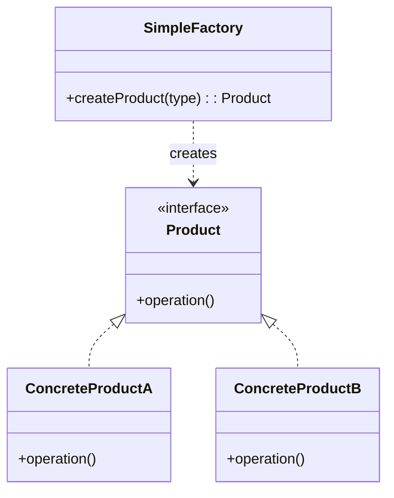
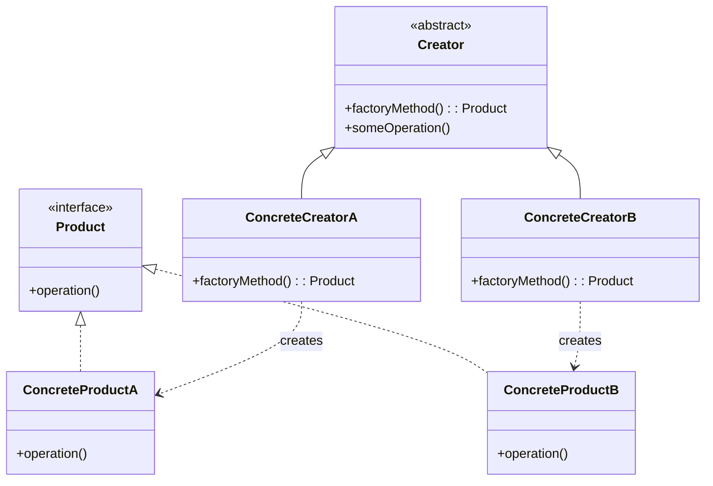
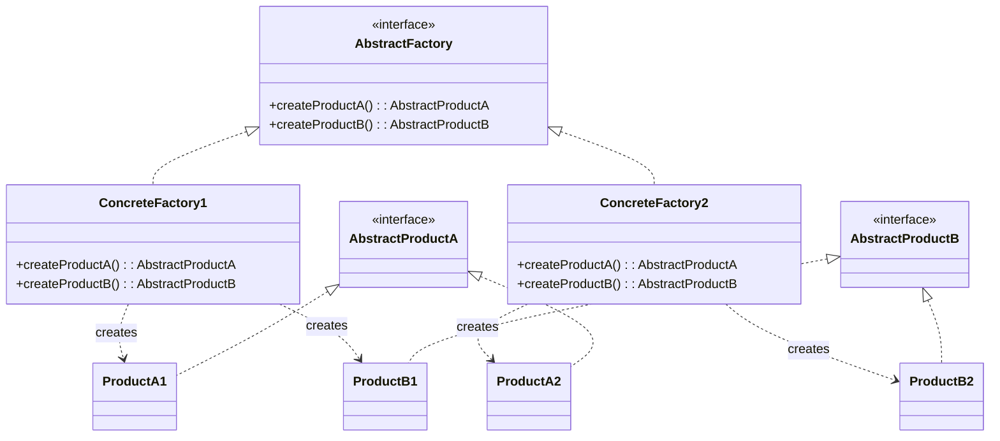

+++
title = "工厂模式"
date = '2026-05-02T22:32:27+08:00'
draft = false
weight = 5
tags = ["设计模式", "面试"]
categories = ["设计模式", "面试"]
+++
## 定义

工厂模式（Factory Pattern）是一种创建型设计模式，它提供了一种创建对象的方式，将对象的创建逻辑与使用逻辑分离。工厂模式有三种变体：简单工厂模式、工厂方法模式和抽象工厂模式。

## 为什么需要工厂模式

工厂模式要解决的核心问题是：**将对象的创建过程与使用过程分离**。

**问题场景**：假设我们正在开发一个网络层，需要创建URLSession对象。

直接使用构造函数创建对象看起来很简单：

```swift
class NetworkManager {
    func fetchData(from url: URL) {
        // 直接创建URLSession
        let config = URLSessionConfiguration.default
        config.timeoutIntervalForRequest = 30
        config.httpAdditionalHeaders = ["Authorization": "Bearer xxx"]
        let session = URLSession(configuration: config)
        
        session.dataTask(with: url) { data, response, error in
            // 处理响应...
        }.resume()
    }
}
```

这种方式有什么问题？

1. **创建逻辑与业务逻辑混在一起**：`fetchData`方法既要负责创建session，又要负责发起请求，职责不单一
2. **创建逻辑无法复用**：如果另一个方法也需要相同配置的session，只能复制这段创建代码
3. **难以替换实现**：如果想在测试时使用Mock的session，或者在不同环境使用不同配置，需要修改业务代码
4. **隐藏了依赖关系**：从方法签名看不出这个类依赖URLSession，依赖关系被隐藏在方法内部

**工厂模式的解决思路**：

工厂模式的核心是：**调用方不再自己new对象，而是向工厂"要"对象**。

```swift
// 工厂负责创建
class URLSessionFactory {
    static func createDefault() -> URLSession {
        let config = URLSessionConfiguration.default
        config.timeoutIntervalForRequest = 30
        config.httpAdditionalHeaders = ["Authorization": "Bearer xxx"]
        return URLSession(configuration: config)
    }
    
    static func createBackground(identifier: String) -> URLSession {
        let config = URLSessionConfiguration.background(withIdentifier: identifier)
        return URLSession(configuration: config)
    }
}

// 业务代码只负责使用
class NetworkManager {
    private let session: URLSession
    
    init(session: URLSession = URLSessionFactory.createDefault()) {
        self.session = session
    }
    
    func fetchData(from url: URL) {
        session.dataTask(with: url) { data, response, error in
            // 处理响应...
        }.resume()
    }
}
```

这样做的好处：
- **职责分离**：工厂专门负责"怎么创建"，业务代码专注于"怎么使用"
- **创建逻辑可复用**：任何地方需要session，都可以调用工厂方法
- **便于测试**：测试时可以注入Mock对象：`NetworkManager(session: mockSession)`
- **依赖关系清晰**：从构造函数就能看出这个类依赖什么

**与策略模式的区别**：
- **策略模式**关注的是「行为的选择」——同一个操作有多种算法，运行时选择用哪种
- **工厂模式**关注的是「对象的创建」——封装复杂的构造过程，让调用方不关心创建细节

简单来说，策略模式解决的是"用什么方式做事"，工厂模式解决的是"怎么把东西造出来"。

## 简单工厂模式

简单工厂模式（Simple Factory Pattern）也叫静态工厂方法模式，它由一个工厂类根据传入的参数决定创建哪种产品类的实例。

### 结构图



### iOS实现示例

```swift
// 产品协议
protocol Button {
    func render()
    func onClick()
}

// 具体产品A
class PrimaryButton: Button {
    func render() {
        print("Rendering primary button with blue background")
    }
    
    func onClick() {
        print("Primary button clicked")
    }
}

// 具体产品B
class SecondaryButton: Button {
    func render() {
        print("Rendering secondary button with gray background")
    }
    
    func onClick() {
        print("Secondary button clicked")
    }
}

// 具体产品C
class DangerButton: Button {
    func render() {
        print("Rendering danger button with red background")
    }
    
    func onClick() {
        print("Danger button clicked")
    }
}

// 简单工厂
enum ButtonType {
    case primary
    case secondary
    case danger
}

class ButtonFactory {
    static func createButton(type: ButtonType) -> Button {
        switch type {
        case .primary:
            return PrimaryButton()
        case .secondary:
            return SecondaryButton()
        case .danger:
            return DangerButton()
        }
    }
}

// 使用
let primaryBtn = ButtonFactory.createButton(type: .primary)
primaryBtn.render() // Rendering primary button with blue background
```

### 优缺点

**优点**：
- 客户端无需知道具体产品类名，只需知道参数
- 创建逻辑集中在工厂类中，便于管理

**缺点**：
- 工厂类职责过重，不符合开闭原则
- 新增产品需要修改工厂类代码

## 工厂方法模式

工厂方法模式（Factory Method Pattern）定义一个创建对象的接口，让子类决定实例化哪个类。工厂方法使类的实例化延迟到子类。

### 结构图



### iOS实现示例

```swift
// 产品协议
protocol Document {
    func open()
    func save()
    func close()
}

// 具体产品
class PDFDocument: Document {
    func open() {
        print("Opening PDF document")
    }
    
    func save() {
        print("Saving PDF document")
    }
    
    func close() {
        print("Closing PDF document")
    }
}

class WordDocument: Document {
    func open() {
        print("Opening Word document")
    }
    
    func save() {
        print("Saving Word document")
    }
    
    func close() {
        print("Closing Word document")
    }
}

// 创建者协议（工厂接口）
protocol DocumentCreator {
    func createDocument() -> Document
    func processDocument()
}

extension DocumentCreator {
    // 模板方法
    func processDocument() {
        let doc = createDocument()
        doc.open()
        // 处理文档...
        doc.save()
        doc.close()
    }
}

// 具体创建者
class PDFCreator: DocumentCreator {
    func createDocument() -> Document {
        return PDFDocument()
    }
}

class WordCreator: DocumentCreator {
    func createDocument() -> Document {
        return WordDocument()
    }
}

// 使用
let pdfCreator = PDFCreator()
pdfCreator.processDocument()

let wordCreator = WordCreator()
wordCreator.processDocument()
```

### 优缺点

**优点**：
- 符合开闭原则，新增产品只需添加新的工厂子类
- 符合单一职责原则，每个工厂只负责创建对应产品
- 客户端只依赖抽象接口

**缺点**：
- 每新增一个产品，就需要新增一个工厂类，类的数量增加

## 抽象工厂模式

抽象工厂模式（Abstract Factory Pattern）提供一个创建一系列相关或相互依赖对象的接口，而无需指定它们的具体类。

### 结构图



### iOS实现示例 - UI主题工厂

```swift
// 抽象产品 - 按钮
protocol ThemeButton {
    func render()
}

// 抽象产品 - 文本框
protocol ThemeTextField {
    func render()
}

// 抽象产品 - 标签
protocol ThemeLabel {
    func render()
}

// 亮色主题具体产品
class LightButton: ThemeButton {
    func render() {
        print("Light theme button: white background, black text")
    }
}

class LightTextField: ThemeTextField {
    func render() {
        print("Light theme text field: white background, gray border")
    }
}

class LightLabel: ThemeLabel {
    func render() {
        print("Light theme label: black text")
    }
}

// 暗色主题具体产品
class DarkButton: ThemeButton {
    func render() {
        print("Dark theme button: dark background, white text")
    }
}

class DarkTextField: ThemeTextField {
    func render() {
        print("Dark theme text field: dark background, light border")
    }
}

class DarkLabel: ThemeLabel {
    func render() {
        print("Dark theme label: white text")
    }
}

// 抽象工厂
protocol ThemeFactory {
    func createButton() -> ThemeButton
    func createTextField() -> ThemeTextField
    func createLabel() -> ThemeLabel
}

// 具体工厂 - 亮色主题
class LightThemeFactory: ThemeFactory {
    func createButton() -> ThemeButton {
        return LightButton()
    }
    
    func createTextField() -> ThemeTextField {
        return LightTextField()
    }
    
    func createLabel() -> ThemeLabel {
        return LightLabel()
    }
}

// 具体工厂 - 暗色主题
class DarkThemeFactory: ThemeFactory {
    func createButton() -> ThemeButton {
        return DarkButton()
    }
    
    func createTextField() -> ThemeTextField {
        return DarkTextField()
    }
    
    func createLabel() -> ThemeLabel {
        return DarkLabel()
    }
}

// 客户端代码
class FormViewController {
    private let factory: ThemeFactory
    
    init(factory: ThemeFactory) {
        self.factory = factory
    }
    
    func setupUI() {
        let button = factory.createButton()
        let textField = factory.createTextField()
        let label = factory.createLabel()
        
        button.render()
        textField.render()
        label.render()
    }
}

// 使用
let lightVC = FormViewController(factory: LightThemeFactory())
lightVC.setupUI()

let darkVC = FormViewController(factory: DarkThemeFactory())
darkVC.setupUI()
```

### 优缺点

**优点**：
- 确保同一工厂生产的产品相互兼容
- 分离了具体类的生成，客户端不需要知道具体实现
- 易于切换产品族

**缺点**：
- 难以添加新种类的产品，需要修改抽象工厂接口
- 类的数量成倍增加

## 三种工厂模式对比

| 特性 | 简单工厂 | 工厂方法 | 抽象工厂 |
|------|----------|----------|----------|
| 工厂类数量 | 一个 | 多个 | 多个 |
| 产品等级 | 单一 | 单一 | 多个 |
| 新增产品 | 修改工厂类 | 新增工厂类 | 修改所有工厂类 |
| 复杂度 | 低 | 中 | 高 |
| 开闭原则 | 不满足 | 满足 | 部分满足 |
| 适用场景 | 产品种类少且稳定 | 产品种类可能扩展 | 需要创建产品族 |

## iOS系统中的工厂模式应用

### 1. NSNumber类簇

NSNumber是典型的类簇（Class Cluster）模式，它是简单工厂模式的一种应用：

```swift
// NSNumber的内部实现（简化版）
class NSNumber {
    static func create(value: Int) -> NSNumber {
        return __NSCFNumber(intValue: value)
    }
    
    static func create(value: Double) -> NSNumber {
        return __NSCFNumber(doubleValue: value)
    }
    
    static func create(value: Bool) -> NSNumber {
        return __NSCFBoolean(boolValue: value)
    }
}

// 使用时
let intNumber = NSNumber(value: 42)      // 返回 __NSCFNumber
let boolNumber = NSNumber(value: true)   // 返回 __NSCFBoolean
```

**设计优势**：
- 调用者只看到NSNumber这个抽象类
- 内部根据值类型返回不同的优化实现
- 可以针对不同类型做性能优化

### 2. UITableView的Cell复用

UITableView的cell复用机制结合了工厂模式和对象池模式：

```swift
// UITableView内部的实现（简化版）
class UITableView {
    private var reusableCells: [String: [UITableViewCell]] = [:]
    
    func dequeueReusableCell(withIdentifier identifier: String) -> UITableViewCell? {
        // 尝试从对象池获取
        if let cells = reusableCells[identifier], !cells.isEmpty {
            return cells.removeFirst()
        }
        
        // 对象池为空，创建新cell（工厂模式）
        return createCell(withIdentifier: identifier)
    }
    
    private func createCell(withIdentifier identifier: String) -> UITableViewCell {
        // 根据identifier创建对应的cell
        // 这是工厂模式的应用
        return UITableViewCell(style: .default, reuseIdentifier: identifier)
    }
}
```

### 3. URLSessionConfiguration

URLSessionConfiguration使用工厂方法模式提供不同的配置：

```swift
// 系统提供的工厂方法
let defaultConfig = URLSessionConfiguration.default        // 标准配置
let ephemeralConfig = URLSessionConfiguration.ephemeral    // 不持久化配置
let backgroundConfig = URLSessionConfiguration.background(withIdentifier: "com.app.bg")  // 后台配置

// 每个工厂方法返回不同配置的URLSessionConfiguration
```

### 4. UIAlertController

UIAlertController通过preferredStyle参数实现简单工厂：

```swift
// 创建Alert
let alert = UIAlertController(
    title: "提示",
    message: "确定删除吗？",
    preferredStyle: .alert  // 工厂参数
)

// 创建ActionSheet
let actionSheet = UIAlertController(
    title: "选择操作",
    message: nil,
    preferredStyle: .actionSheet  // 工厂参数
)

// 内部根据preferredStyle创建不同的视图层次结构
```

## Swift中的现代实现方式

### 1. 使用枚举关联值替代简单工厂

在Swift中，可以使用枚举的关联值来实现更优雅的工厂模式：

```swift
// 传统的简单工厂
enum ButtonType {
    case primary, secondary, danger
}

class ButtonFactory {
    static func create(type: ButtonType) -> UIButton {
        let button = UIButton()
        switch type {
        case .primary:
            button.backgroundColor = .blue
        case .secondary:
            button.backgroundColor = .gray
        case .danger:
            button.backgroundColor = .red
        }
        return button
    }
}

// Swift风格：使用枚举关联值
enum Button {
    case primary(title: String)
    case secondary(title: String)
    case danger(title: String, action: () -> Void)
    
    func create() -> UIButton {
        let button = UIButton()
        switch self {
        case .primary(let title):
            button.setTitle(title, for: .normal)
            button.backgroundColor = .blue
        case .secondary(let title):
            button.setTitle(title, for: .normal)
            button.backgroundColor = .gray
        case .danger(let title, let action):
            button.setTitle(title, for: .normal)
            button.backgroundColor = .red
            button.addAction(UIAction { _ in action() }, for: .touchUpInside)
        }
        return button
    }
}

// 使用
let primaryButton = Button.primary(title: "确定").create()
let dangerButton = Button.danger(title: "删除") {
    print("执行删除操作")
}.create()
```

### 2. 使用泛型工厂

Swift的泛型可以让工厂模式更加灵活：

```swift
// 泛型工厂协议
protocol Factory {
    associatedtype Product
    func create() -> Product
}

// 具体工厂
class ViewControllerFactory<T: UIViewController>: Factory {
    typealias Product = T
    
    private let configure: (T) -> Void
    
    init(configure: @escaping (T) -> Void = { _ in }) {
        self.configure = configure
    }
    
    func create() -> T {
        let vc = T()
        configure(vc)
        return vc
    }
}

// 使用
let homeVCFactory = ViewControllerFactory<HomeViewController> { vc in
    vc.title = "首页"
    vc.view.backgroundColor = .white
}

let homeVC = homeVCFactory.create()
```

### 3. 使用闭包作为工厂

Swift的闭包可以作为轻量级的工厂：

```swift
// 定义工厂类型别名
typealias ViewFactory = () -> UIView

// 创建工厂闭包
let labelFactory: ViewFactory = {
    let label = UILabel()
    label.textColor = .black
    label.font = .systemFont(ofSize: 16)
    return label
}

let buttonFactory: ViewFactory = {
    let button = UIButton()
    button.setTitleColor(.blue, for: .normal)
    return button
}

// 使用工厂
class FormView: UIView {
    private let viewFactory: ViewFactory
    
    init(viewFactory: @escaping ViewFactory) {
        self.viewFactory = viewFactory
        super.init(frame: .zero)
        setupUI()
    }
    
    private func setupUI() {
        let view = viewFactory()
        addSubview(view)
    }
    
    required init?(coder: NSCoder) {
        fatalError("init(coder:) has not been implemented")
    }
}

// 创建不同的FormView
let labelForm = FormView(viewFactory: labelFactory)
let buttonForm = FormView(viewFactory: buttonFactory)
```

### 4. 结合Result Builder的工厂

Swift 5.4+的Result Builder可以创建声明式的工厂：

```swift
@resultBuilder
struct ViewBuilder {
    static func buildBlock(_ components: UIView...) -> [UIView] {
        components
    }
}

class ViewFactory {
    @ViewBuilder
    static func createLoginForm() -> [UIView] {
        UILabel().apply {
            $0.text = "用户名"
        }
        
        UITextField().apply {
            $0.placeholder = "请输入用户名"
            $0.borderStyle = .roundedRect
        }
        
        UILabel().apply {
            $0.text = "密码"
        }
        
        UITextField().apply {
            $0.placeholder = "请输入密码"
            $0.isSecureTextEntry = true
            $0.borderStyle = .roundedRect
        }
        
        UIButton().apply {
            $0.setTitle("登录", for: .normal)
            $0.backgroundColor = .blue
        }
    }
}

// 辅助扩展
extension UIView {
    func apply(_ configure: (UIView) -> Void) -> UIView {
        configure(self)
        return self
    }
}

// 使用
let loginViews = ViewFactory.createLoginForm()
```

## 常见陷阱和注意事项

### 1. 工厂类职责过重

**问题**：把所有创建逻辑都放在一个工厂类中，导致工厂类变得臃肿。

```swift
// ❌ 不好的做法：工厂类职责过重
class ViewFactory {
    static func createButton(type: String) -> UIButton { /* ... */ }
    static func createLabel(type: String) -> UILabel { /* ... */ }
    static func createTextField(type: String) -> UITextField { /* ... */ }
    static func createImageView(type: String) -> UIImageView { /* ... */ }
    static func createTableView(type: String) -> UITableView { /* ... */ }
    // 越来越多的创建方法...
}

// ✅ 好的做法：按职责拆分工厂
class ButtonFactory {
    static func createPrimary() -> UIButton { /* ... */ }
    static func createSecondary() -> UIButton { /* ... */ }
}

class TextFieldFactory {
    static func createEmail() -> UITextField { /* ... */ }
    static func createPassword() -> UITextField { /* ... */ }
}
```

### 2. 过度使用导致类爆炸

**问题**：为每个产品都创建工厂类，导致类数量激增。

```swift
// ❌ 不好的做法：类爆炸
class PrimaryButtonFactory { /* ... */ }
class SecondaryButtonFactory { /* ... */ }
class DangerButtonFactory { /* ... */ }
class SuccessButtonFactory { /* ... */ }
// 每个按钮类型都有一个工厂类

// ✅ 好的做法：使用简单工厂或枚举
enum ButtonStyle {
    case primary, secondary, danger, success
}

class ButtonFactory {
    static func create(style: ButtonStyle) -> UIButton {
        // 一个工厂处理所有类型
    }
}
```

### 3. 忽略了依赖注入的替代方案

**问题**：所有地方都用工厂创建对象，而不是通过依赖注入。

```swift
// ❌ 不好的做法：到处调用工厂
class UserViewController {
    func viewDidLoad() {
        let service = ServiceFactory.createUserService()  // 在这里创建
        service.fetchUser()
    }
}

class ProfileViewController {
    func viewDidLoad() {
        let service = ServiceFactory.createUserService()  // 在这里也创建
        service.fetchUser()
    }
}

// ✅ 好的做法：使用依赖注入
class UserViewController {
    private let userService: UserService
    
    init(userService: UserService) {  // 通过构造函数注入
        self.userService = userService
        super.init(nibName: nil, bundle: nil)
    }
}

// 在App启动时统一创建依赖
class AppDependencyContainer {
    lazy var userService: UserService = {
        ServiceFactory.createUserService()
    }()
    
    func makeUserViewController() -> UserViewController {
        return UserViewController(userService: userService)
    }
}
```

### 4. 工厂方法返回具体类型而非抽象类型

**问题**：工厂返回具体类，失去了多态的优势。

```swift
// ❌ 不好的做法：返回具体类型
class NetworkFactory {
    static func createClient() -> AlamofireClient {  // 返回具体类型
        return AlamofireClient()
    }
}

// 客户端代码依赖具体实现
class UserRepository {
    let client: AlamofireClient = NetworkFactory.createClient()
}

// ✅ 好的做法：返回协议类型
protocol NetworkClient {
    func request(_ endpoint: Endpoint) async throws -> Data
}

class AlamofireClient: NetworkClient { /* ... */ }
class URLSessionClient: NetworkClient { /* ... */ }

class NetworkFactory {
    static func createClient() -> NetworkClient {  // 返回协议类型
        return AlamofireClient()
    }
}

// 客户端代码只依赖抽象
class UserRepository {
    let client: NetworkClient = NetworkFactory.createClient()
}
```

### 5. 在工厂中硬编码依赖

**问题**：工厂内部硬编码了依赖关系，难以测试和替换。

```swift
// ❌ 不好的做法：硬编码依赖
class RepositoryFactory {
    static func createUserRepository() -> UserRepository {
        let apiClient = APIClient()  // 硬编码依赖
        let database = Database()    // 硬编码依赖
        return UserRepository(apiClient: apiClient, database: database)
    }
}

// ✅ 好的做法：依赖作为参数传入
class RepositoryFactory {
    private let apiClient: APIClient
    private let database: Database
    
    init(apiClient: APIClient, database: Database) {
        self.apiClient = apiClient
        self.database = database
    }
    
    func createUserRepository() -> UserRepository {
        return UserRepository(apiClient: apiClient, database: database)
    }
}
```

## 面试常见问题

### Q1: 简单工厂、工厂方法、抽象工厂的区别？

**答**：简单工厂通过参数决定创建哪种产品，不符合开闭原则；工厂方法为每种产品提供一个工厂类，符合开闭原则；抽象工厂创建一系列相关产品，适用于产品族场景。

### Q2: 什么时候应该使用工厂模式？

**答**：以下场景适合使用工厂模式：

**1. 创建逻辑复杂**
```swift
// 创建一个网络请求需要很多配置
class NetworkRequestFactory {
    static func createRequest(for endpoint: Endpoint) -> URLRequest {
        var request = URLRequest(url: endpoint.url)
        request.httpMethod = endpoint.method.rawValue
        request.timeoutInterval = 30
        request.addValue("application/json", forHTTPHeaderField: "Content-Type")
        request.addValue(AuthManager.shared.token, forHTTPHeaderField: "Authorization")
        // 更多配置...
        return request
    }
}
```

**2. 需要根据条件创建不同对象**
```swift
// 根据环境创建不同的配置
enum Environment {
    case development, staging, production
}

class APIClientFactory {
    static func create(for env: Environment) -> APIClient {
        switch env {
        case .development:
            return APIClient(baseURL: "https://dev.api.com", timeout: 60)
        case .staging:
            return APIClient(baseURL: "https://staging.api.com", timeout: 30)
        case .production:
            return APIClient(baseURL: "https://api.com", timeout: 15)
        }
    }
}
```

**3. 需要创建一组相关对象**
```swift
// 主题切换需要创建一组相关的UI组件
protocol ThemeFactory {
    func createButton() -> UIButton
    func createLabel() -> UILabel
    func createTextField() -> UITextField
}
```

**4. 需要对象池或缓存**
```swift
class ImageFactory {
    private static var cache: [String: UIImage] = [:]
    
    static func createImage(named name: String) -> UIImage? {
        if let cached = cache[name] {
            return cached
        }
        
        guard let image = UIImage(named: name) else { return nil }
        cache[name] = image
        return image
    }
}
```

**不适合使用工厂模式的场景**：
- 对象创建非常简单，只需要调用init()
- 对象类型固定，不需要多态
- 创建逻辑不需要复用

### Q3: 工厂模式如何提高代码的可测试性？

**答**：工厂模式通过依赖注入，让测试代码可以注入Mock对象。

**没有工厂模式的代码（难以测试）**：

```swift
class UserRepository {
    func fetchUser(id: String) async throws -> User {
        // 直接创建URLSession，无法在测试中替换
        let session = URLSession.shared
        let (data, _) = try await session.data(from: URL(string: "https://api.com/users/\(id)")!)
        return try JSONDecoder().decode(User.self, from: data)
    }
}

// 测试时无法避免真实的网络请求
class UserRepositoryTests: XCTestCase {
    func testFetchUser() async throws {
        let repo = UserRepository()
        // 这会发起真实的网络请求！
        let user = try await repo.fetchUser(id: "123")
    }
}
```

**使用工厂模式的代码（易于测试）**：

```swift
// 1. 定义工厂协议
protocol URLSessionFactory {
    func createSession() -> URLSessionProtocol
}

// 2. URLSession的协议包装
protocol URLSessionProtocol {
    func data(from url: URL) async throws -> (Data, URLResponse)
}

extension URLSession: URLSessionProtocol {}

// 3. 生产环境的工厂
class DefaultURLSessionFactory: URLSessionFactory {
    func createSession() -> URLSessionProtocol {
        return URLSession.shared
    }
}

// 4. 业务代码依赖工厂
class UserRepository {
    private let session: URLSessionProtocol
    
    init(sessionFactory: URLSessionFactory = DefaultURLSessionFactory()) {
        self.session = sessionFactory.createSession()
    }
    
    func fetchUser(id: String) async throws -> User {
        let (data, _) = try await session.data(from: URL(string: "https://api.com/users/\(id)")!)
        return try JSONDecoder().decode(User.self, from: data)
    }
}

// 5. 测试时注入Mock工厂
class MockURLSession: URLSessionProtocol {
    var mockData: Data?
    var mockError: Error?
    
    func data(from url: URL) async throws -> (Data, URLResponse) {
        if let error = mockError {
            throw error
        }
        let response = HTTPURLResponse(url: url, statusCode: 200, httpVersion: nil, headerFields: nil)!
        return (mockData ?? Data(), response)
    }
}

class MockURLSessionFactory: URLSessionFactory {
    let mockSession = MockURLSession()
    
    func createSession() -> URLSessionProtocol {
        return mockSession
    }
}

// 6. 测试代码
class UserRepositoryTests: XCTestCase {
    func testFetchUser() async throws {
        // 创建Mock工厂
        let mockFactory = MockURLSessionFactory()
        let mockData = """
        {"id": "123", "name": "John"}
        """.data(using: .utf8)!
        mockFactory.mockSession.mockData = mockData
        
        // 注入Mock工厂
        let repo = UserRepository(sessionFactory: mockFactory)
        
        // 测试不会发起真实网络请求
        let user = try await repo.fetchUser(id: "123")
        XCTAssertEqual(user.name, "John")
    }
}
```

**工厂模式提高可测试性的关键点**：
1. **依赖抽象而非具体实现**：业务代码依赖工厂协议，而非具体工厂类
2. **依赖注入**：通过构造函数注入工厂，测试时可以注入Mock工厂
3. **控制反转**：对象的创建权交给外部，而非在内部直接new

### Q4: 工厂模式如何支持插件化架构？

**答**：工厂模式是实现插件化架构的关键，通过动态注册和创建插件实例。

```swift
// 1. 定义插件协议
protocol Plugin {
    var name: String { get }
    func execute()
}

// 2. 插件工厂
class PluginFactory {
    private var pluginCreators: [String: () -> Plugin] = [:]
    
    // 注册插件创建器
    func register(name: String, creator: @escaping () -> Plugin) {
        pluginCreators[name] = creator
    }
    
    // 创建插件实例
    func createPlugin(name: String) -> Plugin? {
        return pluginCreators[name]?()
    }
    
    // 获取所有已注册的插件名称
    func availablePlugins() -> [String] {
        return Array(pluginCreators.keys)
    }
}

// 3. 具体插件实现
class LoggerPlugin: Plugin {
    let name = "Logger"
    func execute() {
        print("Logger plugin executed")
    }
}

class AnalyticsPlugin: Plugin {
    let name = "Analytics"
    func execute() {
        print("Analytics plugin executed")
    }
}

// 4. 插件管理器
class PluginManager {
    private let factory = PluginFactory()
    private var loadedPlugins: [Plugin] = []
    
    func registerPlugins() {
        // 注册内置插件
        factory.register(name: "Logger") { LoggerPlugin() }
        factory.register(name: "Analytics") { AnalyticsPlugin() }
        
        // 可以动态加载外部插件
        loadExternalPlugins()
    }
    
    func loadPlugin(name: String) {
        guard let plugin = factory.createPlugin(name: name) else {
            print("Plugin \(name) not found")
            return
        }
        loadedPlugins.append(plugin)
    }
    
    func executeAll() {
        loadedPlugins.forEach { $0.execute() }
    }
    
    private func loadExternalPlugins() {
        // 从配置文件或动态库加载插件
        // 这里可以实现动态加载机制
    }
}

// 5. 使用
let manager = PluginManager()
manager.registerPlugins()
manager.loadPlugin(name: "Logger")
manager.loadPlugin(name: "Analytics")
manager.executeAll()
```

**更高级的插件工厂（支持依赖注入）**：

```swift
class AdvancedPluginFactory {
    private var pluginCreators: [String: (DependencyContainer) -> Plugin] = [:]
    
    func register(name: String, creator: @escaping (DependencyContainer) -> Plugin) {
        pluginCreators[name] = creator
    }
    
    func createPlugin(name: String, container: DependencyContainer) -> Plugin? {
        return pluginCreators[name]?(container)
    }
}

// 插件可以声明依赖
class NetworkPlugin: Plugin {
    let name = "Network"
    private let logger: Logger
    
    init(logger: Logger) {
        self.logger = logger
    }
    
    func execute() {
        logger.log("Network plugin executed")
    }
}

// 注册时提供依赖
let factory = AdvancedPluginFactory()
factory.register(name: "Network") { container in
    NetworkPlugin(logger: container.resolve())
}
```
