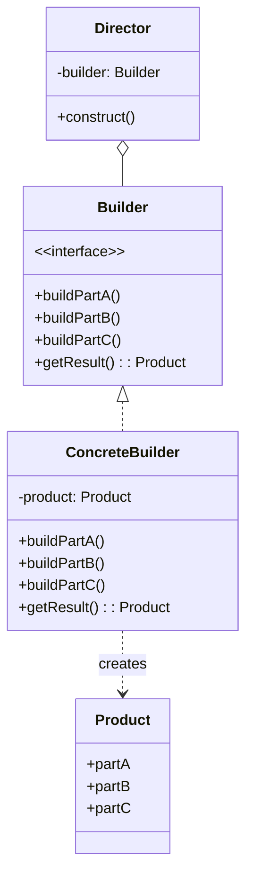

+++
title = "建造者模式"
date = '2026-05-02T22:32:27+08:00'
draft = false
weight = 6
tags = ["设计模式", "面试"]
categories = ["设计模式", "面试"]
+++
## 定义

建造者模式（Builder Pattern）是一种创建型设计模式，它将复杂对象的构建与表示分离，使得同样的构建过程可以创建不同的表示。建造者模式特别适用于创建包含多个可选参数的对象。

建造者模式的核心思想是：将一个复杂对象的构建过程分解为多个简单的步骤，通过一步一步地构建，最终得到完整的对象。

## 为什么需要建造者模式

建造者模式要解决的核心问题是：**简化复杂对象的创建过程，特别是当对象有很多可选参数时**。

**问题场景**：假设我们需要创建一个网络请求配置对象，它有很多可选参数。

使用构造函数的方式：

```swift
struct NetworkConfig {
    let baseURL: URL
    let timeout: TimeInterval
    let retryCount: Int
    let cachePolicy: CachePolicy
    let headers: [String: String]
    let enableLogging: Bool
    let certificatePinning: Bool
    
    // 构造函数参数太多！
    init(baseURL: URL,
         timeout: TimeInterval = 30,
         retryCount: Int = 3,
         cachePolicy: CachePolicy = .default,
         headers: [String: String] = [:],
         enableLogging: Bool = false,
         certificatePinning: Bool = false) {
        // ...
    }
}

// 使用时 - 参数太多，难以阅读
let config = NetworkConfig(
    baseURL: URL(string: "https://api.example.com")!,
    timeout: 60,
    retryCount: 5,
    cachePolicy: .reloadIgnoringCache,
    headers: ["Authorization": "Bearer token"],
    enableLogging: true,
    certificatePinning: true
)
```

这种方式有什么问题？

1. **参数爆炸**：构造函数参数过多，调用时难以记住每个参数的含义
2. **可读性差**：一长串参数难以阅读和理解
3. **难以扩展**：新增参数需要修改构造函数，可能影响已有调用
4. **容易出错**：相同类型的参数容易传错位置

**建造者模式的解决思路**：

使用Builder类，通过链式调用逐步设置参数：

```swift
class NetworkConfigBuilder {
    private var baseURL: URL?
    private var timeout: TimeInterval = 30
    private var retryCount: Int = 3
    // ... 其他参数使用默认值
    
    func setBaseURL(_ url: URL) -> NetworkConfigBuilder {
        self.baseURL = url
        return self
    }
    
    func setTimeout(_ timeout: TimeInterval) -> NetworkConfigBuilder {
        self.timeout = timeout
        return self
    }
    
    func setRetryCount(_ count: Int) -> NetworkConfigBuilder {
        self.retryCount = count
        return self
    }
    
    // ... 其他设置方法
    
    func build() throws -> NetworkConfig {
        guard let baseURL = baseURL else {
            throw BuilderError.missingRequired("baseURL")
        }
        return NetworkConfig(...)
    }
}

// 使用 - 清晰易读
let config = try NetworkConfigBuilder()
    .setBaseURL(URL(string: "https://api.example.com")!)
    .setTimeout(60)
    .setRetryCount(5)
    .enableLogging(true)
    .build()
```

**建造者模式的好处**：
- **可读性好**：链式调用让每个参数的含义一目了然
- **灵活性高**：只设置需要的参数，其他使用默认值
- **易于扩展**：新增参数只需添加新方法，不影响已有代码
- **支持验证**：可以在build()方法中验证参数合法性


## 模式结构



## 角色说明

- **Product（产品）**：要创建的复杂对象
- **Builder（抽象建造者）**：定义创建产品各个部分的抽象接口
- **ConcreteBuilder（具体建造者）**：实现Builder接口，构建和装配产品的各个部分
- **Director（指挥者）**：负责调用建造者的方法来构建产品（可选）

## iOS系统中的建造者模式

### 1. URLComponents

```swift
var components = URLComponents()
components.scheme = "https"
components.host = "api.example.com"
components.path = "/users"
components.queryItems = [
    URLQueryItem(name: "page", value: "1"),
    URLQueryItem(name: "limit", value: "20")
]

if let url = components.url {
    print(url) // https://api.example.com/users?page=1&limit=20
}
```

### 2. UIAlertController

```swift
let alert = UIAlertController(
    title: "Alert",
    message: "This is a message",
    preferredStyle: .alert
)

alert.addTextField { textField in
    textField.placeholder = "Username"
}

alert.addTextField { textField in
    textField.placeholder = "Password"
    textField.isSecureTextEntry = true
}

alert.addAction(UIAlertAction(title: "Cancel", style: .cancel))
alert.addAction(UIAlertAction(title: "OK", style: .default) { _ in
    // Handle OK
})

present(alert, animated: true)
```

### 3. NSAttributedString

```swift
let attributedString = NSMutableAttributedString(string: "Hello World")

attributedString.addAttribute(
    .foregroundColor,
    value: UIColor.red,
    range: NSRange(location: 0, length: 5)
)

attributedString.addAttribute(
    .font,
    value: UIFont.boldSystemFont(ofSize: 18),
    range: NSRange(location: 0, length: 5)
)

attributedString.addAttribute(
    .foregroundColor,
    value: UIColor.blue,
    range: NSRange(location: 6, length: 5)
)
```

### 4. 封装NSAttributedString建造者

```swift
class AttributedStringBuilder {
    private var attributedString: NSMutableAttributedString
    private var currentAttributes: [NSAttributedString.Key: Any] = [:]
    
    init(_ string: String = "") {
        self.attributedString = NSMutableAttributedString(string: string)
    }
    
    @discardableResult
    func text(_ string: String) -> AttributedStringBuilder {
        let newString = NSAttributedString(string: string, attributes: currentAttributes)
        attributedString.append(newString)
        return self
    }
    
    @discardableResult
    func font(_ font: UIFont) -> AttributedStringBuilder {
        currentAttributes[.font] = font
        return self
    }
    
    @discardableResult
    func color(_ color: UIColor) -> AttributedStringBuilder {
        currentAttributes[.foregroundColor] = color
        return self
    }
    
    @discardableResult
    func backgroundColor(_ color: UIColor) -> AttributedStringBuilder {
        currentAttributes[.backgroundColor] = color
        return self
    }
    
    @discardableResult
    func underline(_ style: NSUnderlineStyle = .single) -> AttributedStringBuilder {
        currentAttributes[.underlineStyle] = style.rawValue
        return self
    }
    
    @discardableResult
    func strikethrough(_ style: NSUnderlineStyle = .single) -> AttributedStringBuilder {
        currentAttributes[.strikethroughStyle] = style.rawValue
        return self
    }
    
    @discardableResult
    func reset() -> AttributedStringBuilder {
        currentAttributes = [:]
        return self
    }
    
    func build() -> NSAttributedString {
        return attributedString
    }
}

// 使用
let attrString = AttributedStringBuilder()
    .font(.boldSystemFont(ofSize: 16))
    .color(.red)
    .text("Bold Red ")
    .reset()
    .font(.systemFont(ofSize: 14))
    .color(.blue)
    .underline()
    .text("Underlined Blue")
    .build()
```

## 实际应用场景

### 1. 请求构建器

```swift
class HTTPRequestBuilder {
    private var method: String = "GET"
    private var url: URL?
    private var headers: [String: String] = [:]
    private var body: Data?
    private var timeout: TimeInterval = 30
    
    @discardableResult
    func method(_ method: String) -> HTTPRequestBuilder {
        self.method = method
        return self
    }
    
    @discardableResult
    func url(_ url: URL) -> HTTPRequestBuilder {
        self.url = url
        return self
    }
    
    @discardableResult
    func url(_ urlString: String) -> HTTPRequestBuilder {
        self.url = URL(string: urlString)
        return self
    }
    
    @discardableResult
    func header(_ key: String, _ value: String) -> HTTPRequestBuilder {
        self.headers[key] = value
        return self
    }
    
    @discardableResult
    func jsonBody<T: Encodable>(_ body: T) -> HTTPRequestBuilder {
        self.body = try? JSONEncoder().encode(body)
        self.headers["Content-Type"] = "application/json"
        return self
    }
    
    @discardableResult
    func timeout(_ timeout: TimeInterval) -> HTTPRequestBuilder {
        self.timeout = timeout
        return self
    }
    
    func build() throws -> URLRequest {
        guard let url = url else {
            throw BuilderError.missingRequiredField("url")
        }
        
        var request = URLRequest(url: url)
        request.httpMethod = method
        request.httpBody = body
        request.timeoutInterval = timeout
        
        for (key, value) in headers {
            request.setValue(value, forHTTPHeaderField: key)
        }
        
        return request
    }
}

// 使用
struct LoginRequest: Encodable {
    let username: String
    let password: String
}

let request = try HTTPRequestBuilder()
    .method("POST")
    .url("https://api.example.com/login")
    .header("Authorization", "Bearer token")
    .jsonBody(LoginRequest(username: "user", password: "pass"))
    .timeout(60)
    .build()
```

### 2. 约束构建器（AutoLayout DSL）

```swift
class ConstraintBuilder {
    private let view: UIView
    private var constraints: [NSLayoutConstraint] = []
    
    init(_ view: UIView) {
        self.view = view
        view.translatesAutoresizingMaskIntoConstraints = false
    }
    
    @discardableResult
    func top(to anchor: NSLayoutYAxisAnchor, constant: CGFloat = 0) -> ConstraintBuilder {
        constraints.append(view.topAnchor.constraint(equalTo: anchor, constant: constant))
        return self
    }
    
    @discardableResult
    func bottom(to anchor: NSLayoutYAxisAnchor, constant: CGFloat = 0) -> ConstraintBuilder {
        constraints.append(view.bottomAnchor.constraint(equalTo: anchor, constant: constant))
        return self
    }
    
    @discardableResult
    func leading(to anchor: NSLayoutXAxisAnchor, constant: CGFloat = 0) -> ConstraintBuilder {
        constraints.append(view.leadingAnchor.constraint(equalTo: anchor, constant: constant))
        return self
    }
    
    @discardableResult
    func trailing(to anchor: NSLayoutXAxisAnchor, constant: CGFloat = 0) -> ConstraintBuilder {
        constraints.append(view.trailingAnchor.constraint(equalTo: anchor, constant: constant))
        return self
    }
    
    @discardableResult
    func width(_ constant: CGFloat) -> ConstraintBuilder {
        constraints.append(view.widthAnchor.constraint(equalToConstant: constant))
        return self
    }
    
    @discardableResult
    func height(_ constant: CGFloat) -> ConstraintBuilder {
        constraints.append(view.heightAnchor.constraint(equalToConstant: constant))
        return self
    }
    
    @discardableResult
    func centerX(to anchor: NSLayoutXAxisAnchor) -> ConstraintBuilder {
        constraints.append(view.centerXAnchor.constraint(equalTo: anchor))
        return self
    }
    
    @discardableResult
    func centerY(to anchor: NSLayoutYAxisAnchor) -> ConstraintBuilder {
        constraints.append(view.centerYAnchor.constraint(equalTo: anchor))
        return self
    }
    
    func activate() {
        NSLayoutConstraint.activate(constraints)
    }
}

// 使用
let containerView = UIView()
let childView = UIView()
containerView.addSubview(childView)

ConstraintBuilder(childView)
    .top(to: containerView.topAnchor, constant: 16)
    .leading(to: containerView.leadingAnchor, constant: 16)
    .trailing(to: containerView.trailingAnchor, constant: -16)
    .height(100)
    .activate()
```

## 使用场景

1. **对象有多个可选参数**：当构造函数参数过多时，使用建造者可以提高可读性
2. **创建过程需要多个步骤**：将复杂的创建过程分解为多个简单步骤
3. **需要创建不同的表示**：同样的构建过程可以创建不同配置的对象
4. **对象的构建需要验证**：可以在build方法中集中进行参数验证

## 优缺点

### 优点

1. **更好的可读性**：通过链式调用，代码意图清晰
2. **参数灵活**：可以按任意顺序设置参数，只设置需要的参数
3. **封装性好**：隐藏复杂的构建过程
4. **易于扩展**：新增属性只需添加新的方法
5. **不可变对象友好**：可以构建不可变对象

### 缺点

1. **代码量增加**：需要编写额外的Builder类
2. **复杂度提升**：对于简单对象可能过度设计
3. **类数量增加**：每个产品可能需要一个对应的Builder

## 最佳实践

1. **必填字段**：将必填字段放在Builder构造函数中，或在build时验证
2. **返回self**：设置方法返回`self`以支持链式调用
3. **使用@discardableResult**：避免未使用返回值的警告
4. **不可变产品**：产品类尽量设计为不可变的（使用let）
5. **验证逻辑**：在build方法中进行参数验证

## 面试常见问题

### Q1: 建造者模式和工厂模式的区别？

**答**：工厂模式关注创建单一类型的产品，强调"what"（创建什么）；建造者模式关注复杂对象的构建过程，强调"how"（如何创建）。建造者模式创建的对象通常有多个可选参数，构建过程更加灵活。

### Q2: Swift中Result Builder和传统建造者模式有什么区别？

**答**：传统建造者模式通过链式调用设置属性；Result Builder提供了DSL语法，代码更接近声明式风格，特别适合构建层级结构（如SwiftUI的View）。两者都是建造者思想的体现。

### Q3: 什么时候应该使用建造者模式？

**答**：当对象有多个可选参数、构造函数参数过多、创建过程需要多个步骤、或需要构建不同配置的同类对象时，应考虑使用建造者模式。
