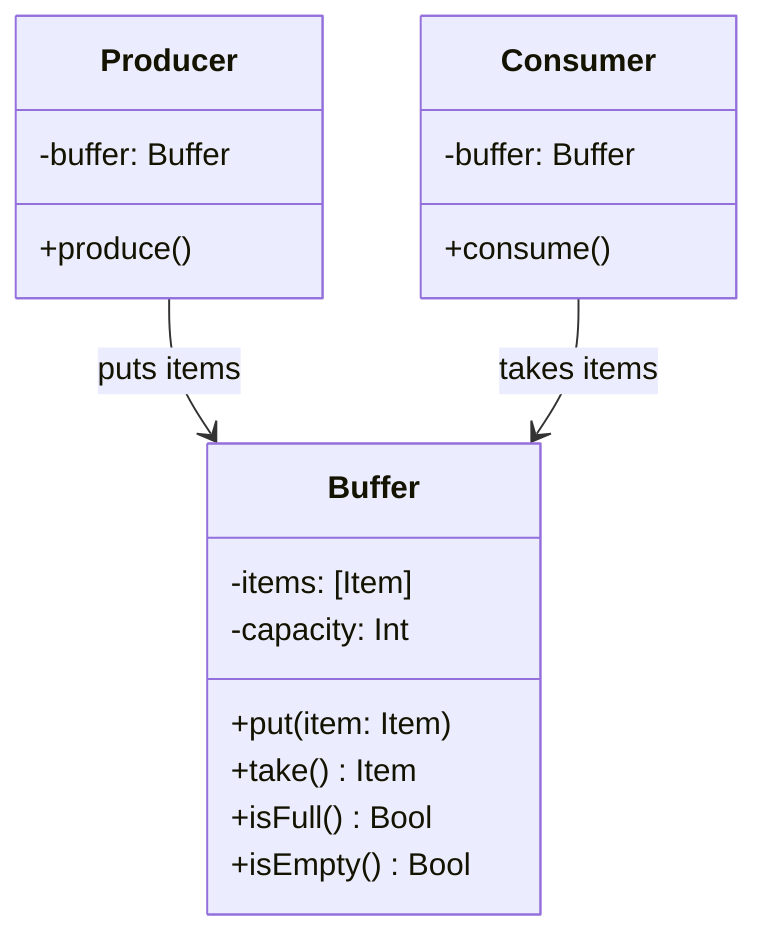
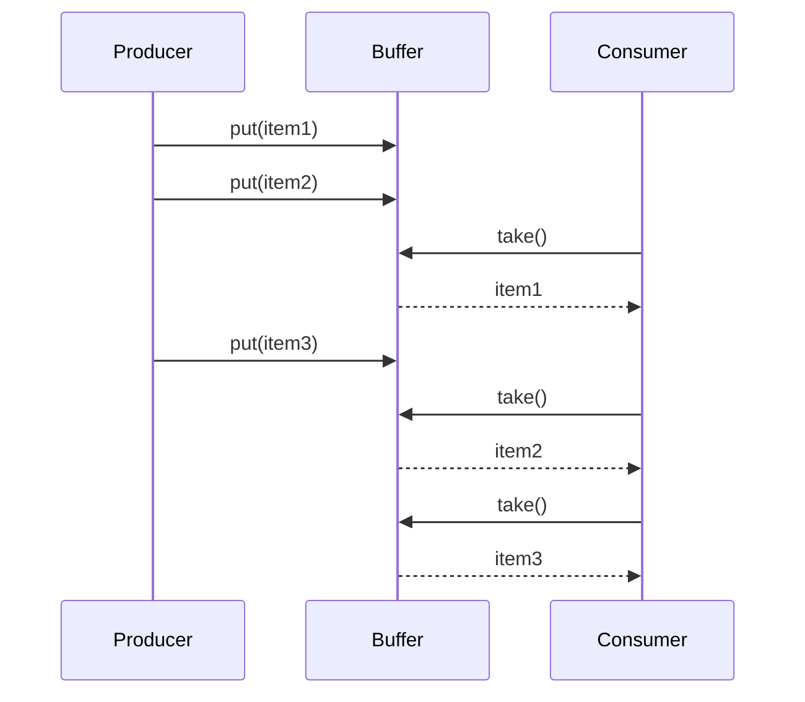

+++
title = "生产者消费者模式"
date = '2026-05-02T22:32:27+08:00'
draft = false
weight = 7
tags = ["设计模式", "面试"]
categories = ["设计模式", "面试"]
+++
## 定义

生产者消费者模式（Producer-Consumer Pattern）是一种并发设计模式，它通过一个共享的缓冲区来解耦生产者和消费者，使得生产者和消费者可以以不同的速度工作，而不需要直接相互依赖。

生产者负责产生数据并放入缓冲区，消费者从缓冲区中取出数据进行处理。这种模式是多线程编程中最经典的设计模式之一。

## 为什么需要生产者消费者模式

生产者消费者模式要解决的核心问题是：**如何在生产者和消费者处理速度不一致的情况下，实现高效、安全的数据传递**。

**问题场景**：假设我们正在开发一个图片处理App，用户选择多张图片后需要进行滤镜处理。图片加载速度快，但滤镜处理速度慢。

最直接的方式可能是这样：

```swift
class ImageProcessor {
    func processImages(_ urls: [URL]) {
        for url in urls {
            // 加载图片（快）
            let image = loadImage(from: url)
            
            // 应用滤镜（慢）
            let filtered = applyFilter(to: image)
            
            // 保存结果
            saveImage(filtered)
        }
    }
    
    private func loadImage(from url: URL) -> UIImage { /* ... */ }
    private func applyFilter(to image: UIImage) -> UIImage { /* ... */ }
    private func saveImage(_ image: UIImage) { /* ... */ }
}
```

这种方式有什么问题？

1. **串行执行**：图片加载和滤镜处理串行执行，无法充分利用多核CPU
2. **资源浪费**：加载线程在等待滤镜处理时处于空闲状态
3. **内存压力**：如果一次性加载所有图片，会占用大量内存
4. **响应性差**：用户需要等待所有处理完成才能看到结果

**生产者消费者模式的解决思路**：

将图片加载（生产者）和滤镜处理（消费者）分离，通过一个有界队列连接：

```swift
class ImagePipeline {
    private let queue = DispatchQueue(label: "image.pipeline", attributes: .concurrent)
    private let semaphore = DispatchSemaphore(value: 5) // 缓冲区大小为5
    private var buffer: [UIImage] = []
    private let bufferLock = NSLock()
    
    func processImages(_ urls: [URL]) {
        // 生产者：加载图片
        let producerGroup = DispatchGroup()
        for url in urls {
            producerGroup.enter()
            queue.async {
                self.semaphore.wait() // 等待缓冲区有空间
                let image = self.loadImage(from: url)
                self.addToBuffer(image)
                producerGroup.leave()
            }
        }
        
        // 消费者：处理图片
        let consumerGroup = DispatchGroup()
        for _ in urls {
            consumerGroup.enter()
            queue.async {
                if let image = self.removeFromBuffer() {
                    let filtered = self.applyFilter(to: image)
                    self.saveImage(filtered)
                    self.semaphore.signal() // 释放缓冲区空间
                }
                consumerGroup.leave()
            }
        }
    }
    
    private func addToBuffer(_ image: UIImage) {
        bufferLock.lock()
        buffer.append(image)
        bufferLock.unlock()
    }
    
    private func removeFromBuffer() -> UIImage? {
        bufferLock.lock()
        defer { bufferLock.unlock() }
        return buffer.isEmpty ? nil : buffer.removeFirst()
    }
}
```

**生产者消费者模式的好处**：
- **解耦**：生产者和消费者相互独立，可以独立修改和扩展
- **缓冲**：缓冲区平衡了生产和消费的速度差异
- **并发**：生产者和消费者可以同时工作，提高吞吐量
- **流量控制**：通过缓冲区大小限制，防止内存溢出

## 模式结构





## 核心组件

### 1. 缓冲区（Buffer）

缓冲区是生产者消费者模式的核心，它需要满足以下要求：

- **线程安全**：多个生产者和消费者可以同时访问
- **阻塞机制**：缓冲区满时阻塞生产者，空时阻塞消费者
- **有界限制**：防止无限增长导致内存溢出

### 2. 生产者（Producer）

生产者负责产生数据并放入缓冲区：

- 当缓冲区满时，生产者应该等待
- 放入数据后，应该通知等待的消费者

### 3. 消费者（Consumer）

消费者从缓冲区取出数据进行处理：

- 当缓冲区空时，消费者应该等待
- 取出数据后，应该通知等待的生产者

## iOS中的实现方式

### 1. 使用DispatchSemaphore实现

```swift
/// 线程安全的有界缓冲区
class BoundedBuffer<T> {
    private var buffer: [T] = []
    private let capacity: Int
    private let lock = NSLock()
    private let itemsAvailable: DispatchSemaphore  // 可用元素数量
    private let spacesAvailable: DispatchSemaphore // 可用空间数量
    
    init(capacity: Int) {
        self.capacity = capacity
        self.itemsAvailable = DispatchSemaphore(value: 0)
        self.spacesAvailable = DispatchSemaphore(value: capacity)
    }
    
    /// 生产者调用：放入元素（缓冲区满时阻塞）
    func put(_ item: T) {
        spacesAvailable.wait() // 等待有空间
        
        lock.lock()
        buffer.append(item)
        lock.unlock()
        
        itemsAvailable.signal() // 通知有新元素
    }
    
    /// 消费者调用：取出元素（缓冲区空时阻塞）
    func take() -> T {
        itemsAvailable.wait() // 等待有元素
        
        lock.lock()
        let item = buffer.removeFirst()
        lock.unlock()
        
        spacesAvailable.signal() // 通知有新空间
        return item
    }
    
    /// 非阻塞版本：尝试放入
    func tryPut(_ item: T, timeout: DispatchTime) -> Bool {
        guard spacesAvailable.wait(timeout: timeout) == .success else {
            return false
        }
        
        lock.lock()
        buffer.append(item)
        lock.unlock()
        
        itemsAvailable.signal()
        return true
    }
    
    /// 非阻塞版本：尝试取出
    func tryTake(timeout: DispatchTime) -> T? {
        guard itemsAvailable.wait(timeout: timeout) == .success else {
            return nil
        }
        
        lock.lock()
        let item = buffer.removeFirst()
        lock.unlock()
        
        spacesAvailable.signal()
        return item
    }
}

// 使用示例
let buffer = BoundedBuffer<Int>(capacity: 10)

// 生产者
DispatchQueue.global().async {
    for i in 1...20 {
        buffer.put(i)
        print("Produced: \(i)")
    }
}

// 消费者
DispatchQueue.global().async {
    for _ in 1...20 {
        let item = buffer.take()
        print("Consumed: \(item)")
        Thread.sleep(forTimeInterval: 0.1) // 模拟消费耗时
    }
}
```

### 2. 使用OperationQueue实现

```swift
/// 基于OperationQueue的生产者消费者实现
class ProducerConsumerQueue<T> {
    private var buffer: [T] = []
    private let bufferLock = NSLock()
    private let capacity: Int
    
    private let producerQueue = OperationQueue()
    private let consumerQueue = OperationQueue()
    
    private let bufferNotFull = DispatchSemaphore(value: 0)
    private let bufferNotEmpty = DispatchSemaphore(value: 0)
    
    var onItemConsumed: ((T) -> Void)?
    
    init(capacity: Int, maxConcurrentProducers: Int = 2, maxConcurrentConsumers: Int = 2) {
        self.capacity = capacity
        producerQueue.maxConcurrentOperationCount = maxConcurrentProducers
        consumerQueue.maxConcurrentOperationCount = maxConcurrentConsumers
        
        // 初始化：缓冲区有capacity个空位
        for _ in 0..<capacity {
            bufferNotFull.signal()
        }
    }
    
    /// 添加生产任务
    func produce(_ item: T) {
        producerQueue.addOperation { [weak self] in
            guard let self = self else { return }
            
            self.bufferNotFull.wait() // 等待缓冲区有空间
            
            self.bufferLock.lock()
            self.buffer.append(item)
            self.bufferLock.unlock()
            
            self.bufferNotEmpty.signal() // 通知消费者
        }
    }
    
    /// 启动消费者
    func startConsuming() {
        consumerQueue.addOperation { [weak self] in
            while true {
                guard let self = self else { return }
                
                self.bufferNotEmpty.wait() // 等待缓冲区有数据
                
                self.bufferLock.lock()
                guard !self.buffer.isEmpty else {
                    self.bufferLock.unlock()
                    continue
                }
                let item = self.buffer.removeFirst()
                self.bufferLock.unlock()
                
                self.bufferNotFull.signal() // 通知生产者
                
                // 处理数据
                DispatchQueue.main.async {
                    self.onItemConsumed?(item)
                }
            }
        }
    }
    
    func stopAll() {
        producerQueue.cancelAllOperations()
        consumerQueue.cancelAllOperations()
    }
}
```

### 3. 使用Combine实现

```swift
import Combine

/// 基于Combine的生产者消费者实现
class CombineProducerConsumer<T> {
    private let subject = PassthroughSubject<T, Never>()
    private var cancellables = Set<AnyCancellable>()
    private let processingQueue = DispatchQueue(label: "processing", attributes: .concurrent)
    
    /// 生产者发送数据
    func produce(_ item: T) {
        subject.send(item)
    }
    
    /// 设置消费者处理逻辑
    func consume(
        maxConcurrent: Int = 2,
        handler: @escaping (T) -> Void
    ) {
        subject
            .buffer(size: 100, prefetch: .byRequest, whenFull: .dropOldest)
            .flatMap(maxPublishers: .max(maxConcurrent)) { item -> AnyPublisher<T, Never> in
                Future { promise in
                    self.processingQueue.async {
                        promise(.success(item))
                    }
                }
                .eraseToAnyPublisher()
            }
            .receive(on: DispatchQueue.main)
            .sink { item in
                handler(item)
            }
            .store(in: &cancellables)
    }
    
    func cancel() {
        cancellables.removeAll()
    }
}

// 使用示例
let pc = CombineProducerConsumer<String>()

pc.consume(maxConcurrent: 3) { item in
    print("Processed: \(item)")
}

// 生产数据
for i in 1...10 {
    pc.produce("Item \(i)")
}
```

### 4. 使用AsyncStream实现（Swift Concurrency）

```swift
/// 基于Swift Concurrency的生产者消费者实现
actor AsyncBuffer<T> {
    private var buffer: [T] = []
    private let capacity: Int
    private var waitingProducers: [CheckedContinuation<Void, Never>] = []
    private var waitingConsumers: [CheckedContinuation<T, Never>] = []
    
    init(capacity: Int) {
        self.capacity = capacity
    }
    
    func put(_ item: T) async {
        // 如果有等待的消费者，直接交给它
        if let consumer = waitingConsumers.first {
            waitingConsumers.removeFirst()
            consumer.resume(returning: item)
            return
        }
        
        // 如果缓冲区满，等待
        if buffer.count >= capacity {
            await withCheckedContinuation { continuation in
                waitingProducers.append(continuation)
            }
        }
        
        buffer.append(item)
    }
    
    func take() async -> T {
        // 如果缓冲区有数据，直接取
        if !buffer.isEmpty {
            let item = buffer.removeFirst()
            
            // 唤醒等待的生产者
            if let producer = waitingProducers.first {
                waitingProducers.removeFirst()
                producer.resume()
            }
            
            return item
        }
        
        // 缓冲区空，等待
        return await withCheckedContinuation { continuation in
            waitingConsumers.append(continuation)
        }
    }
}

// 使用示例
let asyncBuffer = AsyncBuffer<Int>(capacity: 5)

// 生产者任务
Task {
    for i in 1...20 {
        await asyncBuffer.put(i)
        print("Produced: \(i)")
    }
}

// 消费者任务
Task {
    for _ in 1...20 {
        let item = await asyncBuffer.take()
        print("Consumed: \(item)")
        try? await Task.sleep(nanoseconds: 100_000_000) // 模拟处理耗时
    }
}
```

### 5. 使用AsyncChannel（更完整的实现）

```swift
/// 完整的异步通道实现
actor AsyncChannel<T> {
    private var buffer: [T] = []
    private let capacity: Int
    private var isClosed = false
    
    private var producers: [CheckedContinuation<Bool, Never>] = []
    private var consumers: [CheckedContinuation<T?, Never>] = []
    
    init(capacity: Int = Int.max) {
        self.capacity = capacity
    }
    
    /// 发送数据，返回是否成功（通道关闭时返回false）
    func send(_ item: T) async -> Bool {
        if isClosed { return false }
        
        // 优先满足等待的消费者
        if let consumer = consumers.first {
            consumers.removeFirst()
            consumer.resume(returning: item)
            return true
        }
        
        // 缓冲区满，等待
        if buffer.count >= capacity {
            let shouldContinue = await withCheckedContinuation { continuation in
                producers.append(continuation)
            }
            if !shouldContinue { return false }
        }
        
        if isClosed { return false }
        buffer.append(item)
        return true
    }
    
    /// 接收数据，通道关闭且无数据时返回nil
    func receive() async -> T? {
        // 缓冲区有数据
        if !buffer.isEmpty {
            let item = buffer.removeFirst()
            
            // 唤醒等待的生产者
            if let producer = producers.first {
                producers.removeFirst()
                producer.resume(returning: true)
            }
            
            return item
        }
        
        // 通道已关闭
        if isClosed { return nil }
        
        // 等待数据
        return await withCheckedContinuation { continuation in
            consumers.append(continuation)
        }
    }
    
    /// 关闭通道
    func close() {
        isClosed = true
        
        // 唤醒所有等待的生产者
        for producer in producers {
            producer.resume(returning: false)
        }
        producers.removeAll()
        
        // 唤醒所有等待的消费者
        for consumer in consumers {
            consumer.resume(returning: nil)
        }
        consumers.removeAll()
    }
}

// 使用示例
func example() async {
    let channel = AsyncChannel<Int>(capacity: 5)
    
    // 生产者
    Task {
        for i in 1...10 {
            let sent = await channel.send(i)
            if sent {
                print("Sent: \(i)")
            }
        }
        await channel.close()
    }
    
    // 消费者
    Task {
        while let item = await channel.receive() {
            print("Received: \(item)")
        }
        print("Channel closed")
    }
}
```

## 实际应用场景

### 1. 图片下载与处理管道

```swift
class ImagePipeline {
    private let downloadBuffer: BoundedBuffer<URL>
    private let processBuffer: BoundedBuffer<UIImage>
    
    private let downloadQueue = DispatchQueue(label: "download", attributes: .concurrent)
    private let processQueue = DispatchQueue(label: "process", attributes: .concurrent)
    
    private var isRunning = true
    
    var onImageProcessed: ((UIImage) -> Void)?
    
    init(downloadBufferSize: Int = 10, processBufferSize: Int = 5) {
        downloadBuffer = BoundedBuffer(capacity: downloadBufferSize)
        processBuffer = BoundedBuffer(capacity: processBufferSize)
        
        startWorkers()
    }
    
    private func startWorkers() {
        // 下载工作者（消费URL，生产UIImage）
        for _ in 0..<3 {
            downloadQueue.async { [weak self] in
                while self?.isRunning == true {
                    let url = self?.downloadBuffer.take()
                    guard let url = url else { continue }
                    
                    if let data = try? Data(contentsOf: url),
                       let image = UIImage(data: data) {
                        self?.processBuffer.put(image)
                    }
                }
            }
        }
        
        // 处理工作者（消费UIImage，生产处理后的图片）
        for _ in 0..<2 {
            processQueue.async { [weak self] in
                while self?.isRunning == true {
                    let image = self?.processBuffer.take()
                    guard let image = image else { continue }
                    
                    // 应用滤镜
                    let processed = self?.applyFilter(to: image) ?? image
                    
                    DispatchQueue.main.async {
                        self?.onImageProcessed?(processed)
                    }
                }
            }
        }
    }
    
    func addImage(url: URL) {
        downloadBuffer.put(url)
    }
    
    func stop() {
        isRunning = false
    }
    
    private func applyFilter(to image: UIImage) -> UIImage {
        // 滤镜处理逻辑
        return image
    }
}

// 使用
let pipeline = ImagePipeline()
pipeline.onImageProcessed = { image in
    // 更新UI
}

// 添加图片URL
urls.forEach { pipeline.addImage(url: $0) }
```

### 2. 日志收集系统

```swift
class LogCollector {
    static let shared = LogCollector()
    
    private let buffer: BoundedBuffer<LogEntry>
    private let writeQueue = DispatchQueue(label: "log.writer")
    private var fileHandle: FileHandle?
    private var isRunning = true
    
    private init() {
        buffer = BoundedBuffer(capacity: 1000)
        setupFileHandle()
        startWriter()
    }
    
    private func setupFileHandle() {
        let logPath = FileManager.default.temporaryDirectory
            .appendingPathComponent("app.log")
        FileManager.default.createFile(atPath: logPath.path, contents: nil)
        fileHandle = try? FileHandle(forWritingTo: logPath)
    }
    
    private func startWriter() {
        writeQueue.async { [weak self] in
            while self?.isRunning == true {
                guard let entry = self?.buffer.tryTake(timeout: .now() + 1) else {
                    continue
                }
                
                self?.writeToFile(entry)
            }
        }
    }
    
    private func writeToFile(_ entry: LogEntry) {
        let line = "[\(entry.timestamp)] [\(entry.level)] \(entry.message)\n"
        if let data = line.data(using: .utf8) {
            fileHandle?.write(data)
        }
    }
    
    // 生产者接口：记录日志（非阻塞）
    func log(_ message: String, level: LogLevel = .info) {
        let entry = LogEntry(
            timestamp: Date(),
            level: level,
            message: message
        )
        
        // 使用非阻塞方式，避免阻塞调用线程
        if !buffer.tryPut(entry, timeout: .now()) {
            print("Warning: Log buffer full, dropping message")
        }
    }
    
    func shutdown() {
        isRunning = false
        fileHandle?.closeFile()
    }
}

struct LogEntry {
    let timestamp: Date
    let level: LogLevel
    let message: String
}

enum LogLevel: String {
    case debug = "DEBUG"
    case info = "INFO"
    case warning = "WARNING"
    case error = "ERROR"
}

// 使用
LogCollector.shared.log("User logged in", level: .info)
LogCollector.shared.log("Network error occurred", level: .error)
```

### 3. 网络请求队列

```swift
class NetworkRequestQueue {
    private let requestBuffer: BoundedBuffer<NetworkRequest>
    private let maxConcurrentRequests: Int
    private let session: URLSession
    private var isRunning = true
    
    init(maxConcurrentRequests: Int = 4, bufferSize: Int = 100) {
        self.maxConcurrentRequests = maxConcurrentRequests
        self.requestBuffer = BoundedBuffer(capacity: bufferSize)
        self.session = URLSession(configuration: .default)
        
        startWorkers()
    }
    
    private func startWorkers() {
        for _ in 0..<maxConcurrentRequests {
            DispatchQueue.global().async { [weak self] in
                while self?.isRunning == true {
                    guard let request = self?.requestBuffer.take() else { continue }
                    self?.executeRequest(request)
                }
            }
        }
    }
    
    private func executeRequest(_ request: NetworkRequest) {
        let semaphore = DispatchSemaphore(value: 0)
        
        let task = session.dataTask(with: request.urlRequest) { data, response, error in
            if let error = error {
                request.completion(.failure(error))
            } else if let data = data {
                request.completion(.success(data))
            }
            semaphore.signal()
        }
        task.resume()
        
        // 等待请求完成
        semaphore.wait()
    }
    
    // 生产者接口：添加请求
    func enqueue(_ urlRequest: URLRequest, completion: @escaping (Result<Data, Error>) -> Void) {
        let request = NetworkRequest(urlRequest: urlRequest, completion: completion)
        requestBuffer.put(request)
    }
    
    func shutdown() {
        isRunning = false
    }
}

struct NetworkRequest {
    let urlRequest: URLRequest
    let completion: (Result<Data, Error>) -> Void
}
```

### 4. 数据同步服务

```swift
class DataSyncService {
    private let changeBuffer = AsyncChannel<DataChange>(capacity: 100)
    private var syncTask: Task<Void, Never>?
    
    func startSync() {
        syncTask = Task {
            while let change = await changeBuffer.receive() {
                await syncToServer(change)
            }
        }
    }
    
    // 生产者：记录数据变更
    func recordChange(_ change: DataChange) {
        Task {
            _ = await changeBuffer.send(change)
        }
    }
    
    private func syncToServer(_ change: DataChange) async {
        // 同步到服务器的逻辑
        print("Syncing: \(change)")
    }
    
    func stopSync() {
        Task {
            await changeBuffer.close()
        }
        syncTask?.cancel()
    }
}

struct DataChange {
    let entityType: String
    let entityId: String
    let operation: ChangeOperation
    let data: [String: Any]
}

enum ChangeOperation {
    case create, update, delete
}
```

## 优缺点

### 优点

1. **解耦**：生产者和消费者相互独立，不需要知道对方的存在
2. **并发**：生产者和消费者可以同时工作，提高系统吞吐量
3. **缓冲**：缓冲区平衡了生产和消费速度的差异
4. **流量控制**：通过有界缓冲区防止生产者过快导致内存溢出
5. **可扩展**：可以方便地增加生产者或消费者的数量

### 缺点

1. **复杂度**：引入了额外的组件（缓冲区）和同步机制
2. **延迟**：数据需要经过缓冲区，增加了处理延迟
3. **调试困难**：异步处理使问题追踪变得复杂
4. **资源占用**：缓冲区需要占用内存资源

## 最佳实践

1. **合理设置缓冲区大小**：太小会频繁阻塞，太大会浪费内存
2. **使用有界缓冲区**：防止内存溢出
3. **实现优雅关闭**：确保所有数据都被处理完毕后再关闭
4. **监控队列状态**：监控缓冲区使用率，及时发现性能问题
5. **处理异常情况**：消费者处理失败时的重试或丢弃策略
6. **考虑优先级**：对于不同优先级的任务，可以使用优先级队列

## 面试常见问题

### Q1: 生产者消费者模式和发布订阅模式有什么区别？

**答**：
- **生产者消费者模式**：一个数据只会被一个消费者处理，消费者之间是竞争关系
- **发布订阅模式**：一个消息会被所有订阅者收到，订阅者之间没有竞争

例如，消息队列（如Kafka）中的消费者组内是生产者消费者模式（同组内竞争消费），组间是发布订阅模式（不同组都能收到消息）。

### Q2: 如何处理消费者处理失败的情况？

**答**：常见的策略有：
1. **重试队列**：失败的消息放入重试队列，延迟后重新处理
2. **死信队列**：多次重试失败后放入死信队列，人工处理
3. **指数退避**：重试间隔指数增长，避免频繁重试
4. **熔断机制**：连续失败达到阈值后暂停消费

### Q3: iOS中使用GCD实现生产者消费者模式有什么注意事项？

**答**：
1. **使用串行队列保护共享数据**：避免数据竞争
2. **使用信号量控制并发**：DispatchSemaphore实现阻塞等待
3. **注意死锁**：避免在主队列同步等待
4. **合理使用QoS**：根据任务优先级设置队列QoS
5. **及时取消任务**：使用DispatchWorkItem支持取消
