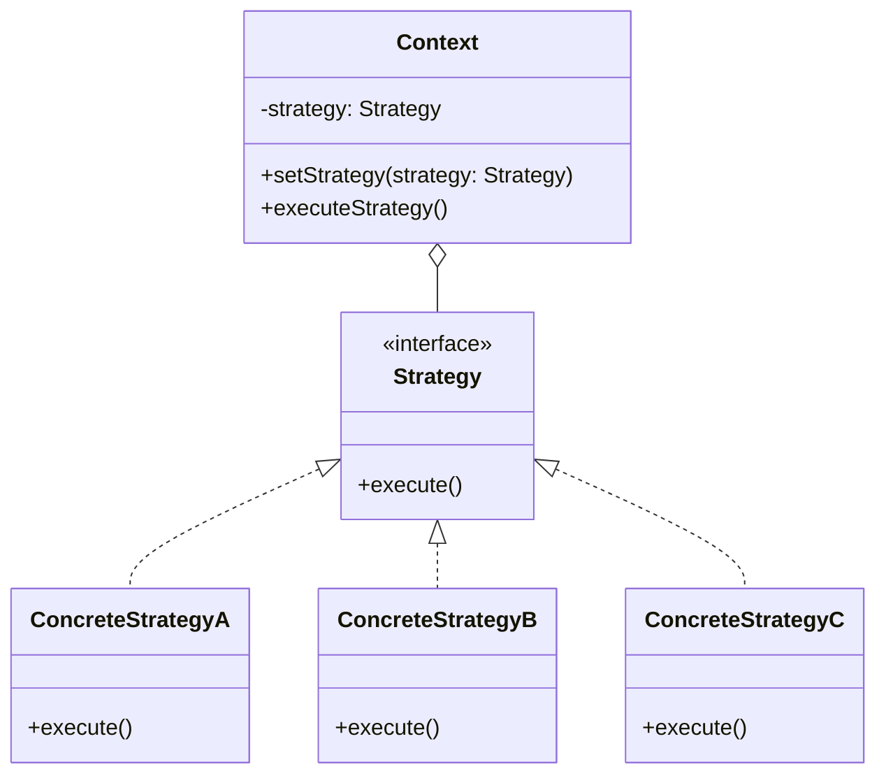

+++
title = "策略模式"
date = '2026-05-02T22:32:27+08:00'
draft = false
weight = 8
tags = ["设计模式", "面试"]
categories = ["设计模式", "面试"]
+++
## 定义

策略模式（Strategy Pattern）是一种行为型设计模式，它定义了一系列算法，将每个算法封装起来，并使它们可以相互替换。策略模式让算法独立于使用它的调用者而变化。

策略模式的核心思想是：将算法的定义与使用分离，通过组合而非继承来实现算法的切换。

## 为什么需要策略模式

在实际开发中，我们经常会遇到这样的场景：同一个功能有多种实现方式，而且这些实现方式需要根据不同条件进行切换。

**问题场景**：假设我们正在开发一个电商App的支付功能，需要支持信用卡、Apple Pay、支付宝等多种支付方式。

最直接的实现方式可能是这样：

```swift
func processPayment(type: String, amount: Double) {
    if type == "creditCard" {
        // 信用卡支付逻辑（可能有几十行代码）
        print("Processing credit card payment...")
    } else if type == "applePay" {
        // Apple Pay支付逻辑
        print("Processing Apple Pay...")
    } else if type == "alipay" {
        // 支付宝支付逻辑
        print("Processing Alipay...")
    }
    // 后续可能还要添加更多支付方式...
}
```

这种实现方式存在几个明显的问题：

1. **违反开闭原则**：每次添加新的支付方式，都需要修改这个函数，增加新的分支
2. **代码臃肿**：随着支付方式增多，函数会变得越来越长，难以维护
3. **测试困难**：所有支付逻辑耦合在一起，难以单独测试某种支付方式
4. **复用性差**：如果其他地方也需要使用某种支付逻辑，只能复制代码

**策略模式的解决思路**：

策略模式将每种支付方式抽取为独立的类（策略），它们都实现相同的接口。调用方只需要持有策略接口的引用，不需要知道具体是哪种实现。

这样做的好处是：
- **新增支付方式**：只需要新建一个策略类，无需修改现有代码
- **代码清晰**：每种支付逻辑独立封装，职责单一
- **易于测试**：可以对每种策略单独进行单元测试
- **运行时切换**：用户可以随时切换支付方式，系统只需要替换策略对象

简单来说，策略模式就是把「做什么」和「怎么做」分离开来——调用方只关心「做什么」，具体「怎么做」由不同的策略类来决定。

## 模式结构



## 角色说明

- **Strategy（策略接口）**：定义所有支持的算法的公共接口
- **ConcreteStrategy（具体策略）**：实现Strategy接口的具体算法
- **Context（上下文）**：持有Strategy的引用，负责调用策略方法

## iOS中的实现

### 基础实现

```swift
// 策略协议
protocol PaymentStrategy {
    func pay(amount: Double) -> Bool
    var name: String { get }
}

// 具体策略 - 信用卡支付
class CreditCardPayment: PaymentStrategy {
    private let cardNumber: String
    private let cvv: String
    
    var name: String { "Credit Card" }
    
    init(cardNumber: String, cvv: String) {
        self.cardNumber = cardNumber
        self.cvv = cvv
    }
    
    func pay(amount: Double) -> Bool {
        print("Paying \(amount) using Credit Card ending with \(cardNumber.suffix(4))")
        // 实际支付逻辑
        return true
    }
}

// 具体策略 - Apple Pay
class ApplePayPayment: PaymentStrategy {
    var name: String { "Apple Pay" }
    
    func pay(amount: Double) -> Bool {
        print("Paying \(amount) using Apple Pay")
        // 调用Apple Pay SDK
        return true
    }
}

// 上下文
class PaymentContext {
    private var strategy: PaymentStrategy
    
    init(strategy: PaymentStrategy) {
        self.strategy = strategy
    }
    
    func setStrategy(_ strategy: PaymentStrategy) {
        self.strategy = strategy
    }
    
    func checkout(amount: Double) -> Bool {
        print("Processing payment with \(strategy.name)...")
        return strategy.pay(amount: amount)
    }
}

// 使用
let creditCard = CreditCardPayment(cardNumber: "1234567890123456", cvv: "123")
let context = PaymentContext(strategy: creditCard)
context.checkout(amount: 99.99)

// 切换支付方式
let applePay = ApplePayPayment()
context.setStrategy(applePay)
context.checkout(amount: 99.99)
```

### 使用闭包简化策略

对于简单的策略，可以使用闭包代替完整的类：

```swift
// 使用闭包定义策略
typealias SortStrategy<T> = ([T]) -> [T]

class Sorter<T> {
    var strategy: SortStrategy<T>
    
    init(strategy: @escaping SortStrategy<T>) {
        self.strategy = strategy
    }
    
    func sort(_ array: [T]) -> [T] {
        return strategy(array)
    }
}

// 定义不同的排序策略
let ascendingSort: SortStrategy<Int> = { array in
    return array.sorted { $0 < $1 }
}

let descendingSort: SortStrategy<Int> = { array in
    return array.sorted { $0 > $1 }
}

// 使用
let numbers = [3, 1, 4, 1, 5, 9, 2, 6]
let sorter = Sorter(strategy: ascendingSort)
print(sorter.sort(numbers))  // [1, 1, 2, 3, 4, 5, 6, 9]

sorter.strategy = descendingSort
print(sorter.sort(numbers))  // [9, 6, 5, 4, 3, 2, 1, 1]
```

### 策略工厂模式

在实际应用中，通常需要一个工厂来创建和管理策略：

```swift
// 支付类型枚举
enum PaymentType {
    case creditCard
    case applePay
    case alipay
}

// 策略工厂
class PaymentStrategyFactory {
    static func createStrategy(
        type: PaymentType,
        config: [String: String] = [:]
    ) -> PaymentStrategy? {
        switch type {
        case .creditCard:
            guard let cardNumber = config["cardNumber"],
                  let cvv = config["cvv"] else {
                return nil
            }
            return CreditCardPayment(cardNumber: cardNumber, cvv: cvv)
            
        case .applePay:
            return ApplePayPayment()
            
        case .alipay:
            guard let account = config["account"] else {
                return nil
            }
            return AlipayPayment(account: account)
        }
    }
    
    // 根据条件自动选择策略
    static func recommendStrategy(amount: Double, userPreference: PaymentType?) -> PaymentStrategy {
        // 优先使用用户偏好
        if let preference = userPreference,
           let strategy = createStrategy(type: preference) {
            return strategy
        }
        
        // 根据金额推荐
        if amount > 1000 {
            return ApplePayPayment()  // 大额推荐Apple Pay
        } else {
            return AlipayPayment(account: "default")  // 小额推荐支付宝
        }
    }
}

// 使用工厂创建策略
let config = ["cardNumber": "1234567890123456", "cvv": "123"]
if let strategy = PaymentStrategyFactory.createStrategy(type: .creditCard, config: config) {
    let context = PaymentContext(strategy: strategy)
    context.checkout(amount: 99.99)
}

// 自动推荐策略
let recommendedStrategy = PaymentStrategyFactory.recommendStrategy(
    amount: 1500,
    userPreference: .applePay
)
let context2 = PaymentContext(strategy: recommendedStrategy)
context2.checkout(amount: 1500)
```

## 实际应用场景

### 1. 表单验证策略

```swift
// 验证策略协议
protocol ValidationStrategy {
    func validate(_ value: String) -> ValidationResult
}

struct ValidationResult {
    let isValid: Bool
    let errorMessage: String?
}

// 邮箱验证策略
class EmailValidation: ValidationStrategy {
    func validate(_ value: String) -> ValidationResult {
        let emailRegex = "[A-Z0-9a-z._%+-]+@[A-Za-z0-9.-]+\\.[A-Za-z]{2,64}"
        let predicate = NSPredicate(format: "SELF MATCHES %@", emailRegex)
        let isValid = predicate.evaluate(with: value)
        return ValidationResult(
            isValid: isValid,
            errorMessage: isValid ? nil : "Invalid email format"
        )
    }
}

// 密码强度验证策略
class PasswordValidation: ValidationStrategy {
    func validate(_ value: String) -> ValidationResult {
        var errorMessages: [String] = []
        
        if value.count < 8 {
            errorMessages.append("At least 8 characters")
        }
        if !value.contains(where: { $0.isUppercase }) {
            errorMessages.append("At least one uppercase letter")
        }
        if !value.contains(where: { $0.isNumber }) {
            errorMessages.append("At least one number")
        }
        
        let isValid = errorMessages.isEmpty
        return ValidationResult(
            isValid: isValid,
            errorMessage: isValid ? nil : errorMessages.joined(separator: ", ")
        )
    }
}

// 自定义验证策略
class LengthValidation: ValidationStrategy {
    private let minLength: Int
    private let maxLength: Int
    
    init(minLength: Int, maxLength: Int) {
        self.minLength = minLength
        self.maxLength = maxLength
    }
    
    func validate(_ value: String) -> ValidationResult {
        let isValid = value.count >= minLength && value.count <= maxLength
        return ValidationResult(
            isValid: isValid,
            errorMessage: isValid ? nil : "Length must be between \(minLength) and \(maxLength)"
        )
    }
}

// 表单字段
class FormField {
    let name: String
    var value: String = ""
    private var validators: [ValidationStrategy] = []
    
    init(name: String) {
        self.name = name
    }
    
    func addValidator(_ validator: ValidationStrategy) {
        validators.append(validator)
    }
    
    func validate() -> [ValidationResult] {
        return validators.map { $0.validate(value) }
    }
    
    var isValid: Bool {
        return validate().allSatisfy { $0.isValid }
    }
    
    // 获取第一个错误信息
    var firstError: String? {
        return validate().first { !$0.isValid }?.errorMessage
    }
    
    // 获取所有错误信息
    var allErrors: [String] {
        return validate().compactMap { $0.errorMessage }
    }
}

// 组合验证策略
class CompositeValidation: ValidationStrategy {
    private let validators: [ValidationStrategy]
    private let mode: ValidationMode
    
    enum ValidationMode {
        case all  // 所有验证都必须通过
        case any  // 至少一个验证通过
    }
    
    init(validators: [ValidationStrategy], mode: ValidationMode = .all) {
        self.validators = validators
        self.mode = mode
    }
    
    func validate(_ value: String) -> ValidationResult {
        let results = validators.map { $0.validate(value) }
        
        switch mode {
        case .all:
            let isValid = results.allSatisfy { $0.isValid }
            let errors = results.compactMap { $0.errorMessage }
            return ValidationResult(
                isValid: isValid,
                errorMessage: isValid ? nil : errors.joined(separator: "; ")
            )
            
        case .any:
            let isValid = results.contains { $0.isValid }
            return ValidationResult(
                isValid: isValid,
                errorMessage: isValid ? nil : "All validations failed"
            )
        }
    }
}

// 使用
let emailField = FormField(name: "email")
emailField.addValidator(EmailValidation())
emailField.value = "test@example.com"
print(emailField.isValid)  // true

let passwordField = FormField(name: "password")
passwordField.addValidator(LengthValidation(minLength: 8, maxLength: 20))
passwordField.addValidator(PasswordValidation())
passwordField.value = "weak"

// 使用便捷方法获取错误
if let error = passwordField.firstError {
    print("First error: \(error)")
}

// 或获取所有错误
let allErrors = passwordField.allErrors
print("All errors: \(allErrors)")

// 使用组合验证
let strongPasswordValidation = CompositeValidation(validators: [
    LengthValidation(minLength: 8, maxLength: 20),
    PasswordValidation()
])

let result = strongPasswordValidation.validate("weak")
print(result.errorMessage ?? "Valid")
```

### 2. 网络请求重试策略

```swift
// 重试策略协议
protocol RetryStrategy {
    func shouldRetry(attempt: Int, error: Error) -> Bool
    func delay(for attempt: Int) -> TimeInterval
}

// 固定延迟重试
class FixedDelayRetry: RetryStrategy {
    private let maxAttempts: Int
    private let delay: TimeInterval
    
    init(maxAttempts: Int, delay: TimeInterval) {
        self.maxAttempts = maxAttempts
        self.delay = delay
    }
    
    func shouldRetry(attempt: Int, error: Error) -> Bool {
        return attempt < maxAttempts
    }
    
    func delay(for attempt: Int) -> TimeInterval {
        return delay
    }
}

// 指数退避重试
class ExponentialBackoffRetry: RetryStrategy {
    private let maxAttempts: Int
    private let baseDelay: TimeInterval
    private let maxDelay: TimeInterval
    
    init(maxAttempts: Int, baseDelay: TimeInterval = 1.0, maxDelay: TimeInterval = 60.0) {
        self.maxAttempts = maxAttempts
        self.baseDelay = baseDelay
        self.maxDelay = maxDelay
    }
    
    func shouldRetry(attempt: Int, error: Error) -> Bool {
        return attempt < maxAttempts
    }
    
    func delay(for attempt: Int) -> TimeInterval {
        let delay = baseDelay * pow(2.0, Double(attempt))
        return min(delay, maxDelay)
    }
}

// 网络客户端
class NetworkClient {
    private var retryStrategy: RetryStrategy
    
    init(retryStrategy: RetryStrategy = ExponentialBackoffRetry(maxAttempts: 3)) {
        self.retryStrategy = retryStrategy
    }
    
    func setRetryStrategy(_ strategy: RetryStrategy) {
        self.retryStrategy = strategy
    }
    
    func request(url: URL, completion: @escaping (Result<Data, Error>) -> Void) {
        performRequest(url: url, attempt: 0, completion: completion)
    }
    
    private func performRequest(url: URL, attempt: Int, completion: @escaping (Result<Data, Error>) -> Void) {
        URLSession.shared.dataTask(with: url) { [weak self] data, response, error in
            guard let self = self else { return }
            
            if let error = error {
                if self.retryStrategy.shouldRetry(attempt: attempt, error: error) {
                    let delay = self.retryStrategy.delay(for: attempt)
                    print("Retry attempt \(attempt + 1) after \(delay)s")
                    
                    DispatchQueue.global().asyncAfter(deadline: .now() + delay) { [weak self] in
                        self?.performRequest(url: url, attempt: attempt + 1, completion: completion)
                    }
                } else {
                    completion(.failure(error))
                }
                return
            }
            
            if let data = data {
                completion(.success(data))
            }
        }.resume()
    }
}
```

### 3. 图片加载策略

```swift
// 图片加载策略
protocol ImageLoadingStrategy {
    func loadImage(from url: URL, completion: @escaping (UIImage?) -> Void)
}

// 直接加载（无缓存）
class DirectImageLoading: ImageLoadingStrategy {
    func loadImage(from url: URL, completion: @escaping (UIImage?) -> Void) {
        URLSession.shared.dataTask(with: url) { data, _, _ in
            let image = data.flatMap { UIImage(data: $0) }
            DispatchQueue.main.async {
                completion(image)
            }
        }.resume()
    }
}

// 内存缓存加载
class MemoryCachedImageLoading: ImageLoadingStrategy {
    private let cache = NSCache<NSURL, UIImage>()
    
    func loadImage(from url: URL, completion: @escaping (UIImage?) -> Void) {
        // 检查缓存
        if let cachedImage = cache.object(forKey: url as NSURL) {
            completion(cachedImage)
            return
        }
        
        // 从网络加载
        URLSession.shared.dataTask(with: url) { [weak self] data, _, _ in
            let image = data.flatMap { UIImage(data: $0) }
            
            if let image = image {
                self?.cache.setObject(image, forKey: url as NSURL)
            }
            
            DispatchQueue.main.async {
                completion(image)
            }
        }.resume()
    }
}

// 磁盘缓存加载
class DiskCachedImageLoading: ImageLoadingStrategy {
    private let cacheDirectory: URL
    
    init() {
        let paths = FileManager.default.urls(for: .cachesDirectory, in: .userDomainMask)
        cacheDirectory = paths[0].appendingPathComponent("ImageCache")
        try? FileManager.default.createDirectory(at: cacheDirectory, withIntermediateDirectories: true)
    }
    
    func loadImage(from url: URL, completion: @escaping (UIImage?) -> Void) {
        let cacheFile = cacheDirectory.appendingPathComponent(url.lastPathComponent)
        
        // 检查磁盘缓存
        if let data = try? Data(contentsOf: cacheFile),
           let image = UIImage(data: data) {
            completion(image)
            return
        }
        
        // 从网络加载
        URLSession.shared.dataTask(with: url) { data, _, _ in
            if let data = data {
                try? data.write(to: cacheFile)
            }
            
            let image = data.flatMap { UIImage(data: $0) }
            DispatchQueue.main.async {
                completion(image)
            }
        }.resume()
    }
}

// 图片加载器
class ImageLoader {
    private var strategy: ImageLoadingStrategy
    
    init(strategy: ImageLoadingStrategy = MemoryCachedImageLoading()) {
        self.strategy = strategy
    }
    
    func setStrategy(_ strategy: ImageLoadingStrategy) {
        self.strategy = strategy
    }
    
    func load(from url: URL, completion: @escaping (UIImage?) -> Void) {
        strategy.loadImage(from: url, completion: completion)
    }
}
```

## 使用场景

1. **多种算法可选**：当系统需要在多个算法中动态选择一个执行时
2. **避免条件语句**：消除代码中大量的if-else或switch-case语句
3. **算法需要独立变化**：算法的实现可能经常变化，需要与使用它的代码分离
4. **策略之间差异明显**：不同策略的实现逻辑差异较大
5. **需要运行时切换行为**：根据用户选择或系统状态动态改变对象行为
6. **算法需要复用**：相同的算法需要在不同的上下文中使用

## 优缺点

### 优点

1. **开闭原则**：可以在不修改上下文的情况下引入新策略
2. **消除条件语句**：用多态替代条件判断
3. **算法可复用**：策略类可以在不同上下文中复用
4. **运行时切换**：可以动态改变对象的行为

### 缺点

1. **类数量增加**：每个策略都需要一个类
2. **使用者需了解策略**：使用者 必须知道不同策略的区别才能选择
3. **策略与上下文通信开销**：策略可能需要从上下文获取数据

## 最佳实践

1. **使用协议定义策略**：利用Swift的协议特性，保持策略接口的一致性
2. **考虑使用闭包**：简单策略可以用闭包代替完整的类，减少代码量
3. **策略保持单一职责**：每个策略只实现一个算法，避免职责混乱
4. **使用工厂方法创建策略**：封装策略的创建逻辑，降低客户端复杂度
5. **提供默认策略**：为上下文提供合理的默认策略，简化使用
6. **策略可组合**：设计可组合的策略，支持复杂场景
7. **注意内存管理**：异步策略要特别注意循环引用问题
8. **策略命名清晰**：使用清晰的命名，让使用者容易理解每个策略的作用

## 面试常见问题

### Q1: 什么时候应该使用策略模式？

当代码中出现大量if-else或switch-case来选择不同算法时，或者算法需要独立于客户端变化时，应考虑使用策略模式。

### Q2: 如何在iOS中实现策略模式？

使用协议定义策略接口，创建实现协议的具体策略类，在上下文类中持有策略引用并委托调用。也可以使用闭包来简化实现。对于复杂场景，建议配合工厂模式来创建和管理策略。

### Q3: 策略模式如何避免类爆炸？

1. 对于简单策略使用闭包而非类
2. 使用策略组合模式，通过组合基础策略来实现复杂策略
3. 使用配置驱动的策略，将算法参数化而非创建新类
4. 合理抽象，避免过度细分策略

### Q4: 策略模式在iOS中的典型应用有哪些？

1. 支付方式选择
2. 表单验证规则
3. 网络请求重试策略
4. 图片加载和缓存策略
5. 数据序列化方式
6. 排序和筛选算法
7. 动画效果切换
8. 主题切换等
