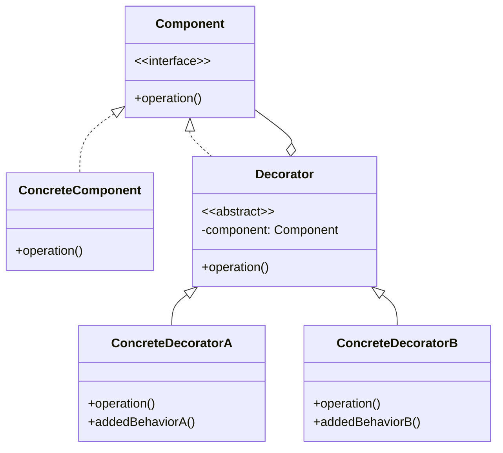

+++
title = "装饰器模式"
date = '2026-05-02T22:32:27+08:00'
draft = false
weight = 9
tags = ["设计模式", "面试"]
categories = ["设计模式", "面试"]
+++
## 定义

装饰器模式（Decorator Pattern）是一种结构型设计模式，它允许向现有对象动态添加新功能，同时又不改变其结构。装饰器通过创建一个包装对象来包裹真实对象，实现在不修改原有对象的基础上扩展功能。

装饰器模式的核心思想是：使用组合而非继承来扩展对象的功能，遵循"对扩展开放，对修改关闭"的原则。

## 为什么需要装饰器模式

装饰器模式要解决的核心问题是：**在不修改原有对象的情况下，动态地给对象添加新功能**。

### 问题场景

假设我们正在开发一个UI组件库，需要为`UILabel`添加各种视觉效果：圆角、阴影、边框、渐变背景等。而且这些效果需要能够**自由组合**。

### 方案一：使用继承（不推荐）

```swift
// 基础标签
class BasicLabel: UILabel {
    init(text: String) {
        super.init(frame: .zero)
        self.text = text
    }
}

// 圆角标签
class RoundedLabel: BasicLabel {
    override init(text: String) {
        super.init(text: text)
        layer.cornerRadius = 8
        clipsToBounds = true
    }
}

// 阴影标签
class ShadowLabel: BasicLabel {
    override init(text: String) {
        super.init(text: text)
        layer.shadowColor = UIColor.black.cgColor
        layer.shadowOffset = CGSize(width: 0, height: 2)
        layer.shadowOpacity = 0.3
    }
}

// 边框标签
class BorderLabel: BasicLabel {
    override init(text: String) {
        super.init(text: text)
        layer.borderWidth = 1
        layer.borderColor = UIColor.gray.cgColor
    }
}

// 如果需要圆角+阴影呢？
class RoundedShadowLabel: BasicLabel {
    override init(text: String) {
        super.init(text: text)
        // 重复圆角代码
        layer.cornerRadius = 8
        clipsToBounds = true
        // 重复阴影代码
        layer.shadowColor = UIColor.black.cgColor
        layer.shadowOffset = CGSize(width: 0, height: 2)
        layer.shadowOpacity = 0.3
    }
}

// 如果需要圆角+边框呢？
class RoundedBorderLabel: BasicLabel { /* 又要重复代码 */ }

// 如果需要阴影+边框呢？
class ShadowBorderLabel: BasicLabel { /* 继续重复代码 */ }

// 如果需要圆角+阴影+边框呢？
class RoundedShadowBorderLabel: BasicLabel { /* 所有代码都重复一遍 */ }
```

**这种方式的问题**：

1. **类爆炸**：3个效果就需要7个类（2³-1种组合）
   - 单独效果：`RoundedLabel`、`ShadowLabel`、`BorderLabel`
   - 两两组合：`RoundedShadowLabel`、`RoundedBorderLabel`、`ShadowBorderLabel`
   - 三者组合：`RoundedShadowBorderLabel`

2. **代码重复**：每个组合类都要重复实现相同的效果代码

3. **无法动态组合**：继承关系在编译时确定，运行时无法改变

4. **扩展困难**：如果再添加一个"渐变背景"效果，需要新增15个类！

### 方案二：装饰器模式（推荐）

使用**组合代替继承**，每个效果封装为一个装饰器：

```swift
// 1. 定义组件协议
protocol LabelComponent {
    var label: UILabel { get }
}

// 2. 基础组件
class BasicLabel: LabelComponent {
    let label: UILabel
    
    init(text: String) {
        label = UILabel()
        label.text = text
        label.backgroundColor = .white
        label.textColor = .black
        label.textAlignment = .center
        label.font = .systemFont(ofSize: 16)
    }
}

// 3. 装饰器基类
class LabelDecorator: LabelComponent {
    let wrapped: LabelComponent
    var label: UILabel { wrapped.label }
    
    init(_ component: LabelComponent) {
        self.wrapped = component
    }
}

// 4. 具体装饰器
class RoundedDecorator: LabelDecorator {
    override init(_ component: LabelComponent) {
        super.init(component)
        label.layer.cornerRadius = 8
        label.clipsToBounds = true
        print("✅ 添加圆角效果")
    }
}

class ShadowDecorator: LabelDecorator {
    override init(_ component: LabelComponent) {
        super.init(component)
        label.layer.shadowColor = UIColor.black.cgColor
        label.layer.shadowOffset = CGSize(width: 0, height: 2)
        label.layer.shadowRadius = 4
        label.layer.shadowOpacity = 0.3
        label.layer.masksToBounds = false
        print("✅ 添加阴影效果")
    }
}

class BorderDecorator: LabelDecorator {
    override init(_ component: LabelComponent) {
        super.init(component)
        label.layer.borderWidth = 2
        label.layer.borderColor = UIColor.systemBlue.cgColor
        print("✅ 添加边框效果")
    }
}

class GradientDecorator: LabelDecorator {
    override init(_ component: LabelComponent) {
        super.init(component)
        let gradient = CAGradientLayer()
        gradient.colors = [
            UIColor.systemBlue.cgColor,
            UIColor.systemPurple.cgColor
        ]
        gradient.frame = label.bounds
        label.layer.insertSublayer(gradient, at: 0)
        print("✅ 添加渐变背景")
    }
}

// 5. 使用：自由组合！
var component: LabelComponent = BasicLabel(text: "Hello Decorator")

// 场景1：只要圆角
component = RoundedDecorator(component)
// 输出：✅ 添加圆角效果

// 场景2：圆角 + 阴影
var component2: LabelComponent = BasicLabel(text: "Hello")
component2 = RoundedDecorator(component2)
component2 = ShadowDecorator(component2)
// 输出：
// ✅ 添加圆角效果
// ✅ 添加阴影效果

// 场景3：圆角 + 边框 + 渐变
var component3: LabelComponent = BasicLabel(text: "Hello")
component3 = RoundedDecorator(component3)
component3 = BorderDecorator(component3)
component3 = GradientDecorator(component3)
// 输出：
// ✅ 添加圆角效果
// ✅ 添加边框效果
// ✅ 添加渐变背景

// 场景4：全部效果
var component4: LabelComponent = BasicLabel(text: "Hello")
component4 = RoundedDecorator(component4)
component4 = ShadowDecorator(component4)
component4 = BorderDecorator(component4)
component4 = GradientDecorator(component4)

// 获取最终的UILabel
let finalLabel = component4.label
view.addSubview(finalLabel)
```

**装饰器模式的核心优势**：
- ✅ **灵活组合**：效果可以任意叠加，无需预定义所有组合
- ✅ **单一职责**：每个装饰器只负责一个效果
- ✅ **运行时扩展**：可以在运行时动态添加或移除效果
- ✅ **开闭原则**：添加新效果不需要修改现有代码
- ✅ **代码复用**：每个效果只实现一次，可以在任何地方复用

## 模式结构



## 角色说明

- **Component（组件接口）**：定义对象接口，可以动态地添加职责
- **ConcreteComponent（具体组件）**：定义一个将要接收附加职责的对象
- **Decorator（装饰器基类）**：持有一个Component对象的引用，定义与Component一致的接口
- **ConcreteDecorator（具体装饰器）**：向组件添加具体的职责

## iOS中的装饰器实现方式

### 1. Category（Objective-C）

Category是Objective-C中为现有类添加方法的方式，可以看作是一种简化的装饰器：

```objectivec
// UIView+RoundCorners.h
@interface UIView (RoundCorners)
- (void)applyRoundCorners:(CGFloat)radius;
- (void)applyShadow:(UIColor *)color offset:(CGSize)offset radius:(CGFloat)radius opacity:(CGFloat)opacity;
@end

// UIView+RoundCorners.m
@implementation UIView (RoundCorners)

- (void)applyRoundCorners:(CGFloat)radius {
    self.layer.cornerRadius = radius;
    self.clipsToBounds = YES;
}

- (void)applyShadow:(UIColor *)color offset:(CGSize)offset radius:(CGFloat)radius opacity:(CGFloat)opacity {
    self.layer.shadowColor = color.CGColor;
    self.layer.shadowOffset = offset;
    self.layer.shadowRadius = radius;
    self.layer.shadowOpacity = opacity;
    self.clipsToBounds = NO;
}

@end

// 使用
UIView *view = [[UIView alloc] init];
[view applyRoundCorners:10.0];
[view applyShadow:[UIColor blackColor] offset:CGSizeMake(0, 2) radius:4.0 opacity:0.1];
```

### 2. Extension（Swift）

Swift的Extension类似于Category，但功能更强大：

```swift
// 为UIView添加装饰方法
extension UIView {
    @discardableResult
    func roundCorners(_ radius: CGFloat) -> Self {
        layer.cornerRadius = radius
        clipsToBounds = true
        return self
    }
    
    @discardableResult
    func border(width: CGFloat, color: UIColor) -> Self {
        layer.borderWidth = width
        layer.borderColor = color.cgColor
        return self
    }
    
    @discardableResult
    func shadow(color: UIColor, offset: CGSize, radius: CGFloat, opacity: Float) -> Self {
        layer.shadowColor = color.cgColor
        layer.shadowOffset = offset
        layer.shadowRadius = radius
        layer.shadowOpacity = opacity
        clipsToBounds = false
        return self
    }
}

// 链式调用
let decoratedView = UIView()
    .roundCorners(10)
    .border(width: 1, color: .gray)
    .shadow(color: .black, offset: CGSize(width: 0, height: 2), radius: 4, opacity: 0.1)
```

### 3. 包装类装饰器

```swift
// 组件协议
protocol DataSource {
    func fetchData() -> [String]
}

// 具体组件
class NetworkDataSource: DataSource {
    func fetchData() -> [String] {
        print("Fetching data from network...")
        return ["Item 1", "Item 2", "Item 3"]
    }
}

// 装饰器基类
class DataSourceDecorator: DataSource {
    let wrappedDataSource: DataSource
    
    init(dataSource: DataSource) {
        self.wrappedDataSource = dataSource
    }
    
    func fetchData() -> [String] {
        return wrappedDataSource.fetchData()
    }
}

// 缓存装饰器
class CachingDecorator: DataSourceDecorator {
    private var cache: [String]?
    private var cacheTimestamp: Date?
    private let cacheDuration: TimeInterval
    
    init(dataSource: DataSource, cacheDuration: TimeInterval = 60) {
        self.cacheDuration = cacheDuration
        super.init(dataSource: dataSource)
    }
    
    override func fetchData() -> [String] {
        if let cache = cache,
           let timestamp = cacheTimestamp,
           Date().timeIntervalSince(timestamp) < cacheDuration {
            print("Returning cached data")
            return cache
        }
        
        let data = super.fetchData()
        cache = data
        cacheTimestamp = Date()
        return data
    }
}

// 日志装饰器
class LoggingDecorator: DataSourceDecorator {
    override func fetchData() -> [String] {
        let startTime = Date()
        print("[\(startTime)] Starting data fetch...")
        
        let data = super.fetchData()
        
        let endTime = Date()
        let duration = endTime.timeIntervalSince(startTime)
        print("[\(endTime)] Data fetch completed in \(duration)s, returned \(data.count) items")
        
        return data
    }
}

// 加密装饰器
class EncryptionDecorator: DataSourceDecorator {
    override func fetchData() -> [String] {
        let data = super.fetchData()
        print("Encrypting data...")
        return data.map { encrypt($0) }
    }
    
    private func encrypt(_ string: String) -> String {
        // 简单的加密示例
        return String(string.reversed())
    }
}

// 使用 - 装饰器可以组合
var dataSource: DataSource = NetworkDataSource()
dataSource = CachingDecorator(dataSource: dataSource)
dataSource = LoggingDecorator(dataSource: dataSource)

let data = dataSource.fetchData()
// 第一次调用：从网络获取并缓存
let cachedData = dataSource.fetchData()
// 第二次调用：返回缓存数据
```

## 使用场景

1. **动态添加功能**：需要在运行时为对象添加额外行为
2. **透明扩展**：扩展功能时不影响其他对象
3. **功能组合**：需要通过组合多个功能来创建不同变体
4. **替代继承**：继承方式不合适或导致类爆炸时

## 优缺点

### 优点

1. **灵活性**：比继承更灵活地扩展功能
2. **单一职责**：每个装饰器只关注一个功能
3. **开闭原则**：无需修改现有代码即可添加新装饰器
4. **组合能力**：可以用多个装饰器组合出复杂功能

### 缺点

1. **复杂性**：大量装饰器会增加系统复杂度
2. **调试困难**：多层装饰器导致调试困难
3. **顺序依赖**：装饰器顺序可能影响结果

## 最佳实践

1. **保持装饰器简单**：每个装饰器只添加一个职责
2. **使用协议定义接口**：保证装饰器和被装饰对象接口一致
3. **注意装饰顺序**：某些情况下顺序会影响结果
4. **考虑使用Extension**：简单场景使用Swift Extension更简洁
