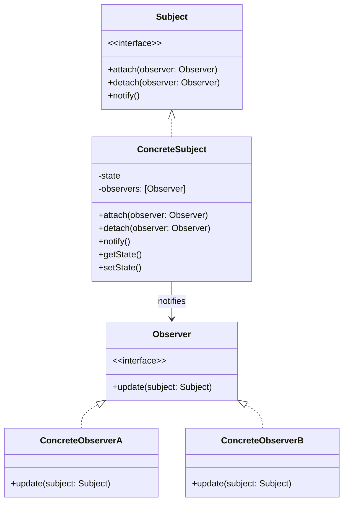

+++
title = "观察者模式"
date = '2026-05-02T22:32:27+08:00'
draft = false
weight = 10
tags = ["设计模式", "面试"]
categories = ["设计模式", "面试"]
+++
## 定义

观察者模式（Observer Pattern）是一种行为型设计模式，它定义了对象之间的一对多依赖关系，当一个对象（主题/被观察者）的状态发生改变时，所有依赖于它的对象（观察者）都会收到通知并自动更新。

观察者模式也被称为发布-订阅模式（Publish-Subscribe Pattern）。

## 为什么需要观察者模式

观察者模式要解决的核心问题是：**当一个对象的状态发生变化时，如何自动通知所有依赖它的对象**。

**问题场景**：假设我们正在开发一个电商App，用户登录后需要更新多个页面的状态（首页显示用户名、购物车同步、个人中心更新等）。

最直接的方式可能是这样：

```swift
class LoginService {
    func login(username: String, password: String) {
        // 登录成功后...
        let user = User(name: username)
        
        // 直接调用各个需要更新的对象
        HomeViewController.shared.updateUser(user)
        CartViewController.shared.syncCart(for: user)
        ProfileViewController.shared.refreshProfile(user)
        // 如果还有其他需要通知的地方，继续添加...
    }
}
```

这种方式有什么问题？

1. **紧耦合**：LoginService必须知道所有需要通知的对象，依赖关系错综复杂
2. **难以维护**：每新增一个需要监听登录事件的页面，都要修改LoginService
3. **违反开闭原则**：对扩展不开放，每次扩展都要修改已有代码
4. **单例滥用**：为了让LoginService能访问到各个页面，不得不使用大量单例

**观察者模式的解决思路**：

被观察者（Subject）只负责"广播"状态变化，不关心谁在监听；观察者（Observer）自己注册感兴趣的事件：

```swift
// 使用NotificationCenter实现
class LoginService {
    func login(username: String, password: String) {
        let user = User(name: username)
        
        // 只负责发送通知，不关心谁在监听
        NotificationCenter.default.post(
            name: .userDidLogin,
            object: nil,
            userInfo: ["user": user]
        )
    }
}

// 各个页面自己注册监听
class HomeViewController: UIViewController {
    override func viewDidLoad() {
        super.viewDidLoad()
        NotificationCenter.default.addObserver(
            self,
            selector: #selector(handleUserLogin),
            name: .userDidLogin,
            object: nil
        )
    }
    
    @objc func handleUserLogin(_ notification: Notification) {
        if let user = notification.userInfo?["user"] as? User {
            updateUI(with: user)
        }
    }
}
```

**观察者模式的好处**：
- **松耦合**：发布者和订阅者相互独立，互不知道对方的存在
- **易于扩展**：新增订阅者不需要修改发布者的代码
- **支持广播**：一次状态变化可以通知多个观察者
- **动态订阅**：观察者可以随时注册和取消监听

## 模式结构



## 基本实现

### Swift实现

```swift
// 观察者协议
protocol Observer: AnyObject {
    func update(subject: Subject)
}

// 主题协议
protocol Subject {
    func attach(_ observer: Observer)
    func detach(_ observer: Observer)
    func notify()
}

// 具体主题
class ConcreteSubject: Subject {
    var state: Int = 0 {
        didSet {
            notify()
        }
    }
    
    private var observers: [Observer] = []
    
    func attach(_ observer: Observer) {
        observers.append(observer)
    }
    
    func detach(_ observer: Observer) {
        observers.removeAll { $0 === observer }
    }
    
    func notify() {
        observers.forEach { $0.update(subject: self) }
    }
}

// 具体观察者A
class ConcreteObserverA: Observer {
    func update(subject: Subject) {
        if let concreteSubject = subject as? ConcreteSubject {
            print("Observer A: Reacted to state \(concreteSubject.state)")
        }
    }
}

// 具体观察者B
class ConcreteObserverB: Observer {
    func update(subject: Subject) {
        if let concreteSubject = subject as? ConcreteSubject {
            print("Observer B: Reacted to state \(concreteSubject.state)")
        }
    }
}

// 使用
let subject = ConcreteSubject()
let observerA = ConcreteObserverA()
let observerB = ConcreteObserverB()

subject.attach(observerA)
subject.attach(observerB)

subject.state = 1
// Output:
// Observer A: Reacted to state 1
// Observer B: Reacted to state 1

subject.detach(observerA)
subject.state = 2
// Output:
// Observer B: Reacted to state 2
```

## iOS中的观察者模式

### 1. KVO（Key-Value Observing）

KVO是Cocoa框架提供的观察者模式实现，允许对象观察另一个对象特定属性的变化。

```swift
class Person: NSObject {
    @objc dynamic var name: String = ""
    @objc dynamic var age: Int = 0
}

class PersonObserver: NSObject {
    private var observation: NSKeyValueObservation?
    private var observations: [NSKeyValueObservation] = []
    
    func observe(person: Person) {
        // 使用新API观察name
        let nameObservation = person.observe(\.name, options: [.new, .old]) { person, change in
            print("Name changed from \(change.oldValue ?? "") to \(change.newValue ?? "")")
        }
        observations.append(nameObservation)
        
        // 观察age
        let ageObservation = person.observe(\.age, options: [.new]) { person, change in
            print("Age changed to \(change.newValue ?? 0)")
        }
        observations.append(ageObservation)
    }
    
    func stopObserving() {
        observations.forEach { $0.invalidate() }
        observations.removeAll()
    }
}

// 使用
let person = Person()
let observer = PersonObserver()
observer.observe(person: person)

person.name = "John"  // Name changed from  to John
person.age = 30       // Age changed to 30
```

#### KVO注意事项

```swift
// 1. 必须继承NSObject
// 2. 属性需要@objc dynamic修饰
// 3. 必须在dealloc时移除观察者（旧API）
// 4. 使用新API时，需要保持observation对象

// 手动触发KVO
class ManualKVOExample: NSObject {
    private var _value: Int = 0
    
    @objc dynamic var value: Int {
        get { return _value }
        set {
            willChangeValue(forKey: "value")
            _value = newValue
            didChangeValue(forKey: "value")
        }
    }
}
```

### 2. NotificationCenter

NotificationCenter是iOS中另一种观察者模式的实现，它是一个广播机制，允许对象在不知道接收者是谁的情况下发送通知。

#### 基本使用

```swift
// 定义通知名称
extension Notification.Name {
    static let userDidLogin = Notification.Name("userDidLogin")
    static let userDidLogout = Notification.Name("userDidLogout")
    static let dataDidUpdate = Notification.Name("dataDidUpdate")
}

// 发送通知
class AuthService {
    func login(user: User) {
        // 登录逻辑...
        
        // 发送通知
        NotificationCenter.default.post(
            name: .userDidLogin,
            object: self,
            userInfo: ["user": user]
        )
    }
    
    func logout() {
        NotificationCenter.default.post(name: .userDidLogout, object: self)
    }
}

// 接收通知
class ProfileViewController: UIViewController {
    override func viewDidLoad() {
        super.viewDidLoad()
        
        // 添加观察者
        NotificationCenter.default.addObserver(
            self,
            selector: #selector(handleUserLogin(_:)),
            name: .userDidLogin,
            object: nil
        )
    }
    
    @objc private func handleUserLogin(_ notification: Notification) {
        if let user = notification.userInfo?["user"] as? User {
            updateUI(with: user)
        }
    }
    
    deinit {
        // iOS 9+自动移除，但显式移除是好习惯
        NotificationCenter.default.removeObserver(self)
    }
}
```

#### 使用闭包方式

```swift
class SettingsViewController: UIViewController {
    private var loginObserver: NSObjectProtocol?
    private var logoutObserver: NSObjectProtocol?
    
    override func viewDidLoad() {
        super.viewDidLoad()
        
        loginObserver = NotificationCenter.default.addObserver(
            forName: .userDidLogin,
            object: nil,
            queue: .main
        ) { [weak self] notification in
            self?.handleLogin(notification)
        }
        
        logoutObserver = NotificationCenter.default.addObserver(
            forName: .userDidLogout,
            object: nil,
            queue: .main
        ) { [weak self] notification in
            self?.handleLogout(notification)
        }
    }
    
    private func handleLogin(_ notification: Notification) {
        print("User logged in")
    }
    
    private func handleLogout(_ notification: Notification) {
        print("User logged out")
    }
    
    deinit {
        if let observer = loginObserver {
            NotificationCenter.default.removeObserver(observer)
        }
        if let observer = logoutObserver {
            NotificationCenter.default.removeObserver(observer)
        }
    }
}
```

#### 自定义NotificationCenter

```swift
class CustomNotificationCenter {
    static let `default` = CustomNotificationCenter()
    
    private var observers: [Notification.Name: [(object: AnyObject?, block: (Notification) -> Void)]] = [:]
    private let queue = DispatchQueue(label: "notification.queue", attributes: .concurrent)
    
    private init() {}
    
    func addObserver(
        forName name: Notification.Name,
        object: AnyObject? = nil,
        block: @escaping (Notification) -> Void
    ) {
        queue.async(flags: .barrier) {
            if self.observers[name] == nil {
                self.observers[name] = []
            }
            self.observers[name]?.append((object: object, block: block))
        }
    }
    
    func post(name: Notification.Name, object: Any? = nil, userInfo: [AnyHashable: Any]? = nil) {
        let notification = Notification(name: name, object: object, userInfo: userInfo)
        
        queue.sync {
            guard let observerList = observers[name] else { return }
            
            for observer in observerList {
                if observer.object == nil || observer.object === object as AnyObject {
                    observer.block(notification)
                }
            }
        }
    }
}
```

### 3. Combine框架

Combine是Apple在iOS 13引入的响应式编程框架，提供了声明式的方式处理异步事件和数据流。

#### Publisher和Subscriber

```swift
import Combine

// 使用PassthroughSubject
class DataService {
    // 可以手动发送值的Publisher
    let dataPublisher = PassthroughSubject<[String], Error>()
    
    // 带有当前值的Publisher
    let currentUser = CurrentValueSubject<User?, Never>(nil)
    
    func fetchData() {
        // 模拟网络请求
        DispatchQueue.main.asyncAfter(deadline: .now() + 1) {
            self.dataPublisher.send(["Item 1", "Item 2", "Item 3"])
        }
    }
    
    func login(user: User) {
        currentUser.send(user)
    }
    
    func logout() {
        currentUser.send(nil)
    }
}

class DataViewController: UIViewController {
    private let dataService = DataService()
    private var cancellables = Set<AnyCancellable>()
    
    override func viewDidLoad() {
        super.viewDidLoad()
        
        // 订阅数据变化
        dataService.dataPublisher
            .receive(on: DispatchQueue.main)
            .sink(
                receiveCompletion: { completion in
                    switch completion {
                    case .finished:
                        print("Completed")
                    case .failure(let error):
                        print("Error: \(error)")
                    }
                },
                receiveValue: { data in
                    print("Received data: \(data)")
                }
            )
            .store(in: &cancellables)
        
        // 订阅用户状态
        dataService.currentUser
            .sink { user in
                if let user = user {
                    print("User logged in: \(user.name)")
                } else {
                    print("User logged out")
                }
            }
            .store(in: &cancellables)
    }
}
```

#### @Published属性包装器

```swift
import Combine

class UserViewModel: ObservableObject {
    @Published var username: String = ""
    @Published var isLoggedIn: Bool = false
    @Published var errorMessage: String?
}

class LoginViewController: UIViewController {
    private let viewModel = UserViewModel()
    private var cancellables = Set<AnyCancellable>()
    
    @IBOutlet weak var usernameLabel: UILabel!
    @IBOutlet weak var errorLabel: UILabel!
    
    override func viewDidLoad() {
        super.viewDidLoad()
        
        // 观察username变化
        viewModel.$username
            .receive(on: DispatchQueue.main)
            .sink { [weak self] username in
                self?.usernameLabel.text = username
            }
            .store(in: &cancellables)
        
        // 观察错误消息
        viewModel.$errorMessage
            .compactMap { $0 }
            .receive(on: DispatchQueue.main)
            .sink { [weak self] message in
                self?.errorLabel.text = message
            }
            .store(in: &cancellables)
        
        // 组合多个Publisher
        viewModel.$username
            .combineLatest(viewModel.$isLoggedIn)
            .sink { username, isLoggedIn in
                print("Username: \(username), Logged in: \(isLoggedIn)")
            }
            .store(in: &cancellables)
    }
}
```

#### Combine操作符

```swift
import Combine

class SearchViewModel {
    @Published var searchText: String = ""
    private var cancellables = Set<AnyCancellable>()
    
    let searchResults = PassthroughSubject<[SearchResult], Never>()
    
    init() {
        // 使用操作符处理搜索
        $searchText
            .debounce(for: .milliseconds(300), scheduler: RunLoop.main)  // 防抖
            .removeDuplicates()  // 去重
            .filter { !$0.isEmpty }  // 过滤空字符串
            .map { text -> AnyPublisher<[SearchResult], Never> in
                // 执行搜索
                return self.performSearch(query: text)
            }
            .switchToLatest()  // 只关心最新的搜索结果
            .sink { [weak self] results in
                self?.searchResults.send(results)
            }
            .store(in: &cancellables)
    }
    
    private func performSearch(query: String) -> AnyPublisher<[SearchResult], Never> {
        // 模拟搜索API
        return Future { promise in
            DispatchQueue.global().asyncAfter(deadline: .now() + 0.5) {
                let results = [SearchResult(title: "Result for \(query)")]
                promise(.success(results))
            }
        }
        .eraseToAnyPublisher()
    }
}

struct SearchResult {
    let title: String
}
```

### 4. RxSwift（第三方库）

RxSwift是ReactiveX的Swift实现，提供了强大的响应式编程能力：

```swift
import RxSwift
import RxCocoa

class RxViewModel {
    let items = BehaviorRelay<[String]>(value: [])
    let isLoading = BehaviorRelay<Bool>(value: false)
    let error = PublishRelay<Error>()
    
    private let disposeBag = DisposeBag()
    
    func loadData() {
        isLoading.accept(true)
        
        // 模拟网络请求
        Observable<[String]>.create { observer in
            DispatchQueue.global().asyncAfter(deadline: .now() + 1) {
                observer.onNext(["Item 1", "Item 2", "Item 3"])
                observer.onCompleted()
            }
            return Disposables.create()
        }
        .observe(on: MainScheduler.instance)
        .subscribe(
            onNext: { [weak self] items in
                self?.items.accept(items)
            },
            onError: { [weak self] error in
                self?.error.accept(error)
            },
            onCompleted: { [weak self] in
                self?.isLoading.accept(false)
            }
        )
        .disposed(by: disposeBag)
    }
}

class RxViewController: UIViewController {
    @IBOutlet weak var tableView: UITableView!
    @IBOutlet weak var activityIndicator: UIActivityIndicatorView!
    
    private let viewModel = RxViewModel()
    private let disposeBag = DisposeBag()
    
    override func viewDidLoad() {
        super.viewDidLoad()
        
        // 绑定数据到TableView
        viewModel.items
            .bind(to: tableView.rx.items(cellIdentifier: "Cell")) { index, item, cell in
                cell.textLabel?.text = item
            }
            .disposed(by: disposeBag)
        
        // 绑定加载状态
        viewModel.isLoading
            .bind(to: activityIndicator.rx.isAnimating)
            .disposed(by: disposeBag)
        
        // 处理错误
        viewModel.error
            .subscribe(onNext: { [weak self] error in
                self?.showError(error)
            })
            .disposed(by: disposeBag)
        
        viewModel.loadData()
    }
    
    private func showError(_ error: Error) {
        // 显示错误
    }
}
```

## 使用场景

1. **一对多的依赖关系**：当一个对象的改变需要通知多个其他对象时
2. **松耦合通信**：当对象之间需要通信但又不想紧密耦合时
3. **事件驱动系统**：需要响应各种事件的系统
4. **数据绑定**：UI与数据模型之间的同步
5. **跨模块通信**：不同模块之间的消息传递

## 优缺点

### 优点

1. **松耦合**：观察者和被观察者之间松散耦合
2. **支持广播通信**：一个主题可以通知多个观察者
3. **建立触发机制**：状态变化自动触发更新

### 缺点

1. **调试困难**：事件流难以追踪
2. **性能开销**：大量观察者可能影响性能
3. **循环依赖风险**：不当使用可能导致循环调用
4. **内存泄漏**：忘记移除观察者可能导致内存泄漏

## 最佳实践

1. **及时移除观察者**：在对象销毁前移除观察者
2. **使用弱引用**：避免循环引用
3. **合理选择实现方式**：根据场景选择KVO、NotificationCenter或Combine
4. **注意线程安全**：在正确的线程处理回调
5. **避免过度使用**：不是所有场景都需要观察者模式

## 面试常见问题

### Q1: KVO的实现原理是什么？

**答**：KVO基于isa-swizzling实现。当一个对象被观察时，系统会动态创建一个继承自该对象类的子类（NSKVONotifying_ClassName），并将对象的isa指针指向这个子类。子类重写了被观察属性的setter方法，在setter中调用willChangeValueForKey和didChangeValueForKey来通知观察者。

### Q2: NotificationCenter和KVO的区别？

**答**：
- KVO是一对一或一对多的属性观察，自动触发，需要继承NSObject
- NotificationCenter是广播机制，一对多，需要手动发送通知，不限制类类型
- KVO观察的是属性变化，NotificationCenter观察的是自定义事件

### Q3: Combine相比传统观察者模式有什么优势？

**答**：
- 类型安全，编译时检查
- 丰富的操作符支持数据转换和组合
- 内置背压处理和线程调度
- 声明式API，代码更简洁
- 统一的异步编程模型
