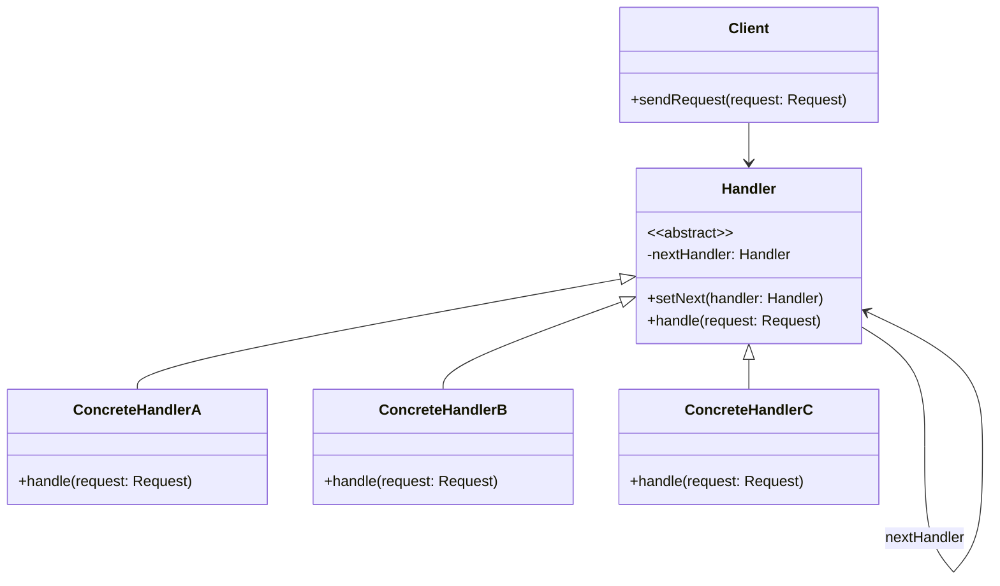
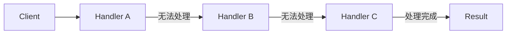
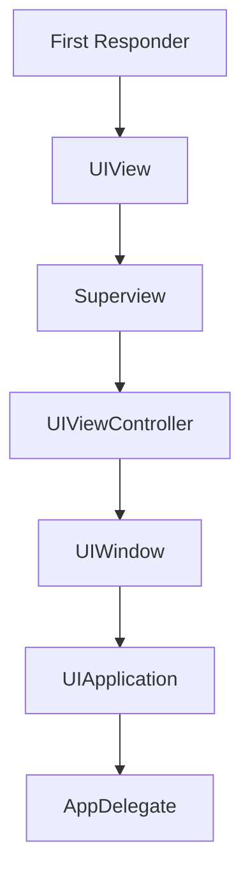

+++
title = "责任链模式"
date = '2026-05-02T22:32:27+08:00'
draft = false
weight = 12
tags = ["设计模式", "面试"]
categories = ["设计模式", "面试"]
+++
## 定义

责任链模式（Chain of Responsibility Pattern）是一种行为型设计模式，它将请求的发送者和接收者解耦，让多个对象都有机会处理请求。将这些对象连成一条链，并沿着这条链传递请求，直到有一个对象处理它为止。

责任链模式的核心思想是：避免请求发送者与接收者耦合在一起，让多个对象都有可能接收请求，将这些对象组成一条链，并沿着这条链传递请求，直到有对象处理它为止。

## 为什么需要责任链模式

**问题场景**：假设我们正在开发一个审批系统，不同金额的报销需要不同级别的人员审批。

最直接的方式可能是这样：

```swift
class ExpenseApproval {
    func approve(amount: Double) {
        if amount <= 1000 {
            // 组长审批
            teamLeaderApprove(amount)
        } else if amount <= 5000 {
            // 部门经理审批
            departmentManagerApprove(amount)
        } else if amount <= 10000 {
            // 总监审批
            directorApprove(amount)
        } else {
            // CEO审批
            ceoApprove(amount)
        }
    }
    
    func teamLeaderApprove(_ amount: Double) { ... }
    func departmentManagerApprove(_ amount: Double) { ... }
    func directorApprove(_ amount: Double) { ... }
    func ceoApprove(_ amount: Double) { ... }
}
```

这种方式有什么问题？

1. **职责不清**：所有审批逻辑都在一个类中，违反单一职责原则
2. **难以扩展**：新增审批级别需要修改已有代码，违反开闭原则
3. **硬编码规则**：审批金额限制写死在代码中，难以灵活配置
4. **紧耦合**：发送者必须知道所有审批者的存在

**责任链模式的解决思路**：

将每个审批者封装为独立的处理器，组成一条链，请求沿链传递：

```swift
// 处理器协议
protocol Approver: AnyObject {
    var nextApprover: Approver? { get set }
    func approve(expense: Expense) -> ApprovalResult
}

// 组长
class TeamLeader: Approver {
    var nextApprover: Approver?
    let limit: Double = 1000
    
    func approve(expense: Expense) -> ApprovalResult {
        if expense.amount <= limit {
            return .approved(by: "Team Leader")
        }
        // 超出权限，传递给下一个审批者
        return nextApprover?.approve(expense: expense) ?? .rejected
    }
}

// 部门经理
class DepartmentManager: Approver {
    var nextApprover: Approver?
    let limit: Double = 5000
    
    func approve(expense: Expense) -> ApprovalResult {
        if expense.amount <= limit {
            return .approved(by: "Department Manager")
        }
        return nextApprover?.approve(expense: expense) ?? .rejected
    }
}

// 构建责任链
let teamLeader = TeamLeader()
let manager = DepartmentManager()
let director = Director()
let ceo = CEO()

teamLeader.nextApprover = manager
manager.nextApprover = director
director.nextApprover = ceo

// 使用 - 请求自动沿链传递
let expense = Expense(amount: 3000, description: "Conference fee")
let result = teamLeader.approve(expense: expense)
// 自动传递到DepartmentManager处理
```

**责任链模式的好处**：
- **解耦发送者和接收者**：发送者不需要知道具体由谁处理
- **灵活配置**：可以动态调整链的结构和顺序
- **单一职责**：每个处理器只负责自己能处理的请求
- **易于扩展**：新增处理器只需实现协议并加入链中

## 模式结构



请求处理流程：



## iOS中的应用

### 1. 响应者链（Responder Chain）

iOS中最经典的责任链模式应用就是响应者链。事件从第一响应者开始，沿着响应者链传递，直到找到能够处理的对象。

```swift
// iOS响应者链示例
class CustomButton: UIButton {
    override func touchesBegan(_ touches: Set<UITouch>, with event: UIEvent?) {
        print("CustomButton received touch")
        
        // 可以选择处理或传递给下一个响应者
        if shouldHandleTouch(touches) {
            handleTouch(touches)
        } else {
            // 传递给下一个响应者
            super.touchesBegan(touches, with: event)
        }
    }
    
    private func shouldHandleTouch(_ touches: Set<UITouch>) -> Bool {
        return true
    }
    
    private func handleTouch(_ touches: Set<UITouch>) {
        print("CustomButton handling touch")
    }
}

class CustomView: UIView {
    override func touchesBegan(_ touches: Set<UITouch>, with event: UIEvent?) {
        print("CustomView received touch")
        super.touchesBegan(touches, with: event)
    }
}

class CustomViewController: UIViewController {
    override func touchesBegan(_ touches: Set<UITouch>, with event: UIEvent?) {
        print("CustomViewController received touch")
        super.touchesBegan(touches, with: event)
    }
}
```

响应者链的结构：



### 2. 手势识别责任链

```swift
// 手势处理责任链
protocol GestureHandler: AnyObject {
    var nextHandler: GestureHandler? { get set }
    func handleGesture(_ gesture: UIGestureRecognizer) -> Bool
}

class TapGestureHandler: GestureHandler {
    var nextHandler: GestureHandler?
    
    func handleGesture(_ gesture: UIGestureRecognizer) -> Bool {
        if let tap = gesture as? UITapGestureRecognizer {
            print("Handling tap gesture with \(tap.numberOfTapsRequired) taps")
            return true
        }
        return nextHandler?.handleGesture(gesture) ?? false
    }
}

class SwipeGestureHandler: GestureHandler {
    var nextHandler: GestureHandler?
    
    func handleGesture(_ gesture: UIGestureRecognizer) -> Bool {
        if let swipe = gesture as? UISwipeGestureRecognizer {
            print("Handling swipe gesture in direction: \(swipe.direction)")
            return true
        }
        return nextHandler?.handleGesture(gesture) ?? false
    }
}

class PanGestureHandler: GestureHandler {
    var nextHandler: GestureHandler?
    
    func handleGesture(_ gesture: UIGestureRecognizer) -> Bool {
        if let pan = gesture as? UIPanGestureRecognizer {
            let translation = pan.translation(in: pan.view)
            print("Handling pan gesture with translation: \(translation)")
            return true
        }
        return nextHandler?.handleGesture(gesture) ?? false
    }
}

class DefaultGestureHandler: GestureHandler {
    var nextHandler: GestureHandler?
    
    func handleGesture(_ gesture: UIGestureRecognizer) -> Bool {
        print("Default handler: unrecognized gesture")
        return false
    }
}
```

### 3. 网络请求拦截器链

```swift
// 请求上下文
class RequestContext {
    var request: URLRequest
    var response: URLResponse?
    var data: Data?
    var error: Error?
    
    init(request: URLRequest) {
        self.request = request
    }
}

// 拦截器协议
protocol Interceptor: AnyObject {
    var nextInterceptor: Interceptor? { get set }
    func intercept(_ context: RequestContext) async throws -> RequestContext
}

extension Interceptor {
    @discardableResult
    func setNext(_ interceptor: Interceptor) -> Interceptor {
        self.nextInterceptor = interceptor
        return interceptor
    }
}

// 认证拦截器
class AuthInterceptor: Interceptor {
    var nextInterceptor: Interceptor?
    private let tokenProvider: () -> String?
    
    init(tokenProvider: @escaping () -> String?) {
        self.tokenProvider = tokenProvider
    }
    
    func intercept(_ context: RequestContext) async throws -> RequestContext {
        if let token = tokenProvider() {
            context.request.setValue("Bearer \(token)", forHTTPHeaderField: "Authorization")
        }
        return try await nextInterceptor?.intercept(context) ?? context
    }
}

// 日志拦截器
class LoggingInterceptor: Interceptor {
    var nextInterceptor: Interceptor?
    
    func intercept(_ context: RequestContext) async throws -> RequestContext {
        let startTime = Date()
        print("Request: \(context.request.httpMethod ?? "GET") \(context.request.url?.absoluteString ?? "")")
        
        let result = try await nextInterceptor?.intercept(context) ?? context
        
        let duration = Date().timeIntervalSince(startTime)
        print("Response: \(duration * 1000)ms")
        
        return result
    }
}

// 重试拦截器
class RetryInterceptor: Interceptor {
    var nextInterceptor: Interceptor?
    let maxRetries: Int
    
    init(maxRetries: Int = 3) {
        self.maxRetries = maxRetries
    }
    
    func intercept(_ context: RequestContext) async throws -> RequestContext {
        var lastError: Error?
        
        for attempt in 0..<maxRetries {
            do {
                return try await nextInterceptor?.intercept(context) ?? context
            } catch {
                lastError = error
                print("Retry attempt \(attempt + 1) failed: \(error)")
                
                // 等待后重试
                try await Task.sleep(nanoseconds: UInt64(pow(2.0, Double(attempt)) * 1_000_000_000))
            }
        }
        
        throw lastError ?? URLError(.unknown)
    }
}

// 缓存拦截器
class CacheInterceptor: Interceptor {
    var nextInterceptor: Interceptor?
    private let cache = NSCache<NSString, NSData>()
    
    func intercept(_ context: RequestContext) async throws -> RequestContext {
        let cacheKey = context.request.url?.absoluteString ?? ""
        
        // 检查缓存
        if context.request.httpMethod == "GET",
           let cachedData = cache.object(forKey: cacheKey as NSString) {
            context.data = cachedData as Data
            return context
        }
        
        let result = try await nextInterceptor?.intercept(context) ?? context
        
        // 缓存结果
        if context.request.httpMethod == "GET",
           let data = result.data {
            cache.setObject(data as NSData, forKey: cacheKey as NSString)
        }
        
        return result
    }
}

// 实际请求执行器
class NetworkExecutor: Interceptor {
    var nextInterceptor: Interceptor?
    
    func intercept(_ context: RequestContext) async throws -> RequestContext {
        let (data, response) = try await URLSession.shared.data(for: context.request)
        context.data = data
        context.response = response
        return context
    }
}

// 网络客户端
class NetworkClient {
    private let interceptorChain: Interceptor
    
    init() {
        // 构建拦截器链
        let auth = AuthInterceptor { "user_token" }
        let logging = LoggingInterceptor()
        let retry = RetryInterceptor(maxRetries: 3)
        let cache = CacheInterceptor()
        let executor = NetworkExecutor()
        
        auth
            .setNext(logging)
            .setNext(retry)
            .setNext(cache)
            .setNext(executor)
        
        interceptorChain = auth
    }
    
    func execute(_ request: URLRequest) async throws -> Data {
        let context = RequestContext(request: request)
        let result = try await interceptorChain.intercept(context)
        
        if let error = result.error {
            throw error
        }
        
        return result.data ?? Data()
    }
}
```

## 责任链模式的变体

### 纯责任链与不纯责任链

**纯责任链**：请求只能被一个处理者处理

```swift
protocol PureHandler {
    var nextHandler: PureHandler? { get set }
    func handle(_ request: Request) -> Bool
}

class ConcreteHandler: PureHandler {
    var nextHandler: PureHandler?
    
    func handle(_ request: Request) -> Bool {
        if canHandle(request) {
            // 处理请求，不再传递
            return true
        }
        // 传递给下一个处理者
        return nextHandler?.handle(request) ?? false
    }
    
    func canHandle(_ request: Request) -> Bool {
        return false
    }
}
```

**不纯责任链**：请求可以被多个处理者处理

```swift
protocol ImpureHandler {
    var nextHandler: ImpureHandler? { get set }
    func handle(_ request: Request)
}

class ConcreteImpureHandler: ImpureHandler {
    var nextHandler: ImpureHandler?
    
    func handle(_ request: Request) {
        // 处理请求
        process(request)
        // 继续传递给下一个处理者
        nextHandler?.handle(request)
    }
    
    func process(_ request: Request) {
        // 处理逻辑
    }
}
```

## 优缺点

### 优点

1. **解耦发送者与接收者**：发送者不需要知道具体的处理者
2. **灵活性**：可以动态调整责任链的结构和顺序
3. **单一职责**：每个处理者只负责自己能处理的请求
4. **可扩展**：新增处理者不影响现有代码

### 缺点

1. **不保证被处理**：请求可能到达链尾都没有处理者
2. **调试困难**：链较长时，调试和追踪比较困难
3. **性能开销**：请求可能需要遍历整个链
4. **循环引用风险**：如果链配置错误，可能形成循环

## 最佳实践

1. **设置默认处理者**：在链尾设置一个默认处理者，确保请求被处理
2. **限制链长度**：避免链过长导致性能问题
3. **使用弱引用**：如果可能存在循环，使用弱引用打破循环
4. **提供快速失败机制**：当确定无法处理时，快速返回
5. **日志记录**：在每个节点记录日志，便于调试
