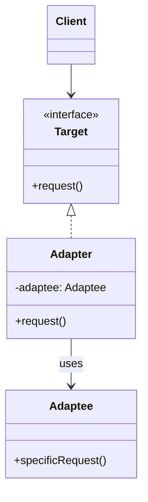
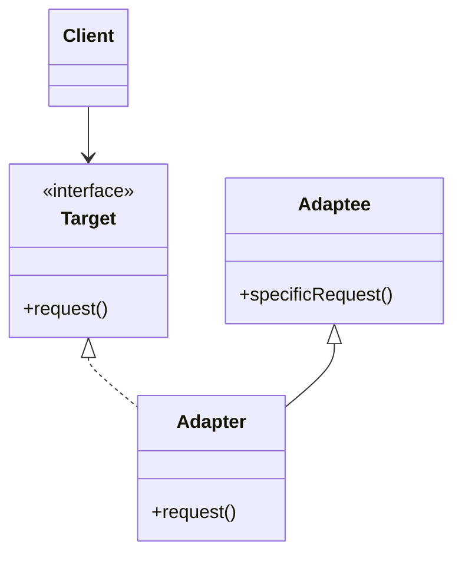
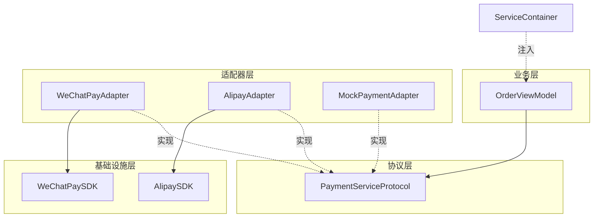

+++
title = "适配器模式"
date = '2026-06-21T22:41:52+08:00'
draft = false
weight = 13
tags = ["设计模式", "面试"]
categories = ["设计模式", "面试"]
+++
## 定义

适配器模式（Adapter Pattern）是一种结构型设计模式，它将一个类的接口转换成客户期望的另一个接口。适配器让原本接口不兼容的类可以合作。

适配器模式的核心思想是：通过一个中间层（适配器）来使不兼容的接口能够一起工作，而无需修改原有代码。

## 为什么需要适配器模式

适配器模式要解决的核心问题是：**让接口不兼容的类能够一起工作，而不需要修改原有代码**。

**问题场景**：假设我们的App原来使用的是自己封装的网络库，现在想要切换到Alamofire，但项目中有大量地方直接使用了旧接口。

```swift
// 旧的网络接口 - 项目中到处都在使用
protocol OldNetworkClient {
    func get(url: String, callback: @escaping (Data?, Error?) -> Void)
    func post(url: String, body: Data?, callback: @escaping (Data?, Error?) -> Void)
}

// 新引入的Alamofire有完全不同的接口
// AF.request(url).response { response in ... }
```

最直接的方式是修改所有调用处：

```swift
// 需要修改项目中所有使用旧接口的地方
// 从：
oldClient.get(url: "https://api.example.com/users") { data, error in ... }

// 改为：
AF.request("https://api.example.com/users").response { response in ... }
```

这种方式有什么问题？

1. **工作量巨大**：需要修改项目中所有使用网络请求的地方
2. **风险高**：大量修改容易引入bug
3. **难以回退**：如果新库有问题，很难切换回旧实现
4. **违反开闭原则**：修改了大量现有代码

**适配器模式的解决思路**：

创建一个适配器，让新库"伪装"成旧接口，现有代码无需修改：

```swift
// 适配器 - 让Alamofire适配旧接口
class AlamofireAdapter: OldNetworkClient {
    func get(url: String, callback: @escaping (Data?, Error?) -> Void) {
        // 内部使用Alamofire，但对外暴露旧接口
        AF.request(url).response { response in
            callback(response.data, response.error)
        }
    }
    
    func post(url: String, body: Data?, callback: @escaping (Data?, Error?) -> Void) {
        AF.request(url, method: .post, parameters: nil, encoding: URLEncoding.default)
            .response { response in
                callback(response.data, response.error)
            }
    }
}

// 现有代码完全不需要修改
let client: OldNetworkClient = AlamofireAdapter()
client.get(url: "https://api.example.com/users") { data, error in
    // 原有的处理逻辑保持不变
}
```

**适配器模式的好处**：
- **无需修改现有代码**：所有使用旧接口的地方都不用改
- **轻松切换实现**：想换回旧库？只需要替换适配器
- **渐进式迁移**：可以逐步将旧代码迁移到新接口
- **隔离变化**：第三方库的变化被隔离在适配器中

**常见使用场景**：
- 集成第三方库时，统一接口风格
- 兼容旧版本API
- 在不同数据格式之间转换（如XML转JSON）
- UIKit与SwiftUI之间的桥接

## 模式结构

适配器模式有两种实现方式：对象适配器和类适配器。

### 对象适配器（组合方式）



### 类适配器（继承方式）



## 角色说明

- **Target（目标接口）**：客户端期望使用的接口
- **Adaptee（被适配者）**：需要被适配的现有接口
- **Adapter（适配器）**：将Adaptee接口转换为Target接口
- **Client（客户端）**：通过Target接口与适配器交互

## 实际应用场景

### 1. 第三方库适配

```swift
// 目标协议 - 统一的网络请求接口
protocol NetworkClient {
    func request(url: URL, method: HTTPMethod, parameters: [String: Any]?, completion: @escaping (Result<Data, Error>) -> Void)
}

enum HTTPMethod: String {
    case get = "GET"
    case post = "POST"
    case put = "PUT"
    case delete = "DELETE"
}

// 被适配者 - Alamofire（第三方库）
// 假设Alamofire有自己的API
class AlamofireWrapper {
    func request(_ urlString: String, method: String, parameters: [String: Any]?, callback: @escaping (Data?, Error?) -> Void) {
        // Alamofire的请求实现
        print("Alamofire request: \(method) \(urlString)")
        callback(Data(), nil)
    }
}

// 适配器 - 将Alamofire适配为统一接口
class AlamofireAdapter: NetworkClient {
    private let alamofire: AlamofireWrapper
    
    init(alamofire: AlamofireWrapper = AlamofireWrapper()) {
        self.alamofire = alamofire
    }
    
    func request(url: URL, method: HTTPMethod, parameters: [String: Any]?, completion: @escaping (Result<Data, Error>) -> Void) {
        alamofire.request(url.absoluteString, method: method.rawValue, parameters: parameters) { data, error in
            if let error = error {
                completion(.failure(error))
            } else if let data = data {
                completion(.success(data))
            }
        }
    }
}

// 被适配者 - URLSession（系统API）
class URLSessionAdapter: NetworkClient {
    func request(url: URL, method: HTTPMethod, parameters: [String: Any]?, completion: @escaping (Result<Data, Error>) -> Void) {
        var request = URLRequest(url: url)
        request.httpMethod = method.rawValue
        
        if let parameters = parameters {
            request.httpBody = try? JSONSerialization.data(withJSONObject: parameters)
        }
        
        URLSession.shared.dataTask(with: request) { data, response, error in
            if let error = error {
                completion(.failure(error))
            } else if let data = data {
                completion(.success(data))
            }
        }.resume()
    }
}

// 使用统一的接口
class APIService {
    private let networkClient: NetworkClient
    
    init(networkClient: NetworkClient) {
        self.networkClient = networkClient
    }
    
    func fetchData(from url: URL) {
        networkClient.request(url: url, method: .get, parameters: nil) { result in
            switch result {
            case .success(let data):
                print("Received data: \(data.count) bytes")
            case .failure(let error):
                print("Error: \(error)")
            }
        }
    }
}

// 可以轻松切换网络库
let alamofireService = APIService(networkClient: AlamofireAdapter())
let urlSessionService = APIService(networkClient: URLSessionAdapter())
```

### 2. 数据模型适配

```swift
// 服务端返回的数据模型
struct ServerUser: Codable {
    let user_id: Int
    let user_name: String
    let email_address: String
    let created_at: String
}

// 客户端期望的数据模型
struct User {
    let id: Int
    let name: String
    let email: String
    let createdAt: Date
}

// 适配器协议
protocol UserAdapter {
    func adapt(_ serverUser: ServerUser) -> User
}

// 具体适配器
class ServerUserAdapter: UserAdapter {
    private let dateFormatter: DateFormatter
    
    init() {
        dateFormatter = DateFormatter()
        dateFormatter.dateFormat = "yyyy-MM-dd'T'HH:mm:ss.SSSZ"
    }
    
    func adapt(_ serverUser: ServerUser) -> User {
        let date = dateFormatter.date(from: serverUser.created_at) ?? Date()
        
        return User(
            id: serverUser.user_id,
            name: serverUser.user_name,
            email: serverUser.email_address,
            createdAt: date
        )
    }
}

// 使用
let serverUser = ServerUser(
    user_id: 1,
    user_name: "John Doe",
    email_address: "john@example.com",
    created_at: "2024-01-15T10:30:00.000Z"
)

let adapter = ServerUserAdapter()
let user = adapter.adapt(serverUser)
print("User: \(user.name), Email: \(user.email)")
```

### 3. UIKit与SwiftUI桥接

```swift
import SwiftUI
import UIKit

// 将UIKit视图适配为SwiftUI视图
struct UIKitViewAdapter<V: UIView>: UIViewRepresentable {
    let makeView: () -> V
    let updateView: ((V) -> Void)?
    
    init(makeView: @escaping () -> V, updateView: ((V) -> Void)? = nil) {
        self.makeView = makeView
        self.updateView = updateView
    }
    
    func makeUIView(context: Context) -> V {
        makeView()
    }
    
    func updateUIView(_ uiView: V, context: Context) {
        updateView?(uiView)
    }
}

// 使用示例 - 在SwiftUI中使用UIKit的ActivityIndicator
struct ActivityIndicator: UIViewRepresentable {
    @Binding var isAnimating: Bool
    let style: UIActivityIndicatorView.Style
    
    func makeUIView(context: Context) -> UIActivityIndicatorView {
        let view = UIActivityIndicatorView(style: style)
        return view
    }
    
    func updateUIView(_ uiView: UIActivityIndicatorView, context: Context) {
        if isAnimating {
            uiView.startAnimating()
        } else {
            uiView.stopAnimating()
        }
    }
}

// 将SwiftUI视图适配为UIKit视图
class SwiftUIViewAdapter<Content: View>: UIView {
    private var hostingController: UIHostingController<Content>?
    
    init(content: Content) {
        super.init(frame: .zero)
        hostingController = UIHostingController(rootView: content)
        
        if let hostView = hostingController?.view {
            addSubview(hostView)
            hostView.translatesAutoresizingMaskIntoConstraints = false
            NSLayoutConstraint.activate([
                hostView.topAnchor.constraint(equalTo: topAnchor),
                hostView.leadingAnchor.constraint(equalTo: leadingAnchor),
                hostView.trailingAnchor.constraint(equalTo: trailingAnchor),
                hostView.bottomAnchor.constraint(equalTo: bottomAnchor)
            ])
        }
    }
    
    required init?(coder: NSCoder) {
        fatalError("init(coder:) has not been implemented")
    }
}
```

### 4. 日志系统适配

```swift
// 目标接口 - 统一的日志接口
protocol Logger {
    func log(_ message: String, level: LogLevel)
}

enum LogLevel {
    case debug, info, warning, error
}

// 被适配者1 - 系统日志
class OSLogWrapper {
    func log(_ message: String, type: Int) {
        print("[OSLog] Type \(type): \(message)")
    }
}

// 被适配者2 - 第三方日志（如Firebase）
class FirebaseLogWrapper {
    func logEvent(_ name: String, parameters: [String: Any]) {
        print("[Firebase] Event: \(name), Params: \(parameters)")
    }
}

// 适配器1 - OSLog适配器
class OSLogAdapter: Logger {
    private let osLog: OSLogWrapper
    
    init(osLog: OSLogWrapper = OSLogWrapper()) {
        self.osLog = osLog
    }
    
    func log(_ message: String, level: LogLevel) {
        let type: Int
        switch level {
        case .debug: type = 0
        case .info: type = 1
        case .warning: type = 2
        case .error: type = 3
        }
        osLog.log(message, type: type)
    }
}

// 适配器2 - Firebase适配器
class FirebaseLogAdapter: Logger {
    private let firebase: FirebaseLogWrapper
    
    init(firebase: FirebaseLogWrapper = FirebaseLogWrapper()) {
        self.firebase = firebase
    }
    
    func log(_ message: String, level: LogLevel) {
        firebase.logEvent("app_log", parameters: [
            "message": message,
            "level": level
        ])
    }
}

// 组合适配器 - 同时输出到多个日志系统
class CompositeLogAdapter: Logger {
    private var loggers: [Logger] = []
    
    func addLogger(_ logger: Logger) {
        loggers.append(logger)
    }
    
    func log(_ message: String, level: LogLevel) {
        loggers.forEach { $0.log(message, level: level) }
    }
}

// 使用
let compositeLogger = CompositeLogAdapter()
compositeLogger.addLogger(OSLogAdapter())
compositeLogger.addLogger(FirebaseLogAdapter())

compositeLogger.log("User logged in", level: .info)
```

### 5. 协议适配

```swift
// 旧协议
protocol OldNetworkDelegate {
    func networkDidReceiveData(_ data: Data)
    func networkDidFail(errorCode: Int, message: String)
}

// 新协议
protocol NewNetworkDelegate: AnyObject {
    func networkDidComplete(with result: Result<Data, NetworkError>)
}

enum NetworkError: Error {
    case unknown
    case serverError(code: Int, message: String)
}

// 适配器 - 将旧协议适配为新协议
class NetworkDelegateAdapter: OldNetworkDelegate {
    weak var newDelegate: NewNetworkDelegate?
    
    init(newDelegate: NewNetworkDelegate) {
        self.newDelegate = newDelegate
    }
    
    func networkDidReceiveData(_ data: Data) {
        newDelegate?.networkDidComplete(with: .success(data))
    }
    
    func networkDidFail(errorCode: Int, message: String) {
        let error = NetworkError.serverError(code: errorCode, message: message)
        newDelegate?.networkDidComplete(with: .failure(error))
    }
}

// 旧的网络类（使用旧协议）
class LegacyNetworkManager {
    var delegate: OldNetworkDelegate?
    
    func fetchData() {
        // 模拟网络请求
        DispatchQueue.main.asyncAfter(deadline: .now() + 1) {
            let data = "Response data".data(using: .utf8)!
            self.delegate?.networkDidReceiveData(data)
        }
    }
}

// 新的ViewController（使用新协议）
class ModernViewController: NewNetworkDelegate {
    private let networkManager = LegacyNetworkManager()
    private var adapter: NetworkDelegateAdapter?
    
    func setup() {
        adapter = NetworkDelegateAdapter(newDelegate: self)
        networkManager.delegate = adapter
    }
    
    func fetchData() {
        networkManager.fetchData()
    }
    
    func networkDidComplete(with result: Result<Data, NetworkError>) {
        switch result {
        case .success(let data):
            print("Success: \(data)")
        case .failure(let error):
            print("Error: \(error)")
        }
    }
}
```

### 6. 基于依赖注入的组件化架构

适配器模式与依赖注入天然契合，两者结合可以构建高度解耦、可测试、可替换的组件化架构。

```swift
// MARK: - 1. 定义协议（Target Interface）

protocol PaymentServiceProtocol {
    func pay(amount: Decimal, orderId: String) async throws -> PaymentResult
}

struct PaymentResult {
    let transactionId: String
    let success: Bool
}

// MARK: - 2. 适配器实现（适配不同SDK）

/// 微信支付适配器
class WeChatPayAdapter: PaymentServiceProtocol {
    private let sdk: WeChatPaySDK
    
    init(sdk: WeChatPaySDK) { self.sdk = sdk }
    
    func pay(amount: Decimal, orderId: String) async throws -> PaymentResult {
        // 转换为微信SDK所需格式
        let response = try await sdk.createPayment(
            totalFee: Int(truncating: amount * 100 as NSDecimalNumber),
            outTradeNo: orderId
        )
        return PaymentResult(transactionId: response.transactionId,
                            success: response.resultCode == "SUCCESS")
    }
}

/// 支付宝适配器
class AlipayAdapter: PaymentServiceProtocol {
    private let sdk: AlipaySDK
    
    init(sdk: AlipaySDK) { self.sdk = sdk }
    
    func pay(amount: Decimal, orderId: String) async throws -> PaymentResult {
        // 转换为支付宝SDK所需格式
        let response = try await sdk.payOrder(amount: amount.description, tradeNo: orderId)
        return PaymentResult(transactionId: response.tradeNo,
                            success: response.resultStatus == "9000")
    }
}

/// Mock适配器（用于测试）
class MockPaymentAdapter: PaymentServiceProtocol {
    var result: PaymentResult = PaymentResult(transactionId: "mock", success: true)
    
    func pay(amount: Decimal, orderId: String) async throws -> PaymentResult {
        return result
    }
}

// MARK: - 3. 依赖注入容器

final class ServiceContainer {
    static let shared = ServiceContainer()
    private var services: [String: Any] = [:]
    
    func register<T>(_ type: T.Type, instance: T) {
        services[String(describing: type)] = instance
    }
    
    func resolve<T>(_ type: T.Type) -> T {
        services[String(describing: type)] as! T
    }
}

// MARK: - 4. 配置依赖

class AppConfigurator {
    static func setup() {
        let container = ServiceContainer.shared
        
        // 生产环境：根据配置选择支付方式
        if AppConfig.useWeChatPay {
            container.register(PaymentServiceProtocol.self, 
                             instance: WeChatPayAdapter(sdk: WeChatPaySDK()))
        } else {
            container.register(PaymentServiceProtocol.self, 
                             instance: AlipayAdapter(sdk: AlipaySDK()))
        }
    }
    
    static func setupForTesting() {
        // 测试环境：注入Mock
        ServiceContainer.shared.register(PaymentServiceProtocol.self, 
                                        instance: MockPaymentAdapter())
    }
}

// MARK: - 5. 业务层使用（面向协议）

class OrderViewModel {
    private let paymentService: PaymentServiceProtocol
    
    // 构造器注入（便于测试）
    init(paymentService: PaymentServiceProtocol) {
        self.paymentService = paymentService
    }
    
    // 便捷初始化（从容器解析）
    convenience init() {
        self.init(paymentService: ServiceContainer.shared.resolve(PaymentServiceProtocol.self))
    }
    
    func checkout(amount: Decimal, orderId: String) async throws {
        let result = try await paymentService.pay(amount: amount, orderId: orderId)
        print("支付\(result.success ? "成功" : "失败")")
    }
}
```

#### 架构关系图



#### 核心优势

| 优势 | 说明 |
|------|------|
| 模块解耦 | 业务层只依赖协议，不依赖具体实现 |
| 可替换性 | 切换SDK只需更换适配器，业务代码无需修改 |
| 可测试性 | 单元测试时注入Mock适配器 |
| 渐进式迁移 | 可逐步替换底层实现，风险可控 |

## iOS系统中的适配器模式

### 1. NSArray与Swift Array

```swift
// Foundation的NSArray可以桥接到Swift的Array
let nsArray: NSArray = ["a", "b", "c"]
let swiftArray = nsArray as? [String] ?? []

// 反向桥接
let swiftArray2 = ["1", "2", "3"]
let nsArray2 = swiftArray2 as NSArray
```

### 2. 协议扩展适配

```swift
// Swift的Sequence协议为集合类型提供了统一接口
extension Array: Sequence { }
extension Set: Sequence { }
extension Dictionary: Sequence { }

// 自定义类型也可以通过实现Sequence协议来适配
struct CountdownSequence: Sequence, IteratorProtocol {
    var count: Int
    
    mutating func next() -> Int? {
        guard count > 0 else { return nil }
        defer { count -= 1 }
        return count
    }
}

// 使用
for i in CountdownSequence(count: 5) {
    print(i)  // 5, 4, 3, 2, 1
}
```

## 对象适配器 vs 类适配器

| 特性 | 对象适配器 | 类适配器 |
|------|-----------|----------|
| 实现方式 | 组合 | 继承 |
| 灵活性 | 高（可适配子类） | 低（只能适配特定类） |
| 代码复用 | 不能访问私有成员 | 可以访问protected成员 |
| Swift支持 | 完全支持 | 通过协议扩展部分支持 |
| 推荐程度 | 推荐 | 有限场景使用 |

## 使用场景

1. **集成第三方库**：将第三方库的API适配为项目统一的接口
2. **兼容旧代码**：在不修改旧代码的情况下，使其与新系统兼容
3. **统一接口**：为多个不同接口的类提供统一的操作方式
4. **数据格式转换**：在不同数据格式之间进行转换
5. **跨平台开发**：适配不同平台的差异
6. **组件化架构**：通过协议定义组件边界，配合依赖注入实现模块解耦
7. **单元测试**：通过注入Mock适配器实现业务逻辑的隔离测试

## 优缺点

### 优点

1. **单一职责原则**：将接口转换逻辑与业务逻辑分离
2. **开闭原则**：可以引入新适配器而不修改现有代码
3. **复用现有类**：无需修改现有类即可复用
4. **解耦**：客户端代码与具体实现解耦

### 缺点

1. **增加复杂度**：引入额外的适配器类
2. **可能需要多层适配**：复杂场景可能需要多个适配器

## 最佳实践

1. **优先使用对象适配器**：组合比继承更灵活
2. **保持适配器简单**：适配器只做接口转换，不包含业务逻辑
3. **考虑使用协议**：定义清晰的目标接口
4. **文档记录**：说明适配器的用途和被适配的类

## 面试常见问题

### Q1: 适配器模式和装饰器模式的区别？

**答**：适配器模式改变对象的接口，使不兼容的接口能够一起工作；装饰器模式在不改变接口的情况下增强对象的功能。适配器通常用于让现有类与其他类一起工作，装饰器用于动态添加职责。

### Q2: 什么时候应该使用适配器模式？

**答**：当需要使用现有类但其接口不符合需求时；当需要创建可复用的类与不相关或不可预见的类协作时；当需要使用多个现有子类但不方便通过子类化来适配它们的接口时。

### Q3: 对象适配器和类适配器如何选择？

**答**：优先选择对象适配器，因为它使用组合，更加灵活，可以适配被适配类的所有子类。类适配器需要多重继承（Swift不支持），但可以重写被适配者的方法。

### Q4: 在组件化架构中，适配器模式解决了什么问题？

**答**：在组件化架构中，适配器模式主要解决以下问题：
1. **统一异构服务接口**：不同第三方SDK（如微信支付、支付宝）有不同的API，适配器将它们统一为项目内的标准协议
2. **隔离变化**：第三方SDK升级时，只需修改对应适配器，业务代码不受影响
3. **支持多实现并存**：同一协议可以有多个适配器实现，运行时动态选择
4. **提升可测试性**：业务逻辑可以通过Mock适配器进行单元测试，无需依赖真实服务
