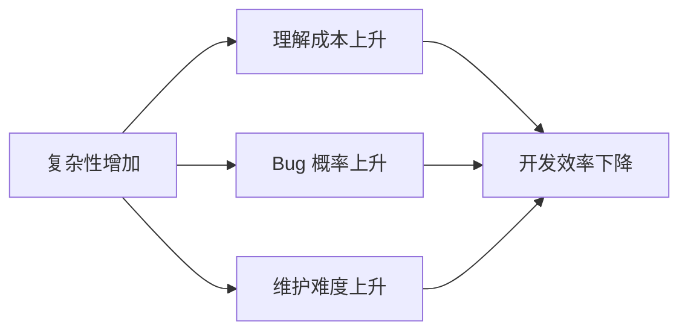
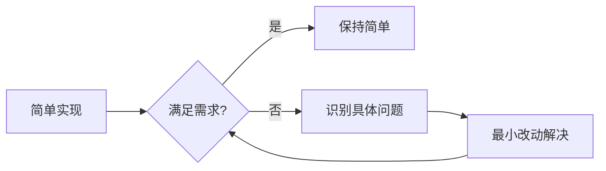

+++
title = "KISS原则"
date = '2026-05-02T22:32:27+08:00'
draft = false
weight = 2
tags = ["设计原则", "面试"]
categories = ["设计原则", "面试"]
+++
## 什么是KISS原则？

KISS（Keep It Simple, Stupid）原则是软件工程中最重要的设计原则之一。它的核心理念是：**简单的解决方案比复杂的解决方案更好**。

## 核心思想

### 简单不等于简陋

KISS 原则强调的"简单"是指：
- **易于理解**：代码的意图一目了然
- **易于修改**：改动时不会牵一发而动全身
- **易于调试**：出问题时容易定位原因
- **易于测试**：测试用例简单直接

简单不意味着功能缺失或代码草率，而是用最直接的方式解决问题。

### 复杂性的代价

不必要的复杂性会带来：
- **更高的学习成本**：新成员需要更长时间理解代码
- **更多的 bug**：复杂逻辑更容易出错
- **更难维护**：修改一处可能影响多处
- **更慢的开发速度**：需要考虑更多的边界情况



## iOS开发中的KISS实践

### 1. 选择简单的架构

```swift
// 过度设计：小项目使用复杂的 VIPER 架构
// 每个模块都有 View, Interactor, Presenter, Entity, Router
// 一个简单的列表页面需要创建 5+ 个文件

// KISS：根据项目规模选择合适的架构
// 小项目：MVC 就足够了
class UserListViewController: UIViewController {
    private var users: [User] = []
    
    override func viewDidLoad() {
        super.viewDidLoad()
        loadUsers()
    }
    
    private func loadUsers() {
        Task {
            users = try await UserService.shared.fetchUsers()
            tableView.reloadData()
        }
    }
}

// 随着项目增长，再逐步引入更复杂的架构
```

### 2. 避免过早优化

```swift
// 违反 KISS：过早引入复杂的缓存机制
class ImageLoaderOverEngineered {
    private let memoryCache = NSCache<NSString, UIImage>()
    private let diskCache: DiskCache
    private let networkQueue = DispatchQueue(label: "imageLoader", attributes: .concurrent)
    private let cacheQueue = DispatchQueue(label: "cacheQueue")
    private var pendingRequests: [URL: [(UIImage?) -> Void]] = [:]
    private let requestLock = NSLock()
    
    func loadImage(from url: URL, completion: @escaping (UIImage?) -> Void) {
        // 复杂的多级缓存、请求合并、线程同步逻辑...
        // 对于大多数 App 来说，这可能是过度设计
    }
}

// KISS：从简单开始
class SimpleImageLoader {
    private let cache = NSCache<NSString, UIImage>()
    
    func loadImage(from url: URL) async -> UIImage? {
        let key = url.absoluteString as NSString
        
        // 先检查缓存
        if let cached = cache.object(forKey: key) {
            return cached
        }
        
        // 从网络加载
        guard let (data, _) = try? await URLSession.shared.data(from: url),
              let image = UIImage(data: data) else {
            return nil
        }
        
        // 存入缓存
        cache.setObject(image, forKey: key)
        return image
    }
}

// 当真正遇到性能问题时，再逐步优化
```

### 3. 简化条件逻辑

```swift
// 违反 KISS：复杂的嵌套条件
func processOrder(_ order: Order) -> Result<Receipt, OrderError> {
    if order.items.count > 0 {
        if order.customer != nil {
            if order.customer!.isVerified {
                if order.paymentMethod != nil {
                    if order.shippingAddress != nil {
                        if order.totalAmount > 0 {
                            // 终于可以处理订单了...
                            return .success(Receipt())
                        } else {
                            return .failure(.invalidAmount)
                        }
                    } else {
                        return .failure(.noShippingAddress)
                    }
                } else {
                    return .failure(.noPaymentMethod)
                }
            } else {
                return .failure(.unverifiedCustomer)
            }
        } else {
            return .failure(.noCustomer)
        }
    } else {
        return .failure(.emptyOrder)
    }
}

// KISS：使用 Guard 早期返回
func processOrderSimple(_ order: Order) -> Result<Receipt, OrderError> {
    guard !order.items.isEmpty else {
        return .failure(.emptyOrder)
    }
    
    guard let customer = order.customer else {
        return .failure(.noCustomer)
    }
    
    guard customer.isVerified else {
        return .failure(.unverifiedCustomer)
    }
    
    guard order.paymentMethod != nil else {
        return .failure(.noPaymentMethod)
    }
    
    guard order.shippingAddress != nil else {
        return .failure(.noShippingAddress)
    }
    
    guard order.totalAmount > 0 else {
        return .failure(.invalidAmount)
    }
    
    return .success(Receipt())
}
```

### 4. 使用标准库而非自己实现

```swift
// 违反 KISS：自己实现数组去重
func removeDuplicatesManual<T: Hashable>(from array: [T]) -> [T] {
    var seen = Set<T>()
    var result = [T]()
    for element in array {
        if !seen.contains(element) {
            seen.insert(element)
            result.append(element)
        }
    }
    return result
}

// KISS：使用标准库
let uniqueArray = Array(Set(array))

// 或保持顺序
let uniqueOrderedArray = array.reduce(into: [T]()) { result, element in
    if !result.contains(element) {
        result.append(element)
    }
}

// 更简单：使用 Swift Algorithms
import Algorithms
let unique = array.uniqued()
```

### 5. 避免过度泛型化

```swift
// 违反 KISS：过度泛型，难以理解
protocol DataProviding {
    associatedtype DataType
    associatedtype ErrorType: Error
    func fetch() async throws -> DataType
}

protocol DataTransforming {
    associatedtype Input
    associatedtype Output
    func transform(_ input: Input) -> Output
}

class GenericDataLoader<
    Provider: DataProviding,
    Transformer: DataTransforming
> where Provider.DataType == Transformer.Input {
    // 复杂的泛型约束...
}

// KISS：简单直接的实现
class UserLoader {
    func loadUsers() async throws -> [User] {
        let data = try await APIClient.shared.fetch("/users")
        return try JSONDecoder().decode([User].self, from: data)
    }
}

// 当真正需要复用时，再考虑抽象
```

### 6. 简化 API 设计

```swift
// 违反 KISS：过多的配置选项
func createButton(
    title: String,
    titleColor: UIColor = .white,
    titleFont: UIFont = .systemFont(ofSize: 16),
    backgroundColor: UIColor = .blue,
    cornerRadius: CGFloat = 8,
    borderWidth: CGFloat = 0,
    borderColor: UIColor = .clear,
    shadowColor: UIColor = .black,
    shadowOffset: CGSize = .zero,
    shadowRadius: CGFloat = 0,
    shadowOpacity: Float = 0,
    contentInsets: UIEdgeInsets = .init(top: 12, left: 24, bottom: 12, right: 24),
    isEnabled: Bool = true,
    // ... 更多参数
) -> UIButton {
    // ...
}

// KISS：提供简单的默认实现和预设样式
enum ButtonStyle {
    case primary
    case secondary
    case destructive
    case text
}

func createButton(title: String, style: ButtonStyle = .primary) -> UIButton {
    let button = UIButton()
    button.setTitle(title, for: .normal)
    
    switch style {
    case .primary:
        button.backgroundColor = .systemBlue
        button.setTitleColor(.white, for: .normal)
        button.layer.cornerRadius = 8
    case .secondary:
        button.backgroundColor = .systemGray5
        button.setTitleColor(.systemBlue, for: .normal)
        button.layer.cornerRadius = 8
    case .destructive:
        button.backgroundColor = .systemRed
        button.setTitleColor(.white, for: .normal)
        button.layer.cornerRadius = 8
    case .text:
        button.backgroundColor = .clear
        button.setTitleColor(.systemBlue, for: .normal)
    }
    
    return button
}

// 使用简单
let primaryButton = createButton(title: "Submit")
let cancelButton = createButton(title: "Cancel", style: .secondary)
```

### 7. 选择合适的数据结构

```swift
// 违反 KISS：用复杂的数据结构解决简单问题
class UserStatusManager {
    private var statusTree: RedBlackTree<String, UserStatus>
    private var statusIndex: [String: TreeNode<String, UserStatus>]
    // 复杂的树结构来管理用户状态...
}

// KISS：简单的字典就够了
class SimpleUserStatusManager {
    private var userStatus: [String: UserStatus] = [:]
    
    func setStatus(_ status: UserStatus, for userId: String) {
        userStatus[userId] = status
    }
    
    func getStatus(for userId: String) -> UserStatus? {
        return userStatus[userId]
    }
}
```

## 如何平衡简单与功能

### 渐进式复杂度

遵循"简单开始，按需增长"的原则：



```swift
// 阶段1：最简实现
class UserService {
    func getUser(id: String) async throws -> User {
        let url = URL(string: "https://api.example.com/users/\(id)")!
        let (data, _) = try await URLSession.shared.data(from: url)
        return try JSONDecoder().decode(User.self, from: data)
    }
}

// 阶段2：发现需要缓存，添加简单缓存
class UserService {
    private var cache: [String: User] = [:]
    
    func getUser(id: String) async throws -> User {
        if let cached = cache[id] {
            return cached
        }
        
        let url = URL(string: "https://api.example.com/users/\(id)")!
        let (data, _) = try await URLSession.shared.data(from: url)
        let user = try JSONDecoder().decode(User.self, from: data)
        cache[id] = user
        return user
    }
}

// 阶段3：发现需要缓存过期，添加过期机制
class UserService {
    private var cache: [String: (user: User, timestamp: Date)] = [:]
    private let cacheExpiration: TimeInterval = 300  // 5分钟
    
    func getUser(id: String) async throws -> User {
        if let cached = cache[id],
           Date().timeIntervalSince(cached.timestamp) < cacheExpiration {
            return cached.user
        }
        
        // 网络请求...
    }
}

// 只有当缓存逻辑变得复杂到需要复用时，才考虑抽取成独立模块
```

### KISS 检查清单

在编写代码时，问自己：

1. **能否用更少的代码实现？**
   - 删除不必要的抽象层
   - 使用标准库已有的功能

2. **新团队成员能在5分钟内理解这段代码吗？**
   - 如果需要大量解释，可能太复杂了

3. **有没有使用"可能会用到"的功能？**
   - 删除未使用的参数和配置
   - 遵循 YAGNI 原则

4. **测试这段代码需要多少 Mock？**
   - 需要大量 Mock 可能意味着耦合过重

5. **这个抽象解决了当前的问题吗？**
   - 还是为了"将来可能的需求"？

### KISS 与其他原则的平衡

**KISS vs DRY**
```swift
// 有时简单的重复比复杂的抽象更好
// 两处简单的相似代码
func formatUserName(_ user: User) -> String {
    return "\(user.firstName) \(user.lastName)"
}

func formatOrderCustomerName(_ order: Order) -> String {
    return "\(order.customerFirstName) \(order.customerLastName)"
}

// 不要为了 DRY 而强行抽象
// 如果它们将来可能独立演化，保持分开更简单
```

**KISS vs 可扩展性**
```swift
// 不要为了"可能的扩展"而增加复杂度
// 违反 KISS
protocol MessageSender {
    func send(_ message: String) async throws
}

class EmailSender: MessageSender { /* ... */ }
class SMSSender: MessageSender { /* ... */ }
class PushSender: MessageSender { /* ... */ }

class NotificationService {
    private let senders: [MessageSender]
    // 复杂的配置和调度逻辑...
}

// KISS：如果现在只需要邮件通知
class NotificationService {
    func sendEmail(to address: String, message: String) async throws {
        // 直接发送邮件
    }
}
// 当真正需要多渠道时再重构
```

## 何时可以接受复杂性

KISS 不是教条，以下情况可以接受一定的复杂性：

1. **性能关键路径**：经过测量确认需要优化的代码
2. **安全相关代码**：加密、认证等需要严谨处理
3. **核心业务逻辑**：复杂的业务规则本身就是复杂的
4. **框架/库代码**：供他人使用的代码需要更多的抽象

关键是：复杂性应该是**有意识的选择**，而非无意识的堆积。
