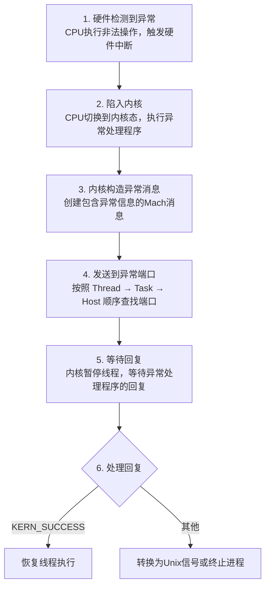

+++
title = "崩溃-Mach异常"
date = '2026-05-03T23:11:47+08:00'
draft = false
weight = 18
tags = ["iOS", "性能优化", "稳定性", "崩溃"]
categories = ["iOS开发", "性能优化", "稳定性"]
+++
本文深入介绍Mach异常的底层实现细节，包括端口操作、消息机制以及如何实现自定义的Mach异常处理器。

> 关于Mach异常的基础概念（Task、Thread、Port、Message）和异常端口的查找顺序，请参考 [崩溃-原理]()。

---

## Mach端口详解

### 端口权限

```plaintext
端口权限类型：

┌─────────────────────────────────────────────────────────────┐
│                      端口权限                                │
├─────────────────────────────────────────────────────────────┤
│                                                             │
│  MACH_PORT_RIGHT_SEND                                       │
│  ├── 发送权限                                                │
│  ├── 可以向端口发送消息                                        │
│  └── 可以复制给其他任务                                        │
│                                                             │
│  MACH_PORT_RIGHT_RECEIVE                                    │
│  ├── 接收权限                                                │
│  ├── 可以从端口接收消息                                        │
│  ├── 只能有一个持有者                                          │
│  └── 持有者销毁时端口销毁                                      │
│                                                             │
│  MACH_PORT_RIGHT_SEND_ONCE                                  │
│  ├── 一次性发送权限                                           │
│  └── 发送一次后自动失效                                        │
│                                                             │
│  MACH_PORT_RIGHT_PORT_SET                                   │
│  ├── 端口集合权限                                             │
│  └── 可以同时监听多个端口                                      │
│                                                             │
│  MACH_PORT_RIGHT_DEAD_NAME                                  │
│  ├── 死名权限                                                │
│  └── 端口已销毁但名字仍存在                                     │
│                                                             │
└─────────────────────────────────────────────────────────────┘
```

### 端口操作

```c
#include <mach/mach.h>

// 分配新端口
mach_port_t port;
kern_return_t kr = mach_port_allocate(
    mach_task_self(),           // 当前任务
    MACH_PORT_RIGHT_RECEIVE,    // 接收权限
    &port                       // 输出端口名
);

// 添加发送权限
kr = mach_port_insert_right(
    mach_task_self(),
    port,
    port,
    MACH_MSG_TYPE_MAKE_SEND     // 创建发送权限
);

// 销毁端口
kr = mach_port_destroy(mach_task_self(), port);

// 释放端口权限
kr = mach_port_deallocate(mach_task_self(), port);
```

---

## Mach消息

### 消息结构

```c
// 消息头部
typedef struct {
    mach_msg_bits_t       msgh_bits;        // 消息类型和权限
    mach_msg_size_t       msgh_size;        // 消息大小
    mach_port_t           msgh_remote_port; // 目标端口
    mach_port_t           msgh_local_port;  // 本地端口（用于回复）
    mach_port_name_t      msgh_voucher_port;// 凭证端口
    mach_msg_id_t         msgh_id;          // 消息ID
} mach_msg_header_t;

// 完整消息示例
typedef struct {
    mach_msg_header_t header;
    // 可选的消息体
    mach_msg_body_t body;
    // 可选的端口描述符
    mach_msg_port_descriptor_t port;
    // 可选的数据
    char data[256];
} MyMessage;
```

### 消息发送与接收

```c
// 发送消息
kern_return_t send_message(mach_port_t port, const char *data, size_t len) {
    struct {
        mach_msg_header_t header;
        char data[256];
    } message;
    
    message.header.msgh_bits = MACH_MSGH_BITS(MACH_MSG_TYPE_COPY_SEND, 0);
    message.header.msgh_size = sizeof(message);
    message.header.msgh_remote_port = port;
    message.header.msgh_local_port = MACH_PORT_NULL;
    message.header.msgh_id = 0;
    
    size_t copy_len = len < sizeof(message.data) ? len : sizeof(message.data);
    memcpy(message.data, data, copy_len);
    
    return mach_msg(
        &message.header,
        MACH_SEND_MSG,              // 发送
        sizeof(message),            // 发送大小
        0,                          // 接收大小
        MACH_PORT_NULL,            // 接收端口
        MACH_MSG_TIMEOUT_NONE,     // 超时
        MACH_PORT_NULL             // 通知端口
    );
}

// 接收消息
kern_return_t receive_message(mach_port_t port) {
    struct {
        mach_msg_header_t header;
        char data[256];
    } message;
    
    kern_return_t kr = mach_msg(
        &message.header,
        MACH_RCV_MSG,              // 接收
        0,                          // 发送大小
        sizeof(message),            // 接收大小
        port,                       // 接收端口
        MACH_MSG_TIMEOUT_NONE,     // 超时
        MACH_PORT_NULL             // 通知端口
    );
    
    if (kr == MACH_MSG_SUCCESS) {
        // 处理消息
        printf("Received: %s\n", message.data);
    }
    
    return kr;
}
```

---

## 异常端口操作

### 设置异常端口

```c
#include <mach/mach.h>

// 设置任务级异常端口
kern_return_t setup_task_exception_port(mach_port_t exception_port) {
    // 异常类型掩码
    exception_mask_t mask = 
        EXC_MASK_BAD_ACCESS |
        EXC_MASK_BAD_INSTRUCTION |
        EXC_MASK_ARITHMETIC |
        EXC_MASK_BREAKPOINT |
        EXC_MASK_SOFTWARE;
    
    return task_set_exception_ports(
        mach_task_self(),
        mask,
        exception_port,
        EXCEPTION_DEFAULT | MACH_EXCEPTION_CODES,
        THREAD_STATE_NONE
    );
}

// 获取当前异常端口
kern_return_t get_exception_ports(void) {
    exception_mask_t masks[EXC_TYPES_COUNT];
    mach_msg_type_number_t count = EXC_TYPES_COUNT;
    mach_port_t ports[EXC_TYPES_COUNT];
    exception_behavior_t behaviors[EXC_TYPES_COUNT];
    thread_state_flavor_t flavors[EXC_TYPES_COUNT];
    
    return task_get_exception_ports(
        mach_task_self(),
        EXC_MASK_ALL,
        masks,
        &count,
        ports,
        behaviors,
        flavors
    );
}
```

---

## 异常处理流程

### 完整的异常处理流程



### 异常消息格式

```c
// 异常消息结构
typedef struct {
    mach_msg_header_t Head;
    
    // 消息体
    mach_msg_body_t msgh_body;
    mach_msg_port_descriptor_t thread;      // 发生异常的线程
    mach_msg_port_descriptor_t task;        // 发生异常的任务
    
    // 异常信息
    NDR_record_t NDR;
    exception_type_t exception;              // 异常类型
    mach_msg_type_number_t codeCnt;         // 代码数量
    int64_t code[2];                         // 异常代码
} __Request__mach_exception_raise_t;

// 异常回复消息
typedef struct {
    mach_msg_header_t Head;
    NDR_record_t NDR;
    kern_return_t RetCode;                   // 返回码
} __Reply__mach_exception_raise_t;
```

---

## 实现Mach异常处理器

### 完整示例

```c
#include <mach/mach.h>
#include <pthread.h>

// 异常处理线程
static pthread_t exception_thread;
static mach_port_t exception_port;

// 保存原始异常端口
static mach_port_t original_exception_port;
static exception_behavior_t original_behavior;
static thread_state_flavor_t original_flavor;

// 异常处理函数
static kern_return_t handle_exception(
    mach_port_t exception_port,
    mach_port_t thread,
    mach_port_t task,
    exception_type_t exception,
    mach_exception_data_t code,
    mach_msg_type_number_t code_count
) {
    // 获取线程状态（ARM64架构）
    // 注意：如需支持x86_64模拟器，需要使用x86_thread_state64_t和X86_THREAD_STATE64
#if defined(__arm64__)
    arm_thread_state64_t state;
    mach_msg_type_number_t state_count = ARM_THREAD_STATE64_COUNT;
    
    thread_get_state(thread, ARM_THREAD_STATE64, 
                     (thread_state_t)&state, &state_count);
    
    // 记录崩溃信息
    printf("Exception: %d\n", exception);
    printf("Code: 0x%llx, 0x%llx\n", code[0], code[1]);
    printf("PC: 0x%llx\n", (unsigned long long)state.__pc);
    printf("LR: 0x%llx\n", (unsigned long long)state.__lr);
#endif
    
    // 采集堆栈（需要自行实现）
    // collect_backtrace(thread);
    
    // 保存崩溃日志（需要自行实现）
    // save_crash_log();
    
    // 返回失败，让系统继续处理（转换为信号）
    return KERN_FAILURE;
}

// 异常处理线程主函数
static void *exception_handler_thread(void *arg) {
    kern_return_t kr;
    
    while (1) {
        // 接收异常消息
        struct {
            mach_msg_header_t head;
            mach_msg_body_t body;
            mach_msg_port_descriptor_t thread;
            mach_msg_port_descriptor_t task;
            NDR_record_t NDR;
            exception_type_t exception;
            mach_msg_type_number_t code_count;
            int64_t code[2];
            int flavor;
            mach_msg_type_number_t state_count;
            natural_t state[224];
        } request;
        
        struct {
            mach_msg_header_t head;
            NDR_record_t NDR;
            kern_return_t ret_code;
        } reply;
        
        // 接收消息
        kr = mach_msg(
            &request.head,
            MACH_RCV_MSG | MACH_RCV_LARGE,
            0,
            sizeof(request),
            exception_port,
            MACH_MSG_TIMEOUT_NONE,
            MACH_PORT_NULL
        );
        
        if (kr != MACH_MSG_SUCCESS) {
            continue;
        }
        
        // 处理异常
        kr = handle_exception(
            exception_port,
            request.thread.name,
            request.task.name,
            request.exception,
            request.code,
            request.code_count
        );
        
        // 发送回复
        reply.head.msgh_bits = MACH_MSGH_BITS(MACH_MSG_TYPE_MOVE_SEND_ONCE, 0);
        reply.head.msgh_size = sizeof(reply);
        reply.head.msgh_remote_port = request.head.msgh_remote_port;
        reply.head.msgh_local_port = MACH_PORT_NULL;
        // Mach IPC惯例：回复消息ID = 请求消息ID + 100
        reply.head.msgh_id = request.head.msgh_id + 100;
        reply.NDR = NDR_record;
        reply.ret_code = kr;
        
        mach_msg(
            &reply.head,
            MACH_SEND_MSG,
            sizeof(reply),
            0,
            MACH_PORT_NULL,
            MACH_MSG_TIMEOUT_NONE,
            MACH_PORT_NULL
        );
    }
    
    return NULL;
}

// 安装异常处理器
kern_return_t install_exception_handler(void) {
    kern_return_t kr;
    
    // 创建异常端口
    kr = mach_port_allocate(
        mach_task_self(),
        MACH_PORT_RIGHT_RECEIVE,
        &exception_port
    );
    if (kr != KERN_SUCCESS) return kr;
    
    // 添加发送权限
    kr = mach_port_insert_right(
        mach_task_self(),
        exception_port,
        exception_port,
        MACH_MSG_TYPE_MAKE_SEND
    );
    if (kr != KERN_SUCCESS) return kr;
    
    // 保存原始异常端口
    exception_mask_t mask = EXC_MASK_BAD_ACCESS | 
                           EXC_MASK_BAD_INSTRUCTION |
                           EXC_MASK_ARITHMETIC |
                           EXC_MASK_BREAKPOINT;
    
    // 用于接收查询结果的数组
    exception_mask_t masks_out[EXC_TYPES_COUNT];
    mach_port_t ports_out[EXC_TYPES_COUNT];
    exception_behavior_t behaviors_out[EXC_TYPES_COUNT];
    thread_state_flavor_t flavors_out[EXC_TYPES_COUNT];
    mach_msg_type_number_t count = EXC_TYPES_COUNT;
    
    kr = task_get_exception_ports(
        mach_task_self(),
        mask,                    // 输入：要查询的异常类型掩码
        masks_out,               // 输出：实际的掩码数组
        &count,                  // 输入输出：数组大小
        ports_out,               // 输出：端口数组
        behaviors_out,           // 输出：行为数组
        flavors_out              // 输出：flavor数组
    );
    
    // 保存第一个有效的原始端口（简化处理）
    if (count > 0) {
        original_exception_port = ports_out[0];
        original_behavior = behaviors_out[0];
        original_flavor = flavors_out[0];
    }
    
    // 设置新的异常端口
    kr = task_set_exception_ports(
        mach_task_self(),
        mask,
        exception_port,
        EXCEPTION_DEFAULT | MACH_EXCEPTION_CODES,
        THREAD_STATE_NONE
    );
    if (kr != KERN_SUCCESS) return kr;
    
    // 创建异常处理线程
    pthread_create(&exception_thread, NULL, 
                   exception_handler_thread, NULL);
    
    return KERN_SUCCESS;
}
```

---

## 调试器检测

调试器（如LLDB）通过在Task（任务/进程）级别注册异常端口来优先拦截异常。了解这一机制有助于理解为什么调试时某些崩溃行为会有所不同。

### 检测调试器

```c
#include <sys/sysctl.h>
#include <unistd.h>

// 检测是否被调试
bool is_debugger_attached(void) {
    int mib[4];
    struct kinfo_proc info;
    size_t size = sizeof(info);
    
    mib[0] = CTL_KERN;
    mib[1] = KERN_PROC;
    mib[2] = KERN_PROC_PID;
    mib[3] = getpid();
    
    info.kp_proc.p_flag = 0;
    
    if (sysctl(mib, 4, &info, &size, NULL, 0) == -1) {
        return false;
    }
    
    return (info.kp_proc.p_flag & P_TRACED) != 0;
}
```

---

## Mach异常与崩溃采集

### 采集时机

```plaintext
Mach异常采集的优势：

1. 最早的捕获时机
   └── 在转换为Unix信号之前就能捕获

2. 更完整的信息
   ├── 可以获取原始异常类型
   ├── 可以获取完整的线程状态
   └── 可以获取所有线程的信息

3. 更可靠的处理
   ├── 在独立线程中处理
   ├── 不受信号处理限制
   └── 可以使用更多API

注意事项：
- 需要处理与其他异常处理器的冲突
- 调试器优先接收异常
- 某些异常可能不会发送到用户态
```

### 与Signal Handler的配合

```c
// 推荐的崩溃采集架构
void setup_crash_handlers(void) {
    // 1. 安装Mach异常处理器（优先）
    install_mach_exception_handler();
    
    // 2. 安装Signal Handler（备份）
    install_signal_handlers();
    
    // 3. 安装NSException Handler
    NSSetUncaughtExceptionHandler(&exception_handler);
}

// Mach异常处理器
kern_return_t mach_exception_handler(...) {
    // 采集崩溃信息
    collect_crash_info();
    
    // 返回失败，让异常继续传递
    // 这样Signal Handler也能捕获到
    return KERN_FAILURE;
}

// Signal Handler
void signal_handler(int sig, siginfo_t *info, void *context) {
    // 检查是否已经被Mach异常处理器处理
    if (already_handled) {
        // 直接退出
        return;
    }
    
    // 采集崩溃信息（备份）
    collect_crash_info();
}
```

---

## 常见问题与解决方案

### 异常处理器冲突

```plaintext
问题：多个SDK都注册了Mach异常处理器

解决方案：
1. 保存原始异常端口
2. 处理完后转发给原始端口
3. 或者返回KERN_FAILURE让系统继续处理
```

### 死锁问题

```plaintext
问题：异常处理时发生死锁

原因：
- 异常线程持有锁
- 处理器尝试获取同一把锁

解决方案：
1. 异常处理器中只使用异步安全的操作
2. 使用独立的数据结构存储崩溃信息
3. 避免在异常处理器中调用可能加锁的API
```

### 递归异常

```plaintext
问题：异常处理器中又发生异常

解决方案：
1. 使用标志位防止重入
2. 异常处理器中的代码要尽量简单
3. 使用预分配的内存
4. 避免复杂的对象操作
```
