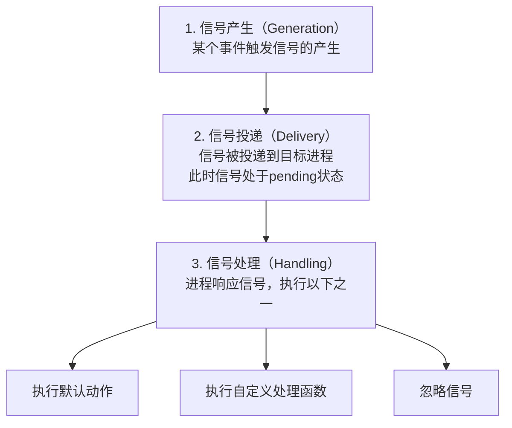
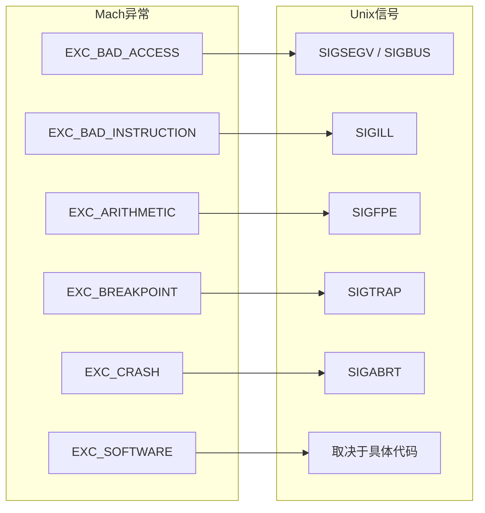

+++
title = "崩溃-信号处理"
date = '2026-05-02T22:32:27+08:00'
draft = false
weight = 19
tags = ["iOS", "性能优化", "稳定性", "崩溃"]
categories = ["iOS开发", "性能优化", "稳定性"]
+++
Unix信号是进程间通信和异常通知的重要机制。本文详细介绍Unix信号的基础知识、常见崩溃信号以及Signal Handler的正确实现方式。

---

## Unix信号基础

### 什么是信号

```plaintext
信号的本质：

┌─────────────────────────────────────────────────────────────┐
│                      Unix信号                                │
├─────────────────────────────────────────────────────────────┤
│                                                             │
│  信号是一种软件中断机制：                                       │
│  • 用于通知进程发生了某个事件                                   │
│  • 可以由内核、其他进程或进程自身发送                            │
│  • 进程可以选择处理、忽略或使用默认行为                           │
│                                                             │
│  信号的来源：                                                 │
│  • 硬件异常（如除零、非法内存访问）                              │
│  • 用户输入（如Ctrl+C）                                       │
│  • 系统调用（如kill）                                         │
│  • 软件条件（如定时器到期）                                     │
│                                                             │
└─────────────────────────────────────────────────────────────┘
```

### 信号的生命周期



---

## 常见信号类型

### 崩溃相关信号

| 信号 | 编号(macOS/iOS) | 默认动作 | 说明 |
|-----|-----|---------|------|
| SIGABRT | 6 | 终止+core | 调用abort()产生 |
| SIGBUS | 10 | 终止+core | 总线错误 |
| SIGFPE | 8 | 终止+core | 算术异常 |
| SIGILL | 4 | 终止+core | 非法指令 |
| SIGSEGV | 11 | 终止+core | 段错误 |
| SIGTRAP | 5 | 终止+core | 断点陷阱 |
| SIGSYS | 12 | 终止+core | 非法系统调用 |

### 其他重要信号

| 信号 | 编号 | 默认动作 | 说明 |
|-----|-----|---------|------|
| SIGKILL | 9 | 终止 | 强制终止（不可捕获） |
| SIGTERM | 15 | 终止 | 请求终止 |
| SIGINT | 2 | 终止 | 中断（Ctrl+C） |
| SIGQUIT | 3 | 终止+core | 退出（Ctrl+\） |
| SIGPIPE | 13 | 终止 | 管道破裂 |
| SIGALRM | 14 | 终止 | 定时器到期 |

### 信号详解

```plaintext
SIGABRT (6)
────────────────────────────────────────
触发条件：
• 调用abort()函数
• 未捕获的NSException
• C++ exception未处理
• assert失败（某些情况）

特点：
• 可以捕获和处理
• 通常表示程序主动终止


SIGSEGV (11)
────────────────────────────────────────
触发条件：
• 访问无效内存地址
• 空指针解引用
• 栈溢出
• 访问已释放的内存

对应Mach异常：
• EXC_BAD_ACCESS (KERN_INVALID_ADDRESS)
• EXC_BAD_ACCESS (KERN_PROTECTION_FAILURE)


SIGBUS (10)
────────────────────────────────────────
触发条件：
• 内存对齐错误
• 访问不存在的物理地址
• mmap映射失效

与SIGSEGV的区别：
• SIGSEGV: 虚拟地址层面的问题（地址未映射或权限不足）
• SIGBUS: 物理地址层面的问题（对齐错误、硬件问题等）


SIGILL (4)
────────────────────────────────────────
触发条件：
• 执行非法指令
• Swift强制解包nil
• 代码段损坏

对应Mach异常：
• EXC_BAD_INSTRUCTION


SIGFPE (8)
────────────────────────────────────────
触发条件：
• 整数除零
• 浮点异常
• 算术溢出

对应Mach异常：
• EXC_ARITHMETIC


SIGTRAP (5)
────────────────────────────────────────
触发条件：
• 断点指令
• Swift的fatalError
• precondition失败
• 调试器断点

对应Mach异常：
• EXC_BREAKPOINT
```

---

## Signal Handler

### 基本用法

```c
#include <signal.h>

// 简单的信号处理函数
void simple_handler(int sig) {
    // 处理信号
    // 注意：这里只能调用异步信号安全的函数
}

// 注册信号处理函数
void setup_simple_handler(void) {
    signal(SIGSEGV, simple_handler);
    signal(SIGABRT, simple_handler);
}
```

### 使用sigaction（推荐）

```c
#include <signal.h>

// 带详细信息的信号处理函数
void detailed_handler(int sig, siginfo_t *info, void *context) {
    // sig: 信号编号
    // info: 信号详细信息
    // context: 上下文（包含寄存器状态）
}

// 使用sigaction注册
void setup_sigaction_handler(void) {
    struct sigaction action;
    
    // 清零结构体
    memset(&action, 0, sizeof(action));
    
    // 设置处理函数
    action.sa_sigaction = detailed_handler;
    
    // 设置标志
    action.sa_flags = SA_SIGINFO    // 使用sa_sigaction而非sa_handler
                    | SA_ONSTACK;   // 使用备用栈
    
    // 清空信号掩码
    sigemptyset(&action.sa_mask);
    
    // 注册信号处理器
    sigaction(SIGSEGV, &action, NULL);
    sigaction(SIGABRT, &action, NULL);
    sigaction(SIGBUS, &action, NULL);
    sigaction(SIGFPE, &action, NULL);
    sigaction(SIGILL, &action, NULL);
    sigaction(SIGTRAP, &action, NULL);
}
```

### siginfo_t结构

```c
typedef struct {
    int      si_signo;     // 信号编号
    int      si_errno;     // 错误码
    int      si_code;      // 信号代码（更详细的原因）
    pid_t    si_pid;       // 发送信号的进程ID
    uid_t    si_uid;       // 发送信号的用户ID
    void    *si_addr;      // 故障地址（SIGSEGV/SIGBUS）
    int      si_status;    // 退出状态
    // ... 其他字段
} siginfo_t;

// 解析siginfo
void parse_siginfo(int sig, siginfo_t *info) {
    printf("Signal: %d (%s)\n", sig, strsignal(sig));
    printf("Code: %d\n", info->si_code);
    
    if (sig == SIGSEGV || sig == SIGBUS) {
        printf("Fault address: %p\n", info->si_addr);
    }
    
    // 解析信号代码
    switch (sig) {
        case SIGSEGV:
            switch (info->si_code) {
                case SEGV_MAPERR:
                    printf("Address not mapped\n");
                    break;
                case SEGV_ACCERR:
                    printf("Invalid permissions\n");
                    break;
            }
            break;
        case SIGBUS:
            switch (info->si_code) {
                case BUS_ADRALN:
                    printf("Invalid address alignment\n");
                    break;
                case BUS_ADRERR:
                    printf("Nonexistent physical address\n");
                    break;
            }
            break;
        // ... 其他信号
    }
}
```

---

## 备用信号栈

### 为什么需要备用栈

```plaintext
问题场景：

当栈溢出时：
1. 栈空间已耗尽
2. 系统发送SIGSEGV信号
3. 信号处理函数需要栈空间来执行
4. 但是栈已经溢出了！
5. 信号处理函数无法执行

解决方案：
使用备用信号栈（Alternate Signal Stack）
```

### 设置备用栈

```c
#include <signal.h>
#include <stdlib.h>

// 设置备用信号栈
void setup_alternate_stack(void) {
    // 分配栈空间
    void *stack = malloc(SIGSTKSZ);
    if (stack == NULL) {
        return;
    }
    
    // 配置备用栈
    stack_t ss;
    ss.ss_sp = stack;
    ss.ss_size = SIGSTKSZ;
    ss.ss_flags = 0;
    
    // 设置备用栈
    if (sigaltstack(&ss, NULL) != 0) {
        free(stack);
        return;
    }
    
    // 注册信号处理器时使用SA_ONSTACK标志
    struct sigaction action;
    action.sa_sigaction = signal_handler;
    action.sa_flags = SA_SIGINFO | SA_ONSTACK;
    sigemptyset(&action.sa_mask);
    
    sigaction(SIGSEGV, &action, NULL);
}
```

---

## 异步信号安全

### 什么是异步信号安全

```plaintext
异步信号安全（Async-Signal-Safe）：

信号可能在任何时刻打断正常执行：
• 可能在malloc中间被打断
• 可能在printf中间被打断
• 可能持有某个锁时被打断

如果信号处理函数调用了相同的函数：
• 可能导致死锁（重复获取锁）
• 可能导致数据损坏（数据结构不一致）
• 可能导致未定义行为

因此，信号处理函数只能调用"异步信号安全"的函数
```

### 异步信号安全函数列表

```c
// 可以在信号处理函数中安全调用的函数（部分）：

// 文件操作
write()
read()
open()
close()
fsync()

// 进程控制
_exit()
_Exit()
abort()
raise()
kill()
getpid()

// 信号相关
signal()
sigaction()
sigprocmask()
sigemptyset()
sigfillset()
sigaddset()
sigdelset()

// 其他（注意：以下函数不在POSIX异步信号安全列表中，但大多数实现是安全的）
strlen()  // 大多数实现安全，但非POSIX标准
memcpy()  // 大多数实现安全，但非POSIX标准
```

### 不安全的函数

```c
// 不能在信号处理函数中调用的函数：

// 内存分配
malloc()
free()
realloc()
new / delete

// 标准I/O
printf()
fprintf()
fopen()
fclose()

// Objective-C
objc_msgSend()
NSLog()
任何OC方法调用

// C++
大多数C++标准库函数
异常处理

// 其他
syslog()
strtok()
localtime()
```

---

## 完整的崩溃信号处理器

### 实现示例

```c
#include <signal.h>
#include <execinfo.h>
#include <unistd.h>
#include <fcntl.h>
#include <string.h>

// 需要捕获的信号
static const int kFatalSignals[] = {
    SIGABRT,
    SIGBUS,
    SIGFPE,
    SIGILL,
    SIGSEGV,
    SIGTRAP,
    SIGSYS,
};
static const int kFatalSignalsCount = sizeof(kFatalSignals) / sizeof(kFatalSignals[0]);

// 原始信号处理器
static struct sigaction g_originalActions[32];

// 崩溃日志文件路径（预先设置）
static char g_crashLogPath[1024];

// 防止重入的标志
static volatile sig_atomic_t g_handling = 0;

// 异步安全的字符串写入
static void safe_write_string(int fd, const char *str) {
    if (str) {
        write(fd, str, strlen(str));
    }
}

// 异步安全的整数转字符串
static void safe_write_int(int fd, long value) {
    char buffer[32];
    char *ptr = buffer + sizeof(buffer) - 1;
    *ptr = '\0';
    
    int negative = value < 0;
    if (negative) value = -value;
    
    do {
        *--ptr = '0' + (value % 10);
        value /= 10;
    } while (value > 0);
    
    if (negative) *--ptr = '-';
    
    write(fd, ptr, buffer + sizeof(buffer) - 1 - ptr);
}

// 异步安全的十六进制写入
static void safe_write_hex(int fd, unsigned long value) {
    char buffer[32];
    char *ptr = buffer + sizeof(buffer) - 1;
    *ptr = '\0';
    
    static const char hex[] = "0123456789abcdef";
    do {
        *--ptr = hex[value & 0xf];
        value >>= 4;
    } while (value > 0);
    
    *--ptr = 'x';
    *--ptr = '0';
    
    write(fd, ptr, buffer + sizeof(buffer) - 1 - ptr);
}

// 信号处理函数
static void crash_signal_handler(int sig, siginfo_t *info, void *context) {
    // 防止重入
    if (g_handling) {
        return;
    }
    g_handling = 1;
    
    // 打开崩溃日志文件
    int fd = open(g_crashLogPath, O_WRONLY | O_CREAT | O_TRUNC, 0644);
    if (fd < 0) {
        // 无法打开文件，尝试写入stderr
        fd = STDERR_FILENO;
    }
    
    // 写入基本信息
    safe_write_string(fd, "=== Crash Report ===\n");
    safe_write_string(fd, "Signal: ");
    safe_write_int(fd, sig);
    safe_write_string(fd, " (");
    
    // 信号名称
    switch (sig) {
        case SIGABRT: safe_write_string(fd, "SIGABRT"); break;
        case SIGBUS:  safe_write_string(fd, "SIGBUS"); break;
        case SIGFPE:  safe_write_string(fd, "SIGFPE"); break;
        case SIGILL:  safe_write_string(fd, "SIGILL"); break;
        case SIGSEGV: safe_write_string(fd, "SIGSEGV"); break;
        case SIGTRAP: safe_write_string(fd, "SIGTRAP"); break;
        default:      safe_write_string(fd, "UNKNOWN"); break;
    }
    safe_write_string(fd, ")\n");
    
    // 信号代码
    safe_write_string(fd, "Code: ");
    safe_write_int(fd, info->si_code);
    safe_write_string(fd, "\n");
    
    // 故障地址
    if (sig == SIGSEGV || sig == SIGBUS) {
        safe_write_string(fd, "Fault Address: ");
        safe_write_hex(fd, (unsigned long)info->si_addr);
        safe_write_string(fd, "\n");
    }
    
    // 获取堆栈
    // 注意：backtrace()严格来说也不是异步信号安全的函数
    // 但为了获取崩溃堆栈，这是一个常见的权衡取舍
    safe_write_string(fd, "\nBacktrace:\n");
    void *callstack[128];
    int frames = backtrace(callstack, 128);
    
    // 注意：backtrace_symbols使用malloc，不是异步安全的
    // 这里我们只写入地址，符号化在后续处理
    for (int i = 0; i < frames; i++) {
        safe_write_int(fd, i);
        safe_write_string(fd, ": ");
        safe_write_hex(fd, (unsigned long)callstack[i]);
        safe_write_string(fd, "\n");
    }
    
    // 同步写入
    if (fd != STDERR_FILENO) {
        fsync(fd);
        close(fd);
    }
    
    // 恢复原始处理器并重新发送信号
    sigaction(sig, &g_originalActions[sig], NULL);
    raise(sig);
}

// 安装信号处理器
void install_crash_signal_handlers(const char *logPath) {
    // 保存日志路径
    strncpy(g_crashLogPath, logPath, sizeof(g_crashLogPath) - 1);
    
    // 设置备用栈
    static char alternate_stack[SIGSTKSZ];
    stack_t ss;
    ss.ss_sp = alternate_stack;
    ss.ss_size = SIGSTKSZ;
    ss.ss_flags = 0;
    sigaltstack(&ss, NULL);
    
    // 配置信号处理器
    struct sigaction action;
    memset(&action, 0, sizeof(action));
    action.sa_sigaction = crash_signal_handler;
    action.sa_flags = SA_SIGINFO | SA_ONSTACK;
    sigemptyset(&action.sa_mask);
    
    // 注册所有致命信号
    for (int i = 0; i < kFatalSignalsCount; i++) {
        int sig = kFatalSignals[i];
        sigaction(sig, &action, &g_originalActions[sig]);
    }
}

// 卸载信号处理器
void uninstall_crash_signal_handlers(void) {
    for (int i = 0; i < kFatalSignalsCount; i++) {
        int sig = kFatalSignals[i];
        sigaction(sig, &g_originalActions[sig], NULL);
    }
}
```

---

## 获取上下文信息

### 从ucontext获取寄存器

```c
#include <signal.h>
#include <sys/ucontext.h>

void signal_handler(int sig, siginfo_t *info, void *context) {
    ucontext_t *uc = (ucontext_t *)context;
    
#if defined(__arm64__) || defined(__aarch64__)
    // ARM64架构
    mcontext_t mc = uc->uc_mcontext;
    
    // 通用寄存器
    for (int i = 0; i < 29; i++) {
        printf("x%d: 0x%llx\n", i, mc->__ss.__x[i]);
    }
    
    // 特殊寄存器
    printf("fp: 0x%llx\n", mc->__ss.__fp);   // 帧指针
    printf("lr: 0x%llx\n", mc->__ss.__lr);   // 链接寄存器
    printf("sp: 0x%llx\n", mc->__ss.__sp);   // 栈指针
    printf("pc: 0x%llx\n", mc->__ss.__pc);   // 程序计数器
    printf("cpsr: 0x%x\n", mc->__ss.__cpsr); // 状态寄存器
    
#elif defined(__x86_64__)
    // x86_64架构
    mcontext_t mc = uc->uc_mcontext;
    
    printf("rax: 0x%llx\n", mc->__ss.__rax);
    printf("rbx: 0x%llx\n", mc->__ss.__rbx);
    printf("rcx: 0x%llx\n", mc->__ss.__rcx);
    printf("rdx: 0x%llx\n", mc->__ss.__rdx);
    printf("rsi: 0x%llx\n", mc->__ss.__rsi);
    printf("rdi: 0x%llx\n", mc->__ss.__rdi);
    printf("rbp: 0x%llx\n", mc->__ss.__rbp);
    printf("rsp: 0x%llx\n", mc->__ss.__rsp);
    printf("rip: 0x%llx\n", mc->__ss.__rip);
    
#endif
}
```

### 从寄存器回溯堆栈

```c
// 基于帧指针的堆栈回溯
void backtrace_from_context(ucontext_t *context) {
    mcontext_t mc = context->uc_mcontext;
    
#if defined(__arm64__)
    uintptr_t pc = mc->__ss.__pc;
    uintptr_t fp = mc->__ss.__fp;
    
    printf("Backtrace:\n");
    printf("0: 0x%lx (PC)\n", (unsigned long)pc);
    
    int frame = 1;
    while (fp != 0 && frame < 128) {
        // ARM64栈帧布局：
        // [fp+0]: 上一帧的fp
        // [fp+8]: 返回地址
        
        uintptr_t *frame_ptr = (uintptr_t *)fp;
        
        // 安全检查
        if ((uintptr_t)frame_ptr < 0x1000) break;
        
        uintptr_t return_addr = frame_ptr[1];
        printf("%d: 0x%lx\n", frame, (unsigned long)return_addr);
        
        // 移动到上一帧
        fp = frame_ptr[0];
        frame++;
    }
#endif
}
```

---

## 信号掩码

### 阻塞信号

```c
#include <signal.h>

// 阻塞特定信号
void block_signals(void) {
    sigset_t mask;
    sigemptyset(&mask);
    sigaddset(&mask, SIGINT);
    sigaddset(&mask, SIGTERM);
    
    // 阻塞信号
    sigprocmask(SIG_BLOCK, &mask, NULL);
    
    // 执行关键代码...
    
    // 解除阻塞
    sigprocmask(SIG_UNBLOCK, &mask, NULL);
}

// 在信号处理期间阻塞其他信号
void setup_handler_with_mask(void) {
    struct sigaction action;
    action.sa_sigaction = signal_handler;
    action.sa_flags = SA_SIGINFO;
    
    // 在处理SIGSEGV时阻塞其他信号
    sigfillset(&action.sa_mask);
    
    sigaction(SIGSEGV, &action, NULL);
}
```

### 检查待处理信号

```c
// 检查是否有信号待处理
void check_pending_signals(void) {
    sigset_t pending;
    sigpending(&pending);
    
    if (sigismember(&pending, SIGINT)) {
        printf("SIGINT is pending\n");
    }
}
```

---

## 信号与多线程

### 线程与信号

```plaintext
多线程环境下的信号处理：

1. 信号处理器是进程级的
   • 所有线程共享信号处理器设置
   • 一个线程设置的处理器影响整个进程

2. 信号掩码是线程级的
   • 每个线程有自己的信号掩码
   • pthread_sigmask()用于设置线程的信号掩码

3. 信号投递
   • 同步信号（如SIGSEGV）投递给触发它的线程
   • 异步信号投递给任意一个不阻塞该信号的线程
```

### 线程信号掩码

```c
#include <pthread.h>
#include <signal.h>

// 设置线程信号掩码
void setup_thread_signal_mask(void) {
    sigset_t mask;
    sigemptyset(&mask);
    sigaddset(&mask, SIGPIPE);  // 阻塞SIGPIPE
    
    pthread_sigmask(SIG_BLOCK, &mask, NULL);
}

// 专门的信号处理线程
void *signal_handler_thread(void *arg) {
    sigset_t mask;
    sigemptyset(&mask);
    sigaddset(&mask, SIGTERM);
    sigaddset(&mask, SIGINT);
    
    int sig;
    while (1) {
        // 同步等待信号
        sigwait(&mask, &sig);
        
        printf("Received signal: %d\n", sig);
        
        if (sig == SIGTERM) {
            // 处理终止信号
            break;
        }
    }
    
    return NULL;
}

// 主线程设置
void setup_signal_thread(void) {
    // 在主线程中阻塞这些信号
    sigset_t mask;
    sigemptyset(&mask);
    sigaddset(&mask, SIGTERM);
    sigaddset(&mask, SIGINT);
    pthread_sigmask(SIG_BLOCK, &mask, NULL);
    
    // 创建信号处理线程
    pthread_t thread;
    pthread_create(&thread, NULL, signal_handler_thread, NULL);
}
```

---

## 常见问题与解决方案

### 信号处理器中的死锁

```plaintext
问题：信号处理器中调用了非异步安全函数导致死锁

场景：
1. 主线程调用malloc()，获取了内存分配锁
2. 此时收到SIGSEGV信号
3. 信号处理器中调用malloc()
4. 尝试获取同一把锁 -> 死锁

解决方案：
• 只使用异步信号安全的函数
• 使用预分配的内存
• 将复杂处理延迟到信号处理器外部
```

### 信号处理器重入

```c
// 问题：信号处理器被再次调用
// 解决：使用标志位防止重入

static volatile sig_atomic_t g_handling = 0;

void signal_handler(int sig, siginfo_t *info, void *context) {
    // 检查是否正在处理
    if (g_handling) {
        // 已经在处理中，直接返回
        return;
    }
    
    // 设置标志
    g_handling = 1;
    
    // 处理信号...
    
    // 注意：不要在这里清除标志
    // 因为我们会重新发送信号
}
```

### 与其他SDK的冲突

```c
// 问题：多个SDK都注册了信号处理器

// 解决方案：保存并调用原始处理器
static struct sigaction g_original_action;

void my_signal_handler(int sig, siginfo_t *info, void *context) {
    // 我的处理逻辑
    handle_crash(sig, info, context);
    
    // 调用原始处理器
    if (g_original_action.sa_flags & SA_SIGINFO) {
        g_original_action.sa_sigaction(sig, info, context);
    } else if (g_original_action.sa_handler != SIG_DFL &&
               g_original_action.sa_handler != SIG_IGN) {
        g_original_action.sa_handler(sig);
    } else {
        // 恢复默认行为
        signal(sig, SIG_DFL);
        raise(sig);
    }
}

void install_handler(void) {
    struct sigaction action;
    action.sa_sigaction = my_signal_handler;
    action.sa_flags = SA_SIGINFO | SA_ONSTACK;
    sigemptyset(&action.sa_mask);
    
    // 保存原始处理器
    sigaction(SIGSEGV, &action, &g_original_action);
}
```

---

## 信号与Mach异常的关系

### 转换关系



转换时机：
- 当Mach异常未被处理时
- 内核将Mach异常转换为对应的Unix信号
- 然后按照信号处理流程继续

### 同时捕获

```c
// 推荐的崩溃捕获架构

// 1. 先注册Mach异常处理器
install_mach_exception_handler();

// 2. 再注册Signal Handler
install_signal_handlers();

// 3. 最后注册NSException Handler
NSSetUncaughtExceptionHandler(&exception_handler);

// 处理流程：
// Mach异常 -> Mach Handler（采集信息）
//          -> 返回KERN_FAILURE
//          -> 转换为Signal
//          -> Signal Handler（备份采集）
//          -> 进程终止
```
