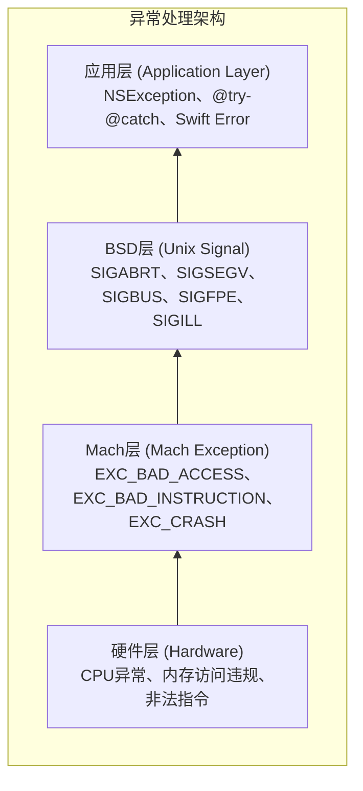
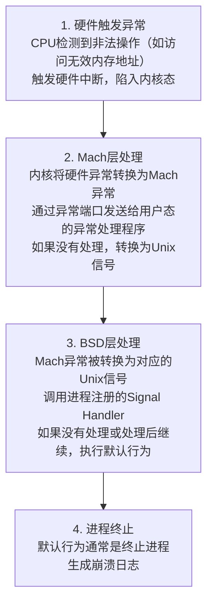
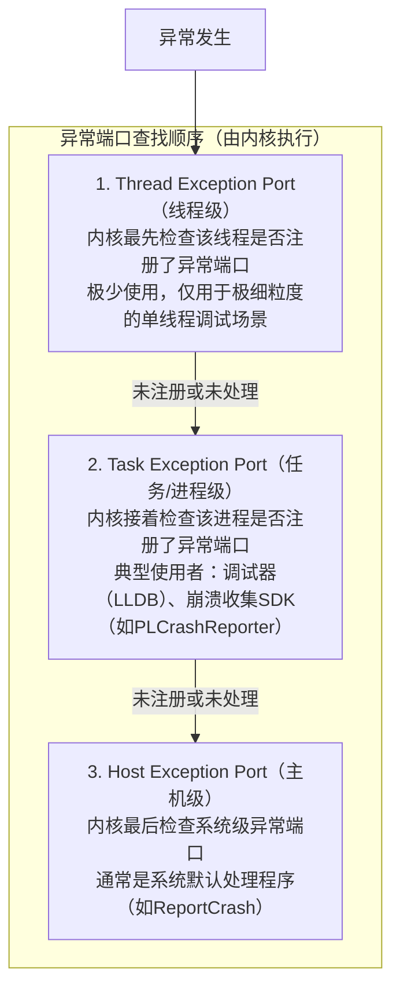
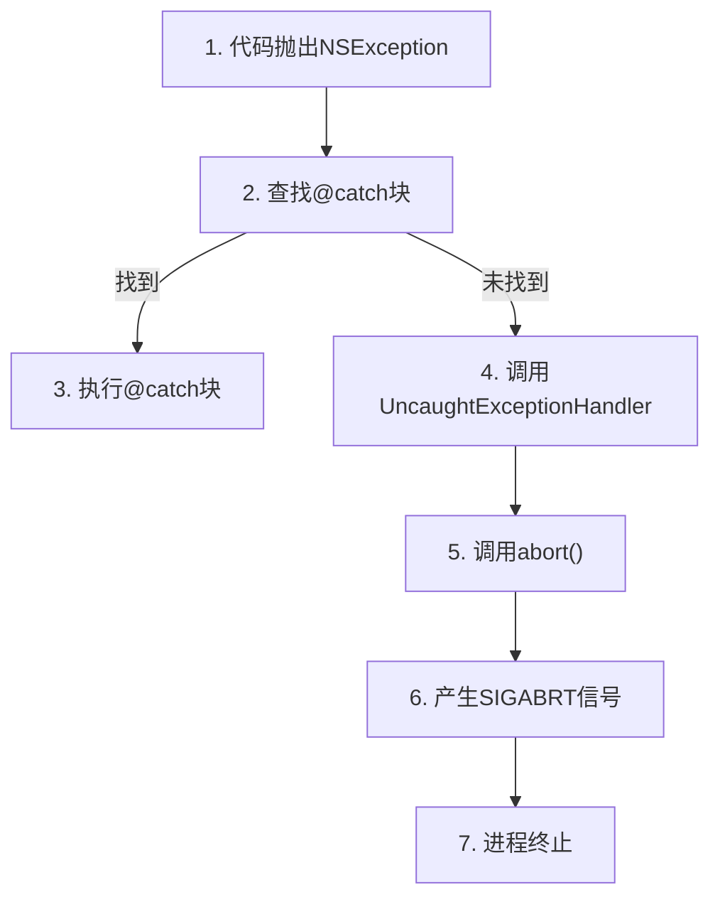

+++
title = "崩溃-原理"
date = '2026-05-10T22:25:41+08:00'
draft = false
weight = 20
tags = ["iOS", "性能优化", "稳定性", "崩溃"]
categories = ["iOS开发", "性能优化", "稳定性"]
+++
理解崩溃的底层原理是有效治理的基础。本文详细介绍iOS的异常处理机制、崩溃的传递链路以及各类崩溃的本质原因。

---

## iOS异常处理架构

iOS的异常处理采用分层架构，从底层到上层依次为：



需要注意：这张图表示崩溃治理中常见的异常/终止机制层次，并不表示所有异常都一定从硬件层逐级向上传递。`NSException` 属于 Objective-C 运行时/框架层的语言异常机制，不是内核产生的 Mach 异常。只有当 `NSException` 未被捕获时，运行时最终通常会调用 `abort()` 主动终止进程，随后表现为 `SIGABRT` / `EXC_CRASH`。

---

## 崩溃的传递链路

当异常发生时，会按照特定的链路传递：



### Mach异常与Unix信号的对应关系

| Mach异常 | Unix信号 | 触发原因 |
|---------|---------|---------|
| EXC_BAD_ACCESS | SIGSEGV/SIGBUS | 访问无效内存 |
| EXC_BAD_INSTRUCTION | SIGILL | 非法指令 |
| EXC_ARITHMETIC | SIGFPE | 算术异常（如除零） |
| EXC_BREAKPOINT | SIGTRAP | 断点/调试陷阱 |
| EXC_CRASH | SIGABRT | 程序主动abort |

---

## Mach异常机制

### Mach内核简介

Mach是macOS/iOS的微内核，提供了最基础的系统服务：

```plaintext
Mach内核提供的核心抽象：

┌─────────────────────────────────────────────────────────────┐
│                      Mach核心概念                            │
├─────────────────────────────────────────────────────────────┤
│                                                             │
│  Task（任务）                                                │
│  └── 资源容器，对应一个进程的资源                                │
│      包含虚拟地址空间、端口权限等                                │
│                                                             │
│  Thread（线程）                                              │
│  └── 执行单元，在Task中执行                                    │
│      拥有自己的寄存器状态和栈                                   │
│                                                             │
│  Port（端口）                                                │
│  └── 通信通道，用于进程间通信                                   │
│      异常处理通过端口机制实现                                   │
│                                                             │
│  Message（消息）                                             │
│  └── 通信载体，通过端口发送和接收                                │
│      异常信息以消息形式传递                                     │
│                                                             │
└─────────────────────────────────────────────────────────────┘
```

### 异常端口

Mach使用异常端口（Exception Port）来处理异常。当Mach异常发生时，**内核（XNU内核）会按照特定顺序查找异常处理程序**：



这种分层设计的好处是：允许不同粒度的异常处理。线程级可以处理特定线程的异常，进程级可以统一处理整个App的异常，主机级则作为兜底处理。

> 深入了解Mach端口操作、消息机制以及如何实现自定义异常处理器，请参考 [崩溃-Mach异常](崩溃-Mach异常.md)。

### 注册异常端口

开发者可以通过Mach API注册自己的异常端口：

```c
// 在Task级别注册异常端口（崩溃收集SDK常用方式）
kern_return_t task_set_exception_ports(
    task_t task,                    // 目标任务
    exception_mask_t exception_mask, // 要捕获的异常类型
    mach_port_t new_port,           // 新的异常端口
    exception_behavior_t behavior,   // 异常行为
    thread_state_flavor_t flavor     // 线程状态类型
);

// 在Thread级别注册异常端口
kern_return_t thread_set_exception_ports(
    thread_t thread,
    exception_mask_t exception_mask,
    mach_port_t new_port,
    exception_behavior_t behavior,
    thread_state_flavor_t flavor
);
```

### 常见Mach异常类型

```plaintext
EXC_BAD_ACCESS
├── 最常见的崩溃类型
├── 访问了无效的内存地址
├── 常见原因：
│   ├── 野指针访问
│   ├── 对象被释放后访问
│   ├── 数组越界（底层）
│   └── 栈溢出
└── 对应信号：SIGSEGV 或 SIGBUS

EXC_BAD_INSTRUCTION
├── 执行了非法指令
├── 常见原因：
│   ├── Swift强制解包nil
│   ├── 调用了纯虚函数
│   └── 代码段损坏
└── 对应信号：SIGILL

EXC_ARITHMETIC
├── 算术异常
├── 常见原因：
│   ├── 整数除零
│   └── 浮点异常
└── 对应信号：SIGFPE

EXC_BREAKPOINT
├── 断点异常
├── 常见原因：
│   ├── 调试断点
│   ├── Swift的fatalError
│   ├── assert失败
│   └── precondition失败
└── 对应信号：SIGTRAP

EXC_CRASH
├── 程序主动终止
├── 常见原因：
│   ├── 调用abort()
│   ├── 未捕获的NSException
│   └── C++ exception
└── 对应信号：SIGABRT
```

---

## Unix信号机制

### 信号基础

Unix信号是一种进程间通信机制，也用于异常通知：

```c
// 信号处理函数原型
typedef void (*sig_t)(int);

// 注册信号处理函数
signal(SIGSEGV, signal_handler);

// 或使用更强大的sigaction
struct sigaction sa;
sa.sa_sigaction = signal_handler_with_info;
sa.sa_flags = SA_SIGINFO;
sigemptyset(&sa.sa_mask);
sigaction(SIGSEGV, &sa, NULL);
```

### 常见崩溃信号

| 信号 | 值 | 说明 | 典型原因 |
|-----|---|------|---------|
| SIGABRT | 6 | 程序终止 | abort()、未捕获异常 |
| SIGBUS | 10 | 总线错误 | 内存对齐问题、映射失效 |
| SIGFPE | 8 | 算术异常 | 除零、溢出 |
| SIGILL | 4 | 非法指令 | 损坏的代码、强制解包nil |
| SIGSEGV | 11 | 段错误 | 访问无效内存 |
| SIGTRAP | 5 | 断点陷阱 | 断点、assert |
| SIGKILL | 9 | 强制终止 | 系统强杀（无法捕获） |

### 信号处理注意事项

在信号处理函数中，只能调用异步信号安全（Async-Signal-Safe）的函数：

```c
// 异步信号安全的函数（可以在Signal Handler中调用）
write()
_exit()
sigaction()
kill()
// ... 等少数函数

// 不安全的函数（不能在Signal Handler中调用）
malloc() / free()      // 可能死锁
printf()               // 使用了锁
NSLog()                // OC方法，不安全
objc_msgSend()         // OC消息发送，不安全
```

---

## NSException处理

### NSException概述

NSException是Objective-C层面的异常机制：

```objc
// 抛出异常
@throw [NSException exceptionWithName:NSRangeException
                               reason:@"Index out of bounds"
                             userInfo:nil];

// 捕获异常
@try {
    // 可能抛出异常的代码
    [array objectAtIndex:100];
} @catch (NSException *exception) {
    // 处理异常
    NSLog(@"Caught: %@", exception);
} @finally {
    // 清理代码
}
```

`NSException` 本身不是内核异常，也不是 Unix 信号。它是由 Objective-C 代码或 Foundation/UIKit 等框架在用户态主动抛出的对象。它和 Mach 异常的关系主要发生在未捕获之后：未捕获的 `NSException` 会进入 uncaught exception handler，随后进程通常调用 `abort()`，这个主动终止动作才会进入信号/Mach 崩溃日志体系，常见表现是 `SIGABRT` 和 `EXC_CRASH`。

### 常见NSException类型

```plaintext
NSRangeException
├── 数组/字符串越界访问
└── 示例：[array objectAtIndex:100]

NSInvalidArgumentException
├── 参数无效
├── 示例：
│   ├── [dict setObject:nil forKey:@"key"]
│   └── [NSNull null]作为参数
└── unrecognized selector也属于此类

NSInternalInconsistencyException
├── 内部状态不一致
└── 示例：在错误线程操作UI

NSGenericException
├── 通用异常
└── 示例：在枚举时修改集合
```

### 未捕获异常处理

```objc
// 设置未捕获异常处理函数
void uncaughtExceptionHandler(NSException *exception) {
    // 获取异常信息
    NSString *name = exception.name;
    NSString *reason = exception.reason;
    NSArray *callStack = exception.callStackSymbols;
    
    // 保存崩溃信息
    // 注意：此时应用即将终止，需要快速处理
}

// 注册处理函数
NSSetUncaughtExceptionHandler(&uncaughtExceptionHandler);
```

### NSException与信号的关系



---

## 内存相关崩溃

### 野指针（Dangling Pointer）

野指针是指向已释放内存的指针：

```objc
// 野指针示例
@implementation MyClass

- (void)example {
    NSObject *obj = [[NSObject alloc] init];
    __unsafe_unretained NSObject *unsafeRef = obj;
    
    obj = nil;  // 对象被释放
    
    // unsafeRef现在是野指针
    [unsafeRef description];  // EXC_BAD_ACCESS
}

@end
```

野指针崩溃的特点：
- 难以复现（取决于内存是否被重用）
- 崩溃位置可能与问题代码相距甚远
- 堆栈可能不完整或混乱

### 内存越界

```objc
// 栈越界
- (void)stackOverflow {
    char buffer[10];
    // 写入超过缓冲区大小
    strcpy(buffer, "This is a very long string");
}

// 堆越界
- (void)heapOverflow {
    char *buffer = malloc(10);
    // 写入超过分配大小
    memset(buffer, 0, 100);
}
```

### OOM（Out of Memory）

iOS对内存使用有严格限制，超出限制会被系统终止：

```plaintext
iOS内存限制（参考值，因设备而异）：

设备类型           前台限制        后台限制
─────────────────────────────────────────
iPhone低端机       ~200MB         ~50MB
iPhone中端机       ~400MB         ~80MB
iPhone高端机       ~1GB+          ~100MB+

注意：
- 这些值是参考值，实际限制取决于系统状态
- 后台应用更容易被终止
- 系统内存压力大时，限制会降低
```

OOM的特点：
- 没有崩溃日志（被系统直接终止）
- 需要通过其他方式检测（如Jetsam日志）
- 常见于大图片处理、大量数据加载

---

## Watchdog崩溃

### 什么是Watchdog

Watchdog是iOS的看门狗机制，监控应用的响应性：

```plaintext
Watchdog监控场景：

┌─────────────────────────────────────────────────────────────┐
│                    Watchdog超时场景                          │
├─────────────────────────────────────────────────────────────┤
│                                                             │
│  场景                     超时时间      终止代码               │
│  ─────────────────────────────────────────────────────────  │
│  应用启动                  ~20秒        0x8badf00d           │
│  应用恢复（从后台）          ~10秒        0x8badf00d           │
│  应用挂起                  ~10秒        0x8badf00d           │
│  应用终止                  ~5秒         0x8badf00d           │
│  后台任务                  ~30秒        0xbada5e47           │
│  后台下载                  ~600秒       0xbada5e47           │
│                                                             │
└─────────────────────────────────────────────────────────────┘

0x8badf00d = "ate bad food" = 主线程阻塞
0xbada5e47 = "bad asset"    = 后台任务超时
```

### Watchdog崩溃特征

```plaintext
Watchdog崩溃日志特征：

Exception Type: EXC_CRASH (SIGKILL)
Exception Codes: 0x8badf00d
Exception Note: SIMULATED (这不是真正的崩溃)

Termination Reason: Namespace SPRINGBOARD, Code 0x8badf00d
Termination Description: SPRINGBOARD, 
    scene-create watchdog transgression: xxx exhausted real time allowance of 20.00 seconds
```

---

## Swift特有的崩溃

Swift的崩溃在不同架构上产生的异常类型有所不同：

```plaintext
Swift崩溃的异常类型（按架构区分）：

┌─────────────────────────────────────────────────────────────┐
│  ARM64架构（iOS设备）                                         │
├─────────────────────────────────────────────────────────────┤
│                                                             │
│  EXC_BREAKPOINT (SIGTRAP)                                   │
│  ├── Swift运行时检查失败和主动触发的崩溃都是此类型                 │
│  ├── 触发方式：执行brk指令                                     │
│  ├── 常见场景：                                               │
│  │   ├── 强制解包nil（value!）                                │
│  │   ├── 数组越界访问                                         │
│  │   ├── 强制类型转换失败（as!）                               │
│  │   ├── fatalError()                                       │
│  │   ├── preconditionFailure()                              │
│  │   └── precondition()失败                                  │
│  └── 特点：ARM64上Swift崩溃统一使用brk指令                      │
│                                                             │
└─────────────────────────────────────────────────────────────┘

┌─────────────────────────────────────────────────────────────┐
│  x86_64架构（模拟器）                                         │
├─────────────────────────────────────────────────────────────┤
│                                                             │
│  EXC_BAD_INSTRUCTION (SIGILL)                               │
│  ├── Swift运行时检查失败                                       │
│  ├── 触发方式：执行ud2指令                                     │
│  ├── 常见场景：                                               │
│  │   ├── 强制解包nil（value!）                                │
│  │   ├── 数组越界访问                                         │
│  │   └── 强制类型转换失败（as!）                               │
│  └── 特点：x86上使用ud2（undefined instruction）指令           │
│                                                             │
│  EXC_BREAKPOINT (SIGTRAP)                                   │
│  ├── 开发者主动触发的崩溃                                      │
│  ├── 触发方式：执行int3指令                                    │
│  ├── 常见场景：                                               │
│  │   ├── fatalError()                                       │
│  │   └── preconditionFailure()                              │
│  └── 特点：与调试断点使用相同机制                               │
│                                                             │
└─────────────────────────────────────────────────────────────┘

注意：
- 现代iOS设备均为ARM64架构，Swift崩溃主要表现为EXC_BREAKPOINT
- 在模拟器（x86_64）上调试时可能看到EXC_BAD_INSTRUCTION
- assertionFailure()在Release模式下不会触发崩溃
```

### 强制解包失败

```swift
// Fatal error: Unexpectedly found nil while unwrapping an Optional value
let value: String? = nil
print(value!)  // ARM64: EXC_BREAKPOINT, x86_64: EXC_BAD_INSTRUCTION
```

### 数组越界

```swift
// Fatal error: Index out of range
let array = [1, 2, 3]
let value = array[10]  // ARM64: EXC_BREAKPOINT, x86_64: EXC_BAD_INSTRUCTION
```

### 类型转换失败

```swift
// Fatal error: Could not cast value of type 'A' to 'B'
let a: Any = "string"
let b = a as! Int  // ARM64: EXC_BREAKPOINT, x86_64: EXC_BAD_INSTRUCTION
```

### fatalError和precondition

```swift
// 主动触发崩溃
fatalError("Something went wrong")  // EXC_BREAKPOINT (所有架构)

// 前置条件检查
precondition(index >= 0, "Index must be non-negative")  // 失败时EXC_BREAKPOINT
```

---

## 崩溃日志解读

### 崩溃日志结构

```plaintext
典型的iOS崩溃日志结构：

1. Header（头部信息）
   ├── Incident Identifier: 崩溃标识
   ├── Hardware Model: 设备型号
   ├── Process: 进程名和PID
   ├── OS Version: 系统版本
   └── Date/Time: 崩溃时间

2. Exception Information（异常信息）
   ├── Exception Type: 异常类型
   ├── Exception Codes: 异常代码
   ├── Exception Subtype: 子类型
   └── Termination Reason: 终止原因

3. Thread Backtrace（线程堆栈）
   ├── Crashed Thread的完整堆栈
   └── 其他线程的堆栈

4. Binary Images（二进制映像）
   └── 加载的所有动态库和地址范围
```

### 示例崩溃日志

```plaintext
Incident Identifier: ABC123-DEF456-GHI789
Hardware Model:      iPhone13,2
Process:             MyApp [12345]
Path:                /private/var/containers/Bundle/Application/.../MyApp.app/MyApp
Identifier:          com.example.MyApp
Version:             1.0.0 (100)
Code Type:           ARM-64
Parent Process:      launchd [1]

Date/Time:           2024-01-15 10:30:45.123 +0800
OS Version:          iOS 17.0 (21A5248v)

Exception Type:      EXC_BAD_ACCESS (SIGSEGV)
Exception Subtype:   KERN_INVALID_ADDRESS at 0x0000000000000010
Exception Codes:     0x0000000000000001, 0x0000000000000010
VM Region Info:      0x10 is not in any region.

Triggered by Thread: 0

Thread 0 Crashed:
0   MyApp                    0x0000000100001234 -[MyClass method] + 56
1   MyApp                    0x0000000100002345 -[MyClass caller] + 128
2   UIKitCore                0x00000001a2345678 -[UIViewController viewDidLoad] + 100
3   ...
```

---

## 崩溃与调试器

### 调试器对异常的影响

当应用在调试器下运行时，异常处理行为会有所不同：

```plaintext
调试器影响：

1. 异常优先发送给调试器
   └── 调试器可以选择处理或传递

2. 某些崩溃在调试器下不会发生
   └── 如Watchdog超时（调试时禁用）

3. 调试器可能改变内存布局
   └── 某些野指针崩溃可能无法复现

4. 断点异常会被调试器拦截
   └── EXC_BREAKPOINT在调试时不会崩溃
```

### LLDB异常处理

```bash
# 查看当前异常处理设置
(lldb) process handle

# 设置SIGSEGV不停止，不通知
(lldb) process handle SIGSEGV --stop false --notify false

# 让所有信号传递给进程
(lldb) process handle --pass true --stop false --notify false
```
