+++
title = "崩溃-治理"
date = '2026-05-02T22:32:27+08:00'
draft = false
weight = 21
tags = ["iOS", "性能优化", "稳定性", "崩溃"]
categories = ["iOS开发", "性能优化", "稳定性"]
+++
本文详细介绍常见崩溃类型的修复方法、防崩溃保护机制以及线上监控体系。

> 崩溃治理是 APM 稳定性子系的核心模块。完整的监控建设、多类型稳定性问题（Watchdog/OOM/CPU/IO）的统一治理与 Zombie/Coredump/MemoryGraph 等高级归因能力，请参考 [APM 系列]()：[指标体系]()、[业界方案]()。

---

## 崩溃治理流程

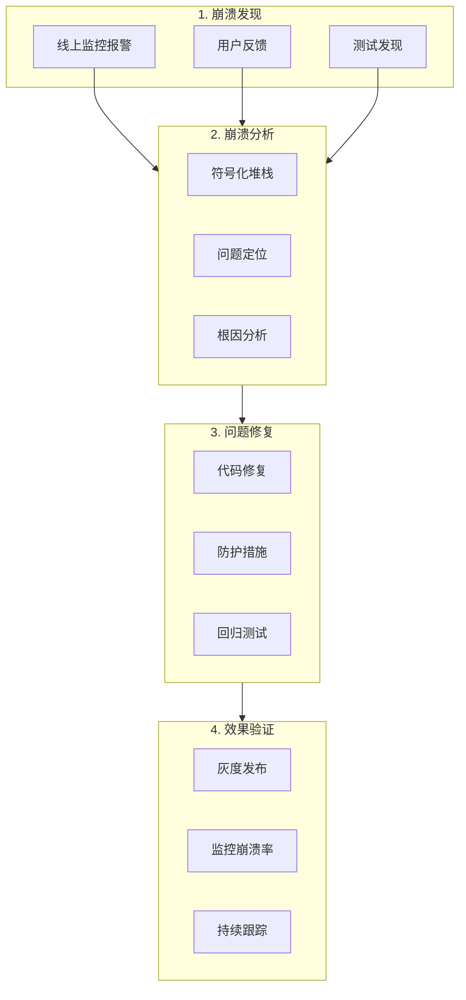

---

## 常见崩溃类型及修复

### 1. 数组越界

```objc
// 崩溃示例
NSArray *array = @[@1, @2, @3];
id obj = array[10];  // NSRangeException

// 修复方案1：边界检查
- (id)safeObjectAtIndex:(NSUInteger)index fromArray:(NSArray *)array {
    if (index < array.count) {
        return array[index];
    }
    return nil;
}

// 修复方案2：分类安全方法
@implementation NSArray (Safe)

- (id)safeObjectAtIndex:(NSUInteger)index {
    if (index < self.count) {
        return [self objectAtIndex:index];
    }
    return nil;
}

@end

// 修复方案3：Swift可选绑定
extension Array {
    subscript(safe index: Index) -> Element? {
        return indices.contains(index) ? self[index] : nil
    }
}

// 使用
let value = array[safe: 10]  // 返回nil而不是崩溃
```

### 2. 字典插入nil

```objc
// 崩溃示例
NSMutableDictionary *dict = [NSMutableDictionary dictionary];
NSString *value = nil;
[dict setObject:value forKey:@"key"];  // NSInvalidArgumentException

// 修复方案1：nil检查
- (void)setObject:(id)object forKey:(id)key inDict:(NSMutableDictionary *)dict {
    if (object && key) {
        dict[key] = object;
    }
}

// 修复方案2：分类安全方法
@implementation NSMutableDictionary (Safe)

- (void)safeSetObject:(id)object forKey:(id)key {
    if (object && key) {
        [self setObject:object forKey:key];
    }
}

@end

// 修复方案3：使用NSNull
dict[@"key"] = value ?: [NSNull null];
```

### 3. Unrecognized Selector

```objc
// 崩溃示例
NSString *str = @"hello";
[str performSelector:@selector(count)];  // unrecognized selector

// 修复方案1：respondsToSelector检查
if ([obj respondsToSelector:@selector(someMethod)]) {
    [obj performSelector:@selector(someMethod)];
}

// 修复方案2：消息转发防护
@implementation NSObject (CrashProtection)

+ (void)load {
    // Hook forwardingTargetForSelector:
    Method original = class_getInstanceMethod(self, @selector(forwardingTargetForSelector:));
    Method swizzled = class_getInstanceMethod(self, @selector(safe_forwardingTargetForSelector:));
    method_exchangeImplementations(original, swizzled);
}

- (id)safe_forwardingTargetForSelector:(SEL)aSelector {
    // 如果找不到方法，返回一个空实现的对象
    id target = [self safe_forwardingTargetForSelector:aSelector];
    if (target) return target;
    
    // 记录错误
    NSLog(@"Unrecognized selector: %@ on %@", NSStringFromSelector(aSelector), self);
    
    // 返回一个能处理任何消息的对象
    return [CrashStub shared];
}

@end
```

### 4. KVO崩溃

```objc
// 崩溃场景1：重复移除观察者
[obj removeObserver:self forKeyPath:@"value"];
[obj removeObserver:self forKeyPath:@"value"];  // 崩溃

// 崩溃场景2：未移除观察者就释放
- (void)dealloc {
    // 忘记移除观察者
}

// 修复方案：安全的KVO封装
@interface SafeKVOProxy : NSObject
@property (nonatomic, weak) id observer;
@property (nonatomic, weak) id target;
@property (nonatomic, copy) NSString *keyPath;
@property (nonatomic, copy) void (^callback)(id newValue);
@end

@implementation SafeKVOProxy

- (instancetype)initWithTarget:(id)target 
                       keyPath:(NSString *)keyPath 
                      observer:(id)observer
                      callback:(void (^)(id))callback {
    self = [super init];
    if (self) {
        _target = target;
        _keyPath = keyPath;
        _observer = observer;
        _callback = callback;
        
        [target addObserver:self forKeyPath:keyPath options:NSKeyValueObservingOptionNew context:NULL];
    }
    return self;
}

- (void)observeValueForKeyPath:(NSString *)keyPath 
                      ofObject:(id)object 
                        change:(NSDictionary *)change 
                       context:(void *)context {
    if (self.callback) {
        self.callback(change[NSKeyValueChangeNewKey]);
    }
}

- (void)dealloc {
    [_target removeObserver:self forKeyPath:_keyPath];
}

@end
```

### 5. 多线程崩溃

```objc
// 崩溃场景：非线程安全的集合操作
// 线程1
[mutableArray addObject:obj1];
// 线程2
[mutableArray removeObjectAtIndex:0];  // 可能崩溃

// 修复方案1：加锁
@property (nonatomic, strong) NSLock *arrayLock;

- (void)safeAddObject:(id)object {
    [self.arrayLock lock];
    [self.mutableArray addObject:object];
    [self.arrayLock unlock];
}

// 修复方案2：使用GCD串行队列
@property (nonatomic, strong) dispatch_queue_t arrayQueue;

- (void)safeAddObject:(id)object {
    dispatch_sync(self.arrayQueue, ^{
        [self.mutableArray addObject:object];
    });
}

// 修复方案3：使用Actor（Swift Concurrency）
actor SafeStorage {
    private var items: [Any] = []
    
    func append(_ item: Any) {
        items.append(item)
    }
    
    func remove(at index: Int) {
        guard index < items.count else { return }
        items.remove(at: index)
    }
    
    func getAll() -> [Any] {
        return items
    }
}

let storage = SafeStorage()
await storage.append(obj1)
```

### 6. 野指针崩溃

```objc
// 崩溃场景
__unsafe_unretained id unsafeRef = obj;
obj = nil;
[unsafeRef description];  // EXC_BAD_ACCESS

// 修复方案1：使用weak而非unsafe_unretained
__weak id weakRef = obj;
obj = nil;
[weakRef description];  // 安全，weakRef为nil

// 修复方案2：Zombie Objects检测（调试用）
// 在Scheme中启用Zombie Objects

// 修复方案3：野指针检测工具
// 使用Address Sanitizer
// Product -> Scheme -> Edit Scheme -> Diagnostics -> Address Sanitizer
```

### 7. Swift强制解包崩溃

```swift
// 崩溃示例
let value: String? = nil
print(value!)  // Fatal error: Unexpectedly found nil

// 修复方案1：可选绑定
if let value = optionalValue {
    print(value)
}

// 修复方案2：空合运算符
let value = optionalValue ?? "default"

// 修复方案3：guard语句
guard let value = optionalValue else {
    return
}
print(value)

// 修复方案4：可选链
let length = optionalString?.count  // 返回Int?
```

### 8. OOM（Out Of Memory）崩溃

OOM 是 iOS 最难治理的崩溃类型之一：系统因进程占用内存超过限制而将其强杀，不会产生标准崩溃日志，App 也没有机会在崩溃现场同步写下详细堆栈。因此 OOM 治理必须**在事故前就把现场数据预埋下来**，分为三个时段：

- **事前**：实时感知内存水位、拦截大内存分配、监控异常增长
- **事中**：在内存触顶或收到强烈警告时，把"当前存活对象 + 分配堆栈"持续 dump 到磁盘（即 **Memory Dump**，又称 MemoryStat / Allocation Stack Dump）
- **事后**：下次启动结合 dump 文件、Jetsam 日志、MetricKit 数据、上次水位综合归因

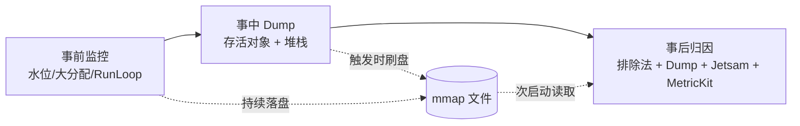

#### OOM 的类型

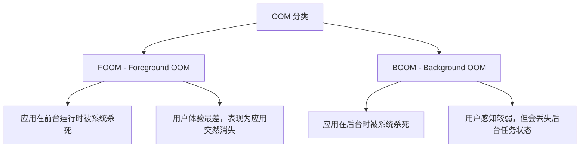

#### Jetsam 机制与强杀类型

iOS 通过 XNU 内核的 `memorystatus`（俗称 Jetsam）管理物理内存资源：当系统整体或进程内存超限时，按 Jetsam 优先级杀死进程，终止原因写入 **Jetsam Event Report**（*设置 → 隐私与安全性 → 分析与改进 → 分析数据*，文件名以 `JetsamEvent-` 开头，JSON 格式，不含线程堆栈）。

| 强杀类型 | 含义 | 典型根因 | 治理核心 |
|---------|------|---------|---------|
| `per-process-limit` | 单进程 footprint 超过限额（**本文 OOM 主要类型**） | 业务持续占用（大图/缓存/泄漏/内存抖动） | Memory Dump、降采样、缓存治理 |
| `vm-pageshortage` | 系统可用物理页不足，按优先级清理进程 | 前后台切换、多任务内存压力 | 后台及时释放、降低驻留 |
| `vnode-limit` | 进程打开 vnode 过多（iOS 15+ 约 10000） | 文件句柄/数据库句柄/dylib 泄漏 | 审计 `open/mmap/dlopen` 生命周期 |
| `disk-space-shortage` | 磁盘可用空间不足 | 缓存膨胀、日志无限增长 | 分级清理、容量上限 |
| `highwater` | 常驻进程超过 highwater 预期 | 系统扩展 / 后台任务 | 非主 App 典型场景 |
| `fc-thrashing` | 文件缓存颠簸 | 大文件非顺序读取 | 顺序化 I/O、合理使用 mmap |

下文如无特别说明，OOM 均指 per-process-limit。

> JetsamEvent 日志不含线程堆栈，但完整记录了强杀那一刻的整机内存画像，是 OOM 归因、阈值反推与后台生命周期治理最权威的一手数据。字段逐项详解、`reason` 深度解读、自动化批量解析脚本与机型阈值矩阵见 [JetsamEvent 日志解读]()。

#### OOM 阈值与内存用量获取

精确知道"当前距离被杀还有多远"是所有 OOM 治理的基石。iOS 13+ 推荐用系统 API 实时计算：

```objc
#import <mach/mach.h>
#import <os/proc.h>

typedef struct {
    uint64_t footprint;   // 当前进程占用（= Xcode Memory Gauge）
    uint64_t available;   // 当前进程还可申请的内存
    uint64_t limit;       // 当前进程 OOM 阈值
    double   pressure;    // footprint / limit
} MemorySnapshot;

static MemorySnapshot MemoryQuerySnapshot(void) {
    MemorySnapshot s = {0};
    task_vm_info_data_t info;
    mach_msg_type_number_t count = TASK_VM_INFO_COUNT;
    if (task_info(mach_task_self(), TASK_VM_INFO, (task_info_t)&info, &count) == KERN_SUCCESS) {
        s.footprint = info.phys_footprint;
    }
    if (@available(iOS 13.0, *)) {
        s.available = os_proc_available_memory();
        s.limit = s.footprint + s.available;
    }
    s.pressure = s.limit > 0 ? (double)s.footprint / (double)s.limit : 0;
    return s;
}
```

**几个关键字段的语义**：

| 字段 | 含义 | 是否可作 OOM 依据 |
|------|------|-----------------|
| `phys_footprint` | 进程 dirty memory + compressed memory | ✅ Jetsam 统计的就是它 |
| `resident_size` | 物理驻留内存（不含 compressed） | ❌ 与 Xcode/Jetsam 计算口径不同 |
| `os_proc_available_memory()` | 距离 dirty memory limit 还剩的字节（iOS 13+，由系统账本动态计算） | ✅ 最准 |
| `footprint + available` | 实时 OOM 阈值 | ✅ 覆盖前后台、iOS 15+ entitlement 差异 |

**iOS 13 以下兜底**：只能用 Jetsam 日志的 `rpages × pageSize` 或机型经验值。

**内存压力分级监控**：

```objc
@interface MemoryMonitor : NSObject
@property (nonatomic, assign) double warningPressure;   // 0.75
@property (nonatomic, assign) double criticalPressure;  // 0.85
@property (nonatomic, assign) double dumpPressure;      // 0.90 触发 Memory Dump
@end

@implementation MemoryMonitor

- (void)startMonitoring {
    dispatch_source_t timer = dispatch_source_create(DISPATCH_SOURCE_TYPE_TIMER, 0, 0,
                                                     dispatch_get_global_queue(QOS_CLASS_UTILITY, 0));
    dispatch_source_set_timer(timer, DISPATCH_TIME_NOW, 1 * NSEC_PER_SEC, 100 * NSEC_PER_MSEC);
    dispatch_source_set_event_handler(timer, ^{
        MemorySnapshot s = MemoryQuerySnapshot();
        if (s.pressure >= self.dumpPressure) {
            [[MemoryDump shared] triggerDumpWithReason:@"water-line"];
        } else if (s.pressure >= self.criticalPressure) {
            [self handleCriticalMemory];
        } else if (s.pressure >= self.warningPressure) {
            [self handleMemoryWarning];
        }
    });
    dispatch_resume(timer);
}

@end
```

> 高频轮询需放在后台队列，避免占用主线程；触发 dump 后要节流（例如同一"水位周期"内只 dump 一次）。

#### OOM 归因与 FOOM 误判优化

App 无法在被 Jetsam 杀死的瞬间落盘堆栈，因此 OOM 归因采用 **Facebook 2015 年提出的排除法**：上次启动不是正常退出、不是崩溃、不是升级、不是系统重启，那"剩下"就可能是 OOM。

```objc
typedef NS_ENUM(NSInteger, OOMResult) {
    OOMResultNormalExit,
    OOMResultCrash,
    OOMResultOSUpgrade,
    OOMResultAppUpgrade,
    OOMResultAppHang,       // 前台卡死（Watchdog）
    OOMResultLowBattery,    // 低电量关机
    OOMResultFOOM,          // 前台 OOM
    OOMResultBOOM,          // 后台 OOM
    OOMResultUnknown,       // 排除法兜底
};

@interface OOMDetector : NSObject
@property (nonatomic, copy)   NSString *lastAppVersion;
@property (nonatomic, copy)   NSString *lastOSBuild;           // 用 build 比 version 更准
@property (nonatomic, assign) BOOL      didExitNormally;
@property (nonatomic, assign) BOOL      didCrashLastLaunch;
@property (nonatomic, assign) BOOL      wasInBackground;
@property (nonatomic, assign) uint64_t  lastFootprint;         // 退出前水位
@property (nonatomic, assign) uint64_t  lastLimit;             // 退出前阈值
@property (nonatomic, assign) BOOL      wasWatchdogSuspect;    // 退出前是否主线程卡顿
@property (nonatomic, assign) float     lastBatteryLevel;      // 退出前电量
@end

@implementation OOMDetector

- (OOMResult)diagnoseLastLaunch {
    if (self.didExitNormally)   return OOMResultNormalExit;
    if (self.didCrashLastLaunch) return OOMResultCrash;

    if (![self.lastOSBuild isEqualToString:[self currentOSBuild]]) return OOMResultOSUpgrade;
    if (![self.lastAppVersion isEqualToString:[self currentAppVersion]]) return OOMResultAppUpgrade;

    // 主线程卡顿超阈值 → 归为前台卡死，不算 OOM
    if (self.wasWatchdogSuspect) return OOMResultAppHang;

    // 电量 < 2% 且非正常退出 → 归为低电量关机
    if (self.lastBatteryLevel > 0 && self.lastBatteryLevel < 0.02) return OOMResultLowBattery;

    // 水位置信度校验：退出前 < 70% → 非典型 OOM
    double pressure = self.lastLimit > 0 ? (double)self.lastFootprint / self.lastLimit : 0;
    if (pressure < 0.7) return OOMResultUnknown;

    return self.wasInBackground ? OOMResultBOOM : OOMResultFOOM;
}

@end
```

**排除法的三个典型误判 + 业界优化手段**：

| 误判场景 | 表现 | 优化手段 |
|---------|------|---------|
| Watchdog 超时（0x8badf00d） | 无日志 + 非正常退出 | RunLoop 卡顿监控：退出前 N 秒主线程卡顿超阈 → 归"前台卡死" |
| 低电量关机 | 无日志 + 非正常退出 | 退出前记录 `UIDevice.batteryLevel`，次启动若电量 ~0 → 归电量 |
| 系统后台重启/恢复 | 非版本升级 | 使用 `kern.osversion` (build) 代替 `systemVersion` |

微信把"前台卡死"拆出后，真实 FOOM 统计口径更精准，治理指标更具参考价值。**配合 MetricKit 做二次确认**：iOS 14+ 可在 `MXCrashDiagnostic.exceptionReason` 中看到部分终止原因（含 `per-process-limit`）。

#### 核心：Memory Dump 监控体系

排除法 + 水位只能回答"是否发生 OOM"，**无法回答"哪段代码导致 OOM"**。业界公认的最佳解法是：运行期持续记录所有存活对象的分配堆栈，在内存触顶时把"活对象清单 + 堆栈"落盘，下次启动上报、聚类、分析。这就是 **Memory Dump**。

##### 技术原理：两个系统钩子

`libmalloc` 和 `libsystem_kernel` 预留了两个函数指针：

```c
// libmalloc/include/malloc/malloc_private.h
typedef void (malloc_logger_t)(uint32_t type,
                               uintptr_t arg1, uintptr_t arg2, uintptr_t arg3,
                               uintptr_t result, uint32_t num_hot_frames_to_skip);
extern malloc_logger_t *malloc_logger;      // 覆盖 malloc/free/realloc/calloc 等堆分配
extern malloc_logger_t *__syscall_logger;   // 覆盖 vm_allocate/mach_vm_allocate 等 VM 分配
```

当它们被置为非空时，每一次内存分配/释放都会回调上层 —— Instruments 的 Allocations 工具就是基于此工作。业界 Memory Dump 组件复用同一机制：

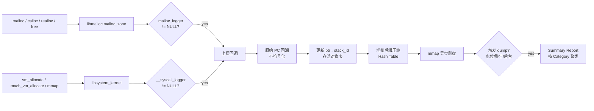

##### 实现要点

**1）Hook 选择**：`malloc_logger` 已能覆盖 scalable_zone 分配；对 nano_zone（< 256B 小块）和系统库独立 zone，需要结合 `fishhook` 重绑定 `malloc`/`calloc`/`malloc_zone_malloc` 符号。

```c
extern malloc_logger_t *malloc_logger;
extern malloc_logger_t *__syscall_logger;

// libmalloc 内部枚举，按值复制过来
#define memory_logging_type_alloc        2
#define memory_logging_type_dealloc      4
#define memory_logging_type_vm_allocate  16
#define memory_logging_type_vm_deallocate 32

static void memdump_logger(uint32_t type, uintptr_t arg1, uintptr_t arg2,
                           uintptr_t arg3, uintptr_t result, uint32_t skip) {
    bool is_alloc   = (type & memory_logging_type_alloc)   != 0;
    bool is_dealloc = (type & memory_logging_type_dealloc) != 0;

    if (is_alloc) {
        size_t    size = (size_t)arg2;
        uintptr_t ptr  = result;
        uint64_t  sid  = memdump_capture_stack(skip + 1);
        memdump_live_insert(ptr, size, sid);
    } else if (is_dealloc) {
        memdump_live_remove(arg2);
    }
}

void memdump_install(void) {
    malloc_logger   = memdump_logger;
    __syscall_logger = memdump_logger;
}
```

> **死锁警告**：回调内禁止再次触发 `malloc`、NSLog、Foundation 调用；堆栈捕获与写盘通过无锁 ring buffer 异步化到独立线程。

**2）高效堆栈回溯**：`backtrace_symbols` 自带符号化极耗时，运行期只保留**原始 PC**，符号化延迟到上报后。微信 Matrix 直接沿 `fp`/`lr` 链展开，比 `backtrace()` 快一个量级：

```c
size_t memdump_thread_stack_pcs(vm_address_t *buf, size_t max) {
    void **fp = __builtin_frame_address(0);
    size_t n = 0;
    while (fp && n < max) {
        vm_address_t pc = (vm_address_t)*(fp + 1);
        if (pc == 0) break;
        buf[n++] = pc;
        fp = (void **)*fp;  // 跟随保存的 fp 链
    }
    return n;
}
```

**3）存活对象表（ptr → stack_id）**：大型 App 分配峰值可达 10 万次/秒，常规 Hash 表空间膨胀严重。微信 Matrix 采用"**数组实现的平衡二叉树**"：

- 父子关系用数组下标代替指针，杜绝节点级 malloc
- 删除节点的槽位压入"空闲链表"的头节点，实现 O(1) 复用

**4）堆栈后缀压缩**：实测大型 App 捕获上百万条堆栈，平均深度 35 帧，全存约 157 MB。观察到大量堆栈**共享后缀**：

```
stack1: A → C → D → E → F → G
stack2: A → B → D → E → F → G
共享后缀:         D → E → F → G
```

采用"倒插入 Hash Table"：每个节点存 `(pc, parent_index)`，堆栈只保留入口节点索引。微信公开数据：压缩后平均栈长 35 → 不到 5，存储量降为原来的 1/40。

```c
typedef struct {
    uint64_t pc        : 36; // armv8 虚拟地址 36 位够用
    uint64_t parent_idx: 28; // 父节点下标
} stack_node_t;

// stack_id = 入口节点下标；解压只需沿 parent_idx 链回溯
```

**5）mmap 落盘**：运行期数据结构不能只驻留内存，否则 OOM 瞬间被杀全部丢失。存活对象表、堆栈 Hash Table、dyld image list 都用 `mmap` 映射到文件：

- 写内存 = 写文件，无系统调用开销
- 内核在脏页回收时自动回写，进程被杀后文件仍完整
- 下次启动按固定结构直接解析

```c
int fd = open(path, O_RDWR | O_CREAT, 0644);
ftruncate(fd, MAP_SIZE);
void *base = mmap(NULL, MAP_SIZE, PROT_READ | PROT_WRITE, MAP_SHARED, fd, 0);
close(fd);  // mmap 区域依然有效
// 所有写入直接操作 base+offset
```

**6）触发 Dump 的时机**：

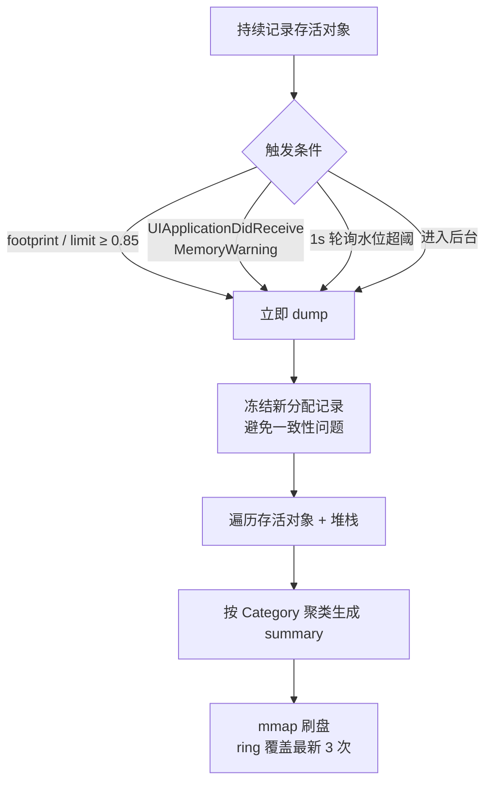

##### Dump 产物与分析流程

落盘文件通常包含四部分：

| Section | 内容 | 用途 |
|---------|------|------|
| Header | 设备、App 版本、OOM 阈值、触发原因、footprint 高水位 | 归因上下文 |
| Image List | 进程加载的所有 dyld image（name / UUID / loadAddr / slide） | 离线符号化基准 |
| Allocation Table | 存活对象（size + stack_id + alloc_ts + class_name） | 主分析数据 |
| Stack Hash Table | PC 节点数组（pc + parent_idx） | 堆栈还原 |

上报后的分析流程：

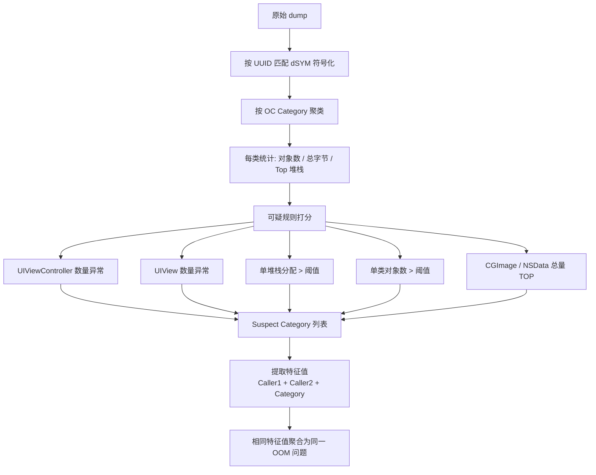

微信 Matrix 的经验：**特征值 = Caller1 + Caller2 + Category**

- **Caller1**：分配点所在业务函数（需跳过 `malloc`/`_objc_rootAlloc` 等系统胶水）
- **Caller2**：Caller1 的调用方，用于区分同一函数的不同场景
- **Category**：对象的 OC 类名（`class_getName`）

##### 业界开源方案对比

| 方案 | 出品 | 核心机制 | 特点 |
|------|------|---------|------|
| **Matrix WCMemoryStat** | 微信 | `malloc_logger` + `__syscall_logger` Hook；数组二叉树存活对象；后缀压缩堆栈；mmap 落盘 | 生产级，性能最优；支持 Category 聚类；微信线上多年验证 |
| **OOMDetector** | 手 Q（腾讯） | `malloc_zone` + `vm_allocate` Hook；大内存堆栈监控；触顶周期 dump | 附带"无主内存泄漏"检测 |
| **FBAllocationTracker** | Facebook | Hook `+alloc` 记录每个 OC 类对象计数 | 粒度粗（类级），轻量，可用于粗筛 |
| **FBRetainCycleDetector** | Facebook | 运行时遍历 `ivar` 引用图查环 | 针对循环引用；可配合 Tracker 定点检测 |
| **MLeaksFinder** | 手 Q | ViewController pop 后 weak 检查 | 针对页面泄漏；自动接入零侵入 |
| **MetricKit `MXMetricPayload`** | Apple | 系统采集进程能耗/内存/挂起 | 粒度粗；无存活对象堆栈；可作基线 |
| **MetricKit `MXCrashDiagnostic`** | Apple | iOS 14+ 记录部分终止原因（含 per-process-limit） | 可用作归因二次确认 |

**组合推荐**：`Matrix WCMemoryStat`（线上存活堆栈）+ `MLeaksFinder`（页面泄漏）+ `FBRetainCycleDetector`（本地定点）+ `MetricKit`（系统级基线）。

##### 接入 Memory Dump 的开销评估

线上开启前必须评估开销。微信 Matrix 公开数据：

| 指标 | 实测值 | 治理手段 |
|------|--------|---------|
| CPU | iPhone 6 Plus ~13% | 高频分配点采样、关闭小于 512B 的记录 |
| 内存 | 额外 ~20 MB（全 mmap） | 后缀压缩 + 只保留大堆栈 |
| 磁盘 | 单次 dump ~300 KB | 冷/热分离，只保留最近 3 次 |
| 上报 | 300 KB/次（压缩后 ~50 KB） | 白名单/灰度 100%，线网 1% 抽样 |

灰度包和公司内部用户 100% 开启，现网用户抽样开启。本地最多保留最近三次 dump，避免磁盘无限增长。

#### 轻量级大内存分配监控

Memory Dump 采集所有存活对象，开销偏大。更轻量的方案是**只 hook 单次大块分配**（> 1MB 或 > 2MB），记录分配堆栈，适合线上全量常驻开启。

```objc
#import <malloc/malloc.h>
#import <execinfo.h>

#define LARGE_ALLOC_THRESHOLD (1 * 1024 * 1024)

static malloc_logger_t *s_original_logger;

static void large_alloc_logger(uint32_t type, uintptr_t arg1, uintptr_t arg2,
                               uintptr_t arg3, uintptr_t result, uint32_t skip) {
    // 保留链式调用，避免与其他监控组件冲突
    if (s_original_logger) {
        s_original_logger(type, arg1, arg2, arg3, result, skip);
    }
    if (!(type & memory_logging_type_alloc)) return;

    size_t size = (size_t)arg2;
    if (size < LARGE_ALLOC_THRESHOLD) return;

    // ⚠️ 此处禁止再调用 malloc/Foundation，否则递归死锁
    void *frames[128];
    int count = backtrace(frames, 128);

    // 把原始 PC 塞入无锁 ring buffer，让异步线程消费
    LargeAllocTrackerEnqueue((void *)result, size, frames, count);
}

+ (void)install {
    s_original_logger = malloc_logger;
    malloc_logger = large_alloc_logger;
}
```

**实现注意**：

- 回调内**禁止再次 malloc**（`backtrace_symbols`、NSLog、NSArray 都会 malloc）—— 原始 PC 先塞入 ring buffer，独立线程异步符号化上报
- 对 `__syscall_logger` 做同样处理可以覆盖 `vm_allocate`/`mmap` 的大块分配
- 配合线上大图/大数据接口做交叉验证，可以精准定位"一次大分配拖死进程"的场景

#### 内存泄漏检测

内存泄漏是 OOM 的首要诱因。业界方案按检测粒度由粗到细组合使用：

**1）页面级泄漏：MLeaksFinder**

```objc
@implementation UIViewController (MemoryLeak)

- (void)willDealloc {
    __weak typeof(self) weakSelf = self;
    dispatch_after(dispatch_time(DISPATCH_TIME_NOW, (int64_t)(2 * NSEC_PER_SEC)),
                   dispatch_get_main_queue(), ^{
        if (weakSelf) {
            // 2s 后仍存活 → 极可能泄漏
            NSLog(@"Memory leak detected: %@", weakSelf);
            [weakSelf reportMemoryLeak];
        }
    });
}

@end
```

MLeaksFinder 通过 Swizzle `UINavigationController` / `UIViewController` 的 pop/dismiss，在 pop 后 2s 用 weak 引用检查是否释放。零侵入，适合开发期与灰度期接入。

**2）循环引用：FBRetainCycleDetector**

```objc
#import <FBRetainCycleDetector/FBRetainCycleDetector.h>

- (void)detectRetainCycle:(id)object {
    FBRetainCycleDetector *detector = [FBRetainCycleDetector new];
    [detector addCandidate:object];
    NSSet *cycles = [detector findRetainCycles];
    if (cycles.count > 0) {
        NSLog(@"Retain cycles detected: %@", cycles);
    }
}
```

FBRetainCycleDetector 通过运行时反射遍历 `ivar` 引用图查环，适合在 MLeaksFinder 触发"疑似泄漏"后做二次定点分析，自动找出具体的强引用链。

**3）无主内存泄漏（OOMDetector）**

OOMDetector 提出的"**无主内存泄漏（Ownerless Leak）**"：内存块在进程地址空间里**已经没有任何指针引用**，却没有被释放（典型场景：C 层忘记 `free`、`CFRetain` 未配对的 `CFRelease`）。传统方案无法检测，因为没有可遍历的对象图。检测原理：

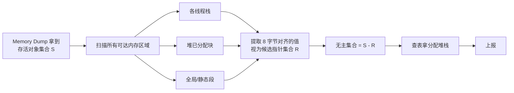

- 扫描结果必然有噪声（栈上残留、整数碰巧落在堆范围），实际工程会结合**多次扫描取交集**、**按类白名单过滤**等方式降噪
- 需要停世界或对目标页加锁，避免扫描中引用关系变化
- 内存上限较宽松场景下才能开启，线上建议灰度使用

#### OOM 治理策略

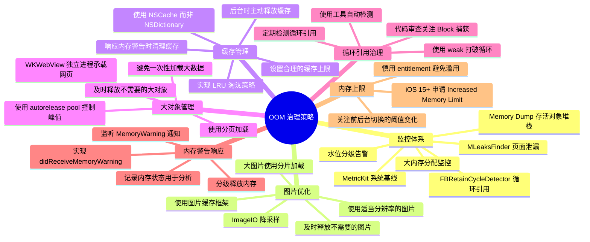

#### 图片内存占用原理

图片加载到内存后的大小与文件大小无关，而是由分辨率决定：

```
内存占用 = 宽度 × 高度 × 每像素字节数

常见格式每像素字节数：
- RGBA：4字节（最常见）
- RGB：3字节
- 灰度：1字节
```

| 图片 | 文件大小 | 分辨率 | 内存占用 |
|-----|---------|--------|---------|
| 高压缩JPG | 100KB | 4000×3000 | 4000×3000×4 = 48MB |
| 低压缩PNG | 5MB | 100×100 | 100×100×4 = 40KB |

一张 4000×3000 的图片，无论 JPG 文件多小，加载到内存都是约 48MB。这就是为什么加载大分辨率图片容易导致 OOM。

#### 大图内存监控

```objc
// 监控大图加载，及时发现内存风险
@implementation UIImage (MemoryMonitor)

+ (void)load {
    static dispatch_once_t onceToken;
    dispatch_once(&onceToken, ^{
        // Hook imageNamed:
        Method original = class_getClassMethod(self, @selector(imageNamed:));
        Method swizzled = class_getClassMethod(self, @selector(monitored_imageNamed:));
        method_exchangeImplementations(original, swizzled);
    });
}

+ (UIImage *)monitored_imageNamed:(NSString *)name {
    UIImage *image = [self monitored_imageNamed:name];
    
    if (image) {
        [self checkImageMemoryUsage:image name:name];
    }
    
    return image;
}

+ (void)checkImageMemoryUsage:(UIImage *)image name:(NSString *)name {
    CGFloat width = image.size.width * image.scale;
    CGFloat height = image.size.height * image.scale;
    
    // 计算内存占用（RGBA格式，每像素4字节）
    NSUInteger memorySize = width * height * 4;
    
    // 超过2MB的图片记录警告
    if (memorySize > 2 * 1024 * 1024) {
        NSLog(@"[MemoryWarning] Large image loaded: %@, size: %.0f×%.0f, memory: %.2fMB",
              name, width, height, memorySize / (1024.0 * 1024.0));
        
        // 上报大图监控
        [self reportLargeImage:name width:width height:height memory:memorySize];
    }
}

@end
```

#### 图片降采样

降采样是解决大图内存问题的关键方案，在加载时就将图片缩放到实际需要的尺寸：

```objc
// 图片降采样，减少内存占用
- (UIImage *)downsampleImageAt:(NSURL *)imageURL toSize:(CGSize)size {
    NSDictionary *options = @{
        (id)kCGImageSourceShouldCache: @NO
    };
    
    CGImageSourceRef source = CGImageSourceCreateWithURL((__bridge CFURLRef)imageURL, 
                                                          (__bridge CFDictionaryRef)options);
    if (!source) return nil;
    
    CGFloat maxDimension = MAX(size.width, size.height) * [UIScreen mainScreen].scale;
    
    NSDictionary *downsampleOptions = @{
        (id)kCGImageSourceCreateThumbnailFromImageAlways: @YES,
        (id)kCGImageSourceShouldCacheImmediately: @YES,
        (id)kCGImageSourceCreateThumbnailWithTransform: @YES,
        (id)kCGImageSourceThumbnailMaxPixelSize: @(maxDimension)
    };
    
    CGImageRef downsampledImage = CGImageSourceCreateThumbnailAtIndex(source, 0, 
                                                                       (__bridge CFDictionaryRef)downsampleOptions);
    CFRelease(source);
    
    if (!downsampledImage) return nil;
    
    UIImage *result = [UIImage imageWithCGImage:downsampledImage];
    CGImageRelease(downsampledImage);
    
    return result;
}

// 使用AutoreleasePool控制内存峰值
- (void)processLargeDataSet:(NSArray *)dataSet {
    for (NSInteger i = 0; i < dataSet.count; i++) {
        @autoreleasepool {
            // 处理单个数据项
            [self processItem:dataSet[i]];
            
            // 每处理100个检查一次内存
            if (i % 100 == 0) {
                uint64_t memory = [[MemoryMonitor shared] currentMemoryUsage];
                if (memory > MEMORY_THRESHOLD) {
                    // 暂停处理，等待内存释放
                    [NSThread sleepForTimeInterval:0.1];
                }
            }
        }
    }
}
```

#### 内存警告响应

```objc
@implementation AppDelegate

- (void)applicationDidReceiveMemoryWarning:(UIApplication *)application {
    // 第一级：清理缓存
    [[NSURLCache sharedURLCache] removeAllCachedResponses];
    [[SDImageCache sharedImageCache] clearMemory];
    
    // 第二级：通知各模块释放内存
    [[NSNotificationCenter defaultCenter] postNotificationName:@"AppMemoryWarning" 
                                                        object:nil];
    
    // 记录内存状态
    [self logMemoryState];
}

@end

// ViewController响应内存警告
@implementation MyViewController

- (void)didReceiveMemoryWarning {
    [super didReceiveMemoryWarning];
    
    // 只释放当前不可见或非必要的资源
    // 注意：不要释放马上会被重新访问的数据，否则会触发重新加载，反而增加内存压力
    
    // 1. 释放不在屏幕上的页面缓存
    if (!self.view.window) {
        [self.imageCache removeAllObjects];
    }
    
    // 2. 释放预加载但暂时不需要的数据
    self.preloadedData = nil;
    
    // 3. 降低缓存容量而非完全清空
    self.dataCache.countLimit = self.dataCache.countLimit / 2;
}

@end

// 推荐：使用NSCache替代NSDictionary作为缓存
// NSCache优势：
// 1. 自动响应内存警告，无需手动清理
// 2. 线程安全，无需额外加锁
// 3. 支持设置缓存数量和内存上限
// 4. 使用LRU策略自动淘汰

@interface ImageCacheManager : NSObject

@property (nonatomic, strong) NSCache<NSString *, UIImage *> *imageCache;

@end

@implementation ImageCacheManager

- (instancetype)init {
    self = [super init];
    if (self) {
        _imageCache = [[NSCache alloc] init];
        _imageCache.countLimit = 100;           // 最多缓存100张图片
        _imageCache.totalCostLimit = 50 * 1024 * 1024;  // 最大50MB
        _imageCache.name = @"com.app.imageCache";
    }
    return self;
}

- (void)cacheImage:(UIImage *)image forKey:(NSString *)key {
    if (image && key) {
        // cost可以设置为图片内存大小，用于更精确的内存控制
        NSUInteger cost = image.size.width * image.size.height * 4;
        [self.imageCache setObject:image forKey:key cost:cost];
    }
}

- (UIImage *)imageForKey:(NSString *)key {
    return [self.imageCache objectForKey:key];
}

@end
```

#### 提升进程物理内存上限（iOS 15+）

iOS 15 起，Apple 为特定场景提供了 **Increased Memory Limit** entitlement，允许 App 申请更高的物理内存限额（在支持机型上一般可提升 1 ~ 2 GB）。

**开启方式**：在 `*.entitlements` 中声明

```xml
<key>com.apple.developer.kernel.increased-memory-limit</key>
<true/>
<!-- 可选：扩展的虚拟地址空间（主要给图像/AR 场景使用 64-bit VA） -->
<key>com.apple.developer.kernel.extended-virtual-addressing</key>
<true/>
```

**效果校验**：启动后打印 `footprint + os_proc_available_memory()`，对比未开启版本差值。

**使用建议**：

- **适用场景**：图像/视频编辑、3D 游戏、AR、机器学习推理等计算密集型业务
- **不是银弹**：超过限额仍会被 Jetsam 强杀；还会提高"同设备其他 App 被后台清理"的概率，可能引发用户投诉
- **苹果审核敏感**：不合理使用可能被拒；优先优化业务内存，再把此 entitlement 作为"尾部 5% 场景"的保底
- **和 Memory Dump 搭配**：开启后仍需 Memory Dump 识别业务内 OOM 根因，否则只是把 OOM 阈值简单抬高

> iOS 16.4+ 新增 `com.apple.developer.kernel.extended-virtual-addressing` 可选项，针对需要超过 32-bit VA 的场景（如超大贴图），与 `increased-memory-limit` 独立。

---

## 防崩溃保护机制

### Method Swizzling防护

```objc
// 统一的Swizzle工具
@implementation NSObject (Swizzle)

+ (void)swizzleInstanceMethod:(SEL)originalSel with:(SEL)swizzledSel {
    Class class = [self class];
    
    Method originalMethod = class_getInstanceMethod(class, originalSel);
    Method swizzledMethod = class_getInstanceMethod(class, swizzledSel);
    
    BOOL didAddMethod = class_addMethod(class,
                                        originalSel,
                                        method_getImplementation(swizzledMethod),
                                        method_getTypeEncoding(swizzledMethod));
    
    if (didAddMethod) {
        class_replaceMethod(class,
                           swizzledSel,
                           method_getImplementation(originalMethod),
                           method_getTypeEncoding(originalMethod));
    } else {
        method_exchangeImplementations(originalMethod, swizzledMethod);
    }
}

@end
```

### NSArray防护

```objc
@implementation NSArray (CrashProtection)

+ (void)load {
    static dispatch_once_t onceToken;
    dispatch_once(&onceToken, ^{
        // __NSArrayI是不可变数组的真实类
        Class __NSArrayI = NSClassFromString(@"__NSArrayI");
        [__NSArrayI swizzleInstanceMethod:@selector(objectAtIndex:) 
                                     with:@selector(safe_objectAtIndex:)];
        
        // __NSArray0是空数组的类
        Class __NSArray0 = NSClassFromString(@"__NSArray0");
        [__NSArray0 swizzleInstanceMethod:@selector(objectAtIndex:) 
                                     with:@selector(safe_objectAtIndex:)];
        
        // __NSSingleObjectArrayI是单元素数组的类
        Class __NSSingleObjectArrayI = NSClassFromString(@"__NSSingleObjectArrayI");
        [__NSSingleObjectArrayI swizzleInstanceMethod:@selector(objectAtIndex:) 
                                                 with:@selector(safe_objectAtIndex:)];

        // __NSArrayM是可变数组的类
        Class __NSArrayM = NSClassFromString(@"__NSArrayM");
        [__NSArrayM swizzleInstanceMethod:@selector(objectAtIndex:)
                                     with:@selector(safe_objectAtIndex:)];
    });
}

- (id)safe_objectAtIndex:(NSUInteger)index {
    if (index < self.count) {
        return [self safe_objectAtIndex:index];
    }
    
    // 记录错误
    NSLog(@"Array index out of bounds: %lu >= %lu", (unsigned long)index, (unsigned long)self.count);
    
    return nil;
}

@end
```

### NSMutableDictionary防护

```objc
@implementation NSMutableDictionary (CrashProtection)

+ (void)load {
    static dispatch_once_t onceToken;
    dispatch_once(&onceToken, ^{
        Class class = NSClassFromString(@"__NSDictionaryM");
        
        [class swizzleInstanceMethod:@selector(setObject:forKey:) 
                                with:@selector(safe_setObject:forKey:)];
        
        [class swizzleInstanceMethod:@selector(setObject:forKeyedSubscript:) 
                                with:@selector(safe_setObject:forKeyedSubscript:)];
    });
}

- (void)safe_setObject:(id)anObject forKey:(id<NSCopying>)aKey {
    if (!aKey) {
        NSLog(@"Attempted to set object for nil key");
        return;
    }
    if (!anObject) {
        NSLog(@"Attempted to set nil object for key: %@", aKey);
        return;
    }
    [self safe_setObject:anObject forKey:aKey];
}

- (void)safe_setObject:(id)obj forKeyedSubscript:(id<NSCopying>)key {
    if (!key) {
        NSLog(@"Attempted to set object for nil key");
        return;
    }
    if (!obj) {
        [self removeObjectForKey:key];
        return;
    }
    [self safe_setObject:obj forKeyedSubscript:key];
}

@end
```

### NSString防护

```objc
@implementation NSString (CrashProtection)

+ (void)load {
    static dispatch_once_t onceToken;
    dispatch_once(&onceToken, ^{
        // NSString的substringFromIndex:
        Class __NSCFConstantString = NSClassFromString(@"__NSCFConstantString");
        [__NSCFConstantString swizzleInstanceMethod:@selector(substringFromIndex:) 
                                               with:@selector(safe_substringFromIndex:)];
        
        Class __NSCFString = NSClassFromString(@"__NSCFString");
        [__NSCFString swizzleInstanceMethod:@selector(substringFromIndex:) 
                                       with:@selector(safe_substringFromIndex:)];
    });
}

- (NSString *)safe_substringFromIndex:(NSUInteger)from {
    if (from > self.length) {
        NSLog(@"substringFromIndex: index %lu out of bounds; string length %lu", 
              (unsigned long)from, (unsigned long)self.length);
        return @"";
    }
    return [self safe_substringFromIndex:from];
}

@end
```

### 消息转发兜底

```objc
// 创建一个能处理任何消息的桩对象
@interface CrashStub : NSObject
+ (instancetype)shared;
@end

@implementation CrashStub

+ (instancetype)shared {
    static CrashStub *instance;
    static dispatch_once_t onceToken;
    dispatch_once(&onceToken, ^{
        instance = [[CrashStub alloc] init];
    });
    return instance;
}

// 返回方法签名
- (NSMethodSignature *)methodSignatureForSelector:(SEL)aSelector {
    // 返回一个通用的方法签名
    return [NSMethodSignature signatureWithObjCTypes:"v@:"];
}

// 处理消息
- (void)forwardInvocation:(NSInvocation *)anInvocation {
    // 什么都不做，吞掉消息
    NSLog(@"CrashStub swallowed selector: %@", NSStringFromSelector(anInvocation.selector));
}

@end
```

---

## 线上监控体系

### 崩溃率监控

```objc
// 崩溃率计算
@interface CrashRateMonitor : NSObject

@property (nonatomic, assign) NSUInteger launchCount;
@property (nonatomic, assign) NSUInteger crashCount;

@end

@implementation CrashRateMonitor

- (void)recordLaunch {
    self.launchCount++;
    [self saveToStorage];
}

- (void)recordCrash {
    self.crashCount++;
    [self saveToStorage];
}

- (double)crashRate {
    if (self.launchCount == 0) return 0;
    return (double)self.crashCount / self.launchCount;
}

// 按版本统计
- (NSDictionary *)crashRateByVersion {
    // 从存储中读取各版本的崩溃数据
    // ...
}

// 按设备统计
- (NSDictionary *)crashRateByDevice {
    // 从存储中读取各设备的崩溃数据
    // ...
}

@end
```

### 崩溃聚合

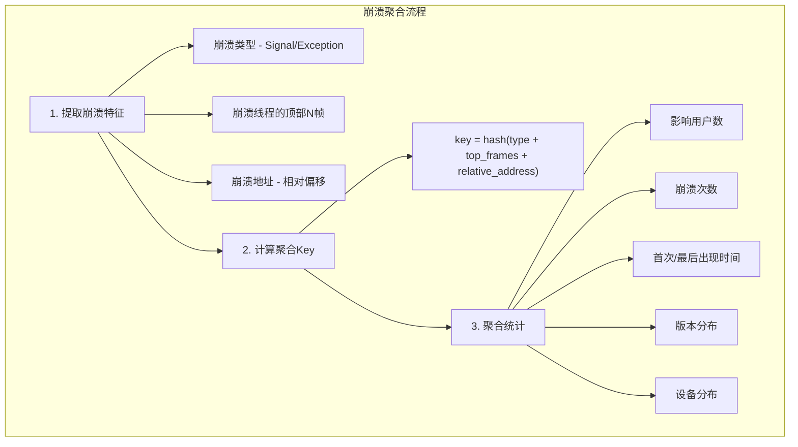

### 报警机制

```objc
// 崩溃报警配置
@interface CrashAlertConfig : NSObject

@property (nonatomic, assign) double crashRateThreshold;      // 崩溃率阈值
@property (nonatomic, assign) NSUInteger crashCountThreshold; // 崩溃次数阈值
@property (nonatomic, assign) NSTimeInterval checkInterval;   // 检查间隔

@end

// 报警检查
- (void)checkAndAlert {
    double currentCrashRate = [self.monitor crashRate];
    
    // 崩溃率超过阈值
    if (currentCrashRate > self.config.crashRateThreshold) {
        [self sendAlert:@"崩溃率超过阈值" 
                  value:currentCrashRate 
              threshold:self.config.crashRateThreshold];
    }
    
    // 新崩溃检测
    NSArray *newCrashes = [self detectNewCrashes];
    for (CrashInfo *crash in newCrashes) {
        if (crash.count > self.config.crashCountThreshold) {
            [self sendAlert:@"新增高频崩溃" crash:crash];
        }
    }
}
```

---

## 崩溃分析方法论

### 遇到崩溃的常见处理方式

> 本节聚焦"拿到崩溃后怎么做"，字段层面的字典式解读（`bug_type` / `exception` / `termination` / 寄存器 / 魔法码等）见 [崩溃日志解读]()。

线上拿到崩溃后，处理路径主要取决于**崩溃信息的完整程度**。常见场景按"完整度由高到低"分为以下四类：

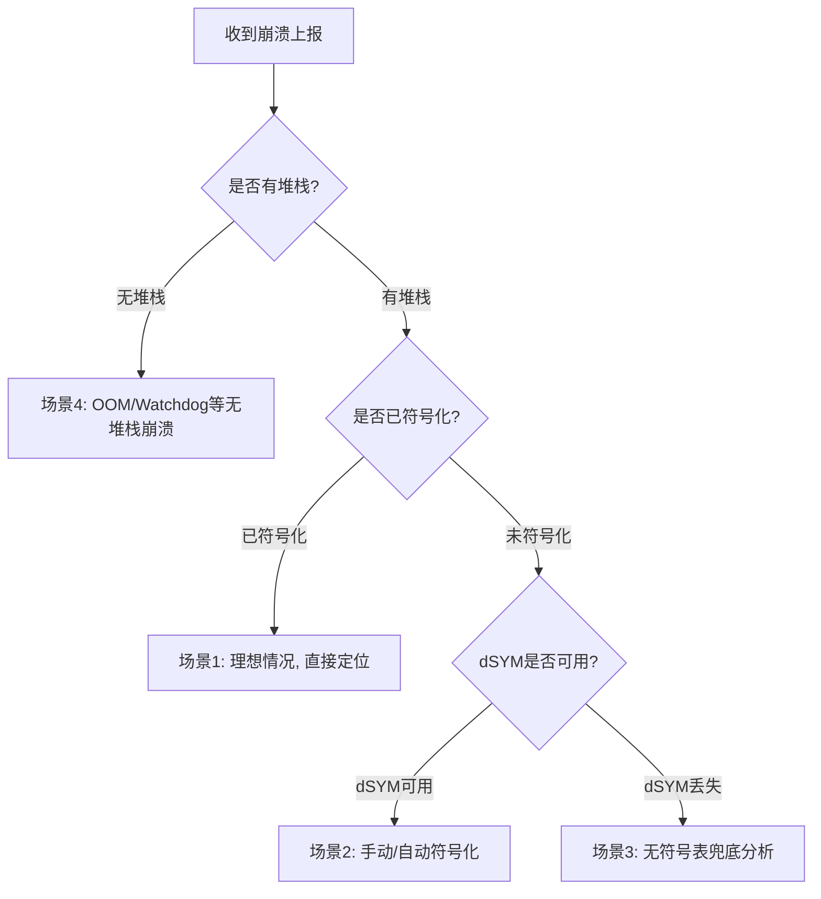

#### 场景1：有堆栈 + 已符号化（理想情况）

崩溃平台已自动完成符号化，堆栈中可以直接看到类名、方法名、文件名和行号。

**处理步骤**：

1. 根据符号化后的堆栈定位崩溃代码的具体位置
2. 结合**面包屑（Breadcrumb）**、**用户操作路径**、**设备信息**还原崩溃现场
3. 判断是自身代码问题还是系统/三方库问题
4. 代码修复 → 单元测试/回归测试 → 灰度验证 → 全量发布

#### 场景2：有堆栈 + 未符号化（只有地址）

堆栈中只有形如 `MyApp 0x104a3d234 0x104a3c000 + 4660` 的十六进制地址，常见原因：

- 崩溃平台未匹配到对应版本的 dSYM
- 上传的 dSYM 与二进制 UUID 不一致
- 本地拿到的 `.crash`/`.ips` 文件尚未符号化

**处理步骤**：

```bash
# 1. 从崩溃日志头部找到二进制的 UUID 和 Load Address
# Binary Images 段形如：
#   0x104a3c000 - 0x104b3ffff MyApp arm64  <abc123...def> /var/.../MyApp

# 2. 在 dSYM 仓库中根据 UUID 查找对应 dSYM
dwarfdump --uuid MyApp.app.dSYM
# UUID: ABC123DE-F456-... (arm64)  必须与崩溃日志中的 UUID 一致

# 3. 使用 atos 手动符号化
atos -arch arm64 \
     -o MyApp.app.dSYM/Contents/Resources/DWARF/MyApp \
     -l 0x104a3c000 \
     0x104a3d234
# 输出：-[MyClass method] (in MyApp) (MyClass.m:42)

# 4. 批量符号化整份崩溃日志
xcrun symbolicatecrash MyApp.crash MyApp.app.dSYM > symbolicated.crash

# 5. 将 dSYM 补传到崩溃平台（Bugly/Firebase/Sentry 等），触发自动重新符号化
# 例如 Firebase Crashlytics：
fastlane run upload_symbols_to_crashlytics dsym_path:./MyApp.app.dSYM
```

**注意事项**：

- `-l` 参数是镜像的**实际加载地址（Load Address）**，不是 slide，也不是 `__TEXT` 的编译时基址
- 系统库（如 UIKit、libobjc）的符号不在自己的 dSYM 中，需要对应系统版本的符号表（Xcode 首次连接设备时会自动下载到 `~/Library/Developer/Xcode/iOS DeviceSupport/`）
- 若堆栈中夹杂三方库，需要对应库的 dSYM 才能符号化

#### 场景3：有堆栈 + 无符号表（dSYM 丢失）

最棘手的情况，常见于历史版本：CI 构建未归档 dSYM、本地归档丢失、重装系统、Bitcode 重新编译导致 UUID 变化等。

**优先级 1：尝试找回 dSYM**

| 来源 | 说明 |
|-----|------|
| Xcode Organizer | `Xcode → Window → Organizer → Archives`，每次 Archive 都会保存对应 dSYM |
| App Store Connect | 开启过 Bitcode 的历史版本，Apple 会重新编译，需从 `App Store Connect → TestFlight/构建版本 → 下载 dSYM` 获取**服务端生成**的 dSYM |
| CI/CD 归档 | 检查 CI 系统（Jenkins/GitLab CI/Fastlane）是否把 dSYM 作为构建产物保存 |
| 团队云存储 | 检查对象存储、内部 dSYM 仓库（如有接入） |
| 崩溃平台 | 部分崩溃平台会保留历史上传的 dSYM，可尝试重新下载 |

找回后务必通过 `dwarfdump --uuid` 校验 UUID 与崩溃日志一致，UUID 不同则 dSYM 无效，**不能**用于符号化。

**优先级 2：无 dSYM 情况下的兜底分析**

当确认 dSYM 无法找回时，可通过以下手段尽量还原：

1. **相对偏移定位**：崩溃日志中的地址减去 Load Address 得到文件内偏移，在相同 commit/tag 重新构建一份带符号的二进制，再用 atos 对该偏移进行符号化（要求源码可回溯、编译参数一致）

   ```bash
   # 在相同 commit 重新构建
   git checkout <release-tag>
   xcodebuild archive ...   # 生成带 dSYM 的新构建
   
   # 用新 dSYM 对旧崩溃做"近似符号化"
   # 偏移 = 0x104a3d234 - 0x104a3c000 = 0x1234
   atos -arch arm64 -o NewBuild.dSYM/.../MyApp -l 0x100000000 0x100001234
   ```

   这是**近似**结果：编译器优化、依赖版本、编译时间戳等差异会导致地址不完全对应，但通常能定位到函数级别。

2. **系统库堆栈利用**：系统镜像（UIKit、Foundation 等）的符号是公开的，只要本机有对应 iOS 版本的 `DeviceSupport` 符号，就能符号化堆栈中的系统调用帧，通过系统 API 的调用路径反推业务模块（如看到 `UITableView _updateVisibleCellsNow:`，可以判断是列表刷新相关崩溃）

3. **崩溃特征聚合**：按崩溃类型（信号/异常）、信号码、故障地址特征、top-N 地址指纹做聚合，即便无法符号化单条，也能识别"某个模块存在高频崩溃"，再通过代码审查定位

4. **上下文信息推断**：
   - **面包屑**：查看崩溃前的用户操作路径，定位涉及的页面/模块
   - **自定义日志**：业务日志、网络请求日志、路由日志
   - **用户反馈**：崩溃发生时用户在做什么
   - **设备/版本分布**：是否只在特定机型、系统版本、App 版本上出现

5. **lldb image lookup**：若手头有相同构建的二进制（即使 dSYM 丢了，二进制还在），可在 lldb 中加载二进制做符号查找

   ```bash
   lldb MyApp.app/MyApp
   (lldb) image lookup --address 0x100001234
   ```

**优先级 3：建立预防机制（避免下次再遇到）**

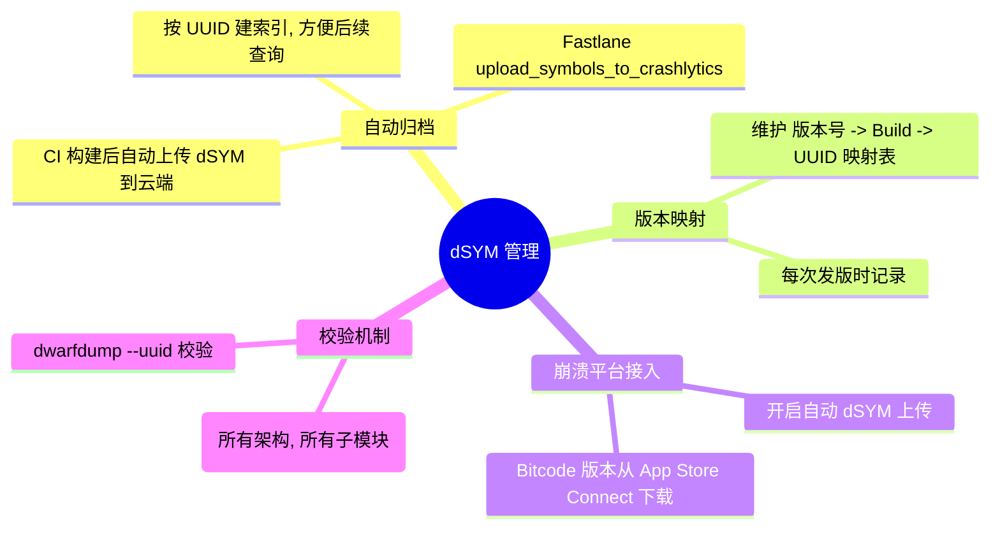

#### 场景4：无堆栈记录（OOM / Watchdog / 低电量等）

这类终止**不会生成标准崩溃日志**，表现为应用突然消失或被系统杀死。处理方式依赖其他监控手段：

| 终止类型 | 识别手段 | 分析方式 |
|---------|---------|---------|
| FOOM / BOOM | 排除法 + 内存水位 + Watchdog/电量校验 | 结合 Memory Dump（存活对象+分配堆栈）、MetricKit `MXCrashDiagnostic`、内存警告日志、大图/内存泄漏检测（详见 *[8. OOM 崩溃](#8-oomout-of-memory崩溃)*） |
| Watchdog（0x8badf00d） | MetricKit `MXHangDiagnostic`、启动超时检测 | 结合 RunLoop 卡顿监控采集**主线程堆栈快照** |
| 低电量关机 | MetricKit `MXCrashDiagnostic.exceptionReason` | 无法代码层处理，统计占比即可 |
| 用户主动杀进程 | 退出前未设置正常退出标记 | 正常场景，不计入崩溃 |

关键在于**崩溃发生前的监控数据**：内存水位、卡顿堆栈、面包屑等信息在崩溃发生时已经落盘，下次启动上报即可。

#### 处理方式速查表

| 信息完整度 | 是否可符号化 | 处理方式 | 耗时 |
|-----------|-------------|---------|------|
| 堆栈 + 已符号化 | ✅ | 直接定位修复 | 分钟级 |
| 堆栈 + dSYM 可用 | ✅ atos / 崩溃平台 | 补传 dSYM 后重新符号化 | 小时级 |
| 堆栈 + dSYM 丢失 | ⚠️ 近似符号化 | 重新构建 + 相对偏移 / 聚合分析 / 上下文推断 | 天级 |
| 无堆栈（OOM/Watchdog） | ❌ | MetricKit + 内存/卡顿监控 + 面包屑 | 依赖预埋数据 |

---

### 崩溃分析流程

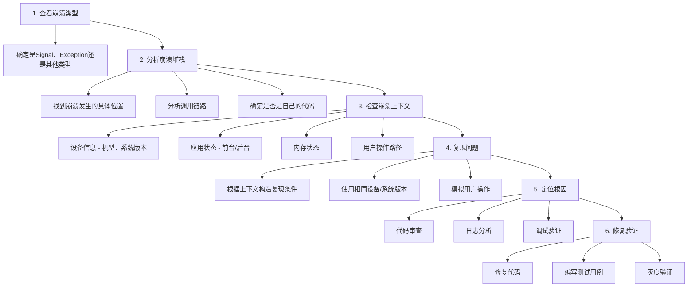

### 常见崩溃模式识别

| 模式 | 特征 | 分析方法 |
|-----|------|---------|
| **空指针访问** | EXC_BAD_ACCESS (SIGSEGV)<br>地址接近0（如0x10、0x20）<br>通常是访问了nil对象的成员 | 地址0x10可能是访问对象的第一个成员<br>检查崩溃位置的对象是否可能为nil |
| **野指针** | EXC_BAD_ACCESS<br>地址看起来像有效地址但已被释放<br>崩溃位置可能在objc_msgSend | 对象已释放但仍被访问<br>检查对象的生命周期管理<br>使用Zombie Objects调试 |
| **栈溢出** | EXC_BAD_ACCESS<br>地址在栈区域附近<br>堆栈可能显示递归调用 | 检查是否有无限递归<br>检查是否有过大的栈上分配 |
| **多线程竞争** | 崩溃不稳定，难以复现<br>崩溃位置可能在集合操作<br>多个线程操作同一数据 | 检查数据访问是否有锁保护<br>使用Thread Sanitizer检测 |

### 使用Instruments分析

| 工具 | 用途 |
|-----|------|
| **Zombies** | 检测野指针，找到被释放后仍被访问的对象 |
| **Address Sanitizer** | 检测内存问题（越界、野指针、内存泄漏） |
| **Thread Sanitizer** | 检测数据竞争和线程问题 |
| **Allocations** | 分析内存使用，找到内存峰值原因 |
| **Time Profiler** | 分析CPU使用，找到性能瓶颈 |

---

## 崩溃预防策略

### 代码规范

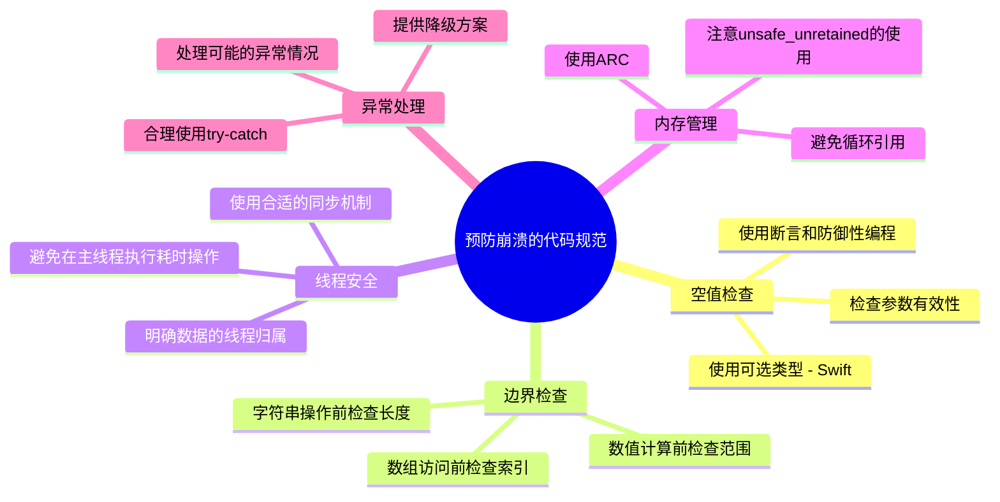

### 静态分析

```bash
# 使用Clang静态分析器
xcodebuild analyze -scheme MyApp -configuration Debug

# 常见检测项：
# - 空指针解引用
# - 内存泄漏
# - 未初始化变量
# - 逻辑错误
```

### 单元测试

```swift
// 边界条件测试
func testArraySafeAccess() {
    let array = [1, 2, 3]
    
    // 正常访问
    XCTAssertEqual(array[safe: 0], 1)
    XCTAssertEqual(array[safe: 2], 3)
    
    // 越界访问
    XCTAssertNil(array[safe: 3])
    XCTAssertNil(array[safe: 100])
    
    // 空数组测试
    let emptyArray: [Int] = []
    XCTAssertNil(emptyArray[safe: 0])
}

// 并发测试
func testConcurrentAccess() {
    let safeArray = SafeArray<Int>()
    let expectation = XCTestExpectation(description: "Concurrent access")
    expectation.expectedFulfillmentCount = 1000
    
    for i in 0..<1000 {
        DispatchQueue.global().async {
            safeArray.append(i)
            _ = safeArray.count
            expectation.fulfill()
        }
    }
    
    wait(for: [expectation], timeout: 10)
}
```

---

## 灰度发布与回滚

### 灰度策略

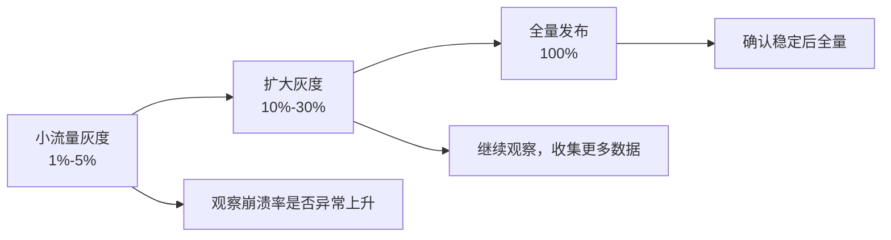

**监控指标：**
- 崩溃率变化
- 新增崩溃类型
- 用户反馈

### 热修复与降级

由于 App Store 政策限制，iOS 不支持传统的代码热修复。推荐使用以下合规方案：

```objc
// 方案1：功能开关（Feature Toggle）
// 通过服务端下发配置来控制功能的开启/关闭

@interface FeatureToggle : NSObject

+ (BOOL)isFeatureEnabled:(NSString *)featureName;
+ (void)fetchRemoteConfig;

@end

// 使用
if ([FeatureToggle isFeatureEnabled:@"new_feature"]) {
    // 新功能代码
} else {
    // 降级方案或旧逻辑
}

// 方案2：服务端降级
// 将有问题的逻辑移到服务端，通过接口返回不同的数据来规避客户端问题

// 方案3：紧急发版
// 对于严重问题，申请 App Store 加急审核（通常1-2天）
```

---

## 崩溃治理最佳实践

### 建立崩溃治理机制

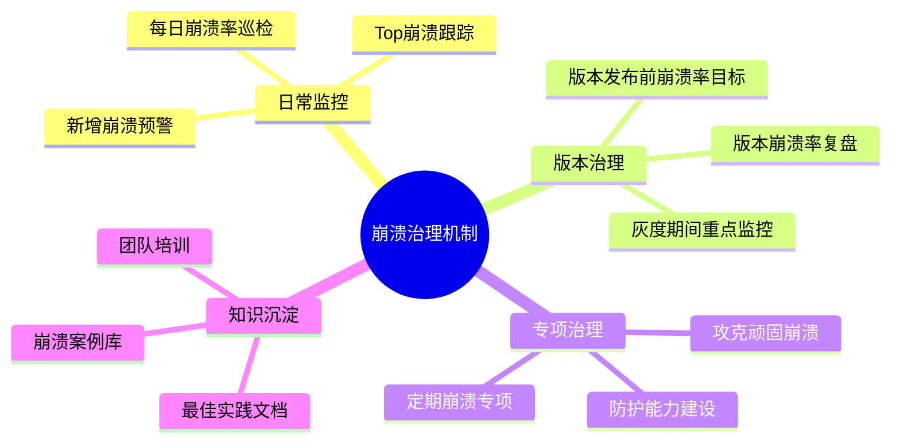
