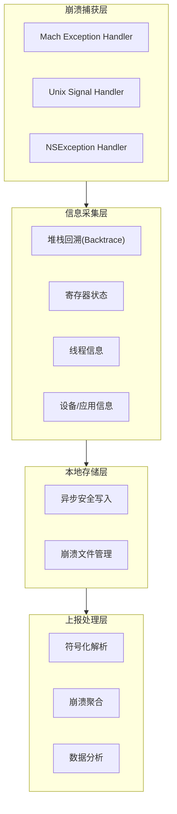
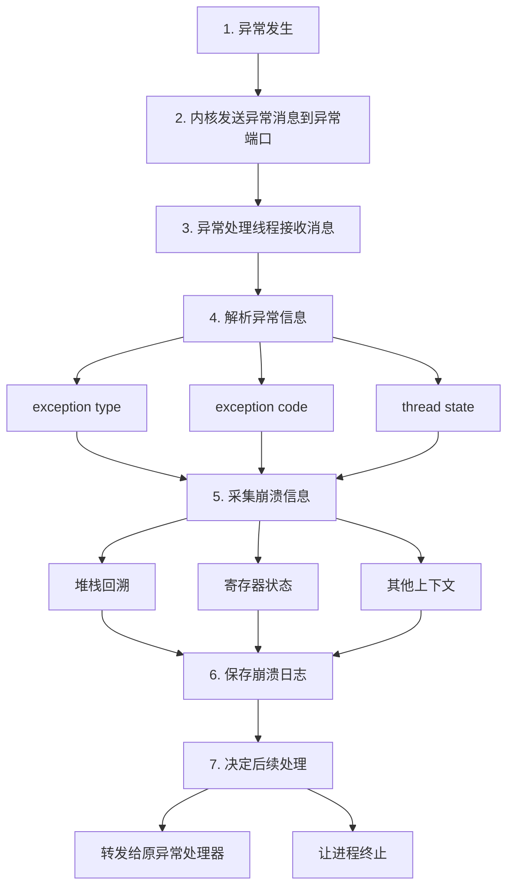
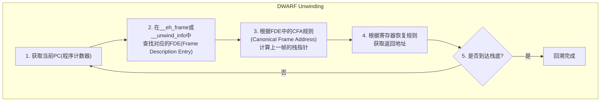

+++
title = "崩溃-采集"
date = '2026-06-21T22:41:52+08:00'
draft = false
weight = 22
tags = ["iOS", "性能优化", "稳定性", "崩溃"]
categories = ["iOS开发", "性能优化", "稳定性"]
+++
准确采集崩溃信息是分析和修复问题的前提。本文详细介绍iOS崩溃的捕获方案、堆栈回溯技术以及符号化原理。

---

## 崩溃采集架构



---

## Mach异常捕获

Mach是macOS/iOS的内核，提供了底层的异常处理机制。Mach异常是最底层的异常类型，发生在内核态，比Unix信号更早被触发。通过注册Mach异常处理器，可以在信号处理之前捕获到崩溃信息。

**核心概念**：
- **Mach Port（端口）**：Mach内核中进程间通信（IPC）的基本单元，类似于文件描述符
- **Exception Port（异常端口）**：专门用于接收异常消息的端口
- **Task**：Mach中的任务概念，对应一个进程，包含地址空间和资源

### 异常端口注册

```c
#include <mach/mach.h>

// 异常处理线程函数
static void *exception_handler_thread(void *arg) {
    mach_port_t exception_port = (mach_port_t)(uintptr_t)arg;
    
    while (1) {
        // 接收异常消息
        struct {
            mach_msg_header_t head;
            mach_msg_body_t body;
            // ... 其他字段
        } request;
        
        mach_msg_return_t result = mach_msg(
            &request.head,
            MACH_RCV_MSG | MACH_RCV_LARGE,
            0,
            sizeof(request),
            exception_port,
            MACH_MSG_TIMEOUT_NONE,
            MACH_PORT_NULL
        );
        
        if (result == MACH_MSG_SUCCESS) {
            // 处理异常
            handle_exception(&request);
        }
    }
    
    return NULL;
}

// 注册异常端口
kern_return_t register_exception_handler(void) {
    kern_return_t kr;
    mach_port_t exception_port;
    
    // 创建异常端口
    kr = mach_port_allocate(
        mach_task_self(),
        MACH_PORT_RIGHT_RECEIVE,
        &exception_port
    );
    if (kr != KERN_SUCCESS) return kr;
    
    // 添加发送权限
    kr = mach_port_insert_right(
        mach_task_self(),
        exception_port,
        exception_port,
        MACH_MSG_TYPE_MAKE_SEND
    );
    if (kr != KERN_SUCCESS) return kr;
    
    // 设置任务异常端口
    kr = task_set_exception_ports(
        mach_task_self(),
        EXC_MASK_BAD_ACCESS | EXC_MASK_BAD_INSTRUCTION | 
        EXC_MASK_ARITHMETIC | EXC_MASK_BREAKPOINT,
        exception_port,
        EXCEPTION_DEFAULT | MACH_EXCEPTION_CODES,
        THREAD_STATE_NONE
    );
    if (kr != KERN_SUCCESS) return kr;
    
    // 创建异常处理线程
    pthread_t thread;
    pthread_create(&thread, NULL, exception_handler_thread, 
                   (void *)(uintptr_t)exception_port);
    
    return KERN_SUCCESS;
}
```

### Mach异常处理流程



---

## Unix信号捕获

Unix信号（Signal）是操作系统向进程发送的异步通知机制。当发生特定事件（如非法内存访问、算术错误等）时，内核会向进程发送相应的信号。iOS中，Mach异常通常会被转换为对应的Unix信号。

**常见崩溃信号说明**：
| 信号 | 含义 | 常见原因 |
|-----|------|---------|
| SIGABRT | 程序主动中止 | 调用abort()、断言失败、未捕获的OC异常 |
| SIGSEGV | 段错误 | 访问无效内存地址、野指针 |
| SIGBUS | 总线错误 | 内存对齐问题、访问不存在的物理地址 |
| SIGFPE | 算术异常 | 除零、浮点溢出 |
| SIGILL | 非法指令 | 执行了CPU无法识别的指令 |
| SIGTRAP | 断点/陷阱 | 调试断点、__builtin_trap() |

### Signal Handler注册

```c
#include <signal.h>
#include <execinfo.h>

// 需要捕获的信号列表
static const int fatal_signals[] = {
    SIGABRT,    // abort()
    SIGBUS,     // 总线错误
    SIGFPE,     // 算术异常
    SIGILL,     // 非法指令
    SIGSEGV,    // 段错误
    SIGTRAP,    // 断点
    SIGSYS,     // 系统调用异常
};

// 保存原始的信号处理器
static struct sigaction original_handlers[32];

// 信号处理函数
static void signal_handler(int sig, siginfo_t *info, void *context) {
    // 1. 禁止重入
    static volatile sig_atomic_t handling = 0;
    if (handling) {
        return;
    }
    handling = 1;
    
    // 2. 采集崩溃信息
    collect_crash_info(sig, info, context);
    
    // 3. 恢复原始处理器并重新发送信号
    sigaction(sig, &original_handlers[sig], NULL);
    raise(sig);
}

// 注册信号处理器
void register_signal_handlers(void) {
    struct sigaction action;
    memset(&action, 0, sizeof(action));
    
    // 使用SA_SIGINFO获取更多信息
    action.sa_sigaction = signal_handler;
    action.sa_flags = SA_SIGINFO | SA_ONSTACK;
    
    // 设置备用栈（防止栈溢出时无法处理）
    stack_t ss;
    ss.ss_sp = malloc(SIGSTKSZ);
    ss.ss_size = SIGSTKSZ;
    ss.ss_flags = 0;
    sigaltstack(&ss, NULL);
    
    // 注册所有致命信号
    for (int i = 0; i < sizeof(fatal_signals)/sizeof(fatal_signals[0]); i++) {
        int sig = fatal_signals[i];
        sigaction(sig, &action, &original_handlers[sig]);
    }
}
```

### siginfo_t信息解析

```c
void parse_siginfo(siginfo_t *info) {
    // 信号编号
    int sig = info->si_signo;
    
    // 信号代码（提供更详细的原因）
    int code = info->si_code;
    
    // 发送信号的进程ID（如果是其他进程发送）
    pid_t pid = info->si_pid;
    
    // 故障地址（对于SIGSEGV/SIGBUS）
    void *addr = info->si_addr;
    
    // 根据信号类型解析code
    switch (sig) {
        case SIGSEGV:
            switch (code) {
                case SEGV_MAPERR:
                    // 地址未映射
                    break;
                case SEGV_ACCERR:
                    // 权限错误
                    break;
            }
            break;
        case SIGBUS:
            switch (code) {
                case BUS_ADRALN:
                    // 地址对齐错误
                    break;
                case BUS_ADRERR:
                    // 物理地址错误
                    break;
            }
            break;
        // ... 其他信号
    }
}
```

---

## NSException捕获

NSException是Objective-C层面的异常机制，用于处理程序运行时的错误情况。与Mach异常和Unix信号不同，NSException是应用层的异常，通常由OC运行时抛出。

**常见NSException类型**：
| 异常名称 | 含义 |
|---------|------|
| NSInvalidArgumentException | 传入无效参数，如向nil发送不支持的消息 |
| NSRangeException | 数组越界访问 |
| NSInternalInconsistencyException | 内部状态不一致 |
| NSGenericException | 通用异常 |
| NSMallocException | 内存分配失败 |

**注意**：未捕获的NSException最终会触发SIGABRT信号，因此同时注册NSException处理器和Signal处理器时需要注意避免重复记录。

### 未捕获异常处理

```objc
// 保存原始处理器
static NSUncaughtExceptionHandler *originalHandler = NULL;

// 自定义异常处理函数
void customExceptionHandler(NSException *exception) {
    // 1. 获取异常信息
    NSString *name = exception.name;
    NSString *reason = exception.reason;
    NSDictionary *userInfo = exception.userInfo;
    
    // 2. 获取调用栈
    NSArray<NSString *> *callStack = exception.callStackSymbols;
    NSArray<NSNumber *> *returnAddresses = exception.callStackReturnAddresses;
    
    // 3. 保存崩溃信息
    saveCrashReport(name, reason, callStack);
    
    // 4. 调用原始处理器（如果有）
    if (originalHandler) {
        originalHandler(exception);
    }
}

// 注册异常处理器
void registerExceptionHandler(void) {
    // 保存原始处理器
    originalHandler = NSGetUncaughtExceptionHandler();
    
    // 设置新的处理器
    NSSetUncaughtExceptionHandler(&customExceptionHandler);
}
```

### 处理器冲突问题

多个SDK可能都会注册异常处理器，需要正确处理：

```objc
// 问题：后注册的处理器会覆盖先注册的
// SDK A 注册
NSSetUncaughtExceptionHandler(&handlerA);
// SDK B 注册，handlerA被覆盖
NSSetUncaughtExceptionHandler(&handlerB);

// 解决方案：链式调用
void handlerB(NSException *exception) {
    // 处理异常
    handleException(exception);
    
    // 调用之前的处理器
    if (previousHandler) {
        previousHandler(exception);
    }
}
```

---

## 堆栈回溯技术

堆栈回溯（Stack Backtrace）是获取程序调用链的技术，通过分析调用栈可以还原崩溃时的函数调用路径。这是崩溃分析中最核心的技术之一。

### 调用栈基础概念

**什么是调用栈？**

当程序执行函数调用时，系统会在栈上为每个函数分配一块内存区域，称为栈帧（Stack Frame）。多个栈帧按调用顺序堆叠，形成调用栈。

```plaintext
函数调用示例：main() -> funcA() -> funcB() -> funcC()

内存布局（栈从高地址向低地址增长）：

高地址
┌─────────────────────────────────────────────────────┐
│                   main() 的栈帧                      │
│  ┌───────────────────────────────────────────────┐  │
│  │ 上一帧的FP (指向系统帧)        ← main的FP指向这里  │  │
│  │ 返回地址 (返回到系统)          ← main的FP+8      │  │
│  │ 保存的寄存器 / 局部变量                          │  │
│  └───────────────────────────────────────────────┘  │
├─────────────────────────────────────────────────────┤
│                   funcA() 的栈帧                     │
│  ┌───────────────────────────────────────────────┐  │
│  │ 上一帧的FP (指向main的帧)      ← funcA的FP指向这里│  │
│  │ 返回地址 (返回到main)          ← funcA的FP+8     │  │
│  │ 保存的寄存器 / 局部变量                          │  │
│  └───────────────────────────────────────────────┘  │
├─────────────────────────────────────────────────────┤
│                   funcB() 的栈帧                     │
│  ┌───────────────────────────────────────────────┐  │
│  │ 上一帧的FP (指向funcA的帧)     ← funcB的FP指向这里│  │
│  │ 返回地址 (返回到funcA)         ← funcB的FP+8     │  │
│  │ 保存的寄存器 / 局部变量                          │  │
│  └───────────────────────────────────────────────┘  │
├─────────────────────────────────────────────────────┤
│                   funcC() 的栈帧                     │
│  ┌───────────────────────────────────────────────┐  │
│  │ 上一帧的FP (指向funcB的帧)     ← funcC的FP指向这里│  │
│  │ 返回地址 (返回到funcB)         ← funcC的FP+8     │  │
│  │ 局部变量...                    ← SP指向栈顶      │  │
│  └───────────────────────────────────────────────┘  │
└─────────────────────────────────────────────────────┘
低地址

注：ARM64中，FP(x29)和LR(x30)通常作为一对保存在栈帧开头
    FP指向的位置存储上一帧的FP，FP+8存储返回地址
```

**核心概念详解**：

| 概念 | ARM64寄存器 | 说明 |
|-----|------------|------|
| 栈帧（Stack Frame） | - | 每次函数调用时在栈上分配的内存区域，包含局部变量、参数、返回地址等 |
| 帧指针（Frame Pointer, FP） | x29 | 指向当前栈帧底部，通过FP可以找到上一个栈帧 |
| 链接寄存器（Link Register, LR） | x30 | 保存函数返回地址，即调用者的下一条指令地址 |
| 栈指针（Stack Pointer, SP） | SP | 指向栈顶，即当前栈帧的最低地址 |
| 程序计数器（Program Counter, PC） | PC | 指向当前正在执行的指令地址 |

### 栈帧结构详解

在ARM64架构下，标准的栈帧布局如下：

```plaintext
ARM64 单个栈帧结构（从高地址到低地址）：

高地址
        ┌─────────────────────────┐
        │   调用者传入的参数        │  (如果参数超过8个，通过栈传递)
        ├─────────────────────────┤
FP →    │   上一帧的FP值           │  ← frame[0]，即 *(FP+0)
        ├─────────────────────────┤
FP+8 →  │   返回地址(LR)          │  ← frame[1]，即 *(FP+8)
        ├─────────────────────────┤
        │   保存的callee-saved    │
        │   寄存器 (x19-x28)      │
        ├─────────────────────────┤
        │   局部变量              │
        ├─────────────────────────┤
SP →    │   (栈顶)                │
        └─────────────────────────┘
低地址

关键点：
• FP指向当前栈帧中保存的"上一帧FP"的位置
• frame[0] = *FP = 上一帧的FP值（用于链接到上一帧）
• frame[1] = *(FP+8) = 返回地址（函数返回后执行的指令）
• FP和LR总是成对保存在栈帧开头（16字节对齐）
```

**回溯原理图解**：

```plaintext
                    栈帧链示意图
                    
     funcA的栈帧                    funcB的栈帧
    ┌────────────┐                ┌────────────┐
    │ prev FP    │ ←─┐            │ prev FP    │ ←─┐
    ├────────────┤   │            ├────────────┤   │
    │ ret addr   │   │            │ ret addr   │   │
    ├────────────┤   │            ├────────────┤   │
    │ ...        │   │            │ ...        │   │
    └────────────┘   │            └────────────┘   │
          ↑          │                  ↑          │
          │          │                  │          │
     funcA的FP ──────┘             funcB的FP ──────┘
                                        │
                                        │ frame[0]指向funcA的FP位置
                                        ↓
                                   ┌────────────┐
                                   │ funcA's FP │
                                   └────────────┘

回溯步骤：
1. 当前在funcB，FP = funcB的帧指针
2. 读取 frame[0] = *FP，得到funcA的FP地址
3. 读取 frame[1] = *(FP+8)，得到返回地址（指向funcA中的某条指令）
4. 将funcA的FP作为新的FP，重复步骤2-3
5. 直到FP为0或无效地址
```

### 回溯过程演示

假设有以下调用链，我们来演示完整的回溯过程：

```objc
// 示例代码
- (void)viewDidLoad {
    [super viewDidLoad];
    [self methodA];
}

- (void)methodA {
    [self methodB];
}

- (void)methodB {
    [self methodC];
}

- (void)methodC {
    // 崩溃发生在这里
    NSArray *arr = @[];
    arr[1]; // 数组越界
}
```

```plaintext
崩溃时的调用栈状态：

寄存器状态：
  PC = 0x100001234  (崩溃指令地址，在methodC中)
  LR = 0x100001200  (methodC的返回地址，指向methodB)
  FP = 0x16fdff100  (当前帧指针)
  SP = 0x16fdff0e0  (栈顶)

内存中的栈帧链：

地址            内容                说明
─────────────────────────────────────────────────
0x16fdff180    0x16fdff1c0        main帧的FP → 指向更上层
0x16fdff188    0x1000010a0        返回到main的地址

0x16fdff160    0x16fdff180        viewDidLoad帧的FP
0x16fdff168    0x100001080        返回到viewDidLoad

0x16fdff140    0x16fdff160        methodA帧的FP
0x16fdff148    0x100001150        返回到methodA

0x16fdff120    0x16fdff140        methodB帧的FP
0x16fdff128    0x100001200        返回到methodB

0x16fdff100    0x16fdff120        methodC帧的FP (当前FP指向这里)
0x16fdff108    0x1000011b0        返回到methodC (LR的值)

回溯步骤：
┌─────┬──────────────┬─────────────────────────────────┐
│步骤  │ 操作          │ 结果                            │
├─────┼──────────────┼─────────────────────────────────┤
│ 1   │ 记录PC        │ 0x100001234 → -[VC methodC]     │
│ 2   │ 读取FP+8      │ 0x100001200 → -[VC methodB]     │
│ 3   │ FP=*FP       │ FP = 0x16fdff120                │
│ 4   │ 读取FP+8      │ 0x100001150 → -[VC methodA]     │
│ 5   │ FP=*FP       │ FP = 0x16fdff140                │
│ 6   │ 读取FP+8      │ 0x100001080 → -[VC viewDidLoad] │
│ 7   │ FP=*FP       │ FP = 0x16fdff160                │
│ 8   │ ...          │ 继续向上回溯...                   │
└─────┴──────────────┴─────────────────────────────────┘

最终得到的调用栈：
0  MyApp  0x100001234  -[ViewController methodC] + 56
1  MyApp  0x100001200  -[ViewController methodB] + 32
2  MyApp  0x100001150  -[ViewController methodA] + 28
3  MyApp  0x100001080  -[ViewController viewDidLoad] + 64
4  UIKit  0x18a234560  -[UIViewController loadView] + 120
...
```

### 基于Frame Pointer的回溯

Frame Pointer回溯是最简单直接的方式，通过FP寄存器形成的链表遍历所有栈帧。

**方式一：使用系统API**

```c
#include <execinfo.h>

// 使用系统API获取堆栈
void backtrace_with_system_api(void) {
    void *callstack[128];
    int frames = backtrace(callstack, 128);
    char **symbols = backtrace_symbols(callstack, frames);
    
    for (int i = 0; i < frames; i++) {
        printf("%s\n", symbols[i]);
    }
    
    free(symbols);
}
```

**输出示例**：

```plaintext
0   MyApp       0x100001234 -[ViewController methodC] + 56
1   MyApp       0x100001200 -[ViewController methodB] + 32
2   MyApp       0x100001150 -[ViewController methodA] + 28
3   MyApp       0x100001080 -[ViewController viewDidLoad] + 64
4   UIKitCore   0x18a234560 -[UIViewController _sendViewDidLoadWithAppearanceProxyObjectTaggingEnabled] + 100
...
```

**方式二：手动遍历栈帧**

```c
// 手动遍历栈帧 - 更底层的实现
typedef struct StackFrame {
    struct StackFrame *previous;  // 上一个栈帧的FP
    uintptr_t return_address;     // 返回地址
} StackFrame;

void manual_backtrace(void) {
    // 获取当前函数的帧指针
    StackFrame *frame = __builtin_frame_address(0);
    int depth = 0;
    
    printf("=== 手动堆栈回溯 ===\n");
    
    while (frame && depth < 128) {
        uintptr_t pc = frame->return_address;
        
        // 打印帧信息
        printf("Frame %2d: FP=0x%016lx, RetAddr=0x%016lx\n", 
               depth, (unsigned long)frame, (unsigned long)pc);
        
        // 移动到上一个栈帧
        StackFrame *previous = frame->previous;
        
        // 安全检查：
        // 1. 地址不能太小（通常小于4KB是无效地址）
        // 2. 新的FP应该比当前FP大（栈向下增长）
        // 3. 地址应该对齐
        if ((uintptr_t)previous < 0x1000 ||
            (uintptr_t)previous <= (uintptr_t)frame ||
            ((uintptr_t)previous & 0x7) != 0) {
            break;
        }
        
        frame = previous;
        depth++;
    }
}
```

**输出示例**：

```plaintext
=== 手动堆栈回溯 ===
Frame  0: FP=0x000000016fdff100, RetAddr=0x0000000100001234
Frame  1: FP=0x000000016fdff120, RetAddr=0x0000000100001200
Frame  2: FP=0x000000016fdff140, RetAddr=0x0000000100001150
Frame  3: FP=0x000000016fdff160, RetAddr=0x0000000100001080
Frame  4: FP=0x000000016fdff180, RetAddr=0x000000018a234560
...
```

**方式三：使用内联汇编获取寄存器**

```c
// 直接读取ARM64寄存器
void backtrace_with_asm(void) {
    uintptr_t fp, lr, sp, pc;
    
    // 读取当前寄存器值
    __asm__ volatile(
        "mov %0, x29\n"  // FP
        "mov %1, x30\n"  // LR
        "mov %2, sp\n"   // SP
        "adr %3, .\n"    // PC (当前指令地址)
        : "=r"(fp), "=r"(lr), "=r"(sp), "=r"(pc)
    );
    
    printf("当前寄存器状态:\n");
    printf("  FP (x29) = 0x%016lx\n", fp);
    printf("  LR (x30) = 0x%016lx\n", lr);
    printf("  SP       = 0x%016lx\n", sp);
    printf("  PC       = 0x%016lx\n", pc);
    
    // 从FP开始回溯
    while (fp > 0x1000) {
        uintptr_t *frame = (uintptr_t *)fp;
        uintptr_t prev_fp = frame[0];
        uintptr_t ret_addr = frame[1];
        
        printf("0x%016lx\n", ret_addr);
        
        if (prev_fp <= fp) break;  // 防止无限循环
        fp = prev_fp;
    }
}
```

### Frame Pointer回溯的局限性

Frame Pointer回溯虽然简单，但存在以下问题：

```plaintext
问题1：编译器优化可能省略帧指针

当使用 -fomit-frame-pointer 优化选项时（Release模式默认开启）：
- x29寄存器不再用于保存帧指针
- 可以节省一个寄存器，提高性能
- 但会导致基于FP的回溯失效

问题2：叶子函数（Leaf Function）优化

叶子函数是不调用其他函数的函数，编译器可能不为其建立完整栈帧：
- 不保存LR到栈上（因为不会被覆盖）
- 不更新FP
- 导致回溯时可能跳过这些函数

问题3：内联函数

被内联的函数不会出现在调用栈中，因为它们的代码被直接嵌入到调用者中。
```

### 基于DWARF的回溯

DWARF（Debugging With Attributed Record Formats）是一种调试信息格式标准，广泛用于Unix-like系统。当编译器开启优化后可能会省略帧指针（-fomit-frame-pointer），此时需要依赖DWARF信息进行堆栈回溯。

**为什么需要DWARF？**

```plaintext
Frame Pointer方式的假设：
  FP → [上一帧FP][返回地址] → [上一帧FP][返回地址] → ...

但优化后的代码可能：
  - 不使用FP寄存器
  - 栈帧大小不固定
  - 返回地址位置不确定

DWARF解决方案：
  为每个函数记录详细的栈帧描述信息，包括：
  - 如何计算上一帧的栈指针（CFA规则）
  - 各个寄存器保存在哪里（寄存器恢复规则）
```

**关键数据结构**：

| 结构 | 说明 |
|-----|------|
| __eh_frame | 异常处理帧信息段，包含堆栈展开所需的数据，遵循DWARF标准 |
| __unwind_info | Apple优化的紧凑展开信息格式，比__eh_frame更节省空间 |
| CIE（Common Information Entry） | 公共信息条目，包含多个FDE共享的信息 |
| FDE（Frame Description Entry） | 帧描述条目，描述单个函数的栈帧布局 |
| CFA（Canonical Frame Address） | 规范帧地址，通常等于调用者的SP值 |

**DWARF展开信息示例**：

```plaintext
假设函数 methodA 的DWARF信息：

FDE for methodA (地址范围: 0x100001100 - 0x100001180):

  指令偏移    CFA规则              寄存器恢复规则
  ─────────────────────────────────────────────────────
  +0         CFA = SP + 0         (函数入口)
  +4         CFA = SP + 32        (分配栈空间后)
  +8         CFA = SP + 32        x29 = [CFA - 32]
                                  x30 = [CFA - 24]
  ...
  
解读：
- 在偏移+0处（函数入口），CFA就是当前SP
- 在偏移+4处，栈指针下移了32字节，CFA = SP + 32
- 在偏移+8处，x29保存在CFA-32的位置，x30保存在CFA-24的位置

回溯时：
1. 根据PC找到对应的FDE
2. 根据PC在函数内的偏移，找到对应的CFA规则
3. 计算CFA = SP + 32
4. 从[CFA-24]读取返回地址
5. 将CFA作为上一帧的SP，继续回溯
```



**查看DWARF信息的命令**：

```bash
# 查看可执行文件的DWARF展开信息
dwarfdump --eh-frame MyApp

# 查看Apple的compact unwind info
xcrun dyldinfo -unwind MyApp

# 输出示例
__TEXT.__unwind_info:
   0x100001100  [0x00000080] frameless  stack-size=32
   0x100001180  [0x00000040] frameless  stack-size=16
   0x1000011c0  [0x02000000] frame-based
```

### 两种回溯方式对比

| 特性 | Frame Pointer回溯 | DWARF回溯 |
|-----|------------------|-----------|
| 实现复杂度 | 简单 | 复杂 |
| 运行时开销 | 极低 | 较高（需要解析DWARF数据） |
| 优化代码支持 | 不支持 | 支持 |
| 依赖条件 | 需要保留FP | 需要DWARF信息 |
| 适用场景 | Debug版本、简单场景 | Release版本、生产环境 |

**实际应用建议**：

```plaintext
崩溃采集SDK通常采用混合策略：

1. 首先尝试Frame Pointer回溯（快速）
2. 如果检测到帧链断裂，切换到DWARF回溯
3. 对于系统库，优先使用__unwind_info（Apple优化格式）
4. 对于第三方库，使用__eh_frame（标准DWARF格式）
```

### 获取任意线程的堆栈

在崩溃发生时，不仅需要获取崩溃线程的堆栈，还需要获取所有线程的堆栈，以便分析是否存在死锁、资源竞争等问题。

通过Mach API可以获取任意线程的寄存器状态，从而实现跨线程的堆栈回溯。

**ARM64寄存器详解**：

| 寄存器 | 别名 | 用途 | 说明 |
|-------|------|------|------|
| x0-x7 | - | 参数/返回值 | 函数调用时传递参数，x0也用于返回值 |
| x8 | - | 间接返回值 | 用于返回大型结构体 |
| x9-x15 | - | 临时寄存器 | 调用者保存（caller-saved） |
| x16-x17 | IP0/IP1 | 过程内调用 | 链接器使用 |
| x18 | - | 平台保留 | iOS中保留给系统使用 |
| x19-x28 | - | 被调用者保存 | callee-saved，函数需要保存和恢复 |
| x29 | FP | 帧指针 | 指向当前栈帧 |
| x30 | LR | 链接寄存器 | 保存返回地址 |
| SP | - | 栈指针 | 指向栈顶 |
| PC | - | 程序计数器 | 当前指令地址 |

**完整的线程堆栈获取实现**：

```c
#include <mach/mach.h>
#include <pthread.h>

// 单个栈帧信息
typedef struct {
    uintptr_t address;      // 指令地址
    const char *image_name; // 所属镜像名称
    uintptr_t image_base;   // 镜像基地址
} StackFrame;

// 线程堆栈信息
typedef struct {
    thread_t thread;
    char name[64];
    int frame_count;
    StackFrame frames[128];
    
    // 寄存器状态
    uintptr_t pc;
    uintptr_t lr;
    uintptr_t sp;
    uintptr_t fp;
} ThreadBacktrace;

// 获取指定线程的堆栈
int backtrace_thread(thread_t thread, ThreadBacktrace *bt) {
    // 1. 获取线程状态
    _STRUCT_MCONTEXT machineContext;
    mach_msg_type_number_t state_count = ARM_THREAD_STATE64_COUNT;
    
    kern_return_t kr = thread_get_state(
        thread,
        ARM_THREAD_STATE64,
        (thread_state_t)&machineContext.__ss,
        &state_count
    );
    
    if (kr != KERN_SUCCESS) {
        return -1;
    }
    
    // 2. 保存寄存器状态
    bt->thread = thread;
    bt->pc = machineContext.__ss.__pc;
    bt->lr = machineContext.__ss.__lr;
    bt->sp = machineContext.__ss.__sp;
    bt->fp = machineContext.__ss.__fp;
    
    // 3. 获取线程名称
    pthread_t pthread = pthread_from_mach_thread_np(thread);
    if (pthread) {
        pthread_getname_np(pthread, bt->name, sizeof(bt->name));
    }
    
    // 4. 开始回溯
    bt->frame_count = 0;
    
    // 第一帧：当前PC
    if (bt->pc) {
        bt->frames[bt->frame_count++].address = bt->pc;
    }
    
    // 第二帧：LR（如果PC和LR不同）
    if (bt->lr && bt->lr != bt->pc) {
        bt->frames[bt->frame_count++].address = bt->lr;
    }
    
    // 遍历栈帧
    uintptr_t fp = bt->fp;
    while (fp && bt->frame_count < 128) {
        // 安全读取内存
        uintptr_t *frame = (uintptr_t *)fp;
        
        // 验证地址有效性
        if (!is_valid_address(fp) || !is_valid_address(fp + 8)) {
            break;
        }
        
        uintptr_t next_fp = frame[0];
        uintptr_t return_addr = frame[1];
        
        if (return_addr) {
            bt->frames[bt->frame_count++].address = return_addr;
        }
        
        // 安全检查
        if (next_fp <= fp || next_fp < 0x1000) {
            break;
        }
        
        fp = next_fp;
    }
    
    return bt->frame_count;
}

// 验证地址是否可读
bool is_valid_address(uintptr_t addr) {
    // 检查地址是否在有效范围内
    if (addr < 0x1000) return false;
    
    // 使用vm_read_overwrite尝试读取
    vm_size_t size = sizeof(uintptr_t);
    uintptr_t data;
    kern_return_t kr = vm_read_overwrite(
        mach_task_self(),
        addr,
        size,
        (vm_address_t)&data,
        &size
    );
    
    return kr == KERN_SUCCESS;
}
```

**获取所有线程堆栈**：

```c
// 获取所有线程的堆栈
void backtrace_all_threads(void) {
    thread_act_array_t threads;
    mach_msg_type_number_t thread_count;
    
    // 获取所有线程
    kern_return_t kr = task_threads(mach_task_self(), &threads, &thread_count);
    if (kr != KERN_SUCCESS) {
        return;
    }
    
    printf("=== 所有线程堆栈 (%d个线程) ===\n\n", thread_count);
    
    // 获取当前线程，用于标记
    thread_t current_thread = mach_thread_self();
    
    for (mach_msg_type_number_t i = 0; i < thread_count; i++) {
        ThreadBacktrace bt = {0};
        
        int frames = backtrace_thread(threads[i], &bt);
        
        // 打印线程信息
        printf("Thread %d%s: %s\n", 
               i,
               (threads[i] == current_thread) ? " (current)" : "",
               bt.name[0] ? bt.name : "(unnamed)");
        
        printf("  Registers: PC=0x%lx LR=0x%lx SP=0x%lx FP=0x%lx\n",
               bt.pc, bt.lr, bt.sp, bt.fp);
        
        // 打印堆栈
        for (int j = 0; j < frames; j++) {
            printf("  %2d: 0x%016lx\n", j, bt.frames[j].address);
        }
        printf("\n");
    }
    
    // 释放线程数组
    for (mach_msg_type_number_t i = 0; i < thread_count; i++) {
        mach_port_deallocate(mach_task_self(), threads[i]);
    }
    vm_deallocate(mach_task_self(), (vm_address_t)threads, 
                  thread_count * sizeof(thread_act_t));
    mach_port_deallocate(mach_task_self(), current_thread);
}
```

**输出示例**：

```plaintext
=== 所有线程堆栈 (6个线程) ===

Thread 0 (current): main
  Registers: PC=0x100001234 LR=0x100001200 SP=0x16fdff0e0 FP=0x16fdff100
   0: 0x0000000100001234
   1: 0x0000000100001200
   2: 0x0000000100001150
   3: 0x0000000100001080
   4: 0x000000018a234560
   5: 0x000000018a235120
   ...

Thread 1: com.apple.uikit.eventfetch-thread
  Registers: PC=0x18b456780 LR=0x18b456700 SP=0x170123450 FP=0x170123480
   0: 0x000000018b456780
   1: 0x000000018b456700
   2: 0x000000018b455200
   ...

Thread 2: com.apple.NSURLConnectionLoader
  Registers: PC=0x18c789abc LR=0x18c789a00 SP=0x170234560 FP=0x170234590
   0: 0x000000018c789abc
   1: 0x000000018c789a00
   ...

Thread 3: (unnamed)
  Registers: PC=0x18d012345 LR=0x18d012300 SP=0x170345670 FP=0x1703456a0
   0: 0x000000018d012345
   ...
```

### 堆栈回溯的注意事项

在实际崩溃采集中，堆栈回溯需要注意以下问题：

```plaintext
1. 信号处理器中的限制
   ─────────────────────────────────────────────────
   在Signal Handler中进行堆栈回溯时：
   • 不能使用malloc（可能死锁）
   • 不能使用Objective-C方法调用
   • 需要使用预分配的缓冲区存储结果
   • backtrace_symbols()不是异步安全的，应使用backtrace()

2. 跨线程回溯的线程安全
   ─────────────────────────────────────────────────
   获取其他线程堆栈时：
   • 目标线程可能正在执行，栈内容可能变化
   • 建议先暂停目标线程（thread_suspend）
   • 回溯完成后恢复（thread_resume）
   • 注意避免死锁（不要暂停持有锁的线程）

3. 栈内存访问安全
   ─────────────────────────────────────────────────
   遍历栈帧时可能访问无效内存：
   • 使用vm_read_overwrite验证地址
   • 设置合理的最大回溯深度（如128层）
   • 检测循环引用（FP不应该回退）

4. 符号信息获取
   ─────────────────────────────────────────────────
   在崩溃时获取符号信息：
   • dladdr()在崩溃时可能不安全
   • 建议只记录地址，后续离线符号化
   • 记录所有加载的镜像信息用于符号化
```

---

## 符号化原理

符号化（Symbolication）是将崩溃堆栈中的内存地址转换为可读的函数名、文件名和行号的过程。原始崩溃日志只包含十六进制地址，需要通过dSYM文件进行符号化才能定位问题代码。

### 地址与符号的关系

```plaintext
符号化过程：

原始堆栈地址                    符号化后
────────────────────────────────────────────────────
0x100001234        →      -[MyClass method] + 56
0x100002345        →      -[MyClass caller] + 128

计算公式：
文件偏移地址 = 运行时地址 - Load Address
            = 运行时地址 - (基地址 + Slide)

其中：
- 运行时地址：崩溃时记录的实际内存地址
- Load Address：镜像的实际加载地址（可通过_dyld_get_image_header获取）
- Slide：ASLR偏移量
- 文件偏移地址：用于在dSYM符号表中查找对应符号
```

### ASLR与Slide

ASLR（Address Space Layout Randomization，地址空间布局随机化）是一种安全机制，每次程序启动时随机化代码和数据的加载地址，防止攻击者利用固定地址进行攻击。

**Slide**：实际加载地址与编译时预设地址的差值，即随机偏移量。

```plaintext
ASLR（Address Space Layout Randomization）：

每次启动时，系统会随机化可执行文件的加载地址：

┌─────────────────────────────────────────────────────────────┐
│  编译时地址（Mach-O中）                                        │
│  __TEXT段起始: 0x100000000                                   │
├─────────────────────────────────────────────────────────────┤
│  第一次运行                                                   │
│  实际加载地址: 0x100000000 + 0x12340000（slide）               │
│             = 0x112340000                                   │
├─────────────────────────────────────────────────────────────┤
│  第二次运行                                                   │
│  实际加载地址: 0x100000000 + 0x56780000（不同的slide）          │
│             = 0x156780000                                   │
└─────────────────────────────────────────────────────────────┘
```

### 获取Slide值

```objc
#import <mach-o/dyld.h>

// 获取主程序的slide
intptr_t getMainExecutableSlide(void) {
    for (uint32_t i = 0; i < _dyld_image_count(); i++) {
        const struct mach_header *header = _dyld_get_image_header(i);
        
        // 检查是否是主程序
        if (header->filetype == MH_EXECUTE) {
            return _dyld_get_image_vmaddr_slide(i);
        }
    }
    return 0;
}

// 获取所有镜像信息
void printAllImages(void) {
    for (uint32_t i = 0; i < _dyld_image_count(); i++) {
        const char *name = _dyld_get_image_name(i);
        intptr_t slide = _dyld_get_image_vmaddr_slide(i);
        const struct mach_header *header = _dyld_get_image_header(i);
        
        printf("Image: %s\n", name);
        printf("  Header: %p\n", header);
        printf("  Slide: 0x%lx\n", (long)slide);
    }
}
```

### dSYM文件

dSYM（Debug Symbol）文件是Xcode在编译时生成的调试符号文件，包含了将内存地址映射到源代码位置所需的全部信息。

**重要说明**：
- Release构建时，符号信息会从可执行文件中剥离（Strip）以减小包体积
- dSYM文件需要与对应的二进制文件UUID匹配才能正确符号化
- 每次构建都会生成新的dSYM，需要妥善保存用于线上崩溃分析

```plaintext
dSYM Bundle结构：

MyApp.app.dSYM/
└── Contents/
    ├── Info.plist              ← 包含UUID等元信息
    └── Resources/
        └── DWARF/
            └── MyApp           ← 这是一个Mach-O格式的文件，包含调试符号
```

**dSYM中的Mach-O文件内部结构**：

dSYM/DWARF/MyApp 本质上是一个Mach-O文件，符号信息存储在其特定的段（Section）中：

```plaintext
MyApp (Mach-O文件)
├── Mach-O Header
│   └── 文件类型、CPU架构、Load Commands数量等
│
├── Load Commands
│   ├── LC_SEGMENT_64 (__TEXT)
│   ├── LC_SEGMENT_64 (__DATA)
│   ├── LC_SEGMENT_64 (__DWARF)     ← DWARF调试信息段
│   ├── LC_SYMTAB                    ← 符号表位置信息
│   │   ├── symoff: 符号表在文件中的偏移
│   │   ├── nsyms: 符号数量
│   │   ├── stroff: 字符串表偏移
│   │   └── strsize: 字符串表大小
│   └── LC_UUID                      ← 用于匹配的唯一标识
│
├── __DWARF Segment (调试信息)
│   ├── __debug_info               ← 类型、变量、函数等调试信息
│   ├── __debug_abbrev             ← 调试信息的缩写表
│   ├── __debug_line               ← 地址到源代码行号的映射 ★
│   ├── __debug_str                ← 调试字符串
│   └── __debug_ranges             ← 地址范围信息
│
├── Symbol Table (符号表) ★
│   └── nlist_64结构数组，每个条目包含：
│       ├── n_strx: 符号名在字符串表中的索引
│       ├── n_type: 符号类型
│       ├── n_sect: 所属段
│       └── n_value: 符号地址（函数入口地址）
│
└── String Table (字符串表) ★
    └── 所有符号名称的字符串，如：
        "-[MyClass method]\0"
        "-[MyClass anotherMethod]\0"
        ...
```

**符号化查找过程**：

```plaintext
给定地址 0x100001234，查找符号的过程：

1. 在Symbol Table中二分查找
   找到 n_value <= 0x100001234 的最大符号
   
2. 假设找到符号：
   n_value = 0x100001200
   n_strx = 1234
   
3. 在String Table中查找
   offset 1234 → "-[MyClass method]"
   
4. 计算偏移
   offset = 0x100001234 - 0x100001200 = 0x34 (52)
   
5. 在__debug_line中查找行号
   地址 0x100001234 → MyClass.m:42
   
最终结果：-[MyClass method] + 52 (MyClass.m:42)
```

**查看dSYM内容的命令**：

```bash
# 查看Mach-O结构
otool -l MyApp.app.dSYM/Contents/Resources/DWARF/MyApp

# 查看符号表
nm MyApp.app.dSYM/Contents/Resources/DWARF/MyApp

# 查看DWARF调试信息
dwarfdump MyApp.app.dSYM

# 查看UUID（用于匹配）
dwarfdump --uuid MyApp.app.dSYM
# 输出：UUID: 12345678-ABCD-1234-ABCD-1234567890AB (arm64)

# 验证dSYM与二进制是否匹配
dwarfdump --uuid MyApp.app/MyApp
# 两者的UUID必须相同才能正确符号化
```

### 使用atos符号化

atos（Address To Symbol）是Apple提供的命令行符号化工具，可以将内存地址转换为符号信息。

**参数说明**：
- `-arch`：指定CPU架构（arm64、armv7等）
- `-o`：指定dSYM文件路径
- `-l`：指定镜像的加载地址（Load Address）

```bash
# 基本用法
# -l 参数是镜像的实际加载地址（Load Address），可从崩溃日志的Binary Images部分获取
atos -arch arm64 -o MyApp.app.dSYM/Contents/Resources/DWARF/MyApp -l 0x104a3c000 0x104a3d234

# 输出示例
-[MyClass method] (in MyApp) (MyClass.m:42)

# 批量符号化
atos -arch arm64 -o MyApp.app.dSYM/Contents/Resources/DWARF/MyApp -l 0x104a3c000 <<EOF
0x104a3d234
0x104a3e345
0x104a3f456
EOF
```

### 代码内符号化

dladdr是POSIX标准函数，可以在运行时获取指定地址对应的符号信息。但需要注意，Release版本中符号可能被剥离，此时只能获取到导出符号（如Objective-C方法）。

```objc
#import <dlfcn.h>

// 使用dladdr获取符号信息
void symbolicate_address(void *address) {
    Dl_info info;
    if (dladdr(address, &info)) {
        printf("File: %s\n", info.dli_fname);
        printf("Symbol: %s\n", info.dli_sname);
        printf("Symbol Address: %p\n", info.dli_saddr);
        printf("Offset: %ld\n", (long)((char *)address - (char *)info.dli_saddr));
    }
}
```

---

## 崩溃信息采集

### 设备和应用信息

```objc
// 采集设备信息
NSDictionary *collectDeviceInfo(void) {
    UIDevice *device = [UIDevice currentDevice];
    
    return @{
        @"model": [[UIDevice currentDevice] model],
        @"systemName": device.systemName,
        @"systemVersion": device.systemVersion,
        @"name": device.name,
        @"identifierForVendor": device.identifierForVendor.UUIDString ?: @"",
    };
}

// 采集应用信息
NSDictionary *collectAppInfo(void) {
    NSBundle *bundle = [NSBundle mainBundle];
    
    return @{
        @"bundleIdentifier": bundle.bundleIdentifier ?: @"",
        @"bundleVersion": [bundle objectForInfoDictionaryKey:@"CFBundleVersion"] ?: @"",
        @"bundleShortVersion": [bundle objectForInfoDictionaryKey:@"CFBundleShortVersionString"] ?: @"",
        @"executableName": [bundle objectForInfoDictionaryKey:@"CFBundleExecutable"] ?: @"",
    };
}

// 采集内存信息
NSDictionary *collectMemoryInfo(void) {
    struct task_basic_info info;
    mach_msg_type_number_t size = TASK_BASIC_INFO_COUNT;
    
    kern_return_t kr = task_info(mach_task_self(),
                                  TASK_BASIC_INFO,
                                  (task_info_t)&info,
                                  &size);
    
    if (kr == KERN_SUCCESS) {
        return @{
            @"residentSize": @(info.resident_size),
            @"virtualSize": @(info.virtual_size),
        };
    }
    
    return @{};
}
```

### 用户上下文信息

面包屑（Breadcrumb）是一种记录用户操作轨迹的技术，在崩溃发生时可以回溯用户的操作路径，帮助复现和定位问题。

```objc
// 面包屑（Breadcrumb）记录
@interface CrashBreadcrumb : NSObject
@property (nonatomic, strong) NSMutableArray<NSDictionary *> *breadcrumbs;
@end

@implementation CrashBreadcrumb

+ (instancetype)shared {
    static CrashBreadcrumb *instance;
    static dispatch_once_t onceToken;
    dispatch_once(&onceToken, ^{
        instance = [[CrashBreadcrumb alloc] init];
        instance.breadcrumbs = [NSMutableArray array];
    });
    return instance;
}

- (void)addBreadcrumb:(NSString *)message category:(NSString *)category {
    NSDictionary *crumb = @{
        @"timestamp": @([[NSDate date] timeIntervalSince1970]),
        @"message": message,
        @"category": category,
    };
    
    [self.breadcrumbs addObject:crumb];
    
    // 限制数量
    while (self.breadcrumbs.count > 100) {
        [self.breadcrumbs removeObjectAtIndex:0];
    }
}

@end

// 使用示例
[[CrashBreadcrumb shared] addBreadcrumb:@"User tapped login button" 
                               category:@"ui"];
[[CrashBreadcrumb shared] addBreadcrumb:@"Network request started" 
                               category:@"network"];
```

---

## 异步安全写入

异步安全（Async-Signal-Safe）是指函数可以在信号处理程序中安全调用的特性。在崩溃处理场景中，程序状态可能已经损坏，许多常用函数（如malloc、Objective-C方法调用）可能导致死锁或二次崩溃。

### 为什么需要异步安全

```plaintext
崩溃处理时的限制：

┌─────────────────────────────────────────────────────────────┐
│  在Signal Handler或Mach Exception Handler中：                │
├─────────────────────────────────────────────────────────────┤
│                                                             │
│  不能使用：                                                   │
│  • malloc/free（可能死锁）                                    │
│  • Objective-C消息发送（运行时可能损坏）                        │
│  • NSLog/printf（使用锁）                                     │
│  • 文件系统的高级API                                          │
│                                                             │
│  可以使用：                                                   │
│  • write()系统调用                                           │
│  • 预分配的内存                                               │
│  • 原子操作                                                  │
│                                                             │
└─────────────────────────────────────────────────────────────┘
```

### 安全的文件写入

```c
#include <fcntl.h>
#include <unistd.h>

// 预分配的缓冲区
static char crash_buffer[64 * 1024];
static char crash_file_path[1024];

// 初始化（在正常运行时调用）
void init_crash_writer(const char *path) {
    strncpy(crash_file_path, path, sizeof(crash_file_path) - 1);
}

// 异步安全的写入函数
void async_safe_write_crash(const char *data, size_t len) {
    // 使用底层系统调用，不使用任何可能加锁的函数
    int fd = open(crash_file_path, O_WRONLY | O_CREAT | O_TRUNC, 0644);
    if (fd < 0) return;
    
    write(fd, data, len);
    
    // 确保数据写入磁盘
    fsync(fd);
    
    close(fd);
}

// 异步安全的整数转字符串
size_t async_safe_itoa(long value, char *buffer, size_t buffer_size) {
    if (buffer_size == 0) return 0;
    
    char *ptr = buffer;
    char *end = buffer + buffer_size - 1;
    
    // 处理负数
    if (value < 0) {
        if (ptr >= end) return 0;
        *ptr++ = '-';
        value = -value;
    }
    
    // 转换数字
    char temp[32];
    int i = 0;
    do {
        temp[i++] = '0' + (value % 10);
        value /= 10;
    } while (value && i < sizeof(temp));
    
    // 反转
    while (i > 0 && ptr < end) {
        *ptr++ = temp[--i];
    }
    
    *ptr = '\0';
    return ptr - buffer;
}
```

### 使用mmap实现崩溃安全写入

mmap（内存映射文件）是崩溃采集中的关键技术，它可以将文件映射到内存，写入内存即写入文件，避免了传统文件IO的诸多问题。关于mmap的详细介绍，请参考[mmap详解]()。

**为什么崩溃采集需要mmap？**

```plaintext
传统文件写入的问题：
┌─────────────────────────────────────────────────────────────┐
│  write() 系统调用的流程：                                      │
│                                                             │
│  用户空间数据 → 内核缓冲区 → 磁盘                               │
│       ↑              ↑                                      │
│       │              │                                      │
│    需要拷贝      可能丢失（崩溃时未刷盘）                        │
│                                                             │
│  问题：                                                      │
│  1. 崩溃时内核缓冲区的数据可能丢失                               │
│  2. fsync()可能因为锁而死锁                                    │
│  3. 需要在崩溃瞬间完成写入，时间紧迫                             │
└─────────────────────────────────────────────────────────────┘

mmap的优势：
┌─────────────────────────────────────────────────────────────┐
│  mmap 的工作方式：                                            │
│                                                             │
│  用户空间 ←──映射──→ 文件                                      │
│      ↓                                                      │
│  直接写内存 = 写文件（由内核自动同步）                            │
│                                                             │
│  优势：                                                      │
│  1. 写入即持久化，不依赖显式flush                               │
│  2. 崩溃时已写入的数据不会丢失                                  │
│  3. 可以预先映射好，崩溃时直接写入                               │
│  4. 避免了文件锁的问题                                         │
└─────────────────────────────────────────────────────────────┘
```

**mmap崩溃日志实现**：

```c
#include <sys/mman.h>
#include <fcntl.h>
#include <unistd.h>

// 崩溃日志的mmap结构
typedef struct {
    int fd;                     // 文件描述符
    char *mapped_addr;          // 映射地址
    size_t mapped_size;         // 映射大小
    size_t write_offset;        // 当前写入位置
} CrashLogMmap;

static CrashLogMmap g_crash_mmap = {-1, NULL, 0, 0};

// 初始化mmap（在App启动时调用）
bool init_crash_mmap(const char *path, size_t size) {
    // 1. 打开或创建文件
    int fd = open(path, O_RDWR | O_CREAT, 0644);
    if (fd < 0) return false;
    
    // 2. 设置文件大小（必须先有足够的空间）
    if (ftruncate(fd, size) < 0) {
        close(fd);
        return false;
    }
    
    // 3. 创建内存映射
    char *addr = mmap(
        NULL,                   // 让系统选择映射地址
        size,                   // 映射大小
        PROT_READ | PROT_WRITE, // 可读可写
        MAP_SHARED,             // 共享映射（写入会同步到文件）
        fd,                     // 文件描述符
        0                       // 文件偏移
    );
    
    if (addr == MAP_FAILED) {
        close(fd);
        return false;
    }
    
    // 4. 保存映射信息
    g_crash_mmap.fd = fd;
    g_crash_mmap.mapped_addr = addr;
    g_crash_mmap.mapped_size = size;
    g_crash_mmap.write_offset = 0;
    
    // 5. 初始化为空（可选）
    memset(addr, 0, size);
    
    return true;
}

// 崩溃时写入数据（异步安全）
void crash_mmap_write(const char *data, size_t len) {
    if (!g_crash_mmap.mapped_addr) return;
    
    // 检查空间
    if (g_crash_mmap.write_offset + len > g_crash_mmap.mapped_size) {
        len = g_crash_mmap.mapped_size - g_crash_mmap.write_offset;
    }
    
    if (len == 0) return;
    
    // 直接写入映射内存（这是异步安全的）
    // 不使用memcpy，因为它可能不是异步安全的
    char *dst = g_crash_mmap.mapped_addr + g_crash_mmap.write_offset;
    for (size_t i = 0; i < len; i++) {
        dst[i] = data[i];
    }
    
    g_crash_mmap.write_offset += len;
    
    // 可选：强制同步到磁盘
    // msync(g_crash_mmap.mapped_addr, g_crash_mmap.write_offset, MS_ASYNC);
}

// 崩溃时写入字符串
void crash_mmap_write_string(const char *str) {
    size_t len = 0;
    while (str[len]) len++;  // 手动计算长度，避免调用strlen
    crash_mmap_write(str, len);
}

// 清理（下次启动时调用）
void cleanup_crash_mmap(void) {
    if (g_crash_mmap.mapped_addr) {
        munmap(g_crash_mmap.mapped_addr, g_crash_mmap.mapped_size);
        g_crash_mmap.mapped_addr = NULL;
    }
    if (g_crash_mmap.fd >= 0) {
        close(g_crash_mmap.fd);
        g_crash_mmap.fd = -1;
    }
}
```

**在Signal Handler中使用mmap**：

```c
static void crash_signal_handler(int sig, siginfo_t *info, void *context) {
    // 写入崩溃类型
    crash_mmap_write_string("Signal: ");
    
    // 写入信号编号（使用异步安全的整数转换）
    char num_buf[32];
    async_safe_itoa(sig, num_buf, sizeof(num_buf));
    crash_mmap_write_string(num_buf);
    crash_mmap_write_string("\n");
    
    // 写入崩溃地址
    crash_mmap_write_string("Fault Address: 0x");
    // ... 写入地址的十六进制表示
    
    // 写入堆栈
    crash_mmap_write_string("Backtrace:\n");
    // ... 写入堆栈地址
    
    // 数据已经在映射内存中，即使进程崩溃也会保存
    
    // 恢复默认处理并重新发送信号
    signal(sig, SIG_DFL);
    raise(sig);
}
```

**mmap vs write 对比**：

| 特性 | mmap | write + fsync |
|-----|------|---------------|
| 异步安全性 | 写入映射内存是安全的 | write是安全的，fsync可能死锁 |
| 数据持久化 | 写入即持久化 | 需要fsync，可能丢失 |
| 性能 | 高（无系统调用开销） | 较低（每次写入都是系统调用） |
| 预分配 | 需要预先分配文件大小 | 可以动态增长 |
| 复杂度 | 需要管理映射生命周期 | 相对简单 |

---

## 崩溃日志格式

崩溃日志需要包含足够的信息用于问题定位和复现。以下是一个完整的崩溃日志应包含的关键字段。

**关键字段说明**：
- **binary_images**：所有加载的动态库信息，包含UUID用于匹配dSYM
- **registers**：崩溃时的CPU寄存器状态，有助于分析崩溃原因
- **threads**：所有线程的堆栈信息，crashed标记崩溃线程

### 标准格式

```plaintext
崩溃日志标准格式：

{
  "crash_info": {
    "timestamp": 1705123456.789,
    "type": "SIGSEGV",
    "code": "SEGV_MAPERR",
    "address": "0x0000000000000010"
  },
  
  "app_info": {
    "bundle_id": "com.example.app",
    "version": "1.0.0",
    "build": "100"
  },
  
  "device_info": {
    "model": "iPhone13,2",
    "os_version": "17.0",
    "cpu_arch": "arm64"
  },
  
  "binary_images": [
    {
      "name": "MyApp",
      "uuid": "ABC123-DEF456",
      "base_address": "0x100000000",
      "size": 1048576
    }
  ],
  
  "threads": [
    {
      "index": 0,
      "crashed": true,
      "name": "main",
      "backtrace": [
        {
          "image": "MyApp",
          "address": "0x100001234",
          "symbol": "-[MyClass method]",
          "offset": 56
        }
      ]
    }
  ],
  
  "registers": {
    "x0": "0x0000000000000000",
    "x1": "0x0000000100001234",
    "pc": "0x0000000100001234",
    "lr": "0x0000000100002345",
    "sp": "0x000000016fdff000",
    "fp": "0x000000016fdff010"
  }
}
```

---

## 开源崩溃采集框架

### 常用框架对比

| 框架 | 特点 | 适用场景 |
|-----|------|---------|
| PLCrashReporter | 微软维护，稳定可靠，业界广泛使用 | 需要自建后端 |
| KSCrash | 功能丰富，支持多种后端 | 灵活定制 |
| Bugly | 腾讯出品，免费 | 快速接入 |
| Firebase Crashlytics | Google出品，与Firebase集成 | 已使用Firebase |
| Sentry | 开源，功能全面 | 需要完整APM |

---

## 崩溃上报策略

### 上报时机

```plaintext
崩溃上报时机选择：

┌─────────────────────────────────────────────────────────────┐
│                     上报时机                                 │
├─────────────────────────────────────────────────────────────┤
│                                                             │
│  1. 下次启动时上报（推荐）                                     │
│     优点：稳定可靠                                            │
│     缺点：有延迟                                              │
│                                                             │
│  2. 崩溃时立即上报                                            │
│     优点：实时性好                                            │
│     缺点：可能失败（进程即将终止）                               │
│                                                             │
│  3. 后台上报                                                 │
│     优点：不影响用户体验                                       │
│     缺点：可能被系统终止                                       │
│                                                             │
└─────────────────────────────────────────────────────────────┘
```

### 上报内容优化

```objc
// 压缩上报数据
- (NSData *)compressCrashData:(NSData *)data {
    if (data.length < 1024) return data;  // 小数据不压缩
    
    // 使用zlib压缩
    z_stream stream;
    stream.zalloc = Z_NULL;
    stream.zfree = Z_NULL;
    stream.opaque = Z_NULL;
    
    if (deflateInit2(&stream, Z_DEFAULT_COMPRESSION, Z_DEFLATED, 
                     15 + 16, 8, Z_DEFAULT_STRATEGY) != Z_OK) {
        return data;
    }
    
    NSMutableData *compressed = [NSMutableData dataWithLength:data.length];
    stream.next_in = (Bytef *)data.bytes;
    stream.avail_in = (uInt)data.length;
    stream.next_out = compressed.mutableBytes;
    stream.avail_out = (uInt)compressed.length;
    
    deflate(&stream, Z_FINISH);
    deflateEnd(&stream);
    
    compressed.length = stream.total_out;
    return compressed;
}

// 分片上报大文件
- (void)uploadLargeCrashReport:(NSData *)data {
    const NSUInteger chunkSize = 64 * 1024;  // 64KB per chunk
    NSUInteger offset = 0;
    NSUInteger chunkIndex = 0;
    NSString *uploadId = [[NSUUID UUID] UUIDString];
    
    while (offset < data.length) {
        NSUInteger length = MIN(chunkSize, data.length - offset);
        NSData *chunk = [data subdataWithRange:NSMakeRange(offset, length)];
        
        [self uploadChunk:chunk 
                uploadId:uploadId 
              chunkIndex:chunkIndex 
              totalChunks:(data.length + chunkSize - 1) / chunkSize];
        
        offset += length;
        chunkIndex++;
    }
}
```
