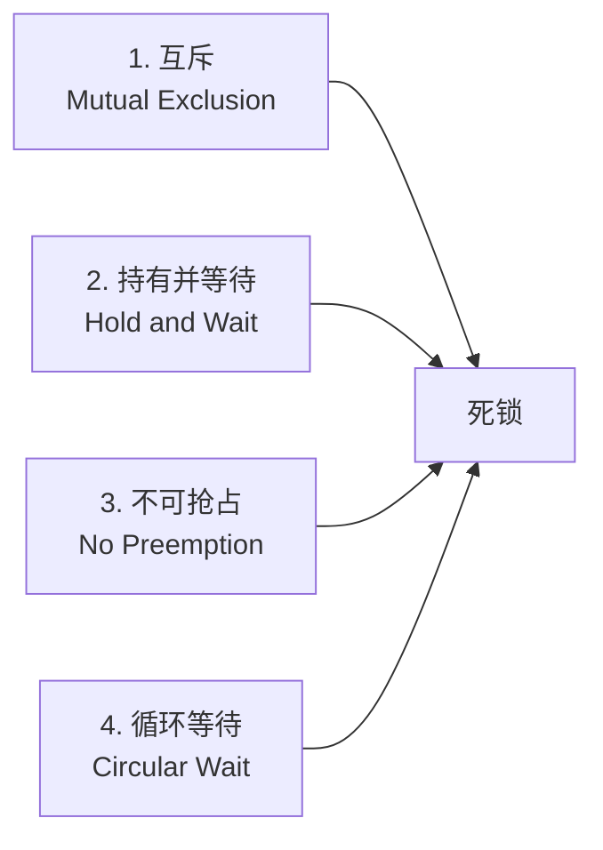
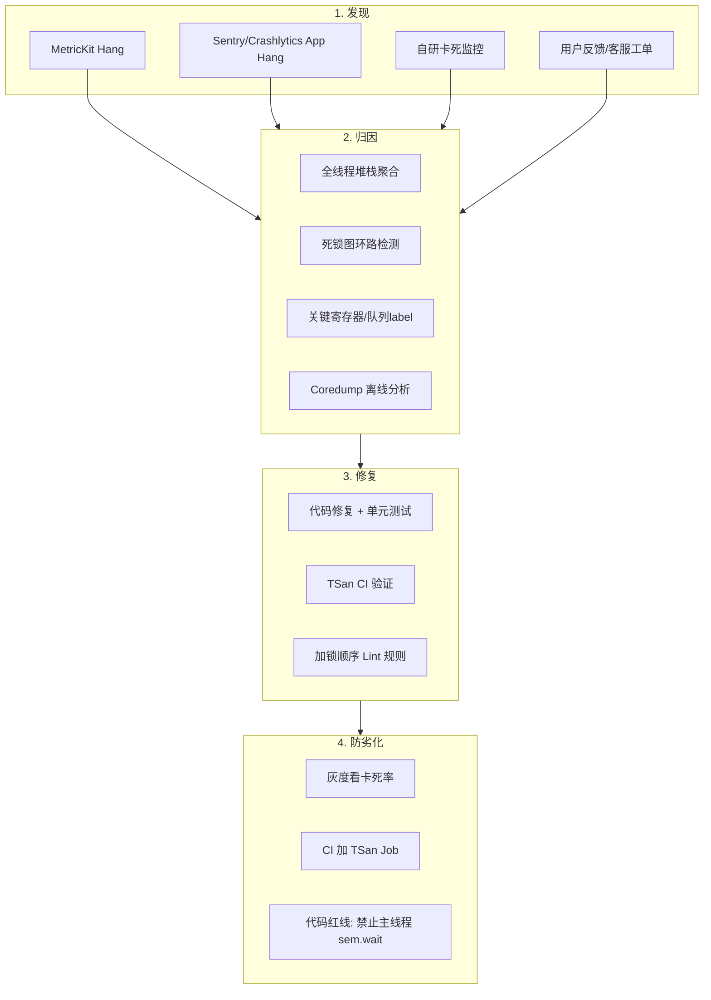

+++
title = "死锁（Deadlock）原理、常见场景与治理"
date = '2026-05-04T16:28:56+08:00'
draft = false
weight = 1
tags = ["iOS", "多线程", "死锁"]
categories = ["iOS开发", "多线程"]
+++
死锁是 iOS 多线程开发中最隐蔽、也最致命的一类稳定性问题。它不像越界、空指针那样"立刻崩溃给你看"，而是表现为主线程"卡住"——用户能感受到界面无响应、无法交互，最终被 iOS watchdog 强杀（`0x8BADF00D`），落在 Apple 崩溃日志里归为 `EXC_CRASH (SIGKILL)` 或卡死（Hang）。

本文系统梳理死锁的**四个必要条件**、iOS 生产环境中**常见的发生场景**，并结合 Apple 官方工具（TSan、Main Thread Checker、MetricKit）与业界最新实践（Sentry App Hangs、字节 Heimdallr、Swift Concurrency 的反思）讨论**如何检测与治理**。

---

## 一、死锁是什么

死锁（Deadlock）指两个或多个线程因争夺资源（锁、队列、信号量等）而互相等待，导致所有相关线程永久阻塞、无法推进的状态。

与死锁容易混淆的几个概念：

| 名称 | 核心特征 | 典型例子 |
|------|---------|---------|
| **死锁 Deadlock** | 多个线程循环等待对方持有的资源，永久阻塞 | 线程 A 持 lockA 等 lockB；线程 B 持 lockB 等 lockA |
| **活锁 Livelock** | 线程不阻塞但也不推进，不停重试互相让步 | 两个线程都检测到冲突就回退重试，永远撞在一起 |
| **饥饿 Starvation** | 低优先级线程长期分不到资源 | 高优先级线程持续抢占 CPU，导致低优先级线程持锁永远运行不完 |
| **优先级反转 Priority Inversion** | 低优先级持锁 + 高优先级自旋等锁 + 中优先级抢 CPU，高优先级被间接阻塞 | `OSSpinLock` 被废弃的根本原因 |
| **死循环 Busy Loop** | 单线程进入无限循环，CPU 占用 100% | `while(true)` 忘记 break |
| **卡顿 Hang** | 主线程执行时间超过阈值（几百 ms～几秒） | 主线程做网络、解压大图、Core Data 大量 fetch |
| **卡死 Watchdog** | 主线程卡住数秒（启动约 20s、前后台切换约 10s），触发系统强杀 | 死锁导致的卡死是最严重的一种 |

> **关键区别**：死循环线程 CPU 占用高、处于 `RUNNING` 态；死锁线程 CPU 占用为 0、处于 `WAITING/BLOCKED` 态并被换出。这一点正是线上死锁自动判定的核心依据（见"检测"章节）。

---

## 二、死锁的四个必要条件（Coffman 条件）

Coffman 等人在 1971 年证明：死锁要发生，**必须同时满足**下面四个条件，缺一不可。反过来说，**破坏任意一个**即可从根本上避免死锁。



### 1. 互斥（Mutual Exclusion）

资源同一时间只能被一个线程持有，例如 `NSLock`、`pthread_mutex_t`、`os_unfair_lock`、串行队列的"当前执行槽"。

破坏方法：使用读写锁（`pthread_rwlock`、`dispatch_barrier`）、无锁数据结构（原子操作、CAS）、线程局部存储（TLS）、值类型拷贝（Swift `struct`）。

### 2. 持有并等待（Hold and Wait）

线程持有至少一把锁，同时又去申请别的锁，且在申请失败时不释放已有资源。

破坏方法：一次性申请全部资源（两阶段锁协议）；或者用 `tryLock` + 超时回退，申请失败则**立即释放已有资源**并重试。

### 3. 不可抢占（No Preemption）

锁必须由持有者主动释放，其他线程不能强行夺走。

破坏方法：带超时的锁（`os_unfair_lock_lock_with_options` + 退避，或 `NSCondition` + 超时等待）；可取消的任务（Swift Task 的协作式取消）。

### 4. 循环等待（Circular Wait）

存在一个线程依赖链形成环：T1 → T2 → … → Tn → T1，每个线程都在等下一个线程持有的资源。

破坏方法（最常用）：**给所有锁定义全局顺序**，任何线程都按固定顺序获取。Runtime 的 `weak` 实现就是典型案例——当需要同时锁两个 `SideTable` 时，始终**先锁地址较小的**，避免循环等待（见 `knowledge/awesome-ios/articles/ios-basics/weak详解.md` L172）。

```text
破坏循环等待（全局加锁顺序）：

✅ 正确：所有线程都按 lockA → lockB 顺序

线程1: lockA.lock() → lockB.lock() → ... → unlock
线程2: lockA.lock() → lockB.lock() → ... → unlock   // 会排队等 lockA，不会循环等待

❌ 错误：顺序不一致

线程1: lockA.lock() → lockB.lock()   // 持 A 等 B
线程2: lockB.lock() → lockA.lock()   // 持 B 等 A → 死锁
```

---

## 三、iOS 中常见的死锁场景

下面按发生频率和诊断难度由高到低展开。

### 场景 1：GCD 串行队列对自身执行 sync

最经典、线上占比最高的一类死锁。

```swift
// 死锁示例 1：主线程对主队列 sync
DispatchQueue.main.sync {
    print("永远不会执行")
}

// 死锁示例 2：串行队列对自身 sync
let queue = DispatchQueue(label: "com.example.serial")
queue.async {
    queue.sync {      // ← 死锁
        print("永远不会执行")
    }
}
```

**原因**：`sync` 的语义是"把 block 排到目标队列尾部，阻塞当前线程直到 block 执行完"。而**串行队列**一次只能执行一个 block，队列正等当前 block 完成才能调度下一个，形成循环等待。

**不会死锁的情况**：

- 并发队列 `sync`：可以同时跑多个 block，不会排队等待
- 子线程对主队列 `sync`：当前线程不在主队列，主队列可以调度新 block
- 不同串行队列之间 `sync`：只要不构成 A→B→A 的环

实战中最隐蔽的一种：**二级封装下的隐式自我 sync**。

```swift
class Cache {
    private let queue = DispatchQueue(label: "cache")

    func get(_ key: String) -> Any? {
        queue.sync { _storage[key] }
    }

    func getOrCompute(_ key: String, _ compute: () -> Any) -> Any {
        queue.sync {
            if let v = _storage[key] { return v }
            let v = compute()
            _storage[key] = v
            return v
        }
    }
}

// 调用方写了这样的代码
let result = cache.getOrCompute("k") {
    cache.get("otherKey") ?? "default"   // ← 在 queue.sync 内部又调用了 queue.sync，死锁
}
```

### 场景 2：锁的循环等待

两把及以上锁以不同顺序获取。

```swift
let lockA = NSLock()
let lockB = NSLock()

// 线程 1：A → B
DispatchQueue.global().async {
    lockA.lock()
    Thread.sleep(forTimeInterval: 0.05)
    lockB.lock()        // 等线程 2 释放 B
    lockB.unlock(); lockA.unlock()
}

// 线程 2：B → A
DispatchQueue.global().async {
    lockB.lock()
    Thread.sleep(forTimeInterval: 0.05)
    lockA.lock()        // 等线程 1 释放 A → 死锁
    lockA.unlock(); lockB.unlock()
}
```

### 场景 3：非递归锁的同线程重入

`NSLock`、`pthread_mutex_t`（默认 `PTHREAD_MUTEX_NORMAL`）、`os_unfair_lock` 都**不可重入**——同一线程对同一把锁二次 `lock` 会直接死锁或触发断言。

```swift
let lock = NSLock()

func outer() {
    lock.lock()
    inner()          // inner 内部再次 lock
    lock.unlock()
}

func inner() {
    lock.lock()      // ← 死锁（NSLock 会卡死；os_unfair_lock 会直接 EXC_BREAKPOINT）
    defer { lock.unlock() }
    // ...
}
```

**修复**：使用 `NSRecursiveLock` 或 `pthread_mutex_t` 的 `PTHREAD_MUTEX_RECURSIVE` 属性。但递归锁不是银弹——它只能解决"同一线程重入"，跨线程循环等待依然会死锁。

### 场景 4：dispatch_semaphore 等待死锁

用信号量把异步接口"包成同步"是线上最隐蔽的死锁源之一。

```swift
func fetchSync() -> Data? {
    let sem = DispatchSemaphore(value: 0)
    var data: Data?

    urlSession.dataTask(with: url) { d, _, _ in
        data = d
        sem.signal()
    }.resume()

    sem.wait()        // ⚠️ 如果在主线程调用，并且 dataTask 的回调被调度到主队列，就死锁
    return data
}
```

URLSession 的回调默认运行在 `delegateQueue` 的 OperationQueue（可能底层是主队列）上。如果当前线程就是回调所在的队列，且队列是串行的，`sem.wait()` 就会永远拿不到 `signal()`。

**同类问题**：把 `await` 翻译成 `sem.wait()`、把 Core Bluetooth 的 delegate 回调同步化、把 WKWebView 的 JS evaluate 同步化——只要回调队列和调用方队列存在"同一条串行链路"就会死锁。

### 场景 5：+initialize 嵌套触发

`+initialize` 在 runtime 内部由一把 `initializerLock` 保护。如果类 A 的 `+initialize` 中访问了类 B，而 B 的 `+initialize` 又反向依赖 A，两个线程同时触发就可能死锁。

```objc
// 类 A
+ (void)initialize {
    if (self == [A class]) {
        [B sharedInstance];     // 触发 B 的 +initialize
    }
}

// 类 B
+ (void)initialize {
    if (self == [B class]) {
        [A sharedInstance];     // 触发 A 的 +initialize → 循环等待
    }
}
```

**规避**：`+initialize` 中只做"自身"必要初始化，不要调用外部类；需要跨类协作的初始化放到显式 `+load`（单线程）或懒加载入口做。

### 场景 6：FMDB / Core Data 嵌套队列

FMDB 的 `inDatabase:` / `inTransaction:` 内部就是一个串行队列的 `sync`。如果 block 里再次调用 `inDatabase:`，就是场景 1 的翻版（见 `knowledge/awesome-ios/articles/ios-basics/iOS中的数据库.md` L484）。

```objc
[dbQueue inDatabase:^(FMDatabase *db) {
    // ...
    [self.dbQueue inDatabase:^(FMDatabase *db2) {   // ← 死锁
    }];
}];
```

Core Data 的 `performAndWait:` 同理——在同一个 `NSManagedObjectContext` 的 `performAndWait:` 内部再次 `performAndWait:` 会死锁（`NSPersistentContainer.viewContext` 特别常见）。

### 场景 7：回调里持锁 / 通知里持锁

**锁内回调外部代码**是锁设计的大忌：你不知道用户回调里会做什么，一旦他触发了另一个需要同一把锁的路径，就死锁。

```swift
final class EventCenter {
    private let lock = NSLock()
    private var observers: [(Event) -> Void] = []

    func notify(_ e: Event) {
        lock.lock()
        for o in observers {
            o(e)            // ← 用户回调中又调用了 self.addObserver / self.notify → 死锁
        }
        lock.unlock()
    }
}
```

**修复**：采取 RxSwift 里那种"锁内拿快照、锁外发通知"模式（见 [RxSwift源码导读]()）：

```swift
func notify(_ e: Event) {
    lock.lock()
    let snapshot = observers         // 拿快照
    lock.unlock()

    for o in snapshot { o(e) }       // 锁外回调
}
```

### 场景 8：Signal Handler / 异常处理中的死锁

崩溃采集器在 `SIGSEGV` handler 中调用了 `malloc`、`NSLog`、Objective-C runtime、`dyld` 函数——这些都可能在崩溃点已经持锁，handler 中再次申请同一把锁会立刻死锁。

Sentry Cocoa SDK 2024 年曝光过一个真实案例：`sentrycrashdl_dladdr` 号称 async-signal-safe，但内部调用了 `_dyld_get_image_header`，而后者在所有线程被挂起时会尝试申请 dyld 锁，形成死锁（[sentry-cocoa#4056](https://github.com/getsentry/sentry-cocoa/issues/4056)）。

**规避**：Signal Handler 中只调用 [async-signal-safe](https://man7.org/linux/man-pages/man7/signal-safety.7.html) 函数（`write`、`_exit`、`sigaction`），堆栈采集用无锁 ring buffer 写到子线程异步落盘（见 [崩溃-信号处理]()、[崩溃-Mach异常]()）。

### 场景 9：Swift Concurrency 下的死锁

Swift 并发模型**有意设计成 actor 可重入**（reentrant），核心动机正是避免死锁——actor 在 `await` 挂起期间会让出隔离域，让其他任务进来。但以下情形仍能把 Swift Concurrency 写出死锁。

#### (a) 主线程阻塞等待主线程任务

```swift
@MainActor func doWork() {
    let sem = DispatchSemaphore(value: 0)
    Task { @MainActor in
        await loadData()
        sem.signal()
    }
    sem.wait()        // ← 主线程被阻塞，@MainActor 的 Task 永远没机会跑
}
```

#### (b) Task.detached 反串回主线程 + 外层 DispatchSemaphore

```swift
func syncWrap() -> Int {
    let sem = DispatchSemaphore(value: 0)
    var result = 0
    Task.detached {
        result = await Self.compute()   // compute 内部 hop 回 MainActor → 主线程在 wait，永远死
        sem.signal()
    }
    sem.wait()
    return result
}
```

#### (c) actor 循环依赖（较少见，系统通过重入避免）

按照 Hacking with Swift 和 Apple Developer Forums 2025 年的讨论，actor 之间如果**非 await** 地互相持有对方并依赖同步访问，依然能构造出类似死锁的 suspended 链。实践上更常见的是 actor 重入导致的**状态损坏**（而非真死锁），见 [Fazm：Actor Reentrancy](https://fazm.ai/blog/taskgate-actor-reentrancy-macos-state-corruption)。

**治理原则**（社区共识）：

- 永远不要在 async 接口外面再用 `DispatchSemaphore.wait()` 把它"同步化"，尤其不要在主线程
- actor 内部修改状态**在 `await` 之前**完成，避免重入破坏不变量（TaskGate 模式）
- 用 `nonisolated` 标记不需要隔离的方法，减少 hop
- 用 `Task.detached` 跳出当前 actor，打破可能的循环

### 场景 10：主线程等待后台锁导致 watchdog

这是 2025 年 Firebase iOS SDK 一个高热度 Issue（[firebase-ios-sdk#15394](https://github.com/firebase/firebase-ios-sdk/issues/15394)）的核心现象——`FirebaseCoreInternal.UnfairLock` 在 app foreground 阶段被后台任务长时间持有，主线程申请同一把锁时被阻塞超过 5 秒，触发 `0x8BADF00D`。

这类问题在崩溃日志里表现为：崩溃线程（线程 0）停在 `os_unfair_lock_lock` 附近，另一个线程停在长耗时操作 + 持锁中。严格说这不是经典的"循环等待"死锁，但**用户感知与死锁等价**，也应纳入治理。

### 场景 11：@synchronized 的对象被释放

```objc
@synchronized(obj) {
    // obj 可能在这里被 release → 下次进入时 obj 地址复用给别的对象
}
```

`@synchronized` 以对象地址做 key 在一个全局哈希表里找 `pthread_mutex`。对象释放后地址被复用，不同对象拿到同一把锁，会造成**意外的锁竞争**甚至死锁。现代项目推荐用 `os_unfair_lock`、`NSLock`、Swift `Mutex`（iOS 18+，`synchronization` 框架）替代。

### 场景 12：读写锁误用

`pthread_rwlock`：一个线程持有读锁后再申请写锁会升级死锁；写锁未释放又申请读锁同样死锁（实现定义行为，不可依赖）。

`dispatch_barrier`：barrier 块执行时独占队列，如果 barrier 内部再往同一队列派 sync 任务，等价于场景 1。

---

## 四、如何检测死锁

死锁的检测分为**开发期**和**线上期**两条线。开发期追求"立刻捕获、信息完整"；线上期追求"低开销、可归因"。

### 4.1 开发期工具

#### （1）Thread Sanitizer（TSan）

Xcode 内置，基于 LLVM 的 runtime 检测工具。除了数据竞争，还能检测：

- 未解锁就销毁的 mutex
- 未释放的锁（线程退出前还持有锁）
- 部分死锁场景（lock order inversion）

**启用**：`Product → Scheme → Edit Scheme → Diagnostics → Thread Sanitizer`。注意 TSan 会让编译和运行速度下降 2–20 倍，只在 Debug/CI 启用，禁止进 Release。

**2025 年进展**：LLVM 在 2025 年 8 月合入了修复（[llvm#151495](https://github.com/llvm/llvm-project/commit/cb1f1a703b5c90921f57315ddb395e7ad9cce756)），解决了 Apple 平台上 TSan 报告过程本身的死锁问题，Xcode 16.x/17.x 中更稳定。

```swift
// TSan 会报告 lock order inversion:
// ThreadSanitizer: lock-order-inversion (potential deadlock)
//   Mutex M1 acquired here while holding mutex M2 in thread T1
//   Mutex M2 previously acquired by the same thread here
```

#### （2）Main Thread Checker

默认启用。当 UIKit 调用被放到非主线程时报警——它不直接抓死锁，但能预防"主线程被 hop 回去再死锁"这类隐患。

#### （3）Xcode 调试器 + lldb

断点卡住时，在 lldb 中执行：

```shell
(lldb) thread list              # 列出所有线程
(lldb) thread backtrace all     # 或 `bt all`，打印每个线程的堆栈
(lldb) thread select 3          # 切到怀疑卡住的线程
(lldb) register read             # 看寄存器（可读出队列 label 等）
```

死锁堆栈的典型特征：

- 多个线程停在 `__psynch_mutexwait`、`_pthread_cond_wait`、`_dispatch_sync_wait`、`semaphore_wait_trap`
- 栈顶上面是 `pthread_mutex_lock` / `os_unfair_lock_lock` / `dispatch_semaphore_wait`
- 相互的栈帧里能看到对方持锁的代码路径

#### （4）Instruments – System Trace

`Profile → System Trace` 模板提供 Thread State / Lock 分析，能把线程在 `Running / Blocked / Runnable` 的时间序列画出来，看到谁在等谁。适合复现得出来的死锁。

#### （5）clang 静态分析

Clang Static Analyzer 能检测一些简单的"持锁返回前未 unlock"、"二次 lock"问题：

```bash
xcodebuild analyze -scheme MyApp -configuration Debug
```

#### （6）编译期：`@MainActor` 与 Sendable 检查

Swift 6 打开严格并发检查后，编译器会把"从错误 actor 访问状态"、"非 Sendable 跨并发传递"这类容易演化成死锁的代码在编译期拦下。

### 4.2 线上检测方案

线上检测的目标是：**App 在用户手机卡住时，自动判定是死锁、抓到全线程堆栈、关联崩溃上报**。

#### （1）MetricKit MXHangDiagnostic（iOS 14+）

Apple 官方方案，零侵入。`MXHangDiagnostic` 提供：

- `hangDuration`：主线程无响应时长
- `callStackTree`：整次 hang 的调用栈（完整 flamegraph，自 Sentry PR #7185 起可正确解析）

```swift
import MetricKit

class HangMonitor: NSObject, MXMetricManagerSubscriber {
    func didReceive(_ payloads: [MXDiagnosticPayload]) {
        for payload in payloads {
            payload.hangDiagnostics?.forEach { hang in
                log("Hang: \(hang.hangDuration), stack: \(hang.callStackTree)")
            }
        }
    }
}

MXMetricManager.shared.add(HangMonitor())
```

**局限**：只能事后第二天回捞，且无法判断"死锁"还是"死循环"或"纯耗时"——需要自己结合堆栈分析。

#### （2）RunLoop Observer + 子线程 watchdog（业界主流）

监听主线程 RunLoop 的状态迁移，子线程定时检查主线程是否长时间停留在某一状态。见 `卡顿/卡顿-检测.md` 第 2 节。

伪代码：

```swift
// 子线程循环
while true {
    let status = DispatchSemaphore.wait(timeout: .now() + .milliseconds(500))
    if status == .timedOut {
        if mainThreadState == .beforeSources || mainThreadState == .afterWaiting {
            // 主线程卡在执行某任务 → 抓堆栈
            captureAllThreadBacktraces()
        }
    }
}
```

关键扩展（字节 Heimdallr / 抖音稳定性方案，见 [掘金 7037454684453339144](https://juejin.cn/post/7037454684453339144)）：

1. **卡顿 → 卡死的升级**：阈值 T1（如 250ms）算卡顿抓栈；阈值 T2（如 8s）算卡死，上报所有线程堆栈
2. **退火采样**：卡顿持续时每 200ms 再抓一次栈，相同栈计数；相同栈累积超过阈值才判定为"真实"卡顿点（避免掐在无关栈帧上）
3. **后台过滤**：App 在 background 被 suspend 时主线程本就不跑，要排除这类误报
4. **死锁判定**（关键）：对所有线程用 `thread_info(thread, THREAD_BASIC_INFO, ...)` 读取 `run_state`：
   - `TH_STATE_WAITING` + 栈顶是 `__psynch_mutexwait` / `semaphore_wait_trap` / `dispatch_sync_wait` → 死锁嫌疑
   - `TH_STATE_RUNNING` + 主线程 CPU 占用高 → 死循环嫌疑
5. **死锁图构建**：拿到每个"wait" 线程正在等的那把锁（从 `pthread_mutex_t` 内部结构体的 `_owner` 字段读出持有者 tid），建立 `等待 → 持有 → 等待` 的有向图，**判环即死锁**

```c
// 读主线程状态
thread_basic_info_data_t info;
mach_msg_type_number_t count = THREAD_BASIC_INFO_COUNT;
thread_info(main_thread, THREAD_BASIC_INFO, (thread_info_t)&info, &count);

if (info.run_state == TH_STATE_WAITING &&
    (info.flags & TH_FLAGS_SWAPPED) == 0 &&
    info.cpu_usage == 0) {
    // 典型死锁态：等待中、被换出、CPU 为 0
}
```

#### （3）Signal 触发的堆栈采集

主线程陷在某个系统调用时，`backtrace()` 可能抓不到业务栈。业界做法是从子线程向主线程发 `SIGURG` / `SIGUSR1`，在 signal handler 里 `backtrace`：

```c
// 子线程
pthread_kill(main_thread, SIGURG);

// signal handler（主线程）
void handler(int sig) {
    void *frames[128];
    int n = backtrace(frames, 128);
    // 写到 ring buffer 由子线程异步落盘
}
```

> 注意：signal handler 不能 `malloc`、不能 Objective-C 方法调用，否则递归死锁（见"场景 8"）。

#### （4）三方 SDK：Sentry App Hangs / Firebase Crashlytics

**Sentry iOS SDK**（v8+ 默认开启 App Hangs，v8.30+ 支持动态开关）：

- 专用 watchdog 线程 `io.sentry.AppHangTracker`，默认 2s 阈值
- v8.x 起区分 **fully-blocking**（无响应）与 **non-fully-blocking**（延迟但恢复），后者以"non-fatal hang"上报
- 自动抓所有线程堆栈

```swift
SentrySDK.start { options in
    options.enableAppHangTracking = true
    options.appHangTimeoutInterval = 2.0
    options.enableAppHangTrackingV2 = true
}
```

**Firebase Crashlytics**：从 2024 下半年的版本开始集成 MetricKit Hang，能把 `MXHangDiagnostic` 归到 Crashlytics 控制台。

#### （5）字节 Heimdallr / 抖音 APM Plus

字节 APM 团队 2021 年公开的方案（[ByteDanceTech/114528899](https://blog.csdn.net/ByteDanceTech/article/details/114528899)）具体做了以下工程化：

- 卡死阈值 8s（比 watchdog 20s 提前触发，避免进程被 kill 前数据丢失）
- 采样上报时同时保存到本地，下次启动时合并上报
- Coredump 能力：对 top 栈 + 寄存器 + 关键内存做快照，离线用 lldb 分析
- 死锁线程分析：线程状态 + 锁持有者图 + PC 符号化后的函数名匹配 `*_lock`, `*_wait`

国内多家 APM（腾讯 Matrix、阿里 EMAS、美团 Lancer）都有类似实现。Matrix iOS 开源代码 `WCBlockMonitorMgr` 可以作为参考。

### 4.3 死锁的离线归因

拿到崩溃日志 / ips 后，按下面清单核对：

| 现象 | 可能的死锁类型 |
|------|---------------|
| 线程 0 停在 `_dispatch_sync_wait` | 串行队列 sync 自身或主队列 sync |
| 线程 0 停在 `__psynch_mutexwait` | NSLock/pthread_mutex 循环等待 |
| 线程 0 停在 `os_unfair_lock_lock` | UnfairLock 争用（见 Firebase 案例） |
| 线程 0 停在 `semaphore_wait_trap` | DispatchSemaphore 同步化 async 接口 |
| 多个线程都在 `pthread_cond_wait` | 条件变量未被 signal |
| 崩溃类型 `EXC_RESOURCE WAKEUPS` | CPU 忙等（活锁/死循环） |
| 崩溃类型 `SIGKILL` + Termination Reason `SPRINGBOARD` / `WATCHDOG` | 主线程卡死超时 |

---

## 五、死锁治理：从预防到闭环

死锁治理不是单纯写几条"禁止使用某 API"的规范，而是一套闭环：**事前降低引入概率，事中及时发现并保留现场，事后完成归因、修复和防劣化**。代码规范属于事前准入的一部分；真正的治理还要覆盖线上监控、问题分型、根因修复、灰度验证和规则沉淀。

### 5.1 事前：预防与准入

事前目标是尽量在设计、编码、Review、CI 阶段破坏 Coffman 条件，让死锁没有发生空间。

#### 1. 设计上减少共享可变状态

- 用 **actor** 替代显式锁
- 用 **串行队列** 封装状态，外部只通过 `queue.async` 访问
- 用 **值类型 + copy-on-write** 代替引用共享
- 用 **`@MainActor`** 约束 UI 状态只能在主线程读写

```swift
// 推荐：actor 替代 NSLock
actor Cache {
    private var storage: [String: Data] = [:]
    func get(_ k: String) -> Data? { storage[k] }
    func set(_ k: String, _ v: Data) { storage[k] = v }
}
```

#### 2. 统一加锁顺序

所有锁排一个全局顺序，任何线程要同时持多把锁时一律按顺序申请，从设计上破坏"循环等待"。

```swift
// 用地址做天然的全局顺序
func lock(_ a: NSLock, _ b: NSLock) {
    let (first, second) = ObjectIdentifier(a) < ObjectIdentifier(b) ? (a, b) : (b, a)
    first.lock()
    second.lock()
}
```

#### 3. 缩短临界区，不在锁内做不可控事情

锁内只做共享状态读写，不做网络、I/O、数据库大事务、图片解码、复杂计算，也不调用用户闭包、delegate、通知、KVO 或可被子类重写的方法。正确模式是：**锁内拿快照，锁外执行副作用**。

#### 4. 避免同步等待异步结果

不要把网络、蓝牙、WKWebView、delegate 回调等异步接口包成 `DispatchSemaphore.wait()` / `DispatchGroup.wait()` 的同步 API，尤其不能在主线程或回调所在串行队列上等待。需要桥接旧接口时优先使用 `withCheckedContinuation`。

#### 5. 工程准入：红线、Review、Lint、CI

1. **主线程禁止** `DispatchSemaphore.wait`、`sync` 自身串行队列、`performAndWait` 嵌套
2. **任意线程禁止** 在持锁状态下调用用户闭包 / 发通知 / 派发到其他队列 sync
3. **禁止** 在 `+load` / `+initialize` 中跨类调用
4. **禁止** 用 `@synchronized(obj)` 保护可能被释放的对象
5. **要求** 任何获取两把及以上锁的函数注释加锁顺序
6. **要求** 信号量、条件变量的 wait 必须配超时
7. **要求** 新并发代码优先 actor / async-await，显式锁需 Code Review 双人确认

这些规则可以通过 SwiftLint 自定义规则、pre-commit hook、CI 中的 TSan Job 和 Swift 严格并发检查落地：

```yaml
# .swiftlint.yml
custom_rules:
  no_semaphore_wait_on_main:
    regex: '\.wait\(\)'
    match_kinds: [identifier]
    message: "Avoid DispatchSemaphore.wait() on main thread"
    severity: warning
```

### 5.2 事中：检测、保护与现场保留

事中目标不是"彻底修复死锁"，而是在 App 运行时尽早发现卡死、减少用户感知、保留足够定位根因的现场。

#### 1. 主线程卡死监控

通过 RunLoop observer、主线程 ping、MetricKit、Sentry App Hangs 或自研卡死监控判断主线程是否长时间无响应。触发阈值要区分场景：启动、前后台切换、普通交互的容忍时间不同。

#### 2. 等待要有超时和失败路径

对信号量、条件变量、跨线程等待尽量设置超时；能用 `tryLock` 的地方，用失败回退代替无限等待。超时不是为了吞掉问题，而是为了避免主线程永久阻塞，并把锁等待耗时、线程 id、队列 label、业务上下文记录下来。

```swift
while true {
    lockA.lock()
    if lockB.try() {         // try()：拿不到立刻返回 false
        break
    }
    lockA.unlock()
    Thread.sleep(forTimeInterval: 0.001 * Double.random(in: 1...10))   // 随机退避避免活锁
}
// 安全使用 A 和 B
lockB.unlock(); lockA.unlock()
```

Swift Concurrency 的 Task 取消传播也可以理解为一种"可抢占"能力：`try Task.checkCancellation()` 能让不再需要的任务尽快退出，避免无意义地占住执行链路。

#### 3. 主线程路径特殊保护

主线程不应该等待后台长任务或不可控锁。对必须回主线程的同步封装，先判断是否已在主线程：

```swift
public func runOnMain<T>(_ block: () -> T) -> T {
    if Thread.isMainThread {
        return block()
    } else {
        return DispatchQueue.main.sync(execute: block)
    }
}
```

#### 4. 高风险封装加断言和埋点

数据库队列、缓存锁、同步桥接层、跨线程等待工具应记录等待耗时，并在 Debug 下断言"不能从同一队列同步进入"。线上可以采样上报慢等待，避免监控本身引入明显开销。

```swift
final class SafeLock {
    private let lock = os_unfair_lock_t.allocate(capacity: 1)
    init() { lock.initialize(to: .init()) }
    deinit { lock.deallocate() }

    func withLock<T>(_ body: () throws -> T) rethrows -> T {
        os_unfair_lock_lock(lock)
        defer { os_unfair_lock_unlock(lock) }
        return try body()
    }

    func tryWithLock<T>(timeout: TimeInterval, _ body: () throws -> T) rethrows -> T? {
        let deadline = Date().addingTimeInterval(timeout)
        while !os_unfair_lock_trylock(lock) {
            if Date() > deadline { return nil }
            Thread.sleep(forTimeInterval: 0.0005)
        }
        defer { os_unfair_lock_unlock(lock) }
        return try body()
    }
}
```

#### 5. 卡死触发时保留现场

一旦判断主线程长时间无响应，应该抓取全线程堆栈、线程状态、CPU 使用情况、队列 label、锁等待函数、关键寄存器，并关联页面、操作路径、版本、设备和系统版本。注意采集链路不能调用非 async-signal-safe API，避免监控本身造成二次死锁。

### 5.3 事后：归因、修复与防劣化



事后目标是把一次卡死变成可复现、可修复、可验证、可防止再次引入的问题。

1. **先分型**：死锁通常表现为相关线程 CPU 接近 0，线程状态为 `WAITING/BLOCKED`，栈顶常见 `__psynch_mutexwait`、`semaphore_wait_trap`、`dispatch_sync_wait`、`os_unfair_lock_lock`；死循环通常 CPU 高，线程处于 running；单纯耗时则常见 I/O、计算或主线程大任务堆栈。
2. **再归因**：只看主线程不够，要找到"主线程在等谁、那个线程又在等谁"。能拿到锁 owner 时，可以建立"线程等待锁、锁被线程持有"的有向图，判定是否存在环路。
3. **按根因修复**：不要只在表层加 timeout。要回到根因修复：统一锁顺序、拆掉同步等待、缩短临界区、把锁内回调挪到锁外、把嵌套同步 API 改成异步或分层 API。
4. **补回归验证**：能复现的死锁要补单元测试、并发压力测试或 TSan 测试任务；不能稳定复现的，要补埋点确认修复后的等待耗时和卡死率下降。
5. **灰度看指标**：修复后观察卡死率、watchdog 崩溃率、App Hang 数量、受影响页面和版本分布。死锁依赖时序，通常低频但严重，要看趋势而不是单点。
6. **沉淀规则**：把复盘结论回灌到 5.1 的准入体系中，例如新增 SwiftLint 规则、基础库封装、Review checklist 或 CI 检查。

### 5.4 常见场景的修复模式

| 场景 | 错误写法 | 正确写法 |
|------|---------|---------|
| 串行队列 sync 自身 | `queue.sync { ... }` 嵌套 | 外部用 `async`；需要返回值用 `await` / 回调 |
| 主线程 sync 主队列 | `DispatchQueue.main.sync { ... }` | 判断 `Thread.isMainThread`，已在主线程直接执行；或用 `DispatchQueue.main.async` |
| 非递归锁重入 | 方法内部调用自身又 lock 同一把锁 | 用 `NSRecursiveLock`；或把公共逻辑抽到**不加锁的 private 方法**，由 public 方法加一次锁 |
| 锁内回调 | 持锁时调用用户闭包 / 发通知 | 锁内拿快照 → 锁外回调 |
| Semaphore 同步化 async | `sem.wait()` 包 URLSession | 重构为 async/await；实在要桥接用 `withCheckedContinuation` |
| +initialize 跨类依赖 | A 的 initialize 调用 B | 只初始化"自己"，跨类依赖挪到首次使用 |
| Core Data `performAndWait` 嵌套 | 嵌套同 context 的 `performAndWait` | 改 `perform { }` 异步；或上层 context 加层隔离 |
| 主线程持锁等长任务 | 主线程获取可能被后台持有的重锁 | 锁临界区尽量短；长任务不持锁；主线程路径独立锁 |
| signal handler 中 malloc | handler 里用 `NSLog`/`printf` | 只用 async-signal-safe 函数；异步写 ring buffer |

---

## 六、各种锁的死锁行为对比

| 锁类型 | 同线程重入 | 跨线程循环等待 | 失败可恢复 | 推荐使用场景 |
|--------|-----------|---------------|-----------|-------------|
| `NSLock` | ❌ 死锁 | ❌ 死锁 | ✅ `try()` | OC 简单临界区 |
| `NSRecursiveLock` | ✅ 允许 | ❌ 死锁 | ✅ `try()` | 递归调用链 |
| `@synchronized(obj)` | ✅ 允许（底层是递归） | ❌ 死锁 | ❌ | 不推荐（性能 + 对象释放风险） |
| `pthread_mutex_t` (NORMAL) | ❌ 死锁 | ❌ 死锁 | ✅ `trylock` | C 层低开销 |
| `pthread_mutex_t` (RECURSIVE) | ✅ 允许 | ❌ 死锁 | ✅ `trylock` | 跨语言递归 |
| `os_unfair_lock` | ❌ EXC_BREAKPOINT | ❌ 死锁 | ✅ `try_lock` | 性能敏感临界区（iOS 10+） |
| `OSSpinLock` | ❌ 死锁 | ❌ 死锁 | ❌ | **已废弃**（优先级反转） |
| `NSCondition` | ❌ | 可超时 | ✅ | 生产者-消费者 |
| `DispatchSemaphore` | ❌ | ❌ 死锁 | ✅ 超时 | 并发数控制 |
| `DispatchQueue.sync` | ❌ 死锁自身串行 | ❌ 死锁 | ❌ | 受控序列化 |
| Swift `actor` | ✅ 可重入（按 await 切分） | ⚠️ 可能 starvation | ✅ Task 取消 | 新代码首选 |
| Swift `Mutex` (iOS 18+) | ❌ 死锁 | ❌ 死锁 | ✅ | 轻量 Swift 专用 |

---

## 七、常见面试题

### Q1：死锁的条件是什么？如何破坏？

Coffman 死锁四个必要条件是：互斥、持有并等待、不可抢占、循环等待。破坏任一即可：

- **破互斥**：用读写锁、无锁结构、值类型
- **破持有并等待**：一次性申请所有资源，或 `tryLock` + 回退
- **破不可抢占**：加锁超时、可取消任务
- **破循环等待**：全局加锁顺序（最常用，如按地址排序）

### Q2：`DispatchQueue.main.sync` 为什么会死锁？什么时候不会？

`sync` 把 block 排到队列尾部，阻塞当前线程等它完成。主队列是串行的，如果**调用方当前就在主线程**，主线程就会卡在 `sync`，而主队列需要等当前任务完成才能调度这个 block，形成循环等待。

**不死锁的情况**：在**子线程**调用 `main.sync`（当前线程不是主队列的执行线程，可以阻塞等待）。

### Q3：iOS 中死锁的常见场景有哪些？

1. **GCD 串行队列对自身 `sync`**

   这是最经典的场景。比如主线程调用 `DispatchQueue.main.sync {}`，或者某个自定义串行队列正在执行任务时又调用同一个队列的 `queue.sync {}`。因为串行队列一次只能执行一个任务，当前任务不结束，后面的 sync block 就无法执行；而当前任务又在等待 sync block 完成，于是形成死锁。

   ```swift
   // 主线程执行时会死锁
   DispatchQueue.main.sync {
       updateUI()
   }

   let queue = DispatchQueue(label: "cache.queue")
   queue.async {
       queue.sync {     // 同一个串行队列 sync 自己
           saveCache()
       }
   }
   ```

2. **锁的循环等待**

   线程 A 持有 `lockA` 后等待 `lockB`，线程 B 持有 `lockB` 后等待 `lockA`。这同时满足“持有并等待”和“循环等待”两个条件，是最标准的死锁模型。多把锁没有统一加锁顺序时尤其容易出现。

   ```swift
   let lockA = NSLock()
   let lockB = NSLock()

   DispatchQueue.global().async {
       lockA.lock()
       lockB.lock()     // 等线程 B 释放 lockB
   }

   DispatchQueue.global().async {
       lockB.lock()
       lockA.lock()     // 等线程 A 释放 lockA
   }
   ```

3. **非递归锁的同线程重入**

   `NSLock`、默认 `pthread_mutex_t`、`os_unfair_lock` 都不是递归锁。同一线程已经持有锁后，如果调用链再次进入同一把锁，就会卡住。例如 public 方法加锁后调用另一个也会加同一把锁的 public 方法。修复时通常把公共逻辑抽到不加锁的 private 方法，或者在确实需要递归语义时使用 `NSRecursiveLock`。

   ```swift
   final class Store {
       private let lock = NSLock()

       func update() {
           lock.lock()
           defer { lock.unlock() }
           reload()       // reload 内部再次 lock
       }

       func reload() {
           lock.lock()    // 同一线程重入 NSLock，死锁
           defer { lock.unlock() }
       }
   }
   ```

4. **用 `DispatchSemaphore.wait()` 把异步接口同步化**

   常见于把网络请求、Core Bluetooth、WKWebView `evaluateJavaScript`、delegate 回调等异步接口包装成同步返回。如果调用方所在队列正在 `wait()`，而 `signal()` 又必须回到同一条串行队列执行，就会永远等不到信号。现代 Swift 代码应优先用 async/await 或 continuation 做桥接。

   ```swift
   func syncFetch() -> Data? {
       let sem = DispatchSemaphore(value: 0)
       var result: Data?

       asyncFetch { data in
           DispatchQueue.main.async {
               result = data
               sem.signal()
           }
       }

       sem.wait()        // 如果在主线程调用，main.async 无法执行
       return result
   }
   ```

5. **FMDB / Core Data 嵌套队列**

   FMDB 的 `inDatabase:` / `inTransaction:` 和 Core Data 的 `performAndWait:` 本质上都可能依赖串行队列同步执行。如果在同一个数据库队列或同一个 `NSManagedObjectContext` 的 `performAndWait:` 内部再次调用同步 API，就等价于串行队列 sync 自身。

   ```swift
   context.performAndWait {
       updateObject()

       context.performAndWait {   // 同一个 context 嵌套同步执行
           saveObject()
       }
   }
   ```

6. **持锁时调用外部回调、发通知或派发同步任务**

   锁内执行用户闭包、通知回调、delegate、KVO 等不可控代码非常危险。外部代码可能反向调用当前对象，也可能申请另一把锁，从而形成重入死锁或跨线程循环等待。正确做法是锁内只读写共享状态、生成快照，锁外再执行回调。

   ```swift
   final class EventCenter {
       private let lock = NSLock()
       private var observers: [() -> Void] = []

       func notify() {
           lock.lock()
           observers.forEach { $0() }  // 回调里可能再次调用 add/notify
           lock.unlock()
       }

       func add(_ observer: @escaping () -> Void) {
           lock.lock()
           observers.append(observer)
           lock.unlock()
       }
   }
   ```

7. **`+initialize`、`+load` 或初始化路径中的跨类依赖**

   Objective-C runtime 在执行 `+initialize` 时有内部锁保护。如果类 A 初始化时触发类 B，类 B 初始化又反向依赖类 A，在多线程同时触发时可能形成死锁。初始化逻辑应保持简单，只初始化自己，跨模块依赖挪到首次使用或显式启动流程中。

   ```objc
   @implementation ClassA
   + (void)initialize {
       [ClassB warmup];   // A 初始化依赖 B
   }
   @end

   @implementation ClassB
   + (void)initialize {
       [ClassA warmup];   // B 初始化又反向依赖 A
   }
   @end
   ```

8. **主线程等待后台线程持有的锁，最终触发 watchdog**

   这种情况未必是经典 Coffman 死锁，但用户感知等价：主线程卡在 `os_unfair_lock_lock`、`pthread_mutex_lock`、`semaphore_wait` 等位置，后台线程持锁执行长耗时任务，导致界面长时间无响应，最终被系统 watchdog 强杀。

   ```swift
   let lock = NSLock()

   DispatchQueue.global().async {
       lock.lock()
       Thread.sleep(forTimeInterval: 10)   // 持锁做长耗时任务
       lock.unlock()
   }

   DispatchQueue.main.async {
       lock.lock()                         // 主线程长时间等待
       lock.unlock()
   }
   ```

9. **异常处理或 signal handler 中再次申请锁**

   崩溃采集、signal handler、异常处理路径如果调用 `malloc`、`NSLog`、Objective-C runtime、dyld 等非 async-signal-safe API，可能在所有线程被挂起或原线程已持锁时再次申请同一把锁，造成采集链路自身死锁。

   ```c
   void handleSignal(int sig) {
       // 错误示例：NSLog / malloc / Objective-C runtime 都不是 signal-safe
       NSLog(@"crash signal: %d", sig);
   }
   ```

10. **Swift Concurrency 误用**

    actor 的可重入设计能减少传统锁死锁，但不代表不会卡死。常见风险包括：在 actor 中用信号量同步等待异步任务、Task 之间互相等待、把传统锁和 actor 隔离混用、在 `MainActor` 上等待需要回到主线程完成的任务。新并发代码要避免“同步等异步”，并保持锁、actor、队列的边界清晰。

    ```swift
    @MainActor
    func loadSync() {
        let sem = DispatchSemaphore(value: 0)

        Task { @MainActor in
            updateUI()
            sem.signal()
        }

        sem.wait()   // MainActor 被阻塞，Task 无法继续执行
    }
    ```

### Q4：死锁如何治理？请按事前、事中、事后三个阶段说明。

死锁治理不是简单写几条编码规范，而是一套闭环：**事前降低引入概率，事中及时发现并保留现场，事后完成归因、修复和防劣化**。规范、Lint、Code Review 属于事前准入；线上监控、抓栈、分型、灰度验证和规则回灌，才构成完整治理。

#### 事前：预防与准入

1. **选择更安全的并发模型**

   新 Swift 代码优先使用 `actor`、async/await、`@MainActor`、值类型、copy-on-write 或串行队列封装状态，减少共享可变状态和显式锁的暴露面。锁越少，形成循环等待的机会越少。

2. **统一加锁顺序，破坏循环等待**

   如果一段代码可能同时拿多把锁，必须定义全局顺序，比如按模块层级、资源 id、对象地址排序。所有代码都按同一顺序加锁、反向释放，避免线程 A 拿 A 等 B、线程 B 拿 B 等 A。

3. **缩短临界区，避免持有并等待**

   临界区只做共享状态读写，不做 I/O、网络、数据库大事务、图片解码、复杂计算，也不在持锁时等待另一个锁、队列、信号量或异步任务。能先准备数据再加锁提交，就不要锁住整个流程。

4. **锁内不调用外部代码**

   不在锁内调用用户闭包、delegate、通知、KVO、block 回调或可被子类重写的方法。锁内复制快照，锁外再回调。这样可以避免外部代码重入当前对象，也避免把当前锁和调用方内部锁串成不可控依赖。

5. **避免同步等待异步结果**

   不把异步 API 包成 `sem.wait()` 或 `DispatchGroup.wait()` 的同步 API，尤其不能在主线程或回调所在串行队列上等待。需要桥接旧接口时优先用 `withCheckedContinuation`，让调用方通过 `await` 挂起，而不是阻塞线程。

6. **建立团队红线和 Code Review 清单**

   明确禁止主线程 `semaphore.wait()`、禁止串行队列 sync 自身、禁止 `performAndWait` 嵌套、禁止持锁发通知、禁止 `+initialize` 跨类依赖。凡是引入多把锁、信号量、条件变量、`performAndWait` 的改动，都应作为并发风险重点审查，并通过 SwiftLint、pre-commit、TSan CI、Swift 严格并发检查等工具落地。

#### 事中：检测、保护与现场保留

1. **建立主线程卡死监控**

   通过 RunLoop observer、主线程 ping、MetricKit、Sentry App Hangs 或自研卡死监控判断主线程是否长时间无响应。卡死发生时要抓全线程堆栈、线程状态、队列 label、CPU 使用情况和关键寄存器。

2. **等待必须有超时和失败路径**

   对信号量、条件变量、跨线程等待尽量设置超时；能用 `tryLock` 的地方，用失败回退代替无限等待。超时不是为了吞掉问题，而是为了避免主线程永久阻塞，并记录锁等待耗时、线程 id、队列 label、业务上下文。

3. **主线程路径特殊保护**

   主线程不应该等待后台长任务或不可控锁。必须回主线程的同步封装要先判断是否已经在主线程；UI 状态用 `@MainActor` 约束，避免后台线程拿 UI 锁或主线程等待后台锁。

4. **高风险封装加断言和埋点**

   数据库队列、缓存锁、同步桥接层可以记录当前队列 label、线程 id、锁等待耗时，并在 Debug 下断言“不能从同一队列同步进入”。线上则控制采样，避免监控本身引入性能问题。

5. **监控链路自身要安全**

   卡死和崩溃采集路径不能调用 `malloc`、`NSLog`、Objective-C runtime、dyld 等非 async-signal-safe API，避免在所有线程被挂起时引入二次死锁。

#### 事后：归因、修复与防劣化

1. **先区分死锁、死循环和单纯耗时**

   死锁通常表现为相关线程 CPU 接近 0，线程状态处于 `WAITING/BLOCKED`，栈顶常见 `__psynch_mutexwait`、`semaphore_wait_trap`、`dispatch_sync_wait`、`os_unfair_lock_lock`。死循环通常 CPU 高，线程处于 running；单纯耗时则可能有 I/O、计算或主线程大任务堆栈。

2. **做全线程堆栈聚合和死锁图分析**

   只看主线程不够，必须找到“主线程在等谁、那个线程又在等谁”。能拿到锁 owner 时，可以建立“线程等待锁、锁被线程持有”的有向图，判定是否存在环路。不能自动判环时，也要通过队列 label、锁函数、业务栈聚合定位高频调用链。

3. **按根因修复并补测试**

   修复不应只是在某处加超时。要回到根因：统一锁顺序、拆掉同步等待、缩短临界区、把锁内回调挪到锁外、把嵌套 `performAndWait` 改成异步或分层 API。能复现的死锁要补单元测试、并发压力测试或 TSan 测试任务。

4. **灰度验证和指标回看**

   修复后通过灰度观察卡死率、watchdog 崩溃率、App Hang 数量、受影响页面和版本分布。死锁类问题要看趋势而不是单点，因为它通常依赖时序，低频但影响严重。

5. **把事故复盘回灌到准入体系**

   把事故复盘变成工程规则：SwiftLint / pre-commit 禁止危险 API，用 CI 跑 TSan Job，把高风险并发 API 列入 Code Review checklist，并在基础库中提供安全封装，减少业务层直接操作锁、信号量和同步队列的机会。
