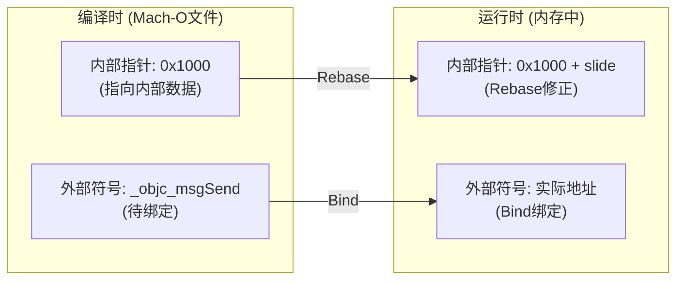

+++
title = "启动优化-Rebase与Bind"
date = '2026-05-02T22:32:27+08:00'
draft = false
weight = 3
tags = ["iOS", "性能优化", "启动"]
categories = ["iOS开发", "性能优化"]
+++
Rebase和Bind是Pre-main阶段的重要步骤，用于修正程序中的指针地址。ObjC类、方法、协议等元数据越多，需要修复的指针越多，启动时间越长。

---

## 基本概念

由于ASLR（Address Space Layout Randomization）技术，App每次启动时加载到内存的地址都是随机的，因此需要进行地址修正。关于Rebase和Bind的底层原理，可以参考[Mach-O的链接、装载与库]()。

### Rebase（重定位）

修正指向Mach-O内部的指针，将编译时的地址加上ASLR偏移量。

### Bind（绑定）

修正指向Mach-O外部的指针，查找符号表，绑定到正确的外部符号地址。



---

## 问题分析

以下因素会增加Rebase/Bind的工作量：

| 因素 | 影响 |
|-----|------|
| ObjC类数量 | 每个类都有元数据需要修正 |
| Swift类数量 | Swift类在Apple平台也会生成ObjC兼容的元数据，同样需要修正 |
| ObjC方法数量 | 方法列表中的指针需要修正 |
| Category数量 | Category的方法列表需要绑定 |
| C++虚函数 | 虚函数表中的指针需要绑定 |
| 全局变量 | 指向其他符号的全局变量需要绑定 |

> **关于缓存机制**：
> - **系统动态库**：Rebase/Bind 操作已在 dyld shared cache 中预先完成，不会在 App 启动时执行
> - **App 动态库**：dyld 3 的 Launch Closure 会缓存 Rebase/Bind 的**元数据信息**（哪些指针需要修正、修正方式等），但 **Rebase/Bind 操作本身仍需每次启动时执行**，因为 ASLR slide 每次启动都不同
> 
> 因此，减少 ObjC 类、Category、C++ 虚函数等仍然是有效的优化手段。

---

## 优化方案

> **注意事项**：
> 
> 减少类、方法数量等优化手段需要**按需使用**，不建议盲目追求。这类优化更适用于以下场景：
> - **存在过度设计的代码**：如大量只有一两个方法的小类
> - **无用的历史遗留代码**：这类清理百利无害
> - **超大规模App**：类数量达到数万级别时才会有明显收益
> 
> 对于大多数项目，为了毫秒级的启动优化而牺牲代码可读性和可维护性是得不偿失的。应优先保证代码质量，在确认Rebase/Bind是启动瓶颈后再考虑这些优化。

### 1. 减少ObjC类的数量

合并功能相近的类：

```objc
// 优化前：大量小类
@interface UserNameValidator : NSObject @end
@interface UserEmailValidator : NSObject @end
@interface UserPhoneValidator : NSObject @end

// 优化后：合并为一个类
@interface UserValidator : NSObject
- (BOOL)validateName:(NSString *)name;
- (BOOL)validateEmail:(NSString *)email;
- (BOOL)validatePhone:(NSString *)phone;
@end
```

### 2. 减少Category的使用

Category会增加额外的元数据，尤其要避免空Category：

```objc
// 避免：空Category或仅包含少量方法的Category
@interface NSString (MyCategory)
- (NSString *)myTrimmedString;
@end

// 推荐：使用工具类或扩展原有类
@interface StringUtils : NSObject
+ (NSString *)trimString:(NSString *)string;
@end
```

### 3. 减少C++虚函数

每个虚函数都需要Bind操作：

```cpp
// 优化前：大量虚函数
class BaseClass {
public:
    virtual void method1();
    virtual void method2();
    virtual void method3();
    // ... 更多虚函数
};

// 优化后：只保留必要的虚函数，使用模板或其他方式
class BaseClass {
public:
    virtual void process();  // 只保留核心虚函数
    
    // 非虚函数不需要Bind
    void method1();
    void method2();
};
```

### 4. 使用Swift结构体替代类

Swift结构体是值类型，不会生成Objective-C类元数据，因此不需要Rebase/Bind操作。相比之下，即使是纯Swift类（不使用`@objc`、不继承`NSObject`），也会在Apple平台上生成ObjC元数据，也需要进行Rebase操作。

```swift
// 优化前：使用类
class UserInfo {
    var name: String
    var age: Int
    
    init(name: String, age: Int) {
        self.name = name
        self.age = age
    }
}

// 优化后：使用结构体（无rebase操作）
struct UserInfo {
    var name: String
    var age: Int
}
```

### 5. 清理无用代码

定期清理项目中不再使用的类和方法：

- 使用AppCode的Inspect Code功能检测无用代码
- 使用LinkMap分析工具找出未使用的符号
- 定期审查并移除废弃的功能模块
