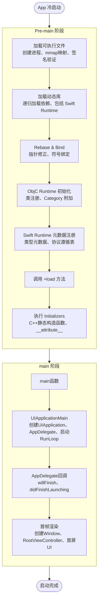

+++
title = "启动优化"
date = '2026-05-02T22:32:27+08:00'
draft = false
weight = 9
tags = ["iOS", "性能优化", "启动"]
categories = ["iOS开发", "性能优化"]
+++
iOS应用的启动时间是用户体验的关键指标之一。研究表明，应用性能直接影响用户留存：页面加载时间每增加1秒，用户流失率会显著上升。对于iOS应用，需要在20秒内完成启动，否则可能会被watchdog强制终止。

本系列文章从启动流程的各个阶段入手，系统性地介绍iOS启动优化的方法和实践。

> 启动监控是 APM 的重要子系，线上 P50/P90/P99 的采集、冷/温/热启动判定、以及与业务秒开指标的关联，请参考 [APM 系列]()：[指标体系]()、[数据采集]()。

---

## 启动流程概述

[App的启动流程]()分为两个主要阶段：

| 阶段 | 时间范围 | 主要工作 |
|-----|---------|---------|
| Pre-main | 进程创建 → main()函数 | 加载可执行文件、加载动态库、Rebase/Bind、ObjC Runtime初始化、Swift Runtime元数据注册、+load方法、Initializers |
| main | main()函数 → 首帧渲染 | UIApplicationMain、AppDelegate回调、首帧渲染 |

---

## 文章导航

本系列包含以下文章，建议按顺序阅读：

### 1. 观测与测量

在优化之前，首先需要准确测量启动时间。

- [启动优化-观测]()
  - dyld 调试环境变量（较新系统中部分变量例如DYLD_PRINT_STATISTICS可能不可用）
  - 代码埋点测量（Pre-main各阶段、首帧渲染）
  - dyld 镜像加载监控
  - MetricKit 线上监控
  - Instruments App Launch 分析
  - 预热启动的识别与处理

### 2. Pre-main 阶段优化

Pre-main阶段的优化主要从减少加载工作量入手。

#### 2.1 减少动态库

- [启动优化-减少动态库]()
  - 动态库加载对启动的影响
  - 合并动态库
  - 动态库改为静态库
  - 使用SPM静态链接
  - 移除未使用的动态库

#### 2.2 优化 Rebase 与 Bind

- [启动优化-Rebase与Bind]()
  - Rebase/Bind 的基本原理
  - 减少ObjC类数量
  - 减少Category使用
  - 减少C++虚函数
  - 使用Swift结构体替代类
  - 清理无用代码

#### 2.3 优化 +load 方法

- [启动优化-load方法]()
  - +load 与 +initialize 的区别
  - 使用 +initialize 替代
  - 延迟到启动完成后执行
  - 使用静态注册替代动态注册
  - 使用Swift替代ObjC

#### 2.4 优化 Initializers

- [启动优化-Initializers]()
  - C++静态构造函数的影响
  - 延迟初始化
  - 使用Swift懒加载
  - 移除不必要的constructor函数
  - 使用基本类型替代复杂类型

#### 2.5 二进制重排

- [启动优化-二进制重排]()
  - Page Fault 问题分析
  - Clang 插桩收集启动函数
  - 生成 Order File
  - Objective-C与Swift的兼容性
  - 优化效果验证

### 3. main 阶段优化

main阶段的优化主要从任务调度和延迟加载入手。

- [启动优化-didFinishLaunching]()
  - 分级启动任务管理
  - 并行初始化
  - 使用RunLoop空闲时机
  - 任务依赖关系处理
