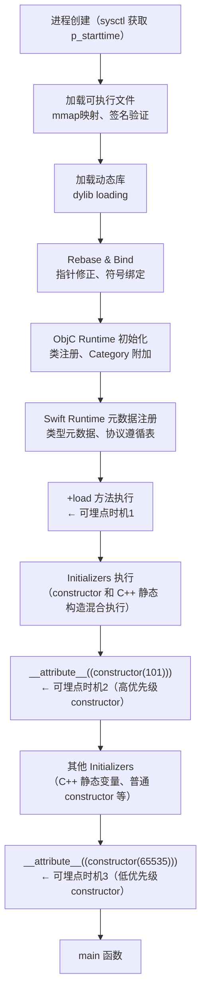
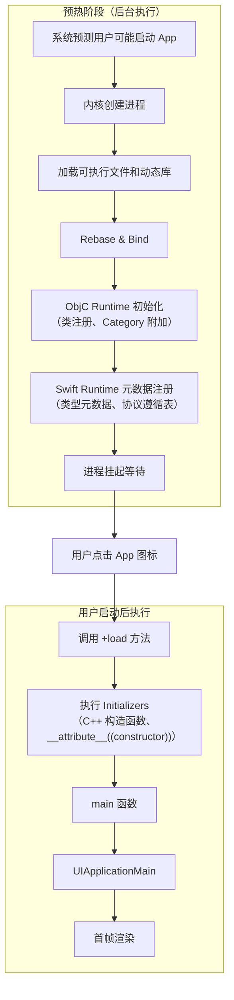

+++
title = "启动优化-观测"
date = '2026-05-02T22:32:27+08:00'
draft = false
weight = 8
tags = ["iOS", "性能优化", "启动"]
categories = ["iOS开发", "性能优化"]
+++
准确测量启动时间是优化的前提。启动时间是用户体验的关键指标之一，研究表明，应用性能直接影响用户留存：页面加载时间每增加1秒，用户流失率会显著上升。对于iOS应用，需要在20秒内完成启动，否则可能会被watchdog强制终止。

本文介绍如何测量和监控iOS应用的启动时间。关于启动流程的详细介绍，请参考 [App启动流程]()。

---

## 一、测量方式概览

iOS 提供了多种测量启动时间的方式，适用于不同场景：

| 方式 | 适用场景 | 粒度 | 是否需要代码 |
|-----|---------|------|-------------|
| dyld 环境变量 | 开发调试 | 定性分析 | 否 |
| Instruments App Launch | 深度分析 | 函数级 | 否 |
| 代码埋点 | 开发调试 + 线上监控 | 自定义 | 是 |
| MetricKit | 线上监控 | 冷启动/热启动 | 少量代码 |

---

## 二、开发调试阶段

### 2.1 dyld 环境变量

通过设置 dyld 环境变量可以在控制台查看启动过程中的加载信息：

```plaintext
Edit Scheme → Run → Arguments → Environment Variables
```

与启动测量相关的环境变量：

| 环境变量 | 作用 | 启动分析用途 |
|---------|------|-------------|
| `DYLD_PRINT_LIBRARIES` | 打印每个加载的 mach-o 镜像 | 查看动态库加载顺序，确认是否加载了不必要的库 |
| `DYLD_PRINT_LOADERS` | 打印镜像的加载器类型（JustInTimeLoader / PrebuiltLoader） | 分析是否使用了启动闭包优化 |
| `DYLD_PRINT_INITIALIZERS` | 打印每个 initializer 的执行 | 查看 +load、constructor、C++ 静态构造函数的执行顺序 |
| `DYLD_PRINT_BINDINGS` | 打印每次符号绑定 | 分析符号绑定情况（输出量很大） |
| `DYLD_PRINT_SEARCHING` | 打印库搜索路径 | 排查库加载问题 |
| `DYLD_PRINT_APIS` | 打印 dyld API 调用（如 dlopen） | 检测运行时动态加载行为 |
| `DYLD_PRINT_TO_FILE` | 将日志输出到指定文件 | 避免控制台日志过多，方便后续分析 |

**使用示例**：

```plaintext
# 查看 initializer 执行顺序
DYLD_PRINT_INITIALIZERS = 1

# 输出示例：
dyld[12345]: running initializer 0x100001234 in /path/to/libA.dylib
dyld[12345]: running initializer 0x100005678 in /path/to/MyApp
```

```plaintext
# 查看动态库加载
DYLD_PRINT_LIBRARIES = 1

# 输出示例：
dyld[12345]: <45A3B2C1-...> /usr/lib/libSystem.B.dylib
dyld[12345]: <78D4E5F6-...> /path/to/MyApp.app/Frameworks/SomeFramework.framework/SomeFramework
```

```plaintext
# 查看启动闭包使用情况
DYLD_PRINT_LOADERS = 1

# 输出示例：
dyld[12345]: using PrebuiltLoaderSet for /path/to/MyApp
dyld[12345]: PrebuiltLoader 0x1234 used for libSystem.B.dylib
```

> **注意**：
> - 这些环境变量仅提供定性分析（加载了什么、执行顺序），不提供耗时统计
> - `DYLD_PRINT_BINDINGS` 输出量极大，可能导致启动明显变慢，建议配合 `DYLD_PRINT_TO_FILE` 使用
> - 如需精确的耗时数据，请使用 Instruments App Launch 或代码埋点

### 2.2 Instruments - App Launch

Xcode Instruments 提供了专业的 App Launch 工具，可以进行函数级的深度分析：

```plaintext
使用步骤：
1. Product → Profile → App Launch
2. 选择目标设备和App
3. 点击Record开始录制
4. 等待App启动完成后停止录制
5. 分析各阶段耗时
```

App Launch 工具可以展示：

- 进程生命周期
- 线程活动
- 系统调用
- 各阶段时间占比

这是分析启动性能问题最详细的工具，可以看到每个函数的调用耗时。

---

## 三、线上监控

### 3.1 MetricKit（iOS 13+）

MetricKit 可以收集真实用户的启动数据，适合线上监控：

```swift
import MetricKit

class MetricsManager: NSObject, MXMetricManagerSubscriber {

    static let shared = MetricsManager()

    func startCollecting() {
        MXMetricManager.shared.add(self)
    }

    func didReceive(_ payloads: [MXMetricPayload]) {
        for payload in payloads {
            if let launchMetrics = payload.applicationLaunchMetrics {
                // 首次绘制时间直方图
                let firstDrawTime = launchMetrics.histogrammedTimeToFirstDraw
                // App恢复时间直方图
                let resumeTime = launchMetrics.histogrammedApplicationResumeTime

                // 上报到自己的监控平台
                reportMetrics(firstDraw: firstDrawTime, resume: resumeTime)
            }
        }
    }

    private func reportMetrics(firstDraw: MXHistogram<UnitDuration>,
                               resume: MXHistogram<UnitDuration>) {
        // 解析直方图数据并上报
    }
}
```

MetricKit 的优势：

- 系统级数据收集，无需额外埋点
- 提供直方图分布，可以分析 P50、P90 等分位数
- 区分冷启动和热启动（恢复）时间
- 数据聚合后每日回调，减少性能开销

---

## 四、代码埋点测量

代码埋点可以测量完整的启动时间，包括 Pre-main 阶段和 main 阶段。通过在不同时机添加埋点，可以精细分析各阶段耗时。

### 4.1 Pre-main 阶段的可埋点时机

在编写埋点代码之前，需要理解 Pre-main 阶段的执行顺序和可埋点时机（详见 [App启动流程 - Pre-main阶段](#pre-main-阶段)）：



| 埋点时机 | 实现方式 | 统计内容 | 适用场景 |
|---------|---------|---------|---------|
| +load | ObjC `+load` 方法 | dylib加载、Rebase/Bind、ObjC/Swift Runtime初始化 | 统计 Pre-main 早期阶段 |
| 高优先级 constructor | `__attribute__((constructor(101)))` | +load 方法执行耗时 | 精确统计 +load 阶段 |
| 低优先级 constructor | `__attribute__((constructor(65535)))` | 大部分 Initializers 执行耗时 | 统计完整 Pre-main 阶段 |

### 4.2 启动时间追踪器

```swift
import Foundation

// MARK: - 启动时间追踪器
class LaunchTimeTracker {
    static let shared = LaunchTimeTracker()
    
    /// 进程创建时间
    private(set) var processStartTime: TimeInterval = 0
    /// +load方法执行时间（ObjC Runtime初始化完成）
    private(set) var loadMethodTime: TimeInterval = 0
    /// 高优先级 constructor 时间（优先级101）
    private(set) var earlyConstructorTime: TimeInterval = 0
    /// 低优先级 constructor 时间（优先级65535）
    private(set) var lateConstructorTime: TimeInterval = 0
    /// main函数开始时间
    private(set) var mainStartTime: TimeInterval = 0
    /// willFinishLaunching 开始时间
    private(set) var willFinishLaunchingTime: TimeInterval = 0
    /// didFinishLaunching 开始时间
    private(set) var didFinishLaunchingTime: TimeInterval = 0
    /// didFinishLaunching 结束时间
    private(set) var didFinishLaunchingEndTime: TimeInterval = 0
    /// 首帧渲染完成时间
    private(set) var firstFrameTime: TimeInterval = 0
    /// 是否为预热启动
    private(set) var isPrewarmedLaunch: Bool = false
    
    private init() {
        processStartTime = Self.getProcessStartTime()
    }
    
    /// 通过sysctl获取进程创建时间
    private static func getProcessStartTime() -> TimeInterval {
        var kinfo = kinfo_proc()
        var size = MemoryLayout<kinfo_proc>.stride
        var mib: [Int32] = [CTL_KERN, KERN_PROC, KERN_PROC_PID, getpid()]
        
        guard sysctl(&mib, u_int(mib.count), &kinfo, &size, nil, 0) == 0 else {
            return 0
        }
        
        let startTimeSec = kinfo.kp_proc.p_starttime.tv_sec
        let startTimeUsec = kinfo.kp_proc.p_starttime.tv_usec
        return TimeInterval(startTimeSec) + TimeInterval(startTimeUsec) / 1_000_000.0
    }
    
    /// 标记+load方法执行时间
    @objc static func markLoadMethod() {
        shared.loadMethodTime = Date().timeIntervalSince1970
    }
    
    /// 标记预热启动状态
    @objc static func markPrewarmStatus(_ isPrewarmed: Bool) {
        shared.isPrewarmedLaunch = isPrewarmed
    }
    
    /// 标记高优先级 constructor 时间
    @objc static func markEarlyConstructor() {
        shared.earlyConstructorTime = Date().timeIntervalSince1970
    }
    
    /// 标记低优先级 constructor 时间
    @objc static func markLateConstructor() {
        shared.lateConstructorTime = Date().timeIntervalSince1970
    }
    
    /// 标记main函数开始
    @objc static func markMainStart() {
        shared.mainStartTime = Date().timeIntervalSince1970
    }
    
    /// 标记 willFinishLaunching 开始
    func markWillFinishLaunching() {
        willFinishLaunchingTime = Date().timeIntervalSince1970
    }
    
    /// 标记 didFinishLaunching 开始
    func markDidFinishLaunching() {
        didFinishLaunchingTime = Date().timeIntervalSince1970
    }
    
    /// 标记 didFinishLaunching 结束
    func markDidFinishLaunchingEnd() {
        didFinishLaunchingEndTime = Date().timeIntervalSince1970
    }
    
    /// 标记首帧渲染完成
    func markFirstFrame() {
        firstFrameTime = Date().timeIntervalSince1970
    }
    
    /// 获取启动时间起点（考虑预热启动）
    private func getLaunchStartTime() -> TimeInterval {
        // 预热启动时，进程创建时间不准确，使用 +load 时间作为起点
        if isPrewarmedLaunch {
            return loadMethodTime
        }
        return processStartTime
    }
    
    /// 获取各阶段耗时报告
    func generateReport() -> LaunchTimeReport {
        let startTime = getLaunchStartTime()
        
        // Pre-main 阶段
        let dyldLoadingTime = (loadMethodTime - startTime) * 1000
        let loadMethodDuration = (earlyConstructorTime - loadMethodTime) * 1000
        let initializersDuration = (lateConstructorTime - earlyConstructorTime) * 1000
        let lateToMainDuration = (mainStartTime - lateConstructorTime) * 1000
        let preMainTime = (mainStartTime - startTime) * 1000
        
        // main 阶段
        let mainToWillFinish = (willFinishLaunchingTime - mainStartTime) * 1000
        let willFinishDuration = (didFinishLaunchingTime - willFinishLaunchingTime) * 1000
        let didFinishDuration = (didFinishLaunchingEndTime - didFinishLaunchingTime) * 1000
        let didFinishToFirstFrame = (firstFrameTime - didFinishLaunchingEndTime) * 1000
        let mainTime = (firstFrameTime - mainStartTime) * 1000
        
        let totalTime = (firstFrameTime - startTime) * 1000
        
        return LaunchTimeReport(
            isPrewarmedLaunch: isPrewarmedLaunch,
            dylibLoadingTime: dyldLoadingTime,
            loadMethodDuration: loadMethodDuration,
            initializersDuration: initializersDuration,
            lateToMainDuration: lateToMainDuration,
            preMainTime: preMainTime,
            mainToWillFinish: mainToWillFinish,
            willFinishDuration: willFinishDuration,
            didFinishDuration: didFinishDuration,
            didFinishToFirstFrame: didFinishToFirstFrame,
            mainTime: mainTime,
            totalLaunchTime: totalTime
        )
    }
}

struct LaunchTimeReport {
    let isPrewarmedLaunch: Bool
    // Pre-main 阶段
    let dylibLoadingTime: Double       // dylib加载+Rebase/Bind+Runtime初始化
    let loadMethodDuration: Double     // +load方法执行耗时
    let initializersDuration: Double   // Initializers执行耗时（constructor + C++静态构造）
    let lateToMainDuration: Double     // 低优先级constructor到main的耗时
    let preMainTime: Double            // Pre-main总耗时
    // main 阶段
    let mainToWillFinish: Double       // main到willFinishLaunching的耗时
    let willFinishDuration: Double     // willFinishLaunching执行耗时
    let didFinishDuration: Double      // didFinishLaunching执行耗时
    let didFinishToFirstFrame: Double  // didFinishLaunching结束到首帧的耗时
    let mainTime: Double               // main阶段总耗时
    // 总计
    let totalLaunchTime: Double        // 总启动时间
    
    func printReport() {
        print("============ 启动时间报告 ============")
        if isPrewarmedLaunch {
            print("【预热启动】以 +load 时间为起点")
        }
        print("【Pre-main阶段明细】")
        print("  dylib加载/Rebase/Bind: \(String(format: "%.2f", dylibLoadingTime)) ms")
        print("  +load方法执行:         \(String(format: "%.2f", loadMethodDuration)) ms")
        print("  Initializers执行:      \(String(format: "%.2f", initializersDuration)) ms")
        print("  其他初始化:            \(String(format: "%.2f", lateToMainDuration)) ms")
        print("  Pre-main总计:          \(String(format: "%.2f", preMainTime)) ms")
        print("--------------------------------------")
        print("【main阶段明细】")
        print("  main→willFinish:       \(String(format: "%.2f", mainToWillFinish)) ms")
        print("  willFinishLaunching:   \(String(format: "%.2f", willFinishDuration)) ms")
        print("  didFinishLaunching:    \(String(format: "%.2f", didFinishDuration)) ms")
        print("  didFinish→首帧:        \(String(format: "%.2f", didFinishToFirstFrame)) ms")
        print("  main阶段总计:          \(String(format: "%.2f", mainTime)) ms")
        print("--------------------------------------")
        print("总启动时间:              \(String(format: "%.2f", totalLaunchTime)) ms")
        print("======================================")
    }
}
```

### 4.3 埋点注入（ObjC/C 桥接）

由于 `+load` 方法、`__attribute__((constructor))` 和 dyld 回调无法用纯 Swift 实现，需要创建 ObjC/C 桥接文件：

```objc
// LaunchTimeHook.m
#import <Foundation/Foundation.h>
#import <mach-o/dyld.h>

// 声明Swift类的方法
@interface LaunchTimeTracker : NSObject
+ (void)markLoadMethod;
+ (void)markPrewarmStatus:(BOOL)isPrewarmed;
+ (void)markEarlyConstructor;
+ (void)markLateConstructor;
@end

#pragma mark - +load 方法埋点

@interface LaunchTimeLoadHook : NSObject
@end

@implementation LaunchTimeLoadHook

+ (void)load {
    // 检测预热启动状态
    BOOL isPrewarmed = [NSProcessInfo.processInfo.environment[@"ActivePrewarm"] isEqualToString:@"1"];
    [LaunchTimeTracker markPrewarmStatus:isPrewarmed];
    
    // 记录 +load 执行时间
    [LaunchTimeTracker markLoadMethod];
}

@end

#pragma mark - constructor 埋点（不同优先级）

// 高优先级 constructor（优先级101，用户可用的最高优先级）
// 在同一编译单元内，会在更低优先级的 constructor 之前执行
// 注意：跨编译单元/库的执行顺序由链接顺序决定，优先级仅在同一编译单元内有效
__attribute__((constructor(101)))
static void EarlyConstructorInit(void) {
    [LaunchTimeTracker markEarlyConstructor];
}

// 低优先级 constructor（优先级65535，默认优先级）
// 在同一编译单元内，会在更高优先级的 constructor 之后执行
__attribute__((constructor(65535)))
static void LateConstructorInit(void) {
    [LaunchTimeTracker markLateConstructor];
}
```

### 4.4 关于 C++ 静态全局变量的说明

C++ 静态全局变量的构造函数和 `__attribute__((constructor))` 都是通过 Mach-O 的 `__mod_init_func` 段执行的。它们的执行顺序规则如下：

1. **跨编译单元/库**：由链接顺序决定，与 constructor 优先级无关
2. **同一编译单元内**：
   - 有优先级的 constructor 按优先级排序（数字小的先执行）
   - 同优先级或无优先级的按代码顺序执行
   - C++ 静态变量按声明顺序执行

因此，如果想用高/低优先级 constructor 来"包围"其他初始化代码，需要将它们放在**独立的编译单元**中，并通过链接顺序确保：
- 高优先级 constructor 所在的库**先于**业务代码链接
- 低优先级 constructor 所在的库**后于**业务代码链接

这也是为什么推荐将埋点代码打包成独立的 xcframework 的原因之一。

### 4.5 constructor 优先级说明

`__attribute__((constructor(priority)))` 支持优先级参数：

| 优先级范围 | 说明 |
|-----------|------|
| 0-100 | 系统保留，不可使用 |
| 101 | 用户可用的最高优先级 |
| 101-65534 | 自定义优先级 |
| 65535 | 默认优先级（不指定时的值） |

数字越小，优先级越高。但需要注意：

```objc
// 同一编译单元内，优先级生效
__attribute__((constructor(101)))
static void HighPriority(void) { /* 先执行 */ }

__attribute__((constructor(65535)))
static void LowPriority(void) { /* 后执行 */ }
```

> **重要**：constructor 优先级**仅在同一编译单元内有效**。跨编译单元/库的执行顺序由**链接顺序**决定，与优先级无关。因此，要让埋点 constructor 真正在业务代码之前/之后执行，需要通过控制链接顺序来实现。

### 4.6 埋点代码的引入方式

**方式一：源码引入**

将 `LaunchTimeHook.m` 放在 Build Phases → Compile Sources 的最前面，让 `+load` 方法尽早执行。但这种方式存在问题：CocoaPods 管理的源码库编译顺序由 Pods 项目决定，开发者难以干预。

**方式二：xcframework 引入（推荐）**

更可靠的方案是将埋点代码打包成 动态库xcframework引入。

`+load` 执行顺序规则：

```plaintext
1. 动态库（framework）的 +load 先于静态库和主工程执行
2. 静态库的 +load 先于主工程执行
3. 同一镜像内按编译顺序执行
```

由于动态库的 `+load` 会先于主工程和其他静态库执行，将埋点代码打包成动态 xcframework 后，可以确保其 `+load` 方法在绝大多数业务代码的 `+load` 之前执行。

**如何确保埋点 xcframework 尽早执行？**

当项目中存在多个动态库时，需要控制它们的加载顺序。动态库的加载顺序由以下因素决定：

1. **Link Binary With Libraries 中的顺序**：排在前面的动态库先加载
2. **依赖关系**：被依赖的库会先加载

因此，要让埋点 xcframework 最先执行：

| 方案 | 做法 | 优点 | 缺点 |
|-----|------|------|------|
| 手动引入 | 不通过 CocoaPods，直接将 xcframework 添加到项目，在 Link Binary With Libraries 中拖到最前面 | 最直接、最可控 | 需要手动管理依赖更新 |
| CocoaPods 引入 + hook | 通过 `post_install` 调整链接顺序 | 可以继续使用 CocoaPods 管理 | 配置相对复杂 |

如果埋点 xcframework 是项目中唯一的动态库（其他 Pods 都是静态库），那么即使通过 CocoaPods 的 `vendored_frameworks` 引入，也不需要额外调整顺序——它天然会先于所有静态库和主工程执行。

**CocoaPods post_install 调整链接顺序示例**：

```ruby
post_install do |installer|
  # 需要优先链接的 framework 名称
  priority_framework = 'LaunchTimeTracker'
  
  installer.pods_project.targets.each do |target|
    target.build_configurations.each do |config|
      ldflags = config.build_settings['OTHER_LDFLAGS']
      next unless ldflags.is_a?(Array)
      
      # 找到目标 framework 的链接标志
      framework_flag = ldflags.find { |flag| flag.include?(priority_framework) }
      next unless framework_flag
      
      # 移除后插入到最前面（$(inherited) 之后）
      ldflags.delete(framework_flag)
      inherited_index = ldflags.index('$(inherited)') || -1
      ldflags.insert(inherited_index + 1, framework_flag)
      
      config.build_settings['OTHER_LDFLAGS'] = ldflags
    end
  end
end
```

### 4.7 main 阶段埋点

**main.swift**

```swift
// main.swift
import UIKit

// 标记main函数开始
LaunchTimeTracker.markMainStart()

UIApplicationMain(
    CommandLine.argc,
    CommandLine.unsafeArgv,
    nil,
    NSStringFromClass(AppDelegate.self)
)
```

**AppDelegate**

```swift
@main
class AppDelegate: UIResponder, UIApplicationDelegate {

    func application(_ application: UIApplication, 
                     willFinishLaunchingWithOptions launchOptions: [UIApplication.LaunchOptionsKey: Any]?) -> Bool {
        // 标记 willFinishLaunching 开始
        LaunchTimeTracker.shared.markWillFinishLaunching()
        
        // ... 早期初始化逻辑
        
        return true
    }

    func application(_ application: UIApplication, 
                     didFinishLaunchingWithOptions launchOptions: [UIApplication.LaunchOptionsKey: Any]?) -> Bool {
        // 标记 didFinishLaunching 开始
        LaunchTimeTracker.shared.markDidFinishLaunching()
        
        // ... 主要初始化逻辑
        
        // 标记 didFinishLaunching 结束（在 return 前）
        LaunchTimeTracker.shared.markDidFinishLaunchingEnd()
        return true
    }
}
```

> **说明**：
> - `willFinishLaunchingWithOptions`：适合做状态恢复、早期配置等
> - `didFinishLaunchingWithOptions`：主要的初始化逻辑，通常是启动耗时的重点优化区域
> - 两个方法之间系统会做一些工作（如 UI 状态恢复），这部分耗时也会被统计

### 4.8 首帧埋点

```swift
class HomeViewController: UIViewController {
    
    private static var hasTrackedFirstFrame = false
    
    override func viewDidAppear(_ animated: Bool) {
        super.viewDidAppear(animated)
        
        guard !Self.hasTrackedFirstFrame else { return }
        Self.hasTrackedFirstFrame = true
        
        DispatchQueue.main.async {
            LaunchTimeTracker.shared.markFirstFrame()
            LaunchTimeTracker.shared.generateReport().printReport()
        }
    }
}
```

### 4.9 输出示例

```plaintext
============ 启动时间报告 ============
【Pre-main阶段明细】
  dylib加载/Rebase/Bind: 285.30 ms
  +load方法执行:         62.15 ms
  Initializers执行:      32.80 ms
  其他初始化:            0.00 ms
  Pre-main总计:          380.25 ms
--------------------------------------
【main阶段明细】
  main→willFinish:       12.30 ms
  willFinishLaunching:   45.20 ms
  didFinishLaunching:    298.50 ms
  didFinish→首帧:        58.55 ms
  main阶段总计:          414.55 ms
--------------------------------------
总启动时间:              794.80 ms
======================================
```

通过这个报告，可以清晰地看到各阶段耗时，针对性优化：

| 耗时过长的阶段 | 优化方向 |
|---------------|---------|
| dylib加载/Rebase/Bind | 减少动态库数量、减少 ObjC 类和 Swift 类型 |
| +load方法执行 | 减少 +load 方法、迁移到 +initialize |
| Initializers执行 | 减少 constructor 函数和 C++ 全局静态变量、延迟初始化 |
| willFinishLaunching | 精简早期初始化、延迟非必要配置 |
| didFinishLaunching | 延迟初始化、异步加载、按需加载（通常是优化重点） |
| didFinish→首帧 | 优化首页 UI 构建、减少首屏数据依赖 |

### 4.10 注意事项

1. **时间精度**：`sysctl` 获取的进程创建时间精度为微秒级，足够用于启动时间统计
2. **预热启动**：iOS 15+ 的预热启动会影响 Pre-main 时间的准确性，代码中已自动处理
3. **只统计一次**：使用静态变量确保首帧只统计一次，避免页面切换导致重复统计
4. **编译顺序**：`+load` 方法的执行顺序与编译顺序相关，推荐使用 xcframework 方式引入
5. **constructor 优先级**：优先级 0-100 为系统保留，用户代码应使用 101 及以上
6. **优先级作用范围**：constructor 优先级仅在同一编译单元内有效，跨库的执行顺序由链接顺序决定

---

## 五、预热启动的识别（iOS 15+）

iOS 15 引入预热启动（Pre-warm Launch），系统会预测用户可能启动的 App 并提前执行部分启动流程。这会影响启动时间的统计准确性。关于预热启动的详细介绍，请参考 [App启动流程 - 预热启动](#三预热启动pre-warm-launch)。

### 5.1 预热启动流程



### 5.2 预热启动对统计的影响

预热启动会导致通过 `sysctl` 获取的进程创建时间（`p_starttime`）不准确。因为进程可能在用户点击 App 图标前数小时就已经被系统预热创建，如果仍以进程创建时间作为启动起点，会导致统计出的启动时间异常偏大（可能达到几小时）。

因此，在预热启动场景下，**不能以进程创建时间作为启动时间的起点**。通常建议预热启动以 `+load` 的时间作为起点。

### 5.3 如何检测预热启动

检测预热启动状态需要在正确的时机进行。`ActivePrewarm` 环境变量在进程整个生命周期内都有效，建议在 `+load` 方法中尽早检测并缓存结果（参见 4.3 节的埋点代码）。

---

## 六、常见面试问题

### 6.1 如何测量 iOS 应用的启动时长？有哪些方案？

**答**：iOS 启动时长测量有以下几种方案：

| 方案 | 适用场景 | 优点 | 缺点 |
|-----|---------|------|------|
| dyld 环境变量 | 开发调试 | 无需代码，快速查看加载信息 | 只能定性分析，无耗时数据 |
| Instruments App Launch | 深度分析 | 函数级耗时分析，最详细 | 只能线下使用，无法覆盖线上用户 |
| 代码埋点 | 开发调试 + 线上监控 | 可自定义粒度，支持线上采集 | 需要开发和维护埋点代码 |
| MetricKit | 线上监控 | 系统级数据，提供分位数分布 | iOS 13+，数据延迟（每日回调），粒度较粗 |

实际工程中，通常结合使用：
- 开发阶段用 Instruments 深度分析
- 线上用代码埋点 + MetricKit 双保险

### 6.2 如何埋点监测冷启动各阶段的耗时？

**答**：冷启动分为 Pre-main 阶段和 main 阶段，埋点方案如下：

**Pre-main 阶段埋点**：

| 埋点时机 | 实现方式 | 统计内容 |
|---------|---------|---------|
| 进程创建时间 | `sysctl` 获取 `p_starttime` | 启动起点 |
| +load 方法 | ObjC `+load` 方法 | dylib 加载 + Rebase/Bind + Runtime 初始化完成 |
| 高优先级 constructor | `__attribute__((constructor(101)))` | +load 执行完成 |
| 低优先级 constructor | `__attribute__((constructor(65535)))` | 大部分 Initializers 执行完成 |

**main 阶段埋点**：

| 埋点时机 | 实现方式 | 统计内容 |
|---------|---------|---------|
| main 函数 | main.swift 顶部 | Pre-main 结束，main 开始 |
| willFinishLaunching | AppDelegate 回调 | main 到 willFinish 的耗时 |
| didFinishLaunching 开始 | AppDelegate 回调 | willFinish 执行耗时 |
| didFinishLaunching 结束 | return 前标记 | didFinish 执行耗时 |
| 首帧渲染 | viewDidAppear + DispatchQueue.main.async | didFinish 到首帧的耗时 |

### 6.3 如何确保埋点代码最先执行？

**答**：要确保埋点的 `+load` 方法最先执行，推荐将埋点代码打包成**动态 xcframework**，手动引入项目，在 Link Binary With Libraries 中拖到最前面，或通过 CocoaPods 的 `post_install` 调整链接顺序。原因：

1. **执行顺序规则**：动态库的 `+load` 先于静态库和主工程执行
2. **可控的链接顺序**：多个动态库时，Link Binary With Libraries 中排在前面的先执行

### 6.4 iOS 15 的预热启动对启动时间统计有什么影响？如何处理？

**答**：

**影响**：预热启动时，系统会提前创建进程并执行部分启动流程（dylib 加载、Rebase/Bind、Runtime 初始化），然后挂起等待用户点击。此时 `sysctl` 获取的 `p_starttime` 是预热时的时间，可能比用户实际点击早几小时，导致统计的启动时间异常偏大。

**处理方案**：

1. **检测预热启动**：在 `+load` 中检查环境变量
   ```objc
   BOOL isPrewarmed = [NSProcessInfo.processInfo.environment[@"ActivePrewarm"] isEqualToString:@"1"];
   ```

2. **调整起点时间**：预热启动时，以 `+load` 执行时间作为启动起点，而非进程创建时间

3. **分开统计**：区分预热启动和正常启动的数据，避免数据污染
