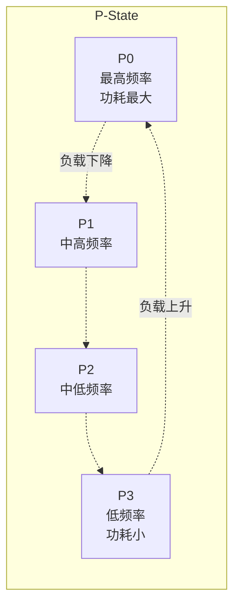
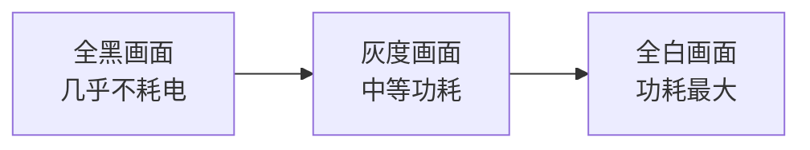
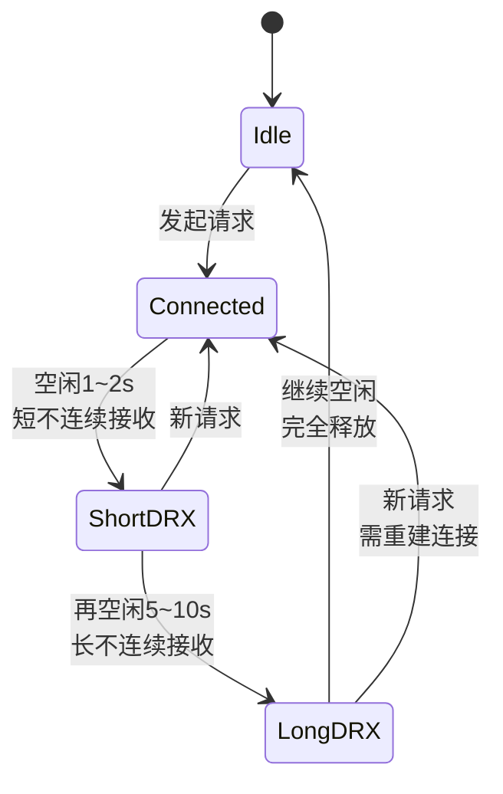
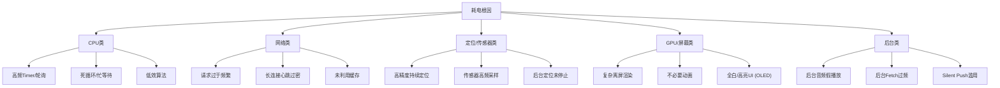

+++
title = "耗电-原理"
date = '2026-05-02T22:32:27+08:00'
draft = false
weight = 11
tags = ["iOS", "性能优化", "耗电"]
categories = ["iOS开发", "性能优化"]
math = true
+++
本文从硬件功耗模型、iOS系统的能效调度机制、以及各个硬件模块的功耗特性三个维度，系统性地讲解iOS App耗电的底层原理。

---

## 功耗的基本概念

### 功率、能量与电量

- **功率（Power）**：单位时间内消耗的能量，单位为瓦特（W）。
- **能量（Energy）**：功率在时间上的积分，单位为焦耳（J）或毫瓦时（mWh）。
- **电量（Battery Capacity）**：电池能存储的总能量，单位为毫安时（mAh）。

\[ Energy = \int P(t)\,dt \]

对于一段时间内近似恒定的功率，可以简化为 \( E = P \times t \)。这也是所有耗电优化的起点——要么降功率（P），要么降时间（t）。

### 电池电压与电流

iPhone使用锂电池，标称电压约为3.7~3.8V。操作系统看到的电流则随着硬件负载实时变化。可以近似认为：

\[ P(t) = V \times I(t) \]

在App层面，我们无法直接测量V和I，但可以通过 `UIDevice.current.batteryLevel` 观察电量百分比，通过 `IOKit` 私有API读取更精细的电池状态（后面检测篇会详细讲）。

---

## 硬件功耗特性

不同硬件模块的功耗曲线差异非常大。理解每个模块的特性，才能找到最有效的优化点。

### CPU：P-State与C-State

现代CPU（包括Apple Silicon）通过 **动态电压频率调整（DVFS）** 来平衡性能与功耗。

#### P-State（Performance State）

P-State描述CPU在工作时的电压/频率档位。以Apple A系列芯片为例，大核和小核都有多个P-State：



CPU的功耗与频率大致呈 **立方关系**（电压随频率升高，功耗 ≈ V² × f ≈ f³）。这意味着：

- 跑满频率时的功耗可能是低频的 **8~10倍**。
- 但对应的执行时间只快 2~3 倍。
- 因此短时间全力跑完 + 进入睡眠（**Race to Sleep**）往往比长时间低频跑更省电。

#### C-State（Core State）

C-State描述CPU空闲时的休眠深度：

| 状态   | 含义            | 唤醒延迟 | 功耗      |
| ---- | ------------- | ---- | ------- |
| C0   | 正在执行          | 0    | 最大      |
| C1   | 浅休眠，时钟门控       | ns级  | 较低      |
| C2   | 中度休眠，部分电源门控    | μs级  | 很低      |
| C3+  | 深度休眠，核心下电      | ms级  | 极低（接近0） |

关键洞察：**频繁的Wake-Up会让CPU无法进入深度C-State**，这比让CPU满载还耗电。所以高频Timer、短间隔轮询都是耗电大杀器。

### GPU

GPU的功耗模型与CPU类似，也有对应的DVFS：

- GPU空闲时可以进入低功耗状态。
- 触发渲染（VSync）时功耗升高。
- 离屏渲染、Blending、超大纹理都会延长GPU的活跃时间。

GPU的特殊之处在于它和屏幕刷新绑定：

- 60Hz屏幕：每16.67ms一次VSync。
- ProMotion（120Hz）屏幕：最低可降到10Hz（iPhone 13 Pro及以后），让静态内容更省电。

### 屏幕

屏幕是最持续的耗电模块。它的功耗主要由两部分构成：

- **背光功耗**（LCD）：与亮度成正比。
- **像素发光功耗**（OLED）：与亮度 **和** 画面内容成正比——OLED显示黑色时，像素直接熄灭，几乎不耗电。

#### OLED的功耗特性



这就是为什么：

- iOS 13引入深色模式后，苹果宣传"省电"——OLED屏幕下深色模式确实省电。
- MetricKit提供 `averagePixelLuminance` 指标，帮助开发者评估UI的"屏幕功耗友好度"。

#### ProMotion与自适应刷新率

iPhone 13 Pro及以后的Pro系列支持10~120Hz自适应刷新率。系统会根据内容自动切换：

- 静态页面：10~24Hz。
- 滚动：60~120Hz。
- 视频：与视频帧率匹配。

App可以通过 `CADisplayLink.preferredFrameRateRange` 或 `UIView.preferredFrameRateRange` 提示系统降低刷新率，从而省电。

### 蜂窝与WiFi：无线电状态机

蜂窝无线电（Cellular Radio）是iPhone上仅次于屏幕的耗电大户。理解它的 **RRC状态机** 对网络耗电优化至关重要。



关键特性：

1. **尾能耗（Tail Energy）**：一次网络请求结束后，无线电并不会立即进入Idle状态，而是在Connected → DRX → Idle之间逐级下降，这个"尾巴"时间大约 **10~20秒**，期间一直在耗电。
2. **频繁小请求比合并大请求更耗电**：10次每秒1个的小请求，无线电一直处于高功耗状态；而10次请求合并成1次，无线电只"醒一次"。
3. **蜂窝 >> WiFi**：同样的数据量，蜂窝数据的功耗大约是WiFi的 **3~5倍**。

这直接推导出网络优化的两大原则：

- **Batch**：请求批量化。
- **Coalesce**：延迟到一起发。

### GPS与定位

定位是另一个耗电大户。iOS提供多种定位方式，功耗差异悬殊：

| 定位方式                      | 精度    | 功耗     | 用途                |
| ------------------------- | ----- | ------ | ----------------- |
| kCLLocationAccuracyBestForNavigation | <5m | 极高     | 车载导航（必须插电）        |
| kCLLocationAccuracyBest   | ~10m  | 高      | 精准导航              |
| kCLLocationAccuracyHundredMeters | 100m | 中   | 天气、附近推荐         |
| kCLLocationAccuracyKilometer | 1km | 低     | 城市级            |
| kCLLocationAccuracyThreeKilometers | 3km | 极低 | 粗粒度城市           |
| SignificantLocationChanges | 500m+ | 极低  | 位置变化通知          |
| Region Monitoring         | 可变   | 极低     | 进入/离开指定区域       |
| Visits                    | 可变   | 极低     | 用户到访地点监控        |

**GPS冷启动（搜星）** 耗电非常高，冷启动一次往往需要10~30秒。所以：

- 能用SignificantLocationChanges就不用持续定位。
- 能降精度就降精度。
- 能用Region Monitoring就不用轮询。

### 蓝牙与BLE

传统蓝牙（Classic Bluetooth）持续连接会有明显功耗。**低功耗蓝牙（BLE / Bluetooth Low Energy）** 专为续航优化：

- BLE广播包很小（≤31字节）。
- Scan与Advertise可以配置占空比。
- Central/Peripheral模式下，典型功耗为毫安级别。

### 传感器

iOS设备的传感器（加速度计、陀螺仪、磁力计、气压计等）通过 `CoreMotion` 框架访问。功耗与 **采样频率** 强相关：

| 采样频率    | 功耗 | 用途         |
| ------- | -- | ---------- |
| 1Hz     | 极低 | 计步、姿态      |
| 10Hz    | 低  | 一般交互       |
| 50Hz    | 中  | 运动类App     |
| 100Hz   | 高  | 精细姿态识别     |
| 200Hz+  | 极高 | AR、专业运动    |

---

## iOS系统的能效调度机制

### 系统级能效策略

iOS内核会根据当前状态动态调整整机的能效策略。影响因素包括：

- **电量百分比**：低电量时触发Low Power Mode。
- **热状态（Thermal State）**：过热时主动降频。
- **充电状态**：充电时策略更宽松。
- **前后台状态**：后台App会被更严格地限制。

### 低电量模式（Low Power Mode）

iOS 9引入，当电量低于20%时系统会提示开启。特性：

- CPU最高频率下调。
- 后台刷新（Background App Refresh）暂停。
- 自动邮件获取暂停。
- 视觉效果（透明、动画）简化。
- iCloud Photos同步暂停。
- ProMotion最高60Hz。

App可以通过 `ProcessInfo.processInfo.isLowPowerModeEnabled` 检测并适配。

### 热节流（Thermal Throttling）

iOS将设备温度分为四档：

| ThermalState | 含义    | 开发者策略              |
| ------------ | ----- | ------------------ |
| .nominal     | 正常    | 无需干预               |
| .fair        | 略高    | 可以开始准备降级           |
| .serious     | 较热    | 降低帧率、暂停非核心任务       |
| .critical    | 危险    | 最低功耗模式，只保留核心功能     |

监听方式：

```swift
NotificationCenter.default.addObserver(
    forName: ProcessInfo.thermalStateDidChangeNotification,
    object: nil,
    queue: .main
) { _ in
    let state = ProcessInfo.processInfo.thermalState
    switch state {
    case .nominal, .fair:
        break
    case .serious:
        // 降帧、暂停动画
        break
    case .critical:
        // 关闭AR、降分辨率
        break
    @unknown default:
        break
    }
}
```

### 后台任务能效审查

iOS对后台能耗有严格约束：

| 状态                 | 能耗预算                 |
| ------------------ | -------------------- |
| Foreground Active  | 几乎无限制（但受Thermal影响）   |
| Background         | 默认30s后挂起             |
| BG App Refresh     | 系统调度，几十秒预算           |
| BG Processing Task | 长任务，数分钟预算，通常在夜间充电时执行 |
| BG Fetch（已弃用）       | -                    |
| Silent Push        | 高频率会被降级调度            |

从iOS 13开始，苹果推出了 **BackgroundTasks** 框架，替代旧的 `beginBackgroundTask` 和 `BackgroundFetch`，让系统能更合理地调度后台任务。

### App Nap（仅macOS/Catalyst）

macOS引入了App Nap机制，不可见App会自动进入低优先级状态。iOS不直接暴露该机制，但后台挂起策略与之类似。

---

## 耗电的根本原因归类

综合以上原理，App耗电问题可以归纳为以下几类根因：



后续"检测篇"与各个"优化篇"会围绕这些根因展开。

---

## 能效评估方法

苹果在WWDC中多次介绍过功耗的评估思路：

\[ Energy_{total} = \sum_{module} Time_{active,module} \times Power_{module} \]

不同模块的活跃时间和平均功率相乘，再累加得到总功耗。

这也是为什么MetricKit的功耗指标是"累计活跃时间"——只要能估算每个模块的平均功率，就能把时间换算成能量。苹果官方把它进一步简化为一个 **能效指标（Energy Impact）**，在Xcode的Energy Gauge中显示为 0~20 的得分。

---

## 小结

| 维度   | 关键点                                                                |
| ---- | ------------------------------------------------------------------ |
| 硬件   | CPU立方功耗、屏幕持续耗电、OLED黑色省电、蜂窝有尾能耗、GPS冷启动昂贵              |
| 系统策略 | DVFS、Low Power Mode、Thermal Throttling、后台任务预算                                |
| 优化原则 | Race to Sleep、Coalesce、Defer and Batch                             |
| 分析方法 | 时间 × 功率 = 能量                                                       |

理解了原理，接下来就可以进入 [耗电-检测]() 和后续的优化篇。
