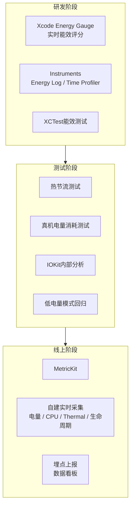
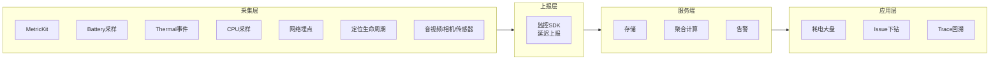

+++
title = "耗电-检测"
date = '2026-05-08T22:35:33+08:00'
draft = false
weight = 13
tags = ["iOS", "性能优化", "耗电"]
categories = ["iOS开发", "性能优化"]
math = true
+++
本文介绍iOS耗电问题的检测手段，从开发阶段的本地工具，到线上的监控体系，帮助团队形成一套完整的耗电可观测能力。

---

## 检测手段全景



---

## 一、Xcode Energy Gauge

Xcode在真机调试时，"Debug Navigator → Energy Impact"提供了实时能效评估。

### 能效评分（Energy Impact）

Xcode将功耗分为5档：

| 等级                | 含义          | 典型值        |
| ----------------- | ----------- | ---------- |
| Very Low / Low    | 正常使用        | 0~3 / 4~8  |
| High              | 偏高，需要关注     | 9~16       |
| Very High         | 严重，必须优化     | 17~20      |

评分由以下几个因素构成：

- **CPU**：平均CPU使用率。
- **Network**：网络活跃时间与流量。
- **Location**：定位活跃时间与精度。
- **GPU**：GPU活跃时间。
- **Background**：后台活跃时间。
- **Overhead**：系统唤醒代价。

### 典型使用流程

1. Xcode连接真机（模拟器的数据不准确）。
2. 运行App，选择Debug Navigator → Energy Impact。
3. 进行典型操作（刷Feed、看视频、聊天等），观察评分。
4. 如果出现High/Very High，使用Instruments进一步定位。

---

## 二、Instruments Energy Log

Instruments中有多个和能效相关的工具：

- **Energy Log**（仅Mac Catalyst/macOS，iOS已弃用，但仍可作为参考）。
- **Time Profiler**：找出CPU热点。
- **Network**：查看网络请求时序。
- **Location**：查看定位调用时间线。
- **Activity Monitor**：看整机能效。

### 推荐组合：Time Profiler + Network + Points of Interest

```
xcrun xctrace record --template 'Time Profiler' --attach <bundleId>
```

在Instruments中可以同时查看：

- **CPU时间线**：哪些方法占用CPU最多，是否存在不该运行时仍在跑的线程。
- **Network时间线**：是否有高频小请求、尾能耗（Tail Energy）。
- **Points of Interest**：业务侧打的标签，关联业务场景。

### 热点定位三问

在Instruments中看到一段高CPU占用时，要问自己：

1. **是否必要？** 是不是在后台或不可见页面仍在跑。
2. **是否高效？** 有没有低效算法、重复计算。
3. **是否频繁？** 是不是高频Timer或轮询触发。

---

## 三、MetricKit：线上功耗数据的黄金源

从iOS 13开始，苹果提供 `MetricKit` 框架，让开发者可以直接获取设备上报的功耗指标。这是最 **官方、最准确** 的线上功耗数据来源。

### 接入方式

```swift
import MetricKit

class EnergyMetricReporter: NSObject, MXMetricManagerSubscriber {
    
    static let shared = EnergyMetricReporter()
    
    func start() {
        MXMetricManager.shared.add(self)
    }
    
    func didReceive(_ payloads: [MXMetricPayload]) {
        for payload in payloads {
            reportEnergy(payload)
        }
    }
    
    private func reportEnergy(_ payload: MXMetricPayload) {
        // 核心能效指标
        let cpuTime = payload.cpuMetrics.cumulativeCPUTime
        let fgTime = payload.applicationTimeMetrics?.cumulativeForegroundTime
        let bgTime = payload.applicationTimeMetrics?.cumulativeBackgroundTime
        let cellDown = payload.networkTransferMetrics?.cumulativeCellularDownload
        let cellUp = payload.networkTransferMetrics?.cumulativeCellularUpload
        let locTime = payload.locationActivityMetrics?.cumulativeBestAccuracyTime
        let pixelLum = payload.displayMetrics?.averagePixelLuminance?.averageMeasurement
        
        Analytics.report(name: "metric_energy", params: [
            "cpu_time_ms": cpuTime.converted(to: .milliseconds).value,
            "fg_time_s": fgTime?.converted(to: .seconds).value ?? 0,
            "bg_time_s": bgTime?.converted(to: .seconds).value ?? 0,
            "cellular_down_mb": cellDown?.converted(to: .megabytes).value ?? 0,
            "cellular_up_mb": cellUp?.converted(to: .megabytes).value ?? 0,
            "loc_best_time_s": locTime?.converted(to: .seconds).value ?? 0,
            "pixel_luminance": pixelLum?.value ?? 0,
        ])
    }
}
```

### MetricKit核心功耗指标

| 分组                         | 字段                                    | 含义             |
| -------------------------- | ------------------------------------- | -------------- |
| cpuMetrics                 | cumulativeCPUTime                     | 累计CPU时间        |
|                            | cumulativeCPUInstructions (iOS 14+)   | CPU指令数         |
| gpuMetrics                 | cumulativeGPUTime                     | 累计GPU时间        |
| applicationTimeMetrics     | cumulativeForegroundTime              | 前台时长           |
|                            | cumulativeBackgroundTime              | 后台活跃时长         |
|                            | cumulativeBackgroundAudioTime         | 后台音频时长         |
|                            | cumulativeBackgroundLocationTime      | 后台定位时长         |
| networkTransferMetrics     | cumulativeCellularDownload/Upload     | 蜂窝流量           |
|                            | cumulativeWifiDownload/Upload         | WiFi流量         |
| locationActivityMetrics    | cumulativeBestAccuracyTime            | 最高精度定位时长       |
|                            | cumulativeHundredMetersAccuracyTime   | 百米级精度定位时长      |
| displayMetrics             | averagePixelLuminance                 | 平均像素亮度（OLED机型） |
| cellularConditionMetrics   | cellConditionTime                     | 信号质量分布         |

### 诊断数据（MXDiagnosticPayload）

iOS 14+提供诊断数据，其中与耗电强相关的是：

- **MXCPUExceptionDiagnostic**：CPU超限异常（App使用CPU时间超过系统阈值）。
- **MXHangDiagnostic**：主线程挂起（间接导致唤醒开销）。
- **MXDiskWriteExceptionDiagnostic**：磁盘写入超限。

### 特点与限制

- 数据每24小时聚合一次，第二天启动时下发。
- 仅限真机。
- 指标是 **累计值**（对应24小时窗口）。
- 业务需要在服务端再做Per-UDID Per-Day的聚合。

---

## 四、自建实时采集体系

`MetricKit` 是线上耗电数据的主来源，但它是天级聚合数据，不适合回答"哪个页面刚刚把 CPU 打满了"、"这次后台同步为什么耗电"、"某个新功能在灰度期间是否立刻发热"这类实时归因问题。因此工程上通常会补一套自建采集。

自建采集不要追求实时电流级精度，而要补齐三件事：

1. **场景归因**：指标要能落到页面、功能、前后台状态、网络类型、设备和版本。
2. **实时发现**：MetricKit 第二天才回调，自建采集要能在灰度期间尽快发现异常。
3. **低成本监控**：监控本身不能制造新的唤醒、请求和 CPU 开销。

整体原则是：

> MetricKit 做天级大盘，自建采集做实时归因；能事件驱动就事件驱动，必须轮询时低频采样，并且本地聚合后批量上报。

### 1. 采集策略总览

| 数据类型 | 推荐方式 | 建议间隔 | 说明 |
| --- | --- | --- | --- |
| 电量 | `UIDevice.batteryLevel` | 普通场景 3~5 分钟；重点场景 60~120 秒 | 电量粒度粗，不适合秒级采样 |
| CPU 使用率 | Mach `task_threads` / `thread_info` | 普通场景 5 秒；高风险场景 1 秒 | 只采数值，不要每秒抓堆栈 |
| CPU 堆栈 | 触发式采集 | CPU 持续超阈值后采 3~5 次 | 堆栈采集成本高，不能全量常态开启 |
| Thermal | 系统通知 | 不轮询 | 监听 `thermalStateDidChangeNotification` |
| Low Power Mode | 系统通知 | 不轮询 | 监听 `NSProcessInfoPowerStateDidChange` |
| 网络 | 统一网络层埋点 | 每次请求记录，本地 30~60 秒聚合上报 | 记录请求数、重试数、流量、网络类型 |
| 定位 | 统一定位服务埋点 | `start/stop` 成对记录 | 记录精度、前后台、场景、持续时长 |
| 传感器/音视频/相机 | 生命周期埋点 | `start/stop` 成对记录 | 重点看持续时长、采样率、清晰度、帧率 |

自建采集 SDK 本身也要遵循能效原则：

- 采样 Timer 使用 `DispatchSourceTimer`，设置 `leeway`，允许系统合并唤醒。
- App 后台时不做常驻轮询，除非正在诊断明确的后台耗电问题。
- 指标先在本地内存聚合，达到 N 条或 T 秒后批量上报。
- 普通线上用户按 hash 稳定采样，灰度、内测和高风险功能可以提高采样率。
- Low Power Mode 或 Thermal serious+ 时，监控本身也要降频。

示例：

```swift
final class EnergySampleTimer {
    private var timer: DispatchSourceTimer?

    func start(interval: TimeInterval = 60) {
        let queue = DispatchQueue(label: "energy.sample.timer", qos: .utility)
        let timer = DispatchSource.makeTimerSource(queue: queue)
        timer.schedule(
            deadline: .now() + interval,
            repeating: interval,
            leeway: .seconds(max(5, Int(interval * 0.1)))
        )
        timer.setEventHandler {
            EnergySampler.shared.sampleIfNeeded()
        }
        timer.resume()
        self.timer = timer
    }
}
```

### 2. 电量采样：按窗口计算掉电速率

`UIDevice.batteryLevel` 可以用于前台/后台窗口的掉电速率估算，但它的粒度比较粗，不能用两个相邻采样点直接判断耗电。更可靠的做法是按 **会话窗口** 计算：

\[
DrainRate = \frac{StartBattery - EndBattery}{DurationHours}
\]

例如用户在 Feed 页面前台停留 10 分钟，电量从 80% 降到 78%：

\[
DrainRate = \frac{2\%}{10 / 60} = 12\% / hour
\]

实现上可以在页面/场景进入时记录起点，在离开、进入后台、定时采样时计算窗口：

```swift
final class BatteryDrainMonitor {
    private var windowStartLevel: Float = -1
    private var windowStartTime: Date = Date()

    func beginWindow() {
        UIDevice.current.isBatteryMonitoringEnabled = true
        windowStartLevel = UIDevice.current.batteryLevel
        windowStartTime = Date()
    }

    func endWindow(scene: String) {
        guard UIDevice.current.batteryState == .unplugged else { return }
        guard windowStartLevel >= 0 else { return }

        let endLevel = UIDevice.current.batteryLevel
        let duration = Date().timeIntervalSince(windowStartTime)
        guard duration >= 5 * 60 else { return }

        let drop = max(0, windowStartLevel - endLevel) * 100
        let drainPerHour = drop / Float(duration / 3600)

        Analytics.report(name: "battery_drain_window", params: [
            "scene": scene,
            "drop_percent": drop,
            "duration_s": duration,
            "drain_per_hour": drainPerHour
        ])
    }
}
```

推荐过滤规则：

| 规则 | 原因 |
| --- | --- |
| 只统计 `.unplugged` | 充电、满电、未知状态下电量变化没有参考价值 |
| 窗口时长至少 5~10 分钟 | 窗口太短时，电量粒度误差会被放大 |
| 最好要求电量至少下降 1% | 如果电量没有变化，无法说明该窗口不耗电 |
| 按场景计算 | 视频、导航、游戏、普通信息流的合理掉电速率不同 |
| 按机型/系统/网络分组 | 老设备、蜂窝网络、弱网、低电量模式都会影响结果 |

推荐指标：

| 指标 | 计算方式 | 用途 |
| --- | --- | --- |
| 前台掉电速率 | `drop_percent / foreground_hours` | 衡量用户使用时的真实掉电 |
| 后台掉电速率 | `drop_percent / background_hours` | 识别后台待机异常耗电 |
| 场景掉电速率 | `scene_drop_percent / scene_duration_hours` | 定位高耗电页面或功能 |
| P95 掉电速率 | 分场景统计 P95 | 识别重度受影响用户 |

阈值建议优先用历史基线对比：

| 场景 | 经验阈值 |
| --- | --- |
| 普通内容 App 前台 | `> 8%~10% / hour` 需要关注 |
| 视频/直播/导航 | `10%~20% / hour` 可能正常，要和业务基线比较 |
| 后台待机 | `> 1%~2% / hour` 就比较可疑 |
| 灰度版本 | 同机型、同系统、同场景下较基线上涨 `20%~30%` 告警 |

### 3. Thermal 与 Low Power：事件驱动监控

设备热状态是能效压力的滞后指标：设备热起来，说明前一段时间 CPU/GPU、定位、相机、音视频或网络等模块有较高负载。Low Power Mode 则是系统给 App 的明确降级信号。

这两类状态都不应该轮询，而应该监听系统通知：

```swift
final class EnergyStateMonitor {
    init() {
        NotificationCenter.default.addObserver(
            forName: ProcessInfo.thermalStateDidChangeNotification,
            object: nil,
            queue: .main
        ) { _ in
            Self.reportEnergyState(reason: "thermal_change")
        }

        NotificationCenter.default.addObserver(
            forName: .NSProcessInfoPowerStateDidChange,
            object: nil,
            queue: .main
        ) { _ in
            Self.reportEnergyState(reason: "power_state_change")
        }
    }

    private static func reportEnergyState(reason: String) {
        Analytics.report(name: "energy_state_change", params: [
            "reason": reason,
            "thermal_state": thermalStateName(ProcessInfo.processInfo.thermalState),
            "low_power": ProcessInfo.processInfo.isLowPowerModeEnabled,
            "battery_level": UIDevice.current.batteryLevel,
            "scene": CurrentScene.name
        ])
    }

    private static func thermalStateName(_ state: ProcessInfo.ThermalState) -> String {
        switch state {
        case .nominal: return "nominal"
        case .fair: return "fair"
        case .serious: return "serious"
        case .critical: return "critical"
        @unknown default: return "unknown"
        }
    }
}
```

推荐指标：

| 指标 | 计算方式 | 用途 |
| --- | --- | --- |
| Thermal serious+ 用户占比 | `serious/critical 用户数 / DAU` | 评估高能耗压力影响面 |
| Thermal critical 次数 | `critical 事件数` | 识别严重发热场景 |
| Thermal 持续时长 | `state_end - state_start` | 判断是否长时间处于降频压力 |
| Low Power 场景占比 | `低电量模式下的功能使用次数 / 总次数` | 判断降级策略覆盖面 |

告警建议：

- 灰度版本 `serious+` 用户占比较基线翻倍。
- 某个页面或功能集中出现 `critical`。
- Low Power Mode 下仍出现高 CPU、高精度定位、自动播放、预加载等非必要任务。

### 4. CPU 采样：低频看趋势，超阈值再抓堆栈

对于需要精细到业务场景的耗电诊断，可以自建 CPU 使用率采样。它用于补齐 MetricKit 的延迟问题，重点不是每一秒都精确，而是识别 **持续高 CPU、后台高 CPU、低电量/过热状态下仍高 CPU**。

读取进程 CPU 使用率：

```objc
#import <mach/mach.h>

CGFloat app_cpu_usage(void) {
    kern_return_t kr;
    thread_array_t thread_list;
    mach_msg_type_number_t thread_count;
    
    kr = task_threads(mach_task_self(), &thread_list, &thread_count);
    if (kr != KERN_SUCCESS) return -1;
    
    float tot_cpu = 0;
    for (int i = 0; i < thread_count; i++) {
        thread_info_data_t thinfo;
        mach_msg_type_number_t thread_info_count = THREAD_INFO_MAX;
        kr = thread_info(thread_list[i], THREAD_BASIC_INFO,
                         (thread_info_t)thinfo, &thread_info_count);
        if (kr != KERN_SUCCESS) continue;
        
        thread_basic_info_t basic_info_th = (thread_basic_info_t)thinfo;
        if (!(basic_info_th->flags & TH_FLAGS_IDLE)) {
            tot_cpu += basic_info_th->cpu_usage / (float)TH_USAGE_SCALE * 100.0;
        }
    }
    vm_deallocate(mach_task_self(), (vm_offset_t)thread_list,
                  thread_count * sizeof(thread_t));
    return tot_cpu;
}
```

推荐计算方式：

\[
AvgCPU = \frac{\sum CPU_i \times Interval_i}{WindowDuration}
\]

\[
CPUCost = \sum \frac{CPU_i}{100} \times Interval_i
\]

如果 CPU 使用率实现没有按核心数归一化，多核设备上可能超过 100%，服务端需要同时记录 `core_count`，并计算：

\[
CPUPerCore = \frac{CPUUsage}{CoreCount}
\]

推荐阈值：

| 场景 | 触发条件 | 动作 |
| --- | --- | --- |
| 前台普通场景 | CPU `> 80%` 持续 `3~5s` | 上报高 CPU 事件，触发短时堆栈采集 |
| 后台场景 | CPU `> 20%~30%` 持续 `30~60s` | 上报后台高 CPU，关联后台任务/定位/音频状态 |
| Low Power Mode | CPU `> 50%` 持续 `5s` | 标记低电量高 CPU，建议触发降级 |
| Thermal serious+ | CPU `> 50%` 持续 `5s` | 降低采样频率并上报高风险事件 |
| 模型推理/视频导出 | 按功能单独建基线 | 不套普通阈值，重点看耗时和 Thermal |

CPU 高占用预警：

```swift
class CPUWatchdog {
    private var timer: DispatchSourceTimer?
    private var highCPUStart: Date?
    
    func start(threshold: CGFloat = 80, duration: TimeInterval = 3) {
        let t = DispatchSource.makeTimerSource(queue: DispatchQueue.global(qos: .utility))
        t.schedule(deadline: .now(), repeating: 1, leeway: .milliseconds(100))
        t.setEventHandler { [weak self] in
            let usage = CGFloat(app_cpu_usage())
            if usage > threshold {
                if self?.highCPUStart == nil {
                    self?.highCPUStart = Date()
                } else if Date().timeIntervalSince(self!.highCPUStart!) > duration {
                    // 抓一份主线程堆栈 + 业务上下文
                    self?.reportHighCPU(usage: usage)
                    self?.highCPUStart = nil
                }
            } else {
                self?.highCPUStart = nil
            }
        }
        t.resume()
        self.timer = t
    }
    
    private func reportHighCPU(usage: CGFloat) {
        let stack = StackCapture.captureMainThread()
        Analytics.report(name: "cpu_high", params: [
            "usage": usage,
            "stack": stack,
            "scene": CurrentScene.name
        ])
    }
}
```

堆栈采集要触发式执行：

```text
低频采 CPU 数值
  ↓
连续超过阈值
  ↓
短时间采集 3~5 次堆栈
  ↓
相同堆栈本地去重 / 退火
  ↓
聚合后批量上报
```

这样可以避免每秒抓堆栈带来的额外 CPU 开销，也能抓到"后台还在跑计算"、"Timer 空转"、"死循环"这类典型耗电问题。

### 5. 网络、定位和硬件能力：优先做生命周期埋点

很多耗电问题不适合靠轮询发现，而应该在统一封装层记录生命周期。

网络层建议记录：

| 字段 | 说明 |
| --- | --- |
| `request_count` | 请求次数 |
| `retry_count` | 重试次数 |
| `fail_count` | 失败次数 |
| `cellular_bytes` / `wifi_bytes` | 蜂窝/WiFi 流量 |
| `duration` | 请求耗时 |
| `endpoint` | 接口归类，建议服务端做 URL 模板化 |
| `network_type` | WiFi / Cellular / constrained / expensive |
| `scene` | 当前页面或业务场景 |

推荐指标：

\[
RequestDensity = \frac{RequestCount}{ForegroundHours}
\]

\[
RetryRate = \frac{RetryCount}{RequestCount}
\]

\[
CellularIntensity = \frac{CellularMB}{ForegroundHours}
\]

告警可以看：请求密度较基线 `+20%~30%`、重试率超过 `10%~20%`、某接口短时间出现重试风暴、蜂窝流量强度明显上涨。

定位层建议记录：

| 字段 | 说明 |
| --- | --- |
| `start_time` / `stop_time` | 定位生命周期 |
| `desiredAccuracy` | 期望精度 |
| `activityType` | 运动类型 |
| `distanceFilter` | 距离过滤 |
| `is_background` | 是否后台 |
| `scene` | 业务场景 |

推荐指标：

\[
LocationDuration = StopTime - StartTime
\]

\[
BestAccuracyRatio = \frac{BestAccuracyDuration}{TotalLocationDuration}
\]

\[
BackgroundLocationRatio = \frac{BackgroundLocationDuration}{TotalLocationDuration}
\]

经验阈值：

- 非导航场景高精度定位持续 `> 1~3 分钟` 可疑。
- 页面消失后定位仍持续 `> 30~60 秒` 可疑。
- 后台定位用户占比突然上涨需要告警。
- `startUpdatingLocation` 没有对应 `stopUpdatingLocation` 要作为强风险事件。

传感器、相机、音视频也按同样思路处理：记录 `start/stop`、采样率、帧率、分辨率、清晰度、是否后台、业务场景，再按持续时长和参数分布做归因。

### 6. 本地聚合与上报策略

自建采集的上报策略同样影响耗电。不要每次采样都立即发网络请求，建议使用本地缓冲 + 批量上报：

| 策略 | 建议 |
| --- | --- |
| 本地聚合窗口 | 30~60 秒，或累计 N 条事件后 flush |
| 上报时机 | App 前台空闲、进入后台前、下次启动、WiFi 环境 |
| 采样率 | 普通线上 1%~5%；灰度/内测/高风险功能可提高 |
| 稳定采样 | 按用户或设备 hash，避免每条事件随机采样 |
| 弱网处理 | 指数退避 + 抖动，避免监控请求重试风暴 |
| 数据保护 | 先落盘再上传，限制单批大小，避免丢失关键异常 |

推荐默认配置：

```text
电量：
  前台 session 开始/结束必采
  重点场景每 60~120s 采一次
  普通场景每 3~5min 采一次

CPU：
  普通场景 5s 一次
  高风险场景 1s 一次
  前台 >80% 持续 5s 触发堆栈
  后台 >30% 持续 30s 触发告警

Thermal / Low Power：
  监听系统通知，不轮询
  所有耗电事件顺带携带当前状态

网络 / 定位 / 音视频 / 传感器：
  统一封装 start-stop 生命周期
  本地聚合 30~60s 或累计 N 条后上报
```

---

## 五、IOKit电池私有API（仅供分析）

`IOKit` 的电池接口可以读到更细的数据，但属于私有API，**不能上架AppStore**，仅用于内部分析。

```objc
#import <dlfcn.h>

void *IOKit = dlopen("/System/Library/Frameworks/IOKit.framework/IOKit", RTLD_LAZY);
typedef mach_port_t (*IORegistryEntryFromPathFunc)(mach_port_t, const io_string_t);
// ... IOPSCopyPowerSourcesInfo / IOPSGetPowerSourceDescription ...
```

可以读出：

- 当前电压（mV）
- 当前电流（mA，充电为正、放电为负）
- 设计容量与实际容量
- 循环次数
- 温度

适合做真机对比测试，比如"开启A功能 vs 关闭A功能的电流差异"。

---

## 六、XCTest能效测试

从Xcode 11开始支持能效相关的性能指标：

```swift
func testFeedScrollEnergy() {
    let app = XCUIApplication()
    app.launch()
    
    measure(metrics: [
        XCTCPUMetric(),
        XCTMemoryMetric(),
        XCTStorageMetric(),
        XCTClockMetric()
    ]) {
        let feed = app.tables["FeedList"]
        for _ in 0..<10 {
            feed.swipeUp(velocity: .fast)
        }
    }
}
```

可以把关键业务场景做成能效基线，接入CI流水线，回归时自动检测劣化。

---

## 七、线上耗电监控体系

一个完整的线上耗电监控体系通常包含：



### 推荐的大盘指标

| 层级   | 指标                                                      |
| ---- | ------------------------------------------------------- |
| App级 | 人均日耗电（%/day）、CPU时长、后台时长、蜂窝流量、定位时长                      |
| 版本级  | 版本对比（新版本 vs 旧版本）、趋势图                                    |
| 场景级  | 每个核心页面/功能的耗电贡献                                          |
| 机型级  | 分机型/系统版本的耗电对比                                           |
| 异常级  | CPU Exception次数、Hang次数、Thermal升级次数                      |

### 告警策略

- **版本级告警**：新版本灰度期间，人均耗电指标劣化>X%触发告警。
- **场景级告警**：某个页面的CPU时长P95突增。
- **异常级告警**：MXCPUExceptionDiagnostic数突增。

---

## 小结

| 阶段   | 工具                                    | 适用场景               |
| ---- | ------------------------------------- | ------------------ |
| 研发   | Xcode Energy Gauge、Instruments、XCTest | 实时观察、热点定位、回归测试     |
| 测试   | 真机电量测试、Thermal监控                      | 端到端评估、极端场景验证       |
| 线上   | MetricKit、自建实时采集体系                    | 全量数据、长期趋势、分版本/场景分析 |

检测只是手段，下一步需要对症下药。接下来进入 [耗电-CPU与后台优化](./耗电-CPU与后台优化.md)，以及后续的网络、定位、屏幕等优化篇。
