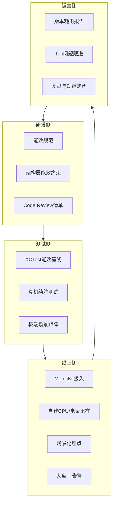
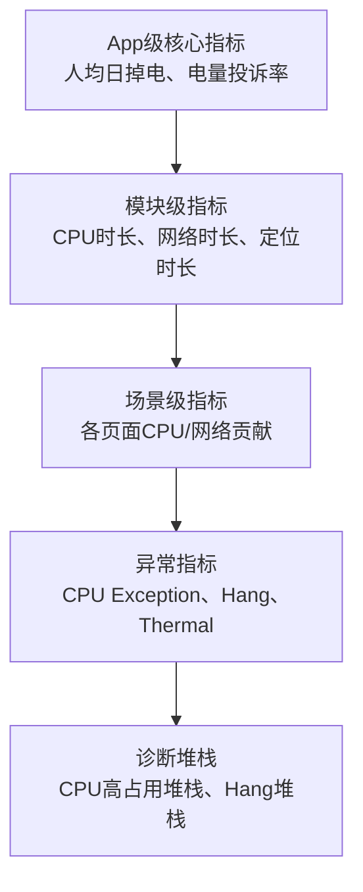
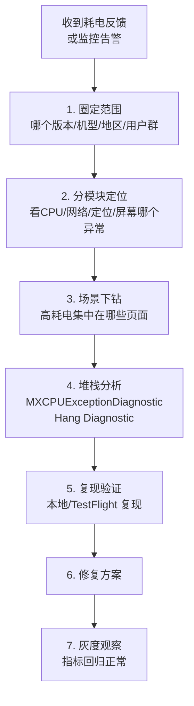

+++
title = "耗电-治理"
date = '2026-05-07T15:42:48+08:00'
draft = false
weight = 14
tags = ["iOS", "性能优化", "耗电"]
categories = ["iOS开发", "性能优化"]
+++
前面几篇分别讲了耗电的原理、检测、以及CPU/网络/定位/屏幕的具体优化手段。本文把这些内容整合起来，给出一套面向工程团队的 **耗电治理体系**：从研发规范、线上监控、问题排查到常态化运营。

> 耗电治理是 APM 资源子系的一部分，与稳定性、流畅性、启动指标共用同一套监控与告警基础设施。完整的 APM 建设方案见 [APM 系列](../APM/APM.md)：[数据采集](../APM/APM-数据采集.md)、[B端平台设计](../APM/APM-B端平台设计.md)。

---

## 一、治理体系全景

一个成熟的iOS耗电治理体系通常由四个闭环组成：



---

## 二、研发阶段的能效规范

### 模块准入清单

每个新增模块在接入主App前，必须回答以下问题：

| 维度      | 问题                                 |
| ------- | ---------------------------------- |
| CPU     | 是否有常驻Timer？是否有轮询？是否在不可见时暂停？        |
| 网络      | 请求频率？是否合并？是否支持后台取消？                |
| 定位      | 是否申请定位？精度多少？后台策略？                  |
| 传感器     | 是否开启传感器？采样率？视图生命周期？                |
| 后台能力    | 是否申请Background Mode？如何收敛？          |
| 动画/渲染   | 是否有长驻动画？是否适配ProMotion？             |
| Low Power | 低电量模式下的降级策略？                       |
| 权限      | 涉及的用户权限？是否遵守最小权限原则？                |

### 架构层面的能效约束

一些通用能力可以在架构层统一管控，避免各业务重复踩坑：

1. **统一Timer管理器**：所有业务Timer注册到全局Tick调度器，统一tolerance。
2. **统一后台任务调度器**：对业务方隐藏BGTaskScheduler，暴露"请在合适时机帮我跑一下这个任务"的业务API。
3. **统一网络客户端**：强制URLSession复用、请求批量、失败退避。
4. **统一定位服务**：对业务方提供"一次性定位""位置变化订阅"等高层API，底层自动管理精度与硬件。
5. **统一Motion服务**：按需启停，共享采样。
6. **EnergyPolicy中心**：统一判断Low Power、Thermal、电量，对各模块下发降级指令。

### Code Review清单

Review时关注以下"能效异味"：

```
[ ] Timer/DispatchTimer/CADisplayLink 是否随视图生命周期管理？是否加了tolerance？
[ ] while/for循环里是否有可能的忙等？
[ ] DispatchQueue(qos:) 选择是否合理？是否滥用userInteractive？
[ ] 是否在不可见/后台时停止动画和渲染？
[ ] 网络请求是否复用Session？高频小请求是否可合并？
[ ] 定位API选择是否最低精度 + 最大distanceFilter？
[ ] beginBackgroundTask 是否成对调用 endBackgroundTask？
[ ] 是否监听 NSProcessInfoPowerStateDidChange 做降级？
[ ] 是否监听 thermalStateDidChangeNotification 做降级？
[ ] 新增Background Mode是否有充足理由？
```

---

## 三、测试阶段的能效保障

### 能效基线测试

使用XCTest的 `XCTCPUMetric`、`XCTClockMetric` 等对关键业务路径做基线测试：

```swift
func testFeedScrollEnergyBaseline() {
    let options = XCTMeasureOptions()
    options.iterationCount = 5
    
    measure(metrics: [
        XCTCPUMetric(),
        XCTMemoryMetric(),
        XCTStorageMetric(),
        XCTClockMetric()
    ], options: options) {
        // 标准化场景：进入Feed → 滚动20次 → 返回
        launchAndScrollFeed()
    }
}
```

CI流水线集成：

- 每次合入主干执行基线测试。
- 指标劣化超过阈值（比如CPU Time +10%）时 Block 合入。
- 记录历史趋势，定期回顾。

### 真机续航测试

脚本化自动化 + 真机对比：

```
测试场景：
1. 冷启动App
2. 首页滚动10分钟
3. 进入视频页播放30分钟
4. 后台挂起2小时
5. 结束

观察指标：
- 电量下降百分比
- Thermal State变化
- MetricKit事件数
- 关键异常（CPU Exception、Hang）
```

### 极端场景矩阵

必须覆盖的边界场景：

| 场景             | 目的                         |
| -------------- | -------------------------- |
| 低电量模式          | 验证降级策略生效                   |
| 弱网（3G/蜂窝+丢包）   | 验证重试退避、预加载关闭               |
| 设备过热（critical） | 验证主动降帧、暂停动画                |
| 长时间后台          | 验证定位/音频/BG Task正确收敛        |
| 无网/飞行模式        | 验证请求不会死循环                  |
| 内存紧张           | 验证资源释放逻辑                   |
| 新设备（ProMotion） | 验证自适应刷新率工作正常               |
| 旧设备（iPhone 8）  | 验证性能降级场景不卡不烫             |

---

## 四、线上监控指标体系

### 金字塔式指标



### 推荐的核心指标

#### App级（大盘看板）

| 指标        | 定义                             | 数据源               |
| --------- | ------------------------------ | ----------------- |
| 人均日CPU时长  | 日均 cumulativeCPUTime / 人均前台时长 | MetricKit         |
| 人均日后台时长   | cumulativeBackgroundTime       | MetricKit         |
| 人均日蜂窝流量   | cumulativeCellularDownload/Upload | MetricKit       |
| 人均日定位时长   | cumulativeBestAccuracyTime     | MetricKit         |
| 人均前台掉电速率  | 电量下降 % / 前台时长                  | 自建                |
| 电量投诉率     | 有"耗电"关键词反馈 / MAU                | 客服系统              |
| CPU异常率    | MXCPUExceptionDiagnostic次数 / DAU | MetricKit         |
| Hang率     | MXHangDiagnostic次数 / DAU        | MetricKit         |
| Thermal升级率 | thermalState 升到 serious+ 的比例    | 自建                |

#### 模块级

- 定位模块：开启次数/时长、精度分布、后台定位比例。
- 网络模块：请求次数、蜂窝占比、失败率、重试次数。
- 音视频：播放时长、清晰度分布、后台播放时长。
- 动画：常驻动画数、CADisplayLink数。

#### 场景级

按页面/业务打标，聚合该场景下的CPU时长、网络流量、定位时长占比。当用户投诉"某个页面耗电"时，可以直接下钻。

### 告警规则

```yaml
告警规则:
  版本回归告警:
    - 指标: 人均CPU时长
      窗口: 灰度期间
      阈值: 较基线 +10%
    - 指标: MXCPUExceptionDiagnostic数
      阈值: 较基线 +50%
  
  突发异常告警:
    - 指标: Thermal critical次数
      阈值: 15分钟内 > 1000
    - 指标: 定位常开用户占比
      阈值: 单日 > 5%
  
  用户反馈告警:
    - 关键词: "耗电" + "发烫"
      阈值: 单日 > 50条
```

---

## 五、耗电问题排查手册

### 标准排查流程



### 常见根因与对策

| 症状                      | 高频根因                                          | 对策                                                |
| ----------------------- | --------------------------------------------- | ------------------------------------------------- |
| 后台掉电快                   | 后台定位未停、后台音频假播放、BG Task漏关、Silent Push滥用       | BG Mode审查、endBackgroundTask对齐、Silent Push频率限制     |
| 前台用5分钟电掉10%             | CPU密集计算、Timer高频、死循环、GPU渲染、大量动画                | Time Profiler、Timer合并、动画生命周期管理                    |
| 手机发烫                    | 视频软解、定位Best + 持续、AR/动画满帧                      | 硬解、降精度、ProMotion自适应                               |
| iOS设置里显示"后台活动较多"        | 后台任务长时间运行                                     | BGTask使用 isDiscretionary + requiresExternalPower |
| 用户开启低电量模式后仍然耗电快         | 没有适配Low Power Mode                            | 监听 NSProcessInfoPowerStateDidChange 做降级           |
| 弱网/没网时耗电                | 疯狂重试、心跳过密                                     | 指数退避、心跳自适应、waitsForConnectivity                   |
| 某页面停留耗电高                | 定位常开、CADisplayLink未释放、WebView JS循环           | 视图生命周期审查                                          |

### 排查工具箱

1. **MetricKit Diagnostic**：MXCPUExceptionDiagnostic、MXHangDiagnostic。
2. **线下复现**：Instruments Time Profiler + Network。
3. **TestFlight真机**：真机 + Xcode Energy Gauge。
4. **自建堆栈聚合**：把高CPU时抓的主线程堆栈聚类。

---

## 六、Low Power Mode与Thermal降级矩阵

建议制定一张全局降级矩阵，在关键模块统一适配：

| 模块     | nominal | fair | serious                    | critical                     | Low Power Mode              |
| ------ | ------- | ---- | -------------------------- | ---------------------------- | --------------------------- |
| 动画     | 全开      | 全开   | 减少复杂动效                     | 关闭非必要动画                      | 关闭非必要动画                     |
| ProMotion刷新率 | 120Hz | 120Hz | 60Hz                   | 30Hz                         | 30Hz                        |
| 视频自动播放 | 开       | 开    | 可见区域开                      | 关                            | 关                           |
| 视频清晰度  | HD      | HD   | SD                         | SD/暂停                        | SD                          |
| 预加载    | 开       | 开    | 减半                         | 关                            | 关                           |
| 定位精度   | 业务指定    | 业务指定 | 降一档                        | 最低必要                         | 最低必要                        |
| 传感器采样  | 业务指定    | 业务指定 | 降一半                        | 关闭非关键                        | 降一半                         |
| 后台任务   | 正常      | 正常   | 仅必要                        | 全部推迟                         | 全部推迟                        |
| Haptic | 开       | 开    | 仅关键反馈                      | 关                            | 关                           |

---

## 七、发版流程中的能效卡口

### 灰度期间的关注指标

新版本灰度期间，应重点监控：

- 人均前台/后台时长。
- 人均CPU时长。
- MXCPUExceptionDiagnostic率。
- Hang率。
- Thermal升级率。
- 电池相关用户反馈关键词。

对应的判断规则：

```
满足任一条件则暂停扩量：
- 核心指标任意项较上版本劣化 > 15%
- MXCPUExceptionDiagnostic 较基线 +30%
- 电量相关反馈较基线 +50%
```

### 能效 SLO

可以给重点能效指标定SLO（Service Level Objective）：

```
例子：
- P50用户日均CPU时长 ≤ 30分钟
- 后台定位用户占比 ≤ 2%
- Thermal critical用户比例 ≤ 0.1%
- MXCPUExceptionDiagnostic率 ≤ 0.5‰
```

---

## 八、常态化运营

### 版本耗电报告

建议每次大版本发布后一周内发布"版本耗电报告"：

- 对比上一版本的核心指标。
- 列出Top N耗电场景（按贡献占比）。
- 列出本版本已修复/新发现的耗电问题。
- 下一版本的优化计划。

### 周期性Top问题治理

从MetricKit的Diagnostic数据中提取Top堆栈，组织专项治理：

- 每月Top10高CPU堆栈分析。
- 每季度Top页面能效回顾。
- 年度能效架构升级规划。

### 能效文化

- 新人入职培训加入"能效规范"章节。
- 团队Wiki维护"能效最佳实践"案例库。
- 定期组织耗电治理复盘会。

---

## 九、治理案例模板

一个典型的耗电治理Case应该包含以下内容，方便沉淀复用：

```
# 案例标题
- 背景：什么业务、什么场景
- 现象：用户反馈 / 指标异常
- 定位过程：用了哪些工具（MetricKit / Time Profiler / ...）
- 根因：具体的代码或设计问题
- 修复：具体改动 + 数据对比（before/after）
- 规范化：形成什么通用规则避免再犯
```

---

## 十、治理路线图

耗电治理不可能一蹴而就，一般可以分三个阶段推进：

```mermaid
gantt
    title 耗电治理路线图
    dateFormat X
    axisFormat %s
    
    section Phase 1 可观测
    MetricKit接入         :a1, 0, 30
    电量采样 + 热状态上报    :a2, 0, 30
    场景化埋点             :a3, 20, 30
    大盘 + 告警            :a4, 30, 30
    
    section Phase 2 专项优化
    Top场景CPU优化         :b1, 60, 60
    网络聚合 + 后台收敛       :b2, 60, 60
    定位治理               :b3, 90, 60
    Low Power Mode适配     :b4, 120, 30
    
    section Phase 3 常态运营
    CI能效基线             :c1, 150, 60
    版本能效卡口            :c2, 180, 60
    能效报告 + 复盘          :c3, 210, 90
```



---

## 小结

| 阶段  | 核心动作                                                      |
| --- | --------------------------------------------------------- |
| 研发  | 能效规范、架构层统一管控、Code Review清单                                 |
| 测试  | XCTest能效基线、真机续航测试、极端场景矩阵                                   |
| 线上  | MetricKit + 自建采样 + 场景埋点，金字塔式指标 + 告警                        |
| 运营  | 版本耗电报告、Top问题治理、能效文化沉淀                                      |
| 应急  | 低电量模式降级矩阵、Thermal降级矩阵、排查手册                                 |

耗电治理的本质是 **把"看不见的能量消耗"变成"可以衡量、可以回归、可以持续改进的工程指标"**。做好了这套闭环，不仅App的耗电口碑会好转，整个工程团队对"如何评估一个功能的成本"也会有更成熟的思考方式。
