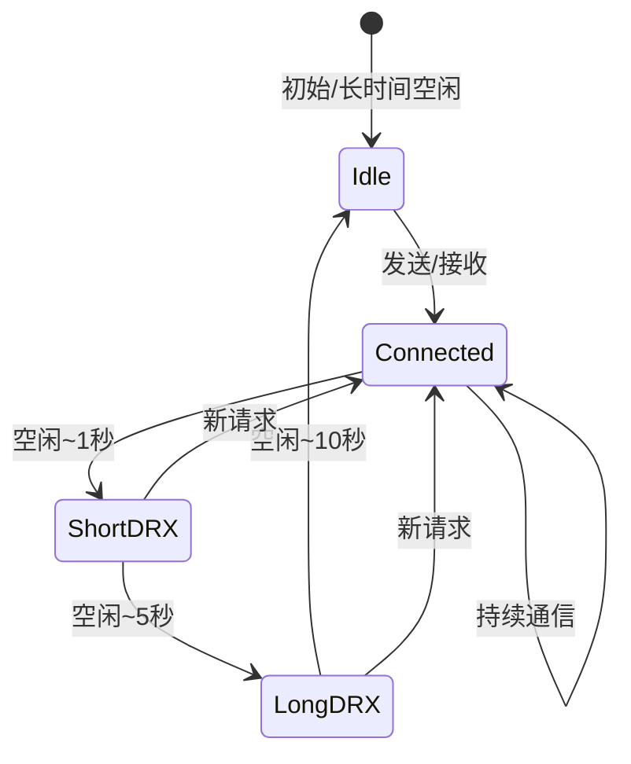
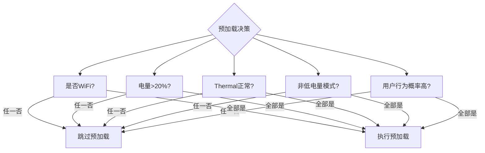

+++
title = "耗电-网络优化"
date = '2026-05-02T22:32:27+08:00'
draft = false
weight = 15
tags = ["iOS", "性能优化", "耗电"]
categories = ["iOS开发", "性能优化"]
+++
网络是iOS设备上仅次于屏幕的耗电大户。和其他模块不同，网络耗电的"坑"非常隐蔽——请求本身只持续几十毫秒，但无线电（Radio）会有10~20秒的"尾能耗"。本文从无线电能效模型出发，给出具体的网络优化手段。

---

## 一、无线电能效模型回顾

### RRC状态机再看一眼

无线电不是"开就费电、关就不费电"这么简单。它在连接和空闲之间存在中间状态：



| 状态         | 功耗           | 说明                    |
| ---------- | ------------ | --------------------- |
| Connected  | 最高（~1~2W）    | 数据传输中                 |
| Short DRX  | 中等           | 周期性监听页 paging，仍持有连接   |
| Long DRX   | 低            | 周期变长，仍在空中接口           |
| Idle       | 极低（~几mW）     | 完全释放                  |

一次请求从发起到彻底回到Idle大约 **12~20秒**。这个尾巴就是"Tail Energy"。

### 能效启示

```
10次请求，每次间隔2秒：
- Radio持续处于Connected/DRX状态 ≈ 30秒
- 实际传输时间可能只有几百ms

10次请求合并成1次:
- Radio活跃时间 ≈ 15秒（主要是尾巴）
- 节省约50%~70%的Radio能耗
```

**结论：网络能效的核心就是"减少Radio醒来的次数"。**

---

## 二、请求合并与批处理

### 业务层合并

很多业务请求天然可以合并：

```swift
// Bad: 一次性发送5个埋点
for event in events {
    APIClient.shared.post("/log", body: event.toDict())
}

// Good: 批量上报
APIClient.shared.post("/log/batch", body: ["events": events.map { $0.toDict() }])
```

### 埋点上报的合并策略

典型的埋点SDK应该具备：

- **内存缓冲**：达到N条或T秒后上报。
- **WiFi优先**：非强制场景下，WiFi时立即上报，蜂窝时延后。
- **页面离开时Flush**：避免永久滞留。
- **后台进入时Flush**：避免被杀后丢失。
- **压缩**：gzip/brotli减小包体。

```swift
class EventReporter {
    private var buffer: [Event] = []
    private let lock = NSLock()
    private var flushTimer: DispatchSourceTimer?
    
    init() {
        scheduleFlush()
        NotificationCenter.default.addObserver(
            forName: UIApplication.didEnterBackgroundNotification,
            object: nil,
            queue: .main
        ) { [weak self] _ in
            self?.flush(reason: "background")
        }
    }
    
    func log(_ event: Event) {
        lock.lock(); defer { lock.unlock() }
        buffer.append(event)
        if buffer.count >= 50 {
            flush(reason: "size")
        }
    }
    
    private func scheduleFlush() {
        let t = DispatchSource.makeTimerSource(queue: .global(qos: .utility))
        t.schedule(deadline: .now() + 30, repeating: 30, leeway: .seconds(10))
        t.setEventHandler { [weak self] in self?.flush(reason: "interval") }
        t.resume()
        self.flushTimer = t
    }
    
    private func flush(reason: String) {
        lock.lock()
        let pending = buffer
        buffer.removeAll()
        lock.unlock()
        
        guard !pending.isEmpty else { return }
        APIClient.shared.post("/log/batch", body: ["events": pending])
    }
}
```

---

## 三、后台下载：使用NSURLSession的BackgroundConfiguration

iOS提供了"后台URLSession"机制，适合大文件、非紧急下载。

```swift
let config = URLSessionConfiguration.background(withIdentifier: "com.example.bg.download")
config.isDiscretionary = true                 // 允许系统选择最佳时机
config.sessionSendsLaunchEvents = true        // 完成时唤起App
config.waitsForConnectivity = true            // 网络不可用时等待
config.allowsCellularAccess = false           // 只在WiFi下下载

let session = URLSession(configuration: config, delegate: self, delegateQueue: nil)
let task = session.downloadTask(with: url)
task.resume()
```

### isDiscretionary的威力

`isDiscretionary = true` 告诉系统"这个任务我不着急，你选个合适的时候跑"。系统可能：

- 等设备连上WiFi再跑。
- 等设备充电再跑。
- 合并多个discretionary任务一起跑。

这是苹果官方最推荐的"低能耗下载"方式。

### 后台Session的生命周期

```swift
// AppDelegate
func application(_ application: UIApplication,
                 handleEventsForBackgroundURLSession identifier: String,
                 completionHandler: @escaping () -> Void) {
    BackgroundDownloadManager.shared.setCompletionHandler(completionHandler, for: identifier)
}

// Session delegate
func urlSessionDidFinishEvents(forBackgroundURLSession session: URLSession) {
    DispatchQueue.main.async {
        BackgroundDownloadManager.shared.callCompletionHandler(for: session.configuration.identifier!)
    }
}
```

---

## 四、连接复用与HTTP/2 / HTTP/3

### Keep-Alive的能效意义

每次TCP建连 + TLS握手需要 **2~3个RTT**，同时要持续持有Radio。复用连接可以：

- 减少握手Radio时间。
- 减少CPU加密开销。
- 避免多次Radio唤醒。

### 让URLSession复用连接

```swift
// 全局复用一个Session（或少数几个）
class APIClient {
    static let shared = APIClient()
    
    let session: URLSession = {
        let config = URLSessionConfiguration.default
        config.httpMaximumConnectionsPerHost = 6
        config.timeoutIntervalForRequest = 15
        return URLSession(configuration: config)
    }()
}

// Bad: 每次创建新的Session
func badRequest() {
    let session = URLSession(configuration: .default)  // 不复用
    session.dataTask(with: url).resume()
}
```

### HTTP/2多路复用

HTTP/2在单一TCP连接上多路复用，配合iOS默认的QUIC优化（HTTP/3），能显著减少Radio唤醒次数。服务器和CDN侧应优先启用HTTP/2/3。

### CDN选择与就近接入

- 蜂窝网下DNS解析和首包延迟越小，Radio活跃时间越短。
- HTTPDNS + 就近节点能把首包从几百ms降到几十ms，Radio耗电随之下降。

---

## 五、长连接与心跳策略

### 长连接的双刃剑

长连接（Socket/WebSocket/MQTT）能避免反复握手，但心跳本身就是耗电源。典型IM App的长连接策略：

- 前台：20~30秒心跳，保证及时性。
- 后台：使用APNs唤起，而不是死扛心跳。
- 无网：退避重连，避免频繁重试。

### 心跳间隔的优化

```
不同网络NAT超时：
- WiFi家用路由器：5~30分钟
- 运营商LTE NAT：约60~300秒
- 部分国产运营商：短至30秒

建议：
- 初始心跳240秒
- 若断开则二分探测，找到当前网络的最大心跳间隔
- 动态保存，减少不必要的心跳
```

### 使用Push替代高频心跳

对于消息推送类场景，Apple Push Notification service (APNs) 是最节能的选择：

- 系统级长连接，App无需维护自己的长连接。
- 支持VoIP Push、Background Push、Alert Push。
- 对于非实时消息，完全可以用APNs + Silent Push唤起。

---

## 六、网络质量感知与重试

### 感知连接类型

```swift
import Network

class NetworkMonitor {
    static let shared = NetworkMonitor()
    let monitor = NWPathMonitor()
    private(set) var isWiFi = false
    private(set) var isExpensive = false
    private(set) var isConstrained = false  // 低数据模式
    
    func start() {
        monitor.pathUpdateHandler = { [weak self] path in
            self?.isWiFi = path.usesInterfaceType(.wifi)
            self?.isExpensive = path.isExpensive
            self?.isConstrained = path.isConstrained
        }
        monitor.start(queue: .global(qos: .utility))
    }
}
```

- `isExpensive`：蜂窝网络、个人热点。
- `isConstrained`：用户开启了"低数据模式"（iOS 13+）。

### 请求优先级策略

| 场景                | WiFi           | 蜂窝              | 低数据模式       |
| ----------------- | -------------- | --------------- | ----------- |
| 必需请求（登录、支付）       | 立即             | 立即              | 立即          |
| 业务数据（Feed、详情页）   | 立即             | 立即              | 立即          |
| 预加载（下一页、缩略图）      | 立即             | 延后/缩减           | 关闭          |
| 视频高清              | 自动HD           | 根据用户设置（默认SD）    | 强制SD        |
| 后台同步              | 立即             | 延后或等充电          | 关闭          |
| 埋点上报              | 立即             | 合并到更大的batch     | 合并并延后       |
| 图片自动播放GIF/Video   | 开               | 根据用户设置          | 关闭          |

### 合理的重试与退避

```swift
class RetryPolicy {
    
    func nextDelay(attempt: Int) -> TimeInterval {
        // 指数退避 + 抖动，避免同时重试
        let base = min(pow(2.0, Double(attempt)), 60)  // 2, 4, 8, 16, 32, 60
        let jitter = Double.random(in: 0...0.3) * base
        return base + jitter
    }
    
    func shouldRetry(error: Error, attempt: Int) -> Bool {
        if attempt >= 5 { return false }
        // 只对网络类错误重试，4xx业务错误不重试
        return (error as NSError).domain == NSURLErrorDomain
    }
}
```

**反例**：立即重试、固定间隔重试，在弱网下会引发"重试风暴"，Radio被彻底拉满，电量飞速下降。

### waitsForConnectivity

对于非即时请求，可以让URLSession自己等待网络恢复，而不是让业务层写重试逻辑：

```swift
let config = URLSessionConfiguration.default
config.waitsForConnectivity = true
config.timeoutIntervalForResource = 600  // 最长等10分钟

let session = URLSession(configuration: config, delegate: self, delegateQueue: nil)
```

系统会在网络真正可用时才启动传输，避免Radio瞎醒。

---

## 七、数据量压缩

相同的耗电预算下，带宽越大数据越多。压缩能直接缩短Radio活跃时间。

| 方向    | 策略                                         |
| ----- | ------------------------------------------ |
| 协议    | HTTP/2 + gzip/brotli                       |
| 文本    | JSON → Protobuf / FlatBuffers，减小50%+         |
| 图片    | 优选WebP/AVIF/HEIC，根据屏幕缩放选择分辨率                |
| 视频    | HEVC/AV1，分片自适应码率                            |
| 日志/埋点 | Protobuf + gzip，字段缩写                        |
| 列表接口  | 字段剪裁，分页，按需加载                                |

### 图片尺寸适配示例

```swift
extension UIImageView {
    func setURL(_ url: URL) {
        let scale = UIScreen.main.scale
        let w = Int(bounds.width * scale)
        let h = Int(bounds.height * scale)
        // 服务端按需裁剪
        let sized = url.appendingQuery("w=\(w)&h=\(h)&fmt=webp")
        Kingfisher.setImage(with: sized)
    }
}
```

不要下载全量大图再裁剪——既浪费流量又浪费CPU解码。

---

## 八、弱网场景的能效陷阱

弱网下每次请求的Radio活跃时间被极大延长，失败率也高。弱网优化同时就是能效优化：

1. **连接阶段**：使用Happy Eyeballs（IPv4/IPv6并发），更快建连。
2. **传输阶段**：启用QUIC/HTTP/3，0-RTT恢复。
3. **失败处理**：使用退避 + 最终降级（比如降清晰度、关预加载）。
4. **弱网感知**：连续失败N次后，主动进入"省流省电模式"。

---

## 九、预加载的边界

预加载能提升体验，但滥用会直接拉升流量和功耗。



建议的预加载检查：

```swift
func canPrefetch() -> Bool {
    if ProcessInfo.processInfo.isLowPowerModeEnabled { return false }
    if ProcessInfo.processInfo.thermalState != .nominal { return false }
    if !NetworkMonitor.shared.isWiFi { return false }
    if UIDevice.current.batteryLevel < 0.2, UIDevice.current.batteryState == .unplugged { return false }
    return true
}
```

---

## 十、网络能效检查清单

- [ ] 是否复用URLSession？是否只有少量Session实例？
- [ ] 是否使用HTTP/2或HTTP/3？
- [ ] 所有 "一段时间内" 的请求是否被合并？
- [ ] 后台/离线下载是否使用background URLSession + isDiscretionary？
- [ ] 预加载是否有网络/电量/热状态的gating？
- [ ] 埋点是否批量 + 延后？
- [ ] 弱网重试是否有指数退避 + 上限？
- [ ] 心跳策略是否根据前后台动态调整？
- [ ] 是否尊重用户的"低数据模式"设置？
- [ ] 是否优先使用APNs而不是自建长连接？

---

## 小结

| 维度       | 关键优化点                              |
| -------- | ---------------------------------- |
| 合并       | 请求聚合、埋点批量、Long Polling → Push      |
| 协议       | HTTP/2/3、Keep-Alive、复用Session      |
| 后台       | background URLSession + discretionary |
| 心跳       | 动态探测、前后台差异、APNs替代                  |
| 弱网       | 指数退避、waitsForConnectivity、弱网降级     |
| 压缩/裁剪    | gzip/brotli、Protobuf、图片尺寸适配        |
| 预加载      | WiFi + 电量 + 热状态多重gating            |

下一篇进入 [耗电-定位与传感器优化](./耗电-定位与传感器优化.md)。
