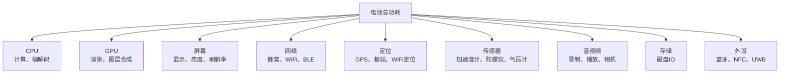
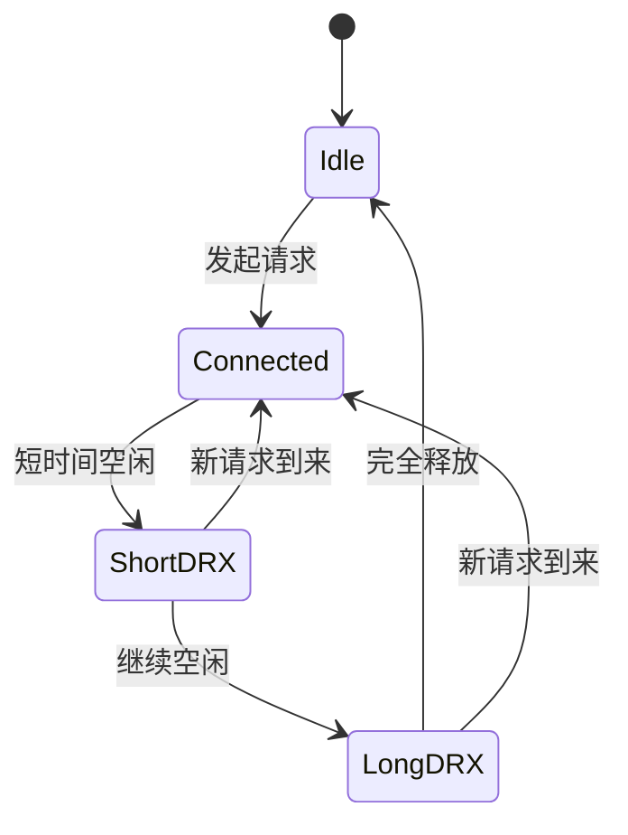

+++
title = "耗电"
date = '2026-05-08T22:35:33+08:00'
draft = false
weight = 16
tags = ["iOS", "性能优化", "耗电"]
categories = ["iOS开发", "性能优化"]
math = true
+++
耗电（Energy Consumption）是移动应用质量的重要指标之一。一款耗电过快的App会直接影响用户的续航体验，轻则被用户吐槽，重则被系统标记为"耗电大户"（在iOS的"设置 → 电池"中显示），最终被用户卸载。

本系列文章从iOS功耗模型入手，系统性地介绍耗电问题的原理、检测、优化与治理。

---

## 为什么要关注耗电

iOS设备的电池容量有限（iPhone通常在3000~5000mAh），而应用的功耗会直接影响续航时间。苹果在iOS 8之后提供了"电池用量"统计入口，用户可以清楚地看到每个App消耗的电量比例。

常见的耗电投诉场景：

| 场景                  | 用户感知          | 典型原因                     |
| ------------------- | ------------- | ------------------------ |
| 后台待机一晚电量掉20%        | 手机放着不用也掉电     | 后台定位、后台音频、后台Fetch未合理释放 |
| App使用1小时电量掉30%      | 使用过程电量下降过快    | CPU长时间高占用、高频网络请求、GPU密集渲染 |
| 手机发烫                | 设备温度异常升高      | CPU/GPU长期满载、持续定位、频繁屏幕唤醒 |
| 被系统标记为"后台活动"过高      | 系统提示"此App正在消耗大量电池" | 后台任务未合理调度，违反能效规则       |

苹果对"耗电"非常敏感——从iOS 9开始引入低电量模式（Low Power Mode），从iOS 13开始加强后台任务的能效审查（BackgroundTasks框架），从iOS 15开始通过MetricKit将功耗数据开放给开发者。

---

## iOS功耗模型概述

iOS设备的功耗来源可以分为以下几大类：



不同硬件模块的功耗量级差异很大。参考苹果WWDC的数据，定位和蜂窝数据通常是"耗电大户"，屏幕是"持续耗电大户"，而CPU/GPU在计算密集时瞬时功耗最高。

| 模块     | 典型功耗等级 | 特点              |
| ------ | ------ | --------------- |
| 屏幕     | 持续高    | 只要亮屏就持续耗电       |
| 蜂窝数据   | 高      | 搜索基站、维持连接都耗电    |
| GPS定位  | 高      | 冷启动搜星耗电特别明显     |
| CPU/GPU | 中~高    | 计算量决定功耗          |
| WiFi   | 中      | 比蜂窝省电            |
| 蓝牙（BLE）| 低      | 低功耗蓝牙专为续航优化     |
| 传感器    | 低~中    | 高频采样会显著增加功耗     |

---

## 耗电问题的本质

耗电问题的本质可以用一个简单的公式表示：

\[ Energy = Power \times Time \]

即 **功耗 = 瞬时功率 × 持续时间**。治理耗电的核心思路只有两条：

1. **降低瞬时功率**：减少CPU/GPU的工作量、降低网络带宽、降低采样频率。
2. **缩短工作时间**：合并任务、批量处理、及时释放资源、避免长驻后台。

苹果把这两个原则具体化为三个能效准则：

1. **Race to Sleep**（赶紧睡觉）：让硬件尽快完成任务并进入低功耗状态，避免长时间"半吊子"运行。
2. **Coalesce Work**（合并任务）：把多个小任务合并成一次执行，减少硬件被唤醒的次数。
3. **Defer and Batch**（延后与批量）：非紧急的任务延后执行，并在合适的时机批量处理。

---

## 文章导航

本系列包含以下文章，建议按顺序阅读：

### 1. 原理篇

- [耗电-原理](./耗电-原理.md)
  - iOS功耗模型
  - CPU/GPU的P-State与C-State
  - 网络模块的能效状态机
  - 屏幕与硬件的功耗特性
  - 系统的能效调度机制

### 2. 检测篇

- [耗电-检测](./耗电-检测.md)
  - Xcode Energy Gauge
  - Instruments Energy Log
  - MetricKit线上功耗数据
  - IOKit私有API采集电量
  - 自建线上耗电监控体系

### 3. 优化篇

#### 3.1 CPU与后台优化

- [耗电-CPU与后台优化](./耗电-CPU与后台优化.md)
  - 减少CPU空转与轮询
  - Timer与RunLoop优化
  - GCD QoS合理使用
  - BackgroundTasks框架
  - 后台音频、后台定位的正确姿势

#### 3.2 网络优化

- [耗电-网络优化](./耗电-网络优化.md)
  - 无线电能效状态机
  - 请求合并与延后
  - 后台下载与NSURLSession
  - 长连接心跳策略
  - 弱网与重试策略

#### 3.3 定位与传感器优化

- [耗电-定位与传感器优化](./耗电-定位与传感器优化.md)
  - CLLocationManager精度与频率
  - SignificantLocationChange与Region Monitoring
  - 传感器采样频率控制
  - 屏幕亮度与ProMotion
  - 低电量模式适配

### 4. 治理篇

- [耗电-治理](./耗电-治理.md)
  - 研发阶段的能效规范
  - 线上耗电监控指标体系
  - 常见耗电问题排查手册
  - 低电量模式下的降级策略
  - 能效性能卡口与CI集成

---

## 关键指标

在开始治理前，需要先明确业务可观测的耗电指标：

| 指标                           | 含义                                                     | 来源                         |
| ---------------------------- | ------------------------------------------------------ | -------------------------- |
| cumulativeCPUTime            | 累计CPU时间                                                | MetricKit                  |
| cumulativeBackgroundTime     | 累计后台活跃时间                                               | MetricKit                  |
| cumulativeForegroundTime     | 累计前台时间                                                 | MetricKit                  |
| cumulativeCellularDownload/Upload | 累计蜂窝流量                                             | MetricKit                  |
| cumulativeWifiDownload/Upload     | 累计WiFi流量                                            | MetricKit                  |
| cumulativeBestAccuracyTime   | 最高精度定位累计时长                                             | MetricKit                  |
| averagePixelLuminance        | 平均像素亮度（间接反映屏幕功耗）                                        | MetricKit (OLED)           |
| 电池消耗速率                       | 单位时间内电量下降百分比                                           | 自建监控（UIDevice + 采样）        |
| 能效评分                         | 综合CPU/网络/定位等的线上评分                                       | 自建（参考WWDC能效公式）             |

这些指标是后续"检测篇"和"治理篇"的基础。

---

## 小结

| 要点           | 说明                               |
| ------------ | -------------------------------- |
| 核心公式         | Energy = Power × Time            |
| 能效三原则        | Race to Sleep、Coalesce、Defer & Batch |
| 主要耗电模块       | 屏幕、蜂窝、定位、CPU/GPU                 |
| 主要优化方向       | 减少轮询、合并请求、降低频率、及时释放、适配低电量模式      |
| 官方检测工具       | Energy Gauge、Instruments、MetricKit |

后续文章会分模块展开具体的优化与治理手段。

---

## 面试题：iOS App 耗电的原理是什么？

### 1. 能量模型：耗电不是瞬时值，而是功率对时间的积分

电池消耗的是能量，不是某一个瞬间的功率。功耗的基本公式可以简化为：

\[
Energy = Power \times Time
\]

也就是：

- **Power**：某个硬件模块单位时间内的功耗。
- **Time**：这个硬件模块保持活跃的时间。
- **Energy**：这段时间内真正消耗的总能量。

App 层通常拿不到精确的电压、电流曲线，所以线上治理不会直接用电流建模，而是通过 MetricKit、自建采样和场景埋点，间接观察 **CPU 时间、后台时长、网络流量、最高精度定位时长、屏幕亮度、热状态** 等指标。

更工程化的能耗模型可以写成：

\[
Energy_{total} = \sum_{module} Time_{active,module} \times Power_{module}
\]

也就是说，总耗电可以近似看成各个硬件模块的 **活跃时间 × 平均功率** 的累加。MetricKit 中很多指标之所以是"累计时间"，比如 `cumulativeCPUTime`、`cumulativeBackgroundTime`、`cumulativeBestAccuracyTime`，本质上就是在帮助我们估算不同模块的活跃成本。

所以耗电优化最终都逃不开三件事：

| 方向 | 本质 | 例子 |
| --- | --- | --- |
| 降低平均功率 | 让硬件用更低功耗档位工作 | 降低定位精度、降低刷新率、降低采样频率、降低视频清晰度 |
| 缩短活跃时间 | 让硬件更快完成任务并休眠 | 任务执行完及时释放 CPU、GPS、相机、音频、后台任务 |
| 减少唤醒次数 | 避免频繁把硬件从低功耗状态拉起来 | 合并 Timer、合并请求、批量上报、延后非关键任务 |

苹果常说的 **Race to Sleep**、**Coalesce Work**、**Defer and Batch**，本质上对应的也是这三类策略。

### 2. CPU 原理：P-State 决定工作功率，C-State 决定休眠深度

CPU 是 App 最常直接影响的耗电模块。现代 iPhone 的 CPU 会通过 **DVFS（Dynamic Voltage and Frequency Scaling，动态电压频率调整）** 在性能和功耗之间切换。

CPU 工作时有不同的 **P-State（Performance State）**：

| 状态 | 含义 | 特点 |
| --- | --- | --- |
| 高 P-State | 高频率、高电压 | 性能强，瞬时功耗高 |
| 低 P-State | 低频率、低电压 | 性能弱，瞬时功耗低 |

但这并不代表"永远低频慢慢跑"就最省电。因为如果任务拖得很久，CPU 会长时间停留在活跃状态，反而增加总能耗。所以系统经常倾向于：短时间高性能完成任务，然后尽快进入休眠。这就是 **Race to Sleep**。

CPU 空闲时还有 **C-State（Core State）**：

| 状态 | 含义 | 功耗 |
| --- | --- | --- |
| C0 | 正在执行代码 | 最高 |
| C1 | 浅休眠，时钟门控 | 较低 |
| C2 | 更深休眠，部分电源门控 | 很低 |
| C3+ | 深度休眠，核心下电 | 接近 0 |

真正耗电的很多场景，并不是 CPU 一直满载，而是 **频繁唤醒导致 CPU 无法进入深度 C-State**。比如：

- 多个 1s / 500ms 的 `Timer` 分散触发。
- 短间隔轮询状态。
- `CADisplayLink` 页面不可见后仍然回调。
- 后台线程忙等。
- 小任务不断打断系统休眠。

这些问题的共同点是：每次任务都不重，但它们让系统一直睡不深。

### 3. GPU 与屏幕：渲染负载、刷新率和亮度会持续耗电

GPU 的功耗模型和 CPU 类似，也会根据渲染负载调整频率。复杂图层合成、离屏渲染、大纹理、模糊、透明混合、持续动画，都会让 GPU 保持活跃。

GPU 还有一个特殊点：它和屏幕刷新绑定。

| 刷新率 | 每帧间隔 | 意味着 |
| --- | --- | --- |
| 60Hz | 16.67ms | 每秒最多 60 次渲染机会 |
| 120Hz | 8.33ms | 每秒最多 120 次渲染机会，渲染压力更高 |

如果页面持续动画，或者 `CADisplayLink` 一直跑在高刷新率下，CPU/GPU 都会被周期性唤醒。对于静态内容，应该让系统有机会降到更低刷新率；在 ProMotion 设备上，也可以通过 `preferredFrameRateRange` 给系统降帧提示。

屏幕本身也是持续耗电大户。OLED 设备上深色模式通常更省电。MetricKit 的 `averagePixelLuminance` 就可以间接反映 UI 对屏幕功耗的影响：大面积高亮、纯白背景、长时间常亮页面，都会推高屏幕侧能耗。

### 4. 网络原理：蜂窝无线电有 Tail Energy，小请求频繁打散很耗电

网络耗电不能只看请求耗时。蜂窝网络真正重要的是无线电状态机，尤其是 **Tail Energy（尾能耗）**。

一次蜂窝请求大致会经历：



关键点是：请求结束后，无线电不会马上回到 Idle，而是会在 Connected / DRX 等状态停留一段时间，可能持续十几秒。这段时间即使没有真正传输数据，也仍然在耗电。

所以：

- 10 个请求分散在 10 秒内发，可能让 Radio 一直保持高功耗状态。
- 10 个请求合并成 1 次发，Radio 只需要被唤醒一次。

长连接心跳也是类似问题。前台实时业务可以维持必要心跳，但后台应该优先依赖 APNs 或系统调度，避免自己用短心跳强行保活。

### 5. 定位与传感器：精度、频率和生命周期决定耗电

定位是 iOS 上典型的高功耗能力，尤其是高精度 GPS。定位耗电的关键变量有三个：

| 变量 | 影响 |
| --- | --- |
| 精度 | 精度越高，越可能启用 GPS，功耗越高 |
| 持续时间 | 定位持续越久，总能耗越高 |
| 启停成本 | GPS 冷启动搜星成本高，频繁启停也会浪费能量 |

因此定位优化不是简单地"不用定位"，而是：

- 用业务能接受的最低精度。
- 一次性定位优先使用 `requestLocation()`。
- 持续定位要设置 `distanceFilter`、`activityType`、`pausesLocationUpdatesAutomatically`。
- 后台场景优先考虑 Significant Location Change、Region Monitoring、Visits。
- 页面消失或业务结束时及时停止定位。

传感器也是类似逻辑。加速度计、陀螺仪、磁力计、气压计等传感器的功耗与 **采样频率** 强相关。如果页面不可见还在 100Hz 采样，或者能用系统融合能力却自己采原始传感器数据，都会造成明显耗电。

### 6. iOS 系统策略：低电量、热状态和后台预算都会影响能效

iOS 不会把所有资源无限开放给 App。系统会根据电量、温度、前后台状态、充电状态动态调整策略。

低电量模式（Low Power Mode）开启后，系统会倾向于：

- 限制 CPU 峰值性能。
- 暂停或减少后台刷新。
- 降低部分视觉效果。
- 降低 ProMotion 最高刷新率。
- 延后部分同步任务。

App 可以通过 `ProcessInfo.processInfo.isLowPowerModeEnabled` 检测，并主动关闭预加载、自动播放、非必要后台同步、高精度定位和复杂动画。

热状态（Thermal State）也会影响系统调度：

| 状态 | 含义 | App 策略 |
| --- | --- | --- |
| `.nominal` | 正常 | 正常运行 |
| `.fair` | 略热 | 准备降级 |
| `.serious` | 明显过热 | 降帧、暂停非核心任务、降低采样率 |
| `.critical` | 危险 | 关闭高耗电能力，只保留核心功能 |

后台任务还有额外预算限制。普通 App 进入后台后很快会被挂起，Background App Refresh、BG Processing、Silent Push 都由系统调度。后台任务如果不及时结束，或者滥用后台定位、后台音频、Silent Push，就会造成明显耗电，也可能被系统降低调度优先级。

### 7. 根因总结：耗电通常来自"高功率、长时间、高频唤醒"

从原理上看，App 耗电问题一般可以归纳为三类：

| 根因 | 解释 | 典型例子 |
| --- | --- | --- |
| 高功率 | 硬件模块工作在高功耗档位 | CPU/GPU 长时间高负载、高精度 GPS、相机、AR、蜂窝传输 |
| 长时间 | 高功耗模块没有及时释放 | 后台任务不结束、定位不停止、音视频/相机长驻 |
| 高频唤醒 | 单次任务不重，但频繁打断系统休眠 | 高频 Timer、轮询、小请求、短心跳、频繁传感器采样 |

---

## 面试题：如何治理能耗？

耗电治理是在理解功耗模型之后，围绕 **量化 → 归因 → 分层治理 → 收益验证 → 防劣化** 建立的一套质量工程闭环。

### 1. 量化：先把"耗电高"定义清楚

治理的第一步是量化。没有指标，就只能靠主观体感判断"好像比较耗电"。

线下可以用 Xcode Energy Gauge、Instruments、Time Profiler、Network Instruments 找单机热点；线上通常分两层：

1. **MetricKit 天级大盘**：看 CPU、GPU、后台、网络、定位、屏幕亮度、诊断异常等系统级累计指标。
2. **自建实时采集体系**：补充 MetricKit 的延迟和场景粒度，记录电量窗口、CPU 实时采样、Thermal / Low Power 事件、网络请求、定位生命周期、音视频/相机/传感器生命周期。

MetricKit 适合回答"这个版本整体有没有劣化"，自建采集适合回答"哪个页面、哪个功能、哪个后台任务正在耗电"。

| 层级 | 关键指标 | 作用 |
| --- | --- | --- |
| 系统大盘 | `cumulativeCPUTime`、`cumulativeGPUTime`、`cumulativeBackgroundTime`、蜂窝/WiFi 流量、`cumulativeBestAccuracyTime`、`averagePixelLuminance` | 建立版本、机型、系统维度的耗电基线 |
| 异常诊断 | CPU Exception、Hang、Disk Write Exception、Thermal serious+ | 发现高 CPU、卡死、磁盘写入超限、发热等高风险问题 |
| 电量窗口 | 前台/后台/场景掉电速率，例如 `% / hour` | 衡量用户真实感知的掉电速度 |
| CPU 实时采样 | 1~5 秒采样、窗口平均 CPU、持续高 CPU 事件、触发式堆栈 | 捕获 MetricKit 无法实时发现的 CPU 空转、死循环、后台高 CPU |
| 网络埋点 | 请求数、失败数、重试数、蜂窝/WiFi 流量、接口维度、网络类型 | 判断小请求过多、弱网重试风暴、蜂窝流量异常 |
| 定位埋点 | `start/stop`、精度、前后台、`activityType`、持续时长 | 判断高精度定位、后台定位、生命周期未收敛 |
| 硬件生命周期 | 音视频、相机、传感器、模型推理等能力的开始/结束、参数、耗时 | 识别高功耗能力长驻或参数过高 |

量化时不能只看累计值，要做归一化和分位数：

| 指标 | 推荐口径 |
| --- | --- |
| CPU 强度 | `CPU 秒 / 前台小时`，同时看 P50/P95/P99 |
| 后台强度 | `后台秒 / DAU` 或 `后台秒 / 后台用户` |
| 蜂窝流量强度 | `蜂窝 MB / 前台小时` |
| 高精度定位强度 | `高精度定位秒 / 定位用户` |
| 前台掉电速率 | `电量下降百分比 / 前台小时` |
| 后台掉电速率 | `电量下降百分比 / 后台小时` |
| Thermal 升级率 | `serious/critical 用户数 / DAU` |

自建采集要控制成本，避免监控本身变成耗电来源。一般是：电量普通场景 3~5 分钟采一次，重点场景 60~120 秒；CPU 普通场景 5 秒采一次，高风险场景 1 秒；Thermal 和 Low Power 用系统通知；网络、定位、音视频、相机、传感器用统一封装做 `start/stop` 生命周期埋点；本地 30~60 秒聚合后批量上报。

这一步的目标不是马上修问题，而是把"耗电高"变成可比较、可告警、可下钻的指标体系。

### 2. 归因：定位到具体场景、模块和代码路径

归因的重点，是把一个笼统的耗电问题拆到具体版本、具体场景、具体硬件模块和具体代码路径。

| 维度 | 排查目的 |
| --- | --- |
| 版本 | 判断是否由某次发布、实验或配置变更引入 |
| 机型 | 判断是否集中在低端机、老设备或特定芯片平台 |
| 系统版本 | 判断是否和 iOS 版本、后台策略、定位策略变化有关 |
| 前后台状态 | 区分前台使用耗电和后台待机耗电 |
| 业务场景 | 定位到首页、Feed、直播、导航、聊天、后台同步等具体场景 |
| 硬件模块 | 拆到 CPU/GPU、Radio、GPS、屏幕、传感器、音视频、相机 |
| 代码路径 | 结合堆栈、埋点、日志、接口统计定位到具体模块或接口 |

归因时可以建立一棵"耗电问题树"：

| 异常现象 | 优先怀疑方向 | 典型证据 |
| --- | --- | --- |
| CPU 时间上涨 | 高频计算、Timer、轮询、死循环、锁竞争 | MetricKit CPU、实时 CPU 采样、触发式堆栈、Time Profiler |
| 后台时长上涨 | 后台任务未结束、后台定位、后台音频、Silent Push | `cumulativeBackgroundTime`、后台任务日志、后台能力生命周期 |
| 蜂窝流量上涨 | 请求过多、重试风暴、心跳过密、预加载过度 | 蜂窝流量、请求密度、重试率、接口 TopN |
| 高精度定位时长上涨 | 定位精度过高、生命周期未收敛、后台持续定位 | `cumulativeBestAccuracyTime`、定位 `start/stop`、精度和前后台字段 |
| Thermal 变差 | CPU/GPU 长时间高负载、相机/音视频/AR/模型推理长驻 | Thermal 事件、CPU/GPU 指标、硬件生命周期、页面场景 |
| 用户反馈后台耗电 | 后台任务、定位、音频、网络同步、蓝牙扫描 | 前后台切换日志、后台掉电窗口、后台能力使用记录 |

比如发现"新版本耗电上涨"，不能停留在 App 整体指标上，要继续追问：

- 是 CPU 时间上涨，还是后台活跃时间上涨？
- 是 WiFi/蜂窝流量上涨，还是最高精度定位时长上涨？
- 是所有用户都上涨，还是某个机型、系统版本、业务场景上涨？
- 是前台页面导致的，还是后台任务、Silent Push、定位、音频导致的？

只有完成归因，后面的治理才不会变成盲目优化。

### 3. 分层治理：先止血，再根因修复，最后平台化

耗电治理不只是"改几行代码"。成熟做法通常分三层：

| 层级 | 目标 | 典型手段 |
| --- | --- | --- |
| 止血层 | 先控制影响面 | 暂停灰度、回滚版本、关闭开关、下发配置、禁用高耗电功能、降低采样频率 |
| 修复层 | 解决具体根因 | 合并请求、移除轮询、停止后台任务、降低定位精度、暂停离屏动画、修复死循环或锁竞争 |
| 架构层 | 降低重复发生概率 | 统一 Timer 调度、统一网络批量上报、统一定位服务、统一后台任务、统一 EnergyPolicy |

分模块落地时，可以这样展开：

| 模块 | 常见根因 | 治理手段 |
| --- | --- | --- |
| CPU | 高频 Timer、轮询、死循环、QoS 过高、锁竞争 | 事件驱动替代轮询；合并 Timer 并设置 `leeway`；长任务使用 `.utility` / `.background`；避免忙等 |
| 后台 | 后台任务不结束、后台定位/音频滥用、Silent Push 轮询 | 使用 BackgroundTasks；任务完成及时回调；后台能力按业务必要性收敛 |
| 网络 | 小请求频繁打散、心跳过密、弱网重试风暴 | 批量上报；连接复用；指数退避 + 抖动；后台优先使用 APNs；大文件用 `background` session |
| 定位 | 长时间高精度定位、页面消失后未停止、后台持续定位 | 按需选择最低精度；一次性定位用 `requestLocation()`；合理设置 `distanceFilter`、`activityType` 和自动暂停 |
| 屏幕/GPU | 持续动画、ProMotion 满帧、大面积高亮 UI、离屏渲染 | 不可见动画暂停；静态内容降低刷新率；支持深色模式；减少复杂图层合成 |
| 传感器/音视频/相机 | 高频采样、视频软解、相机长驻、不可见视频仍播放 | 降低采样率；优先硬解；不可见立即 pause；相机按需 `startRunning` / `stopRunning` |

这里要特别强调 **运行时降级**。成熟 App 不应该等系统强制降频或杀后台，而应该在低电量、过热、弱网、低数据模式下主动降级：

| 状态 | 推荐策略 |
| --- | --- |
| Low Power Mode | 关闭预加载和自动播放，暂停非必要后台同步，降低定位精度，降低动画和刷新率 |
| Thermal serious | 降帧、减少动画、降低视频清晰度、降低传感器采样率，只保留必要后台任务 |
| Thermal critical | 关闭非核心功能，暂停 AR/相机/复杂渲染，停止非必要定位和后台任务 |
| 蜂窝/低数据模式 | 关闭大流量预加载，埋点合并延后，图片和视频降级，后台同步等待 WiFi |
| 电量低且未充电 | 延后非关键任务，减少心跳和刷新频率，避免大文件下载和高精度定位 |

可以把这些条件收敛到一个统一的能效策略中心，例如：

```swift
func canRunNonCriticalWork() -> Bool {
    if ProcessInfo.processInfo.isLowPowerModeEnabled {
        return false
    }

    switch ProcessInfo.processInfo.thermalState {
    case .serious, .critical:
        return false
    case .nominal, .fair:
        break
    @unknown default:
        return false
    }

    if NetworkMonitor.shared.isConstrained {
        return false
    }

    return true
}
```

预加载、自动播放、后台同步、非必要定位、动画帧率、震动反馈等，都可以统一挂到这个策略后面。

### 4. 收益验证：治理是否真的有效

耗电治理不能以"代码合入"作为结束，而要看线上指标是否真的改善。

| 验证方式 | 关注点 |
| --- | --- |
| 灰度对比 | 新版本相对上一稳定版本 CPU、后台时长、定位时长、网络流量是否回落 |
| 分群对比 | 低端机、老系统、蜂窝网络、后台用户是否改善 |
| 场景对比 | 高耗电页面、后台同步、定位场景、音视频场景是否恢复到基线 |
| 回归验证 | 是否因为降级引入体验问题，例如消息不及时、定位不准、播放质量下降 |
| 长周期观察 | 是否只在首日改善，还是完整发布周期内趋势稳定 |

这一步很关键，因为有些优化只是在单机测试中看起来有效，线上可能被用户行为、机型差异、弱网、后台调度等因素抵消。修复是否完成，不能看 PR 是否合入，而要看核心指标是否回到基线。

### 5. 防劣化：把经验固化成机制

大型治理最后一定要落到防劣化，否则就会变成运动式专项。常见沉淀方式如下：

| 机制 | 动作 |
| --- | --- |
| 研发准入 | 新模块必须说明 Timer、网络、定位、传感器、音视频、后台能力和 Low Power 降级策略 |
| 架构约束 | 建统一 Timer 调度器、网络客户端、定位服务、后台任务调度器、EnergyPolicy 中心 |
| Code Review | 检查 Timer 生命周期、QoS、轮询、后台任务成对结束、定位精度、网络批量和退避 |
| 测试卡口 | 用 XCTest 指标做 CPU/耗时基线；真机验证低电量、弱网、过热、长后台等极端场景 |
| 线上监控 | MetricKit + 自建实时采集 + 生命周期埋点，按版本/机型/场景看趋势和 Top 问题 |
| 灰度 SLO | 新版本 CPU、后台时长、定位时长、Thermal、耗电反馈劣化超过阈值就暂停扩量 |
| 常态运营 | 每版本输出耗电报告，定期治理 Top CPU 堆栈、Top 高耗电页面和高风险后台能力 |
