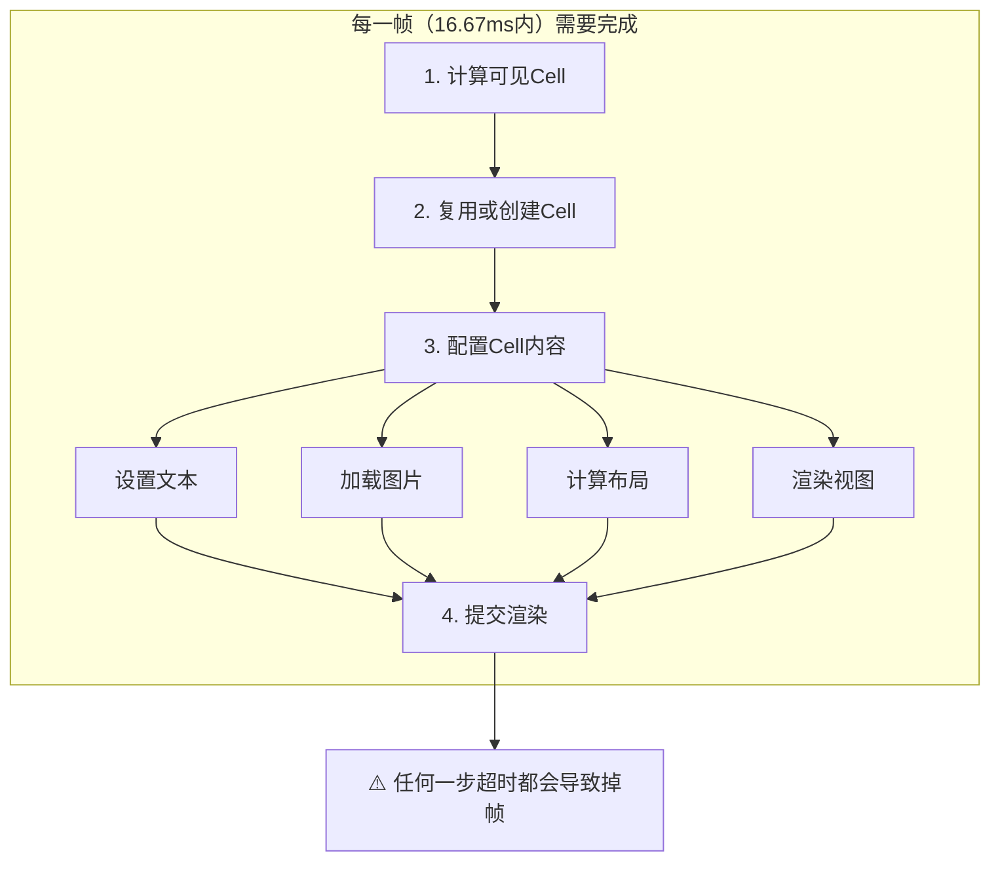
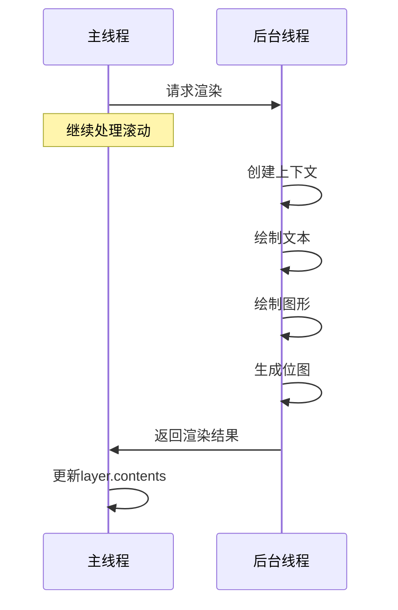
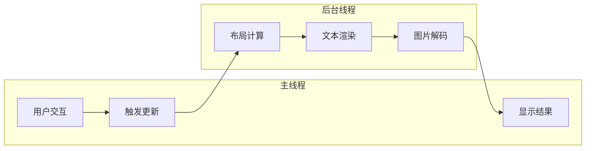
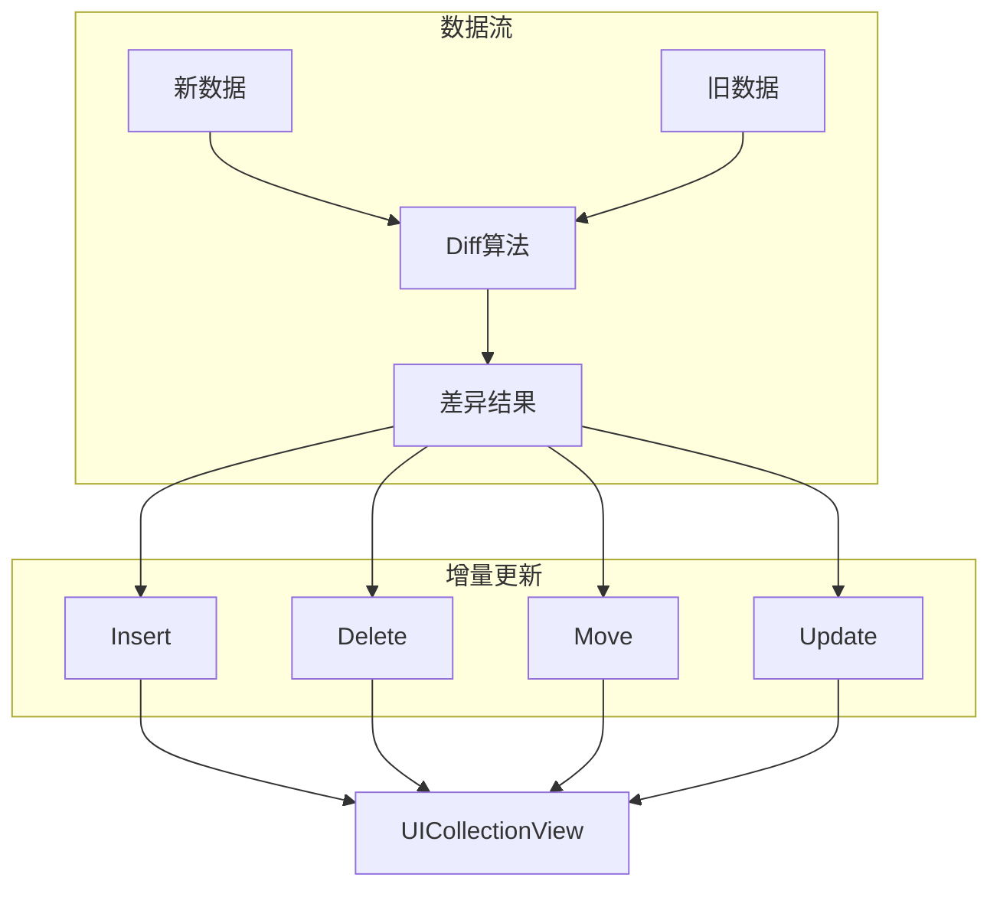

+++
title = "卡顿-TableView优化"
date = '2026-05-02T22:32:27+08:00'
draft = false
weight = 25
tags = ["iOS", "性能优化", "卡顿"]
categories = ["iOS开发", "性能优化"]
+++
列表滚动是用户最敏感的交互场景之一。本文介绍UITableView和UICollectionView的性能优化方案。

---

## 列表卡顿的常见原因



### 常见问题

| 问题 | 原因 | 影响 |
|-----|------|------|
| 高度计算慢 | 复杂布局、Auto Layout | 滚动卡顿 |
| Cell配置慢 | 大量视图操作、图片加载 | 滚动卡顿 |
| 复用失效 | 未正确注册、identifier错误 | 内存暴涨、卡顿 |
| 离屏渲染 | 圆角、阴影 | GPU瓶颈 |
| 图片加载 | 主线程解码 | 滚动卡顿 |

---

## Cell复用机制

### 正确使用复用

```swift
class OptimizedTableViewController: UITableViewController {
    
    private let cellIdentifier = "OptimizedCell"
    
    override func viewDidLoad() {
        super.viewDidLoad()
        
        // 注册Cell类（推荐）
        tableView.register(OptimizedCell.self, forCellReuseIdentifier: cellIdentifier)
        
        // 或注册Nib
        // tableView.register(UINib(nibName: "OptimizedCell", bundle: nil), forCellReuseIdentifier: cellIdentifier)
    }
    
    override func tableView(_ tableView: UITableView, cellForRowAt indexPath: IndexPath) -> UITableViewCell {
        // 使用dequeueReusableCell（带indexPath的版本会自动创建）
        let cell = tableView.dequeueReusableCell(withIdentifier: cellIdentifier, for: indexPath) as! OptimizedCell
        
        // 配置Cell
        let item = items[indexPath.row]
        cell.configure(with: item)
        
        return cell
    }
}
```

### Cell的prepareForReuse

```swift
class OptimizedCell: UITableViewCell {
    
    private let titleLabel = UILabel()
    private let avatarImageView = OptimizedImageView()
    private var currentTask: URLSessionTask?
    
    override func prepareForReuse() {
        super.prepareForReuse()
        
        // 重置状态
        titleLabel.text = nil
        avatarImageView.image = nil
        
        // 取消进行中的任务
        currentTask?.cancel()
        currentTask = nil
        avatarImageView.cancelLoading()
    }
    
    func configure(with item: Item) {
        titleLabel.text = item.title
        
        // 异步加载图片
        avatarImageView.setImage(from: item.avatarURL, placeholder: UIImage(named: "placeholder"))
    }
}
```

---

## 高度缓存

### 问题：每次都计算高度

```swift
// 问题代码：每次滚动都重新计算
func tableView(_ tableView: UITableView, heightForRowAt indexPath: IndexPath) -> CGFloat {
    let item = items[indexPath.row]
    return calculateHeight(for: item)  // 耗时操作
}
```

### 解决方案1：预计算并缓存

```swift
class HeightCachedTableViewController: UITableViewController {
    
    private var items: [Item] = []
    private var heightCache: [IndexPath: CGFloat] = [:]
    
    func setItems(_ newItems: [Item]) {
        items = newItems
        heightCache.removeAll()
        
        // 预计算高度（可以在后台线程）
        precomputeHeights()
        
        tableView.reloadData()
    }
    
    private func precomputeHeights() {
        let width = tableView.bounds.width
        
        for (index, item) in items.enumerated() {
            let indexPath = IndexPath(row: index, section: 0)
            heightCache[indexPath] = calculateHeight(for: item, width: width)
        }
    }
    
    private func calculateHeight(for item: Item, width: CGFloat) -> CGFloat {
        // 计算文本高度
        let textHeight = item.content.boundingRect(
            with: CGSize(width: width - 32, height: .greatestFiniteMagnitude),
            options: [.usesLineFragmentOrigin, .usesFontLeading],
            attributes: [.font: UIFont.systemFont(ofSize: 16)],
            context: nil
        ).height
        
        return ceil(textHeight) + 60  // 加上其他元素的高度
    }
    
    override func tableView(_ tableView: UITableView, heightForRowAt indexPath: IndexPath) -> CGFloat {
        return heightCache[indexPath] ?? UITableView.automaticDimension
    }
    
    // 数据更新时更新缓存
    func updateItem(at indexPath: IndexPath, with item: Item) {
        items[indexPath.row] = item
        heightCache[indexPath] = calculateHeight(for: item, width: tableView.bounds.width)
        tableView.reloadRows(at: [indexPath], with: .automatic)
    }
}
```

### 解决方案2：使用estimatedHeight

```swift
class EstimatedHeightTableViewController: UITableViewController {
    
    private var heightCache: [IndexPath: CGFloat] = [:]
    
    override func viewDidLoad() {
        super.viewDidLoad()
        
        // 设置估算高度（重要！）
        tableView.estimatedRowHeight = 100
        tableView.rowHeight = UITableView.automaticDimension
    }
    
    override func tableView(_ tableView: UITableView, willDisplay cell: UITableViewCell, forRowAt indexPath: IndexPath) {
        // 缓存实际显示的高度
        heightCache[indexPath] = cell.bounds.height
    }
    
    override func tableView(_ tableView: UITableView, estimatedHeightForRowAt indexPath: IndexPath) -> CGFloat {
        // 优先返回缓存的高度
        return heightCache[indexPath] ?? 100
    }
}
```

### 解决方案3：固定高度

```swift
// 如果所有Cell高度相同，直接设置固定值
override func viewDidLoad() {
    super.viewDidLoad()
    
    tableView.rowHeight = 80  // 固定高度，性能最好
    tableView.estimatedRowHeight = 0  // 关闭估算
}
```

---

## 异步渲染

### 基本原理

将复杂的渲染工作移到后台线程：



### 异步渲染实现

```swift
class AsyncRenderingCell: UITableViewCell {
    
    private let contentLayer = CALayer()
    private var renderTask: DispatchWorkItem?
    private var currentItem: Item?
    
    override init(style: UITableViewCell.CellStyle, reuseIdentifier: String?) {
        super.init(style: style, reuseIdentifier: reuseIdentifier)
        
        contentLayer.contentsScale = UIScreen.main.scale
        contentView.layer.addSublayer(contentLayer)
    }
    
    required init?(coder: NSCoder) {
        fatalError("init(coder:) has not been implemented")
    }
    
    override func layoutSubviews() {
        super.layoutSubviews()
        contentLayer.frame = contentView.bounds
    }
    
    override func prepareForReuse() {
        super.prepareForReuse()
        
        renderTask?.cancel()
        renderTask = nil
        contentLayer.contents = nil
        currentItem = nil
    }
    
    func configure(with item: Item) {
        currentItem = item
        
        // 取消之前的渲染任务
        renderTask?.cancel()
        
        let size = contentView.bounds.size
        let scale = UIScreen.main.scale
        
        // 创建新的渲染任务
        let task = DispatchWorkItem { [weak self] in
            guard let self = self else { return }
            
            // 在后台线程渲染
            let image = self.renderContent(item: item, size: size, scale: scale)
            
            DispatchQueue.main.async {
                // 检查是否仍然是当前item
                guard self.currentItem?.id == item.id else { return }
                
                self.contentLayer.contents = image?.cgImage
            }
        }
        
        renderTask = task
        DispatchQueue.global(qos: .userInitiated).async(execute: task)
    }
    
    private func renderContent(item: Item, size: CGSize, scale: CGFloat) -> UIImage? {
        let format = UIGraphicsImageRendererFormat()
        format.scale = scale
        format.opaque = true
        
        let renderer = UIGraphicsImageRenderer(size: size, format: format)
        
        return renderer.image { context in
            // 背景
            UIColor.white.setFill()
            context.fill(CGRect(origin: .zero, size: size))
            
            // 绘制头像占位
            let avatarRect = CGRect(x: 16, y: 16, width: 48, height: 48)
            UIColor.lightGray.setFill()
            UIBezierPath(ovalIn: avatarRect).fill()
            
            // 绘制标题
            let titleRect = CGRect(x: 80, y: 16, width: size.width - 96, height: 24)
            item.title.draw(in: titleRect, withAttributes: [
                .font: UIFont.boldSystemFont(ofSize: 16),
                .foregroundColor: UIColor.black
            ])
            
            // 绘制内容
            let contentRect = CGRect(x: 80, y: 44, width: size.width - 96, height: size.height - 60)
            item.content.draw(in: contentRect, withAttributes: [
                .font: UIFont.systemFont(ofSize: 14),
                .foregroundColor: UIColor.darkGray
            ])
        }
    }
}
```

### 使用TextKit异步计算

```swift
class AsyncTextLayoutManager {
    
    static func calculateLayout(
        text: String,
        font: UIFont,
        width: CGFloat,
        completion: @escaping (CGSize, NSLayoutManager) -> Void
    ) {
        DispatchQueue.global(qos: .userInitiated).async {
            let textStorage = NSTextStorage(string: text, attributes: [.font: font])
            let layoutManager = NSLayoutManager()
            let textContainer = NSTextContainer(size: CGSize(width: width, height: .greatestFiniteMagnitude))
            
            textContainer.lineFragmentPadding = 0
            layoutManager.addTextContainer(textContainer)
            textStorage.addLayoutManager(layoutManager)
            
            // 强制布局
            layoutManager.ensureLayout(for: textContainer)
            
            let size = layoutManager.usedRect(for: textContainer).size
            
            DispatchQueue.main.async {
                completion(size, layoutManager)
            }
        }
    }
}
```

---

## 预加载策略

### 使用Prefetching API

```swift
class PrefetchingTableViewController: UITableViewController, UITableViewDataSourcePrefetching {
    
    private var items: [Item] = []
    private var prefetchTasks: [IndexPath: URLSessionTask] = [:]
    
    override func viewDidLoad() {
        super.viewDidLoad()
        
        tableView.prefetchDataSource = self
    }
    
    // MARK: - UITableViewDataSourcePrefetching
    
    func tableView(_ tableView: UITableView, prefetchRowsAt indexPaths: [IndexPath]) {
        for indexPath in indexPaths {
            let item = items[indexPath.row]
            
            // 预加载图片
            if prefetchTasks[indexPath] == nil {
                let task = ImageCacheManager.shared.prefetch(url: item.imageURL)
                prefetchTasks[indexPath] = task
            }
        }
    }
    
    func tableView(_ tableView: UITableView, cancelPrefetchingForRowsAt indexPaths: [IndexPath]) {
        for indexPath in indexPaths {
            // 取消预加载
            prefetchTasks[indexPath]?.cancel()
            prefetchTasks.removeValue(forKey: indexPath)
        }
    }
}

extension ImageCacheManager {
    
    func prefetch(url: URL) -> URLSessionTask? {
        let key = url.absoluteString
        
        // 已缓存则跳过
        if MemoryImageCache.shared.image(forKey: key) != nil {
            return nil
        }
        
        let task = URLSession.shared.dataTask(with: url) { [weak self] data, _, _ in
            guard let data = data, let image = UIImage(data: data)?.decodedImage() else {
                return
            }
            
            self?.memoryCache.setImage(image, forKey: key)
        }
        
        task.resume()
        return task
    }
}
```

### 自定义预加载范围

```swift
class CustomPrefetchController {
    
    private weak var tableView: UITableView?
    private var prefetchRange: Int = 10  // 预加载前后10个
    private var prefetchedIndexPaths: Set<IndexPath> = []
    
    init(tableView: UITableView) {
        self.tableView = tableView
    }
    
    func updatePrefetch(for visibleIndexPaths: [IndexPath]) {
        guard let tableView = tableView else { return }
        
        let visibleRows = visibleIndexPaths.map { $0.row }
        guard let minRow = visibleRows.min(), let maxRow = visibleRows.max() else { return }
        
        let totalRows = tableView.numberOfRows(inSection: 0)
        
        // 计算预加载范围
        let prefetchStart = max(0, minRow - prefetchRange)
        let prefetchEnd = min(totalRows - 1, maxRow + prefetchRange)
        
        // 需要预加载的IndexPath
        var toPrefetch: [IndexPath] = []
        for row in prefetchStart...prefetchEnd {
            let indexPath = IndexPath(row: row, section: 0)
            if !prefetchedIndexPaths.contains(indexPath) {
                toPrefetch.append(indexPath)
                prefetchedIndexPaths.insert(indexPath)
            }
        }
        
        // 执行预加载
        prefetch(indexPaths: toPrefetch)
        
        // 清理过期的预加载记录
        cleanupPrefetchedIndexPaths(visibleRange: minRow...maxRow)
    }
    
    private func prefetch(indexPaths: [IndexPath]) {
        // 实现预加载逻辑
    }
    
    private func cleanupPrefetchedIndexPaths(visibleRange: ClosedRange<Int>) {
        prefetchedIndexPaths = prefetchedIndexPaths.filter { indexPath in
            let distance = min(
                abs(indexPath.row - visibleRange.lowerBound),
                abs(indexPath.row - visibleRange.upperBound)
            )
            return distance <= prefetchRange * 2
        }
    }
}
```

---

## 布局优化

### 避免复杂的Auto Layout

```swift
// 问题：复杂的约束布局
class ComplexLayoutCell: UITableViewCell {
    
    func setupConstraints() {
        // 大量约束会导致布局计算缓慢
        NSLayoutConstraint.activate([
            // 20+ 约束...
        ])
    }
}

// 优化：使用手动布局
class ManualLayoutCell: UITableViewCell {
    
    private let avatarImageView = UIImageView()
    private let titleLabel = UILabel()
    private let contentLabel = UILabel()
    
    override func layoutSubviews() {
        super.layoutSubviews()
        
        let bounds = contentView.bounds
        let padding: CGFloat = 16
        
        // 手动计算frame
        avatarImageView.frame = CGRect(x: padding, y: padding, width: 48, height: 48)
        
        let textX = avatarImageView.frame.maxX + 12
        let textWidth = bounds.width - textX - padding
        
        titleLabel.frame = CGRect(x: textX, y: padding, width: textWidth, height: 22)
        
        let contentY = titleLabel.frame.maxY + 4
        let contentHeight = bounds.height - contentY - padding
        contentLabel.frame = CGRect(x: textX, y: contentY, width: textWidth, height: contentHeight)
    }
}
```

### 使用sizeThatFits预计算

```swift
class SizeCachedCell: UITableViewCell {
    
    private let titleLabel = UILabel()
    private let contentLabel = UILabel()
    
    // 类方法计算高度，不需要实例化Cell
    static func height(for item: Item, width: CGFloat) -> CGFloat {
        let textWidth = width - 96  // 减去padding和头像
        
        // 标题高度
        let titleHeight: CGFloat = 22
        
        // 内容高度
        let contentFont = UIFont.systemFont(ofSize: 14)
        let contentHeight = item.content.boundingRect(
            with: CGSize(width: textWidth, height: .greatestFiniteMagnitude),
            options: [.usesLineFragmentOrigin],
            attributes: [.font: contentFont],
            context: nil
        ).height
        
        return 16 + titleHeight + 4 + ceil(contentHeight) + 16
    }
}
```

---

## 减少视图层级

### 问题：过多的子视图

```swift
// 问题：每个Cell有大量子视图
class HeavyCell: UITableViewCell {
    // 10+ 子视图
    let container = UIView()
    let topContainer = UIView()
    let bottomContainer = UIView()
    let avatar = UIImageView()
    let nameLabel = UILabel()
    let timeLabel = UILabel()
    let contentLabel = UILabel()
    let likeButton = UIButton()
    let commentButton = UIButton()
    let shareButton = UIButton()
    // ...
}
```

### 优化：合并绘制

```swift
class FlattenedCell: UITableViewCell {
    
    private let contentLayer = CALayer()
    private var avatarLayer = CALayer()
    
    override init(style: UITableViewCell.CellStyle, reuseIdentifier: String?) {
        super.init(style: style, reuseIdentifier: reuseIdentifier)
        
        // 只使用必要的图层
        contentLayer.contentsScale = UIScreen.main.scale
        layer.addSublayer(contentLayer)
        
        avatarLayer.contentsScale = UIScreen.main.scale
        avatarLayer.masksToBounds = true
        layer.addSublayer(avatarLayer)
    }
    
    required init?(coder: NSCoder) {
        fatalError("init(coder:) has not been implemented")
    }
    
    func configure(with item: Item) {
        // 异步渲染文本内容到单个图层
        renderTextContent(item: item)
        
        // 单独处理头像
        loadAvatar(url: item.avatarURL)
    }
    
    private func renderTextContent(item: Item) {
        // 将所有文本渲染到一个位图
        DispatchQueue.global(qos: .userInitiated).async { [weak self] in
            guard let self = self else { return }
            
            let size = self.bounds.size
            let image = self.drawTextContent(item: item, size: size)
            
            DispatchQueue.main.async {
                self.contentLayer.contents = image?.cgImage
            }
        }
    }
    
    private func drawTextContent(item: Item, size: CGSize) -> UIImage? {
        let renderer = UIGraphicsImageRenderer(size: size)
        return renderer.image { context in
            // 绘制所有文本
            // ...
        }
    }
    
    private func loadAvatar(url: URL) {
        // 异步加载头像
    }
}
```

---

## Diff更新

### 使用UITableViewDiffableDataSource

```swift
class DiffableTableViewController: UIViewController {
    
    enum Section {
        case main
    }
    
    private var tableView: UITableView!
    private var dataSource: UITableViewDiffableDataSource<Section, Item>!
    
    override func viewDidLoad() {
        super.viewDidLoad()
        
        setupTableView()
        setupDataSource()
    }
    
    private func setupTableView() {
        tableView = UITableView(frame: view.bounds, style: .plain)
        tableView.register(ItemCell.self, forCellReuseIdentifier: "ItemCell")
        view.addSubview(tableView)
    }
    
    private func setupDataSource() {
        dataSource = UITableViewDiffableDataSource<Section, Item>(tableView: tableView) { tableView, indexPath, item in
            let cell = tableView.dequeueReusableCell(withIdentifier: "ItemCell", for: indexPath) as! ItemCell
            cell.configure(with: item)
            return cell
        }
    }
    
    func updateItems(_ items: [Item], animated: Bool = true) {
        var snapshot = NSDiffableDataSourceSnapshot<Section, Item>()
        snapshot.appendSections([.main])
        snapshot.appendItems(items)
        
        dataSource.apply(snapshot, animatingDifferences: animated)
    }
    
    func appendItems(_ newItems: [Item]) {
        var snapshot = dataSource.snapshot()
        snapshot.appendItems(newItems)
        dataSource.apply(snapshot)
    }
    
    func deleteItem(_ item: Item) {
        var snapshot = dataSource.snapshot()
        snapshot.deleteItems([item])
        dataSource.apply(snapshot)
    }
}

// Item需要遵循Hashable
struct Item: Hashable {
    let id: String
    let title: String
    let content: String
    let avatarURL: URL
    
    func hash(into hasher: inout Hasher) {
        hasher.combine(id)
    }
    
    static func == (lhs: Item, rhs: Item) -> Bool {
        return lhs.id == rhs.id
    }
}
```

---

## 滚动优化技巧

### 快速滚动时跳过渲染

```swift
class ScrollOptimizedCell: UITableViewCell {
    
    var isScrolling = false {
        didSet {
            if !isScrolling {
                renderFullContent()
            }
        }
    }
    
    func configure(with item: Item, isScrolling: Bool) {
        self.isScrolling = isScrolling
        
        if isScrolling {
            // 快速滚动时只显示占位内容
            showPlaceholder()
        } else {
            // 静止时显示完整内容
            renderFullContent()
        }
    }
    
    private func showPlaceholder() {
        // 显示简单的占位UI
    }
    
    private func renderFullContent() {
        // 渲染完整内容
    }
}

class ScrollAwareTableViewController: UITableViewController {
    
    private var isScrolling = false
    private var scrollEndWorkItem: DispatchWorkItem?
    
    override func scrollViewDidScroll(_ scrollView: UIScrollView) {
        isScrolling = true
        
        scrollEndWorkItem?.cancel()
        scrollEndWorkItem = DispatchWorkItem { [weak self] in
            self?.isScrolling = false
            self?.reloadVisibleCells()
        }
        
        DispatchQueue.main.asyncAfter(deadline: .now() + 0.15, execute: scrollEndWorkItem!)
    }
    
    private func reloadVisibleCells() {
        for cell in tableView.visibleCells {
            if let optimizedCell = cell as? ScrollOptimizedCell {
                optimizedCell.isScrolling = false
            }
        }
    }
}
```

### 分页加载

```swift
class PaginatedTableViewController: UITableViewController {
    
    private var items: [Item] = []
    private var isLoading = false
    private var hasMoreData = true
    private let pageSize = 20
    
    override func scrollViewDidScroll(_ scrollView: UIScrollView) {
        let offsetY = scrollView.contentOffset.y
        let contentHeight = scrollView.contentSize.height
        let frameHeight = scrollView.frame.height
        
        // 距离底部100点时开始加载
        if offsetY > contentHeight - frameHeight - 100 {
            loadMoreIfNeeded()
        }
    }
    
    private func loadMoreIfNeeded() {
        guard !isLoading, hasMoreData else { return }
        
        isLoading = true
        
        // 加载下一页
        loadPage(offset: items.count) { [weak self] newItems in
            guard let self = self else { return }
            
            self.isLoading = false
            
            if newItems.count < self.pageSize {
                self.hasMoreData = false
            }
            
            let startIndex = self.items.count
            self.items.append(contentsOf: newItems)
            
            // 增量更新
            let indexPaths = (startIndex..<self.items.count).map {
                IndexPath(row: $0, section: 0)
            }
            
            self.tableView.insertRows(at: indexPaths, with: .automatic)
        }
    }
    
    private func loadPage(offset: Int, completion: @escaping ([Item]) -> Void) {
        // 网络请求加载数据
    }
}
```

---

## 常用三方库

### Texture (AsyncDisplayKit)

> 源码导读：[Texture源码导读](../三方库源码/Texture源码导读.md)

Facebook开源的异步UI框架。

#### 核心原理

Texture的核心思想是将UI渲染工作从主线程移至后台线程：



**Node与View的关系**：
- `ASDisplayNode` 是对 `UIView` 的线程安全封装
- Node的属性设置和布局计算可以在任意线程进行
- 只有最终渲染到屏幕时才需要主线程

**异步渲染流程**：
1. 在后台线程创建 `CGContext`
2. 将文本、图形绘制到位图
3. 生成 `CGImage` 后回到主线程
4. 直接赋值给 `layer.contents`，跳过 `UIView` 的绑定

#### 核心特性

| 特性 | 说明 |
|-----|------|
| 异步布局 | `layoutSpecThatFits:` 在后台线程执行，不阻塞主线程 |
| 异步渲染 | 文本、图片等复杂内容在后台线程绘制为位图 |
| 智能预加载 | 根据滚动方向和速度，自动预加载即将显示的内容 |
| 扁平化层级 | 将多个视图合并绘制到单个 layer，减少 GPU 压力 |

#### 优劣势分析

**优势**：
- 性能极致：复杂 Feed 流可达到稳定 60fps
- 预加载智能：ASRangeController 自动管理内存和预加载
- 布局强大：Flexbox 风格的布局系统，比 Auto Layout 性能更好

**劣势**：
- 学习曲线陡峭：需要理解 Node 体系，与 UIKit 思维差异大
- 侵入性强：需要用 ASDisplayNode 替换 UIView
- 维护成本高：团队需要统一使用 Texture，混用会增加复杂度
- 社区活跃度下降：Facebook 内部已转向 ComponentKit

#### 使用示例

```swift
import AsyncDisplayKit

class FeedNode: ASCellNode {
    
    let avatarNode = ASNetworkImageNode()
    let titleNode = ASTextNode()
    let contentNode = ASTextNode()
    
    init(item: FeedItem) {
        super.init()
        
        // 自动在后台线程处理
        automaticallyManagesSubnodes = true
        
        avatarNode.url = item.avatarURL
        avatarNode.style.preferredSize = CGSize(width: 48, height: 48)
        avatarNode.cornerRadius = 24
        
        titleNode.attributedText = NSAttributedString(
            string: item.title,
            attributes: [.font: UIFont.boldSystemFont(ofSize: 16)]
        )
        
        contentNode.attributedText = NSAttributedString(
            string: item.content,
            attributes: [.font: UIFont.systemFont(ofSize: 14)]
        )
    }
    
    override func layoutSpecThatFits(_ constrainedSize: ASSizeRange) -> ASLayoutSpec {
        let textStack = ASStackLayoutSpec.vertical()
        textStack.children = [titleNode, contentNode]
        textStack.spacing = 4
        
        let mainStack = ASStackLayoutSpec.horizontal()
        mainStack.children = [avatarNode, textStack]
        mainStack.spacing = 12
        
        return ASInsetLayoutSpec(
            insets: UIEdgeInsets(top: 16, left: 16, bottom: 16, right: 16),
            child: mainStack
        )
    }
}

class FeedViewController: ASDKViewController<ASTableNode> {
    
    private var items: [FeedItem] = []
    
    override init() {
        super.init(node: ASTableNode())
        node.dataSource = self
    }
    
    required init?(coder: NSCoder) {
        fatalError("init(coder:) has not been implemented")
    }
}

extension FeedViewController: ASTableDataSource {
    
    func tableNode(_ tableNode: ASTableNode, numberOfRowsInSection section: Int) -> Int {
        return items.count
    }
    
    func tableNode(_ tableNode: ASTableNode, nodeBlockForRowAt indexPath: IndexPath) -> ASCellNodeBlock {
        let item = items[indexPath.row]
        return {
            return FeedNode(item: item)
        }
    }
}
```

### IGListKit

> 源码导读：[IGListKit源码导读](../三方库源码/IGListKit源码导读.md)

Instagram开源的数据驱动列表框架。

#### 核心原理

IGListKit的核心是高效的Diff算法和组件化架构：



**Diff算法**（Paul Heckel算法）：
1. 遍历新旧数组，建立元素到位置的映射表
2. 通过 `diffIdentifier` 标识元素身份
3. 通过 `isEqual` 判断内容是否变化
4. 时间复杂度 O(n)，空间复杂度 O(n)

**组件化设计**：
- 每个数据对象对应一个 `ListSectionController`
- Section Controller 完全独立，管理自己的 Cell
- 数据驱动：只需更新数据源，框架自动计算差异并更新 UI

#### 核心特性

| 特性 | 说明 |
|-----|------|
| O(n) Diff | 线性时间复杂度的差异算法，即使数据量大也能快速计算 |
| 后台Diff | 差异计算在后台线程执行，不阻塞主线程 |
| 组件化 | 每个 Section 独立管理，便于复用和测试 |
| 批量更新 | 自动合并多次更新，减少 UI 刷新次数 |

#### 优劣势分析

**优势**：
- 学习成本低：基于 UICollectionView，概念容易理解
- 侵入性小：可以渐进式引入，与现有代码共存
- 组件化好：Section Controller 天然支持模块化开发
- 更新高效：智能 Diff 避免不必要的 Cell 刷新

**劣势**：
- 仅解决数据更新：不涉及异步渲染，复杂 Cell 仍需自行优化
- 仅支持 CollectionView：不直接支持 UITableView
- Section 粒度：对于简单列表可能过度设计

#### 使用示例

```swift
import IGListKit

// 数据模型
class FeedItem: ListDiffable {
    let id: String
    let title: String
    let content: String
    
    init(id: String, title: String, content: String) {
        self.id = id
        self.title = title
        self.content = content
    }
    
    func diffIdentifier() -> NSObjectProtocol {
        return id as NSObjectProtocol
    }
    
    func isEqual(toDiffableObject object: ListDiffable?) -> Bool {
        guard let other = object as? FeedItem else { return false }
        return title == other.title && content == other.content
    }
}

// Section Controller
class FeedSectionController: ListSectionController {
    
    private var item: FeedItem?
    
    override func sizeForItem(at index: Int) -> CGSize {
        guard let context = collectionContext else { return .zero }
        return CGSize(width: context.containerSize.width, height: 80)
    }
    
    override func cellForItem(at index: Int) -> UICollectionViewCell {
        guard let cell = collectionContext?.dequeueReusableCell(
            of: FeedCell.self,
            for: self,
            at: index
        ) as? FeedCell else {
            fatalError()
        }
        cell.configure(with: item)
        return cell
    }
    
    override func didUpdate(to object: Any) {
        item = object as? FeedItem
    }
}

// ViewController
class FeedListViewController: UIViewController, ListAdapterDataSource {
    
    private lazy var adapter: ListAdapter = {
        return ListAdapter(updater: ListAdapterUpdater(), viewController: self)
    }()
    
    private let collectionView = UICollectionView(
        frame: .zero,
        collectionViewLayout: UICollectionViewFlowLayout()
    )
    
    private var items: [FeedItem] = []
    
    override func viewDidLoad() {
        super.viewDidLoad()
        
        view.addSubview(collectionView)
        collectionView.frame = view.bounds
        
        adapter.collectionView = collectionView
        adapter.dataSource = self
    }
    
    func updateItems(_ newItems: [FeedItem]) {
        items = newItems
        adapter.performUpdates(animated: true)
    }
    
    // MARK: - ListAdapterDataSource
    
    func objects(for listAdapter: ListAdapter) -> [ListDiffable] {
        return items
    }
    
    func listAdapter(_ listAdapter: ListAdapter, sectionControllerFor object: Any) -> ListSectionController {
        return FeedSectionController()
    }
    
    func emptyView(for listAdapter: ListAdapter) -> UIView? {
        return nil
    }
}
```
