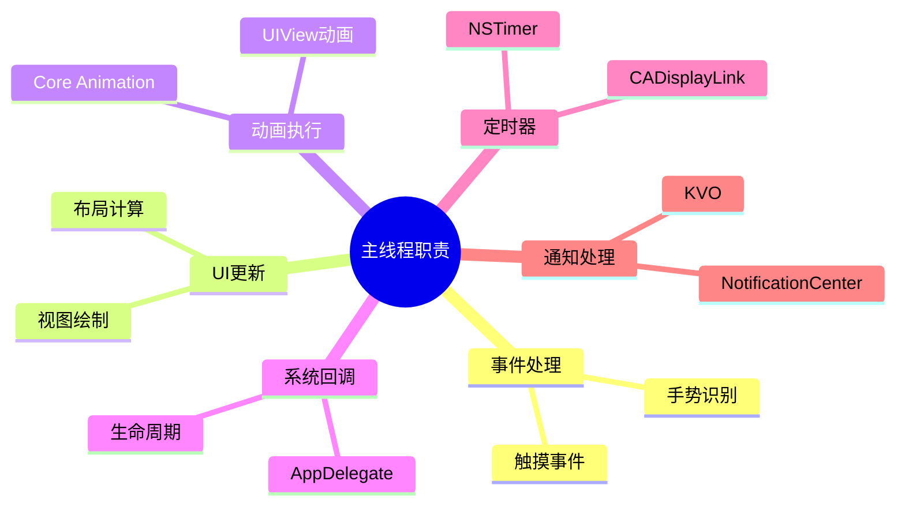
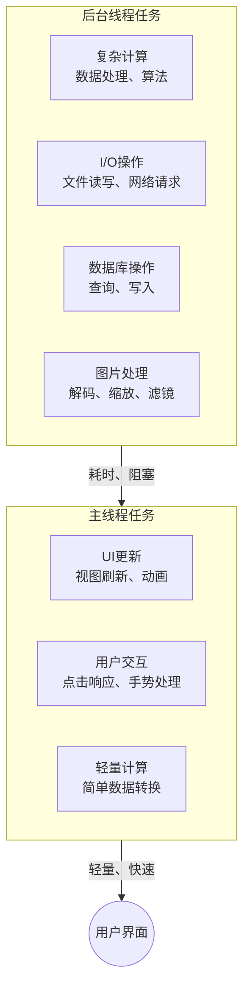
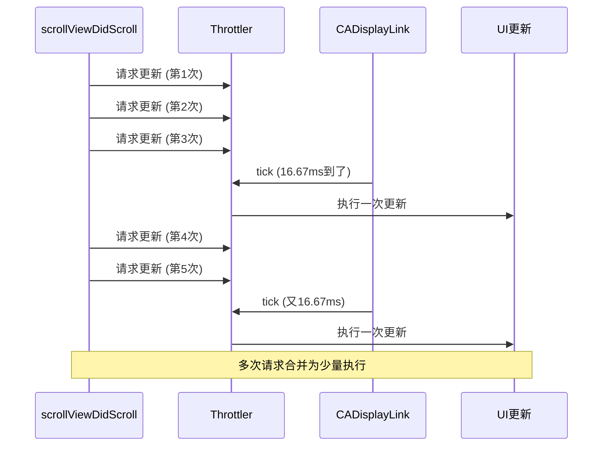
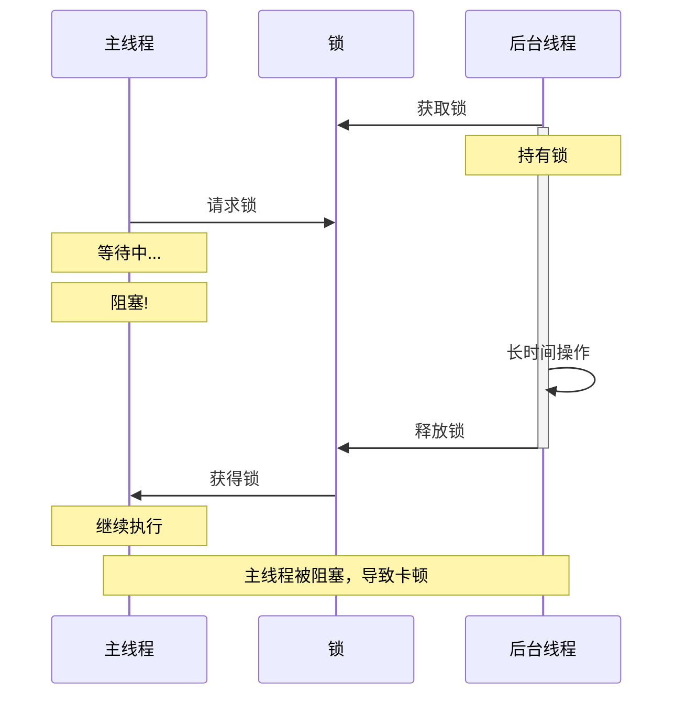

+++
title = "卡顿-主线程优化"
date = '2026-05-02T22:32:27+08:00'
draft = false
weight = 26
tags = ["iOS", "性能优化", "卡顿"]
categories = ["iOS开发", "性能优化"]
+++
主线程阻塞是卡顿最常见的原因。本文介绍如何优化主线程的工作，减少阻塞时间。

---

## 主线程的职责

主线程（UI线程）负责：



> 原则：主线程应该只做UI相关的轻量级工作

---

## 常见的主线程阻塞场景

### 1. 耗时计算

```swift
// 问题代码：在主线程进行复杂计算
func processData() {
    let result = heavyComputation(data)  // 阻塞主线程
    updateUI(with: result)
}

// 优化后：异步计算
func processDataAsync() {
    DispatchQueue.global(qos: .userInitiated).async {
        let result = self.heavyComputation(self.data)
        
        DispatchQueue.main.async {
            self.updateUI(with: result)
        }
    }
}
```

### 2. 文件I/O

```swift
// 问题代码：主线程读写文件
func loadConfig() {
    let data = try? Data(contentsOf: configURL)  // 阻塞
    parseConfig(data)
}

// 优化后：异步I/O
func loadConfigAsync() {
    DispatchQueue.global(qos: .utility).async {
        let data = try? Data(contentsOf: self.configURL)
        
        DispatchQueue.main.async {
            self.parseConfig(data)
        }
    }
}
```

### 3. 数据库操作

```swift
// 问题代码：主线程数据库查询
func loadUsers() {
    let users = database.query("SELECT * FROM users")  // 阻塞
    tableView.reloadData()
}

// 优化后：异步查询
func loadUsersAsync() {
    database.queryAsync("SELECT * FROM users") { [weak self] users in
        self?.users = users
        DispatchQueue.main.async {
            self?.tableView.reloadData()
        }
    }
}
```

---

## 任务异步化

### 基本原则



### GCD任务调度

```swift
class AsyncTaskManager {
    
    // 计算密集型任务
    static func compute<T>(_ work: @escaping () -> T, 
                           completion: @escaping (T) -> Void) {
        DispatchQueue.global(qos: .userInitiated).async {
            let result = work()
            DispatchQueue.main.async {
                completion(result)
            }
        }
    }
    
    // I/O任务
    static func io<T>(_ work: @escaping () throws -> T,
                      completion: @escaping (Result<T, Error>) -> Void) {
        DispatchQueue.global(qos: .utility).async {
            do {
                let result = try work()
                DispatchQueue.main.async {
                    completion(.success(result))
                }
            } catch {
                DispatchQueue.main.async {
                    completion(.failure(error))
                }
            }
        }
    }
    
    // 低优先级后台任务
    static func background(_ work: @escaping () -> Void) {
        DispatchQueue.global(qos: .background).async {
            work()
        }
    }
}

// 使用示例
AsyncTaskManager.compute({
    // 复杂计算
    return self.processLargeDataSet()
}) { result in
    // 主线程更新UI
    self.displayResult(result)
}
```

### Swift Concurrency

```swift
// 使用async/await
class DataProcessor {
    
    func processAsync() async throws -> ProcessedData {
        // 在后台执行
        return try await Task.detached(priority: .userInitiated) {
            return self.heavyProcessing()
        }.value
    }
    
    @MainActor
    func loadAndDisplay() async {
        do {
            let data = try await processAsync()
            // 自动在主线程更新UI
            updateUI(with: data)
        } catch {
            showError(error)
        }
    }
}

// 使用TaskGroup并行处理
func processImagesParallel(urls: [URL]) async -> [UIImage] {
    await withTaskGroup(of: UIImage?.self) { group in
        for url in urls {
            group.addTask {
                await self.loadImage(from: url)
            }
        }
        
        var images: [UIImage] = []
        for await image in group {
            if let image = image {
                images.append(image)
            }
        }
        return images
    }
}
```

---

## 任务拆分与调度

### 大任务拆分

当必须在主线程执行大量工作时，可以拆分成小块：

```swift
class ChunkedTaskExecutor {
    
    /// 分块执行任务
    static func executeInChunks<T>(
        items: [T],
        chunkSize: Int = 10,
        process: @escaping (T) -> Void,
        completion: @escaping () -> Void
    ) {
        var index = 0
        
        func processNextChunk() {
            let endIndex = min(index + chunkSize, items.count)
            
            // 处理当前块
            for i in index..<endIndex {
                process(items[i])
            }
            
            index = endIndex
            
            if index < items.count {
                // 让出主线程，下一个RunLoop周期继续
                DispatchQueue.main.async {
                    processNextChunk()
                }
            } else {
                completion()
            }
        }
        
        processNextChunk()
    }
}

// 使用示例：分块更新大量Cell
func updateCells(with data: [CellData]) {
    ChunkedTaskExecutor.executeInChunks(
        items: data,
        chunkSize: 20
    ) { item in
        if let cell = self.cellForItem(item) {
            cell.configure(with: item)
        }
    } completion: {
        print("All cells updated")
    }
}
```

### RunLoop空闲时执行

```swift
class IdleTimeExecutor {
    
    private var pendingTasks: [() -> Void] = []
    private var observer: CFRunLoopObserver?
    
    static let shared = IdleTimeExecutor()
    
    private init() {
        setupObserver()
    }
    
    private func setupObserver() {
        let callback: CFRunLoopObserverCallBack = { _, _, info in
            guard let info = info else { return }
            let executor = Unmanaged<IdleTimeExecutor>.fromOpaque(info).takeUnretainedValue()
            executor.executePendingTask()
        }
        
        var context = CFRunLoopObserverContext(
            version: 0,
            info: Unmanaged.passUnretained(self).toOpaque(),
            retain: nil,
            release: nil,
            copyDescription: nil
        )
        
        observer = CFRunLoopObserverCreate(
            kCFAllocatorDefault,
            CFRunLoopActivity.beforeWaiting.rawValue,
            true,
            Int.max,  // 最低优先级
            callback,
            &context
        )
        
        if let observer = observer {
            CFRunLoopAddObserver(CFRunLoopGetMain(), observer, .commonModes)
        }
    }
    
    func addTask(_ task: @escaping () -> Void) {
        pendingTasks.append(task)
    }
    
    private func executePendingTask() {
        guard !pendingTasks.isEmpty else { return }
        
        let task = pendingTasks.removeFirst()
        task()
    }
}

// 使用示例
IdleTimeExecutor.shared.addTask {
    // 在RunLoop空闲时执行
    self.preloadNextPageData()
}
```

### CADisplayLink节流

CADisplayLink 是与屏幕刷新率同步的定时器（60Hz 屏幕每秒回调 60 次）。节流（Throttle）是指：即使有更频繁的触发请求，也只按设定的最大频率执行。

以 `scrollViewDidScroll` 为例，滚动时该方法可能每秒被调用 100+ 次，但屏幕每秒只刷新 60 次，超过的更新都是浪费。通过 CADisplayLink 节流，可以将多次请求合并，只在屏幕刷新时执行一次更新。



```swift
class DisplayLinkThrottler {
    
    private var displayLink: CADisplayLink?
    private var pendingWork: (() -> Void)?
    private var lastExecuteTime: CFTimeInterval = 0
    private let minInterval: CFTimeInterval
    
    init(minInterval: CFTimeInterval = 1.0 / 30.0) {
        self.minInterval = minInterval
        setupDisplayLink()
    }
    
    private func setupDisplayLink() {
        displayLink = CADisplayLink(target: self, selector: #selector(tick))
        displayLink?.add(to: .main, forMode: .common)
    }
    
    func throttle(_ work: @escaping () -> Void) {
        pendingWork = work
    }
    
    @objc private func tick(_ link: CADisplayLink) {
        guard let work = pendingWork else { return }
        
        let now = link.timestamp
        if now - lastExecuteTime >= minInterval {
            work()
            pendingWork = nil
            lastExecuteTime = now
        }
    }
    
    deinit {
        displayLink?.invalidate()
    }
}

// 使用示例：节流滚动更新
class ScrollViewController: UIViewController {
    
    private let throttler = DisplayLinkThrottler()
    
    func scrollViewDidScroll(_ scrollView: UIScrollView) {
        throttler.throttle {
            self.updateVisibleCells()
        }
    }
}
```

---

## 减少锁竞争

### 锁的性能影响



### 优化策略

#### 1. 使用读写锁

**方式一：pthread_rwlock_t**

```swift
class ThreadSafeCache<Key: Hashable, Value> {
    
    private var cache: [Key: Value] = [:]
    private var lock = pthread_rwlock_t()
    
    init() {
        pthread_rwlock_init(&lock, nil)
    }
    
    deinit {
        pthread_rwlock_destroy(&lock)
    }
    
    func get(_ key: Key) -> Value? {
        pthread_rwlock_rdlock(&lock)  // 读锁，多个读者可以并发
        defer { pthread_rwlock_unlock(&lock) }
        return cache[key]
    }
    
    func set(_ key: Key, value: Value) {
        pthread_rwlock_wrlock(&lock)  // 写锁，独占
        defer { pthread_rwlock_unlock(&lock) }
        cache[key] = value
    }
}
```

**方式二：GCD 并发队列 + 栅栏函数（推荐）**

使用 `DispatchQueue` 的 barrier 实现读写锁语义，代码更简洁且不易出错：

```swift
class GCDReadWriteCache<Key: Hashable, Value> {
    
    private var cache: [Key: Value] = [:]
    // 必须是自定义的并发队列，系统全局队列不支持 barrier
    private let queue = DispatchQueue(label: "cache.rwlock", attributes: .concurrent)
    
    func get(_ key: Key) -> Value? {
        // sync 读取：多个读操作可以并发执行
        return queue.sync {
            cache[key]
        }
    }
    
    func set(_ key: Key, value: Value) {
        // barrier 写入：等待之前的读操作完成，独占执行，阻塞后续读写
        queue.async(flags: .barrier) {
            self.cache[key] = value
        }
    }
    
    func remove(_ key: Key) {
        queue.async(flags: .barrier) {
            self.cache.removeValue(forKey: key)
        }
    }
}
```

#### 2. 使用原子操作

```swift
import os.lock

// 使用 os_unfair_lock（推荐，iOS 中性能最好的安全锁）
class AtomicCounter {
    
    private var _value: Int64 = 0
    private var lock = os_unfair_lock()
    
    var value: Int64 {
        os_unfair_lock_lock(&lock)
        defer { os_unfair_lock_unlock(&lock) }
        return _value
    }
    
    func increment() {
        os_unfair_lock_lock(&lock)
        _value += 1
        os_unfair_lock_unlock(&lock)
    }
    
    func decrement() {
        os_unfair_lock_lock(&lock)
        _value -= 1
        os_unfair_lock_unlock(&lock)
    }
}

```

#### 3. 使用串行队列替代锁

```swift
class SerialQueueCache<Key: Hashable, Value> {
    
    private var cache: [Key: Value] = [:]
    private let queue = DispatchQueue(label: "cache.serial")
    
    func get(_ key: Key, completion: @escaping (Value?) -> Void) {
        queue.async {
            let value = self.cache[key]
            DispatchQueue.main.async {
                completion(value)
            }
        }
    }
    
    func set(_ key: Key, value: Value) {
        queue.async {
            self.cache[key] = value
        }
    }
    
    // 同步获取（慎用，可能阻塞）
    func getSync(_ key: Key) -> Value? {
        return queue.sync {
            return cache[key]
        }
    }
}
```

#### 4. 减少锁粒度

```swift
// 问题：粗粒度锁
class CoarseGrainedLock {
    private var data1: [String] = []
    private var data2: [Int] = []
    private let lock = NSLock()
    
    func updateData1(_ value: String) {
        lock.lock()
        data1.append(value)  // 锁住了整个对象
        lock.unlock()
    }
    
    func updateData2(_ value: Int) {
        lock.lock()
        data2.append(value)  // 与data1竞争同一把锁
        lock.unlock()
    }
}

// 优化：细粒度锁
class FineGrainedLock {
    private var data1: [String] = []
    private var data2: [Int] = []
    private let lock1 = NSLock()
    private let lock2 = NSLock()
    
    func updateData1(_ value: String) {
        lock1.lock()
        data1.append(value)  // 独立的锁
        lock1.unlock()
    }
    
    func updateData2(_ value: Int) {
        lock2.lock()
        data2.append(value)  // 不会与data1竞争
        lock2.unlock()
    }
}
```

---

## 预计算与缓存

### 布局预计算

```swift
class LayoutCache {
    
    private var heightCache: [String: CGFloat] = [:]
    private let queue = DispatchQueue(label: "layout.cache", attributes: .concurrent)
    
    func precomputeHeights(for items: [Item], width: CGFloat) {
        DispatchQueue.global(qos: .userInitiated).async {
            var results: [String: CGFloat] = [:]
            for item in items {
                let height = self.calculateHeight(for: item, width: width)
                results[item.id] = height
            }
            // 使用 barrier 保证写入安全
            self.queue.async(flags: .barrier) {
                self.heightCache.merge(results) { _, new in new }
            }
        }
    }
    
    func height(for item: Item, width: CGFloat) -> CGFloat {
        // 使用 sync 读取保证线程安全
        if let cached = queue.sync(execute: { heightCache[item.id] }) {
            return cached
        }
        
        let height = calculateHeight(for: item, width: width)
        queue.async(flags: .barrier) {
            self.heightCache[item.id] = height
        }
        return height
    }
    
    private func calculateHeight(for item: Item, width: CGFloat) -> CGFloat {
        // 复杂的高度计算
        let textHeight = item.text.boundingRect(
            with: CGSize(width: width, height: .greatestFiniteMagnitude),
            options: [.usesLineFragmentOrigin],
            attributes: [.font: UIFont.systemFont(ofSize: 16)],
            context: nil
        ).height
        
        return textHeight + 20  // 加上padding
    }
    
    func invalidate(for itemId: String) {
        queue.async(flags: .barrier) {
            self.heightCache.removeValue(forKey: itemId)
        }
    }
    
    func invalidateAll() {
        queue.async(flags: .barrier) {
            self.heightCache.removeAll()
        }
    }
}
```

### 文本渲染缓存

```swift
class TextRenderCache {
    
    private var cache = NSCache<NSString, NSAttributedString>()
    
    init() {
        cache.countLimit = 100
    }
    
    func attributedString(for text: String, style: TextStyle) -> NSAttributedString {
        let key = "\(text)_\(style.hashValue)" as NSString
        
        if let cached = cache.object(forKey: key) {
            return cached
        }
        
        let attributed = createAttributedString(text: text, style: style)
        cache.setObject(attributed, forKey: key)
        return attributed
    }
    
    private func createAttributedString(text: String, style: TextStyle) -> NSAttributedString {
        let attributes: [NSAttributedString.Key: Any] = [
            .font: style.font,
            .foregroundColor: style.color,
            .paragraphStyle: style.paragraphStyle
        ]
        return NSAttributedString(string: text, attributes: attributes)
    }
}

struct TextStyle: Hashable {
    let font: UIFont
    let color: UIColor
    let paragraphStyle: NSParagraphStyle
}
```

### 计算结果缓存

```swift
class ComputationCache<Input: Hashable, Output> {
    
    private var cache: [Input: Output] = [:]
    private let queue = DispatchQueue(label: "computation.cache", attributes: .concurrent)
    private let compute: (Input) -> Output
    
    init(compute: @escaping (Input) -> Output) {
        self.compute = compute
    }
    
    func get(_ input: Input) -> Output {
        // 使用 sync 读取保证线程安全
        if let cached = queue.sync(execute: { cache[input] }) {
            return cached
        }
        
        let result = compute(input)
        // 使用 barrier 写入保证线程安全
        queue.async(flags: .barrier) {
            self.cache[input] = result
        }
        return result
    }
    
    func precompute(_ inputs: [Input]) {
        DispatchQueue.global(qos: .utility).async {
            var results: [Input: Output] = [:]
            for input in inputs {
                let exists = self.queue.sync { self.cache[input] != nil }
                if !exists {
                    results[input] = self.compute(input)
                }
            }
            self.queue.async(flags: .barrier) {
                self.cache.merge(results) { _, new in new }
            }
        }
    }
}

// 使用示例
let priceFormatter = ComputationCache<Double, String> { price in
    let formatter = NumberFormatter()
    formatter.numberStyle = .currency
    return formatter.string(from: NSNumber(value: price)) ?? ""
}

let formattedPrice = priceFormatter.get(99.99)
```

### 相关第三方库

iOS 开发中用于布局预计算和列表优化的第三方库：

| 库名 | 特点 | 适用场景 |
|-----|------|---------|
| **IGListKit** | Instagram 出品，数据驱动，自动 Diff 算法，布局预计算 | 复杂列表、Feed 流 |
| **Texture (AsyncDisplayKit)** | Facebook 出品，异步布局+渲染，完全脱离主线程 | 极致性能优化 |
| **YYText** | 异步文本布局和渲染，支持复杂富文本 | 富文本展示 |
| **Kingfisher / SDWebImage** | 图片异步解码+缓存 | 图片加载优化 |

**IGListKit** 核心优势：
- 自动计算列表 Diff，只更新变化的 Cell
- 支持后台线程预计算布局
- 数据驱动，解耦 ViewController

**Texture** 核心优势：
- 布局计算、文本渲染、图片解码全部异步
- 自动将耗时操作移出主线程
- 适合对性能要求极高的场景

---

## 避免不必要的工作

### 去重更新

```swift
class DebouncedUpdater {
    
    private var workItem: DispatchWorkItem?
    private let delay: TimeInterval
    
    init(delay: TimeInterval = 0.1) {
        self.delay = delay
    }
    
    func update(_ work: @escaping () -> Void) {
        workItem?.cancel()
        
        let item = DispatchWorkItem(block: work)
        workItem = item
        
        DispatchQueue.main.asyncAfter(deadline: .now() + delay, execute: item)
    }
}

// 使用示例
class SearchViewController: UIViewController {
    
    private let debouncer = DebouncedUpdater(delay: 0.3)
    
    func textFieldDidChange(_ textField: UITextField) {
        debouncer.update {
            self.performSearch(query: textField.text ?? "")
        }
    }
}
```

### 条件更新

```swift
class ConditionalUpdater<T: Equatable> {
    
    private var lastValue: T?
    
    func updateIfNeeded(_ newValue: T, update: (T) -> Void) {
        guard newValue != lastValue else { return }
        
        lastValue = newValue
        update(newValue)
    }
}

// 使用示例
class ProgressView: UIView {
    
    private let updater = ConditionalUpdater<Float>()
    
    func setProgress(_ progress: Float) {
        updater.updateIfNeeded(progress) { value in
            // 只在值变化时更新UI
            self.progressBar.progress = value
            self.label.text = "\(Int(value * 100))%"
        }
    }
}
```

### 可见性检查

```swift
extension UIView {
    
    var isVisibleOnScreen: Bool {
        guard !isHidden, alpha > 0, let window = window else {
            return false
        }
        
        let viewFrame = convert(bounds, to: window)
        return window.bounds.intersects(viewFrame)
    }
}

class SmartCell: UITableViewCell {
    
    func updateContentIfVisible() {
        guard isVisibleOnScreen else { return }
        
        // 只在可见时更新
        updateContent()
    }
}
```
