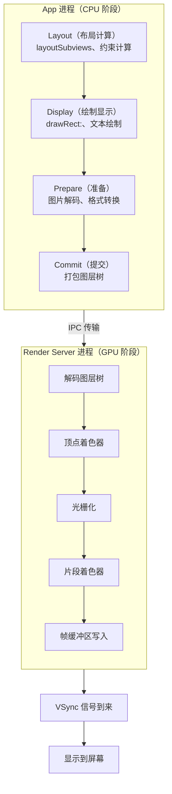

+++
title = "卡顿"
date = '2026-05-02T22:32:27+08:00'
draft = false
weight = 31
tags = ["iOS", "性能优化", "卡顿"]
categories = ["iOS开发", "性能优化"]
+++
卡顿是影响用户体验的关键问题之一。当应用无法在一帧的时间内（通常为16.67ms）完成渲染工作时，就会出现掉帧，用户会感知到界面不流畅。

本系列文章从渲染原理入手，系统性地介绍iOS卡顿的检测与优化方法。

> 卡顿监控是 APM 流畅性子系的核心能力，线上指标体系、检测采集、上报策略请参考 [APM 系列]()：[指标体系]()、[数据采集]()、[业界方案（微信 Matrix / 字节 Slardar 卡死监控）]()。

---

## 什么是卡顿

iOS设备的屏幕刷新率通常为60Hz（ProMotion设备可达120Hz），这意味着每秒需要渲染60帧画面。每一帧的渲染时间窗口约为16.67ms（1000ms / 60）。

当CPU或GPU无法在这个时间窗口内完成工作时，就会发生掉帧（Frame Drop），用户会感知到卡顿。

| 掉帧情况 | 用户感知 | 严重程度 |
|---------|---------|---------|
| 偶尔掉1-2帧 | 几乎无感知 | 轻微 |
| 连续掉帧 | 明显卡顿 | 中等 |
| 长时间阻塞（>250ms） | 界面冻结 | 严重 |

---

## 渲染流程概述

iOS的渲染流程涉及CPU和GPU的协作，通过Core Animation Pipeline完成：

### CPU与GPU的职责

| 阶段 | 主要工作 | 常见瓶颈 |
|-----|---------|---------|
| CPU | 布局计算、视图创建、文本计算、图片解码 | 复杂布局、大量文本、主线程阻塞 |
| GPU | 纹理渲染、图层混合、离屏渲染 | 离屏渲染、大量透明图层、超大图片 |

---

## 卡顿的常见原因

### CPU瓶颈

1. **主线程阻塞**：耗时操作在主线程执行
2. **复杂布局**：大量约束计算、频繁布局
3. **文本计算**：复杂富文本、大量文本渲染
4. **图片解码**：大图片在主线程解码
5. **对象创建**：大量对象的创建和销毁

### GPU瓶颈

1. **离屏渲染**：圆角、阴影、遮罩触发离屏渲染
2. **图层混合**：大量透明图层叠加
3. **超大图片**：纹理尺寸超过GPU限制
4. **复杂特效**：模糊、滤镜等GPU密集操作

---

## 文章导航

本系列包含以下文章，建议按顺序阅读：

### 1. 原理与检测

在优化之前，首先需要理解卡顿的原理并准确检测卡顿。

- [卡顿-原理]()
  - iOS渲染流程详解
  - VSync与双缓冲机制
  - 卡顿的本质分析
  - CPU与GPU瓶颈识别

- [卡顿-检测]()
  - FPS监控（CADisplayLink）
  - RunLoop监控方案
  - 主线程卡顿堆栈采集
  - Instruments分析工具
  - MetricKit线上数据

### 2. CPU优化

CPU阶段的优化主要从减少主线程工作量入手。

#### 2.1 主线程优化

- [卡顿-主线程优化]()
  - 耗时任务异步化
  - 任务拆分与调度
  - 减少锁竞争
  - 预计算与缓存

#### 2.2 图片优化

- [卡顿-图片优化]()
  - 图片解码原理
  - 异步解码方案
  - 图片降采样
  - 缓存策略

### 3. GPU优化

GPU阶段的优化主要从减少渲染复杂度入手。

- [卡顿-离屏渲染]()
  - 离屏渲染触发条件
  - 圆角优化方案
  - 阴影优化方案
  - 遮罩优化方案
  - shouldRasterize使用

### 4. 场景优化

针对常见场景的专项优化。

- [卡顿-TableView优化]()
  - Cell复用机制
  - 高度缓存
  - 异步渲染
  - 预加载策略
