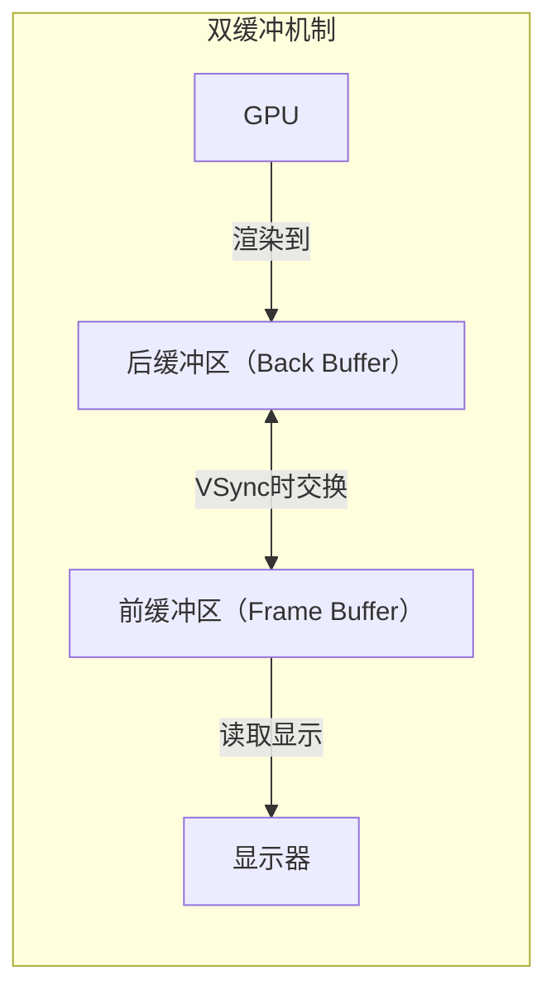
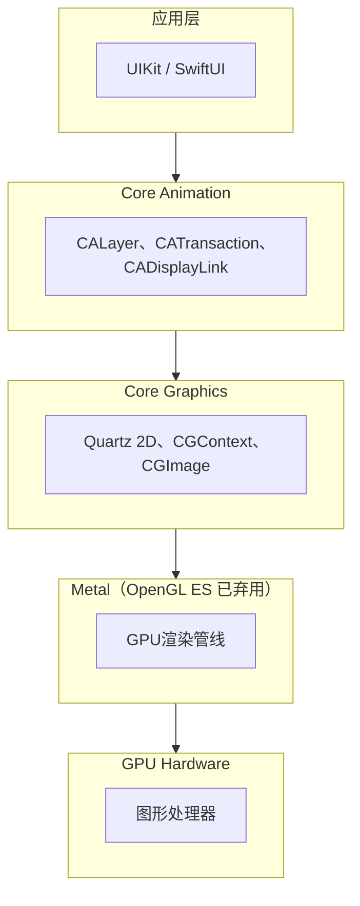
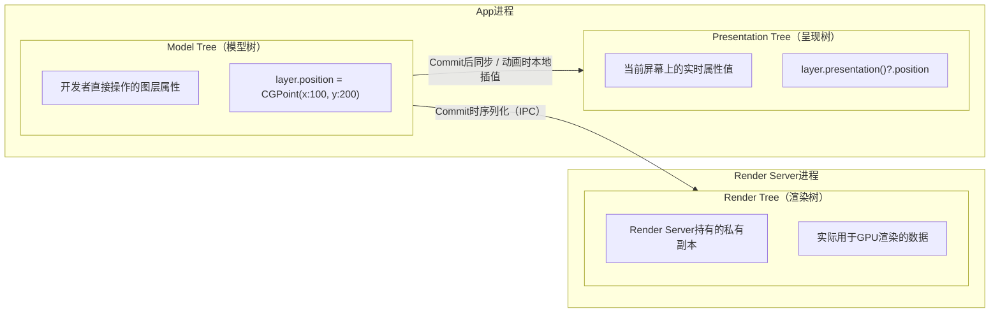
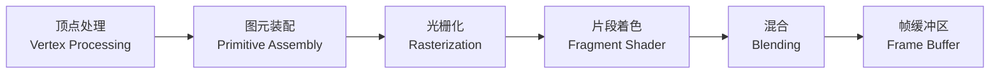
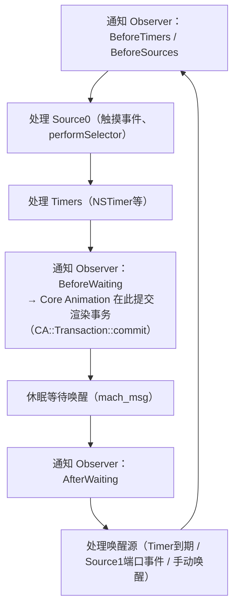

+++
title = "卡顿-原理"
date = '2026-05-02T22:32:27+08:00'
draft = false
weight = 27
tags = ["iOS", "性能优化", "卡顿"]
categories = ["iOS开发", "性能优化"]
+++
理解卡顿的原理是优化的基础。本文从屏幕显示的底层机制出发，沿着"VSync信号 -> 渲染管线 -> RunLoop协作 -> 掉帧产生"的逻辑链条，逐步揭示卡顿产生的根本原因。

## 屏幕显示的基础：VSync与缓冲机制

要理解卡顿，首先要理解屏幕是如何显示画面的。

### VSync信号

VSync（Vertical Synchronization，垂直同步）是显示器发出的信号，用于协调GPU渲染和屏幕显示的时机。在60Hz的屏幕上，每16.67ms发出一次VSync信号。当信号到来时，屏幕从帧缓冲区读取数据进行显示。

```plaintext
时间轴：
│←── 16.67ms ──→│←── 16.67ms ──→│←── 16.67ms ──→│
       ↑               ↑               ↑
    VSync 1         VSync 2         VSync 3
       │               │               │
   显示帧1          显示帧2          显示帧3
```

### 双缓冲与三缓冲

为了避免画面撕裂（GPU写入和屏幕读取同一块内存导致），iOS使用多缓冲机制：



- **双缓冲（默认）**：GPU渲染到后缓冲区，VSync到来时交换前后缓冲区，显示器从前缓冲区读取。
- **三缓冲（高负载时自动启用）**：增加第三个缓冲区，当渲染无法在一个VSync周期内完成时，GPU可以在额外缓冲区继续渲染，不必等待交换完成。代价是增加一帧延迟和内存占用。

系统在两者之间动态切换，开发者无需手动干预。

### ProMotion自适应刷新率

ProMotion设备（iPhone 13 Pro及以上）支持10Hz-120Hz的自适应刷新率，这意味着帧时间预算不再固定：

| 刷新率 | 帧时间 | 卡顿阈值建议 |
|-------|-------|------------|
| 120Hz | 8.33ms | >16ms视为掉帧 |
| 60Hz | 16.67ms | >33ms视为掉帧 |
| 30Hz | 33.33ms | >66ms视为掉帧 |

```swift
// 检查设备最大刷新率
let maxFrameRate = UIScreen.main.maximumFramesPerSecond

// CADisplayLink适配ProMotion
if #available(iOS 15.0, *) {
    displayLink?.preferredFrameRateRange = CAFrameRateRange(
        minimum: 60,
        maximum: 120,
        preferred: 120
    )
}
```

## iOS渲染架构

了解了屏幕显示机制后，接下来看iOS是如何将UI元素最终变成屏幕上的像素的。

### 图形渲染分层

iOS的图形渲染采用分层架构，从上到下依次为：



各层职责：

- **UIKit / SwiftUI**：面向开发者的高层API，提供UIView、UILabel等控件。UIView本质上是CALayer的delegate，负责事件响应和提供绘制内容，不直接参与渲染。
- **Core Animation**：渲染架构的核心枢纽。管理CALayer图层树，协调隐式/显式动画，在合适的时机通过CATransaction将图层树快照提交给Render Server。名字虽带"Animation"，但它的核心职责是**合成（Compositing）**而非动画。
- **Core Graphics**：CPU侧的2D绘图引擎（Quartz 2D）。当CALayer需要自定义绘制内容时（`draw(_:)`），Core Graphics在CPU上生成位图（backing store），该位图随后作为纹理上传给GPU。
- **Metal**：GPU编程接口，Render Server内部使用Metal将图层合成指令翻译成GPU可执行的渲染命令。开发者也可直接使用Metal进行自定义渲染。
- **GPU Hardware**：执行顶点处理、光栅化、像素着色、混合等操作，最终将结果写入帧缓冲区。

### 图层树的三种形态

理解渲染管线前，需要先理解Core Animation维护的三棵并行的图层树：



- **Model Tree**：开发者通过代码设置的目标值，修改立即生效（`layer.position = ...`），但不会立刻触发渲染。
- **Presentation Tree**：存在于App进程中，反映当前屏幕上实际显示的属性值。**非动画场景下**，Commit Transaction完成后Presentation Tree与Model Tree同步为相同值；**动画场景下**，Model Tree在动画开始时就已跳至终点值，而Presentation Tree根据动画描述信息（起点值、终点值、timing function、duration）在App进程内本地计算当前时刻的插值——调用`layer.presentation()`时实时求值，并非Render Server回传的数据。因此命中测试应使用`layer.presentation()`而非`layer`本身。
- **Render Tree**：存在于Render Server进程中，是Model Tree的序列化副本。每次Commit Transaction时，变更的属性通过IPC同步到Render Tree。Render Server在Render Tree上独立计算动画插值，与App进程中Presentation Tree的计算使用相同的公式和时间基准，两者结果一致但各自独立。

这种分离设计使得App进程和Render Server可以并行工作——App准备下一帧的同时，Render Server正在渲染当前帧。

### Core Animation渲染管线

一帧画面的渲染横跨两个VSync周期、三个执行阶段：

```plaintext
             VSync N                    VSync N+1                   VSync N+2
               │                           │                          │
App进程:        ├──Handle Events──┐         │                          │
               │                 ├─Layout──┤                          │
               │                 ├─Display─┤                          │
               │                 ├─Prepare─┤                          │
               │                 └─Commit──┤                          │
               │                           │                          │
Render Server: │                           ├──Decode──┐               │
               │                           │          ├──Draw Calls──┤│
               │                           │          └──Commit───── ┤│
               │                           │                          │
GPU:           │                           │          ├──Render──────┤│
               │                           │                          │
Display:       │                           │                         显示帧N
```

注意：**一帧从CPU提交到最终显示，至少需要两个VSync周期的延迟**（一个周期给CPU+Render Server，一个周期给GPU+显示）。这就是为什么即使CPU工作在16ms内完成，用户看到画面更新仍有至少一帧延迟。

下面详细展开每个阶段。

#### 阶段一：App进程（CPU侧，主线程）

##### Handle Events

RunLoop唤醒后，首先处理待分发的事件：触摸事件（Source0）、手势识别器回调、Timer回调、`performSelector:afterDelay:`等。这些回调中的代码通常会修改UI属性（如`layer.position = ...`），这些修改**立即写入Model Tree**，同时将对应图层标记为dirty。此时Presentation Tree和Render Tree尚未感知到变化。

##### Commit Transaction

当RunLoop即将进入休眠（BeforeWaiting Observer）时，Core Animation触发`CA::Transaction::commit()`，将本次RunLoop周期内积累的所有UI变更打包提交。Commit Transaction内部依次经过四个子阶段：

**1. Layout**

递归遍历Model Tree中被标记为dirty的图层，自下而上调用对应视图的`layoutSubviews()`。Auto Layout引擎在这一步求解约束方程组，计算出每个视图的frame，结果写回Model Tree的几何属性（bounds、position）。

```swift
view.setNeedsLayout()      // 标记dirty，延迟到Commit Transaction时执行
view.layoutIfNeeded()      // 立即强制求解布局（慎用，会触发额外的layout pass）
```

性能陷阱：
- Auto Layout的求解复杂度与约束数量近似呈**指数关系**（非线性增长），视图层级超过一定规模后Layout耗时会急剧上升
- `layoutSubviews()`中修改约束会触发新一轮layout pass，形成递归循环
- `systemLayoutSizeFitting`在UITableView高度计算中被高频调用，配合复杂约束容易成为瓶颈

**2. Display**

遍历Model Tree中需要重绘的图层，调用对应视图的`draw(_:)`方法（底层是`CALayer.display()` → `CALayerDelegate.draw(in:)`）。该方法在CPU上通过Core Graphics生成位图，写入图层的**backing store**（一块与图层等大的内存缓冲区），backing store随后被设置为Model Tree中该图层的`contents`属性。

```swift
view.setNeedsDisplay()     // 标记需要重绘（不会立即执行）

override func draw(_ rect: CGRect) {
    guard let context = UIGraphicsGetCurrentContext() else { return }
    // 此处所有绘制操作都发生在CPU上，写入backing store
    context.setFillColor(UIColor.red.cgColor)
    context.fill(rect)
}
```

关键细节：
- **大多数视图不需要自定义绘制**。UILabel、UIImageView等标准控件的内容由系统直接设置到CALayer的`contents`属性（CGImage），不经过`draw(_:)`，因此不会产生额外的backing store
- 一旦重写`draw(_:)`，系统必须为该图层分配backing store内存（= 宽 x 高 x 4字节/像素），一个全屏Retina视图的backing store约为：390x844x3x4 ≈ **3.95MB**
- `CATiledLayer`可以分块绘制超大内容（如地图、PDF），避免一次性分配巨大backing store

**3. Prepare**

处理图片解码和格式转换。`UIImage`在初始化时并不解码像素数据（延迟解码），真正的解码发生在图片首次被渲染时的Prepare阶段。

```swift
// 问题代码：解码延迟到渲染时，阻塞主线程
imageView.image = UIImage(named: "large_photo")

// 优化：在后台线程强制解码
DispatchQueue.global().async {
    guard let image = UIImage(named: "large_photo"),
          let cgImage = image.cgImage else { return }
    
    let colorSpace = CGColorSpaceCreateDeviceRGB()
    // 创建位图上下文并绘制，强制解码
    guard let context = CGContext(
        data: nil,
        width: cgImage.width,
        height: cgImage.height,
        bitsPerComponent: 8,
        bytesPerRow: 0,
        space: colorSpace,
        bitmapInfo: CGImageAlphaInfo.premultipliedFirst.rawValue
    ) else { return }
    
    context.draw(cgImage, in: CGRect(x: 0, y: 0, 
                                      width: cgImage.width, 
                                      height: cgImage.height))
    
    guard let decodedImage = context.makeImage() else { return }
    let result = UIImage(cgImage: decodedImage)
    
    DispatchQueue.main.async {
        imageView.image = result  // 已解码，Prepare阶段零开销
    }
}
```

此外，如果图片的像素格式不是GPU直接支持的（如某些非标准色彩空间），还需要在此阶段进行格式转换。

**4. Commit**

这一步是**Model Tree → Render Tree的同步点**，同时也是**Presentation Tree的更新时机**。将Model Tree中发生变更的图层属性序列化，通过Mach Port（IPC）发送给Render Server，Render Server用这些数据更新自己持有的Render Tree。序列化的内容包括：图层的几何属性（bounds、position、transform）、内容（contents / backing store）、视觉属性（opacity、cornerRadius、shadow等）以及子图层结构。注意只有dirty属性会被序列化传输，未变更的属性不会重复发送。

在非动画场景下，Commit完成后Presentation Tree与Model Tree同步为相同值——此前Handle Events阶段对Model Tree的修改，直到Commit完成后才反映到Presentation Tree上。在动画场景下，Commit会将动画描述信息（起点值、终点值、timing function、duration）保留在App进程本地，后续调用`layer.presentation()`时根据这些信息和当前时间实时计算插值。

```swift
CATransaction.begin()
CATransaction.setDisableActions(true)  // 禁用隐式动画
layer.position = newPosition
layer.opacity = 0.5
CATransaction.commit()
```

Commit的开销与图层树的规模和变更量正相关。Instruments的"Core Animation Commits"可以直接测量这个阶段的耗时。当图层数量超过几百个时，仅序列化本身就可能消耗数毫秒。

#### 阶段二：Render Server（独立进程）

Render Server（又名`backboardd`）是一个系统级守护进程，独立于App进程运行。它接收App提交的图层树快照后，执行以下工作：

**1. 图层树解析与动画插值**

Render Server持有Render Tree，接收到新的Commit后将变更属性合并到Render Tree中。对于进行中的动画，Render Server根据当前时间和动画曲线（timing function）直接在Render Tree上计算每一帧的插值。与此同时，App进程侧的Presentation Tree也能反映动画的实时状态，但这并非Render Server通过IPC回传的结果——而是App进程在调用`layer.presentation()`时，根据本地持有的动画描述信息（起点值、终点值、timing function、duration）和当前时间独立计算插值，两侧使用相同的公式和时间基准，因此结果一致。插值完成后，Render Server将更新后的Render Tree翻译为渲染指令并提交给GPU执行实际的合成和像素渲染。Core Animation动画即使主线程卡顿仍然流畅，是因为从插值计算到渲染指令生成再到GPU提交的整个链路都由Render Server独立驱动，不依赖App进程的主线程。

**2. 渲染指令生成（Draw Calls）**

Render Server遍历Render Tree，将图层合成操作翻译为Metal渲染指令（Draw Calls）。这一步需要处理：

- **图层排序**：根据zPosition和子图层顺序确定绘制顺序（painter's algorithm，从后往前绘制）
- **可见性剔除**：完全被遮挡的图层不生成Draw Calls
- **离屏渲染判定**：如果图层属性组合需要离屏渲染（如同时设置cornerRadius + masksToBounds + shadow），Render Server会在渲染指令中为该图层安排额外的离屏渲染Pass，实际的离屏缓冲区由GPU在执行指令时分配

**3. 提交到GPU**

将生成的渲染指令（Command Buffer）提交给GPU的命令队列。

**离屏渲染（Offscreen Rendering）深入**

离屏渲染是GPU瓶颈的首要来源。正常的渲染流程是将结果直接写入帧缓冲区（On-screen Rendering），而离屏渲染需要先创建一个独立的缓冲区，将中间结果渲染到该缓冲区，完成后再合成到帧缓冲区：

```plaintext
正常渲染：
Layer → GPU渲染 → 帧缓冲区

离屏渲染：
Layer → GPU渲染 → 离屏缓冲区 ──┐
                              ├→ 合成 → 帧缓冲区
其他Layer → GPU渲染 ───────────┘
```

离屏渲染的代价包括：
- 创建和销毁离屏缓冲区的开销
- GPU上下文切换（从帧缓冲区切换到离屏缓冲区再切回来）
- 额外的内存带宽消耗（像素数据需要从离屏缓冲区搬运到帧缓冲区）

常见触发离屏渲染的场景：

| 属性 | 是否离屏渲染 | 说明 |
|------|------------|------|
| `cornerRadius` + `masksToBounds` | 是 | 需要裁剪子图层内容 |
| `shadow`（无shadowPath） | 是 | 需要根据图层内容轮廓计算阴影 |
| `shadow` + `shadowPath` | 否 | 提供了明确路径，无需离屏计算 |
| `mask`（CALayer mask属性） | 是 | 需要在离屏缓冲区中做alpha混合 |
| `groupOpacity`（allowsGroupOpacity） | 是 | 需要先合成子图层再整体设置透明度 |
| `shouldRasterize` = true | 首次是，后续缓存命中则否 | 将图层及其子图层渲染为位图缓存 |

`shouldRasterize`是一把双刃剑：它将离屏渲染的结果缓存为位图，后续帧直接复用，避免重复的离屏渲染。但缓存有100ms的过期时间和屏幕尺寸2.5倍的空间限制，如果图层内容频繁变化，每帧都需要重新光栅化，反而比不缓存更慢。

#### 阶段三：GPU渲染管线

GPU接收到Metal渲染指令后，按照图形管线依次执行：



- **顶点处理（Vertex Processing）**：每个CALayer在GPU中被表示为一个由顶点（Vertex）定义的矩形。顶点不仅包含位置坐标，还携带纹理坐标（UV坐标，用于指定从纹理的哪个区域采样颜色）。顶点着色器（Vertex Shader）将这些顶点从模型坐标系经过transform、position、anchorPoint等变换，映射到屏幕坐标系。对于普通2D UI图层，这一步开销很小。

- **图元装配（Primitive Assembly）**：将顶点着色器输出的顶点按照指定的拓扑关系组装成**图元（Primitive）**。图元是GPU能够处理的最小几何单元，常见类型包括点（point）、线段（line）和三角形（triangle）。一个矩形的CALayer会被拆分成两个三角形图元（GPU原生只处理三角形，矩形需要分成两个三角形）：

```plaintext
一个CALayer的矩形 → 两个三角形图元：

V0 ────── V1        V0 ────── V1
│ ╲        │         │╲ 三角形1 │
│   ╲      │   →     │  ╲      │
│     ╲    │         │    ╲    │
│       ╲  │         │ 三角形2 ╲│
V3 ────── V2        V3 ────── V2
```

图元装配阶段还会执行**裁剪（Clipping）**——超出屏幕可视区域的图元部分被裁掉，以及**背面剔除（Back-face Culling）**——对于3D场景中背对摄像机的三角形不再处理（2D UI中通常不涉及）。

- **光栅化（Rasterization）**：将图元（三角形）转换为离散的**片段（Fragment）**。每个Fragment对应屏幕上的一个像素位置，同时携带通过顶点插值计算出的纹理坐标、颜色等属性。一个覆盖100x100像素区域的三角形，会生成约5000个Fragment（三角形面积的一半）。

- **片段着色（Fragment Shader）**：决定每个Fragment的最终颜色。对于普通图层，就是根据插值得到的纹理坐标，从纹理（contents / backing store）中采样对应位置的颜色——这个过程称为**纹理映射（Texture Mapping）**。圆角裁剪、高斯模糊等效果需要更复杂的片段着色计算。

- **混合（Blending）**：当多个半透明图层重叠时，需要按照混合公式计算最终颜色：`Result = Source.RGB * Source.A + Dest.RGB * (1 - Source.A)`。不透明图层（`opaque = true`）可以跳过混合计算，直接覆写目标像素。这就是为什么将视图标记为不透明可以优化性能。

GPU瓶颈通常出现在：
- **像素填充率（Fill Rate）**：屏幕上每个像素被多个半透明图层覆盖时，GPU需要对每个图层逐一执行片段着色和混合。图层数量 x 重叠区域面积 = 实际像素处理量，这被称为**过度绘制（Overdraw）**
- **纹理上传带宽**：当新的图片内容首次被使用时，像素数据需要从CPU内存上传到GPU显存（纹理上传）。大量高分辨率图片同时上传会占用总线带宽
- **离屏Pass切换**：每次离屏渲染都意味着GPU需要切换渲染目标（render target），涉及管线状态的保存和恢复

## RunLoop如何驱动渲染

> 关于RunLoop的详细介绍，请参考：[RunLoop]()

Core Animation的渲染提交并不是随时发生的，它依赖主线程RunLoop的调度。理解这个关系是理解卡顿产生机制的关键。

### RunLoop渲染调度流程



核心要点：**Core Animation在RunLoop即将休眠时（BeforeWaiting）提交渲染事务**。这意味着：

1. 一次RunLoop循环中所有的UI修改（布局变更、属性修改等）会被合并成一次提交
2. 如果RunLoop的事件处理阶段（Source0、Timer等）耗时过长，渲染提交会被推迟，导致掉帧
3. 主线程被阻塞时，RunLoop无法进入休眠前的通知阶段，渲染事务无法提交

### CADisplayLink

CADisplayLink基于VSync信号触发回调，是监测帧率的常用工具：

```swift
class FrameRateMonitor {
    private var displayLink: CADisplayLink?
    private var lastTimestamp: CFTimeInterval = 0
    
    func start() {
        displayLink = CADisplayLink(target: self, selector: #selector(tick))
        displayLink?.add(to: .main, forMode: .common)
    }
    
    @objc private func tick(_ link: CADisplayLink) {
        if lastTimestamp == 0 {
            lastTimestamp = link.timestamp
            return
        }
        
        let delta = link.timestamp - lastTimestamp
        lastTimestamp = link.timestamp
        let fps = 1.0 / delta
    }
}
```

CADisplayLink依赖RunLoop运行，如果主线程阻塞，回调会被延迟或跳过——这正是它能检测卡顿的原因，也是它的局限（无法检测到导致阻塞的具体原因）。

## 卡顿的本质：掉帧

综合以上所有知识，卡顿的本质就是**掉帧**：当CPU或GPU无法在VSync信号到来前完成当前帧的工作时，屏幕只能继续显示上一帧的内容。

### 正常 vs 掉帧

```plaintext
正常情况：
VSync 1         VSync 2         VSync 3
   │               │               │
   ├─CPU─┤├─GPU─┤  ├─CPU─┤├─GPU─┤  ├─CPU─┤├─GPU─┤
   │    帧1完成     │    帧2完成     │    帧3完成
   │               │               │
显示: 帧1          帧2             帧3


掉帧（CPU耗时过长）：
VSync 1         VSync 2         VSync 3
   │               │               │
   ├────CPU────────┤├─GPU─┤        ├─CPU─┤├─GPU─┤
   │               │  帧1完成       │    帧2完成
   │               │               │
显示: 旧帧          帧1             帧2
              （掉帧！）
```

### 瓶颈分类

| 瓶颈类型 | 特征 | 常见原因 | 检测工具 |
|---------|------|---------|---------|
| CPU瓶颈 | CPU占用高，GPU空闲 | 复杂计算、主线程阻塞、大量布局计算 | Time Profiler |
| GPU瓶颈 | GPU占用高，CPU等待 | 离屏渲染、大量图层混合、过大纹理 | GPU Report |
| 带宽瓶颈 | 数据传输慢 | 超大纹理、频繁纹理上传 | Metal System Trace |

## 卡顿与ANR的区别

| 概念 | 定义 | 阈值 | 后果 |
|-----|------|-----|------|
| 卡顿（Jank） | 掉帧，界面不流畅 | >16.67ms | 用户体验差 |
| ANR | 应用无响应 | >5秒（iOS无官方定义） | 可能被系统终止 |
| Watchdog | 系统监控超时 | 启动>20秒 | 被系统强制终止 |

iOS没有Android那样明确的ANR机制，但系统仍会监控应用响应：
- 启动超时（约20秒）会被watchdog终止
- 后台任务超时会被终止
- 用户可能主动杀死无响应的应用

## 常见问题

### Q：卡顿的本质是什么？

卡顿的本质是**掉帧**。iOS屏幕以固定频率刷新（60Hz设备为16.67ms一帧），每次VSync信号到来时，系统从帧缓冲区取出一帧画面显示。如果这一帧的渲染工作没有按时完成，屏幕只能重复显示上一帧，用户就会感知到不流畅。

从渲染管线的角度看，一帧画面的生成横跨三个执行阶段、两个VSync周期。先介绍下Core Animation维护的三棵并行图层树，渲染管线的数据就在它们之间流转：

- **Model Tree（模型树）**：开发者直接操作的图层属性（`layer.position = ...`），修改立即生效但不会立刻触发渲染。
- **Presentation Tree（呈现树）**：存在于App进程中，反映当前屏幕上实际显示的属性值。非动画时与Model Tree同步；动画过程中Model Tree已经是终点值，而Presentation Tree在`layer.presentation()`被调用时根据本地持有的动画描述信息实时计算当前插值（非Render Server回传）。命中测试（hit testing）应基于Presentation Tree而非Model Tree。
- **Render Tree（渲染树）**：存在于Render Server进程中的私有副本，是GPU实际渲染所依据的数据源。每次Commit Transaction时，Model Tree的变更通过IPC同步到Render Tree。Render Server在Render Tree上独立计算动画插值，与Presentation Tree各自独立但结果一致。

**阶段一：App进程（CPU侧，主线程）**

主线程在Handle Events阶段处理触摸事件、手势回调、Timer等，这些回调中的UI修改会立即写入**Model Tree**并将图层标记为dirty。随后RunLoop在即将休眠时（BeforeWaiting）触发`CA::Transaction::commit()`，进入Commit Transaction，依次经过四个子阶段：

- **Layout**：遍历Model Tree中dirty的图层，调用`layoutSubviews()`求解Auto Layout约束，将frame写回Model Tree。约束复杂度非线性增长，视图层级过深时Layout耗时急剧上升。
- **Display**：对需要重绘的图层调用`draw(_:)`，通过Core Graphics在CPU上生成位图（backing store），设置为Model Tree中图层的`contents`。重写`draw(_:)`会额外分配大块内存。
- **Prepare**：处理图片的延迟解码（PNG/JPEG → 位图）和格式转换。未提前在后台线程解码的大图会在这里阻塞主线程。
- **Commit**：**Model Tree → Render Tree的同步点**。将dirty属性序列化，通过Mach Port（IPC）发送给Render Server更新Render Tree。图层数量越多，序列化开销越大。

**阶段二：Render Server（独立进程）**

Render Server（`backboardd`）接收图层树快照后，将变更合并到**Render Tree**。对于进行中的动画，直接在Render Tree上按动画曲线计算插值——从插值到渲染指令生成再到GPU提交的整个链路都由Render Server独立驱动，不依赖App进程主线程，这就是Core Animation动画不受主线程卡顿影响的原因。App进程侧的**Presentation Tree**也能反映动画实时状态，但并非Render Server回传，而是调用`layer.presentation()`时在App进程内根据相同的动画参数和时间基准本地计算的。动画过程中做命中测试必须使用`layer.presentation()`而非`layer`本身（Model Tree早已是终点值）。然后遍历Render Tree，处理图层排序（painter's algorithm）、可见性剔除、离屏渲染判定，将合成操作翻译为Metal渲染指令（Draw Calls）提交给GPU。

离屏渲染是此阶段的关键性能杀手：`cornerRadius + masksToBounds`、无shadowPath的shadow、mask、groupOpacity等属性组合会触发离屏渲染，GPU需要分配额外的离屏缓冲区，产生上下文切换和额外的内存带宽开销。

**阶段三：GPU渲染**

GPU按图形管线依次执行：顶点处理（将CALayer的顶点从模型坐标系变换到屏幕坐标系）→ 图元装配（将顶点组装成三角形图元，一个矩形CALayer被拆成两个三角形，GPU原生只处理三角形）→ 光栅化（将三角形图元转换为离散的片段Fragment，每个Fragment对应一个像素位置并携带插值的纹理坐标）→ 片段着色（根据纹理坐标从纹理中采样颜色，即纹理映射；圆角裁剪、高斯模糊等效果需要更复杂的计算）→ 混合（半透明图层按`Result = Source.RGB * Source.A + Dest.RGB * (1 - Source.A)`公式叠加，不透明图层可跳过此步直接覆写）。结果写入帧缓冲区。GPU瓶颈主要来自过度绘制（多层半透明重叠导致像素被反复处理）、离屏Pass切换、大纹理上传占用总线带宽。

**最终显示**

VSync信号到来，前后缓冲区交换（双缓冲机制），屏幕显示新帧。

**为什么掉帧？**

三个阶段的时间预算是串行叠加的——CPU多消耗1ms，留给GPU的时间就少1ms。在60Hz设备上，CPU + Render Server + GPU的总耗时必须在一个VSync周期（16.67ms）内完成当前帧的准备工作。一旦任何环节超时，帧缓冲区在VSync到来时没有新数据，屏幕重复显示上一帧，即为掉帧。

常见的掉帧原因按瓶颈分类：**CPU瓶颈**（复杂布局计算、主线程同步IO、大量文本绘制、图片主线程解码）、**GPU瓶颈**（离屏渲染、过度绘制、超大纹理）、**带宽瓶颈**（高分辨率图片频繁上传GPU显存）。实际排查时，可通过Instruments的Time Profiler定位CPU热点，GPU Report / Core Animation工具检测GPU负载和离屏渲染，Metal System Trace分析带宽瓶颈。
