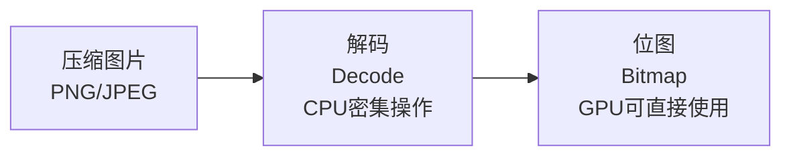
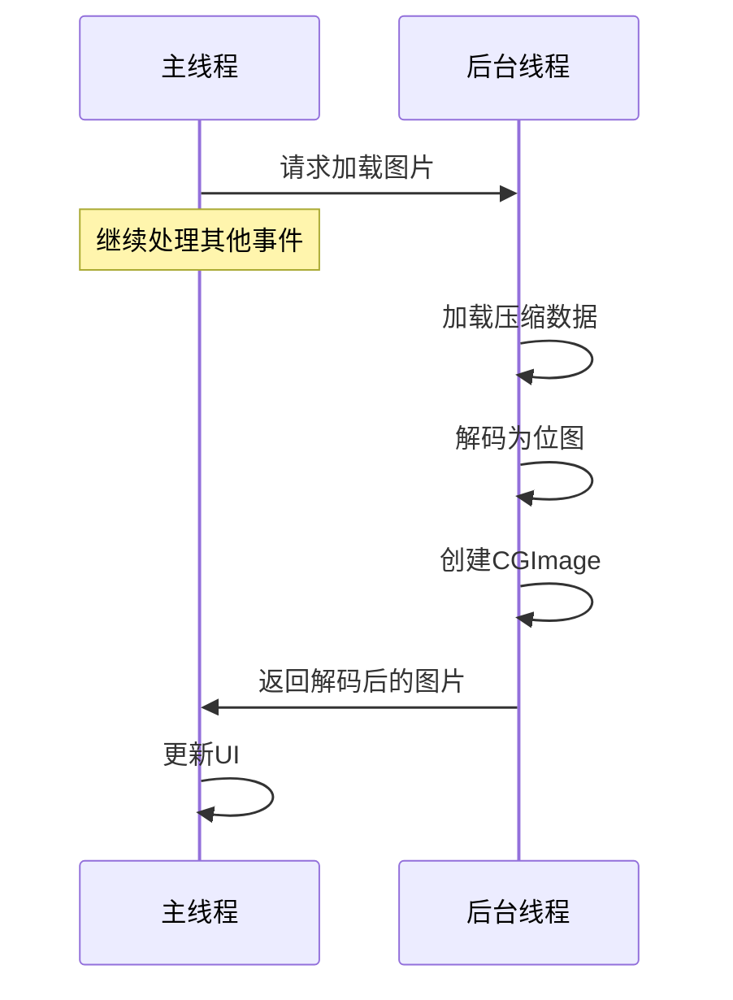
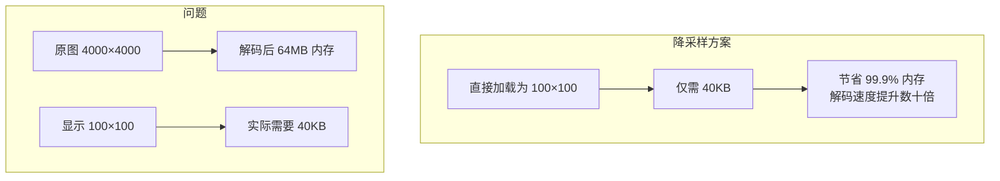
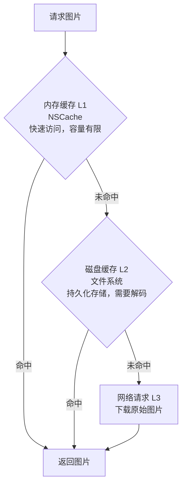
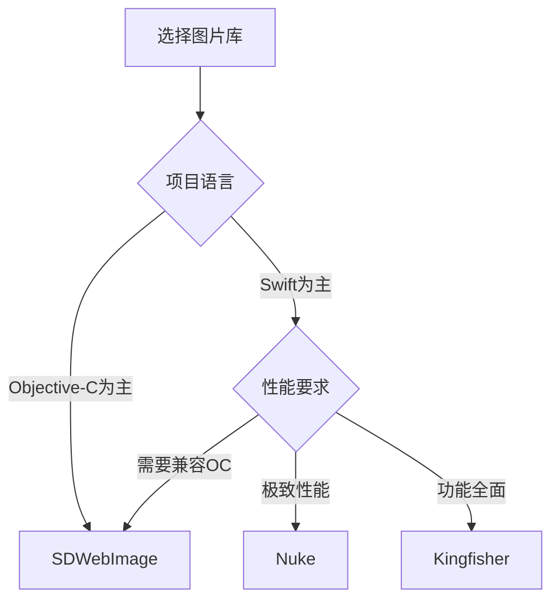

+++
title = "卡顿-图片优化"
date = '2026-05-02T22:32:27+08:00'
draft = false
weight = 28
tags = ["iOS", "性能优化", "卡顿"]
categories = ["iOS开发", "性能优化"]
+++
图片处理是iOS应用中常见的性能瓶颈。本文介绍图片解码原理以及各种优化方案。

---

## 图片解码原理

### 为什么需要解码

图片文件（PNG、JPEG等）是压缩格式，无法直接显示。GPU需要的是位图（Bitmap）格式：



> 位图大小 = 宽度 × 高度 × 每像素字节数
> 例如：1000×1000 RGBA图片 = 1000 × 1000 × 4 = 4MB

### 默认解码时机

```swift
// 加载图片（此时未解码）
let image = UIImage(named: "large_image")

// 设置到ImageView（仍未解码）
imageView.image = image

// 在 CATransaction commit 的 prepare 阶段，Core Animation 会在主线程对未解码的图片执行解码
// 未提前解码的图片一定会在此阶段被解码，从而阻塞主线程引发卡顿
```

---

## 异步解码

### 基本原理

将解码工作移到后台线程：



### 实现方案1：强制解码

```swift
extension UIImage {
    
    /// 强制解码图片
    func decodedImage() -> UIImage? {
        guard let cgImage = self.cgImage else { return nil }
        
        let width = cgImage.width
        let height = cgImage.height
        
        // 创建位图上下文
        let colorSpace = CGColorSpaceCreateDeviceRGB()
        let bitmapInfo = CGBitmapInfo(rawValue: CGImageAlphaInfo.premultipliedFirst.rawValue | CGBitmapInfo.byteOrder32Little.rawValue)
        
        guard let context = CGContext(
            data: nil,
            width: width,
            height: height,
            bitsPerComponent: 8,
            bytesPerRow: 0,
            space: colorSpace,
            bitmapInfo: bitmapInfo.rawValue
        ) else {
            return nil
        }
        
        // 绘制到上下文（触发解码）
        context.draw(cgImage, in: CGRect(x: 0, y: 0, width: width, height: height))
        
        // 从上下文创建新图片
        guard let decodedCGImage = context.makeImage() else { return nil }
        
        return UIImage(cgImage: decodedCGImage, scale: scale, orientation: imageOrientation)
    }
}

// 异步使用
func loadImageAsync(named name: String, completion: @escaping (UIImage?) -> Void) {
    DispatchQueue.global(qos: .userInitiated).async {
        let image = UIImage(named: name)?.decodedImage()
        
        DispatchQueue.main.async {
            completion(image)
        }
    }
}
```

### 实现方案2：使用ImageIO

```swift
import ImageIO

class ImageDecoder {
    
    static func decodeImage(from url: URL) -> UIImage? {
        guard let source = CGImageSourceCreateWithURL(url as CFURL, nil) else {
            return nil
        }
        
        let options: [CFString: Any] = [
            kCGImageSourceShouldCache: true,
            kCGImageSourceShouldCacheImmediately: true  // 立即解码
        ]
        
        guard let cgImage = CGImageSourceCreateImageAtIndex(source, 0, options as CFDictionary) else {
            return nil
        }
        
        return UIImage(cgImage: cgImage)
    }
    
    static func decodeImageAsync(from url: URL, completion: @escaping (UIImage?) -> Void) {
        DispatchQueue.global(qos: .userInitiated).async {
            let image = ImageDecoder.decodeImage(from: url)
            
            DispatchQueue.main.async {
                completion(image)
            }
        }
    }
}
```

### 实现方案3：使用UIGraphicsImageRenderer

```swift
extension UIImage {
    
    func decodedImageUsingRenderer() -> UIImage {
        let format = UIGraphicsImageRendererFormat()
        format.scale = scale
        format.opaque = true
        format.preferredRange = .standard
        
        let renderer = UIGraphicsImageRenderer(size: size, format: format)
        
        return renderer.image { context in
            draw(at: .zero)
        }
    }
}
```

---

## 图片降采样

### 为什么需要降采样

当图片尺寸远大于显示尺寸时，加载原图是浪费：



### 使用ImageIO降采样

```swift
import ImageIO

class ImageDownsampler {
    
    /// 降采样加载图片
    static func downsample(
        imageAt url: URL,
        to pointSize: CGSize,
        scale: CGFloat = UIScreen.main.scale
    ) -> UIImage? {
        
        let imageSourceOptions = [kCGImageSourceShouldCache: false] as CFDictionary
        
        guard let imageSource = CGImageSourceCreateWithURL(url as CFURL, imageSourceOptions) else {
            return nil
        }
        
        let maxDimensionInPixels = max(pointSize.width, pointSize.height) * scale
        
        let downsampleOptions: [CFString: Any] = [
            kCGImageSourceCreateThumbnailFromImageAlways: true,
            kCGImageSourceShouldCacheImmediately: true,
            kCGImageSourceCreateThumbnailWithTransform: true,
            kCGImageSourceThumbnailMaxPixelSize: maxDimensionInPixels
        ]
        
        guard let downsampledImage = CGImageSourceCreateThumbnailAtIndex(
            imageSource,
            0,
            downsampleOptions as CFDictionary
        ) else {
            return nil
        }
        
        return UIImage(cgImage: downsampledImage)
    }
    
    /// 从Data降采样
    static func downsample(
        data: Data,
        to pointSize: CGSize,
        scale: CGFloat = UIScreen.main.scale
    ) -> UIImage? {
        
        let imageSourceOptions = [kCGImageSourceShouldCache: false] as CFDictionary
        
        guard let imageSource = CGImageSourceCreateWithData(data as CFData, imageSourceOptions) else {
            return nil
        }
        
        let maxDimensionInPixels = max(pointSize.width, pointSize.height) * scale
        
        let downsampleOptions: [CFString: Any] = [
            kCGImageSourceCreateThumbnailFromImageAlways: true,
            kCGImageSourceShouldCacheImmediately: true,
            kCGImageSourceCreateThumbnailWithTransform: true,
            kCGImageSourceThumbnailMaxPixelSize: maxDimensionInPixels
        ]
        
        guard let downsampledImage = CGImageSourceCreateThumbnailAtIndex(
            imageSource,
            0,
            downsampleOptions as CFDictionary
        ) else {
            return nil
        }
        
        return UIImage(cgImage: downsampledImage)
    }
}
```

### 异步降采样

```swift
class AsyncImageLoader {
    
    private let queue = DispatchQueue(label: "image.downsampler", qos: .userInitiated, attributes: .concurrent)
    
    func loadImage(
        from url: URL,
        targetSize: CGSize,
        completion: @escaping (UIImage?) -> Void
    ) {
        queue.async {
            let image = ImageDownsampler.downsample(imageAt: url, to: targetSize)
            
            DispatchQueue.main.async {
                completion(image)
            }
        }
    }
    
    func loadImage(
        from data: Data,
        targetSize: CGSize,
        completion: @escaping (UIImage?) -> Void
    ) {
        queue.async {
            let image = ImageDownsampler.downsample(data: data, to: targetSize)
            
            DispatchQueue.main.async {
                completion(image)
            }
        }
    }
}
```

---

## 图片缓存

### 多级缓存架构



### 内存缓存实现

```swift
class MemoryImageCache {
    
    static let shared = MemoryImageCache()
    
    private let cache = NSCache<NSString, UIImage>()
    
    private init() {
        // 设置缓存限制
        cache.countLimit = 100
        cache.totalCostLimit = 50 * 1024 * 1024  // 50MB
        
        // 监听内存警告
        NotificationCenter.default.addObserver(
            self,
            selector: #selector(clearCache),
            name: UIApplication.didReceiveMemoryWarningNotification,
            object: nil
        )
    }
    
    func image(forKey key: String) -> UIImage? {
        return cache.object(forKey: key as NSString)
    }
    
    func setImage(_ image: UIImage, forKey key: String) {
        let cost = imageCost(image)
        cache.setObject(image, forKey: key as NSString, cost: cost)
    }
    
    func removeImage(forKey key: String) {
        cache.removeObject(forKey: key as NSString)
    }
    
    @objc func clearCache() {
        cache.removeAllObjects()
    }
    
    private func imageCost(_ image: UIImage) -> Int {
        guard let cgImage = image.cgImage else { return 0 }
        return cgImage.bytesPerRow * cgImage.height
    }
}
```

### 磁盘缓存实现

```swift
class DiskImageCache {
    
    static let shared = DiskImageCache()
    
    private let fileManager = FileManager.default
    private let cacheDirectory: URL
    private let queue = DispatchQueue(label: "disk.cache", qos: .utility)
    
    private init() {
        let paths = fileManager.urls(for: .cachesDirectory, in: .userDomainMask)
        cacheDirectory = paths[0].appendingPathComponent("ImageCache")
        
        try? fileManager.createDirectory(at: cacheDirectory, withIntermediateDirectories: true)
    }
    
    func image(forKey key: String, completion: @escaping (UIImage?) -> Void) {
        queue.async {
            let fileURL = self.fileURL(forKey: key)
            
            guard self.fileManager.fileExists(atPath: fileURL.path) else {
                DispatchQueue.main.async { completion(nil) }
                return
            }
            
            // 使用降采样加载（如果需要）
            let image = UIImage(contentsOfFile: fileURL.path)?.decodedImage()
            
            DispatchQueue.main.async {
                completion(image)
            }
        }
    }
    
    func setImage(_ image: UIImage, forKey key: String) {
        queue.async {
            let fileURL = self.fileURL(forKey: key)
            
            if let data = image.pngData() {
                try? data.write(to: fileURL)
            }
        }
    }
    
    func removeImage(forKey key: String) {
        queue.async {
            let fileURL = self.fileURL(forKey: key)
            try? self.fileManager.removeItem(at: fileURL)
        }
    }
    
    func clearCache() {
        queue.async {
            try? self.fileManager.removeItem(at: self.cacheDirectory)
            try? self.fileManager.createDirectory(at: self.cacheDirectory, withIntermediateDirectories: true)
        }
    }
    
    private func fileURL(forKey key: String) -> URL {
        let filename = key.data(using: .utf8)?.base64EncodedString() ?? key
        return cacheDirectory.appendingPathComponent(filename)
    }
}
```

### 统一缓存管理

```swift
class ImageCacheManager {
    
    static let shared = ImageCacheManager()
    
    private let memoryCache = MemoryImageCache.shared
    private let diskCache = DiskImageCache.shared
    private let downloadQueue = DispatchQueue(label: "image.download", qos: .userInitiated, attributes: .concurrent)
    
    private init() {}
    
    func loadImage(
        from url: URL,
        targetSize: CGSize? = nil,
        completion: @escaping (UIImage?) -> Void
    ) {
        let key = cacheKey(for: url, size: targetSize)
        
        // 1. 检查内存缓存
        if let image = memoryCache.image(forKey: key) {
            completion(image)
            return
        }
        
        // 2. 检查磁盘缓存
        diskCache.image(forKey: key) { [weak self] image in
            if let image = image {
                // 存入内存缓存
                self?.memoryCache.setImage(image, forKey: key)
                completion(image)
                return
            }
            
            // 3. 下载图片
            self?.downloadImage(from: url, targetSize: targetSize, key: key, completion: completion)
        }
    }
    
    private func downloadImage(
        from url: URL,
        targetSize: CGSize?,
        key: String,
        completion: @escaping (UIImage?) -> Void
    ) {
        downloadQueue.async { [weak self] in
            guard let data = try? Data(contentsOf: url) else {
                DispatchQueue.main.async { completion(nil) }
                return
            }
            
            // 降采样或直接解码
            let image: UIImage?
            if let size = targetSize {
                image = ImageDownsampler.downsample(data: data, to: size)
            } else {
                image = UIImage(data: data)?.decodedImage()
            }
            
            guard let finalImage = image else {
                DispatchQueue.main.async { completion(nil) }
                return
            }
            
            // 存入缓存
            self?.memoryCache.setImage(finalImage, forKey: key)
            self?.diskCache.setImage(finalImage, forKey: key)
            
            DispatchQueue.main.async {
                completion(finalImage)
            }
        }
    }
    
    private func cacheKey(for url: URL, size: CGSize?) -> String {
        var key = url.absoluteString
        if let size = size {
            key += "_\(Int(size.width))x\(Int(size.height))"
        }
        return key
    }
}
```

---

## 图片格式选择

### 格式对比

| 格式 | 压缩率 | 解码速度 | 透明度 | 适用场景 |
|-----|-------|---------|-------|---------|
| PNG | 低 | 快 | 支持 | 图标、需要透明的图片 |
| JPEG | 高 | 中 | 不支持 | 照片、大图 |
| HEIF | 很高 | 慢 | 支持 | iOS 11+照片 |
| WebP | 高 | 中 | 支持 | 网络图片 |

### 使用HEIF

```swift
import ImageIO

class HEIFImageLoader {
    
    static func loadHEIF(from url: URL) -> UIImage? {
        guard let source = CGImageSourceCreateWithURL(url as CFURL, nil) else {
            return nil
        }
        
        let options: [CFString: Any] = [
            kCGImageSourceShouldCache: true,
            kCGImageSourceShouldCacheImmediately: true
        ]
        
        guard let cgImage = CGImageSourceCreateImageAtIndex(source, 0, options as CFDictionary) else {
            return nil
        }
        
        return UIImage(cgImage: cgImage)
    }
    
    static func saveAsHEIF(image: UIImage, to url: URL, quality: CGFloat = 0.8) -> Bool {
        guard let cgImage = image.cgImage else { return false }
        
        guard let destination = CGImageDestinationCreateWithURL(
            url as CFURL,
            "public.heic" as CFString,
            1,
            nil
        ) else {
            return false
        }
        
        let options: [CFString: Any] = [
            kCGImageDestinationLossyCompressionQuality: quality
        ]
        
        CGImageDestinationAddImage(destination, cgImage, options as CFDictionary)
        
        return CGImageDestinationFinalize(destination)
    }
}
```

---

## 大图处理

### 分块加载

对于超大图片，可以使用CATiledLayer配合分块加载，避免一次性加载整张图片到内存：

```swift
class TiledImageView: UIView {
    
    private let imageURL: URL
    private let imageSize: CGSize
    
    override class var layerClass: AnyClass {
        return CATiledLayer.self
    }
    
    private var tiledLayer: CATiledLayer {
        return layer as! CATiledLayer
    }
    
    init?(url: URL) {
        guard let source = CGImageSourceCreateWithURL(url as CFURL, nil),
              let properties = CGImageSourceCopyPropertiesAtIndex(source, 0, nil) as? [CFString: Any],
              let width = properties[kCGImagePropertyPixelWidth] as? Int,
              let height = properties[kCGImagePropertyPixelHeight] as? Int else {
            return nil
        }
        
        self.imageURL = url
        self.imageSize = CGSize(width: width, height: height)
        
        super.init(frame: CGRect(origin: .zero, size: imageSize))
        
        // 配置CATiledLayer
        tiledLayer.tileSize = CGSize(width: 256, height: 256)
        tiledLayer.levelsOfDetail = 4
        tiledLayer.levelsOfDetailBias = 0
    }
    
    required init?(coder: NSCoder) {
        fatalError("init(coder:) has not been implemented")
    }
    
    override func draw(_ rect: CGRect) {
        // 只加载当前可见区域的图片数据
        guard let source = CGImageSourceCreateWithURL(imageURL as CFURL, nil) else { return }
        
        let options: [CFString: Any] = [
            kCGImageSourceShouldCache: false,
            kCGImageSourceCreateThumbnailFromImageAlways: true,
            kCGImageSourceThumbnailMaxPixelSize: max(rect.width, rect.height) * UIScreen.main.scale
        ]
        
        guard let cgImage = CGImageSourceCreateThumbnailAtIndex(source, 0, options as CFDictionary) else { return }
        
        let context = UIGraphicsGetCurrentContext()
        context?.translateBy(x: 0, y: rect.height)
        context?.scaleBy(x: 1, y: -1)
        context?.draw(cgImage, in: rect)
    }
}
```

> 注意：真正的分块加载通常需要预先将大图切分为多个小图块存储，然后按需加载对应的图块。上述示例使用CATiledLayer实现按需渲染。

### 渐进式加载

```swift
class ProgressiveImageLoader: NSObject, URLSessionDataDelegate {
    
    private var imageData = Data()
    private var session: URLSession?
    private var dataTask: URLSessionDataTask?
    private let imageSource: CGImageSource
    
    var onProgress: ((UIImage?, Double) -> Void)?
    var onComplete: ((UIImage?) -> Void)?
    
    override init() {
        // 初始化时创建增量图片源
        imageSource = CGImageSourceCreateIncremental(nil)
        super.init()
    }
    
    func load(from url: URL) {
        // 重置数据
        imageData = Data()
        
        let config = URLSessionConfiguration.default
        session = URLSession(configuration: config, delegate: self, delegateQueue: nil)
        dataTask = session?.dataTask(with: url)
        dataTask?.resume()
    }
    
    func urlSession(_ session: URLSession, dataTask: URLSessionDataTask, didReceive data: Data) {
        imageData.append(data)
        
        // 更新增量图片源数据
        CGImageSourceUpdateData(imageSource, imageData as CFData, false)
        
        if let cgImage = CGImageSourceCreateImageAtIndex(imageSource, 0, nil) {
            let image = UIImage(cgImage: cgImage)
            let expectedBytes = dataTask.countOfBytesExpectedToReceive
            let progress = expectedBytes > 0 ? Double(imageData.count) / Double(expectedBytes) : 0
            
            DispatchQueue.main.async { [weak self] in
                self?.onProgress?(image, progress)
            }
        }
    }
    
    func urlSession(_ session: URLSession, task: URLSessionTask, didCompleteWithError error: Error?) {
        // 标记数据完成
        CGImageSourceUpdateData(imageSource, imageData as CFData, true)
        
        DispatchQueue.main.async { [weak self] in
            if error == nil, let data = self?.imageData {
                let image = UIImage(data: data)?.decodedImage()
                self?.onComplete?(image)
            } else {
                self?.onComplete?(nil)
            }
        }
    }
}
```

---

## 常见图片加载库

iOS开发中有多个成熟的第三方图片加载库，它们都实现了上述优化策略。

### 库对比

| 特性 | SDWebImage | Kingfisher | Nuke |
|-----|------------|------------|------|
| 语言 | Objective-C | Swift | Swift |
| 异步解码 | 支持 | 支持 | 支持 |
| 降采样 | 支持 | 支持 | 支持 |
| 内存缓存 | NSCache | NSCache | 自定义 |
| 磁盘缓存 | 支持 | 支持 | 支持 |
| 渐进式加载 | 支持 | 支持 | 支持 |
| 动图支持 | GIF/APNG/WebP* | GIF/APNG/WebP* | GIF |
| 图片处理 | 支持 | 支持 | 支持 |
| SwiftUI支持 | 支持 | 支持 | 支持 |

> *WebP支持说明：iOS 14+系统原生支持WebP。iOS 13及以下版本，SDWebImage需要SDWebImageWebPCoder扩展，Kingfisher需要KingfisherWebP扩展。

### SDWebImage

SDWebImage是iOS最流行的图片加载库，功能全面：

**优化特性**：
- 异步下载和解码
- 内存+磁盘二级缓存
- 支持降采样（Thumbnail）
- 渐进式JPEG加载
- 支持WebP、HEIF、AVIF等格式
- 图片预取（Prefetching）
- 自动取消无效请求

### Kingfisher

Kingfisher是纯Swift实现的图片加载库：

**优化特性**：
- 纯Swift实现，类型安全
- 链式图片处理器
- 内存+磁盘缓存
- 支持降采样
- 渐进式JPEG
- 低数据模式支持
- SwiftUI原生支持

### Nuke

Nuke注重性能优化，在某些测试场景中表现优异

**优化特性**：
- 三级缓存架构（内存LRU/HTTP磁盘/主动磁盘缓存）
- 智能请求合并（Coalescing）：相同URL只发起一次请求
- 请求优先级管理
- 渐进式解码
- 积极预取（Prefetching）
- 支持Combine和async/await

### 选型建议



### 实际开发建议

**推荐使用第三方库**：在实际开发中，建议直接使用SDWebImage、Kingfisher或Nuke等成熟的第三方库，而非自己实现图片加载和图片优化。
