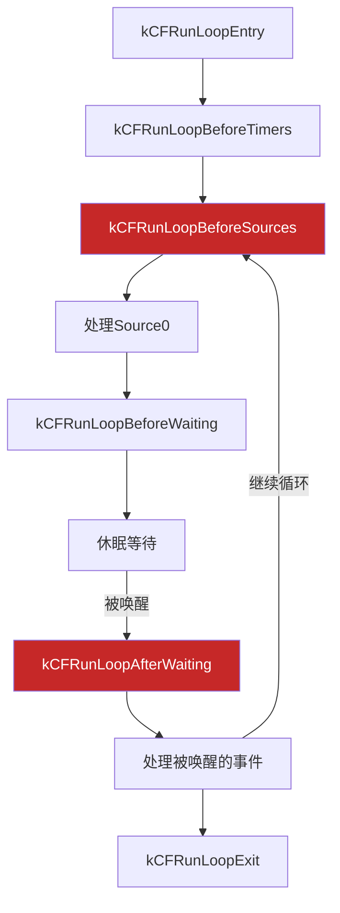
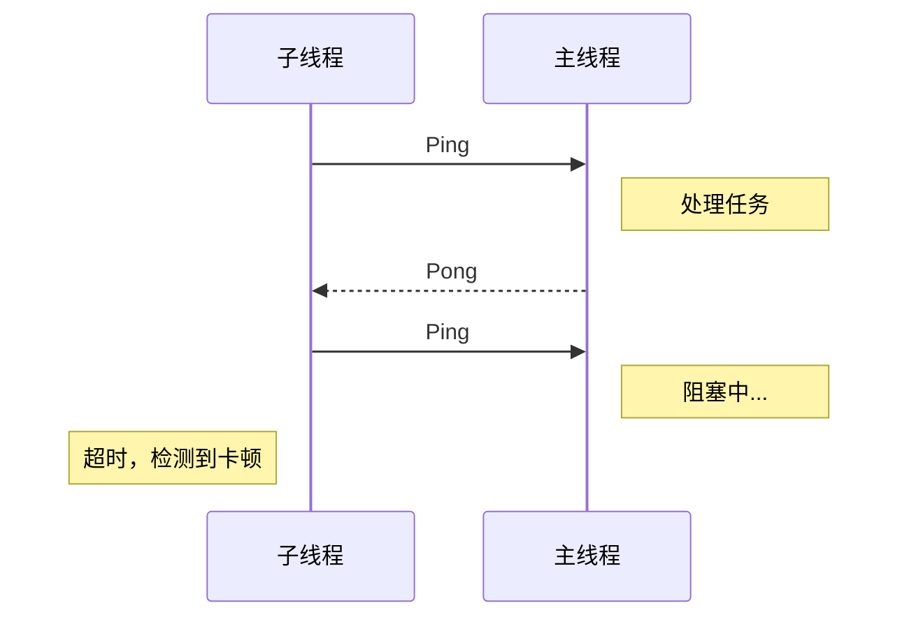
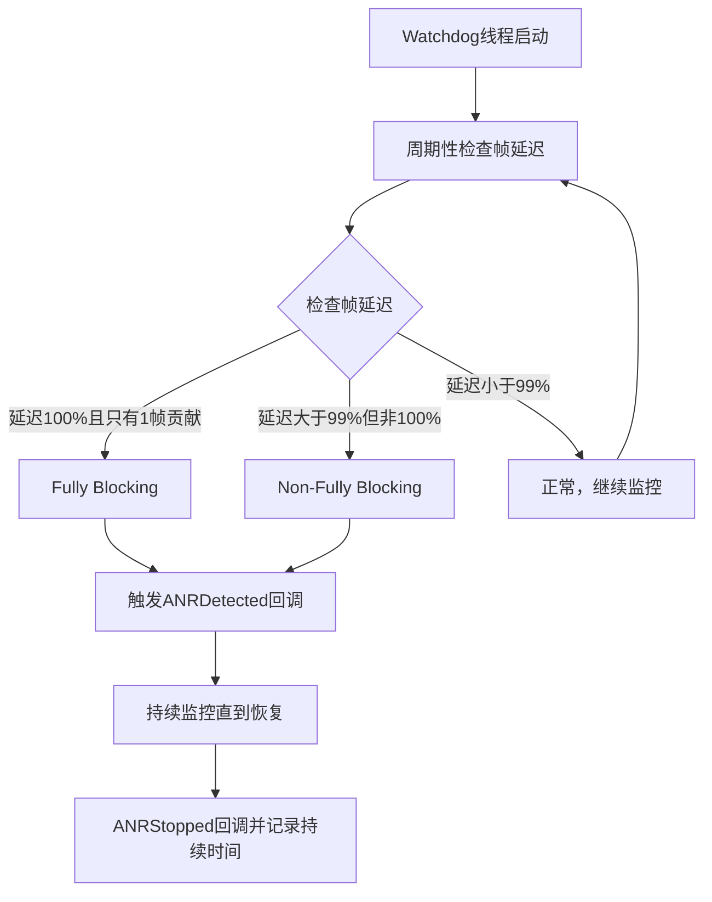
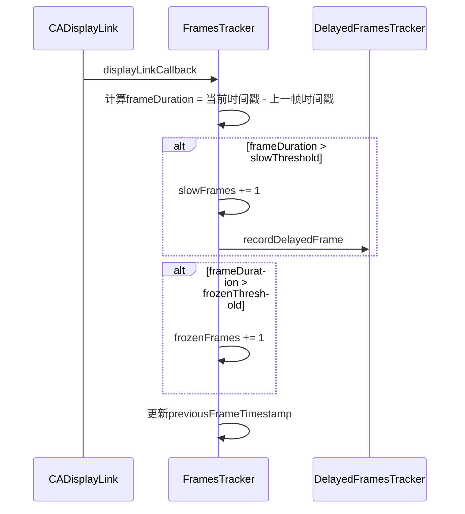
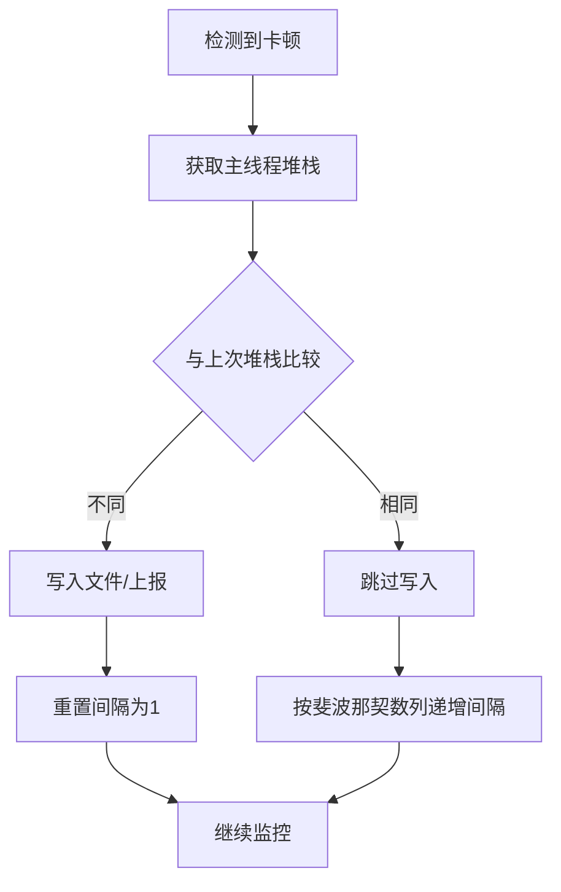

+++
title = "卡顿-检测"
date = '2026-05-07T16:54:12+08:00'
draft = false
weight = 29
tags = ["iOS", "性能优化", "卡顿"]
categories = ["iOS开发", "性能优化"]
+++
准确检测卡顿是优化的前提。本文介绍多种卡顿检测方案，从开发调试到线上监控都有对应的方案。

---

## 检测方案概览

| 方案 | 原理 | 优点 | 缺点 | 适用场景 |
|-----|------|-----|------|---------|
| CADisplayLink | 监控帧节奏、FPS、慢帧/掉帧 | 简单直接、适合趋势观察 | 无法直接给出堆栈，FPS 只能辅助判断 | 开发调试/线上辅助指标 |
| RunLoop Observer | 监控RunLoop状态 | 可获取堆栈 | 有一定开销 | 开发/线上 |
| 子线程Ping | 定时检测主线程响应 | 实现简单 | 精度有限 | 线上监控 |
| Instruments | 系统级分析 | 信息详细 | 只能开发时用 | 性能分析 |
| MetricKit | 系统数据收集 | 无额外开销 | iOS 13+ | 线上监控 |
| Sentry ANR V2 | 帧延迟分析 | 区分阻塞类型 | 需集成SDK | 线上监控 |

---

## 1. CADisplayLink监控

### 基本原理

CADisplayLink 是一个和屏幕显示刷新节奏同步的回调。它适合回答“当前 UI 刷新是否顺畅、是否出现慢帧、掉帧或冻结帧”，但 **FPS 本身只是辅助参考**，不能单独作为卡顿结论。

原因是：

1. **FPS 只描述结果，不描述原因**：FPS 下降只能说明某段时间显示帧变少了，不能告诉你是主线程计算、布局、图片解码、锁等待、I/O、GPU 渲染还是系统主动降刷新率导致的。
2. **ProMotion 会动态调整刷新率**：在支持 120Hz 的机型上，系统可能根据内容和功耗策略把刷新率降到 10Hz、24Hz、30Hz、60Hz、80Hz、120Hz 等。静止页面低 FPS 可能只是系统主动省电，不是卡顿。
3. **主线程阻塞会让回调延迟**：如果主线程真的被阻塞，CADisplayLink 回调本身也会延后，此时需要结合实际回调间隔、RunLoop 状态和堆栈采样判断。

因此线上卡顿监控更推荐记录 **帧间隔 / 慢帧 / 冻结帧 / 交互场景**，而不是只显示一个“当前 FPS”。

几个概念要分清：

| 值 | 含义 | 典型用途 |
|---|------|---------|
| `UIScreen.main.maximumFramesPerSecond` | 屏幕最大刷新能力，例如 60 或 120 | 判断设备上限，不能代表当前实际刷新率 |
| `link.targetTimestamp - link.timestamp` | 系统当前调度的目标帧间隔 | 估算当前调度帧率 |
| `link.timestamp - lastFrameTimestamp` | 两次 DisplayLink 回调关联显示时间的实际间隔 | 判断这一帧是否延迟 |
| `Date/CACurrentMediaTime` 的回调间隔 | 回调函数真实到达 App 的时间间隔 | 判断主线程是否被阻塞导致回调延后 |

在 ProMotion 机型上，`UIScreen.main.maximumFramesPerSecond` 通常仍返回最大能力 120。即使当前系统把刷新节奏降到 10Hz，它也不会变成 10。当前调度帧率应通过 `targetTimestamp - timestamp` 估算：

```swift
let scheduledInterval = link.targetTimestamp - link.timestamp
let scheduledFPS = 1.0 / scheduledInterval
```

如果系统当前按 10Hz 调度，则：

```text
scheduledInterval ≈ 0.1s
scheduledFPS ≈ 10
UIScreen.main.maximumFramesPerSecond 仍可能是 120
```

一个更适合监控的实现，不是只按 1 秒聚合 FPS，而是同时记录当前调度帧率、实际帧间隔、慢帧和冻结帧：

```swift
import UIKit
import QuartzCore

final class FrameMonitor {
    
    static let shared = FrameMonitor()
    
    private var displayLink: CADisplayLink?
    private var lastFrameTimestamp: CFTimeInterval = 0
    private var windowStartTimestamp: CFTimeInterval = 0
    private var frameCount = 0
    private var slowFrameCount = 0
    private var frozenFrameCount = 0
    
    var onUpdate: ((_ scheduledFPS: Double,
                    _ windowFPS: Double,
                    _ slowFrames: Int,
                    _ frozenFrames: Int) -> Void)?
    
    private init() {}
    
    func start() {
        displayLink = CADisplayLink(target: self, selector: #selector(tick))

        if #available(iOS 15.0, *) {
            let maxFPS = Float(UIScreen.main.maximumFramesPerSecond)
            displayLink?.preferredFrameRateRange = CAFrameRateRange(
                minimum: 30,
                maximum: maxFPS,
                preferred: maxFPS
            )
        } else {
            displayLink?.preferredFramesPerSecond = UIScreen.main.maximumFramesPerSecond
        }

        displayLink?.add(to: .main, forMode: .common)
    }
    
    func stop() {
        displayLink?.invalidate()
        displayLink = nil
    }
    
    @objc private func tick(_ link: CADisplayLink) {
        if lastFrameTimestamp == 0 {
            lastFrameTimestamp = link.timestamp
            windowStartTimestamp = link.timestamp
            return
        }

        // 系统当前给 CADisplayLink 的目标调度间隔。
        // ProMotion 下它可能是 1/120、1/80、1/60、1/30、1/10 等，
        // 比 UIScreen.maximumFramesPerSecond 更接近当前实际调度节奏。
        let scheduledInterval = link.targetTimestamp - link.timestamp
        let scheduledFPS = scheduledInterval > 0 ? 1.0 / scheduledInterval : 60

        // 两次显示时间戳之间的实际间隔，用来判断这一帧是否超出当前帧预算。
        let frameDuration = link.timestamp - lastFrameTimestamp

        // 当前调度频率下的理论单帧预算。120Hz 约 8.33ms，60Hz 约 16.67ms。
        let expectedFrameDuration = 1.0 / scheduledFPS

        // 通常给一点容忍，避免时间戳抖动造成误报。
        if frameDuration > 0.7 {
            frozenFrameCount += 1
        } else if frameDuration > expectedFrameDuration * 1.5 {
            slowFrameCount += 1
        }

        frameCount += 1

        let windowElapsed = link.timestamp - windowStartTimestamp
        if windowElapsed >= 1.0 {
            // 当前统计窗口内真实收到的帧回调频率。它适合看趋势，
            // 但线上卡顿判定更应该看 slowFrameCount / frozenFrameCount。
            let windowFPS = Double(frameCount) / windowElapsed
            onUpdate?(scheduledFPS, windowFPS, slowFrameCount, frozenFrameCount)
            windowStartTimestamp = link.timestamp
            frameCount = 0
            slowFrameCount = 0
            frozenFrameCount = 0
        }

        lastFrameTimestamp = link.timestamp
    }
}
```

`preferredFrameRateRange` 只是告诉系统“我希望的刷新范围和偏好”，不是强制命令。低电量、热状态、系统策略、当前内容是否静止、主线程负载等因素都可能让实际回调频率低于 `preferred`。

### FPS显示控件

开发期可以做一个 FPSLabel，但它只适合观察趋势，不能用“低于 55 就一定卡顿”这种固定阈值。尤其在 ProMotion 机型上，静止页面可能被系统降到 10Hz 或 30Hz，此时显示 10 FPS / 30 FPS 并不代表 App 性能差。

```swift
class FPSLabel: UILabel {
    
    private var displayLink: CADisplayLink?
    private var lastTimestamp: CFTimeInterval = 0
    private var frameCount: Int = 0
    
    override init(frame: CGRect) {
        super.init(frame: frame)
        setup()
    }
    
    required init?(coder: NSCoder) {
        super.init(coder: coder)
        setup()
    }
    
    private func setup() {
        layer.cornerRadius = 5
        clipsToBounds = true
        backgroundColor = UIColor.black.withAlphaComponent(0.7)
        textColor = .green
        font = .monospacedDigitSystemFont(ofSize: 14, weight: .medium)
        textAlignment = .center
        
        displayLink = CADisplayLink(target: self, selector: #selector(tick))
        displayLink?.add(to: .main, forMode: .common)
    }
    
    @objc private func tick(_ link: CADisplayLink) {
        guard lastTimestamp != 0 else {
            lastTimestamp = link.timestamp
            return
        }
        
        frameCount += 1
        let elapsed = link.timestamp - lastTimestamp
        
        if elapsed >= 1.0 {
            let fps = Double(frameCount) / elapsed
            frameCount = 0
            lastTimestamp = link.timestamp
            
            updateDisplay(fps: fps)
        }
    }
    
    private func updateDisplay(fps: Double) {
        let fpsText = String(format: "%.0f FPS", fps)
        text = fpsText
        
        // 只作为开发期趋势提示。线上卡顿判定不能只依赖这个颜色。
        if fps >= 55 {
            textColor = .green
        } else if fps >= 45 {
            textColor = .yellow
        } else {
            textColor = .red
        }
    }
    
    deinit {
        displayLink?.invalidate()
    }
}
```

### 使用示例

```swift
// 在AppDelegate中添加FPS显示
func application(_ application: UIApplication, 
                 didFinishLaunchingWithOptions launchOptions: [UIApplication.LaunchOptionsKey: Any]?) -> Bool {
    
    #if DEBUG
    DispatchQueue.main.asyncAfter(deadline: .now() + 1) {
        let fpsLabel = FPSLabel(frame: CGRect(x: 20, y: 50, width: 60, height: 24))
        if #available(iOS 13.0, *) {
            if let windowScene = UIApplication.shared.connectedScenes
                .compactMap({ $0 as? UIWindowScene })
                .first,
               let window = windowScene.windows.first(where: { $0.isKeyWindow }) {
                window.addSubview(fpsLabel)
            }
        } else if let window = UIApplication.shared.keyWindow {
            window.addSubview(fpsLabel)
        }
    }
    #endif
    
    return true
}
```

### CADisplayLink的局限性

CADisplayLink方案的局限：

1. **FPS 只是辅助指标**：FPS 低不一定是卡顿，可能是 ProMotion 动态降刷新率、低电量、热状态或静止页面省电策略。
2. **无法获取堆栈**：只能知道帧延迟或掉帧了，不知道是哪段代码导致的。
3. **回调被阻塞**：如果主线程阻塞，CADisplayLink 回调本身也会被延迟。
4. **场景敏感**：滚动、动画、手势交互时的低 FPS 更有价值；静止页面低 FPS 诊断价值很低。
5. **需要动态阈值**：60Hz 下单帧预算约 16.67ms，120Hz 下约 8.33ms，不能写死 16.67ms 或 60 FPS。

更合理的使用方式：

| 场景 | 判断方式 |
|-----|---------|
| 开发调试 | 显示 FPS 趋势，辅助发现明显抖动 |
| 线上监控 | 统计慢帧、冻结帧、滚动掉帧、帧延迟总量 |
| 根因定位 | 结合 RunLoop Observer、子线程 Ping、周期性堆栈采样、MetricKit |
| ProMotion 设备 | 使用 `targetTimestamp - timestamp` 计算当前调度帧率，按动态帧预算判断慢帧 |

---

## 2. RunLoop监控方案

### 基本原理

通过监控RunLoop的状态变化，检测主线程是否长时间处于某个状态：



**卡顿检测关键点**：BeforeSources → AfterWaiting 之间耗时过长 = 主线程阻塞

### 完整实现

```swift
import Foundation

class RunLoopMonitor {
    
    static let shared = RunLoopMonitor()
    
    /// 卡顿阈值（毫秒）
    var threshold: TimeInterval = 100
    
    /// 卡顿回调
    var onJankDetected: ((_ duration: TimeInterval, _ callStack: String) -> Void)?
    
    private var observer: CFRunLoopObserver?
    private var semaphore: DispatchSemaphore?
    private var activity: CFRunLoopActivity = .entry
    private var isMonitoring = false
    
    private init() {}
    
    func start() {
        guard !isMonitoring else { return }
        isMonitoring = true
        
        // 创建信号量
        semaphore = DispatchSemaphore(value: 0)
        
        // 创建RunLoop观察者
        let callback: CFRunLoopObserverCallBack = { _, activity, info in
            guard let info = info else { return }
            let monitor = Unmanaged<RunLoopMonitor>.fromOpaque(info).takeUnretainedValue()
            monitor.activity = activity
            monitor.semaphore?.signal()
        }
        
        var observerContext = CFRunLoopObserverContext(
            version: 0,
            info: Unmanaged.passUnretained(self).toOpaque(),
            retain: nil,
            release: nil,
            copyDescription: nil
        )

        observer = CFRunLoopObserverCreate(
            kCFAllocatorDefault,
            CFRunLoopActivity.allActivities.rawValue,
            true,  // 重复
            0,     // 优先级
            callback,
            &observerContext
        )
        
        if let observer = observer {
            CFRunLoopAddObserver(CFRunLoopGetMain(), observer, .commonModes)
        }
        
        // 在子线程中监控
        startMonitorThread()
    }
    
    func stop() {
        guard isMonitoring else { return }
        isMonitoring = false
        
        if let observer = observer {
            CFRunLoopRemoveObserver(CFRunLoopGetMain(), observer, .commonModes)
        }
        observer = nil
        semaphore = nil
    }
    
    private func startMonitorThread() {
        DispatchQueue.global(qos: .userInteractive).async { [weak self] in
            guard let self = self else { return }
            
            while self.isMonitoring {
                guard let semaphore = self.semaphore else { break }
                
                // 等待信号量，超时时间为阈值
                let result = semaphore.wait(timeout: .now() + self.threshold / 1000.0)
                
                if result == .timedOut {
                    // 检查是否在关键状态
                    let activity = self.activity
                    if activity == .beforeSources || activity == .afterWaiting {
                        // 检测到卡顿，获取堆栈
                        let callStack = self.captureMainThreadCallStack()
                        let duration = self.threshold
                        
                        DispatchQueue.main.async {
                            self.onJankDetected?(duration, callStack)
                        }
                    }
                }
            }
        }
    }
    
    private func captureMainThreadCallStack() -> String {
        // 不能直接使用 Thread.callStackSymbols（这里只会拿到当前监控线程）
        // 生产环境应使用信号机制采集主线程堆栈
        return captureMainThreadCallStackAccurate()
    }
}
```

### 更精确的堆栈采集

上面的实现获取的是子线程的堆栈，要获取主线程堆栈需要使用信号机制：

```objc
// JankStackCapture.m
#import <Foundation/Foundation.h>
#import <pthread.h>
#import <signal.h>
#import <execinfo.h>

static pthread_t g_mainThread;
static void *g_callStack[128];
static int g_callStackCount = 0;
static dispatch_semaphore_t g_semaphore;

// 信号处理函数
static void SignalHandler(int signal) {
    // 在信号处理函数中获取当前线程（主线程）的堆栈
    g_callStackCount = backtrace(g_callStack, 128);
    dispatch_semaphore_signal(g_semaphore);
}

@interface JankStackCapture : NSObject
+ (NSArray<NSString *> *)captureMainThreadStack;
@end

@implementation JankStackCapture

+ (void)initialize {
    g_mainThread = pthread_self();
    g_semaphore = dispatch_semaphore_create(0);
    
    // 注册信号处理
    signal(SIGURG, SignalHandler);
}

+ (NSArray<NSString *> *)captureMainThreadStack {
    // 向主线程发送信号
    pthread_kill(g_mainThread, SIGURG);
    
    // 等待信号处理完成
    dispatch_semaphore_wait(g_semaphore, dispatch_time(DISPATCH_TIME_NOW, 50 * NSEC_PER_MSEC));
    
    // 符号化堆栈
    char **symbols = backtrace_symbols(g_callStack, g_callStackCount);
    NSMutableArray *result = [NSMutableArray array];
    
    for (int i = 0; i < g_callStackCount; i++) {
        [result addObject:@(symbols[i])];
    }
    
    free(symbols);
    return result;
}

@end
```

### Swift封装

```swift
// JankStackCapture.swift
import Foundation

@objc class JankStackCapture: NSObject {
    
    @objc static func captureMainThreadStack() -> [String] {
        // 这里仅示意桥接点，真实实现应调用 ObjC 的 signal + backtrace 逻辑
        return []
    }
}

// 更新RunLoopMonitor使用
extension RunLoopMonitor {
    
    private func captureMainThreadCallStackAccurate() -> String {
        // 使用信号机制获取主线程堆栈
        let stack = JankStackCapture.captureMainThreadStack()
        return stack.joined(separator: "\n")
    }
}
```

### BeforeWaiting阶段的监控盲区

上面的 RunLoop 方案是网上流传最广的实现，但它存在一个重要的盲区：**无法检测 `kCFRunLoopBeforeWaiting` 阶段的卡顿**。

回顾 RunLoop 的执行流程，当 `kCFRunLoopBeforeWaiting` 被通知时，系统注册的多个 Observer 会依次执行，其中包括手势识别回调（`_UIGestureRecognizerUpdate`）、UI 布局与绘制（`CA::Transaction::commit`）、AutoreleasePool 释放重建等。这些操作恰恰是容易产生卡顿的地方。

问题在于：上面代码的 Observer 优先级（order）为 0，而 Core Animation 注册的 `kCFRunLoopBeforeWaiting` Observer 的 order 为 2000000（可通过打印 `[NSRunLoop mainRunLoop].description` 验证）。RunLoop 按 order 从小到大依次调用同一 activity 阶段的 Observer，因此 order=0 的 Observer **一定比** Core Animation 的 Observer 更早执行。此时 `activity` 被更新为 `.beforeWaiting`，信号量被 signal。但子线程的判断条件只检查了 `.beforeSources` 和 `.afterWaiting`，不包含 `.beforeWaiting`，因此后续系统 Observer 回调（如 `layoutSubviews`、`drawRect:`）中发生的卡顿，都会被直接跳过。

#### 微信 Matrix 的解决方案：双Observer + 极端优先级

微信开源的 APM 框架 [Matrix](https://github.com/Tencent/matrix) 通过注册**两个** Observer 来彻底解决这个问题：

```objc
// 最先执行的 Observer（order = LONG_MIN）
CFRunLoopObserverRef beginObserver = CFRunLoopObserverCreate(
    kCFAllocatorDefault, kCFRunLoopAllActivities, YES,
    LONG_MIN,  // 优先级最高，同一 activity 中最先执行
    &myRunLoopBeginCallback, &context);

// 最后执行的 Observer（order = LONG_MAX）
CFRunLoopObserverRef endObserver = CFRunLoopObserverCreate(
    kCFAllocatorDefault, kCFRunLoopAllActivities, YES,
    LONG_MAX,  // 优先级最低，同一 activity 中最后执行
    &myRunLoopEndCallback, &context);

CFRunLoopAddObserver(runloop, beginObserver, kCFRunLoopCommonModes);
CFRunLoopAddObserver(runloop, endObserver, kCFRunLoopCommonModes);
```

当 `kCFRunLoopBeforeWaiting` 触发时，执行顺序变为：

```plaintext
beginCallback（LONG_MIN）→ 记录开始时间，标记 bRun = YES
        ↓
系统 Observer：手势识别回调、UI 布局绘制、AutoreleasePool 管理 ...
        ↓
endCallback（LONG_MAX）→ 检查耗时是否超过阈值，标记 bRun = NO
```

`endCallback` 在 `kCFRunLoopBeforeWaiting` 阶段的所有 Observer 都执行完毕后才被调用，此时可以准确计算从 `beginCallback` 到自己之间经过的时间，从而覆盖 `BeforeWaiting` 阶段所有系统 Observer 的耗时。

Matrix 的 `endCallback` 中，在 `kCFRunLoopBeforeWaiting` 状态下会主动调用 `checkRunloopDuration` 进行耗时检查：

```objc
void myRunLoopEndCallback(CFRunLoopObserverRef observer, CFRunLoopActivity activity, void *info) {
    g_runLoopActivity = activity;
    switch (activity) {
    case kCFRunLoopBeforeWaiting:
        if (g_bSensitiveRunloopHangDetection && g_bRun) {
            [WCBlockMonitorMgr checkRunloopDuration];
        }
        g_bRun = NO;
        break;
    case kCFRunLoopExit:
        g_bRun = NO;
        break;
    default:
        break;
    }
}
```

---

## 3. 子线程Ping方案

### 基本原理

子线程定时向主线程发送Ping，如果主线程长时间未响应则判定为卡顿：



### 实现代码

```swift
class PingMonitor {
    
    static let shared = PingMonitor()
    
    /// 检测间隔（秒）
    var interval: TimeInterval = 1.0
    
    /// 超时阈值（秒）
    var timeout: TimeInterval = 2.0
    
    /// 卡顿回调
    var onJankDetected: ((_ duration: TimeInterval) -> Void)?
    
    private var isMonitoring = false
    private var isPonged = false
    private var pingTime: CFAbsoluteTime = 0
    
    private init() {}
    
    func start() {
        guard !isMonitoring else { return }
        isMonitoring = true
        
        startPingLoop()
    }
    
    func stop() {
        isMonitoring = false
    }
    
    private func startPingLoop() {
        DispatchQueue.global(qos: .userInteractive).async { [weak self] in
            guard let self = self else { return }
            
            while self.isMonitoring {
                self.isPonged = false
                self.pingTime = CFAbsoluteTimeGetCurrent()
                
                // 向主线程发送Ping
                DispatchQueue.main.async {
                    self.isPonged = true
                }
                
                // 等待一段时间后检查
                Thread.sleep(forTimeInterval: self.timeout)
                
                if !self.isPonged {
                    // 主线程未响应，检测到卡顿
                    let duration = CFAbsoluteTimeGetCurrent() - self.pingTime
                    
                    DispatchQueue.main.async {
                        self.onJankDetected?(duration)
                    }
                }
                
                // 等待下一次检测
                Thread.sleep(forTimeInterval: self.interval)
            }
        }
    }
}
```

### 带堆栈采集的版本

```swift
class PingMonitorWithStack {
    
    static let shared = PingMonitorWithStack()
    
    var interval: TimeInterval = 1.0
    var timeout: TimeInterval = 2.0
    var onJankDetected: ((_ duration: TimeInterval, _ stack: String) -> Void)?
    
    private var isMonitoring = false
    private var isPonged = false
    private var pingTime: CFAbsoluteTime = 0
    private var monitorQueue: DispatchQueue?
    
    private init() {}
    
    func start() {
        guard !isMonitoring else { return }
        isMonitoring = true
        
        monitorQueue = DispatchQueue(label: "com.jank.ping", qos: .userInteractive)
        startPingLoop()
    }
    
    func stop() {
        isMonitoring = false
        monitorQueue = nil
    }
    
    private func startPingLoop() {
        monitorQueue?.async { [weak self] in
            guard let self = self else { return }
            
            while self.isMonitoring {
                self.isPonged = false
                self.pingTime = CFAbsoluteTimeGetCurrent()
                
                // 发送Ping
                DispatchQueue.main.async {
                    self.isPonged = true
                }
                
                // 等待超时时间
                Thread.sleep(forTimeInterval: self.timeout)
                
                if !self.isPonged {
                    // 采集主线程堆栈
                    let stack = self.captureMainThreadStack()
                    let duration = CFAbsoluteTimeGetCurrent() - self.pingTime
                    
                    // 继续等待直到主线程恢复
                    while !self.isPonged && self.isMonitoring {
                        Thread.sleep(forTimeInterval: 0.1)
                    }
                    
                    let totalDuration = CFAbsoluteTimeGetCurrent() - self.pingTime
                    
                    DispatchQueue.main.async {
                        self.onJankDetected?(totalDuration, stack)
                    }
                }
                
                Thread.sleep(forTimeInterval: self.interval)
            }
        }
    }
    
    private func captureMainThreadStack() -> String {
        // 使用信号机制获取主线程堆栈
        // 实际实现需要ObjC代码
        return "Main thread stack capture requires ObjC implementation"
    }
}
```

---

## 4. Instruments工具

### Time Profiler

Time Profiler是分析CPU性能的首选工具：

```plaintext
使用步骤：
1. Product → Profile (Cmd+I)
2. 选择 Time Profiler
3. 点击 Record 开始录制
4. 执行会卡顿的操作
5. 停止录制，分析结果

关键设置：
- Record Waiting Threads: 记录等待中的线程
- Record Kernel Callstacks: 记录内核调用栈
- High Frequency: 高频采样模式
```

### Time Profiler分析技巧

```plaintext
分析视图：

Call Tree（调用树）：
┌─────────────────────────────────────────────────────┐
│  Weight    Self Weight    Symbol Name               │
├─────────────────────────────────────────────────────┤
│  100%      0%            main                       │
│   └─ 95%   0%            UIApplicationMain          │
│       └─ 90%  0%         -[UIApplication _run]      │
│           └─ 85%  0%     CFRunLoopRun               │
│               └─ 80%  75%  -[MyVC heavyWork]  ← 瓶颈│
└─────────────────────────────────────────────────────┘

重要选项：
- Separate by Thread: 按线程分离
- Invert Call Tree: 反转调用树（从叶子节点开始）
- Hide System Libraries: 隐藏系统库
- Flatten Recursion: 展平递归调用
```

### Core Animation

检测GPU渲染问题：

```plaintext
使用步骤：
1. Product → Profile
2. 选择 Core Animation
3. 录制并操作App

关键指标：
- FPS: 帧率
- GPU Time: GPU渲染时间
- Offscreen Rendered: 离屏渲染次数
```

### System Trace

分析系统级性能问题：

```plaintext
System Trace 可以显示：
- 线程调度
- 系统调用
- 虚拟内存操作
- 中断和异常

适用场景：
- 分析线程阻塞原因
- 检测锁竞争
- 分析I/O性能
```

---

## 5. MetricKit（iOS 13+）

### 基本使用

MetricKit可以收集线上用户的性能数据：

```swift
import MetricKit

class MetricsManager: NSObject, MXMetricManagerSubscriber {
    
    static let shared = MetricsManager()
    
    func startCollecting() {
        MXMetricManager.shared.add(self)
    }
    
    func stopCollecting() {
        MXMetricManager.shared.remove(self)
    }
    
    // iOS 13: 每日回调
    func didReceive(_ payloads: [MXMetricPayload]) {
        for payload in payloads {
            processPayload(payload)
        }
    }
    
    // iOS 14+: 诊断数据回调
    @available(iOS 14.0, *)
    func didReceive(_ payloads: [MXDiagnosticPayload]) {
        for payload in payloads {
            processDiagnostic(payload)
        }
    }
    
    private func processPayload(_ payload: MXMetricPayload) {
        // 应用响应性指标
        if let responsiveness = payload.applicationResponsivenessMetrics {
            let hangTime = responsiveness.histogrammedApplicationHangTime
            analyzeHangTime(hangTime)
        }
        
        // 动画指标（iOS 14+）
        if #available(iOS 14.0, *) {
            if let animation = payload.animationMetrics {
                let scrollHitch = animation.scrollHitchTimeRatio
                print("Scroll hitch ratio: \(scrollHitch)")
            }
        }
    }
    
    private func analyzeHangTime(_ histogram: MXHistogram<UnitDuration>) {
        // 分析卡顿时间分布
        for bucket in histogram.bucketEnumerator {
            guard let bucket = bucket as? MXHistogramBucket<UnitDuration> else { continue }
            
            let start = bucket.bucketStart.value
            let end = bucket.bucketEnd.value
            let count = bucket.bucketCount
            
            print("Hang \(start)-\(end)ms: \(count) times")
        }
    }
    
    @available(iOS 14.0, *)
    private func processDiagnostic(_ payload: MXDiagnosticPayload) {
        // 处理卡顿诊断
        if let hangDiagnostics = payload.hangDiagnostics {
            for diagnostic in hangDiagnostics {
                let duration = diagnostic.hangDuration
                let callStack = diagnostic.callStackTree
                
                print("Hang duration: \(duration)")
                print("Call stack: \(callStack)")
            }
        }
    }
}
```

### MetricKit的优势

| 特性 | 说明 |
|-----|------|
| 零开销 | 系统级数据收集，不影响性能 |
| 真实数据 | 来自真实用户的设备 |
| 隐私保护 | 数据聚合后回调，无隐私问题 |
| 堆栈信息 | iOS 14+支持卡顿堆栈 |

### 数据解析示例

```swift
@available(iOS 14.0, *)
extension MetricsManager {
    
    func parseCallStackTree(_ tree: MXCallStackTree) -> [String] {
        // 解析调用栈树
        let jsonData = tree.jsonRepresentation()
        
        do {
            if let json = try JSONSerialization.jsonObject(with: jsonData) as? [String: Any],
               let callStacks = json["callStacks"] as? [[String: Any]] {
                
                var result: [String] = []
                for stack in callStacks {
                    if let frames = stack["callStackRootFrames"] as? [[String: Any]] {
                        for frame in frames {
                            if let address = frame["address"] as? UInt64,
                               let offsetIntoBinaryTextSegment = frame["offsetIntoBinaryTextSegment"] as? UInt64 {
                                result.append("0x\(String(address, radix: 16)) + \(offsetIntoBinaryTextSegment)")
                            }
                        }
                    }
                }
                return result
            }
        } catch {
            print("Failed to parse call stack: \(error)")
        }
        
        return []
    }
}
```

---

## 6. Sentry ANR检测方案（App Hangs V2）

Sentry SDK提供了一种更精细的卡顿检测方案，能够区分**完全阻塞（Fully Blocking）**和**非完全阻塞（Non-Fully Blocking）**两种类型的卡顿，这对于问题定位和优先级排序非常有价值。

### 为什么要区分阻塞类型

所有基于"超时采集堆栈"的方案都存在堆栈时机问题（详见本文第7章"堆栈采集时机问题"）。Sentry的创新在于：**通过区分阻塞类型，告知开发者堆栈的可信度**。

| 类型 | 特征 | 堆栈可信度 | 说明 |
|-----|------|-----------|------|
| Fully Blocking | 主线程完全卡住，无法渲染任何帧 | 高 | 整个检测周期只有1帧，堆栈大概率准确 |
| Non-Fully Blocking | 应用看起来卡顿，但仍能渲染少量帧 | 低 | 多个任务累积导致，堆栈可能指向"最后一个"而非"最耗时的" |
| Fatal App Hang | 卡顿期间应用被用户或系统终止 | 取决于阻塞类型 | 最严重，需优先处理 |

**关键洞察**：Sentry并没有解决堆栈采集时机问题，而是通过`framesContributingToDelayCount`指标让开发者知道：
- 值为1 → 堆栈可信，可以直接定位问题
- 值大于1 → 堆栈仅供参考，需要结合其他手段分析

### 核心原理

Sentry的ANR检测基于**帧延迟（Frame Delay）**分析：



**核心判定逻辑**：

- **完全阻塞**：`framesContributingToDelayCount == 1` 且帧延迟 >= 超时阈值（默认2秒）
- **非完全阻塞**：帧延迟 > 超时阈值的99%，但不是完全阻塞

### 源码分析

以下是Sentry `SentryANRTrackerV2`的核心实现（源码来自 [sentry-cocoa](https://github.com/getsentry/sentry-cocoa/blob/main/Sources/Sentry/SentryANRTrackerV2.m)）：

#### 类定义与初始化

```objc
@interface SentryANRTrackerV2 : NSObject

// 初始化，默认超时时间为2秒
- (instancetype)initWithTimeoutInterval:(NSTimeInterval)timeoutInterval;

// 添加/移除监听器
- (void)addListener:(id<SentryANRTrackerInternalDelegate>)listener;
- (void)removeListener:(id<SentryANRTrackerInternalDelegate>)listener;

@end
```

#### Watchdog线程实现

```objc
- (void)detectANRs {
    // 设置线程名称，便于调试
    NSThread.currentThread.name = @"io.sentry.app-hang-tracker";
    
    BOOL reported = NO;
    NSInteger reportThreshold = 5;
    // 将超时时间分成5份，每份检查一次
    NSTimeInterval sleepInterval = self.timeoutInterval / reportThreshold;
    
    while (YES) {
        // 检查是否应该停止
        @synchronized(threadLock) {
            if (state != kSentryANRTrackerRunning) {
                break;
            }
        }
        
        // 休眠一个检查间隔
        [self.threadWrapper sleepForTimeInterval:sleepInterval];
        
        // 忽略后台状态
        if (![self.crashWrapper isApplicationInForeground]) {
            continue;
        }
        
        // 获取帧延迟信息
        SentryFramesDelayResultSPI *framesDelayForTimeInterval =
            [self.framesTracker getFramesDelaySPI:frameDelayStartSystemTime
                               endSystemTimestamp:nowSystemTime];
        
        // 核心判定逻辑
        BOOL isFullyBlocking = 
            framesDelayForTimeInterval.framesContributingToDelayCount == 1;
        
        // 完全阻塞检测
        if (isFullyBlocking && 
            framesDelayForTimeIntervalInNanos >= timeoutIntervalInNanos) {
            reported = YES;
            [self ANRDetected:kSentryANRTypeFullyBlocking];
        }
        
        // 非完全阻塞检测（延迟超过99%阈值）
        NSTimeInterval nonFullyBlockingFramesDelayThreshold = 
            self.timeoutInterval * 0.99;
        if (!isFullyBlocking && 
            framesDelayForTimeInterval.delayDuration > nonFullyBlockingFramesDelayThreshold) {
            reported = YES;
            [self ANRDetected:kSentryANRTypeNonFullyBlocking];
        }
    }
}
```

#### 帧延迟计算

`SentryFramesTracker`通过CADisplayLink监控帧渲染。CADisplayLink是一个与屏幕刷新同步的定时器，每次屏幕刷新时都会触发回调。

**CADisplayLink监控原理**：



**核心回调实现**：

```swift
@objc private func displayLinkCallback() {
    let thisFrameTimestamp = displayLinkWrapper.timestamp
    let thisFrameSystemTimestamp = dateProvider.systemTime()
    
    // 计算实际帧率（支持ProMotion动态刷新率）
    currentFrameRate = 60
    if displayLinkWrapper.targetTimestamp != displayLinkWrapper.timestamp {
        currentFrameRate = UInt64(round(
            1 / (displayLinkWrapper.targetTimestamp - displayLinkWrapper.timestamp)
        ))
    }
    
    // 计算两帧之间的实际耗时
    let frameDuration = thisFrameTimestamp - previousFrameTimestamp
    let slowThreshold = Self.slowFrameThreshold(currentFrameRate)
    
    // 判断帧类型
    if frameDuration > slowThreshold && frameDuration <= Self.frozenFrameThreshold {
        slowFrames += 1  // 慢帧：超过期望但小于0.7秒
    } else if frameDuration > Self.frozenFrameThreshold {
        frozenFrames += 1  // 冻结帧：超过0.7秒
    }
    
    // 记录延迟帧信息（供ANR检测使用）
    if frameDuration > slowThreshold {
        delayedFramesTracker.recordDelayedFrame(
            previousFrameSystemTimestamp,
            thisFrameSystemTimestamp: thisFrameSystemTimestamp,
            expectedDuration: slowThreshold,
            actualDuration: frameDuration
        )
    }
    
    previousFrameTimestamp = thisFrameTimestamp
}
```

**帧类型判定阈值**：

| 帧类型 | 判定条件 | 说明 |
|-------|---------|------|
| 正常帧 | duration <= slowThreshold | 在期望时间内完成渲染 |
| 慢帧(Slow) | slowThreshold < duration <= 0.7s | 超过期望但用户可接受 |
| 冻结帧(Frozen) | duration > 0.7s | 明显卡顿，用户可感知 |

其中`slowThreshold`根据当前帧率动态计算，60Hz时约为16.67ms，120Hz时约为8.33ms。

**获取帧延迟API**：

```swift
@objc public func getFramesDelaySPI(
    _ startSystemTimestamp: UInt64,
    endSystemTimestamp: UInt64
) -> SentryFramesDelayResultSPI {
    let result = getFramesDelay(
        startSystemTimestamp, 
        endSystemTimestamp: endSystemTimestamp
    )
    return .init(
        delayDuration: result.delayDuration,
        framesContributingToDelayCount: result.framesContributingToDelayCount
    )
}
```

返回结果包含：
- `delayDuration`：帧延迟总时长（所有延迟帧的超时部分累加）
- `framesContributingToDelayCount`：贡献延迟的帧数量
  - 如果为1，说明只有一帧在整个检测周期内都没有完成渲染 → **完全阻塞**
  - 如果大于1，说明有多帧贡献了延迟 → **非完全阻塞**

#### 卡顿恢复检测

```objc
// 检测卡顿是否已恢复
BOOL appHangStopped = framesDelay.delayDuration < appHangStoppedFrameDelayThreshold;

if (appHangStopped) {
    // 计算卡顿持续时间（有一定误差范围）
    NSTimeInterval appHangDurationMinimum = /* 最小持续时间 */;
    NSTimeInterval appHangDurationMaximum = /* 最大持续时间 */;
    
    // 异步通知监听器
    [self.dispatchQueueWrapper dispatchAsyncWithBlock:^{
        [self ANRStopped:appHangDurationMinimum to:appHangDurationMaximum];
    }];
}
```

### 99%阈值的设计考量

为什么选择99%作为非完全阻塞的阈值？官方注释解释：

> 即使应用卡顿0.5秒，然后渲染约5帧，再卡顿0.5秒，用户仍然可以响应输入（如导航到其他页面）。这种情况下帧延迟约为97%。只有当帧延迟超过99%时，应用才真正"看起来卡住了"。

### 使用建议

1. **优先处理Fully Blocking**：这类卡顿堆栈准确，问题定位更容易
2. **可选禁用Non-Fully Blocking报告**：如果告警过多，可以禁用
3. **Widgets和Live Activities**：建议禁用检测，可能产生误报
4. **系统权限弹窗**：在显示系统弹窗时暂停检测

---

## 7. 堆栈采集时机问题

基于"超时采集堆栈"的检测方案（RunLoop Observer、子线程Ping、Sentry ANR等）都存在一个共同的问题：**堆栈采集时机可能不准确**。

### 问题场景

假设卡顿阈值设置为2秒：

```mermaid
gantt
    title 卡顿堆栈采集时机问题（阈值2秒）
    dateFormat x
    axisFormat %L ms
    
    section 主线程
    函数A耗时1.9s :a, 0, 1900
    函数B耗时0.2s :b, 1900, 2100
    
    section 检测线程
    2s超时触发采集 :crit, m1, 2000, 2001
```



在这个场景中：
- 函数A执行了1.9秒（未超过2秒阈值）
- 函数B执行了0.2秒
- 总耗时2.1秒，超过阈值触发卡顿检测
- **但此时采集到的堆栈是函数B，而真正的"元凶"是函数A**

检测机制是"定时检查"而非"持续监控"，只能在超时那一刻采集堆栈，无法回溯之前的执行情况。

### 解决方案

#### 方案1：周期性采样

在检测期间多次采集堆栈，而不是只在超时时采集一次：

```swift
class SamplingMonitor {
    var samplingInterval: TimeInterval = 0.1  // 100ms采样一次
    var threshold: TimeInterval = 2.0
    var stackSamples: [[String]] = []
    
    func startSampling() {
        DispatchQueue.global().async {
            while self.isMonitoring {
                // 每100ms采集一次主线程堆栈
                let stack = self.captureMainThreadStack()
                self.stackSamples.append(stack)
                
                // 保留最近N个样本
                if self.stackSamples.count > 50 {
                    self.stackSamples.removeFirst()
                }
                
                Thread.sleep(forTimeInterval: self.samplingInterval)
            }
        }
    }
    
    func onJankDetected() {
        // 分析所有采样的堆栈，找出出现频率最高的调用
        let analysis = analyzeStackSamples(stackSamples)
        // 高频出现的函数更可能是卡顿原因
    }
}
```

#### 方案2：堆栈聚合

将多次采样的堆栈进行聚合分析，找出出现频率最高的调用路径：

```swift
class StackAggregator {
    
    /// 聚合多个堆栈样本，返回按频率排序的调用路径
    func aggregate(samples: [[String]]) -> [(stack: [String], count: Int)] {
        var stackCounts: [String: Int] = [:]
        
        for sample in samples {
            // 将堆栈转为字符串作为key
            let key = sample.joined(separator: "\n")
            stackCounts[key, default: 0] += 1
        }
        
        // 按出现次数排序
        return stackCounts
            .map { (stack: $0.key.split(separator: "\n").map(String.init), count: $0.value) }
            .sorted { $0.count > $1.count }
    }
    
    /// 分析卡顿时的堆栈
    func analyzeJank(samples: [[String]]) {
        let aggregated = aggregate(samples: samples)
        
        // 出现频率最高的堆栈最可能是卡顿原因
        if let topStack = aggregated.first {
            let percentage = Double(topStack.count) / Double(samples.count) * 100
            print("最可能的卡顿原因（出现\(percentage)%）:")
            print(topStack.stack.joined(separator: "\n"))
        }
    }
}
```

**聚合效果示例**：

```plaintext
采样20次，聚合结果：
┌──────────────────────────────────────┬───────┬────────┐
│ 堆栈                                  │ 次数  │ 占比    │
├──────────────────────────────────────┼───────┼────────┤
│ main → viewDidLoad → 函数A → 耗时操作  │ 18    │ 90%    │
│ main → viewDidLoad → 函数B            │ 2     │ 10%    │
└──────────────────────────────────────┴───────┴────────┘

结论：函数A是真正的卡顿原因
```

#### 方案3：退火算法

退火算法是业界常用的卡顿检测优化策略，主要目的是**降低检测带来的性能损耗**。核心思想是：当检测到相同堆栈时，逐步**递增**检测间隔（使用斐波那契数列），避免对同一个卡顿问题重复采集堆栈。

**退火算法的核心逻辑**：



**实现代码**

```objc
// 退火算法核心逻辑
@interface JankMonitor : NSObject {
    NSUInteger intervalTime;      // 当前检测间隔（斐波那契数列）
    NSUInteger lastTimeInterval;  // 上一个间隔值
    NSString *lastStackHash;      // 上次卡顿堆栈的哈希
}
@end

@implementation JankMonitor

- (void)onJankDetected:(NSString *)currentStack {
    BOOL isSame = [currentStack isEqualToString:lastStackHash];
    
    if (isSame) {
        // 堆栈相同，按斐波那契数列递增间隔
        NSUInteger lastTimeInterval_t = intervalTime;
        intervalTime = lastTimeInterval + intervalTime;  // 1, 1, 2, 3, 5, 8, 13...
        lastTimeInterval = lastTimeInterval_t;
        
        // 跳过写入，减少性能损耗
        return;
    } else {
        // 堆栈不同，重置间隔并写入
        intervalTime = 1;
        lastTimeInterval = 1;
        lastStackHash = currentStack;
        
        [self writeStackToFile:currentStack];
    }
}

// 检测循环中使用intervalTime控制检测频率
- (void)monitorLoop {
    for (int nCnt = 0; nCnt < intervalTime; nCnt++) {
        // periodTime = 1秒, perStackInterval = 50毫秒
        int intervalCount = periodTime / perStackInterval;  // = 20
        
        for (int index = 0; index < intervalCount; index++) {
            usleep(perStackInterval * 1000);  // 休眠50ms
            // 获取主线程堆栈并保存到循环队列
            [self captureAndSaveStack];
        }
    }
}

@end
```

**退火算法的优势**：
- **避免重复写入**：同一个卡顿问题只记录一次，减少存储和上报开销
- **降低CPU负担**：主线程卡死时，子线程不会频繁采集堆栈，避免加剧卡顿
- **斐波那契递增**：间隔快速增长，长时间卡顿时检测开销趋近于零


#### 方案4：火焰图可视化

将聚合后的堆栈数据可视化为火焰图，直观展示各函数的CPU占用：

```plaintext
火焰图示例：
┌─────────────────────────────────────────────┐
│                   main                      │
├─────────────────────────────────────────────┤
│              viewDidLoad                    │
├───────────────────────────────┬─────────────┤
│         函数A (占比90%)        │  函数B (10%) │
├───────────────────────────────┴─────────────┤

通过占比可以看出函数A才是主要耗时点
```

#### 方案5：区分堆栈可信度（Sentry的思路）

Sentry ANR V2通过帧延迟分析，区分卡顿类型并告知开发者堆栈的可信度：

| 类型 | 判定条件 | 堆栈可信度 |
|-----|---------|-----------|
| Fully Blocking | `framesContributingToDelayCount == 1` | 高，整个周期只有1帧，堆栈准确 |
| Non-Fully Blocking | 多帧贡献延迟 | 低，可能是多个函数累积导致 |

```plaintext
完全阻塞场景：
0s                              2s
|-------------------------------|
|        函数A一直在执行          |
                                └── 采集堆栈，准确指向函数A

非完全阻塞场景：
0s          1.9s        2s
|-----------|-----------|
|  函数A执行  |  函数B执行 |
                        └── 采集堆栈，指向函数B（不准确）
```

Sentry的价值在于：**让开发者知道哪些堆栈是可信的，哪些需要进一步分析**。

### 性能开销提醒

需要注意的是，**卡顿检测本身也会消耗性能**。上述方案中，周期性采样、堆栈聚合等都需要更频繁地采集主线程堆栈，这会带来额外的CPU和内存开销。

| 方案 | 采样频率 | 性能开销 | 建议 |
|-----|---------|---------|------|
| 单次采集 | 仅超时时 | 低 | 适合线上大规模使用 |
| 周期性采样 | 持续高频 | 中 | 配合退火算法可用于线上 |
| 堆栈聚合 | 持续高频 | 中 | 同上 |
| 退火算法 | 动态递增 | 低 | 线上推荐，有效降低开销 |
| Sentry | 基于帧回调 | 低 | 适合线上使用 |

**实践建议**：

1. **线上环境**：优先使用低开销方案（单次采集、Sentry），关注Fully Blocking类型
2. **灰度/测试环境**：可开启周期性采样，获取更精确的堆栈
3. **采样率控制**：线上可通过采样率（如1%用户）来降低整体开销
4. **按需开启**：可根据设备性能、电量等条件动态开启/关闭高频检测

---

## 8. CPU监控辅助检测

除了主线程卡顿检测，CPU占用过高也可能导致应用卡顿。可以在卡顿检测的同时监控CPU使用率，当CPU过高时也捕获堆栈信息。

### CPU使用率获取

```swift
import Darwin

class CPUMonitor {
    
    /// 获取当前App的CPU使用率（所有线程累加）
    static func getAppCPUUsage() -> Double {
        var threadsList: thread_act_array_t?
        var threadsCount = mach_msg_type_number_t()
        
        let result = task_threads(mach_task_self_, &threadsList, &threadsCount)
        guard result == KERN_SUCCESS, let threads = threadsList else {
            return 0
        }
        
        var totalUsage: Double = 0
        
        for i in 0..<Int(threadsCount) {
            var threadInfo = thread_basic_info()
            var threadInfoCount = mach_msg_type_number_t(THREAD_INFO_MAX)
            
            let infoResult = withUnsafeMutablePointer(to: &threadInfo) {
                $0.withMemoryRebound(to: integer_t.self, capacity: Int(threadInfoCount)) {
                    thread_info(threads[i], thread_flavor_t(THREAD_BASIC_INFO), $0, &threadInfoCount)
                }
            }
            
            if infoResult == KERN_SUCCESS {
                if threadInfo.flags & TH_FLAGS_IDLE == 0 {
                    totalUsage += Double(threadInfo.cpu_usage) / Double(TH_USAGE_SCALE) * 100
                }
            }
        }
        
        // 释放线程列表
        let size = vm_size_t(Int(threadsCount) * MemoryLayout<thread_t>.stride)
        vm_deallocate(mach_task_self_, vm_address_t(bitPattern: threads), size)
        
        return totalUsage
    }
    
    /// 获取单核CPU占用阈值（考虑多核情况）
    static func getSingleCoreCPUUsage() -> Double {
        let totalUsage = getAppCPUUsage()
        let coreCount = ProcessInfo.processInfo.activeProcessorCount
        return totalUsage / Double(coreCount)
    }
}
```

---

## 9. 卡顿检测方案总结

### 1. CADisplayLink帧率监控

CADisplayLink 是一个与屏幕刷新节奏同步的回调。它可以记录 FPS、单帧耗时、慢帧、冻结帧和帧延迟，是卡顿检测的重要辅助信号，但 **FPS 低不等于一定卡顿**。

在 ProMotion 机型上，系统会动态调整刷新率。静止页面可能只有 10Hz 或 30Hz，此时 FPS 低是系统主动省电；滚动、动画、手势交互时出现慢帧、冻结帧或回调延迟，才更接近用户可感知卡顿。判断时应通过 `targetTimestamp - timestamp` 获取当前调度帧率，并按动态帧预算计算慢帧，而不是写死 60 FPS 或 16.67ms。

**局限性**：
- 只能告诉你"帧延迟了"，无法告诉你"哪段代码导致的"
- 主线程阻塞时CADisplayLink的回调本身也会被延迟
- 受动态刷新率、低电量、热状态、静止页面省电策略影响，不能单独作为卡顿结论

### 2. RunLoop Observer监控

RunLoop在每次循环中经历多个状态：`BeforeTimers → BeforeSources → 处理Source0 → BeforeWaiting → 休眠 → AfterWaiting → 处理事件`。如果主线程在 `BeforeSources` 或 `AfterWaiting` 状态停留过久，说明正在执行耗时任务。

检测方式是在子线程用信号量等待RunLoop状态变化，如果超过阈值（如100ms）仍未收到信号，则判定为卡顿，并通过向主线程发送`SIGURG`信号触发`backtrace`来采集主线程的真实堆栈。

### 3. 子线程Ping方案

子线程每隔一段时间（如1秒）通过`DispatchQueue.main.async`向主线程派发一个任务，任务内容是将一个标志位设为`true`。子线程等待超时时间（如2秒）后检查标志位，如果主线程未能在超时时间内执行这个简单任务，说明主线程被阻塞了。

这种方案实现简单，但精度受限于超时阈值的设置，且需要额外实现堆栈采集。

### 4. Instruments系统工具

Instruments提供了三个与卡顿分析相关的核心工具：
- **Time Profiler**：CPU采样分析，通过调用树（Call Tree）定位耗时函数。关键技巧是开启"Invert Call Tree"（从叶子节点看起）和"Hide System Libraries"（隐藏系统库）
- **Core Animation**：检测GPU渲染问题，包括FPS、离屏渲染次数等
- **System Trace**：分析线程调度、锁竞争、I/O等系统级问题

Instruments只能在开发阶段使用，无法部署到线上。

### 5. MetricKit

MetricKit是苹果提供的系统级性能收集框架，特点是零额外开销（数据由系统底层收集）。iOS 13支持每日回调性能指标（如卡顿时间分布直方图），iOS 14+增加了诊断数据回调，可以获取卡顿堆栈（`MXCallStackTree`）和滚动卡顿率（`scrollHitchTimeRatio`）。

MetricKit的数据来自真实用户设备，具有很高的参考价值，但不是实时的（每日回调一次），适合用于长期趋势监控而非实时问题定位。

### 6. Sentry ANR V2

Sentry ANR V2 是一种基于**帧延迟（Frame Delay）**分析的卡顿检测方案，其核心创新是能够区分**完全阻塞**和**非完全阻塞**两种卡顿类型，从而标注堆栈的可信度。

**检测架构**：

Sentry 的检测由三个组件协作完成：

1. **SentryFramesTracker**：通过 CADisplayLink 回调，持续记录每一帧的实际渲染耗时。当帧耗时超过当前调度帧率下的慢帧阈值时，将该帧标记为延迟帧，并记录其延迟时长和时间戳。比如 60Hz 下单帧预算约 16.67ms，120Hz 下约 8.33ms。
2. **SentryDelayedFramesTracker**：存储所有延迟帧的信息，提供按时间区间查询帧延迟的能力。核心 API `getFramesDelay(startTimestamp, endTimestamp)` 返回两个关键值：
   - `delayDuration`：时间区间内所有延迟帧的超时部分累加（即每帧实际耗时减去期望耗时的总和）
   - `framesContributingToDelayCount`：贡献了延迟的帧数量
3. **SentryANRTrackerV2**：Watchdog 线程，将超时时间（默认2秒）分成5份，每份检查一次帧延迟。根据帧延迟数据判定卡顿类型。

**判定逻辑**：

```plaintext
Watchdog 线程每 0.4秒（2秒/5）检查一次：

1. 调用 getFramesDelay 获取最近一个检测周期内的帧延迟数据
2. 判定规则：
   - framesContributingToDelayCount == 1 且 delayDuration >= 2秒
     → Fully Blocking（完全阻塞）
   - framesContributingToDelayCount > 1 且 delayDuration > 2秒 × 99%
     → Non-Fully Blocking（非完全阻塞）
   - 其他情况 → 正常，继续监控
```

**两种卡顿类型的区别**：

```plaintext
Fully Blocking（完全阻塞）:
0s                                    2s
|-------------------------------------|
|     一个函数A一直占据主线程             |
|     CADisplayLink回调无法触发         |
|     整个周期只产生了1帧延迟             |
                                      └── 采集堆栈 → 指向函数A → 可信

Non-Fully Blocking（非完全阻塞）:
0s        0.5s    0.8s   1.2s   1.5s   2s
|---------|-------|------|------|-------|
|  函数A   |函数B  |函数C  |函数D  |函数E  |
|  慢帧    |慢帧   |慢帧   |慢帧   |慢帧   |
|  5帧都贡献了延迟，累加超过99%阈值         |
                                       └── 采集堆栈 → 指向函数E → 不可信
```

**Sentry的核心价值**：它并没有解决堆栈采集时机问题（所有基于超时采集的方案都无法完美解决），而是通过 `framesContributingToDelayCount` 这个指标让开发者知道：
- 值为1 → Fully Blocking → 堆栈可信，可以直接定位问题
- 值大于1 → Non-Fully Blocking → 堆栈仅供参考，需要结合周期性采样或火焰图进一步分析

### 堆栈采集时机问题与优化

所有基于"超时采集堆栈"的方案（RunLoop Observer、子线程Ping）都面临一个共性问题：**超时那一刻采集的堆栈不一定是真正的卡顿元凶**。

检测机制是"定时检查"而非"持续监控"，只能在超时那一刻拍一张堆栈快照，无法回溯之前的执行情况。针对这个问题，有以下优化策略：

#### 策略1：周期性采样

不再只在超时时采集一次堆栈，而是在整个检测期间持续高频采集。例如每100ms采集一次主线程堆栈，保留最近N个样本（如50个，覆盖5秒窗口）。当检测到卡顿时，分析这些样本中出现频率最高的调用路径，频率越高越可能是真正的卡顿原因。

**适用环境**：灰度/测试环境。由于需要持续高频采集堆栈（通过SIGURG信号+backtrace），CPU开销较大，不适合线上全量开启。

#### 策略2：堆栈聚合分析

周期性采样会产生大量堆栈数据，直接上报既浪费带宽又难以阅读。堆栈聚合是对采样数据的二次处理：将多个堆栈样本按调用路径去重，统计每条路径的出现次数，按频率降序排列。

聚合后的数据量大大减少，可以直接上报服务端，也可以进一步生成火焰图进行可视化分析。

#### 策略3：退火算法

退火算法解决的是另一个问题：**降低检测本身带来的性能损耗**。当主线程持续卡顿时（如死锁或超长计算），子线程的检测循环会不断触发堆栈采集，而每次采集的堆栈都是相同的，这些重复采集毫无价值，反而会加剧性能问题。

退火算法的核心思想：当连续检测到相同堆栈时，按**斐波那契数列**递增检测间隔；当堆栈发生变化时，重置间隔为1。

退火算法的三个核心优势：
- **避免重复写入**：同一个卡顿问题只记录一次，减少存储和上报开销
- **降低CPU负担**：主线程已经卡死的情况下，子线程不再频繁采集堆栈，避免雪上加霜
- **线上友好**：配合周期性采样使用，可以在保持检测精度的同时将性能开销控制在可接受范围内

#### 策略4：火焰图可视化

火焰图是聚合数据的可视化形式。横轴表示时间占比（或采样次数占比），纵轴表示调用栈深度。函数在横轴上越宽，说明它的采样频率越高，也就越可能是性能瓶颈。

```plaintext
火焰图示例（横轴 = 采样占比）：

┌──────────────────────────────────────────────────┐
│                     main (100%)                  │
├──────────────────────────────────────────────────┤
│                  viewDidLoad (100%)              │
├──────────────────────────────────┬───────────────┤
│       loadData (90%)             │ setupUI (10%) │
├──────────────────────────────────┼───────────────┤
│     parseJSON (90%)              │ layout (10%)  │
└──────────────────────────────────┴───────────────┘

一眼看出 loadData → parseJSON 占了90%的时间
```

火焰图本身不产生运行时开销，它只是对已有采样数据的后处理。通常在服务端将上报的聚合堆栈数据转换为火焰图格式，供开发者在Web平台上查看。

#### 策略5：区分堆栈可信度（Sentry思路）

通过帧延迟分析中的 `framesContributingToDelayCount` 指标，将卡顿报告标记为"堆栈可信"或"堆栈仅供参考"：

- **Fully Blocking**（贡献延迟帧数 = 1）：整个检测周期只有一帧没完成渲染，堆栈采集时主线程大概率还在执行同一个函数，堆栈准确
- **Non-Fully Blocking**（贡献延迟帧数 > 1）：多个函数累积导致的卡顿，超时时刻采集的堆栈只是其中一个，不一定是最耗时的

这种策略的好处是不增加额外的采样开销（基于已有的 CADisplayLink 帧回调数据），同时让开发者对每份卡顿报告有一个预期：Fully Blocking 类型可以直接根据堆栈修复问题，Non-Fully Blocking 类型需要结合周期性采样、火焰图等手段做进一步分析。
