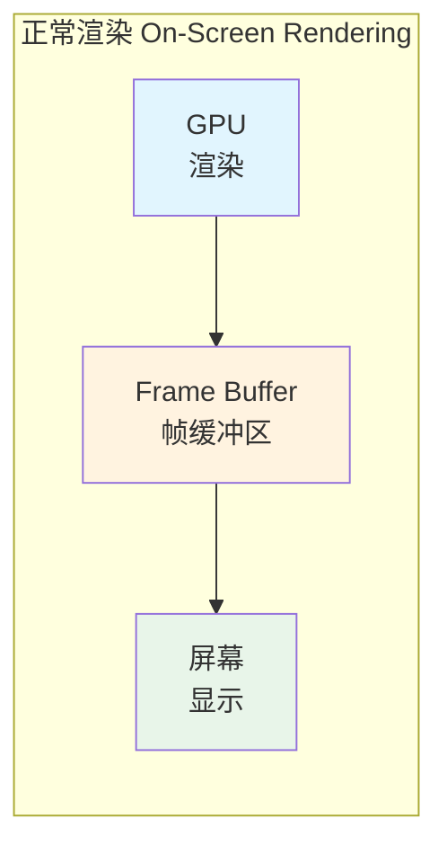
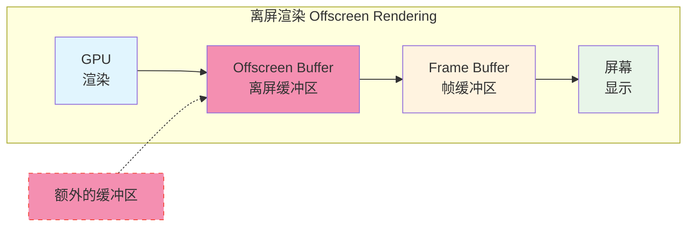
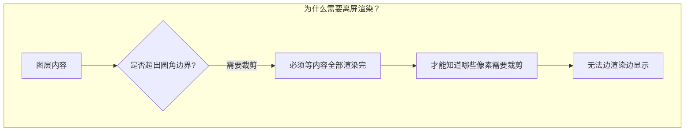
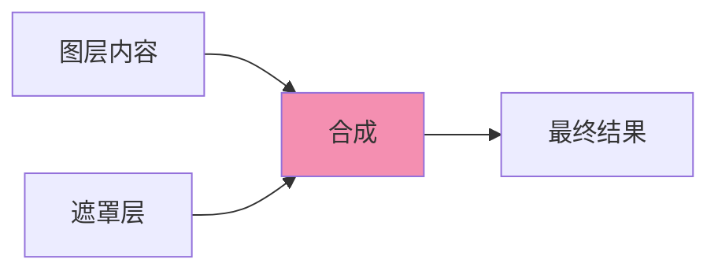
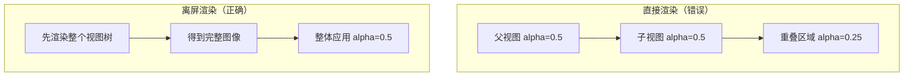

+++
title = "卡顿-离屏渲染"
date = '2026-05-02T22:32:27+08:00'
draft = false
weight = 30
tags = ["iOS", "性能优化", "卡顿"]
categories = ["iOS开发", "性能优化"]
+++
离屏渲染（Offscreen Rendering）是GPU渲染中的性能杀手。本文介绍离屏渲染的原理、触发条件以及优化方案。

---

## 什么是离屏渲染

### 正常渲染流程

正常情况下，GPU直接将渲染结果写入帧缓冲区（Frame Buffer）：



**特点：**
- 直接渲染到帧缓冲区
- 渲染完成即可显示
- 效率最高

### 离屏渲染流程

离屏渲染需要先渲染到离屏缓冲区，再合成到帧缓冲区：



**性能开销：**
1. 创建离屏缓冲区（内存开销）
2. 渲染到离屏缓冲区
3. 上下文切换
4. 从离屏缓冲区合成到帧缓冲区

### 为什么离屏渲染慢

| 开销类型 | 说明 |
|---------|------|
| 内存开销 | 需要额外的离屏缓冲区 |
| 上下文切换 | GPU需要在不同渲染目标间切换 |
| 合成开销 | 需要将离屏缓冲区内容复制到帧缓冲区 |
| 无法流水线 | 打断GPU的渲染流水线 |

---

## 触发离屏渲染的条件

### 常见触发条件

| 操作 | 说明 |
|-----|------|
| cornerRadius + masksToBounds | 最常见的触发条件 |
| shadow（阴影） | 需要知道内容边界 |
| mask（遮罩） | 需要额外的遮罩层 |
| group opacity | 需要先渲染整组 |
| shouldRasterize | 主动触发光栅化 |
| 毛玻璃效果 | UIBlurEffect |

### 为什么会触发离屏渲染

离屏渲染的本质是：**GPU无法一次性完成渲染，需要先把中间结果保存起来，等其他内容渲染完后再进行合成**。

#### 1. cornerRadius + masksToBounds



- GPU的渲染是**逐像素**进行的，采用**画家算法**（从后往前逐层绘制）
- 设置圆角裁剪后，GPU需要知道**所有图层的最终合成结果**，才能判断哪些像素在圆角外需要被裁掉
- 因此必须先渲染到离屏缓冲区，完成后再进行裁剪

#### 2. shadow（阴影）

- 阴影是根据图层内容的**轮廓**生成的
- GPU必须先渲染出完整的图层内容，才能计算出阴影的形状
- 如果不指定`shadowPath`，系统需要遍历所有像素来确定轮廓，这就需要离屏缓冲区

```swift
// 触发离屏渲染：系统不知道阴影形状
view.layer.shadowOpacity = 0.5

// 不触发离屏渲染：明确告诉系统阴影形状
view.layer.shadowPath = UIBezierPath(rect: bounds).cgPath
```

#### 3. mask（遮罩）



- 遮罩需要将**两个图层进行像素级别的运算**（遮罩层的alpha值决定内容层的可见性）
- GPU必须先分别渲染内容层和遮罩层，然后再进行合成
- 这种"先渲染、后合成"的操作必须借助离屏缓冲区

#### 4. group opacity（组透明度）

当父视图设置透明度且有子视图时：



- 如果直接渲染，父子视图重叠的地方会**叠加透明度**，导致显示异常
- 正确做法是先将整个视图树渲染成一张图，再整体应用透明度
- 这需要离屏缓冲区来保存中间结果

#### 5. shouldRasterize（光栅化）

- 这是**主动触发**的离屏渲染
- 将复杂图层渲染成位图缓存，后续直接使用缓存
- 适用于内容不变的复杂视图，避免重复渲染

#### 6. 毛玻璃效果（UIBlurEffect）

- 毛玻璃需要**获取背后的内容**进行模糊处理
- 必须先渲染出背景内容，才能对其进行高斯模糊
- 这是一个典型的"需要读取已渲染内容"的场景，必须使用离屏缓冲区

### 检测离屏渲染

使用Simulator的Debug选项：

```plaintext
Simulator → Debug → Color Off-screen Rendered

黄色区域 = 离屏渲染
```

或使用Instruments的Core Animation工具：

```plaintext
Instruments → Core Animation → Debug Options
勾选 "Color Offscreen-Rendered Yellow"
```

---

## 圆角优化

### 问题代码

```swift
// 触发离屏渲染
imageView.layer.cornerRadius = 10
imageView.layer.masksToBounds = true  // 或 clipsToBounds = true
```

### 优化方案1：不设置masksToBounds（推荐）

只设置`cornerRadius`而不设置`masksToBounds`，圆角仅作用于图层自身的`backgroundColor`和`border`，不会裁剪`contents`和子图层，因此**不会触发离屏渲染**。只有当同时设置`masksToBounds = true`（需要裁剪子内容到圆角边界）时才会触发：

```swift
// ✅ 不触发离屏渲染
view.layer.cornerRadius = 10
view.backgroundColor = .white
// 不设置 masksToBounds = true

// ❌ 触发离屏渲染
view.layer.cornerRadius = 10
view.layer.masksToBounds = true  // 加了这行就会触发
```

适用场景（不需要裁剪子内容时）：
- 纯色背景的UIView、UIButton、UILabel等控件设置背景圆角
- 不介意子图层或contents溢出圆角边界的视图

### 优化方案2：使用云服务裁剪（推荐）

对于网络图片，最优方案是**让服务端或云服务处理圆角**，客户端直接显示：

```swift
// 以阿里云OSS为例，在URL后添加图片处理参数
let originalURL = "https://example.oss-cn-hangzhou.aliyuncs.com/image.jpg"

// 裁剪为200x200的圆角图片，圆角半径20
let processedURL = originalURL + "?x-oss-process=image/rounded-corners,r_20/resize,w_200,h_200"

// 直接加载处理后的图片，无需客户端裁剪
imageView.sd_setImage(with: URL(string: processedURL))
```

优势：
- **零GPU开销**：图片已经是圆角，直接渲染
- **减少CPU计算**：无需客户端处理
- **可缓存**：CDN缓存处理后的图片
- **统一管理**：服务端统一控制圆角大小

### 优化方案3：CPU预处理圆角（贝塞尔路径裁剪）

使用Core Graphics在CPU端预先处理圆角，生成一张已经是圆角的图片，然后直接显示。

- 这种方式是在**CPU端**使用Core Graphics绘制，不涉及GPU的离屏缓冲区
- 最终生成的是一张**已经带圆角的位图**，GPU只需要直接渲染这张图片
- 相当于把"裁剪"这个操作从GPU渲染阶段提前到了CPU图片处理阶段

**劣势：**
- 增加CPU开销，需要在后台线程处理
- 需要额外的内存存储处理后的图片
- 图片尺寸变化时需要重新处理

```swift
extension UIImage {
    
    func roundedImage(radius: CGFloat) -> UIImage? {
        let rect = CGRect(origin: .zero, size: size)
        let renderer = UIGraphicsImageRenderer(size: size)
        return renderer.image { _ in
            let path = UIBezierPath(roundedRect: rect, cornerRadius: radius)
            path.addClip()
            draw(in: rect)
        }
    }
}

// 使用：在后台线程处理，避免阻塞主线程
DispatchQueue.global(qos: .userInitiated).async {
    let rounded = originalImage.roundedImage(radius: 10)
    DispatchQueue.main.async {
        imageView.image = rounded
    }
}
```

### 优化方案4：封装RoundedImageView组件

将圆角处理封装成组件，自动在后台处理圆角，对外提供简单的接口。

```swift
class RoundedImageView: UIImageView {
    
    private var cornerRadiusValue: CGFloat = 0
    private var processedImage: UIImage?
    
    var cornerRadiusCustom: CGFloat {
        get { cornerRadiusValue }
        set {
            cornerRadiusValue = newValue
            updateRoundedImage()
        }
    }
    
    override var image: UIImage? {
        didSet {
            updateRoundedImage()
        }
    }
    
    private func updateRoundedImage() {
        guard let originalImage = super.image, cornerRadiusValue > 0 else {
            return
        }
        
        // 异步处理圆角
        DispatchQueue.global(qos: .userInitiated).async { [weak self] in
            guard let self = self else { return }
            
            let rounded = self.createRoundedImage(originalImage, radius: self.cornerRadiusValue)
            
            DispatchQueue.main.async {
                // 直接设置处理后的图片，不触发离屏渲染
                super.image = rounded
            }
        }
    }
    
    private func createRoundedImage(_ image: UIImage, radius: CGFloat) -> UIImage? {
        let size = bounds.size
        guard size.width > 0, size.height > 0 else { return image }
        
        let renderer = UIGraphicsImageRenderer(size: size)
        return renderer.image { context in
            let rect = CGRect(origin: .zero, size: size)
            UIBezierPath(roundedRect: rect, cornerRadius: radius).addClip()
            image.draw(in: rect)
        }
    }
}
```

**优势：**
- 封装完善，使用方便
- 自动异步处理，不阻塞主线程
- 图片变化时自动重新处理

**劣势：**
- 需要维护额外的组件代码
- 异步处理可能导致图片显示有短暂延迟
- 快速滚动时可能出现图片闪烁

---

## 阴影优化

### 问题代码

```swift
// 触发离屏渲染
view.layer.shadowColor = UIColor.black.cgColor
view.layer.shadowOffset = CGSize(width: 0, height: 2)
view.layer.shadowOpacity = 0.3
view.layer.shadowRadius = 4
```

### 优化方案1：指定shadowPath（推荐）

通过指定`shadowPath`，明确告诉系统阴影的形状，避免系统自动计算。

- 不指定`shadowPath`时，系统需要遍历图层的所有像素来确定内容的轮廓，这需要离屏渲染

```swift
// 通过指定shadowPath，避免离屏渲染
view.layer.shadowColor = UIColor.black.cgColor
view.layer.shadowOffset = CGSize(width: 0, height: 2)
view.layer.shadowOpacity = 0.3
view.layer.shadowRadius = 4
view.layer.shadowPath = UIBezierPath(rect: view.bounds).cgPath

// 圆角阴影
view.layer.shadowPath = UIBezierPath(
    roundedRect: view.bounds,
    cornerRadius: 10
).cgPath

// 注意：在layoutSubviews中更新shadowPath
override func layoutSubviews() {
    super.layoutSubviews()
    layer.shadowPath = UIBezierPath(rect: bounds).cgPath
}
```

### 优化方案2：使用阴影图片

使用预先设计好的阴影图片代替实时计算的阴影。

- 阴影图片是静态资源，GPU直接渲染图片，无需任何计算

```swift
class ShadowImageView: UIView {
    
    private let shadowImageView = UIImageView()
    private let contentView = UIView()
    
    override init(frame: CGRect) {
        super.init(frame: frame)
        setup()
    }
    
    required init?(coder: NSCoder) {
        super.init(coder: coder)
        setup()
    }
    
    private func setup() {
        // 阴影图片（可以是9-patch图片）
        shadowImageView.image = UIImage(named: "shadow_background")
        addSubview(shadowImageView)
        
        // 内容视图
        addSubview(contentView)
    }
    
    override func layoutSubviews() {
        super.layoutSubviews()
        
        let shadowInset: CGFloat = 10
        shadowImageView.frame = bounds.insetBy(dx: -shadowInset, dy: -shadowInset)
        contentView.frame = bounds
    }
}
```

---

## 遮罩优化

### 问题代码

```swift
// 触发离屏渲染
let maskLayer = CAShapeLayer()
maskLayer.path = customPath.cgPath
view.layer.mask = maskLayer
```

### 优化方案1：使用预渲染的图片

在CPU端预先将遮罩效果应用到图片中，生成一张已经裁剪好的图片。

- 和圆角优化原理相同，把GPU的遮罩计算转移到CPU端预处理
- 最终显示的是已经处理好的位图，GPU直接渲染即可

**劣势：**
- 增加CPU开销
- 需要额外内存存储处理后的图片
- 不适合遮罩形状动态变化的场景

```swift
// 将遮罩效果预渲染到图片中
func createMaskedImage(image: UIImage, mask: UIBezierPath) -> UIImage? {
    let renderer = UIGraphicsImageRenderer(size: image.size)
    return renderer.image { context in
        mask.addClip()
        image.draw(at: .zero)
    }
}

// 使用
DispatchQueue.global(qos: .userInitiated).async {
    let maskedImage = createMaskedImage(image: originalImage, mask: customPath)
    DispatchQueue.main.async {
        imageView.image = maskedImage
    }
}
```

### 优化方案2：使用blend mode

使用Core Graphics的混合模式在`draw(_:)`方法中实现遮罩效果。

- 在CPU端通过混合模式计算遮罩，不使用`layer.mask`
- 渲染结果是一张处理好的位图

**劣势：**
- 需要重写`draw(_:)`方法，每次重绘都需要CPU计算
- 需要准备单独的遮罩图片
- 不适合频繁更新的场景

```swift
class BlendMaskView: UIView {
    
    var maskImage: UIImage? {
        didSet { setNeedsDisplay() }
    }
    
    var contentImage: UIImage? {
        didSet { setNeedsDisplay() }
    }
    
    override func draw(_ rect: CGRect) {
        guard let content = contentImage, let mask = maskImage else { return }
        
        // 绘制内容
        content.draw(in: rect)
        
        // 使用blend mode应用遮罩
        mask.draw(in: rect, blendMode: .destinationIn, alpha: 1.0)
    }
}
```

---

## shouldRasterize的使用

### 什么是光栅化

`shouldRasterize`会将图层渲染成位图缓存，这是一种**主动触发离屏渲染**的优化手段。

- 开启后，系统会将复杂图层渲染成一张位图并缓存
- 后续渲染直接使用缓存的位图，避免重复计算
- 本质是**用空间换时间**，用一次离屏渲染换取后续多次渲染的性能提升

```swift
view.layer.shouldRasterize = true
view.layer.rasterizationScale = UIScreen.main.scale  // 必须设置，否则Retina屏幕会模糊
```

---

## 透明度优化

### group opacity问题

```swift
// 可能触发离屏渲染
view.alpha = 0.5
view.layer.allowsGroupOpacity = true  // 默认为true
```

当`allowsGroupOpacity`为true时，如果视图有子视图，会触发离屏渲染以正确计算透明度。

### 优化方案1：关闭group opacity

直接关闭`allowsGroupOpacity`，让每个子视图独立计算透明度。

- 系统不需要先渲染整个视图树再统一应用透明度
- 每个子视图独立渲染，避免离屏渲染

### 优化方案2：使用backgroundColor的alpha

将透明度应用到背景色，而不是视图本身。

- 只影响背景色的透明度，不触发group opacity的离屏渲染
- 子视图保持不透明

```swift
view.backgroundColor = UIColor.white.withAlphaComponent(0.5)
view.alpha = 1.0  // 视图本身保持不透明
```

---

## 毛玻璃效果优化

### 问题

```swift
// UIBlurEffect会触发离屏渲染
let blurEffect = UIBlurEffect(style: .light)
let blurView = UIVisualEffectView(effect: blurEffect)
```

毛玻璃效果需要实时获取背景内容并进行高斯模糊，这是一个复杂的GPU操作，必然会触发离屏渲染。

### 优化方案1：使用云服务处理（推荐）

对于网络图片的模糊效果，最优方案是让云服务处理，客户端直接显示已模糊的图片。

- 云服务在服务端完成高斯模糊处理
- 客户端直接加载已模糊的图片，无需任何GPU计算
- 可以结合CDN缓存，多次请求直接命中缓存

```swift
// 以阿里云OSS为例
let originalURL = "https://example.oss-cn-hangzhou.aliyuncs.com/background.jpg"

// 添加高斯模糊参数，模糊半径50，sigma值50
let blurredURL = originalURL + "?x-oss-process=image/blur,r_50,s_50"

// 直接加载已模糊的图片
backgroundImageView.sd_setImage(with: URL(string: blurredURL))
```

适用场景：
- 背景图片来自网络
- 模糊效果固定，不需要实时变化
- 需要高性能的列表场景

### 优化方案2：使用静态模糊图片

如果背景内容不变，可以预先生成模糊图片，用静态图片代替实时模糊。

- 将背景截图后应用Core Image的高斯模糊滤镜
- 生成的静态图片直接显示，无需实时计算

```swift
func createBlurredImage(from view: UIView, radius: CGFloat = 10) -> UIImage? {
    // 截图
    let renderer = UIGraphicsImageRenderer(size: view.bounds.size)
    let snapshot = renderer.image { context in
        view.drawHierarchy(in: view.bounds, afterScreenUpdates: false)
    }
    
    // 应用高斯模糊
    guard let ciImage = CIImage(image: snapshot),
          let filter = CIFilter(name: "CIGaussianBlur") else { return nil }
    
    filter.setValue(ciImage, forKey: kCIInputImageKey)
    filter.setValue(radius, forKey: kCIInputRadiusKey)
    
    guard let outputImage = filter.outputImage else { return nil }
    
    let context = CIContext()
    guard let cgImage = context.createCGImage(outputImage, from: ciImage.extent) else {
        return nil
    }
    
    return UIImage(cgImage: cgImage)
}

// 使用
DispatchQueue.global(qos: .userInitiated).async {
    let blurredImage = createBlurredImage(from: backgroundView)
    DispatchQueue.main.async {
        blurImageView.image = blurredImage
    }
}
```

### 优化方案3：降低模糊区域大小

如果必须使用实时模糊，可以通过降低模糊区域的分辨率来减少计算量。

- 先将背景缩小，应用模糊后再放大
- 模糊效果本身会隐藏细节，所以缩小后的效果差异不大
- 仍然会触发离屏渲染，只是降低了计算量
- 可能有轻微的画质损失

```swift
func createOptimizedBlurredImage(from view: UIView, scale: CGFloat = 0.5) -> UIImage? {
    // 缩小尺寸截图
    let smallSize = CGSize(width: view.bounds.width * scale, 
                           height: view.bounds.height * scale)
    
    let renderer = UIGraphicsImageRenderer(size: smallSize)
    let snapshot = renderer.image { context in
        view.drawHierarchy(in: CGRect(origin: .zero, size: smallSize), 
                          afterScreenUpdates: false)
    }
    
    // 应用模糊（因为图片更小，模糊计算更快）
    guard let ciImage = CIImage(image: snapshot),
          let filter = CIFilter(name: "CIGaussianBlur") else { return nil }
    
    filter.setValue(ciImage, forKey: kCIInputImageKey)
    filter.setValue(5, forKey: kCIInputRadiusKey)  // 缩小后模糊半径也可以减小
    
    guard let outputImage = filter.outputImage else { return nil }
    
    let context = CIContext()
    guard let cgImage = context.createCGImage(outputImage, from: ciImage.extent) else {
        return nil
    }
    
    return UIImage(cgImage: cgImage)
}
```

### 优化方案4：控制UIVisualEffectView的使用范围

如果必须使用`UIVisualEffectView`，尽量控制其大小和数量。

- 无法完全避免离屏渲染
- 只能减轻性能影响，不能根本解决问题

```swift
// ❌ 避免：全屏毛玻璃
let fullscreenBlur = UIVisualEffectView(effect: UIBlurEffect(style: .light))
fullscreenBlur.frame = view.bounds

// ✅ 推荐：只在必要区域使用
let smallBlur = UIVisualEffectView(effect: UIBlurEffect(style: .light))
smallBlur.frame = CGRect(x: 0, y: 0, width: 200, height: 100)  // 尽量小的区域
```

---

## 离屏渲染检测工具

### 运行时检测

```swift
class OffscreenRenderDetector {
    
    static func detectOffscreenRendering(in view: UIView) -> [UIView] {
        var offscreenViews: [UIView] = []
        
        checkView(view, result: &offscreenViews)
        
        return offscreenViews
    }
    
    private static func checkView(_ view: UIView, result: inout [UIView]) {
        if isOffscreenRendering(view) {
            result.append(view)
        }
        
        for subview in view.subviews {
            checkView(subview, result: &result)
        }
    }
    
    private static func isOffscreenRendering(_ view: UIView) -> Bool {
        let layer = view.layer
        
        // 检查圆角+裁剪
        if layer.cornerRadius > 0 && layer.masksToBounds {
            // 如果有背景色且没有内容，可能不会触发
            if view.backgroundColor == nil || layer.contents != nil {
                return true
            }
        }
        
        // 检查阴影（没有shadowPath）
        if layer.shadowOpacity > 0 && layer.shadowPath == nil {
            return true
        }
        
        // 检查遮罩
        if layer.mask != nil {
            return true
        }
        
        // 检查光栅化
        if layer.shouldRasterize {
            return true  // 主动触发的离屏渲染
        }
        
        return false
    }
}

// 使用
#if DEBUG
extension UIViewController {
    
    func checkOffscreenRendering() {
        let offscreenViews = OffscreenRenderDetector.detectOffscreenRendering(in: view)
        
        for view in offscreenViews {
            print("Offscreen rendering detected: \(type(of: view))")
            view.layer.borderColor = UIColor.yellow.cgColor
            view.layer.borderWidth = 2
        }
    }
}
#endif
```
