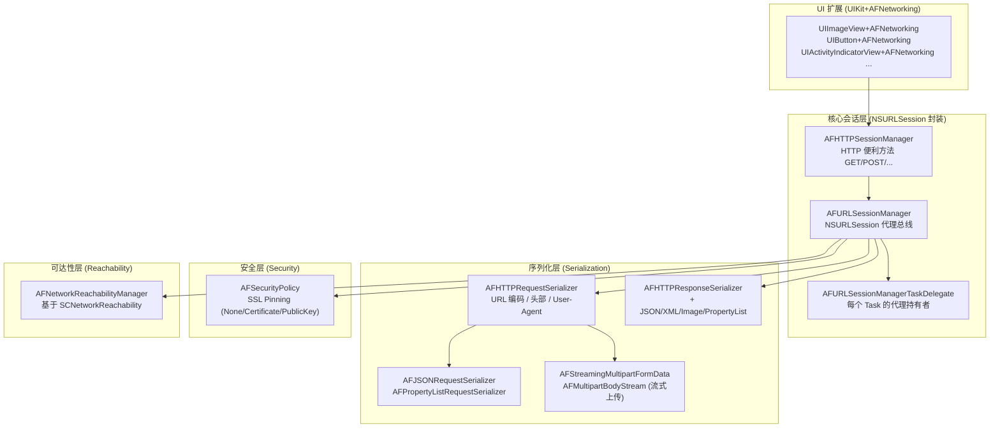
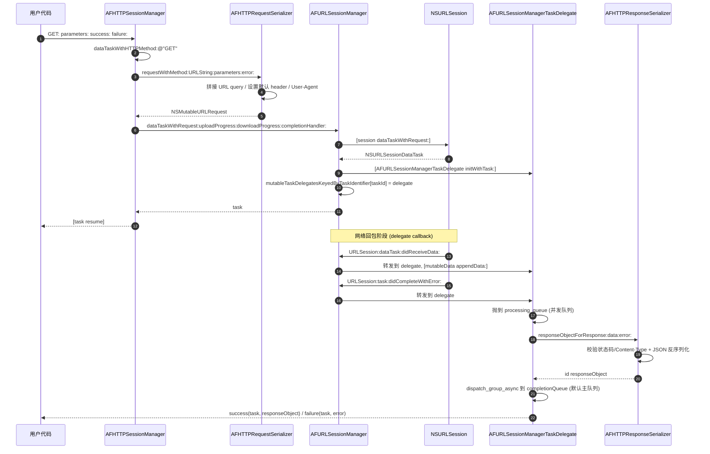
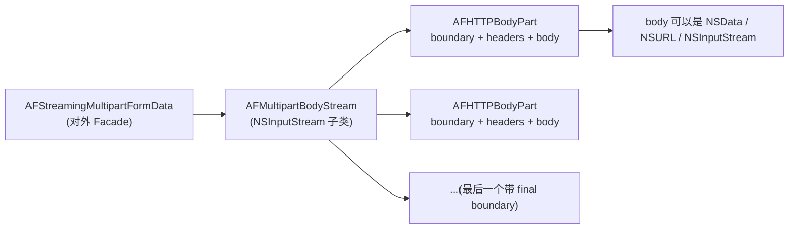
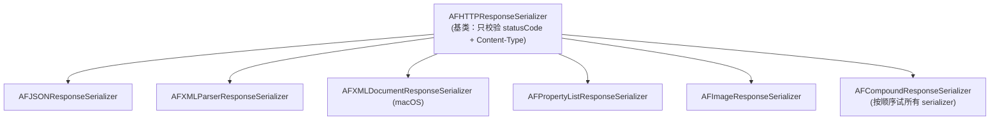
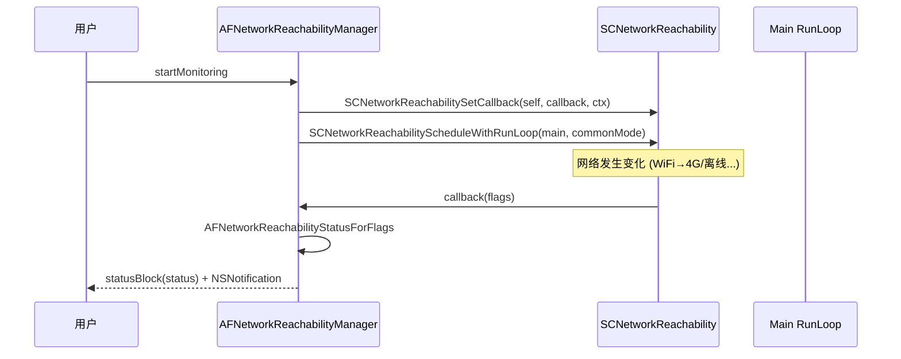
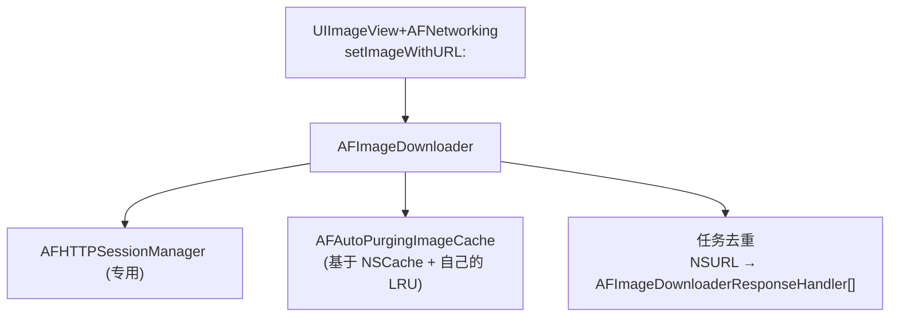

+++
title = "AFNetworking 源码导读"
date = '2026-05-02T22:32:27+08:00'
draft = false
weight = 1
tags = ["iOS", "源码分析"]
categories = ["iOS开发", "源码分析"]
+++
> 本文基于 **AFNetworking 4.0.1**（2020 年发布，仓库最后一次迭代）源码进行分析。AFNetworking 虽然已进入"稳定休眠"状态，但它作为 iOS 网络层的教科书级实现，其 `NSURLSession` 封装、HTTPS 校验、Multipart 流式上传、Method Swizzling 等设计思路至今仍值得每一位 iOS 工程师学习。源码仓库：[AFNetworking/AFNetworking](https://github.com/AFNetworking/AFNetworking)。

---

## 一、整体架构

AFNetworking 的整个库只有 **7 个核心类**，按职责划分为"核心会话"、"序列化"、"安全"、"可达性"、"UIKit 扩展"五个子模块（对应 CocoaPods Subspec 拆分）：



**源码目录一览**（`AFNetworking 4.0.1`）：

```text
AFNetworking/
├── AFNetworking.h                      # 顶层伞头
├── AFCompatibilityMacros.h             # API 可用性宏
├── AFURLSessionManager.{h,m}           # 核心：NSURLSession 代理总线 (1274 行)
├── AFHTTPSessionManager.{h,m}          # 封装 GET/POST/PUT/DELETE...
├── AFURLRequestSerialization.{h,m}     # 请求序列化 (1398 行)
├── AFURLResponseSerialization.{h,m}    # 响应序列化
├── AFSecurityPolicy.{h,m}              # HTTPS 证书校验 (~350 行)
└── AFNetworkReachabilityManager.{h,m}  # 网络可达性监控

UIKit+AFNetworking/                     # iOS/tvOS 专用扩展
├── AFAutoPurgingImageCache.{h,m}
├── AFImageDownloader.{h,m}
├── AFNetworkActivityIndicatorManager.{h,m}
├── UIImageView+AFNetworking.{h,m}
├── UIButton+AFNetworking.{h,m}
├── UIActivityIndicatorView+AFNetworking.{h,m}
├── UIProgressView+AFNetworking.{h,m}
├── UIRefreshControl+AFNetworking.{h,m}
└── WKWebView+AFNetworking.{h,m}
```

**一个经验判断**：几乎所有"通过 AF 发出去的请求"都会经过 `AFHTTPSessionManager` → `AFURLSessionManager` → `NSURLSession` 这条路径；而"AF 的代理回调"则沿着相反方向，从 `NSURLSession` 先到 `AFURLSessionManager`，再分发到每个 Task 对应的 `AFURLSessionManagerTaskDelegate`，最后把结果投递到用户的 `success`/`failure` block。

---

## 二、一次 GET 请求的完整时序

先把最常见的 `[manager GET:@"/api/user" parameters:@{@"id":@1} headers:nil progress:nil success:^(...) {...} failure:^(...) {...}]` 拆成时序图，后面每一节都围绕这张图展开：



把这张图刻在脑子里，后面读代码就不会迷路。

---

## 三、AFURLSessionManager：整个库的心脏

`AFURLSessionManager` 是对 `NSURLSession` 四大代理协议的统一封装，负责把"session 级别的代理回调"分发给"每个 task 各自的 delegate"。

### 3.1 初始化与会话创建

```objc
// AFURLSessionManager.m
- (instancetype)initWithSessionConfiguration:(NSURLSessionConfiguration *)configuration {
    self = [super init];
    if (!self) { return nil; }

    if (!configuration) {
        configuration = [NSURLSessionConfiguration defaultSessionConfiguration];
    }

    self.sessionConfiguration = configuration;

    self.operationQueue = [[NSOperationQueue alloc] init];
    self.operationQueue.maxConcurrentOperationCount = 1;   // ← 串行代理队列

    self.responseSerializer = [AFJSONResponseSerializer serializer];
    self.securityPolicy     = [AFSecurityPolicy defaultPolicy];

#if !TARGET_OS_WATCH
    self.reachabilityManager = [AFNetworkReachabilityManager sharedManager];
#endif

    self.mutableTaskDelegatesKeyedByTaskIdentifier = [[NSMutableDictionary alloc] init];
    self.lock      = [[NSLock alloc] init];
    self.lock.name = AFURLSessionManagerLockName;

    [self.session getTasksWithCompletionHandler:^(NSArray *dataTasks, NSArray *uploadTasks, NSArray *downloadTasks) {
        // 对于 Background Session，接管已存在的 task
        for (NSURLSessionDataTask *task in dataTasks) { [self addDelegateForDataTask:task uploadProgress:nil downloadProgress:nil completionHandler:nil]; }
        for (NSURLSessionUploadTask *uploadTask in uploadTasks) { [self addDelegateForUploadTask:uploadTask progress:nil completionHandler:nil]; }
        for (NSURLSessionDownloadTask *downloadTask in downloadTasks) { [self addDelegateForDownloadTask:downloadTask progress:nil destination:nil completionHandler:nil]; }
    }];

    return self;
}
```

三个容易被忽略的关键设计：

1. **`operationQueue.maxConcurrentOperationCount = 1`**：session 级别的代理回调被串行化。原因在 Apple 文档里写得很清楚：NSURLSession 的代理方法本身是线程不安全的，串行队列能保证 `mutableTaskDelegatesKeyedByTaskIdentifier` 的读写顺序与回调顺序一致。
2. **`mutableTaskDelegatesKeyedByTaskIdentifier` + `NSLock`**：用 `task.taskIdentifier`（`NSUInteger`）做 key，映射到每个 Task 自己的 `AFURLSessionManagerTaskDelegate`。之所以不用 `NSMapTable` 弱引用 task，是为了让 delegate 的生命周期显式可控（task 还在运行时 delegate 必须存活）。
3. **延迟创建 `NSURLSession`**：

   ```objc
   - (NSURLSession *)session {
       @synchronized (self) {
           if (!_session) {
               _session = [NSURLSession sessionWithConfiguration:self.sessionConfiguration
                                                        delegate:self
                                                   delegateQueue:self.operationQueue];
           }
       }
       return _session;
   }
   ```

   `NSURLSession` 创建时会**强持有 delegate**（也就是 manager 自己），只能通过 `invalidateAndCancel` 或 `finishTasksAndInvalidate` 打破。AFNetworking 把 session 做成 lazy 初始化，既避免了未使用时的资源占用，也让 `invalidateSessionCancelingTasks:resetSession:` 可以把 `_session` 重置为 nil 后重建。

### 3.2 `AFURLSessionManagerTaskDelegate`：每个 Task 的"私人秘书"

为什么要为每个 task 做一个独立的 delegate 对象？因为 `NSURLSession` 的代理方法是 **session 级别** 的，所有 task 共用一个 delegate，但用户的 `progress`/`completionHandler` block 却是 **task 级别** 的。AFNetworking 用一个 per-task delegate 对象来承接这些状态：

```objc
// AFURLSessionManager.m
@interface AFURLSessionManagerTaskDelegate : NSObject <NSURLSessionTaskDelegate,
                                                       NSURLSessionDataDelegate,
                                                       NSURLSessionDownloadDelegate>
@property (nonatomic, weak)   AFURLSessionManager *manager;
@property (nonatomic, strong) NSMutableData       *mutableData;            // 累积 data 响应
@property (nonatomic, strong) NSProgress          *uploadProgress;
@property (nonatomic, strong) NSProgress          *downloadProgress;
@property (nonatomic, copy)   NSURL               *downloadFileURL;
#if AF_CAN_INCLUDE_SESSION_TASK_METRICS
@property (nonatomic, strong) NSURLSessionTaskMetrics *sessionTaskMetrics;
#endif
@property (nonatomic, copy) AFURLSessionDownloadTaskDidFinishDownloadingBlock downloadTaskDidFinishDownloading;
@property (nonatomic, copy) AFURLSessionTaskProgressBlock uploadProgressBlock;
@property (nonatomic, copy) AFURLSessionTaskProgressBlock downloadProgressBlock;
@property (nonatomic, copy) AFURLSessionTaskCompletionHandler completionHandler;
@end
```

初始化时 task 与 progress 的关联极其精巧——**`NSProgress` 本身就是 AFNetworking 暴露给用户的进度对象**，它的取消/暂停直接联动 task：

```objc
// AFURLSessionManager.m
- (instancetype)initWithTask:(NSURLSessionTask *)task {
    self = [super init];
    _mutableData      = [NSMutableData data];
    _uploadProgress   = [[NSProgress alloc] initWithParent:nil userInfo:nil];
    _downloadProgress = [[NSProgress alloc] initWithParent:nil userInfo:nil];

    __weak __typeof__(task) weakTask = task;
    for (NSProgress *progress in @[ _uploadProgress, _downloadProgress ]) {
        progress.totalUnitCount      = NSURLSessionTransferSizeUnknown;
        progress.cancellable         = YES;
        progress.cancellationHandler = ^{ [weakTask cancel];   };  // ← 用户取消进度 → 取消 task
        progress.pausable            = YES;
        progress.pausingHandler      = ^{ [weakTask suspend];  };
        if (@available(macOS 10.11, *)) {
            progress.resumingHandler = ^{ [weakTask resume];   };
        }
        [progress addObserver:self
                   forKeyPath:NSStringFromSelector(@selector(fractionCompleted))
                      options:NSKeyValueObservingOptionNew
                      context:NULL];
    }
    return self;
}
```

KVO 监听 `fractionCompleted` 是为了在进度变化时回调用户的 `progressBlock`：

```objc
- (void)observeValueForKeyPath:(NSString *)keyPath ofObject:(id)object change:(NSDictionary *)change context:(void *)context {
    if ([object isEqual:self.downloadProgress]) {
        if (self.downloadProgressBlock) { self.downloadProgressBlock(object); }
    } else if ([object isEqual:self.uploadProgress]) {
        if (self.uploadProgressBlock) { self.uploadProgressBlock(object); }
    }
}
```

### 3.3 代理方法分发：`respondsToSelector:` 的妙用

`AFURLSessionManager` 遵守 `NSURLSessionDataDelegate`/`NSURLSessionDownloadDelegate` 等多个协议，按理说所有方法都会被系统调用。但 AFNetworking 只希望"用户设置了对应 block 的代理方法"才真正触发回调——靠的是在 `respondsToSelector:` 里做**动态**判断：

```objc
// AFURLSessionManager.m
- (BOOL)respondsToSelector:(SEL)selector {
    if (selector == @selector(URLSession:didReceiveChallenge:completionHandler:)) {
        return self.sessionDidReceiveAuthenticationChallenge != nil;
    } else if (selector == @selector(URLSession:task:willPerformHTTPRedirection:newRequest:completionHandler:)) {
        return self.taskWillPerformHTTPRedirection != nil;
    } else if (selector == @selector(URLSession:dataTask:didReceiveResponse:completionHandler:)) {
        return self.dataTaskDidReceiveResponse != nil;
    } else if (selector == @selector(URLSession:dataTask:willCacheResponse:completionHandler:)) {
        return self.dataTaskWillCacheResponse != nil;
    }
    ...
    return [[self class] instancesRespondToSelector:selector];
}
```

**为什么要这么做？** 因为 `NSURLSession` 会在创建时检测 delegate 实现了哪些方法；如果实现了 `URLSession:dataTask:willCacheResponse:completionHandler:`，系统就会调用这个方法而跳过默认的缓存策略（即使你在里面只是简单透传 `proposedResponse`，也会改变默认行为）。AFNetworking 通过"`block == nil` 时假装不响应这个 selector"，把选择权完全交还给用户。

### 3.4 核心方法：`URLSession:task:didCompleteWithError:`

这是整个生命周期里最关键的方法。Session 回调过来之后，AFURLSessionManager 先把它转发给对应的 task delegate，由后者做真正的善后：

```objc
// AFURLSessionManagerTaskDelegate in AFURLSessionManager.m
- (void)URLSession:(__unused NSURLSession *)session
              task:(NSURLSessionTask *)task
didCompleteWithError:(NSError *)error
{
    error = objc_getAssociatedObject(task, AuthenticationChallengeErrorKey) ?: error;
    __strong AFURLSessionManager *manager = self.manager;

    __block id responseObject = nil;
    NSMutableDictionary *userInfo = [NSMutableDictionary dictionary];
    userInfo[AFNetworkingTaskDidCompleteResponseSerializerKey] = manager.responseSerializer;

    NSData *data = nil;
    if (self.mutableData) {
        data = [self.mutableData copy];
        self.mutableData = nil;  // 提前释放 (#2672 的性能优化)
    }

    if (self.downloadFileURL) {
        userInfo[AFNetworkingTaskDidCompleteAssetPathKey] = self.downloadFileURL;
    } else if (data) {
        userInfo[AFNetworkingTaskDidCompleteResponseDataKey] = data;
    }

    if (error) {
        userInfo[AFNetworkingTaskDidCompleteErrorKey] = error;
        dispatch_group_async(manager.completionGroup ?: url_session_manager_completion_group(),
                             manager.completionQueue ?: dispatch_get_main_queue(), ^{
            if (self.completionHandler) { self.completionHandler(task.response, responseObject, error); }
            dispatch_async(dispatch_get_main_queue(), ^{
                [[NSNotificationCenter defaultCenter] postNotificationName:AFNetworkingTaskDidCompleteNotification
                                                                    object:task userInfo:userInfo];
            });
        });
    } else {
        dispatch_async(url_session_manager_processing_queue(), ^{
            NSError *serializationError = nil;
            responseObject = [manager.responseSerializer responseObjectForResponse:task.response
                                                                              data:data
                                                                             error:&serializationError];
            if (self.downloadFileURL) { responseObject = self.downloadFileURL; }

            if (responseObject) { userInfo[AFNetworkingTaskDidCompleteSerializedResponseKey] = responseObject; }
            if (serializationError) { userInfo[AFNetworkingTaskDidCompleteErrorKey] = serializationError; }

            dispatch_group_async(manager.completionGroup ?: url_session_manager_completion_group(),
                                 manager.completionQueue ?: dispatch_get_main_queue(), ^{
                if (self.completionHandler) { self.completionHandler(task.response, responseObject, serializationError); }
                dispatch_async(dispatch_get_main_queue(), ^{
                    [[NSNotificationCenter defaultCenter] postNotificationName:AFNetworkingTaskDidCompleteNotification
                                                                        object:task userInfo:userInfo];
                });
            });
        });
    }
}
```

这段代码里藏着三个**教科书级**的并发设计：

1. **反序列化在并发队列上做**：`url_session_manager_processing_queue()` 是一个 `DISPATCH_QUEUE_CONCURRENT` 队列，多个请求的 JSON 解析可以并行进行，避开主线程。
2. **完成回调统一用 `dispatch_group_async`**：这让外部可以通过 `manager.completionGroup` 注入一个 group，`dispatch_group_notify` 等所有请求结束再做整体处理（例如批量下载完成后刷新 UI）。
3. **通知一定要投回主线程**：`AFNetworkingTaskDidCompleteNotification` 的监听者可能会直接动 UI，这里显式 `dispatch_async(dispatch_get_main_queue(), ...)` 就是防止监听者踩线程。

这两个 dispatch 队列的定义也很值得一看：

```objc
static dispatch_queue_t url_session_manager_processing_queue() {
    static dispatch_queue_t q;
    static dispatch_once_t onceToken;
    dispatch_once(&onceToken, ^{
        q = dispatch_queue_create("com.alamofire.networking.session.manager.processing", DISPATCH_QUEUE_CONCURRENT);
    });
    return q;
}

static dispatch_group_t url_session_manager_completion_group() {
    static dispatch_group_t g;
    static dispatch_once_t onceToken;
    dispatch_once(&onceToken, ^{ g = dispatch_group_create(); });
    return g;
}
```

两个单例，整个进程共享，避免频繁创建队列带来的开销。

### 3.5 `NSURLSessionTask` 的 resume/suspend 通知：Method Swizzling 奇技

AFNetworking 在外部暴露了两个通知：

```objc
FOUNDATION_EXPORT NSString * const AFNetworkingTaskDidResumeNotification;
FOUNDATION_EXPORT NSString * const AFNetworkingTaskDidSuspendNotification;
```

想法很简单：让业务能观察到"某个 task 被 resume/suspend 了"。但 Apple 没有提供代理方法回调这两个动作，只能在 `[task resume]` 时手动 hook。问题是：**`NSURLSessionTask` 是 class cluster**，`[task class]` 返回的是私有子类（`__NSCFLocalDataTask` → `__NSCFLocalSessionTask` → `NSURLSessionTask`），在 iOS 7 和 iOS 8 上类继承链还不一样。AFNetworking 用了一段极其巧妙的 swizzling 代码：

```objc
// AFURLSessionManager.m
@implementation _AFURLSessionTaskSwizzling

+ (void)load {
    if (NSClassFromString(@"NSURLSessionTask")) {
        /*
         1) 通过 [session dataTaskWithURL:nil] 拿到一个 __NSCFLocalDataTask 实例
         2) 取出 af_resume 的"原始" IMP
         3) 沿着 currentClass 的继承链往上走
         4) 只要 currentClass 的 resume IMP 和 superclass 不同（即该类真实现了 resume）
            且不等于我们自己提供的 af_resume，就对它做 swizzle
         5) 这样无论 cluster 私有类链条如何变化，最顶层那个实现了 resume 的类一定会被 hook 到
         */
        NSURLSessionConfiguration *configuration = [NSURLSessionConfiguration ephemeralSessionConfiguration];
        NSURLSession *session = [NSURLSession sessionWithConfiguration:configuration];
        NSURLSessionDataTask *localDataTask = [session dataTaskWithURL:nil];
        IMP originalAFResumeIMP = method_getImplementation(class_getInstanceMethod([self class], @selector(af_resume)));
        Class currentClass = [localDataTask class];

        while (class_getInstanceMethod(currentClass, @selector(resume))) {
            Class superClass = [currentClass superclass];
            IMP classResumeIMP      = method_getImplementation(class_getInstanceMethod(currentClass, @selector(resume)));
            IMP superclassResumeIMP = method_getImplementation(class_getInstanceMethod(superClass,  @selector(resume)));
            if (classResumeIMP != superclassResumeIMP &&
                originalAFResumeIMP != classResumeIMP) {
                [self swizzleResumeAndSuspendMethodForClass:currentClass];
            }
            currentClass = [currentClass superclass];
        }
        [localDataTask cancel];
        [session finishTasksAndInvalidate];
    }
}

- (void)af_resume {
    NSURLSessionTaskState state = [self state];
    [self af_resume];   // 调用原 resume (swizzle 后已经交换了 IMP)
    if (state != NSURLSessionTaskStateRunning) {
        [[NSNotificationCenter defaultCenter] postNotificationName:AFNSURLSessionTaskDidResumeNotification object:self];
    }
}
@end
```

> 顺带一提：这段代码在 `AFURLSessionManager.m` 的注释里写了 "⚠️ Trouble Ahead"，作者自己都承认这是最难维护的一段。但它的"沿继承链找真实实现"的思路是解决 class cluster hook 的通用范式，值得背下来。

Manager 接到 `AFNSURLSessionTaskDidResumeNotification` 后，还要做一次"是不是属于本 manager 的 task"的筛选，靠的是 `task.taskDescription`：

```objc
- (NSString *)taskDescriptionForSessionTasks {
    return [NSString stringWithFormat:@"%p", self];    // 用自己的指针地址做标识
}

- (void)taskDidResume:(NSNotification *)notification {
    NSURLSessionTask *task = notification.object;
    if ([task.taskDescription isEqualToString:self.taskDescriptionForSessionTasks]) {
        dispatch_async(dispatch_get_main_queue(), ^{
            [[NSNotificationCenter defaultCenter] postNotificationName:AFNetworkingTaskDidResumeNotification object:task];
        });
    }
}
```

多 manager 并存时也能各自精确转发，不会互相污染。

---

## 四、AFHTTPSessionManager：HTTP 便利方法

`AFHTTPSessionManager` 本身很薄，一共就 300 行左右，只做三件事：**维护 baseURL**、**把 `GET/POST/...` 收敛到 `dataTaskWithHTTPMethod:`**、**在拼 URL 前用 `requestSerializer` 做序列化**。

```objc
// AFHTTPSessionManager.m
- (NSURLSessionDataTask *)dataTaskWithHTTPMethod:(NSString *)method
                                       URLString:(NSString *)URLString
                                      parameters:(nullable id)parameters
                                         headers:(nullable NSDictionary *)headers
                                  uploadProgress:(nullable void (^)(NSProgress *uploadProgress)) uploadProgress
                                downloadProgress:(nullable void (^)(NSProgress *downloadProgress)) downloadProgress
                                         success:(nullable void (^)(NSURLSessionDataTask *task, id _Nullable responseObject))success
                                         failure:(nullable void (^)(NSURLSessionDataTask * _Nullable task, NSError *error))failure
{
    NSError *serializationError = nil;
    NSMutableURLRequest *request = [self.requestSerializer requestWithMethod:method
                                                                   URLString:[[NSURL URLWithString:URLString relativeToURL:self.baseURL] absoluteString]
                                                                  parameters:parameters
                                                                       error:&serializationError];
    for (NSString *headerField in headers.keyEnumerator) {
        [request setValue:headers[headerField] forHTTPHeaderField:headerField];
    }
    if (serializationError) {
        if (failure) {
            dispatch_async(self.completionQueue ?: dispatch_get_main_queue(), ^{ failure(nil, serializationError); });
        }
        return nil;
    }

    __block NSURLSessionDataTask *dataTask = nil;
    dataTask = [self dataTaskWithRequest:request
                          uploadProgress:uploadProgress
                        downloadProgress:downloadProgress
                       completionHandler:^(NSURLResponse * __unused response, id responseObject, NSError *error) {
        if (error) { if (failure) { failure(dataTask, error); } }
        else       { if (success) { success(dataTask, responseObject); } }
    }];
    return dataTask;
}
```

值得注意的一处细节：**`[NSURL URLWithString:URLString relativeToURL:self.baseURL]`** 这个拼接规则不是"字符串拼接"，它遵循 RFC 3986 相对路径解析算法，所以 `baseURL` 必须以 `/` 结尾，否则 `@"v1"` 会被当成"相对于 baseURL 父目录的路径"。`AFHTTPSessionManager` 在 `initWithBaseURL:` 里会强制补一个 `/`：

```objc
- (instancetype)initWithBaseURL:(NSURL *)url sessionConfiguration:(NSURLSessionConfiguration *)configuration {
    self = [super initWithSessionConfiguration:configuration];
    if ([[url path] length] > 0 && ![[url absoluteString] hasSuffix:@"/"]) {
        url = [url URLByAppendingPathComponent:@""];   // ← 补尾斜杠
    }
    self.baseURL = url;
    self.requestSerializer  = [AFHTTPRequestSerializer  serializer];
    self.responseSerializer = [AFJSONResponseSerializer serializer];
    return self;
}
```

还有一个很少被留意到的 **安全卫士**：设置 SSL Pinning 时会校验 baseURL 是否 https，不是就抛异常：

```objc
- (void)setSecurityPolicy:(AFSecurityPolicy *)securityPolicy {
    if (securityPolicy.SSLPinningMode != AFSSLPinningModeNone &&
        ![self.baseURL.scheme isEqualToString:@"https"]) {
        @throw [NSException exceptionWithName:@"Invalid Security Policy"
                                       reason:[NSString stringWithFormat:@"A security policy configured with `%@` can only be applied on a manager with a secure base URL (i.e. https)", pinningMode]
                                     userInfo:nil];
    }
    [super setSecurityPolicy:securityPolicy];
}
```

这是很多"SSL Pinning 配置后还是明文泄露"踩坑的最后一道防线：http 的连接根本不会走证书校验，打开了 Pinning 也没用。

---

## 五、AFURLRequestSerialization：请求序列化的艺术

`AFHTTPRequestSerializer` 是请求序列化的基类，主要做三件事：**构造 URL 参数**、**构造默认头部**、**把 NSURLSessionConfiguration 相关属性透传给 NSMutableURLRequest**。

### 5.1 Query String 参数的"键值树"展开

`AFQueryStringFromParameters({"user": {"id": 1, "name": "li"}, "tags": ["a", "b"]})` 会展开成 `tags[]=a&tags[]=b&user[id]=1&user[name]=li`，核心是递归的 `AFQueryStringPairsFromKeyAndValue`：

```objc
// AFURLRequestSerialization.m
NSArray * AFQueryStringPairsFromKeyAndValue(NSString *key, id value) {
    NSMutableArray *mutableQueryStringComponents = [NSMutableArray array];
    NSSortDescriptor *sortDescriptor = [NSSortDescriptor sortDescriptorWithKey:@"description"
                                                                    ascending:YES
                                                                     selector:@selector(compare:)];
    if ([value isKindOfClass:[NSDictionary class]]) {
        NSDictionary *dictionary = value;
        // 对 key 排序，保证同一入参每次都产出相同的 query string，缓存命中率才稳
        for (id nestedKey in [dictionary.allKeys sortedArrayUsingDescriptors:@[ sortDescriptor ]]) {
            id nestedValue = dictionary[nestedKey];
            if (nestedValue) {
                [mutableQueryStringComponents addObjectsFromArray:
                    AFQueryStringPairsFromKeyAndValue(
                        (key ? [NSString stringWithFormat:@"%@[%@]", key, nestedKey] : nestedKey),
                        nestedValue)];
            }
        }
    } else if ([value isKindOfClass:[NSArray class]]) {
        for (id nestedValue in value) {
            [mutableQueryStringComponents addObjectsFromArray:
                AFQueryStringPairsFromKeyAndValue([NSString stringWithFormat:@"%@[]", key], nestedValue)];
        }
    } else if ([value isKindOfClass:[NSSet class]]) {
        for (id obj in [((NSSet *)value) sortedArrayUsingDescriptors:@[ sortDescriptor ]]) {
            [mutableQueryStringComponents addObjectsFromArray:AFQueryStringPairsFromKeyAndValue(key, obj)];
        }
    } else {
        [mutableQueryStringComponents addObject:[[AFQueryStringPair alloc] initWithField:key value:value]];
    }
    return mutableQueryStringComponents;
}
```

**字典必须排序**这一点非常重要：签名接口（AppSign、HMAC）通常要求参数有序，AFNetworking 对 `NSDictionary` 和 `NSSet` 都做了排序，`NSArray` 保持插入顺序。所以 AF 默认生成的 query string 天然支持确定性签名。

### 5.2 百分号编码与 emoji 切段

`AFPercentEscapedStringFromString` 需要处理一个特殊 bug：Foundation 的 `stringByAddingPercentEncodingWithAllowedCharacters:` 在处理大文本（特别是含 emoji）时会崩溃。AFNetworking 的做法是**分批编码 + 合成字符序列对齐**：

```objc
NSString * AFPercentEscapedStringFromString(NSString *string) {
    static NSString * const kAFCharactersGeneralDelimitersToEncode = @":#[]@";   // 不含 "?" "/"
    static NSString * const kAFCharactersSubDelimitersToEncode     = @"!$&'()*+,;=";

    NSMutableCharacterSet *allowedCharacterSet = [[NSCharacterSet URLQueryAllowedCharacterSet] mutableCopy];
    [allowedCharacterSet removeCharactersInString:
        [kAFCharactersGeneralDelimitersToEncode stringByAppendingString:kAFCharactersSubDelimitersToEncode]];

    static NSUInteger const batchSize = 50;
    NSUInteger index = 0;
    NSMutableString *escaped = @"".mutableCopy;

    while (index < string.length) {
        NSUInteger length = MIN(string.length - index, batchSize);
        NSRange range = NSMakeRange(index, length);
        // ← 关键一步：把 range 对齐到 composed character sequence，
        //   否则 emoji "👴🏻👮🏽" 被切在 UTF-16 surrogate pair 中间，
        //   stringByAddingPercentEncodingWithAllowedCharacters: 会崩溃
        range = [string rangeOfComposedCharacterSequencesForRange:range];
        NSString *substring = [string substringWithRange:range];
        NSString *encoded   = [substring stringByAddingPercentEncodingWithAllowedCharacters:allowedCharacterSet];
        [escaped appendString:encoded];
        index += range.length;
    }
    return escaped;
}
```

> 这个 bug 在 Apple 的 Radar 里已经报了很多年，修复没见动静，AFNetworking 只能选择"自己切段"。下次你在做 URL 编码时被 emoji 坑到崩溃，就知道答案了。

### 5.3 默认头部：Accept-Language 与 User-Agent

```objc
// AFURLRequestSerialization.m : init
NSMutableArray *acceptLanguagesComponents = [NSMutableArray array];
[[NSLocale preferredLanguages] enumerateObjectsUsingBlock:^(id obj, NSUInteger idx, BOOL *stop) {
    float q = 1.0f - (idx * 0.1f);          // q 值随优先级递减
    [acceptLanguagesComponents addObject:[NSString stringWithFormat:@"%@;q=%0.1g", obj, q]];
    *stop = q <= 0.5f;                       // q 掉到 0.5 就截断
}];
[self setValue:[acceptLanguagesComponents componentsJoinedByString:@", "] forHTTPHeaderField:@"Accept-Language"];
```

输出形如 `zh-Hans-CN;q=1, en-CN;q=0.9, zh-Hant-CN;q=0.8, ja-CN;q=0.7`，严格遵守 RFC 2616 Section 14.4 对 q 值（quality value）的定义。

User-Agent 则按平台组装：

```objc
#if TARGET_OS_IOS
userAgent = [NSString stringWithFormat:@"%@/%@ (%@; iOS %@; Scale/%0.2f)", ...];
#elif TARGET_OS_TV
userAgent = [NSString stringWithFormat:@"%@/%@ (%@; tvOS %@; Scale/%0.2f)", ...];
#elif TARGET_OS_WATCH
userAgent = [NSString stringWithFormat:@"%@/%@ (%@; watchOS %@; Scale/%0.2f)", ...];
```

有一个隐藏细节：如果 App 名字含中文（非 ASCII），User-Agent 会用 `CFStringTransform` 做一次**音译转写**，把"微信/8.0.30 (iPhone14,2; iOS 17.0; Scale/3.00)" 转成 "Wei Xin/8.0.30 ..."，因为部分服务器不接受非 ASCII UA：

```objc
if (userAgent && ![userAgent canBeConvertedToEncoding:NSASCIIStringEncoding]) {
    NSMutableString *mutableUserAgent = [userAgent mutableCopy];
    if (CFStringTransform((__bridge CFMutableStringRef)(mutableUserAgent), NULL,
                          (__bridge CFStringRef)@"Any-Latin; Latin-ASCII; [:^ASCII:] Remove", false)) {
        userAgent = mutableUserAgent;
    }
}
```

### 5.4 `requestBySerializingRequest:withParameters:error:`：GET/POST 分叉的关键

序列化器不关心"这个方法是 GET 还是 POST"，而是看**方法是否属于 `HTTPMethodsEncodingParametersInURI` 集合**：

```objc
// AFURLRequestSerialization.m : init 默认配置
self.HTTPMethodsEncodingParametersInURI = [NSSet setWithObjects:@"GET", @"HEAD", @"DELETE", nil];

// requestBySerializingRequest:...
if ([self.HTTPMethodsEncodingParametersInURI containsObject:[[request HTTPMethod] uppercaseString]]) {
    // 拼到 URL 后
    if (query && query.length > 0) {
        mutableRequest.URL = [NSURL URLWithString:[[mutableRequest.URL absoluteString]
            stringByAppendingFormat:mutableRequest.URL.query ? @"&%@" : @"?%@", query]];
    }
} else {
    // 放到 Body，默认 Content-Type = application/x-www-form-urlencoded
    if (!query) { query = @""; }   // #2864: empty string 也是合法的 form-urlencoded
    if (![mutableRequest valueForHTTPHeaderField:@"Content-Type"]) {
        [mutableRequest setValue:@"application/x-www-form-urlencoded" forHTTPHeaderField:@"Content-Type"];
    }
    [mutableRequest setHTTPBody:[query dataUsingEncoding:self.stringEncoding]];
}
```

想把 DELETE 的参数放到 body？把 `@"DELETE"` 从集合里移除即可。这也是为什么 AFNetworking 可以兼容各种奇怪的后端约定。

### 5.5 AFJSONRequestSerializer：最常见的 JSON 编码器

继承自 `AFHTTPRequestSerializer`，只覆盖了 `requestBySerializingRequest:` 这一个方法：

```objc
@implementation AFJSONRequestSerializer
- (NSURLRequest *)requestBySerializingRequest:(NSURLRequest *)request
                              withParameters:(id)parameters
                                       error:(NSError *__autoreleasing *)error
{
    if ([self.HTTPMethodsEncodingParametersInURI containsObject:[[request HTTPMethod] uppercaseString]]) {
        return [super requestBySerializingRequest:request withParameters:parameters error:error];
    }

    NSMutableURLRequest *mutableRequest = [request mutableCopy];
    // ... copy parent's default headers ...
    if (parameters) {
        if (![NSJSONSerialization isValidJSONObject:parameters]) {
            // 报错
        }
        NSData *jsonData = [NSJSONSerialization dataWithJSONObject:parameters
                                                           options:self.writingOptions error:error];
        if (!jsonData) { return nil; }
        if (![mutableRequest valueForHTTPHeaderField:@"Content-Type"]) {
            [mutableRequest setValue:@"application/json" forHTTPHeaderField:@"Content-Type"];
        }
        [mutableRequest setHTTPBody:jsonData];
    }
    return mutableRequest;
}
@end
```

注意 **GET/HEAD/DELETE 会自动回退到父类的 URL query 逻辑**——JSON body 在 GET 里没意义，而且会被大多数服务器丢弃。

---

## 六、AFStreamingMultipartFormData：流式上传的精髓

多部分表单（`multipart/form-data`）是整个 AFNetworking 里**最精巧的模块**，用"流"避免了大文件一次性加载进内存。原理是：把每个 Part 抽象成 `AFHTTPBodyPart`，整体包成一个 `AFMultipartBodyStream`（继承自 `NSInputStream`），系统拉取 body 时一节一节地吐字节。



`AFHTTPBodyPart` 把一个 Part 的读取拆成 **4 个阶段**：initialBoundary → headers → body → finalBoundary，用一个状态机 + `read:maxLength:` 驱动：

```objc
// AFURLRequestSerialization.m
typedef enum {
    AFEncapsulationBoundaryPhase = 1,
    AFHeaderPhase,
    AFBodyPhase,
    AFFinalBoundaryPhase,
} AFHTTPBodyPartReadPhase;

@implementation AFHTTPBodyPart
- (NSInteger)read:(uint8_t *)buffer maxLength:(NSUInteger)length {
    NSInteger totalNumberOfBytesRead = 0;

    if (_phase == AFEncapsulationBoundaryPhase) {
        NSData *encapsulationBoundaryData = [([self hasInitialBoundary]
              ? AFMultipartFormInitialBoundary(self.boundary)
              : AFMultipartFormEncapsulationBoundary(self.boundary))
            dataUsingEncoding:self.stringEncoding];
        totalNumberOfBytesRead += [self readData:encapsulationBoundaryData intoBuffer:&buffer[totalNumberOfBytesRead] maxLength:(length - (NSUInteger)totalNumberOfBytesRead)];
    }
    if (_phase == AFHeaderPhase) {
        NSData *headersData = [[self stringForHeaders] dataUsingEncoding:self.stringEncoding];
        totalNumberOfBytesRead += [self readData:headersData intoBuffer:&buffer[totalNumberOfBytesRead] maxLength:(length - (NSUInteger)totalNumberOfBytesRead)];
    }
    if (_phase == AFBodyPhase) {
        NSInteger numberOfBytesRead = [self.inputStream read:&buffer[totalNumberOfBytesRead] maxLength:(length - (NSUInteger)totalNumberOfBytesRead)];
        if (numberOfBytesRead == -1) { return -1; }
        totalNumberOfBytesRead += numberOfBytesRead;
        if ([self.inputStream streamStatus] >= NSStreamStatusAtEnd) { [self transitionToNextPhase]; }
    }
    if (_phase == AFFinalBoundaryPhase) {
        NSData *closingBoundaryData = ([self hasFinalBoundary]
              ? [AFMultipartFormFinalBoundary(self.boundary) dataUsingEncoding:self.stringEncoding]
              : [NSData data]);
        totalNumberOfBytesRead += [self readData:closingBoundaryData intoBuffer:&buffer[totalNumberOfBytesRead] maxLength:(length - (NSUInteger)totalNumberOfBytesRead)];
    }
    return totalNumberOfBytesRead;
}
@end
```

`AFMultipartBodyStream.read:maxLength:` 则是一个 "顺序轮询 Part" 的循环——谁有数据就读谁：

```objc
- (NSInteger)read:(uint8_t *)buffer maxLength:(NSUInteger)length {
    if ([self streamStatus] == NSStreamStatusClosed) { return 0; }
    NSInteger totalNumberOfBytesRead = 0;
    while ((NSUInteger)totalNumberOfBytesRead < MIN(length, self.numberOfBytesInPacket)) {
        if (!self.currentHTTPBodyPart || ![self.currentHTTPBodyPart hasBytesAvailable]) {
            if (!(self.currentHTTPBodyPart = [self.HTTPBodyPartEnumerator nextObject])) break;
        } else {
            NSUInteger maxLength = MIN(length, self.numberOfBytesInPacket) - (NSUInteger)totalNumberOfBytesRead;
            NSInteger numberOfBytesRead = [self.currentHTTPBodyPart read:&buffer[totalNumberOfBytesRead] maxLength:maxLength];
            if (numberOfBytesRead == -1) return -1;
            totalNumberOfBytesRead += numberOfBytesRead;
            if (self.delay > 0.0f) { [NSThread sleepForTimeInterval:self.delay]; }  // 3G 节流
        }
    }
    return totalNumberOfBytesRead;
}
```

注意 `self.numberOfBytesInPacket` 和 `self.delay` 两个常量：

```objc
NSUInteger   const kAFUploadStream3GSuggestedPacketSize = 1024 * 16;  // 16KB
NSTimeInterval const kAFUploadStream3GSuggestedDelay    = 0.2;
```

用法是这样的：

```objc
- (void)throttleBandwidthWithPacketSize:(NSUInteger)numberOfBytes delay:(NSTimeInterval)delay;
```

在 2012 年的 3G 环境下，这个 API 是为了避免高带宽上传引起基带崩溃（真实存在的 iOS 4 bug）。今天仍然有用——比如**对抗某些运营商 NAT 超时**时，按包切片 + 延迟可以让连接看起来"活着"。

---

## 七、AFURLResponseSerialization：响应校验与解析

响应序列化器有 7 个，形成一条继承链：



基类的"合法状态码范围"约定俗成：**200–299**：

```objc
// AFURLResponseSerialization.m
- (instancetype)init {
    self = [super init];
    self.stringEncoding = NSUTF8StringEncoding;
    self.acceptableStatusCodes = [NSIndexSet indexSetWithIndexesInRange:NSMakeRange(200, 100)];
    self.acceptableContentTypes = nil;   // 基类不校验 Content-Type
    return self;
}
```

`AFJSONResponseSerializer` 默认接受 `application/json`、`text/json`、`text/javascript` 三种 Content-Type。有一个**很常被忽略的特性** `removesKeysWithNullValues`：

```objc
// AFURLResponseSerialization.m
- (id)responseObjectForResponse:(NSURLResponse *)response data:(NSData *)data error:(NSError *__autoreleasing *)error {
    // ... 状态码/Content-Type 校验 ...
    id responseObject = [NSJSONSerialization JSONObjectWithData:data options:self.readingOptions error:&serializationError];
    if (self.removesKeysWithNullValues) {
        responseObject = AFJSONObjectByRemovingKeysWithNullValues(responseObject, self.readingOptions);
    }
    return responseObject;
}
```

打开它以后，服务器返回的 `{"name": null}` 在反序列化后会变成 `{}`（递归剔除所有 `NSNull`），避免了 Model 层对 `NSNull` 的零散判空。

---

## 八、AFSecurityPolicy：HTTPS 证书校验

AFNetworking 支持三种 SSL Pinning 模式：

| 模式 | 含义 | 使用场景 |
| --- | --- | --- |
| `AFSSLPinningModeNone` | 不做 Pinning，只做系统默认的 CA 校验 | 大部分普通场景 |
| `AFSSLPinningModeCertificate` | 校验服务器证书数据是否在本地"白名单"中 | 自签 / 私有 CA / 证书即将轮换 |
| `AFSSLPinningModePublicKey` | 只对比证书的公钥是否匹配 | 证书会更新但公钥长期不变（最常用） |

核心逻辑在 `evaluateServerTrust:forDomain:`：

```objc
// AFSecurityPolicy.m
- (BOOL)evaluateServerTrust:(SecTrustRef)serverTrust forDomain:(NSString *)domain {
    // 1. 根据 validatesDomainName 决定使用 SSL Policy (校验域名) 还是 BasicX509
    NSMutableArray *policies = [NSMutableArray array];
    if (self.validatesDomainName) {
        [policies addObject:(__bridge_transfer id)SecPolicyCreateSSL(true, (__bridge CFStringRef)domain)];
    } else {
        [policies addObject:(__bridge_transfer id)SecPolicyCreateBasicX509()];
    }
    SecTrustSetPolicies(serverTrust, (__bridge CFArrayRef)policies);

    // 2. 根据 SSLPinningMode 做校验
    if (self.SSLPinningMode == AFSSLPinningModeNone) {
        return self.allowInvalidCertificates || AFServerTrustIsValid(serverTrust);
    } else if (!self.allowInvalidCertificates && !AFServerTrustIsValid(serverTrust)) {
        return NO;
    }

    switch (self.SSLPinningMode) {
        case AFSSLPinningModeCertificate: {
            // 把本地证书设为信任根，再验一次
            NSMutableArray *pinnedCertificates = [NSMutableArray array];
            for (NSData *certificateData in self.pinnedCertificates) {
                [pinnedCertificates addObject:(__bridge_transfer id)SecCertificateCreateWithData(NULL, (__bridge CFDataRef)certificateData)];
            }
            SecTrustSetAnchorCertificates(serverTrust, (__bridge CFArrayRef)pinnedCertificates);
            if (!AFServerTrustIsValid(serverTrust)) { return NO; }

            // 再比对 trust chain 里是否出现了 pinned 证书 (DER 完全匹配)
            NSArray *serverCertificates = AFCertificateTrustChainForServerTrust(serverTrust);
            for (NSData *trustChainCertificate in [serverCertificates reverseObjectEnumerator]) {
                if ([self.pinnedCertificates containsObject:trustChainCertificate]) { return YES; }
            }
            return NO;
        }
        case AFSSLPinningModePublicKey: {
            // 把服务端证书链上的每个公钥都拿出来，与本地 pinned 公钥逐一对比
            NSUInteger trustedPublicKeyCount = 0;
            NSArray *publicKeys = AFPublicKeyTrustChainForServerTrust(serverTrust);
            for (id trustChainPublicKey in publicKeys) {
                for (id pinnedPublicKey in self.pinnedPublicKeys) {
                    if (AFSecKeyIsEqualToKey((__bridge SecKeyRef)trustChainPublicKey, (__bridge SecKeyRef)pinnedPublicKey)) {
                        trustedPublicKeyCount += 1;
                    }
                }
            }
            return trustedPublicKeyCount > 0;
        }
        default: return NO;
    }
}
```

两个要点：

1. **公钥是从证书里"提取"出来的**，不需要单独部署一份 pubkey 文件，`setPinnedCertificates:` setter 会在赋值时自动抽取：

   ```objc
   - (void)setPinnedCertificates:(NSSet *)pinnedCertificates {
       _pinnedCertificates = pinnedCertificates;
       NSMutableSet *mutablePinnedPublicKeys = [NSMutableSet setWithCapacity:[pinnedCertificates count]];
       for (NSData *certificate in pinnedCertificates) {
           id publicKey = AFPublicKeyForCertificate(certificate);
           if (publicKey) { [mutablePinnedPublicKeys addObject:publicKey]; }
       }
       self.pinnedPublicKeys = [NSSet setWithSet:mutablePinnedPublicKeys];
   }
   ```

   所以你只需要把 `.cer` 文件放进 bundle，就可以启用 `PublicKey` 模式。

2. **SecKey 的跨平台相等比较**：iOS 上 `SecKeyRef` 直接 `isEqual:` 可以工作，但 macOS 上不行，得导出成 PEM 数据再比：

   ```objc
   static BOOL AFSecKeyIsEqualToKey(SecKeyRef key1, SecKeyRef key2) {
   #if TARGET_OS_IOS || TARGET_OS_WATCH || TARGET_OS_TV
       return [(__bridge id)key1 isEqual:(__bridge id)key2];
   #else
       return [AFSecKeyGetData(key1) isEqual:AFSecKeyGetData(key2)];
   #endif
   }
   ```

Manager 层的挂载点在 `URLSession:task:didReceiveChallenge:completionHandler:`：

```objc
// AFURLSessionManager.m
if (evaluateServerTrust) {
    if ([self.securityPolicy evaluateServerTrust:challenge.protectionSpace.serverTrust
                                       forDomain:challenge.protectionSpace.host]) {
        disposition = NSURLSessionAuthChallengeUseCredential;
        credential  = [NSURLCredential credentialForTrust:challenge.protectionSpace.serverTrust];
    } else {
        objc_setAssociatedObject(task, AuthenticationChallengeErrorKey,
            [self serverTrustErrorForServerTrust:challenge.protectionSpace.serverTrust url:task.currentRequest.URL],
            OBJC_ASSOCIATION_RETAIN);
        disposition = NSURLSessionAuthChallengeCancelAuthenticationChallenge;
    }
}
```

校验失败时把错误**关联到 task** 上（`objc_setAssociatedObject`），等走到 `didCompleteWithError:` 时优先取关联错误——这样用户拿到的 `error.userInfo` 里能看到完整的信任评估失败原因，而不是一个笼统的 NSURLErrorCancelled。

---

## 九、AFNetworkReachabilityManager：可达性监控

`AFNetworkReachabilityManager` 基于 SystemConfiguration 的 `SCNetworkReachability`，把底层的 CoreFoundation 回调封装成 Objective-C block 和通知。核心启动流程：



关键之处：**第一次 `startMonitoring` 之后要手动探测一次**，否则初始状态要等第一次网络变化才能拿到：

```objc
- (void)startMonitoring {
    // ... 注册 callback, schedule with RunLoop ...
    __weak __typeof(self)weakSelf = self;
    dispatch_async(dispatch_get_global_queue(DISPATCH_QUEUE_PRIORITY_DEFAULT, 0), ^{
        SCNetworkReachabilityFlags flags;
        if (SCNetworkReachabilityGetFlags(self.networkReachability, &flags)) {
            AFPostReachabilityStatusChange(flags, callback);  // 立刻广播一次
        }
    });
}
```

---

## 十、UIKit+AFNetworking：做对一件小事——图片加载

UIKit 扩展里最重要的是 **`AFImageDownloader`** 和 **`UIImageView+AFNetworking`**，合起来就是一个微型版 SDWebImage。核心设计：



- **AFAutoPurgingImageCache**：内存超限时自动按 LRU 清理，可以给每张图标注 `identifier`，按 key 移除（比如头像换了直接踢掉旧图）。
- **任务去重**：多个 UIImageView 同时请求同一个 URL 时，下载只会发起一次，所有 UI 回调共享结果。
- **`cancelImageDownloadTask`**：在 UITableViewCell reuse 时必须调用，否则上一张图下完可能盖掉新 cell 的内容。

这块代码结构与 Kingfisher/SDWebImage 非常相似，但 AFNetworking 的实现更克制——只做了最小闭环，不支持磁盘缓存（把磁盘缓存交给 `NSURLCache` 自动处理）。

---

## 十一、几个值得学习的工程实践

读完这些代码，回过头再看整个 AFNetworking，有几处设计可以放到"iOS 工程师应该知道的"清单里：

1. **Session 级别代理 + Task 级别 delegate 的双层架构**：用一个 manager 管理 session，用 per-task delegate 承接 block，干净地分离"系统接口"和"用户接口"。
2. **`respondsToSelector:` 动态判断**：对于"有默认行为但希望用户可以干预"的 delegate method，用动态响应让用户有"完全不干预"的选择。
3. **KVO + NSProgress 做进度回调**：把"cancellable/pausable/resumingHandler"绑定到 progress 对象上，取消操作与 task 状态自然同步。
4. **Class cluster 的 swizzling 骗术**：沿继承链找出"真正实现某方法"的那个类再 hook，无视私有类变化。值得在做 APM/性能采集时复用。
5. **Query String key 排序**：对签名接口友好，对缓存命中率友好，几乎没有副作用，可以作为默认策略。
6. **百分号编码分段 + composed character sequence 对齐**：处理含 emoji 的大字符串时防崩溃。
7. **流式 Multipart**：大文件不全量加载，内存恒定；用 `NSInputStream` 子类化配合 state machine 是所有"边产生边消费"协议的通用思路。
8. **Pinning 公钥从证书自动抽取**：降低使用成本，`.cer` 放进 bundle 就能用。
9. **`objc_setAssociatedObject` 挂错误**：在多层异步链路里把中间态错误挂到"token 对象"（这里是 task）上，下游取用时 fallback，是一种非常简洁的错误传递机制。
10. **dispatch group + completion queue 的全局注入**：让外部可以批量等待所有请求结束，无需在业务层自己做 counter。

---

## 十二、阅读源码的推荐路径

如果你打算跟着这篇文章实际读一遍 AFNetworking 源码，推荐顺序：

1. **先读 `AFHTTPSessionManager.h/m`**：150 行左右，先把"一次 GET/POST 会调到哪些方法"的路径打通。
2. **再读 `AFURLSessionManager.m` 的前 330 行**：`AFURLSessionManagerTaskDelegate` 的 `initWithTask:` 和 `didCompleteWithError:`，这是整个库的灵魂。
3. **跳到 `_AFURLSessionTaskSwizzling`**：逐行啃那段 class cluster swizzling，读懂就能手写一个"监控任意 iOS 私有类方法"的通用方案。
4. **然后读 `AFURLRequestSerialization.m`**：先看 `AFQueryStringPairsFromKeyAndValue` 和 `AFPercentEscapedStringFromString`，再跳到 `AFStreamingMultipartFormData`/`AFMultipartBodyStream`/`AFHTTPBodyPart` 理解流式上传。
5. **最后读 `AFSecurityPolicy.m`**：整个文件只有 350 行，却是 iOS HTTPS 校验最好的教学材料之一。

> **调试技巧**：想观察整个会话的生命周期，可以注册 `AFNetworkingTaskDidResumeNotification`、`AFNetworkingTaskDidSuspendNotification`、`AFNetworkingTaskDidCompleteNotification` 三个通知，配合 `NSURLSessionTaskMetrics`（在 `AFNetworkingTaskDidCompleteSessionTaskMetrics` userInfo 里）可以重建任意一个请求的 DNS/TCP/TLS/数据传输的完整分段耗时，是线上网络诊断的利器。

---

## 十三、写在最后：AFNetworking vs. Alamofire/URLSession

AFNetworking 最后一次 4.0.1 发布停留在 2020 年。社区主流已经迁移到：

- **Alamofire**：与 AFNetworking 同出 Alamofire 基金会的 Swift 版本，设计思路一脉相承，但全面拥抱 Swift Result/Async/Actor。
- **纯 URLSession**：Swift 5.5 之后 `URLSession.data(for:)`/`download(for:)` 支持 `async/await`，很多场景直接用原生 API 已足够，第三方库不再必需。

但 **AFNetworking 的代码仍然值得读**。它的每一处设计几乎都是 iOS 社区十年积累的经验沉淀——从 `class cluster` 的 hook 骗术，到 `multipart/form-data` 的流式处理，再到 `SSL Pinning` 的公钥提取；这些问题在 Swift 原生 API 和 Alamofire 里已经被封装成了"一个参数"，但它们背后的机理，永远值得每一位工程师亲手推演一遍。
