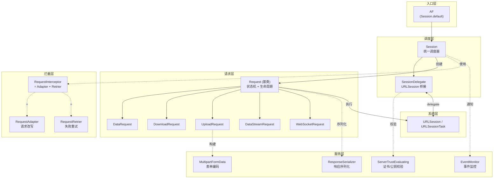
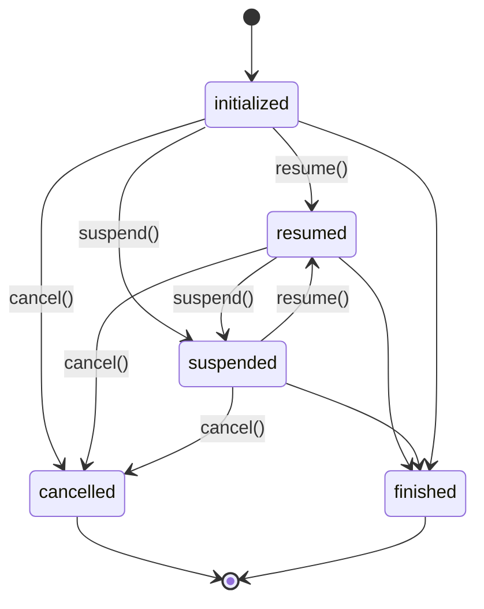
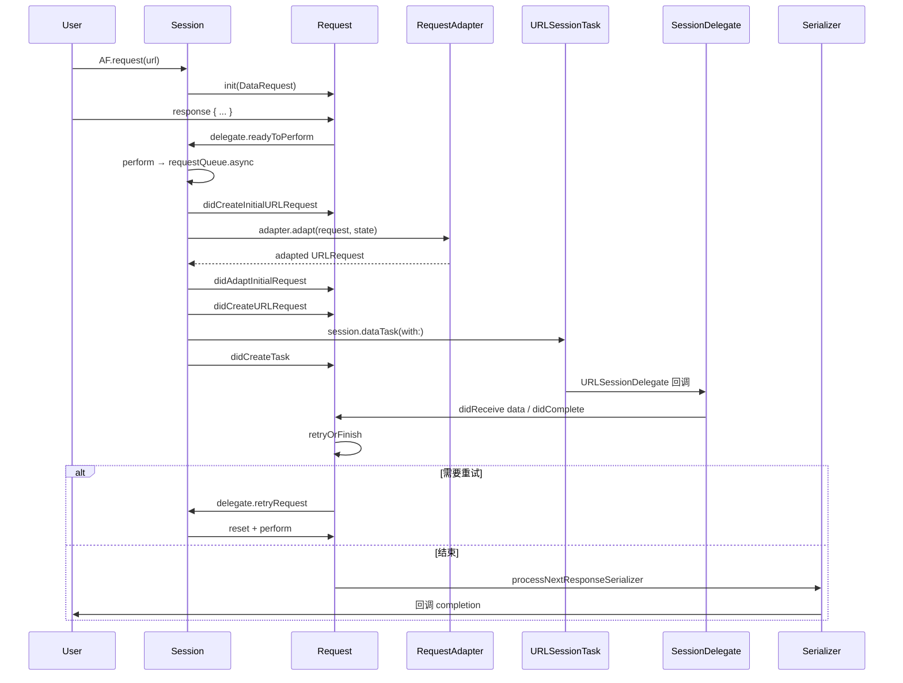

+++
title = "Alamofire源码导读"
date = '2026-05-02T22:32:27+08:00'
draft = false
weight = 2
tags = ["iOS", "源码分析"]
categories = ["iOS开发", "源码分析"]
+++
Alamofire 是 Swift 社区最广泛使用的 HTTP 网络库，由 Alamofire Software Foundation 维护，在 GitHub 已收获 42k+ star。它在 `URLSession` 之上构建了一整套链式 API、拦截器、认证、证书校验、重试与响应序列化等能力。本文基于最新版本 **v5.11.2**（2026 年 4 月发布）源码进行分析，覆盖 Swift 6 严格并发、async/await、WebSocket、OfflineRetrier 等最新特性。

---

## 一、整体架构

Alamofire 采用**中央调度 + 状态机 + 协议导向**的设计，核心角色分工清晰：



**源码目录（`Source/`，总计约 17000 行纯 Swift 代码）：**

```
Source/
├── Alamofire.swift              # 版本信息与 AF 全局入口
├── Core/                        # 核心层
│   ├── Session.swift            # 中央调度器 (1457 行)
│   ├── SessionDelegate.swift    # URLSessionDelegate 桥接
│   ├── Request.swift            # Request 基类与状态机 (1254 行)
│   ├── DataRequest.swift        # 数据请求
│   ├── DownloadRequest.swift    # 下载请求
│   ├── UploadRequest.swift      # 上传请求
│   ├── DataStreamRequest.swift  # 流式请求
│   ├── WebSocketRequest.swift   # WebSocket 请求
│   ├── RequestTaskMap.swift     # Request ↔ URLSessionTask 双向映射
│   ├── Response.swift           # 响应封装 DataResponse/DownloadResponse
│   ├── Protected.swift          # 线程安全包装 (基于 os_unfair_lock)
│   ├── AFError.swift            # 错误枚举 (874 行)
│   ├── HTTPHeaders.swift        # 有序 + 大小写不敏感的 Header
│   ├── HTTPMethod.swift
│   ├── Notifications.swift
│   ├── ParameterEncoder.swift
│   ├── ParameterEncoding.swift
│   └── URLConvertible+URLRequestConvertible.swift
├── Features/                    # 特性层
│   ├── RequestInterceptor.swift # 拦截器协议与组合实现
│   ├── RetryPolicy.swift        # 指数退避重试策略
│   ├── AuthenticationInterceptor.swift  # OAuth2 式鉴权
│   ├── OfflineRetrier.swift     # NWPathMonitor 离线重试 (5.11 新增)
│   ├── ServerTrustEvaluation.swift  # TLS 证书 / 公钥 Pinning
│   ├── NetworkReachabilityManager.swift
│   ├── EventMonitor.swift       # 全链路事件监控 (919 行)
│   ├── ResponseSerialization.swift  # 响应序列化
│   ├── Validation.swift         # 状态码/Content-Type 校验
│   ├── MultipartFormData.swift  # multipart/form-data 编码
│   ├── MultipartUpload.swift
│   ├── RedirectHandler.swift
│   ├── CachedResponseHandler.swift
│   ├── RequestCompression.swift
│   ├── URLEncodedFormEncoder.swift  # URL 编码实现 (1141 行)
│   ├── Concurrency.swift        # async/await 支持 (964 行)
│   ├── Combine.swift            # Combine 发布者封装
│   └── AlamofireExtended.swift  # `.af` 命名空间
└── Extensions/                  # 系统类型扩展
    ├── DispatchQueue+Alamofire.swift
    ├── URLRequest+Alamofire.swift
    ├── URLSessionConfiguration+Alamofire.swift
    └── ...
```

**语言构成：** 100% 纯 Swift 代码，要求 Swift 6.0+ 编译器、Xcode 16+，支持 iOS/macOS/tvOS/watchOS/visionOS 及 Linux/Windows（通过 `FoundationNetworking`）。

---

## 二、入口 — AF 与 Session

### 2.1 全局入口 `AF`

在 `Alamofire.swift` 中定义了两个关键符号：

```swift
public let AF = Session.default

public enum AFInfo {
    public static let version = "5.11.2"
}

#if compiler(<6.0)
#error("Alamofire doesn't support Swift compiler versions below 6.0.")
#endif
```

`AF` 实际上就是 `Session.default`，所有 `AF.request(...)` 调用最终都是路由到默认 Session 单例上。

### 2.2 Session — 中央调度器

`Session` 是 Alamofire 的心脏，负责创建和管理所有 `Request` 生命周期，并统一持有 URLSession、拦截器、证书管理器、重定向处理器、缓存处理器和事件监控器。

核心成员定义在 `Session.swift`：

```swift
open class Session: @unchecked Sendable {
    public static let `default` = Session()
    
    public let session: URLSession
    public let delegate: SessionDelegate
    public let rootQueue: DispatchQueue
    public let startRequestsImmediately: Bool
    public let requestSetup: RequestSetup      // .lazy 或 .eager
    public let requestQueue: DispatchQueue
    public let serializationQueue: DispatchQueue
    public let interceptor: (any RequestInterceptor)?
    public let serverTrustManager: ServerTrustManager?
    public let redirectHandler: (any RedirectHandler)?
    public let cachedResponseHandler: (any CachedResponseHandler)?
    public let eventMonitor: CompositeEventMonitor

    var requestTaskMap = RequestTaskMap()
    var activeRequests: Set<Request> = []
    var waitingCompletions: [URLSessionTask: () -> Void] = [:]
}
```

**几个关键的并发设计要点：**

- `rootQueue` 是一个**必须串行**的 DispatchQueue，它同时作为底层 `URLSession.delegateQueue` 的 `underlyingQueue`，保证了 Alamofire 内部状态（`requestTaskMap`、`activeRequests`）都在同一个串行队列上被读写，避免数据竞争。
- `requestQueue` 与 `serializationQueue` 默认 `target` 到 `rootQueue`，除非业务发现请求构造或响应序列化成为瓶颈，否则不需要分离。
- 整个类用 `@unchecked Sendable` 标记，表示手动维护并发安全。

初始化时有严格的断言：

```swift
precondition(session.configuration.identifier == nil,
             "Alamofire does not support background URLSessionConfigurations.")
precondition(session.delegateQueue.underlyingQueue === rootQueue,
             "Session(session:) initializer must be passed the DispatchQueue used as the delegateQueue's underlyingQueue as rootQueue.")
```

即 **Alamofire 不支持后台 URLSession**，且 `delegateQueue` 的 underlyingQueue 必须与 `rootQueue` 完全相同。这是整个状态机线程安全的基石。

### 2.3 v5.11 新特性 — RequestSetup.lazy

从 5.11 开始，`Session` 引入 `RequestSetup` 枚举：

```swift
public enum RequestSetup {
    /// 只有 resume() 被调用后才开始内部生命周期。Request 创建后处于惰性。
    case lazy
    /// 创建后立即开始（5.11 之前的行为）。
    /// - Warning: 可能导致 resume() 与各种生命周期事件之间的竞态，不推荐。
    case eager
}
```

**默认值已改为 `.lazy`**。这意味着 `AF.request(...)` 返回的 `Request` 在你未调用 `.resume()`（或 `.response { ... }` 隐式触发 resume）之前不会真正启动网络任务，从而消除了一个历史性 race condition。

具体在 `Session.upload`/`streamRequest`/`download` 等方法尾部都会调用：

```swift
performEagerlyIfNecessary(request)

func performEagerlyIfNecessary(_ request: Request) {
    guard requestSetup == .eager else { return }
    perform(request)
}
```

只在 `eager` 模式才立即 `perform`，`lazy` 模式延迟到 `Request.resume()` 内部经由 `delegate.readyToPerform(request:)` 再触发。

---

## 三、Request 基类与状态机

`Request` 是所有具体请求类型的父类，统一持有 id、队列、拦截器、URLSessionTask、进度、响应序列化器等状态。它是整个 Alamofire 最复杂、代码量最大的文件。

### 3.1 状态机设计

```swift
public class Request: @unchecked Sendable {
    public enum State {
        case initialized   // 初始
        case resumed       // 已启动
        case suspended     // 已挂起
        case cancelled     // 已取消（终态）
        case finished      // 已完成（终态）

        func canTransitionTo(_ state: State) -> Bool {
            switch (self, state) {
            case (.initialized, _):                                           true
            case (_, .initialized), (.cancelled, _), (.finished, _):          false
            case (.resumed, .cancelled), (.suspended, .cancelled),
                 (.resumed, .suspended), (.suspended, .resumed):              true
            case (.suspended, .suspended), (.resumed, .resumed):              false
            case (_, .finished):                                              true
            }
        }
    }
}
```

状态转移图：



核心规则：
- `.cancelled` 和 `.finished` 是**终态**，无法再转回其它状态。
- `.initialized` 可以转向任何状态。
- `resume ↔ suspend` 之间可以自由切换，但重复相同状态会被拒绝。

### 3.2 MutableState 与并发安全

`Request` 用一个内部结构体 `MutableState` 把所有需要并发访问的字段集中管理，通过 `Protected<MutableState>` 锁保护：

```swift
struct MutableState {
    var state: State = .initialized
    var uploadProgressHandler: ...?
    var downloadProgressHandler: ...?
    var redirectHandler: (any RedirectHandler)?
    var cachedResponseHandler: (any CachedResponseHandler)?
    var cURLHandler: ...?
    var urlRequestHandler: ...?
    var urlSessionTaskHandler: ...?
    var responseSerializers: [@Sendable () -> Void] = []
    var isResponseSerializerEnqueued = false
    var responseSerializerCompletions: [@Sendable () -> Void] = []
    var responseSerializerProcessingFinished = false
    var eventMonitor: (any EventMonitor)?
    var interceptor: (any RequestInterceptor)?
    var credential: URLCredential?
    var requests: [URLRequest] = []
    var tasks: [URLSessionTask] = []
    var metrics: [URLSessionTaskMetrics] = []
    var retryCount = 0
    var error: AFError?
    var isFinishing = false
    var finishHandlers: [() -> Void] = []
}

let mutableState: Protected<MutableState>
```

注意 `requests`、`tasks`、`metrics` 都是数组 —— Alamofire 会保留一次请求在**整个重试生命周期内**产生的所有 URLRequest 和 URLSessionTask，这也是它 cURL 描述能完整展现适配前后 URL 的基础。

### 3.3 状态切换入口（cancel/suspend/resume）

三个 public API 都使用相同的加锁模式：

```swift
@discardableResult
public func resume() -> Self {
    let needsToPerform = mutableState.write { mutableState in
        guard mutableState.state.canTransitionTo(.resumed) else { return false }
        mutableState.state = .resumed
        underlyingQueue.async { self.didResume() }

        guard let task = mutableState.tasks.last, task.state != .completed else { return true }
        task.resume()
        underlyingQueue.async { self.didResumeTask(task) }
        return true
    }

    if needsToPerform {
        delegate?.readyToPerform(request: self)
    }
    return self
}
```

几个值得玩味的细节：
1. **先校验状态机转移合法性**，不合法则直接 return。
2. 取数组最后一个 task（因为重试会产生多个 task），如果 task 已经创建则直接 `task.resume()`。
3. 如果还没有创建 task（`tasks` 为空），则通过 `delegate?.readyToPerform(request:)` 通知 Session 去实际启动。这正是 `.lazy` 模式下延迟创建的关键。

`cancel()` 的处理更精巧：

```swift
public func cancel() -> Self {
    mutableState.write { mutableState in
        guard mutableState.state.canTransitionTo(.cancelled) else { return }
        mutableState.state = .cancelled
        underlyingQueue.async { self.didCancel() }

        guard let task = mutableState.tasks.last, task.state != .completed else {
            underlyingQueue.async { self.finish() }
            return
        }

        // Resume to ensure metrics are gathered.
        task.resume()
        task.cancel()
        underlyingQueue.async { self.didCancelTask(task) }
    }
    return self
}
```

**先 resume 再 cancel** 是 Apple 的 URLSession 特性：如果一个 suspended 的 task 被直接 cancel，可能不会触发 metrics 收集。因此 Alamofire 通过先 resume 来确保 `URLSessionTaskMetrics` 正常产生。

### 3.4 Request 的生命周期流水线

Alamofire 把一次请求从创建到完成拆分成一组内部事件方法（`didXxx`），全部要求在 `underlyingQueue` 上执行：



关键方法简要说明（都定义在 `Request.swift`）：

| 方法 | 作用 |
|------|------|
| `didCreateInitialURLRequest` | 原始 URLRequest 生成完毕 |
| `didFailToCreateURLRequest` | URLConvertible→URLRequest 失败 → 触发重试 |
| `didAdaptInitialRequest` | 被 Adapter 改写后 |
| `didFailToAdaptURLRequest` | Adapter 失败 → 触发重试 |
| `didCreateURLRequest` | 最终（适配后）URLRequest |
| `didCreateTask` | URLSessionTask 创建完毕 |
| `didGatherMetrics` | 收集到 URLSessionTaskMetrics |
| `didCompleteTask` | task 完成（可能带 error） |
| `retryOrFinish` | 决定重试还是收尾 |
| `finish` | 启动响应序列化流水线 |
| `prepareForRetry` | retryCount++ 并 reset 状态 |

### 3.5 retryOrFinish 与重试流水线

```swift
func retryOrFinish(error: AFError?) {
    dispatchPrecondition(condition: .onQueue(underlyingQueue))

    guard !isCancelled, let error, let delegate else { finish(); return }

    delegate.retryResult(for: self, dueTo: error) { retryResult in
        switch retryResult {
        case .doNotRetry:
            self.finish()
        case let .doNotRetryWithError(retryError):
            self.finish(error: retryError.asAFError(orFailWith: "..."))
        case .retry, .retryWithDelay:
            delegate.retryRequest(self, withDelay: retryResult.delay)
        }
    }
}
```

`delegate` 即 `Session`（见第五节），由它调用配置的 Retrier 来决定是否重试。

---

## 四、Session.perform — 从创建到发出的全流程

当 `Request.resume()` 触发 `delegate.readyToPerform(request:)` 后，控制权回到 `Session`：

```swift
func perform(_ request: Request) {
    rootQueue.async {
        guard !request.isCancelled else { return }
        self.activeRequests.insert(request)

        self.requestQueue.async {
            // Leaf types must come first, otherwise they will cast as their superclass.
            switch request {
            case let r as UploadRequest:       self.performUploadRequest(r)
            case let r as DataRequest:         self.performDataRequest(r)
            case let r as DownloadRequest:     self.performDownloadRequest(r)
            case let r as DataStreamRequest:   self.performDataStreamRequest(r)
            default:
                #if canImport(Darwin) && !canImport(FoundationNetworking)
                if #available(macOS 10.15, iOS 13, tvOS 13, watchOS 6, *),
                   let request = request as? WebSocketRequest {
                    self.performWebSocketRequest(request)
                }
                #endif
            }
        }
    }
}
```

注意注释 `Leaf types must come first` —— `UploadRequest` 继承自 `DataRequest`，因此必须把子类分支放前面，否则会被向上 cast 成父类走错分支。这是 Swift 模式匹配里容易忽视的坑点。

### 4.1 performSetupOperations — 适配 + 任务创建

所有子类最终汇聚到这个方法：

```swift
func performSetupOperations(for request: Request,
                            convertible: any URLRequestConvertible,
                            shouldCreateTask: @escaping @Sendable () -> Bool = { true }) {
    dispatchPrecondition(condition: .onQueue(requestQueue))

    let initialRequest: URLRequest
    do {
        initialRequest = try convertible.asURLRequest()
        try initialRequest.validate()
    } catch {
        rootQueue.async { request.didFailToCreateURLRequest(with: ...) }
        return
    }

    rootQueue.async { request.didCreateInitialURLRequest(initialRequest) }

    guard !request.isCancelled else { return }

    guard let adapter = adapter(for: request) else {
        guard shouldCreateTask() else { return }
        rootQueue.async { self.didCreateURLRequest(initialRequest, for: request) }
        return
    }

    let adapterState = RequestAdapterState(requestID: request.id, session: self)

    adapter.adapt(initialRequest, using: adapterState) { result in
        do {
            let adaptedRequest = try result.get()
            try adaptedRequest.validate()
            self.rootQueue.async { request.didAdaptInitialRequest(initialRequest, to: adaptedRequest) }
            guard shouldCreateTask() else { return }
            self.rootQueue.async { self.didCreateURLRequest(adaptedRequest, for: request) }
        } catch {
            self.rootQueue.async { request.didFailToAdaptURLRequest(initialRequest, withError: .requestAdaptationFailed(error: error)) }
        }
    }
}
```

流程：
1. 在 `requestQueue` 上把 `URLConvertible` 转成 `URLRequest` 并 `validate()`；
2. 切回 `rootQueue` 通知 `Request.didCreateInitialURLRequest`；
3. 如果没有 Adapter（Session 级 + Request 级），直接进入 task 创建；
4. 否则异步调用 Adapter，完成后在 `rootQueue` 上进入 `didCreateURLRequest`；
5. `shouldCreateTask` 闭包被 `UploadRequest` 用于在 task 创建前确保 `Uploadable` 已就绪。

### 4.2 didCreateURLRequest → URLSessionTask

```swift
func didCreateURLRequest(_ urlRequest: URLRequest, for request: Request) {
    dispatchPrecondition(condition: .onQueue(rootQueue))

    request.didCreateURLRequest(urlRequest)
    guard !request.isCancelled else { return }

    let task = request.task(for: urlRequest, using: session)
    requestTaskMap[request] = task
    request.didCreateTask(task)
    updateStatesForTask(task, request: request)
}
```

`request.task(for:using:)` 是多态方法，不同子类返回不同类型：

```swift
// DataRequest
override func task(for request: URLRequest, using session: URLSession) -> URLSessionTask {
    session.dataTask(with: request)
}

// DownloadRequest — 另有 resumeData 分支走 session.downloadTask(withResumeData:)
// UploadRequest — 走 session.uploadTask(with:from:) / fromFile: / withStreamedRequest:
// WebSocketRequest — session.webSocketTask(with:)
```

`requestTaskMap[request] = task` 则把两者关联起来，后续所有 `URLSessionDelegate` 回调都能通过 task 反查到对应 Request。

---

## 五、SessionDelegate — URLSession 桥接层

`SessionDelegate` 继承 `NSObject` 并实现五个 delegate 协议：`URLSessionDelegate`、`URLSessionTaskDelegate`、`URLSessionDataDelegate`、`URLSessionDownloadDelegate`、`URLSessionWebSocketDelegate`。它不直接持有 Session，而是通过 `weak var stateProvider: SessionStateProvider?` 弱引用回调：

```swift
open class SessionDelegate: NSObject, @unchecked Sendable {
    weak var stateProvider: (any SessionStateProvider)?
    var eventMonitor: (any EventMonitor)?

    func request<R: Request>(for task: URLSessionTask, as type: R.Type) -> R? {
        return stateProvider?.request(for: task) as? R
    }
}

protocol SessionStateProvider: AnyObject, Sendable {
    var serverTrustManager: ServerTrustManager? { get }
    var redirectHandler: (any RedirectHandler)? { get }
    var cachedResponseHandler: (any CachedResponseHandler)? { get }

    func request(for task: URLSessionTask) -> Request?
    func didGatherMetricsForTask(_ task: URLSessionTask)
    func didCompleteTask(_ task: URLSessionTask, completion: @escaping () -> Void)
    func credential(for task: URLSessionTask, in protectionSpace: URLProtectionSpace) -> URLCredential?
    func cancelRequestsForSessionInvalidation(with error: (any Error)?)
}
```

这种**双向关联通过协议抽象**的设计允许用户自定义 `SessionDelegate` 子类接入自己的逻辑，同时保持与 `Session` 解耦。

### 5.1 身份验证 Challenge 派发

```swift
open func urlSession(_ session: URLSession,
                     task: URLSessionTask,
                     didReceive challenge: URLAuthenticationChallenge,
                     completionHandler: @escaping (URLSession.AuthChallengeDisposition, URLCredential?) -> Void) {
    eventMonitor?.urlSession(session, task: task, didReceive: challenge)

    let evaluation: ChallengeEvaluation = switch challenge.protectionSpace.authenticationMethod {
    case NSURLAuthenticationMethodHTTPBasic, NSURLAuthenticationMethodHTTPDigest,
         NSURLAuthenticationMethodNTLM, NSURLAuthenticationMethodNegotiate:
        attemptCredentialAuthentication(for: challenge, belongingTo: task)
    #if canImport(Security)
    case NSURLAuthenticationMethodServerTrust:
        attemptServerTrustAuthentication(with: challenge)
    case NSURLAuthenticationMethodClientCertificate:
        attemptCredentialAuthentication(for: challenge, belongingTo: task)
    #endif
    default:
        (.performDefaultHandling, nil, nil)
    }
    ...
    completionHandler(evaluation.disposition, evaluation.credential)
}
```

不同的 `authenticationMethod` 被分发到不同的内部方法：

- **HTTP Basic/Digest/NTLM/Negotiate** → 从 Request 自身或 Session 中查 `URLCredential`
- **ServerTrust**（TLS）→ 调用 `ServerTrustManager.serverTrustEvaluator(forHost:)`
- **ClientCertificate** → 同样走 credential 路径

### 5.2 下载完成的文件落盘

`urlSession(_:downloadTask:didFinishDownloadingTo:)` 是 `DownloadRequest` 的关键回调：

```swift
open func urlSession(_ session: URLSession, downloadTask: URLSessionDownloadTask, didFinishDownloadingTo location: URL) {
    eventMonitor?.urlSession(session, downloadTask: downloadTask, didFinishDownloadingTo: location)
    guard let request = request(for: downloadTask, as: DownloadRequest.self) else { ... return }

    let (destination, options): (URL, DownloadRequest.Options)
    if let response = request.response {
        (destination, options) = request.destination(location, response)
    } else {
        (destination, options) = (DownloadRequest.defaultDestinationURL(location), [])
    }

    do {
        if options.contains(.removePreviousFile), fileManager.fileExists(atPath: destination.path) {
            try fileManager.removeItem(at: destination)
        }
        if options.contains(.createIntermediateDirectories) {
            let directory = destination.deletingLastPathComponent()
            try fileManager.createDirectory(at: directory, withIntermediateDirectories: true)
        }
        try fileManager.moveItem(at: location, to: destination)
        request.didFinishDownloading(using: downloadTask, with: .success(destination))
    } catch {
        request.didFinishDownloading(using: downloadTask, with: .failure(.downloadedFileMoveFailed(...)))
    }
}
```

系统下载到的临时文件 `location` 会在**当前回调返回后立即删除**，因此 Alamofire 必须在这一步同步完成 `moveItem` 操作，否则会丢失文件。这也是 `destination` 与 `Options.createIntermediateDirectories`/`removePreviousFile` 设计的由来。

---

## 六、RequestInterceptor — 拦截器体系

拦截器是 Alamofire 功能扩展的核心抽象，位于 `Features/RequestInterceptor.swift`。

### 6.1 两个核心协议

```swift
public protocol RequestAdapter: Sendable {
    func adapt(_ urlRequest: URLRequest, for session: Session,
               completion: @escaping @Sendable (_ result: Result<URLRequest, any Error>) -> Void)

    func adapt(_ urlRequest: URLRequest, using state: RequestAdapterState,
               completion: @escaping @Sendable (_ result: Result<URLRequest, any Error>) -> Void)
}

public protocol RequestRetrier: Sendable {
    func retry(_ request: Request, for session: Session, dueTo error: any Error,
               completion: @escaping @Sendable (RetryResult) -> Void)
}

public protocol RequestInterceptor: RequestAdapter, RequestRetrier {}
```

`RequestInterceptor` = `Adapter ∩ Retrier`，同时支持请求改写和失败重试。

**两套 adapt 签名**的原因：早期版本只接收 `Session`，5.x 引入了 `RequestAdapterState`（含 `requestID`）用于更细粒度的决策。两个方法通过默认实现互相回落，新写的 Adapter 只需实现 `using state:` 版本。

### 6.2 RetryResult 的语义

```swift
public enum RetryResult: Sendable {
    case retry                                 // 立即重试
    case retryWithDelay(TimeInterval)          // 延迟后重试
    case doNotRetry                            // 放弃，但保留原错误
    case doNotRetryWithError(any Error)        // 放弃，并替换为指定错误
}
```

四种语义清晰覆盖所有重试策略的决策输出。注意 `doNotRetryWithError` 可以用来把原始错误转换成更有意义的业务错误（例如 OAuth2 的 `AuthenticationError.excessiveRefresh`）。

### 6.3 Interceptor — 组合模式

`Interceptor` 类把多个 Adapter 和 Retrier 组合起来：

```swift
open class Interceptor: @unchecked Sendable, RequestInterceptor {
    public let adapters: [any RequestAdapter]
    public let retriers: [any RequestRetrier]

    public init(adapters: [any RequestAdapter] = [],
                retriers: [any RequestRetrier] = [],
                interceptors: [any RequestInterceptor] = []) {
        self.adapters = adapters + interceptors
        self.retriers = retriers + interceptors
    }

    private func adapt(_ urlRequest: URLRequest,
                       for session: Session,
                       using adapters: [any RequestAdapter],
                       completion: @escaping @Sendable (Result<URLRequest, any Error>) -> Void) {
        var pendingAdapters = adapters
        guard !pendingAdapters.isEmpty else { completion(.success(urlRequest)); return }

        let adapter = pendingAdapters.removeFirst()
        adapter.adapt(urlRequest, for: session) { [pendingAdapters] result in
            switch result {
            case let .success(urlRequest):
                self.adapt(urlRequest, for: session, using: pendingAdapters, completion: completion)
            case .failure:
                completion(result)
            }
        }
    }

    private func retry(_ request: Request,
                       for session: Session,
                       dueTo error: any Error,
                       using retriers: [any RequestRetrier],
                       completion: @escaping @Sendable (RetryResult) -> Void) {
        var pendingRetriers = retriers
        guard !pendingRetriers.isEmpty else { completion(.doNotRetry); return }

        let retrier = pendingRetriers.removeFirst()
        retrier.retry(request, for: session, dueTo: error) { [pendingRetriers] result in
            switch result {
            case .retry, .retryWithDelay, .doNotRetryWithError:
                completion(result)
            case .doNotRetry:
                // 只有明确 doNotRetry 时才继续问下一个 retrier
                self.retry(request, for: session, dueTo: error, using: pendingRetriers, completion: completion)
            }
        }
    }
}
```

**组合语义的差异**：
- **Adapter**：链式改写，任何一个失败则整条链失败；所有人成功才返回最终 URLRequest。
- **Retrier**：短路匹配，**第一个给出非 `doNotRetry` 结果**的 retrier 决定重试行为；只有所有 retrier 都 `doNotRetry` 才放弃重试。

这种语义差异刚好对应"Adapter 必须全部成功"和"Retrier 任意一个触发即可"的典型业务需求。

---

## 七、RetryPolicy — 开箱即用的重试策略

`Features/RetryPolicy.swift` 提供默认的指数退避重试实现：

```swift
open class RetryPolicy: @unchecked Sendable, RequestInterceptor {
    public static let defaultRetryLimit: UInt = 2
    public static let defaultExponentialBackoffBase: UInt = 2
    public static let defaultExponentialBackoffScale: Double = 0.5

    public static let defaultRetryableHTTPMethods: Set<HTTPMethod> = [
        .delete, .get, .head, .options, .put, .trace
    ]
    public static let defaultRetryableHTTPStatusCodes: Set<Int> = [408, 500, 502, 503, 504]
    public static let defaultRetryableURLErrorCodes: Set<URLError.Code> = [
        .backgroundSessionInUseByAnotherProcess, .backgroundSessionWasDisconnected,
        .badServerResponse, .callIsActive, .cannotConnectToHost, .cannotFindHost,
        .cannotLoadFromNetwork, .dataNotAllowed, .dnsLookupFailed,
        .downloadDecodingFailedMidStream, .downloadDecodingFailedToComplete,
        .internationalRoamingOff, .networkConnectionLost, .notConnectedToInternet,
        .secureConnectionFailed, .serverCertificateHasBadDate,
        .serverCertificateNotYetValid, .timedOut
    ]

    open func retry(_ request: Request, for session: Session, dueTo error: any Error,
                    completion: @escaping @Sendable (RetryResult) -> Void) {
        if request.retryCount < retryLimit, shouldRetry(request: request, dueTo: error) {
            completion(.retryWithDelay(
                pow(Double(exponentialBackoffBase), Double(request.retryCount)) * exponentialBackoffScale
            ))
        } else {
            completion(.doNotRetry)
        }
    }

    open func shouldRetry(request: Request, dueTo error: any Error) -> Bool {
        guard let httpMethod = request.request?.method,
              retryableHTTPMethods.contains(httpMethod) else { return false }

        if let statusCode = request.response?.statusCode, retryableHTTPStatusCodes.contains(statusCode) {
            return true
        } else {
            let errorCode = (error as? URLError)?.code
            let afErrorCode = (error.asAFError?.underlyingError as? URLError)?.code
            guard let code = errorCode ?? afErrorCode else { return false }
            return retryableURLErrorCodes.contains(code)
        }
    }
}
```

几个关键决策点：

1. **只重试幂等方法**（默认集合排除了 `POST`、`PATCH`、`CONNECT`）。
2. **退避公式**：`delay = base^retryCount × scale`，默认 `base=2, scale=0.5` → 第 1 次重试 0.5s，第 2 次 1s，第 3 次 2s。
3. **HTTP 状态码判定**：4xx/5xx 中只选择"服务端/网关临时错误"（408/500/502/503/504），排除可预测的客户端错误（401/403/404）。
4. **URLError.Code** 白名单注释极其详尽，每个 case 都标明了启用与否的理由（`[Enabled]` / `[Disabled]`）。源码里类似"文件系统相关错误不启用重试、证书根不可信不启用重试"这类决策值得学习。

此外还有 `ConnectionLostRetryPolicy`，专门针对 Apple 文档里提到的 "connection lost" 问题（`.networkConnectionLost`）做自动重试。

### 7.1 OfflineRetrier — v5.11 新特性

5.11 引入的 `OfflineRetrier` 用 `Network.framework` 的 `NWPathMonitor` 替代传统的 `NetworkReachabilityManager` 风格实现：

```swift
@available(macOS 10.14, iOS 12, tvOS 12, watchOS 5, visionOS 1, *)
public final class OfflineRetrier: RequestAdapter, RequestRetrier, RequestInterceptor, Sendable {
    public static let defaultWait: DispatchTimeInterval = .seconds(5)
    public static let defaultURLErrorOfflineCodes: Set<URLError.Code> = [.notConnectedToInternet]

    private let state: Protected<State>

    public func retry(_ request: Request, for session: Session, dueTo error: any Error,
                      completion: @escaping @Sendable (RetryResult) -> Void) {
        state.write { state in
            guard state.isOfflineError(error) else { completion(.doNotRetry); return }
            state.pendingCompletions.append(completion)
            guard state.currentMonitor == nil else { return }

            state.startListening { [unowned self] result in
                let retryResult: RetryResult = switch result {
                case .pathAvailable: .retry
                case .timeout:       .doNotRetry
                }
                performResult(retryResult)
            }
        }
    }
}
```

核心思路：
- 用 `NWPathMonitor` **被动监听网络状态变化**，而不是主动轮询；
- 多个同时 offline 失败的请求共享**一次监听**，所有的 completion 都被挂起，等路径恢复后统一触发重试；
- 超过 `maximumWait`（默认 5 秒）仍未恢复则 `.doNotRetry` 带原始错误返回。

这套设计避免了 reachability 轮询带来的功耗开销，也消除了之前 `NetworkReachabilityManager` 存在的已知竞态。

---

## 八、AuthenticationInterceptor — OAuth2 脚手架

`Features/AuthenticationInterceptor.swift` 为 OAuth2 等"持有 Credential、过期需刷新"的鉴权流程提供了统一模板。

### 8.1 双协议抽象

```swift
public protocol AuthenticationCredential {
    var requiresRefresh: Bool { get }
}

public protocol Authenticator: AnyObject, Sendable {
    associatedtype Credential: AuthenticationCredential & Sendable

    func apply(_ credential: Credential, to urlRequest: inout URLRequest)

    func refresh(_ credential: Credential, for session: Session,
                 completion: @escaping @Sendable (Result<Credential, any Error>) -> Void)

    func didRequest(_ urlRequest: URLRequest, with response: HTTPURLResponse,
                    failDueToAuthenticationError error: any Error) -> Bool

    func isRequest(_ urlRequest: URLRequest, authenticatedWith credential: Credential) -> Bool
}
```

- `apply` — 如何把 Credential 塞到 URLRequest（通常是 `Bearer xxx` 放进 Authorization 头）。
- `refresh` — 如何调用刷新 API 得到新的 Credential。
- `didRequest(_:with:failDueToAuthenticationError:)` — 判断一次失败是不是因为鉴权过期（通常是 401 + 特定 header）。
- `isRequest(_:authenticatedWith:)` — 判断一次请求是否使用了当前 Credential（用于区分"在我更新 Credential 之前发出的老请求"和"已经用新 Credential 但被拒绝的新请求"）。

### 8.2 RefreshWindow 防止刷新风暴

```swift
public struct RefreshWindow {
    public let interval: TimeInterval
    public let maximumAttempts: Int

    public init(interval: TimeInterval = 30.0, maximumAttempts: Int = 5) {
        self.interval = interval
        self.maximumAttempts = maximumAttempts
    }
}
```

当 refresh 在 `interval` 秒内被触发次数超过 `maximumAttempts`，直接抛出 `AuthenticationError.excessiveRefresh`，避免进入 refresh 死循环（例如 refresh 本身 401 又触发 refresh）。

`AuthenticationInterceptor` 内部用一个串行队列维护 `AdaptOperation` 队列，确保**同一时刻只有一个 refresh 在飞**，所有同时到来的请求在 refresh 完成后再统一 apply 新 Credential 重试。这套模板极大降低了自行实现 OAuth2 的复杂度。

---

## 九、ServerTrustEvaluation — TLS 校验与 Pinning

`Features/ServerTrustEvaluation.swift` 提供了完整的 TLS 证书评估体系，是 Alamofire 里用户最容易配置错的部分。

### 9.1 ServerTrustManager — 按 host 分发

```swift
open class ServerTrustManager: @unchecked Sendable {
    public let allHostsMustBeEvaluated: Bool
    public let evaluators: [String: any ServerTrustEvaluating]

    open func serverTrustEvaluator(forHost host: String) throws -> (any ServerTrustEvaluating)? {
        guard let evaluator = evaluators[host] else {
            if allHostsMustBeEvaluated {
                throw AFError.serverTrustEvaluationFailed(reason: .noRequiredEvaluator(host: host))
            }
            return nil
        }
        return evaluator
    }
}
```

`allHostsMustBeEvaluated = true`（默认）时，未配置 evaluator 的 host 会**直接抛错**。这强制开发者显式列出所有要校验的 host，避免"默认放行"踩坑。

### 9.2 内置 Evaluator 清单

| Evaluator | 作用 |
|-----------|------|
| `DefaultTrustEvaluator` | 系统默认校验，可选择是否校验 host |
| `RevocationTrustEvaluator` | 在默认校验基础上加入 CRL/OCSP 吊销检查 |
| `PinnedCertificatesTrustEvaluator` | 证书 Pinning |
| `PublicKeysTrustEvaluator` | 公钥 Pinning |
| `CompositeTrustEvaluator` | 组合多个 Evaluator |
| `DisabledTrustEvaluator` | **DEBUG 专用**，完全禁用校验；Release 编译会编译错误 |

`DefaultTrustEvaluator` 的典型实现：

```swift
public func evaluate(_ trust: SecTrust, forHost host: String) throws {
    if validateHost {
        try trust.af.performValidation(forHost: host)
    }
    try trust.af.performDefaultValidation(forHost: host)
}
```

`trust.af` 是 Alamofire 在 `SecTrust` 上加的 `.af` 命名空间扩展，封装了底层 `SecTrustEvaluateWithError` / `SecTrustCopyCertificateChain` 等 C API。

### 9.3 Pinning 实现要点（概念）

公钥 Pinning 的大致流程：
1. 从 `SecTrust` 取出服务器证书链上的所有 `SecKey`；
2. 与 Bundle 中预置的 `SecKey`（通过 `.cer` 文件提取）做**相等性比较**；
3. 任一匹配即通过，全部不匹配则抛 `AFError.serverTrustEvaluationFailed(.publicKeyPinningFailed(...))`。

相比证书 Pinning，公钥 Pinning 的优势是：证书更新（只要公钥不变）不需要同步更新 App。

---

## 十、MultipartFormData — 表单编码

`Features/MultipartFormData.swift` 实现了符合 RFC-2388/2045 的 multipart/form-data 编码。

### 10.1 内存阈值双路径

```swift
open class MultipartFormData {
    public static let encodingMemoryThreshold: UInt64 = 10_000_000  // 10MB
    public let boundary: String
    private var bodyParts: [BodyPart]

    class BodyPart {
        let headers: HTTPHeaders
        let bodyStream: InputStream
        let bodyContentLength: UInt64
        var hasInitialBoundary = false
        var hasFinalBoundary = false
    }
}
```

每个 part 都用 **InputStream** 而不是 Data 保存，这使得超过内存阈值（10MB）时可以把整个 multipart 体**流式写入临时文件**而不是全部装进内存：

```swift
// 简化后的逻辑
if formData.contentLength < MultipartFormData.encodingMemoryThreshold {
    let data = try formData.encode()
    // 作为 Data 上传
} else {
    let fileURL = try writeEncodedDataToDisk(formData)
    // 作为文件 URL 上传
}
```

这也是 Alamofire 相比直接用 `URLSession` 上传大文件的一大便利——**避免 OOM**。

### 10.2 Boundary 生成

```swift
static func randomBoundary() -> String {
    let first = UInt32.random(in: UInt32.min...UInt32.max)
    let second = UInt32.random(in: UInt32.min...UInt32.max)
    return String(format: "alamofire.boundary.%08x%08x", first, second)
}
```

使用 64 位随机数作为 boundary，碰撞概率可忽略。boundary 用于标识 multipart 各段的边界，必须保证不会出现在任何 part 的 body 中。

---

## 十一、ResponseSerialization — 响应序列化体系

### 11.1 协议层级

```swift
public protocol DataResponseSerializerProtocol<SerializedObject>: Sendable {
    associatedtype SerializedObject: Sendable
    func serialize(request: URLRequest?, response: HTTPURLResponse?,
                   data: Data?, error: (any Error)?) throws -> SerializedObject
}

public protocol DownloadResponseSerializerProtocol<SerializedObject>: Sendable {
    associatedtype SerializedObject: Sendable
    func serializeDownload(request: URLRequest?, response: HTTPURLResponse?,
                           fileURL: URL?, error: (any Error)?) throws -> SerializedObject
}

public protocol ResponseSerializer<SerializedObject>:
    DataResponseSerializerProtocol & DownloadResponseSerializerProtocol {
    var dataPreprocessor: any DataPreprocessor { get }
    var emptyRequestMethods: Set<HTTPMethod> { get }
    var emptyResponseCodes: Set<Int> { get }
}
```

三层协议组成：Data / Download 各自独立，`ResponseSerializer` 聚合两者并补充通用配置。

### 11.2 Data/Download 互转默认实现

```swift
extension DownloadResponseSerializerProtocol where Self: DataResponseSerializerProtocol {
    public func serializeDownload(request: URLRequest?, response: HTTPURLResponse?,
                                  fileURL: URL?, error: (any Error)?) throws -> SerializedObject {
        guard error == nil else { throw error! }
        guard let fileURL else { throw AFError.responseSerializationFailed(reason: .inputFileNil) }

        let data: Data
        do {
            data = try Data(contentsOf: fileURL)
        } catch {
            throw AFError.responseSerializationFailed(reason: .inputFileReadFailed(at: fileURL))
        }

        return try serialize(request: request, response: response, data: data, error: error)
    }
}
```

只要同时遵守两个协议，Alamofire 就免费提供 download → data 的转换（把下载的文件读成 Data 再调 data 版的 serialize）。这让 `JSONResponseSerializer` / `DecodableResponseSerializer` 等一套实现既能用于 `DataRequest` 又能用于 `DownloadRequest`。

### 11.3 DataPreprocessor — 数据预处理

```swift
public protocol DataPreprocessor: Sendable {
    func preprocess(_ data: Data) throws -> Data
}

public struct PassthroughPreprocessor: DataPreprocessor {
    public func preprocess(_ data: Data) throws -> Data { data }
}

public struct GoogleXSSIPreprocessor: DataPreprocessor {
    public func preprocess(_ data: Data) throws -> Data {
        (data.prefix(6) == Data(")]}',\n".utf8)) ? data.dropFirst(6) : data
    }
}
```

`GoogleXSSIPreprocessor` 处理 Google 某些 API 在 JSON 前加的 XSSI 防御前缀 `)]}',\n`，这是一个实际生产场景的 "最小可复用工具"。

### 11.4 空响应处理

```swift
public static var defaultEmptyRequestMethods: Set<HTTPMethod> { [.head] }
public static var defaultEmptyResponseCodes: Set<Int> { [204, 205] }

public func emptyResponseAllowed(forRequest request: URLRequest?, response: HTTPURLResponse?) -> Bool {
    (requestAllowsEmptyResponseData(request) == true) || (responseAllowsEmptyResponseData(response) == true)
}
```

对 HEAD 请求、204 No Content、205 Reset Content 三种情况，即使 body 为空也不视为序列化失败，这在 REST API 中非常常见。

---

## 十二、EventMonitor — 全链路事件监控

`Features/EventMonitor.swift`（919 行）定义了一个覆盖 **URLSession 全部 delegate 回调 + Request 全部生命周期事件**的协议。这让埋点、日志、性能监控可以完全**旁路**实现，不侵入业务代码。

协议核心片段：

```swift
public protocol EventMonitor: Sendable {
    var queue: DispatchQueue { get }

    // MARK: URLSessionDelegate Events
    func urlSession(_ session: URLSession, didBecomeInvalidWithError error: (any Error)?)
    func urlSession(_ session: URLSession, task: URLSessionTask, didReceive challenge: URLAuthenticationChallenge)
    func urlSession(_ session: URLSession, task: URLSessionTask, didFinishCollecting metrics: URLSessionTaskMetrics)
    // ... 约 30 个 URLSession 事件

    // MARK: Request Events
    func request(_ request: Request, didCreateInitialURLRequest urlRequest: URLRequest)
    func request(_ request: Request, didAdaptInitialRequest initialRequest: URLRequest, to adaptedRequest: URLRequest)
    func request(_ request: Request, didCreateURLRequest urlRequest: URLRequest)
    func request(_ request: Request, didCreateTask task: URLSessionTask)
    func request(_ request: Request, didGatherMetrics metrics: URLSessionTaskMetrics)
    func request(_ request: Request, didFailTask task: URLSessionTask, earlyWithError error: AFError)
    func request(_ request: Request, didCompleteTask task: URLSessionTask, with error: AFError?)
    func requestIsRetrying(_ request: Request)
    func requestDidFinish(_ request: Request)
    func requestDidResume(_ request: Request)
    func requestDidSuspend(_ request: Request)
    func requestDidCancel(_ request: Request)
    // ... 约 25 个 Request 事件
    
    // MARK: DataRequest / DataStreamRequest / UploadRequest / DownloadRequest Events
    // ...
}
```

所有方法都有默认空实现（通过协议扩展），用户只需覆盖自己关心的方法。

`CompositeEventMonitor` 把多个 EventMonitor 组合成一个，所有事件会分发给每个子 monitor。内置的 `AlamofireNotifications` 把事件转成 `NSNotification` 发布，方便老代码接入。

---

## 十三、async/await 与 Combine 集成

### 13.1 Concurrency.swift — async/await

`Features/Concurrency.swift`（964 行）把所有 Request 变种都包装成 `DataTask`/`DownloadTask`/`DataStreamTask`/`WebSocketTask` 等 `Sendable` 结构体，通过 Swift 结构化并发暴露：

```swift
@available(macOS 10.15, iOS 13, tvOS 13, watchOS 6, *)
public struct DataTask<Value>: Sendable where Value: Sendable {
    public var response: DataResponse<Value, AFError> {
        get async {
            if shouldAutomaticallyCancel {
                await withTaskCancellationHandler {
                    await task.value
                } onCancel: {
                    cancel()
                }
            } else {
                await task.value
            }
        }
    }

    public var result: Result<Value, AFError> {
        get async { await response.result }
    }

    public var value: Value {
        get async throws {
            try await result.get()
        }
    }

    private let request: DataRequest
    private let task: Task<DataResponse<Value, AFError>, Never>
    private let shouldAutomaticallyCancel: Bool
}
```

使用示例：

```swift
let user = try await AF.request("https://api.example.com/user")
                       .serializingDecodable(User.self)
                       .value
```

`withTaskCancellationHandler` 是亮点 —— 当父 Task 被 cancel（比如 SwiftUI 视图消失）时，自动把取消信号传递到底层 `DataRequest`，避免请求继续消耗流量。

### 13.2 StreamOf — 进度/响应/cURL 异步流

Request 还暴露一组 `StreamOf<T>`（内部封装 `AsyncStream<T>`）：

```swift
@available(macOS 10.15, iOS 13, tvOS 13, watchOS 6, *)
extension Request {
    public func uploadProgress(bufferingPolicy: StreamOf<Progress>.BufferingPolicy = .unbounded)
        -> StreamOf<Progress> { ... }
    public func downloadProgress(bufferingPolicy: ...) -> StreamOf<Progress> { ... }
    public func urlRequests(...) -> StreamOf<URLRequest> { ... }
    public func urlSessionTasks(...) -> StreamOf<URLSessionTask> { ... }
    public func cURLDescriptions(...) -> StreamOf<String> { ... }
}
```

可以这样用：

```swift
for await progress in request.downloadProgress() {
    print("\(Int(progress.fractionCompleted * 100))%")
}
```

### 13.3 Combine.swift — Publisher 封装

`Features/Combine.swift` 提供了 `DataResponsePublisher` / `DownloadResponsePublisher` / `DataStreamPublisher`：

```swift
@available(macOS 10.15, iOS 13, watchOS 6, tvOS 13, *)
public struct DataResponsePublisher<Value: Sendable>: Publisher {
    public typealias Output = DataResponse<Value, AFError>
    public typealias Failure = Never

    public func result() -> AnyPublisher<Result<Value, AFError>, Never> {
        map(\.result).eraseToAnyPublisher()
    }

    public func value() -> AnyPublisher<Value, AFError> {
        setFailureType(to: AFError.self).flatMap(\.result.publisher).eraseToAnyPublisher()
    }
}

extension DataRequest {
    public func publishDecodable<T: Decodable & Sendable>(type: T.Type = T.self,
                                                          queue: DispatchQueue = .main,
                                                          ...) -> DataResponsePublisher<T> { ... }
}
```

订阅时机设计巧妙 —— `receive(subscriber:)` 在下游发出 demand 时才真正调用 `request.response { ... }.resume()`，从而与 Combine 的"pull"语义契合：

```swift
func request(_ demand: Subscribers.Demand) {
    assert(demand > 0)
    guard let downstream = downstream.read({ $0 }) else { return }
    self.downstream.write(nil)
    responseHandler { response in
        _ = downstream.receive(response)
        downstream.receive(completion: .finished)
    }.resume()
}

func cancel() {
    request.cancel()
    downstream.write(nil)
}
```

---

## 十四、Protected — 线程安全原语

整个库严重依赖 `Core/Protected.swift` 这个线程安全泛型包装：

```swift
private protocol Lock: Sendable {
    func lock()
    func unlock()
}

extension Lock {
    func around<T>(_ closure: () throws -> T) rethrows -> T {
        lock(); defer { unlock() }
        return try closure()
    }
}

#if canImport(Darwin)
final class UnfairLock: Lock, @unchecked Sendable {
    private let unfairLock: os_unfair_lock_t

    init() {
        unfairLock = .allocate(capacity: 1)
        unfairLock.initialize(to: os_unfair_lock())
    }
    deinit {
        unfairLock.deinitialize(count: 1)
        unfairLock.deallocate()
    }

    fileprivate func lock()   { os_unfair_lock_lock(unfairLock) }
    fileprivate func unlock() { os_unfair_lock_unlock(unfairLock) }
}
#elseif canImport(Foundation)
extension NSLock: Lock {}
#endif

final class Protected<Value> {
    private let lock = UnfairLock()  // Darwin 平台

    private nonisolated(unsafe) var value: Value

    init(_ value: Value) { self.value = value }

    func read<U>(_ closure: (Value) throws -> U) rethrows -> U {
        try lock.around { try closure(self.value) }
    }

    @discardableResult
    func write<U>(_ closure: (inout Value) throws -> U) rethrows -> U {
        try lock.around { try closure(&self.value) }
    }
}
```

要点：
1. **Apple 平台使用 `os_unfair_lock`**（最轻量的互斥锁，内核级 spinlock 降级），其他平台回退到 `NSLock`。
2. `Protected<Value>` 的 `read` / `write` 闭包接口**强制**锁获取释放成对出现，`defer unlock()` 保证异常安全。
3. Swift 6 的 `nonisolated(unsafe)` 标注告诉编译器"我手动保证并发安全，请不要报错"。
4. 源码里保留了一个风趣的注释：`// Number of Apple engineers who insisted on inspecting this: 5` ——说明 `os_unfair_lock` 封装的正确性是经过苹果工程师多次审查的。

这个文件只有 165 行，但它是 Alamofire 并发安全的地基 —— `Request.MutableState`、`Interceptor` 队列、`AuthenticationInterceptor` 状态、`OfflineRetrier` 状态全部用它保护。

---

## 十五、AFError — 完整错误枚举

`Core/AFError.swift`（874 行）定义了 Alamofire 所有可能的错误场景，采用**两级嵌套枚举**组织：

```swift
public enum AFError: Error, Sendable {
    public enum MultipartEncodingFailureReason: Sendable { ... }
    public enum ParameterEncodingFailureReason: Sendable { ... }
    public enum ParameterEncoderFailureReason: Sendable { ... }
    public enum ResponseValidationFailureReason: Sendable { ... }
    public enum ResponseSerializationFailureReason: Sendable { ... }
    public enum ServerTrustFailureReason: Sendable { ... }
    public enum URLRequestValidationFailureReason: Sendable { ... }

    case createUploadableFailed(error: any Error)
    case createURLRequestFailed(error: any Error)
    case downloadedFileMoveFailed(error: any Error, source: URL, destination: URL)
    case explicitlyCancelled
    case invalidURL(url: any URLConvertible)
    case multipartEncodingFailed(reason: MultipartEncodingFailureReason)
    case parameterEncodingFailed(reason: ParameterEncodingFailureReason)
    case parameterEncoderFailed(reason: ParameterEncoderFailureReason)
    case requestAdaptationFailed(error: any Error)
    case requestRetryFailed(retryError: any Error, originalError: any Error)
    case responseValidationFailed(reason: ResponseValidationFailureReason)
    case responseSerializationFailed(reason: ResponseSerializationFailureReason)
    case serverTrustEvaluationFailed(reason: ServerTrustFailureReason)
    case sessionDeinitialized
    case sessionInvalidated(error: (any Error)?)
    case sessionTaskFailed(error: any Error)
    case urlRequestValidationFailed(reason: URLRequestValidationFailureReason)
}
```

设计观察：
- 外层 case 按**处理阶段**分类（创建 URLRequest、适配、重试、序列化、TLS...）。
- 内层 `Reason` 枚举提供**精确子原因**，便于做差异化错误处理（例如针对 `responseSerializationFailed(.decodingFailed)` 单独上报解码错误）。
- `requestRetryFailed(retryError:originalError:)` 同时携带**原始错误和重试错误**，避免信息丢失。

配套的便捷计算属性让错误断言变得优雅：

```swift
extension AFError {
    public var isInvalidURLError: Bool { ... }
    public var isParameterEncodingError: Bool { ... }
    public var isResponseValidationError: Bool { ... }
    public var responseCode: Int? { ... }  // 提取 HTTP 状态码
    public var sourceURL: URL? { ... }
    public var underlyingError: (any Error)? { ... }
}
```

---

## 十六、关键设计总结

### 16.1 状态机 + 串行队列 = 并发安全

Alamofire 的并发模型非常克制：
- **一个 `rootQueue`（串行）** 承担所有状态变更；
- `Protected<Value>` 用 `os_unfair_lock` 保护跨队列访问；
- Request 有明确的**状态机**和状态转换规则；
- 所有 delegate 回调通过 `URLSession.delegateQueue.underlyingQueue === rootQueue` 归拢到同一队列。

这种设计避免了在异步回调之间散落 `DispatchQueue.async`，大大降低了竞态风险，也为 v5.11 `.lazy` 模式消除历史竞态打下基础。

### 16.2 协议导向 + 组合模式

- `RequestAdapter` / `RequestRetrier` 两个单职责协议；
- `RequestInterceptor` = 两者合一；
- `Interceptor` 类用组合模式把多个 Adapter/Retrier 串起来；
- `ServerTrustEvaluating` / `CompositeTrustEvaluator` 同样套路；
- `EventMonitor` / `CompositeEventMonitor` 同样套路；
- `ResponseSerializer` / `DataPreprocessor` 可插拔。

**协议定义契约 → 具体类型负责实现 → 组合类型负责编排**，整个库处处可见这一模式。

### 16.3 Request 的完整重试链

这是 Alamofire 最具工程价值的能力：

```
请求失败
  ↓
retryOrFinish(error)
  ↓
delegate.retryResult → Interceptor.retry(链式询问每个 Retrier)
  ↓
  ├─ .doNotRetry → finish()
  ├─ .doNotRetryWithError(e) → finish(error: e)
  └─ .retry / .retryWithDelay(d) → delegate.retryRequest(self, withDelay: d)
                                      ↓
                                   prepareForRetry (retryCount++, reset MutableState)
                                      ↓
                                   再次 perform → 新 URLRequest + 新 URLSessionTask
                                      ↓
                                   原来注册的 responseSerializers 仍被持有
                                      ↓
                                   新 task 完成 → 用同一套 serializer 处理新响应
```

**重试前后的 responseSerializers 是共用的**，所以用户注册一次 `.responseDecodable { ... }` 的回调在最终（重试成功/重试失败放弃）时仅被调用一次，而且拿到的是最后一次的结果。这套语义如果让业务自己实现，开销巨大。

### 16.4 5.11 的几个重要更新

| 特性 | 说明 |
|------|------|
| `RequestSetup.lazy` 默认 | 消除 `resume()` 与生命周期事件的竞态 |
| Swift 6 严格并发 | 编译器要求 Xcode 16+，`@Sendable` 全面覆盖 |
| `OfflineRetrier` | 基于 `NWPathMonitor` 替代老的 reachability |
| 内联 per-Request 适配/拦截 | 更灵活的 per-request 拦截器设置 |
| 多个并发 race 修复 | 5.11.1 修复 response serializer 并发执行 bug；5.11.2 修复 `StreamOf` 创建与迭代开始之间的竞态；修复 `usesClassicLoadingMode = false` 下重复 metrics 回调 |
| `#fileID` 替代 `#file` | 避免构建信息通过 assertion 泄漏 |

### 16.5 值得借鉴的工程细节

1. **注释即设计文档**：`RetryPolicy.defaultRetryableURLErrorCodes` 每个错误码都标注了 `[Enabled]` / `[Disabled]` 理由，大幅提升可维护性。
2. **模式匹配顺序陷阱**：`Session.perform` 里 `case let r as UploadRequest` 必须放在 `DataRequest` 之前，因为 Upload 继承 Data。
3. **cURL 描述**：`Request.cURLDescription()` 完整打印 URL、headers、body，极大方便线上问题复现。
4. **metrics 与 cancel 的微妙关系**：`cancel()` 内部先 `task.resume()` 再 `task.cancel()` 以确保 metrics 被收集。
5. **多重 URLRequest 保留**：`MutableState.requests: [URLRequest]` 保留**原始 → 适配 → 重试**每一轮的 URLRequest，调试时可以完整看到整个演化。

---

## 十七、使用建议

结合源码对使用者的几条建议：

1. **使用单例 `AF` 只适合入门/示例**。线上业务应该显式构造 `Session`，并注入 `interceptor`、`serverTrustManager`、`eventMonitor`、`cachedResponseHandler`，这样能集中管理超时、鉴权、TLS pinning、埋点等。

2. **所有鉴权逻辑归拢到 `AuthenticationInterceptor`**。它已经解决了并发 401 同时刷新、refresh 死循环防护、在飞请求 Credential 替换等一整套脏活。

3. **`.lazy` 模式下务必调用 `.resume()`**（或注册响应回调隐式触发）。否则 Request 不会真正发出。

4. **大文件上传用 `multipartFormData:` 闭包**，Alamofire 会自动走 10MB 阈值切换到文件流模式。

5. **响应序列化 `decodingFailed` 单独处理**：序列化错误绝大多数是服务器返回格式变化导致的，单独埋点有助于及早发现 API 不兼容变更。

6. **`EventMonitor` 做埋点**，不要在业务回调里写日志。后者会让业务代码变成日志焦油。

7. **`RetryPolicy` 默认已经很保守**（只重试幂等方法、只针对网关/超时错误），业务通常不需要自定义。若要自定义，强烈建议继承 `RetryPolicy` 而不是从头写 `RequestRetrier`。

8. **Swift 并发场景下优先使用 `serializingDecodable(...).value`**。它自动处理 Task 取消 → Request 取消的传递，避免 "view 消失了但请求还在跑" 的问题。

---

## 参考

- GitHub 仓库：[Alamofire/Alamofire](https://github.com/Alamofire/Alamofire)
- 版本：v5.11.2（2026-04-06）
- 相关规范：[RFC 2616](https://www.w3.org/Protocols/rfc2616/rfc2616.html)、[RFC 2388](https://www.ietf.org/rfc/rfc2388.txt)、[RFC 6749 (OAuth 2.0)](https://datatracker.ietf.org/doc/html/rfc6749)
- 苹果文档：[URLSession Programming Guide](https://developer.apple.com/documentation/foundation/urlsession)、[Network Framework](https://developer.apple.com/documentation/network)
