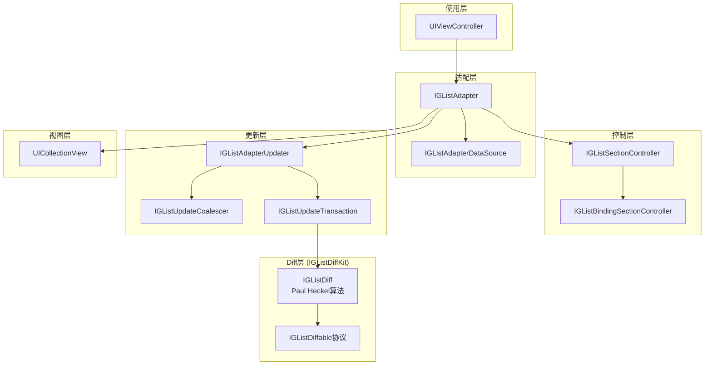
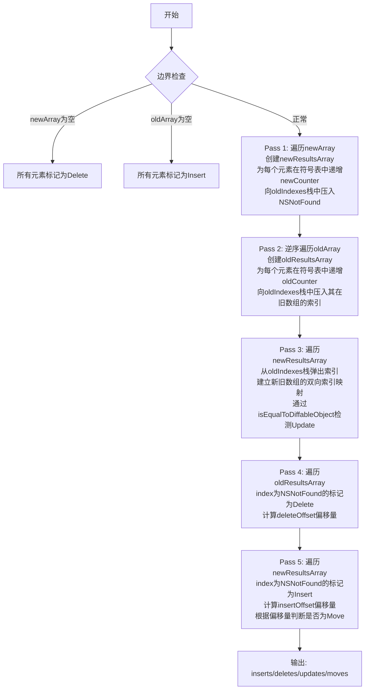
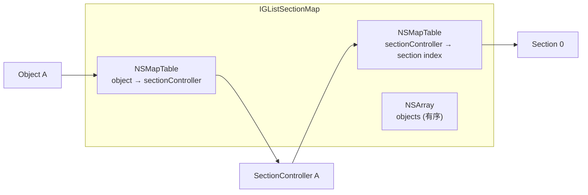
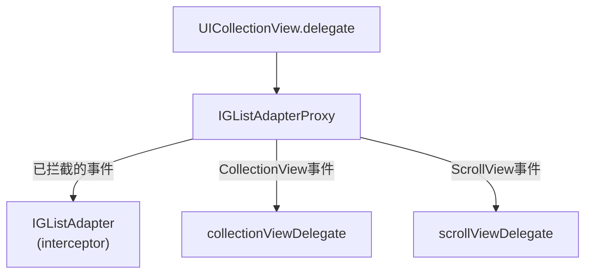
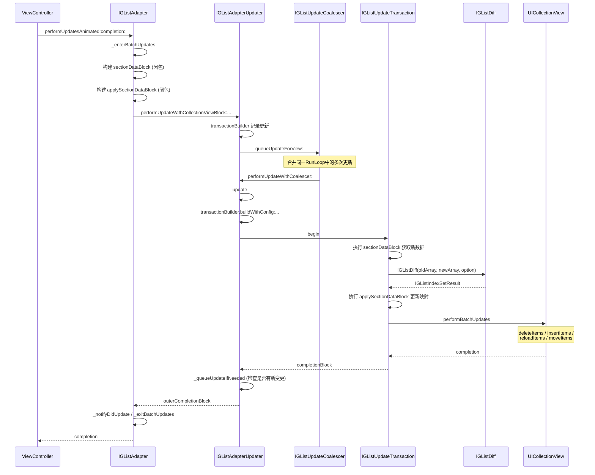
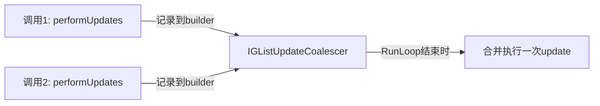
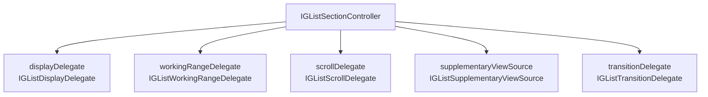
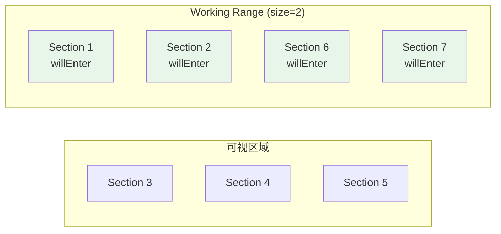
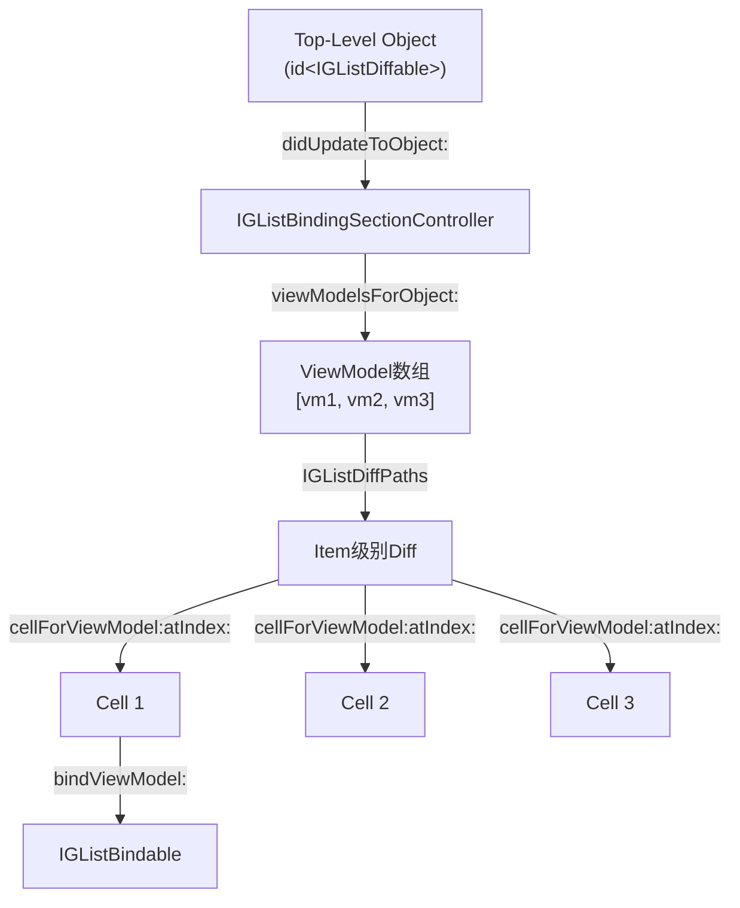
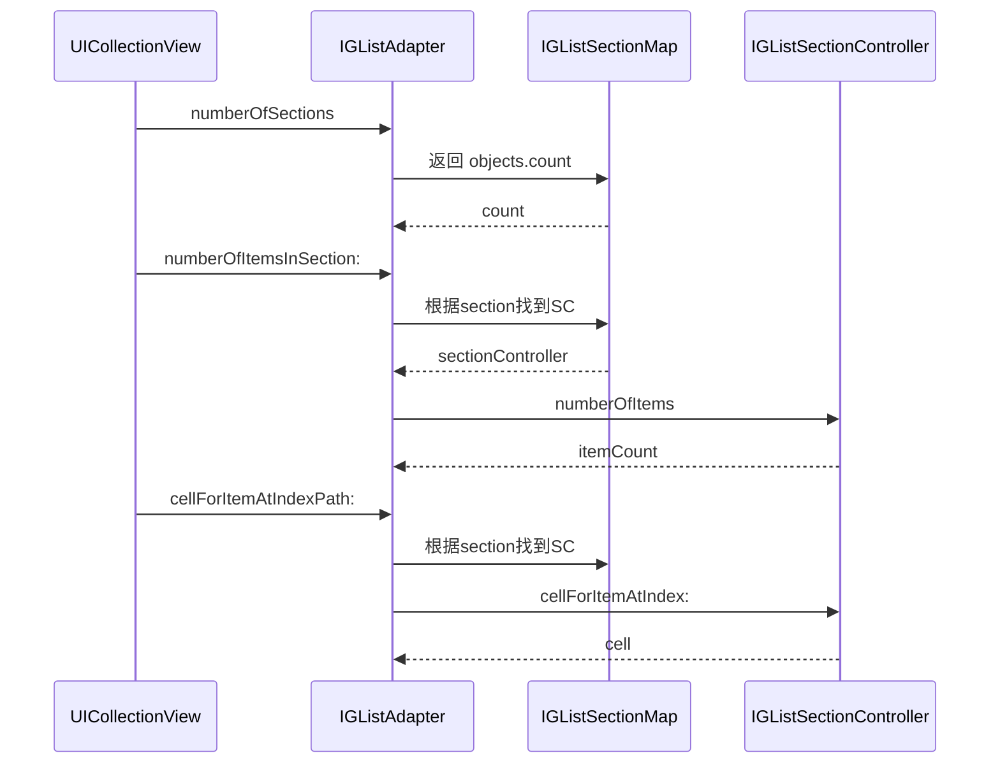

+++
title = "IGListKit源码导读"
date = '2026-05-02T22:32:27+08:00'
draft = false
weight = 3
tags = ["iOS", "源码分析"]
categories = ["iOS开发", "源码分析"]
+++
IGListKit 是 Instagram（Meta）开源的一款数据驱动的 UICollectionView 框架，旨在构建快速、灵活的列表。它的核心思想是将每个数据对象映射为独立的 Section Controller，通过高效的 O(n) Diff 算法自动计算数据变化并应用最小化更新，避免手动调用 `performBatchUpdates` 或 `reloadData`。本文基于 v5.2.0 源码（2026年2月发布）进行分析。

---

## 一、整体架构

IGListKit 采用分层架构，核心由三大模块构成：



**源码目录结构：**

```
Source/
├── IGListDiffKit/             # Diff算法独立模块
│   ├── IGListDiff.mm          # 核心Diff算法（OC++实现）
│   ├── IGListDiffable.h       # Diffable协议定义
│   ├── IGListIndexSetResult.h # Diff结果（IndexSet版）
│   ├── IGListIndexPathResult.h# Diff结果（IndexPath版）
│   ├── IGListMoveIndex.h      # 移动索引封装
│   └── Internal/              # 内部头文件
├── IGListKit/                 # 主框架
│   ├── IGListAdapter.h/m      # 核心适配器
│   ├── IGListAdapterUpdater.m # 更新执行器
│   ├── IGListSectionController.h # Section控制器基类
│   ├── IGListBindingSectionController.h # 绑定式Section控制器
│   ├── IGListSectionMap.h     # Object-SectionController映射
│   ├── IGListDisplayHandler.m # 显示事件处理
│   ├── IGListWorkingRangeHandler.m # Working Range处理
│   ├── IGListAdapterProxy.m   # 代理转发
│   └── Internal/              # 内部实现
└── IGListSwiftKit/            # Swift互操作层
```

**语言构成：** Objective-C 90.3%、Objective-C++ 5.0%、Swift 1.5%。Diff 算法使用 OC++ 实现以利用 STL 容器获得更好的性能。

---

## 二、IGListDiffable — Diff协议

IGListKit 的数据驱动能力建立在 `IGListDiffable` 协议之上。所有被 Adapter 管理的数据对象都必须遵循此协议。

```objc
@protocol IGListDiffable

- (nonnull id<NSObject>)diffIdentifier;
- (BOOL)isEqualToDiffableObject:(nullable id<IGListDiffable>)object;

@end
```

### 2.1 两个方法的职责划分

| 方法 | 职责 | 特性 |
|------|------|------|
| `diffIdentifier` | 唯一标识对象身份 | 值不可变，用于判断"是否为同一对象" |
| `isEqualToDiffableObject:` | 判断内容是否相等 | 用于检测"同一对象的内容是否变化" |

两个方法的协作逻辑：
- `diffIdentifier` 相同 + `isEqualToDiffableObject:` 返回 YES → 无变化
- `diffIdentifier` 相同 + `isEqualToDiffableObject:` 返回 NO → **Update**
- `diffIdentifier` 在旧数组中存在，新数组中不存在 → **Delete**
- `diffIdentifier` 在旧数组中不存在，新数组中存在 → **Insert**
- `diffIdentifier` 相同但位置不同 → **Move**

### 2.2 设计约束

```objc
// diffIdentifier 必须是不可变的
// 错误示例：返回一个可变字段
- (id<NSObject>)diffIdentifier {
    return self.mutableName; // 危险！
}

// 正确示例：返回稳定标识
- (id<NSObject>)diffIdentifier {
    return self.uniqueID;
}
```

IGListKit v5.x 增加了 `diffIdentifier` 变化检测：在更新前后分别拍快照（`_diffIdentifiersSnapshot`），如果同一 SectionController 的 `diffIdentifier` 在更新过程中发生变化，会触发断言。这防止了因标识符变化导致的映射失效。

---

## 三、IGListDiff — Paul Heckel O(n) Diff算法

IGListKit 最核心的技术是其 Diff 算法，改编自 Paul Heckel 1978 年发表的论文"A Technique for Isolating Differences Between Files"。算法使用 Objective-C++ 实现以获得 STL 容器带来的性能优势。

### 3.1 核心数据结构

```cpp
struct IGListEntry {
    NSInteger oldCounter = 0;        // 在旧数组中出现的次数
    NSInteger newCounter = 0;        // 在新数组中出现的次数
    stack<NSInteger> oldIndexes;     // 在旧数组中的位置栈
    BOOL updated = NO;               // 标记内容是否发生变化
};

struct IGListRecord {
    IGListEntry *entry;              // 指向Entry的指针
    mutable NSInteger index;         // 对应数组中的索引，默认NSNotFound

    IGListRecord() {
        entry = NULL;
        index = NSNotFound;
    }
};
```

- **IGListEntry**：符号表中的条目，追踪每个元素在新旧数组中的出现统计
- **IGListRecord**：每个数组元素对应一个 Record，持有指向 Entry 的指针和在对端数组中的映射索引

符号表使用 C++ `unordered_map` 实现，以 `diffIdentifier` 作为 key：

```cpp
unordered_map<id, IGListEntry, IGListHashID, IGListEqualID> table;
```

### 3.2 算法流程

算法分为5个 Pass，时间复杂度 O(n)：



### 3.3 关键源码解读

**Pass 1 — 正向遍历新数组：**

```cpp
vector<IGListRecord> newResultsArray(newCount);
for (NSInteger i = 0; i < newCount; i++) {
    id key = IGListTableKey(newArray[i]);
    IGListEntry &entry = table[key];
    entry.newCounter++;
    entry.oldIndexes.push(NSNotFound);
    newResultsArray[i].entry = &entry;
}
```

每个新元素在符号表中注册，并向 `oldIndexes` 栈压入 `NSNotFound` 作为占位。

**Pass 2 — 逆序遍历旧数组：**

```cpp
vector<IGListRecord> oldResultsArray(oldCount);
for (NSInteger i = oldCount - 1; i >= 0; i--) {
    id key = IGListTableKey(oldArray[i]);
    IGListEntry &entry = table[key];
    entry.oldCounter++;
    entry.oldIndexes.push(i);
    oldResultsArray[i].entry = &entry;
}
```

逆序遍历是为了配合栈的 LIFO 特性：Pass 3 中 pop 出的索引自然是从小到大的顺序，确保匹配的正确性。

**Pass 3 — 建立映射：**

```cpp
for (NSInteger i = 0; i < newCount; i++) {
    IGListEntry *entry = newResultsArray[i].entry;
    const NSInteger originalIndex = entry->oldIndexes.top();
    entry->oldIndexes.pop();

    if (originalIndex < oldCount) {
        const id n = newArray[i];
        const id o = oldArray[originalIndex];
        switch (option) {
        case IGListDiffEquality:
            if (n != o && ![n isEqualToDiffableObject:o]) {
                entry->updated = YES;
            }
            break;
        // ...
        }
    }
    if (originalIndex != NSNotFound
        && entry->newCounter > 0
        && entry->oldCounter > 0) {
        newResultsArray[i].index = originalIndex;
        oldResultsArray[originalIndex].index = i;
    }
}
```

**Pass 4 & 5 — 计算偏移量并输出结果：**

通过 `deleteOffsets` 和 `insertOffsets` 两个偏移量数组，判断元素是否真正发生了移动：

```cpp
// 一个元素的"有效位置" = oldIndex - deleteOffset + insertOffset
// 如果有效位置 != 新索引，则标记为Move
if ((oldIndex - deleteOffset + insertOffset) != i) {
    // 记录Move
}
```

### 3.4 快捷路径优化

算法在一开始就检查两种边界情况：

- **新数组为空**：直接将旧数组全部标记为删除，O(n) 构建结果
- **旧数组为空**：直接将新数组全部标记为插入，O(n) 构建结果

这避免了空数组场景下的不必要计算。

### 3.5 两种Diff模式

```objc
typedef NS_ENUM(NSInteger, IGListDiffOption) {
    IGListDiffPointerPersonality,  // 指针比较
    IGListDiffEquality             // isEqualToDiffableObject: 语义比较
};
```

- `IGListDiffPointerPersonality`：仅通过指针判断对象是否变化。适用于不可变数据模型（每次变更都生成新实例）
- `IGListDiffEquality`：通过 `isEqualToDiffableObject:` 判断内容是否变化。适用于可变数据模型

### 3.6 两种Diff结果

| 类型 | 适用场景 | 索引格式 |
|------|---------|---------|
| `IGListIndexSetResult` | Section级别的Diff | `NSIndexSet` + section index |
| `IGListIndexPathResult` | Item级别的Diff | `NSIndexPath` (section + item) |

```objc
IGListIndexSetResult *IGListDiff(NSArray<id<IGListDiffable>> *oldArray,
                                 NSArray<id<IGListDiffable>> *newArray,
                                 IGListDiffOption option);

IGListIndexPathResult *IGListDiffPaths(NSInteger fromSection,
                                       NSInteger toSection,
                                       NSArray<id<IGListDiffable>> *oldArray,
                                       NSArray<id<IGListDiffable>> *newArray,
                                       IGListDiffOption option);
```

---

## 四、IGListAdapter — 核心适配器

`IGListAdapter` 是 IGListKit 的中枢，承担了 UICollectionView 与数据源之间的桥梁角色。

### 4.1 类定义与核心属性

```objc
NS_SWIFT_UI_ACTOR
@interface IGListAdapter : NSObject

@property (nonatomic, nullable, weak) UIViewController *viewController;
@property (nonatomic, nullable, weak) UICollectionView *collectionView;
@property (nonatomic, nullable, weak) id<IGListAdapterDataSource> dataSource;
@property (nonatomic, nullable, weak) id<IGListAdapterDelegate> delegate;
@property (nonatomic, nullable, weak) id<UICollectionViewDelegate> collectionViewDelegate;
@property (nonatomic, nullable, weak) id<UIScrollViewDelegate> scrollViewDelegate;
@property (nonatomic, nullable, weak) id<IGListAdapterMoveDelegate> moveDelegate;
@property (nonatomic, nullable, weak) id<IGListAdapterPerformanceDelegate> performanceDelegate;
@property (nonatomic, strong, readonly) id<IGListUpdatingDelegate> updater;

@end
```

v5.x 中 `IGListAdapter` 标记了 `NS_SWIFT_UI_ACTOR`，为 Swift 6 的严格并发做准备，确保所有操作限定在主线程。

### 4.2 内部数据结构

```objc
@implementation IGListAdapter {
    NSMapTable *_viewSectionControllerMap;
    NSMutableArray *_queuedCompletionBlocks;
    NSHashTable<id<IGListAdapterUpdateListener>> *_updateListeners;
}
```

Adapter 内部通过 `IGListSectionMap` 维护对象与 SectionController 的映射关系：



`IGListSectionMap` 的 key 查找使用 `diffIdentifier` 的 hash 和 isEqual 实现（通过自定义 `NSPointerFunctions`），而非默认的指针比较：

```objc
static BOOL IGListIsEqual(const void *a, const void *b, NSUInteger (*size)(const void *item)) {
    const id left = (__bridge id)a;
    const id right = (__bridge id)b;
    return [left class] == [right class]
        && [[left diffIdentifier] isEqual:[right diffIdentifier]];
}

static NSUInteger IGListIdentifierHash(const void *item, NSUInteger (*size)(const void *item)) {
    return [[(__bridge id)item diffIdentifier] hash];
}
```

这意味着即使对象实例不同，只要 `diffIdentifier` 相同就能找到对应的 SectionController。

### 4.3 初始化流程

```objc
- (instancetype)initWithUpdater:(id<IGListUpdatingDelegate>)updater
                 viewController:(UIViewController *)viewController
               workingRangeSize:(NSInteger)workingRangeSize {
    if (self = [super init]) {
        // 1. 使用 updater 提供的 PointerFunctions 初始化 SectionMap
        NSPointerFunctions *keyFunctions = [updater objectLookupPointerFunctions];
        NSMapTable *table = [[NSMapTable alloc] initWithKeyPointerFunctions:keyFunctions
                                                      valuePointerFunctions:valueFunctions
                                                                   capacity:0];
        _sectionMap = [[IGListSectionMap alloc] initWithMapTable:table];

        // 2. 初始化内部组件
        _displayHandler = [IGListDisplayHandler new];
        _workingRangeHandler = [[IGListWorkingRangeHandler alloc] initWithWorkingRangeSize:workingRangeSize];
        _updateListeners = [NSHashTable weakObjectsHashTable];

        // 3. Cell复用场景下的 view → sectionController 映射
        _viewSectionControllerMap = [NSMapTable mapTableWithKeyOptions:
            NSMapTableObjectPointerPersonality | NSMapTableStrongMemory
                                                         valueOptions:NSMapTableStrongMemory];

        _updater = updater;
        _viewController = viewController;
    }
    return self;
}
```

### 4.4 数据源协议

```objc
@protocol IGListAdapterDataSource <NSObject>

// 返回驱动列表的数据对象数组
- (NSArray<id<IGListDiffable>> *)objectsForListAdapter:(IGListAdapter *)listAdapter;

// 为每个数据对象返回对应的SectionController
- (IGListSectionController *)listAdapter:(IGListAdapter *)listAdapter
                sectionControllerForObject:(id)object;

// 无数据时显示的空视图
- (nullable UIView *)emptyViewForListAdapter:(IGListAdapter *)listAdapter;

@end
```

### 4.5 setCollectionView 的精妙处理

当设置或切换 CollectionView 时，IGListAdapter 做了大量防御性工作：

```objc
- (void)setCollectionView:(UICollectionView *)collectionView {
    if (_collectionView != collectionView || _collectionView.dataSource != self) {
        // 1. 维护全局 collectionView → adapter 映射，处理Cell复用场景
        static NSMapTable *globalCollectionViewAdapterMap = nil;
        [globalCollectionViewAdapterMap removeObjectForKey:_collectionView];
        [[globalCollectionViewAdapterMap objectForKey:collectionView] setCollectionView:nil];
        [globalCollectionViewAdapterMap setObject:self forKey:collectionView];

        // 2. 清理已注册的Cell和SupplementaryView标识符
        _registeredCellIdentifiers = [NSMutableSet new];
        _registeredSupplementaryViewIdentifiers = [NSMutableSet new];

        // 3. 通过updater的performDataSourceChange包装变更
        [_updater performDataSourceChange:^{
            self->_collectionView.dataSource = nil;
            self->_collectionView = collectionView;
            self->_collectionView.dataSource = self;
            [self _updateObjects];
        }];

        // 4. 关闭预取以保证性能
        _collectionView.prefetchingEnabled = NO;
    }
}
```

`globalCollectionViewAdapterMap` 解决了一个棘手问题：当 UICollectionView 被嵌入到可复用的 UICollectionViewCell 中时，同一个 CollectionView 实例可能被不同的 Adapter 使用。通过全局映射表，确保旧 Adapter 不会错误地更新已被新 Adapter 接管的 CollectionView。

### 4.6 IGListAdapterProxy — 委托转发

IGListAdapter 需要拦截 `UICollectionViewDelegate` 和 `UIScrollViewDelegate` 的事件，同时将无需处理的事件转发给外部设置的 delegate。这通过 `IGListAdapterProxy` 实现：



Proxy 通过 `NSProxy` 实现消息转发，根据方法签名决定由哪个目标处理。

---

## 五、performUpdatesAnimated — 更新全流程

`performUpdatesAnimated:completion:` 是 IGListKit 中使用频率最高的方法，它触发数据 Diff 并自动应用最小化更新到 CollectionView。

### 5.1 完整调用链



### 5.2 Adapter层：构建数据闭包

```objc
- (void)performUpdatesAnimated:(BOOL)animated completion:(IGListUpdaterCompletion)completion {
    [self _enterBatchUpdates];

    // sectionDataBlock: 获取新数据并构建过渡数据
    IGListTransitionDataBlock sectionDataBlock = ^IGListTransitionData *{
        NSArray *toObjects = objectsWithDuplicateIdentifiersRemoved(
            [dataSource objectsForListAdapter:strongSelf]);
        return [strongSelf _generateTransitionDataWithObjects:toObjects dataSource:dataSource];
    };

    // applySectionDataBlock: 应用数据变更到内部映射
    IGListTransitionDataApplyBlock applySectionDataBlock = ^void(IGListTransitionData *data) {
        strongSelf.previousSectionMap = [strongSelf.sectionMap copy];
        [strongSelf _updateWithData:data];
    };

    [updater performUpdateWithCollectionViewBlock:[self _collectionViewBlock]
                                         animated:animated
                                 sectionDataBlock:sectionDataBlock
                            applySectionDataBlock:applySectionDataBlock
                                       completion:outerCompletionBlock];
}
```

`sectionDataBlock` 和 `applySectionDataBlock` 的分离是精心设计的：`sectionDataBlock` 负责收集数据，可以在后台执行（当 `allowsBackgroundDiffing` 开启时）；`applySectionDataBlock` 负责更新 Adapter 的内部状态，必须在 Diff 完成后在主线程执行。

### 5.3 Updater层：事务合并与执行

`IGListAdapterUpdater` 使用事务模式管理更新：

```objc
- (void)update {
    // 防止并发更新
    if (self.transaction && self.transaction.state != IGListBatchUpdateStateIdle) {
        return;
    }

    // 构建事务配置
    IGListUpdateTransactationConfig config = {
        .sectionMovesAsDeletesInserts = _sectionMovesAsDeletesInserts,
        .allowsBackgroundDiffing = _allowsBackgroundDiffing,
        .allowsReloadingOnTooManyUpdates = _allowsReloadingOnTooManyUpdates,
        // ...
    };

    // 从 builder 构建事务
    id<IGListUpdateTransactable> transaction =
        [self.transactionBuilder buildWithConfig:config delegate:_delegate updater:self];
    self.transaction = transaction;
    self.transactionBuilder = [IGListUpdateTransactionBuilder new];

    // 完成回调：检查是否有新变更需要处理
    [transaction addCompletionBlock:^(BOOL finished) {
        strongSelf.transaction = nil;
        [strongSelf _queueUpdateIfNeeded];
    }];

    [transaction begin];
}
```

### 5.4 更新合并（Coalescing）

`IGListUpdateCoalescer` 通过 RunLoop 机制合并同一帧中的多次更新调用：



当在同一个 RunLoop 周期内多次调用 `performUpdatesAnimated` 时，Coalescer 会将所有变更合并为一次 Transaction 执行，避免频繁触发 Diff 和 CollectionView 更新。

### 5.5 Fallback机制

当 Diff 结果的变更数量过多（默认超过100个操作）时，`IGListAdapterUpdater` 会自动降级为 `reloadData`：

```objc
// IGListUpdateTransactationConfig
.allowsReloadingOnTooManyUpdates = YES  // 默认开启
```

这是一个实用的性能保护机制：大量的 batch updates 可能导致主线程长时间阻塞，在这种情况下直接 `reloadData` 反而更快。

### 5.6 数据源变更的同步处理

`performDataSourceChange:` 处理数据源本身的变更（如切换 CollectionView 或 DataSource），与普通更新不同，它需要同步执行：

```objc
- (void)performDataSourceChange:(IGListDataSourceChangeBlock)block {
    if (!self.transaction && ![self.transactionBuilder hasChanges]) {
        block();
        return;
    }

    IGListUpdateTransactionBuilder *builder = [IGListUpdateTransactionBuilder new];
    [builder addDataSourceChange:block];

    // 取消当前事务，合并待处理变更
    if ([self.transaction cancel] && self.lastTransactionBuilder) {
        [builder addChangesFromBuilder:self.lastTransactionBuilder];
    }
    [builder addChangesFromBuilder:self.transactionBuilder];

    // 清理状态并同步执行
    self.transaction = nil;
    self.transactionBuilder = builder;
    [self update];
}
```

---

## 六、IGListSectionController — Section控制器

`IGListSectionController` 是每个 Section 的"控制器"，管理特定数据对象对应的 Cell 的配置、尺寸和交互。

### 6.1 核心方法

```objc
@interface IGListSectionController : NSObject

// 数据绑定
- (void)didUpdateToObject:(id)object;

// Cell配置
- (NSInteger)numberOfItems;
- (CGSize)sizeForItemAtIndex:(NSInteger)index;
- (__kindof UICollectionViewCell *)cellForItemAtIndex:(NSInteger)index;

// 交互处理
- (BOOL)shouldSelectItemAtIndex:(NSInteger)index;
- (void)didSelectItemAtIndex:(NSInteger)index;
- (void)didDeselectItemAtIndex:(NSInteger)index;

// 排序支持
- (BOOL)canMoveItemAtIndex:(NSInteger)index;
- (void)moveObjectFromIndex:(NSInteger)sourceIndex toIndex:(NSInteger)destinationIndex;

@end
```

### 6.2 扩展能力 — Delegate协议族

IGListSectionController 通过一组可选的 delegate 属性扩展功能：



| Delegate | 功能 |
|----------|------|
| `IGListDisplayDelegate` | Cell 的显示/消失事件回调 |
| `IGListWorkingRangeDelegate` | 进入/退出工作范围时的预加载通知 |
| `IGListScrollDelegate` | 滚动事件回调 |
| `IGListSupplementaryViewSource` | Header/Footer 等补充视图的数据源 |
| `IGListTransitionDelegate` | 自定义布局转场动画 |

### 6.3 上下文 — IGListCollectionContext

SectionController 通过 `collectionContext` 与 CollectionView 交互，避免直接持有 CollectionView 的引用：

```objc
@protocol IGListCollectionContext

// Cell出队
- (__kindof UICollectionViewCell *)dequeueReusableCellOfClass:(Class)cellClass
                                         forSectionController:(IGListSectionController *)sectionController
                                                      atIndex:(NSInteger)index;

// 局部更新
- (void)performBatchAnimated:(BOOL)animated
                     updates:(void (^)(id<IGListBatchContext>))updates
                  completion:(void (^)(BOOL))completion;

// 刷新
- (void)reloadSectionController:(IGListSectionController *)sectionController;
- (void)reloadInSectionController:(IGListSectionController *)sectionController atIndexes:(NSIndexSet *)indexes;
- (void)invalidateLayoutForSectionController:(IGListSectionController *)sectionController;

// 尺寸信息
@property (nonatomic, readonly) CGSize containerSize;
@property (nonatomic, readonly) UIEdgeInsets containerInset;
@property (nonatomic, readonly) UIEdgeInsets adjustedContainerInset;

@end
```

IGListAdapter 自身实现了 `IGListCollectionContext` 协议，将自己注入到每个 SectionController 中。

### 6.4 Working Range — 预加载机制

Working Range 是 IGListKit 提供的一种视口扩展机制，允许 SectionController 在即将进入可视区域之前提前准备数据。



当 `workingRangeSize = 2` 时，可视区域前后各2个 Section 会收到进入工作范围的通知。典型用途：

- 提前下载图片
- 预渲染文本
- 预加载数据

`IGListWorkingRangeHandler` 在每次滚动结束后计算当前可见 Section 的范围，并与上一次的范围取差集，通知新进入和离开范围的 SectionController。

---

## 七、IGListBindingSectionController — 绑定式Section控制器

`IGListBindingSectionController` 是 `IGListSectionController` 的子类，提供了更细粒度的 Cell 级别 Diff 能力。

### 7.1 架构设计



### 7.2 核心协议

```objc
@protocol IGListBindingSectionControllerDataSource

// 将顶层对象拆分为ViewModel数组
- (NSArray<id<IGListDiffable>> *)sectionController:
    (IGListBindingSectionController *)sectionController
                              viewModelsForObject:(id)object;

// 为ViewModel出队并返回Cell
- (UICollectionViewCell<IGListBindable> *)sectionController:
    (IGListBindingSectionController *)sectionController
                                    cellForViewModel:(id)viewModel
                                             atIndex:(NSInteger)index;

// 返回Cell尺寸
- (CGSize)sectionController:(IGListBindingSectionController *)sectionController
           sizeForViewModel:(id)viewModel atIndex:(NSInteger)index;

@end

@protocol IGListBindable

// 将ViewModel绑定到Cell
- (void)bindViewModel:(id)viewModel;

@end
```

### 7.3 工作流程

1. 当数据更新时，`didUpdateToObject:` 被调用
2. `IGListBindingSectionController` 通过 `dataSource` 的 `viewModelsForObject:` 获取新的 ViewModel 数组
3. 使用 `IGListDiffPaths` 对旧的和新的 ViewModel 数组做 Item 级别 Diff
4. 根据 Diff 结果，只更新发生变化的 Cell
5. 每个 Cell 通过 `bindViewModel:` 方法接收新的 ViewModel

这种设计的好处是：顶层对象可以包含复杂的数据结构，每个 ViewModel 代表一个 Cell，Cell 级别的更新粒度更细、动画更自然。

### 7.4 约束条件

ViewModel 的 `diffIdentifier` 和 `isEqualToDiffableObject:` 有一个重要约束：**`diffIdentifier` 相同的对象必须始终相等**（`isEqualToDiffableObject:` 返回 YES）。这是因为 `IGListBindingSectionController` 在 Section 级别已经通过 `isEqualToDiffableObject:` 检测到变化了，Cell 级别的 Diff 只需要关注 ViewModel 数组结构的变化（增删移动），而不需要处理"同一ViewModel内容变化"的场景。

---

## 八、UICollectionView DataSource/Delegate 的桥接

### 8.1 Adapter作为DataSource

IGListAdapter 实现了 `UICollectionViewDataSource`，将 CollectionView 的 DataSource 调用桥接到对应的 SectionController：



### 8.2 O(1)查找

IGListAdapter 提供了多个常量时间查找方法：

| 方法 | 复杂度 | 实现 |
|------|--------|------|
| `sectionControllerForSection:` | O(1) | 数组下标访问 |
| `sectionForSectionController:` | O(1) | NSMapTable查找 |
| `sectionControllerForObject:` | O(1) | NSMapTable查找（基于diffIdentifier hash） |
| `objectForSectionController:` | O(1) | NSMapTable反向查找 |
| `objectAtSection:` | O(1) | 数组下标访问 |
| `sectionForObject:` | O(1) | NSMapTable查找 |

---

## 九、性能优化机制

### 9.1 Diff结果到BatchUpdate的转换

IGListKit 在将 Diff 结果应用到 CollectionView 时，需要处理 UICollectionView `performBatchUpdates` 的一些限制：

- **Move 转换为 Delete + Insert**：`sectionMovesAsDeletesInserts` 选项将 Section Move 拆分为删除和插入操作，因为 UICollectionView 在处理同时包含 Move 和 Insert/Delete 的批量更新时可能会出现问题
- **优先 Item Reload**：`preferItemReloadsForSectionReloads` 选项将 Section Reload 转换为 Item Reload，避免整个 Section 的动画重置

### 9.2 重复标识符过滤

```objc
static NSArray *objectsWithDuplicateIdentifiersRemoved(NSArray *objects) {
    // 过滤掉 diffIdentifier 重复的对象，保留首次出现的
}
```

在每次获取数据源对象时，Adapter 会自动过滤重复标识符的对象。这是一层防御性编程，防止重复标识符导致 Diff 算法产生错误结果。

### 9.3 后台Diffing

```objc
IGListUpdateTransactationConfig config = {
    .allowsBackgroundDiffing = YES,
    // ...
};
```

当开启 `allowsBackgroundDiffing` 时，Diff 计算会在后台线程执行，避免大数据量 Diff 阻塞主线程。Diff 完成后再回到主线程应用结果。

### 9.4 性能委托

`IGListAdapterPerformanceDelegate` 提供了细粒度的性能监控点：

```objc
@protocol IGListAdapterPerformanceDelegate <NSObject>

- (void)listAdapterWillCallDequeueCell:(IGListAdapter *)listAdapter;
- (void)listAdapter:(IGListAdapter *)listAdapter didCallDequeueCell:(UICollectionViewCell *)cell;
- (void)listAdapterWillCallDisplayCell:(IGListAdapter *)listAdapter;
- (void)listAdapter:(IGListAdapter *)listAdapter didCallDisplayCell:(UICollectionViewCell *)cell;
- (void)listAdapterWillCallSizeForCell:(IGListAdapter *)listAdapter;
- (void)listAdapter:(IGListAdapter *)listAdapter didCallSizeForCell:(UICollectionViewCell *)cell;
// ...

@end
```

通过这些回调可以精确测量每个操作的耗时，便于定位性能瓶颈。

---

## 十、设计模式运用

| 设计模式 | 应用场景 |
|---------|---------|
| **适配器模式** | `IGListAdapter` 在 UICollectionView 和数据模型之间建立桥梁 |
| **策略模式** | `IGListUpdatingDelegate` 协议允许替换更新策略；`IGListDiffable` 允许自定义比较逻辑 |
| **代理模式** | `IGListAdapterProxy` 实现 delegate 消息的拦截和转发 |
| **建造者模式** | `IGListUpdateTransactionBuilder` 累积变更后统一构建 Transaction |
| **模板方法模式** | `IGListSectionController` 提供默认实现的可重写方法族 |
| **观察者模式** | `IGListAdapterUpdateListener` 监听更新事件 |
| **合并模式** | `IGListUpdateCoalescer` 合并同一 RunLoop 周期内的多次更新 |
| **事务模式** | `IGListUpdateTransactable` 封装更新操作的原子性执行 |
| **组合模式** | `IGListBindingSectionController` 将 Section 拆分为多个 ViewModel 驱动的 Cell |

---

## 十一、与UICollectionView DiffableDataSource的对比

iOS 13 引入了 `UICollectionViewDiffableDataSource`，提供了系统级的 Diff 能力。以下是两者的对比：

| 维度 | IGListKit | DiffableDataSource |
|------|-----------|-------------------|
| 最低版本 | iOS 11+ | iOS 13+ |
| 语言 | Objective-C为主 | Swift优先 |
| Diff算法 | Paul Heckel O(n) | 未公开（Apple内部实现） |
| 架构抽象 | SectionController模式 | Snapshot + CellProvider |
| Cell级别Diff | BindingSectionController | iOS 15 reconfigureItems |
| Working Range | 内建支持 | 需自行实现 |
| 性能监控 | PerformanceDelegate | 无内建支持 |
| 后台Diffing | 支持 | iOS 15+ apply(animatingDifferences:) |
| 更新合并 | Coalescer自动合并 | 手动管理 |
| 可测试性 | SectionController可独立测试 | 需与View绑定 |

IGListKit 的 SectionController 架构在大型复杂列表场景下仍有其优势：每个 Section 的逻辑完全独立，便于团队协作和模块化开发。而 DiffableDataSource 更轻量，适合相对简单的列表场景。
