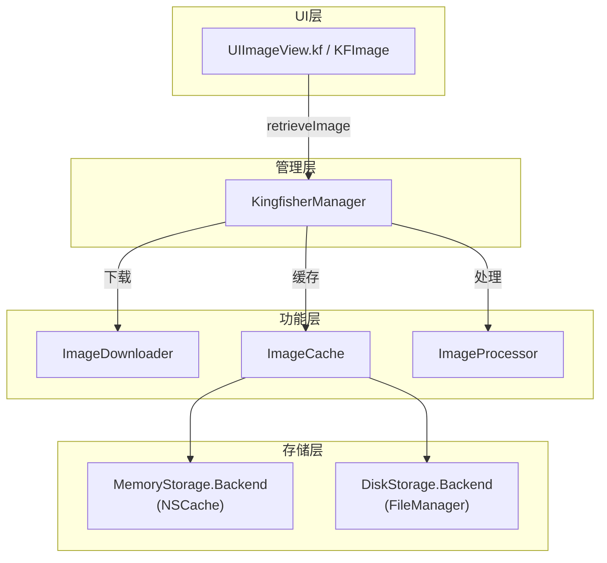
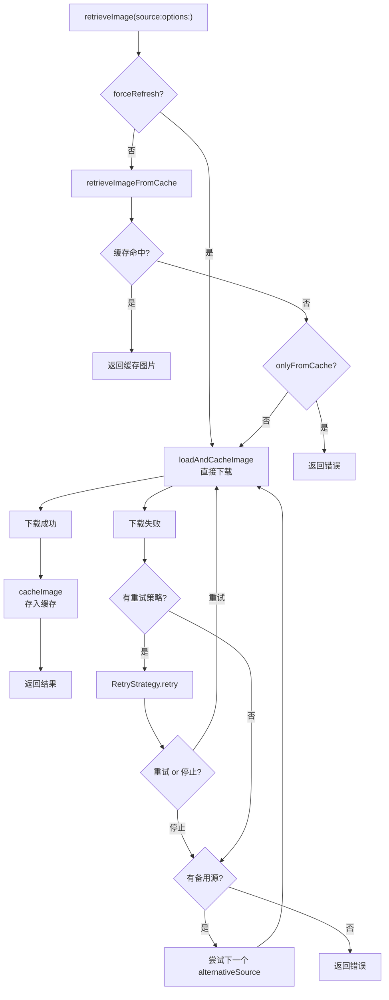
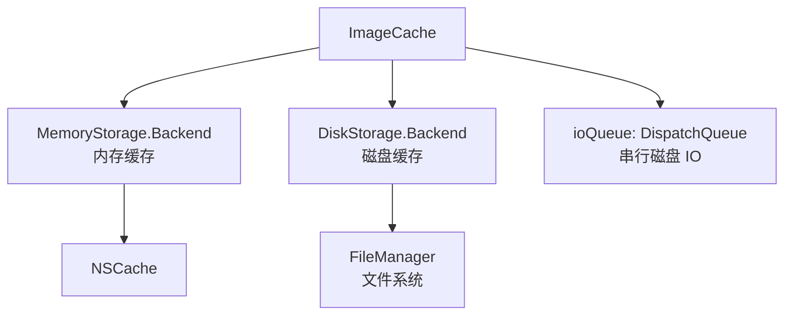
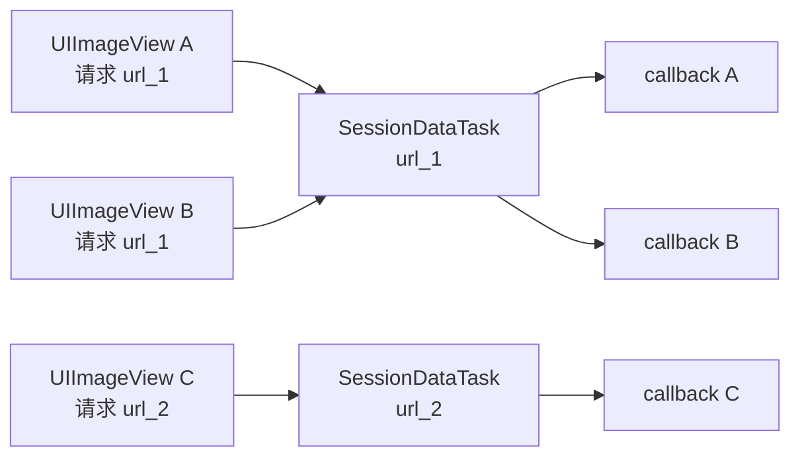
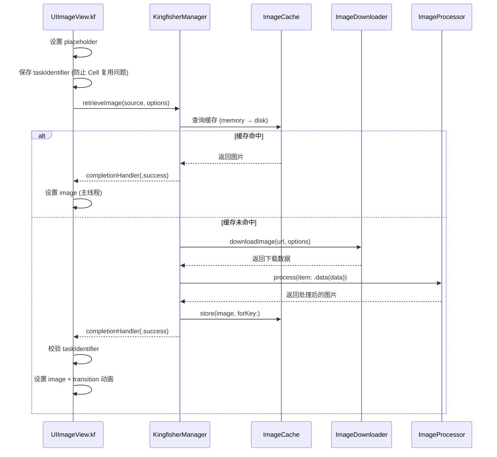

+++
title = "Kingfisher源码导读"
date = '2026-05-02T22:32:27+08:00'
draft = false
weight = 4
tags = ["iOS", "源码分析"]
categories = ["iOS开发", "源码分析"]
+++
Kingfisher 是一款纯 Swift 图片下载和缓存库，支持 iOS、macOS、tvOS、watchOS 和 visionOS 全平台。当前最新版本为 **8.8.0**（2026年3月），已全面适配 Swift 6 严格并发模型。本文基于 v8.x 源码进行分析。

---

## 一、整体架构

Kingfisher 采用**协议导向**的模块化设计，核心由四大组件构成：



**源码目录结构：**

```
Sources/
├── General/        # KingfisherManager, KingfisherOptionsInfo, Resource, Source
├── Networking/     # ImageDownloader, SessionDelegate, ImagePrefetcher
├── Cache/          # ImageCache, MemoryStorage, DiskStorage
├── Image/          # ImageProcessor, 图片格式处理, 滤镜
├── Extensions/     # UIKit/AppKit 扩展 (ImageView+Kingfisher, UIButton+Kingfisher)
├── SwiftUI/        # KFImage, KFAnimatedImage, ImageBinder
├── Views/          # AnimatedImageView
└── Utility/        # 辅助工具类
```

---

## 二、命名空间设计 — KingfisherWrapper

Kingfisher 使用 `kf` 命名空间来避免对系统类型的污染，这是 Swift 社区广泛使用的一种模式。

核心实现在 `Kingfisher.swift` 中：

```swift
public struct KingfisherWrapper<Base>: @unchecked Sendable {
    public let base: Base
    public init(_ base: Base) {
        self.base = base
    }
}

public protocol KingfisherCompatible: AnyObject { }

extension KingfisherCompatible {
    public var kf: KingfisherWrapper<Self> {
        get { return KingfisherWrapper(self) }
        set { }
    }
}

extension KFCrossPlatformImage: KingfisherCompatible { }
extension KFCrossPlatformImageView: KingfisherCompatible { }
extension KFCrossPlatformButton: KingfisherCompatible { }
```

**设计要点：**
- `KingfisherWrapper` 是一个泛型值类型，持有被包装对象的引用
- `KingfisherCompatible` 协议通过 extension 为遵循者自动提供 `.kf` 属性
- `KFCrossPlatformImage` 等跨平台类型别名实现了 iOS/macOS 的统一抽象（在 iOS 上是 `UIImage`，在 macOS 上是 `NSImage`）

通过这种设计，所有 Kingfisher 功能都收敛在 `.kf` 命名空间下：

```swift
imageView.kf.setImage(with: url)
```

---

## 三、KingfisherManager — 中央调度器

`KingfisherManager` 是整个库的入口和协调者，负责串联下载、缓存和处理三大流程。

### 3.1 类定义与单例

```swift
public class KingfisherManager: @unchecked Sendable {
    public static let shared = KingfisherManager()
    
    private var _cache: ImageCache
    private var _downloader: ImageDownloader
    
    public var cache: ImageCache {
        get { propertyQueue.sync { _cache } }
        set { propertyQueue.sync { _cache = newValue } }
    }
    
    public var downloader: ImageDownloader {
        get { propertyQueue.sync { _downloader } }
        set { propertyQueue.sync { _downloader = newValue } }
    }
    
    private let processingQueue: CallbackQueue
    private let propertyQueue = DispatchQueue(label: "com.onevcat.Kingfisher.KingfisherManagerPropertyQueue")
}
```

**线程安全设计：** 所有公开属性通过 `propertyQueue` 进行同步访问，标记 `@unchecked Sendable` 表明手动管理了并发安全。

### 3.2 核心检索流程

`retrieveImage` 是最核心的方法，完整流程如下：



关键源码分析：

```swift
private func retrieveImage(
    with source: Source,
    context: RetrievingContext,
    downloadTaskUpdated: DownloadTaskUpdatedBlock?,
    completionHandler: (@Sendable (Result<RetrieveImageResult, KingfisherError>) -> Void)?
) -> DownloadTask? {
    let options = context.options
    if options.forceRefresh {
        // 强制刷新：跳过缓存直接下载
        return loadAndCacheImage(source: source, context: context,
                                 completionHandler: completionHandler)?.value
    } else {
        // 先查缓存
        let loadedFromCache = retrieveImageFromCache(
            source: source, context: context,
            downloadTaskUpdated: downloadTaskUpdated,
            completionHandler: completionHandler)
        if loadedFromCache { return nil }
        
        if options.onlyFromCache {
            // 仅允许从缓存加载，但缓存未命中
            let error = KingfisherError.cacheError(reason: .imageNotExisting(key: source.cacheKey))
            completionHandler?(.failure(error))
            return nil
        }
        // 缓存未命中，发起下载
        return loadAndCacheImage(source: source, context: context,
                                 completionHandler: completionHandler)?.value
    }
}
```

### 3.3 缓存检索的两层逻辑

`retrieveImageFromCache` 方法体现了 Kingfisher 精细的缓存策略：

**第一层：在目标缓存中查找处理后的图片**
- 使用完整的 `cacheKey`（URL + processor identifier）查找
- 如果命中内存或磁盘缓存，直接返回

**第二层：在原始缓存中查找未处理的原图**
- 当使用了自定义 `ImageProcessor` 时，可能只有原图被缓存
- 找到原图后，使用 processor 处理，然后将处理结果存回目标缓存
- 下次再请求相同 processor + URL 的图片时，就能直接命中第一层

这种两层查找避免了重复下载，只需对已缓存的原图重新执行处理即可。

### 3.4 下载后缓存

`cacheImage` 方法负责将下载的图片存入缓存，使用 `CacheCallbackCoordinator` 来协调多个异步缓存操作的完成时机：

```swift
let coordinator = CacheCallbackCoordinator(
    shouldWaitForCache: options.waitForCache,
    shouldCacheOriginal: needToCacheOriginalImage)

// 缓存处理后的图片
targetCache.store(value.image, original: value.originalData,
                  forKey: source.cacheKey, options: options,
                  toDisk: !options.cacheMemoryOnly) { _ in
    coordinator.apply(.cachingImage) {
        completionHandler?(.success(result))
    }
}

// 如需缓存原图
if needToCacheOriginalImage {
    originalCache.storeToDisk(value.originalData, forKey: source.cacheKey,
                              processorIdentifier: DefaultImageProcessor.default.identifier,
                              expiration: options.diskCacheExpiration) { _ in
        coordinator.apply(.cachingOriginalImage) {
            completionHandler?(.success(result))
        }
    }
}

coordinator.apply(.cacheInitiated) {
    completionHandler?(.success(result))
}
```

`CacheCallbackCoordinator` 通过状态机管理回调触发时机：

- 如果 `waitForCache = false`，在 `.cacheInitiated` 时就立刻回调（不等缓存写入完成）
- 如果 `waitForCache = true`，等所有缓存操作完成后再回调
- 如果需要同时缓存原图和处理图，等两个操作都完成后才回调

### 3.5 备用源与重试策略

当下载失败时，Kingfisher 提供了两种容错机制：

1. **RetryStrategy**：对同一源进行重试，通过 `RetryContext` 追踪重试次数
2. **AlternativeSources**：使用备用图片源，从 `retrievingContext.popAlternativeSource()` 中逐个尝试

还支持 **Low Data Mode**（低数据模式）：当收到网络受限错误时，自动切换到 `lowDataModeSource`（通常是低分辨率图片）。

### 3.6 async/await 支持

v8.x 对所有核心 API 提供了 async/await 版本，使用 `withTaskCancellationHandler` + `withCheckedThrowingContinuation` 桥接回调式 API：

```swift
public func retrieveImage(
    with source: Source,
    options: KingfisherOptionsInfo? = nil,
    progressBlock: DownloadProgressBlock? = nil
) async throws -> RetrieveImageResult {
    // ...
    let task = CancellationDownloadTask()
    return try await withTaskCancellationHandler {
        try await withCheckedThrowingContinuation { continuation in
            let downloadTask = retrieveImage(with: source, ...) { result in
                safeResume(with: result)
            }
            // ...
        }
    } onCancel: {
        Task { await task.task?.cancel() }
    }
}
```

内部使用了 `actor ContinuationState` 来保证 continuation 只被 resume 一次，避免 Swift 6 下的并发警告。

---

## 四、ImageCache — 双层缓存系统

`ImageCache` 是 Kingfisher 缓存系统的统一门面，组合了内存缓存和磁盘缓存。

### 4.1 架构概览



```swift
open class ImageCache: @unchecked Sendable {
    public static let `default` = ImageCache(name: "default")
    
    public let memoryStorage: MemoryStorage.Backend<KFCrossPlatformImage>
    public let diskStorage: DiskStorage.Backend<Data>
    private let ioQueue: DispatchQueue
}
```

### 4.2 MemoryStorage — 基于 NSCache 的内存缓存

**存储结构：**
- 底层使用 `NSCache<NSString, StorageObject<T>>`
- `StorageObject` 包装了值和过期信息
- `keys: Set<String>` 追踪所有存入的 key

**过期管理：**

```swift
class StorageObject<T> {
    var value: T?
    let expiration: StorageExpiration
    private(set) var estimatedExpiration: Date
    
    var isExpired: Bool {
        return estimatedExpiration.isPast
    }
    
    func extendExpiration(_ extendingExpiration: ExpirationExtending) {
        switch extendingExpiration {
        case .none: return
        case .cacheTime:
            self.estimatedExpiration = expiration.estimatedExpirationSinceNow
        case .expirationTime(let expirationTime):
            self.estimatedExpiration = expirationTime.estimatedExpirationSinceNow
        }
    }
}
```

默认配置：
- `expiration`：`.seconds(300)`，即 5 分钟无访问则过期
- `totalCostLimit`：设备物理内存的 1/4（`ProcessInfo.processInfo.physicalMemory / 4`）
- `cleanInterval`：120 秒执行一次过期清理

**后台保持机制：**

NSCache 有一个未在官方文档中明确说明的行为：App 进入后台时，NSCache 会**自动清除所有不遵循 `NSDiscardableContent` 协议的对象**，但会**完全跳过**遵循了该协议的对象——既不移除 entry，也不调用 `discardContentIfPossible()`。

Kingfisher 利用了这一点。当 `keepWhenEnteringBackground` 为 `true` 时，使用 `BackgroundKeepingStorageObject` 包装缓存值：

```swift
class BackgroundKeepingStorageObject<T>: StorageObject<T>, NSDiscardableContent {
    var accessing = true
    func beginContentAccess() -> Bool {
        if value != nil { accessing = true } else { accessing = false }
        return accessing
    }
    func endContentAccess() { accessing = false }
    func discardContentIfPossible() { value = nil }
    func isContentDiscarded() -> Bool { return value == nil }
}
```

仅靠声明遵循 `NSDiscardableContent` 协议，就足以让 NSCache 在 App 进入后台时跳过这些对象的自动清除。协议方法的具体实现（`discardContentIfPossible` 是否真的丢弃内容）在后台驱逐场景下并不影响结果，因为 NSCache 根本不会调用它。

这些协议方法的实际作用是在其他场景下：
- `isContentDiscarded()`：NSCache 的 `object(forKey:)` 在返回 NSDiscardableContent 对象时会调用此方法检查内容是否有效
- `discardContentIfPossible()`：当对象因 `totalCostLimit` 或 `countLimit` 超限被驱逐时，NSCache 会在移除前调用此方法

### 4.3 DiskStorage — 文件系统磁盘缓存

磁盘缓存将数据以文件形式存储在沙盒的 `Caches` 目录下。

**缓存 Key 处理：**
- 文件名使用 URL + processor identifier 计算的 MD5 哈希
- 通过 `computedKey` 方法将 key 和 processor identifier 组合：`"url@processorId"`

**过期策略：**

`StorageExpiration` 枚举定义了多种过期策略：

| 策略 | 说明 |
|------|------|
| `.never` | 永不过期 |
| `.seconds(TimeInterval)` | 指定秒数后过期 |
| `.days(Int)` | 指定天数后过期（默认 7 天） |
| `.date(Date)` | 指定日期过期 |
| `.expired` | 立即过期 |

**自动清理：**

ImageCache 通过系统通知触发清理：

```swift
let notifications: [(Notification.Name, Selector)] = [
    (UIApplication.didReceiveMemoryWarningNotification, #selector(clearMemoryCache)),
    (UIApplication.willTerminateNotification, #selector(cleanExpiredDiskCache)),
    (UIApplication.didEnterBackgroundNotification, #selector(backgroundCleanExpiredDiskCache))
]
```

- 收到内存警告时清空内存缓存
- App 即将终止时清理过期磁盘缓存
- App 进入后台时在后台任务中清理过期磁盘缓存

后台清理使用 `beginBackgroundTask` 确保有足够时间完成：

```swift
@MainActor @objc public func backgroundCleanExpiredDiskCache() {
    guard let sharedApplication = KingfisherWrapper<UIApplication>.shared else { return }
    let createdTask = sharedApplication.beginBackgroundTask(
        withName: "Kingfisher:backgroundCleanExpiredDiskCache",
        expirationHandler: endBackgroundTaskIfNeeded)
    cleanExpiredDiskCache { endBackgroundTaskIfNeeded() }
}
```

### 4.4 检索流程

```swift
open func retrieveImage(forKey key: String, options: KingfisherParsedOptionsInfo, ...) {
    // 1. 先查内存
    if let image = retrieveImageInMemoryCache(forKey: key, options: options) {
        completionHandler(.success(.memory(image)))
    }
    // 2. fromMemoryCacheOrRefresh 模式下只查内存
    else if options.fromMemoryCacheOrRefresh {
        completionHandler(.success(.none))
    }
    // 3. 查磁盘
    else {
        retrieveImageInDiskCache(forKey: key, options: options) { outcome in
            switch outcome {
            case .image(let image):
                // 从磁盘取出后回写到内存缓存
                self.store(image, forKey: key, options: cacheOptions, toDisk: false) { _ in
                    completionHandler(.success(.disk(image)))
                }
            case .notFound, .stale:
                completionHandler(.success(.none))
            }
        }
    }
}
```

**磁盘检索的 Stale 优化（v8.7+）：**

为了避免快速滚动场景下无意义的磁盘 IO，Kingfisher 引入了 `DiskRetrievalOutcome.stale` 状态。在磁盘读取前后各有一次 stale 检查：

```swift
func retrieveImageInDiskCache(forKey key: String, options: ..., outcomeHandler: ...) {
    loadingQueue.execute {
        // CHECK 1: 入队等待期间任务已过时
        if options.isSourceTaskStale {
            outcomeHandler(.success(.stale))
            return
        }
        // ... 磁盘读取 ...
        // CHECK 2: 磁盘读取完成但反序列化前
        if options.isSourceTaskStale {
            outcomeHandler(.success(.stale))
            return
        }
        // ... 反序列化 ...
        // CHECK 3: 反序列化后、后台解码前
        if image != nil, options.isSourceTaskStale {
            outcomeHandler(.success(.stale))
            return
        }
    }
}
```

这在列表快速滚动、Cell 被复用的场景下非常重要，可以及时取消已不需要的缓存读取任务。

---

## 五、ImageDownloader — 网络下载引擎

`ImageDownloader` 基于 `URLSession` 实现，具备任务去重、优先级控制和认证挑战处理等能力。

### 5.1 类定义

```swift
open class ImageDownloader: @unchecked Sendable {
    public static let `default` = ImageDownloader(name: "default")
    
    open var downloadTimeout: TimeInterval = 15.0  // 默认超时 15 秒
    open var sessionConfiguration = URLSessionConfiguration.ephemeral
    open var sessionDelegate: SessionDelegate
    open var requestsUsePipelining = false
    open weak var delegate: (any ImageDownloaderDelegate)?
    open weak var authenticationChallengeResponder: (any AuthenticationChallengeResponsible)?
    
    private var session: URLSession
}
```

默认使用 `URLSessionConfiguration.ephemeral`（临时会话），不使用 URLSession 自身的磁盘缓存，由 Kingfisher 自己管理。

### 5.2 下载任务去重

这是 Kingfisher 的一个重要优化。当多个 `UIImageView` 请求同一个 URL 时，只会发起一个实际的网络请求：

```swift
private func addDownloadTask(context: DownloadingContext, callback: SessionDataTask.TaskCallback) -> DownloadTask {
    lock.lock()
    defer { lock.unlock() }
    
    if let existingTask = sessionDelegate.task(for: context.url) {
        // URL 已有正在进行的任务，复用它
        downloadTask = sessionDelegate.append(existingTask, callback: callback)
    } else {
        // 新建 URLSession dataTask
        let sessionDataTask = session.dataTask(with: context.request)
        sessionDataTask.priority = context.options.downloadPriority
        downloadTask = sessionDelegate.add(sessionDataTask, url: context.url, callback: callback)
    }
    return downloadTask
}
```

`SessionDelegate` 内部维护了一个 URL -> `SessionDataTask` 的映射。每个 `SessionDataTask` 可以关联多个 `TaskCallback`（每个调用者一个）。当下载完成后，所有 callback 都会被触发：



### 5.3 下载完成处理

下载完成后的数据处理链：

```swift
sessionTask.onTaskDone.delegate(on: self) { (self, done) in
    let (result, callbacks) = done
    
    switch result {
    case .success(let (data, response)):
        // 使用 ImageDataProcessor 对每个 callback 分别处理
        let processor = ImageDataProcessor(data: data, callbacks: callbacks,
                                            processingQueue: context.options.processingQueue)
        processor.onImageProcessed.delegate(on: self) { (self, done) in
            let (result, callback) = done
            let imageResult = result.map {
                ImageLoadingResult(image: $0, url: context.url, originalData: data,
                                   metrics: sessionTask?.metrics)
            }
            callback.options.callbackQueue.execute {
                callback.onCompleted?.call(imageResult)
            }
        }
        processor.process()
        
    case .failure(let error):
        callbacks.forEach { callback in
            callback.options.callbackQueue.execute {
                callback.onCompleted?.call(.failure(error))
            }
        }
    }
}
```

每个 callback 可能有不同的 `ImageProcessor`，所以 `ImageDataProcessor` 会为每个 callback 单独处理。

### 5.4 DownloadTask 与取消机制

`DownloadTask` 封装了任务取消逻辑：

```swift
public final class DownloadTask: @unchecked Sendable {
    public private(set) var sessionTask: SessionDataTask?
    public private(set) var cancelToken: SessionDataTask.CancelToken?
    
    public func cancel() {
        guard let sessionTask, let cancelToken else { return }
        sessionTask.cancel(token: cancelToken)
    }
}
```

取消时通过 `cancelToken` 标识具体的回调，只移除自己的回调而不取消底层网络请求（因为可能有其他调用者在等待同一个下载结果）。只有当所有回调都被取消时，才会真正取消 URLSession 任务。

### 5.5 Request 修改器

通过 `ImageDownloadRequestModifier` 协议可以在发送请求前修改 `URLRequest`：

```swift
guard let requestModifier = options.requestModifier else {
    checkRequestAndDone(r: request)
    return
}
if let m = requestModifier as? any ImageDownloadRequestModifier {
    guard let result = m.modified(for: request) else {
        done(.failure(KingfisherError.requestError(reason: .emptyRequest)))
        return
    }
    checkRequestAndDone(r: result)
}
```

这在需要添加认证 Header、自定义 Cache-Control 等场景非常有用。

---

## 六、ImageProcessor — 图片处理管线

`ImageProcessor` 协议定义了图片处理的统一接口：

```swift
public protocol ImageProcessor: Sendable {
    var identifier: String { get }
    func process(item: ImageProcessItem, options: KingfisherParsedOptionsInfo) -> KFCrossPlatformImage?
}
```

### 6.1 核心设计

- **identifier**：每个 processor 有唯一标识，用于缓存 key 的计算。相同处理逻辑的 processor 应有相同的 identifier，这样处理过的图片可以正确地从缓存中取回
- **ImageProcessItem**：支持 `.image(KFCrossPlatformImage)` 和 `.data(Data)` 两种输入

### 6.2 内置处理器

| Processor | 功能 |
|-----------|------|
| `DefaultImageProcessor` | 将 Data 解码为图片，支持 PNG/JPEG/GIF |
| `DownsamplingImageProcessor` | 降采样，直接从数据解码为小尺寸图片，内存效率高 |
| `ResizingImageProcessor` | 缩放到指定尺寸，支持 aspectFit/aspectFill |
| `RoundCornerImageProcessor` | 圆角处理，支持指定角和分数半径 |
| `BlurImageProcessor` | 高斯模糊，基于 Accelerate.framework |
| `OverlayImageProcessor` | 叠加颜色 |
| `TintImageProcessor` | 着色处理 |
| `BlackWhiteProcessor` | 黑白处理 |
| `CroppingImageProcessor` | 裁剪到指定尺寸和锚点 |
| `BorderImageProcessor` | 添加边框 |
| `ColorControlsProcessor` | 亮度/对比度/饱和度调节 |
| `BlendImageProcessor` | 混合模式（仅 iOS） |
| `CompositingImageProcessor` | 合成操作（仅 macOS） |

### 6.3 Processor 链式组合

Kingfisher 定义了自定义操作符 `|>` 来链式组合 Processor：

```swift
infix operator |>: AdditionPrecedence

public func |>(left: any ImageProcessor, right: any ImageProcessor) -> any ImageProcessor {
    return left.append(another: right)
}

extension ImageProcessor {
    public func append(another: any ImageProcessor) -> any ImageProcessor {
        let newIdentifier = identifier.appending("|>\(another.identifier)")
        return GeneralProcessor(identifier: newIdentifier) { item, options in
            if let image = self.process(item: item, options: options) {
                return another.process(item: .image(image), options: options)
            } else {
                return nil
            }
        }
    }
}
```

使用示例：

```swift
let processor = DownsamplingImageProcessor(size: CGSize(width: 100, height: 100))
                |> RoundCornerImageProcessor(cornerRadius: 20)
```

组合后的 identifier 为 `"processorA|>processorB"`，确保不同的处理链有不同的缓存 key。

### 6.4 DownsamplingImageProcessor vs ResizingImageProcessor

`DownsamplingImageProcessor` 和 `ResizingImageProcessor` 都能缩小图片，但实现原理完全不同：

- **ResizingImageProcessor**：先将原图完整解码到内存，再进行缩放。一张 4000x3000 的图片会先占用约 48MB 内存
- **DownsamplingImageProcessor**：使用 `CGImageSource` 的 `kCGImageSourceThumbnailMaxPixelSize` 选项，在解码阶段就直接输出小尺寸图片。内存峰值只与目标尺寸相关

```swift
// DownsamplingImageProcessor 的实现
public func process(item: ImageProcessItem, options: KingfisherParsedOptionsInfo) -> KFCrossPlatformImage? {
    switch item {
    case .image(let image):
        guard let data = image.kf.data(format: .unknown) else { return nil }
        return KingfisherWrapper.downsampledImage(data: data, to: size, scale: options.scaleFactor)
    case .data(let data):
        return KingfisherWrapper.downsampledImage(data: data, to: size, scale: options.scaleFactor)
    }
}
```

在列表场景中应**优先使用 DownsamplingImageProcessor**。

---

## 七、UIKit 扩展 — setImage 全流程

### 7.1 调用入口

```swift
imageView.kf.setImage(with: url)
```

这行代码实际调用了 `KingfisherWrapper<UIImageView>` 上的 `setImage` 方法，内部流程：



### 7.2 Cell 复用安全

在列表滚动场景下，Cell 可能被复用，导致旧的图片回调设置到新的 Cell 上。Kingfisher 通过 `taskIdentifier` 解决这个问题：

- 每次 `setImage` 时生成唯一的 taskIdentifier 并保存到 ImageView 的关联对象中
- 回调返回时检查当前 ImageView 上的 taskIdentifier 是否与发起请求时一致
- 不一致则说明 Cell 已被复用，丢弃本次回调

配合前面提到的 `isSourceTaskStale` 磁盘检索优化，在快速滚动时可以尽早取消不需要的操作。

---

## 八、SwiftUI 集成

### 8.1 KFImage

`KFImage` 是 Kingfisher 为 SwiftUI 提供的声明式图片组件：

```swift
KFImage(URL(string: "https://example.com/image.jpg"))
    .placeholder { ProgressView() }
    .resizable()
    .aspectRatio(contentMode: .fit)
    .frame(width: 200, height: 200)
```

### 8.2 KF Builder 模式

`KF` 提供了流式 API，可以在 UIKit 和 SwiftUI 之间共享配置逻辑：

```swift
// UIKit
KF.url(imageURL)
    .processor(DownsamplingImageProcessor(size: CGSize(width: 100, height: 100)))
    .cacheOriginalImage()
    .set(to: imageView)

// SwiftUI
KF.url(imageURL)
    .processor(DownsamplingImageProcessor(size: CGSize(width: 100, height: 100)))
    .cacheOriginalImage()
    .toSwiftUI()
```

---

## 九、配置选项系统

Kingfisher 通过 `KingfisherOptionsInfoItem` 枚举提供了丰富的配置项，以下是一些关键配置：

| 选项 | 说明 |
|------|------|
| `.targetCache(ImageCache)` | 指定目标缓存 |
| `.downloader(ImageDownloader)` | 指定下载器 |
| `.processor(ImageProcessor)` | 指定图片处理器 |
| `.cacheSerializer(CacheSerializer)` | 自定义缓存序列化 |
| `.forceRefresh` | 强制重新下载，忽略缓存 |
| `.onlyFromCache` | 仅从缓存加载 |
| `.fromMemoryCacheOrRefresh` | 仅查内存缓存，否则重新下载 |
| `.waitForCache` | 等待缓存写入完成才回调 |
| `.cacheMemoryOnly` | 仅缓存到内存 |
| `.cacheOriginalImage` | 同时缓存原图 |
| `.callbackQueue(CallbackQueue)` | 指定回调队列 |
| `.retryStrategy(RetryStrategy)` | 设置重试策略 |
| `.alternativeSources([Source])` | 设置备用图片源 |
| `.lowDataModeSource(Source)` | 低数据模式备用源 |
| `.memoryCacheExpiration(StorageExpiration)` | 内存缓存过期策略 |
| `.diskCacheExpiration(StorageExpiration)` | 磁盘缓存过期策略 |
| `.backgroundDecode` | 后台线程解码 |
| `.downloadPriority(Float)` | 下载优先级 |
| `.progressiveJPEG(ImageProgressive)` | 渐进式 JPEG 支持 |
| `.requestModifier(AsyncImageDownloadRequestModifier)` | 请求修改器 |

这些选项通过 `KingfisherParsedOptionsInfo` 解析为结构体属性，避免每次使用时遍历数组查找。

---

## 十、并发安全设计

Kingfisher v8.x 全面适配了 Swift 6 的严格并发模型，主要策略：

### 10.1 @unchecked Sendable + DispatchQueue

核心类如 `KingfisherManager`、`ImageCache`、`ImageDownloader` 使用 `@unchecked Sendable` 标记，内部通过专用的串行 DispatchQueue 保护可变状态：

```swift
public class KingfisherManager: @unchecked Sendable {
    private let propertyQueue = DispatchQueue(label: "com.onevcat.Kingfisher.KingfisherManagerPropertyQueue")
    
    public var cache: ImageCache {
        get { propertyQueue.sync { _cache } }
        set { propertyQueue.sync { _cache = newValue } }
    }
}
```

### 10.2 NSLock 保护临界区

`ImageDownloader` 使用 `NSLock` 保护任务添加的临界区：

```swift
private func addDownloadTask(...) -> DownloadTask {
    lock.lock()
    defer { lock.unlock() }
    // 操作 sessionDelegate 的任务字典
}
```

### 10.3 @Sendable 闭包

所有回调闭包标记为 `@Sendable`，确保跨线程传递时的安全性：

```swift
public typealias DownloadTaskUpdatedBlock = (@Sendable (_ newTask: DownloadTask?) -> Void)

public typealias DownloadProgressBlock = ((_ receivedSize: Int64, _ totalSize: Int64) -> Void)
```

### 10.4 Actor

async/await 版本中使用 actor 来保护共享状态：

```swift
actor CancellationDownloadTask {
    var task: DownloadTask?
    func setTask(_ task: DownloadTask?) { self.task = task }
}
```

---

## 十一、设计模式运用

| 设计模式 | 应用场景 |
|---------|---------|
| **单例模式** | `KingfisherManager.shared`、`ImageCache.default`、`ImageDownloader.default` |
| **外观模式** | `KingfisherManager` 统一封装下载、缓存、处理三大子系统 |
| **策略模式** | `ImageProcessor` 协议和各种具体处理器、`CacheSerializer` 协议 |
| **装饰器模式** | `KingfisherWrapper` 通过 `.kf` 为系统类型添加功能 |
| **建造者模式** | `KF` builder 的链式 API |
| **观察者模式** | `Delegate<Input, Output>` 类型安全的委托封装 |
| **组合模式** | `ImageProcessor` 的 `|>` 操作符实现处理器链式组合 |
| **协调者模式** | `CacheCallbackCoordinator` 协调多个异步缓存操作 |
| **代理模式** | `SessionDelegate` 作为 URLSession 的代理统一处理所有回调 |

---

## 十二、性能优化总结

1. **下载任务去重**：同一 URL 只发起一次网络请求，多个调用者共享下载结果
2. **降采样优先**：`DownsamplingImageProcessor` 在解码阶段直接输出小图，避免大图占用内存
3. **磁盘读取 Stale 检查**：快速滚动时及时取消过时的磁盘 IO 操作
4. **两级缓存查找**：先查处理图缓存，再查原图缓存，避免重复下载
5. **后台解码**：`backgroundDecode` 选项在后台线程解码，避免 UIKit 在渲染时阻塞主线程
6. **内存缓存成本控制**：使用 NSCache 的 `totalCostLimit`，自动在内存压力时释放
7. **过期自动清理**：定时器清理内存、系统通知触发磁盘清理
8. **渐进式 JPEG**：支持 Progressive JPEG 逐步渲染，提升感知速度
