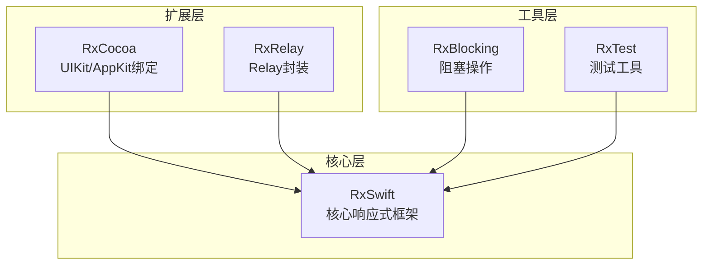
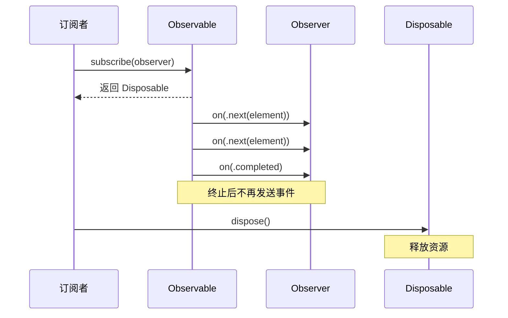
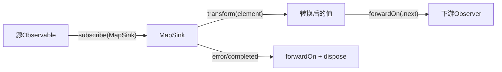
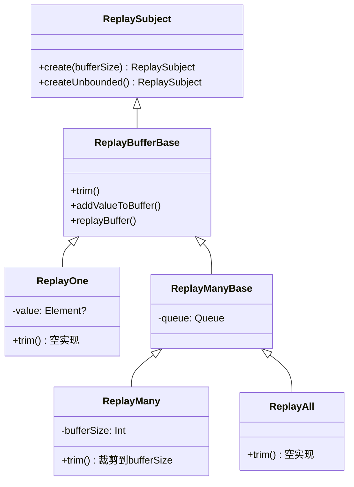
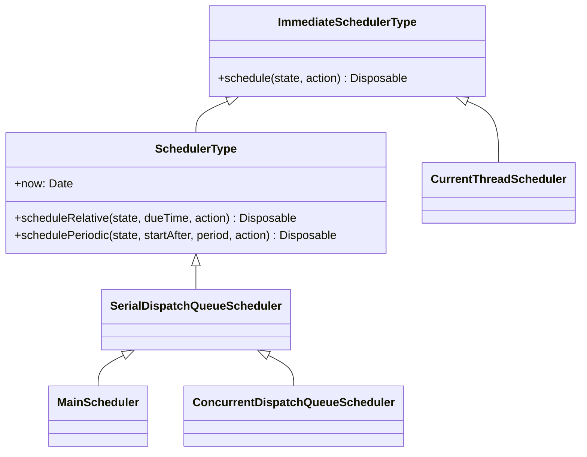
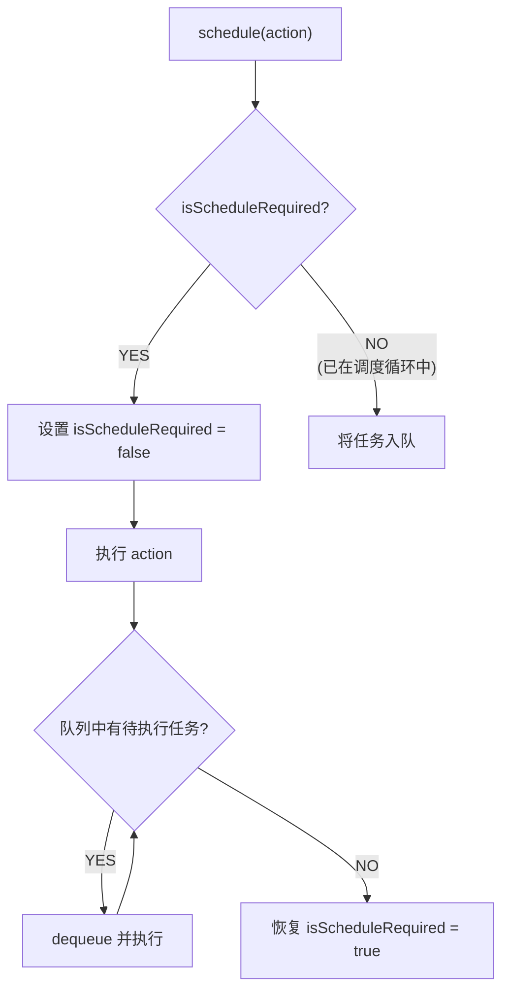
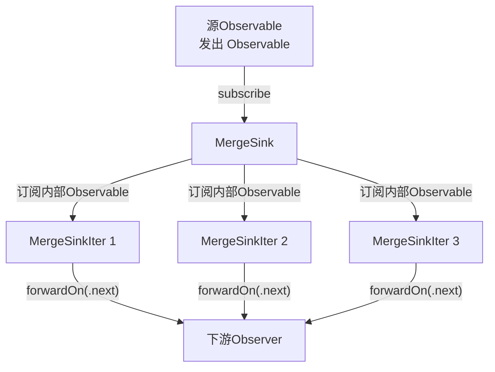
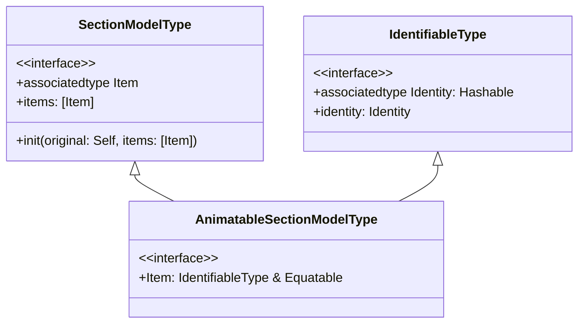
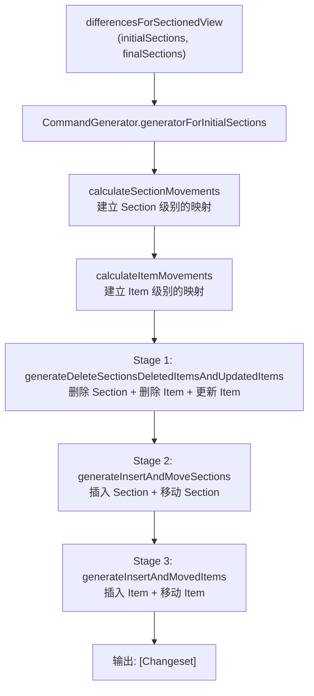
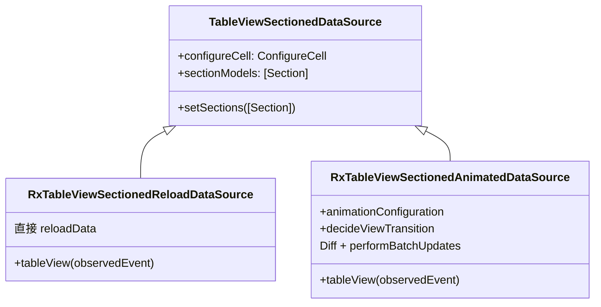

+++
title = "RxSwift源码导读"
date = '2026-05-02T22:32:27+08:00'
draft = false
weight = 5
tags = ["iOS", "源码分析"]
categories = ["iOS开发", "源码分析"]
+++
RxSwift 是 ReactiveX 在 Swift 上的实现，提供了一套完整的响应式编程框架。它通过 Observable 序列和操作符组合的方式，简化了异步编程、事件处理和数据流管理。本文基于 **v6.10.2**（2026年3月发布）源码进行分析。

---

## 一、整体架构

RxSwift 项目采用模块化设计，包含五个独立模块：



**源码目录结构：**

```
RxSwift/
├── Concurrency/           # 并发工具（AsyncLock等）
├── Disposables/           # 资源释放（DisposeBag、CompositeDisposable等）
├── Extensions/            # Swift扩展
├── Observables/           # Observable实现（Create、Map、Filter、Merge等）
├── Observers/             # Observer实现（AnonymousObserver、ObserverBase等）
├── Platform/              # 平台适配（原子操作、锁等）
├── Schedulers/            # 调度器（MainScheduler、SerialDispatchQueueScheduler等）
├── Subjects/              # Subject实现（PublishSubject、BehaviorSubject等）
├── SwiftSupport/          # Swift语言支持
├── Traits/                # 特化序列（Single、Completable、Maybe、Infallible）
├── Observable.swift       # Observable基类
├── ObservableType.swift   # Observable协议
├── ObserverType.swift     # Observer协议
├── Event.swift            # 事件枚举
├── Disposable.swift       # Disposable协议
├── Binder.swift           # UI绑定
├── AnyObserver.swift      # 类型擦除Observer
└── Reactive.swift         # .rx命名空间
```

**语言构成：** 纯 Swift 实现，100% Swift 代码。

---

## 二、核心三要素 — Observable、Observer 与 Event

RxSwift 的整个体系建立在三个核心概念之上：Observable（可观察序列）、Observer（观察者）和 Event（事件）。

### 2.1 Event — 事件枚举

`Event` 是 RxSwift 中最基础的类型，定义了序列能够发出的三种事件：

```swift
@frozen public enum Event<Element> {
    case next(Element)      // 产生一个新元素
    case error(Swift.Error) // 序列因错误终止
    case completed          // 序列正常完成
}
```

**序列文法（Grammar）：** `next* (error | completed)?`

这意味着：
- 序列可以发出零个或多个 `next` 事件
- 最终以一个 `error` 或 `completed` 事件终止
- 终止后不再发出任何事件

`Event` 标记为 `@frozen`，编译器可以对其 switch 进行优化，避免通过 witness table 间接调用。

`Event` 提供了几个便捷属性：

```swift
public extension Event {
    var isStopEvent: Bool {
        switch self {
        case .next: false
        case .error, .completed: true
        }
    }

    var element: Element? {
        if case let .next(value) = self { return value }
        return nil
    }

    var error: Swift.Error? {
        if case let .error(error) = self { return error }
        return nil
    }
}
```

`Event` 还提供了 `map` 方法，支持在事件层面进行转换，transform 抛出异常时自动转为 `.error` 事件：

```swift
func map<Result>(_ transform: (Element) throws -> Result) -> Event<Result> {
    do {
        switch self {
        case let .next(element):
            return try .next(transform(element))
        case let .error(error):
            return .error(error)
        case .completed:
            return .completed
        }
    } catch let e {
        return .error(e)
    }
}
```

### 2.2 ObservableType — Observable 协议

`ObservableType` 定义了"可被订阅"的核心能力：

```swift
public protocol ObservableType: ObservableConvertibleType {
    func subscribe<Observer: ObserverType>(_ observer: Observer) -> Disposable
        where Observer.Element == Element
}
```

这是整个框架的核心协议，只有一个方法 `subscribe`。所有操作符的实现、Subject、Relay 的订阅能力，最终都归结于对这个方法的实现。

`ObservableConvertibleType` 定义了转换能力：

```swift
public protocol ObservableConvertibleType {
    associatedtype Element
    func asObservable() -> Observable<Element>
}
```

### 2.3 Observable — 类型擦除基类

`Observable` 是 `ObservableType` 的类型擦除实现，作为所有具体 Observable 的基类：

```swift
public class Observable<Element>: ObservableType {
    init() {
        #if TRACE_RESOURCES
        _ = Resources.incrementTotal()
        #endif
    }

    public func subscribe<Observer: ObserverType>(_ observer: Observer) -> Disposable
        where Observer.Element == Element {
        rxAbstractMethod()
    }

    public func asObservable() -> Observable<Element> { self }

    deinit {
        #if TRACE_RESOURCES
        _ = Resources.decrementTotal()
        #endif
    }
}
```

`subscribe` 方法标记为抽象方法（调用 `rxAbstractMethod()` 会 `fatalError`），子类必须覆写。`TRACE_RESOURCES` 编译标志用于资源泄漏追踪，每次创建和销毁 Observable 都会增减全局计数器。

### 2.4 ObserverType — 观察者协议

```swift
public protocol ObserverType {
    associatedtype Element
    func on(_ event: Event<Element>)
}

public extension ObserverType {
    func onNext(_ element: Element) { on(.next(element)) }
    func onCompleted() { on(.completed) }
    func onError(_ error: Swift.Error) { on(.error(error)) }
}
```

`ObserverType` 只要求实现一个 `on(_:)` 方法，extension 提供了三个便捷方法简化调用。

### 2.5 AnyObserver — 类型擦除 Observer

`AnyObserver` 通过闭包实现类型擦除，将任意 `ObserverType` 统一为一种类型：

```swift
public struct AnyObserver<Element>: ObserverType {
    public typealias EventHandler = (Event<Element>) -> Void
    private let observer: EventHandler

    public init(eventHandler: @escaping EventHandler) {
        observer = eventHandler
    }

    public init<Observer: ObserverType>(_ observer: Observer)
        where Observer.Element == Element {
        self.observer = observer.on
    }

    public func on(_ event: Event<Element>) {
        observer(event)
    }
}
```

`AnyObserver` 内部持有一个 `EventHandler` 闭包，将类型参数化的 Observer 转换为统一的闭包调用。这是典型的 Swift 类型擦除模式，在 `Observable.create` 的参数类型中被广泛使用。

### 2.6 三者协作关系



---

## 三、Producer 与 Sink — 操作符的实现基石

几乎所有操作符都通过 `Producer` + `Sink` 模式实现。理解这两个类是读懂 RxSwift 操作符源码的关键。

### 3.1 Producer — 延迟订阅的 Observable

`Producer` 继承自 `Observable`，定义了标准的订阅流程：

```swift
class Producer<Element>: Observable<Element> {
    override func subscribe<Observer: ObserverType>(_ observer: Observer) -> Disposable
        where Observer.Element == Element {
        if !CurrentThreadScheduler.isScheduleRequired {
            let disposer = SinkDisposer()
            let sinkAndSubscription = run(observer, cancel: disposer)
            disposer.setSinkAndSubscription(
                sink: sinkAndSubscription.sink,
                subscription: sinkAndSubscription.subscription)
            return disposer
        } else {
            return CurrentThreadScheduler.instance.schedule(()) { _ in
                let disposer = SinkDisposer()
                let sinkAndSubscription = self.run(observer, cancel: disposer)
                disposer.setSinkAndSubscription(
                    sink: sinkAndSubscription.sink,
                    subscription: sinkAndSubscription.subscription)
                return disposer
            }
        }
    }

    func run<Observer: ObserverType>(
        _ observer: Observer, cancel: Cancelable
    ) -> (sink: Disposable, subscription: Disposable)
        where Observer.Element == Element {
        rxAbstractMethod()
    }
}
```

**核心设计：**

1. **Trampoline 调度**：通过 `CurrentThreadScheduler.isScheduleRequired` 检查是否需要使用蹦床调度。首次订阅时直接执行；如果当前已在调度循环中（比如操作符嵌套订阅），则将任务入队，防止无限递归导致栈溢出
2. **run 模板方法**：子类通过覆写 `run` 来创建自己的 Sink 和 Subscription
3. **SinkDisposer**：管理 Sink 和 Subscription 的生命周期，使用原子操作处理 dispose 与 setSinkAndSubscription 的竞态

`SinkDisposer` 使用位标志处理并发：

```swift
private final class SinkDisposer: Cancelable {
    private enum DisposeState: Int32 {
        case disposed = 1
        case sinkAndSubscriptionSet = 2
    }
    private let state = AtomicInt(0)

    func setSinkAndSubscription(sink: Disposable, subscription: Disposable) {
        self.sink = sink
        self.subscription = subscription
        let previousState = fetchOr(state, DisposeState.sinkAndSubscriptionSet.rawValue)
        // 如果 dispose 已经被调用，立刻释放
        if (previousState & DisposeState.disposed.rawValue) != 0 {
            sink.dispose()
            subscription.dispose()
            self.sink = nil
            self.subscription = nil
        }
    }

    func dispose() {
        let previousState = fetchOr(state, DisposeState.disposed.rawValue)
        if (previousState & DisposeState.disposed.rawValue) != 0 { return }
        if (previousState & DisposeState.sinkAndSubscriptionSet.rawValue) != 0 {
            sink?.dispose()
            subscription?.dispose()
            sink = nil
            subscription = nil
        }
    }
}
```

通过 `fetchOr` 原子操作，无论 `dispose()` 和 `setSinkAndSubscription` 谁先执行，都能保证资源被正确释放且只释放一次。

### 3.2 Sink — 事件处理管道

`Sink` 是事件的中间处理节点，持有下游 Observer 的引用：

```swift
class Sink<Observer: ObserverType>: Disposable {
    fileprivate let observer: Observer
    fileprivate let cancel: Cancelable
    private let disposed = AtomicInt(0)

    init(observer: Observer, cancel: Cancelable) {
        self.observer = observer
        self.cancel = cancel
    }

    final func forwardOn(_ event: Event<Observer.Element>) {
        if isFlagSet(disposed, 1) { return }
        observer.on(event)
    }

    func dispose() {
        fetchOr(disposed, 1)
        cancel.dispose()
    }
}
```

**设计要点：**
- `forwardOn` 在转发事件前检查 disposed 标志，避免向已释放的下游发送事件
- `cancel` 持有的是 `SinkDisposer`，调用 dispose 会触发整个订阅链的资源释放
- DEBUG 模式下使用 `SynchronizationTracker` 检测是否有并发发送事件的违规行为

### 3.3 以 Map 为例 — 完整的操作符实现

`map` 操作符是最典型的 Producer + Sink 实现：

```swift
// 入口：扩展 ObservableType
public extension ObservableType {
    func map<Result>(_ transform: @escaping (Element) throws -> Result)
        -> Observable<Result> {
        Map(source: asObservable(), transform: transform)
    }
}

// Producer子类：持有源Observable和transform闭包
private final class Map<SourceType, ResultType>: Producer<ResultType> {
    private let source: Observable<SourceType>
    private let transform: (SourceType) throws -> ResultType

    override func run<Observer: ObserverType>(
        _ observer: Observer, cancel: Cancelable
    ) -> (sink: Disposable, subscription: Disposable)
        where Observer.Element == ResultType {
        let sink = MapSink(transform: transform, observer: observer, cancel: cancel)
        let subscription = source.subscribe(sink)
        return (sink: sink, subscription: subscription)
    }
}

// Sink子类：实际的事件处理逻辑
private final class MapSink<SourceType, Observer: ObserverType>: Sink<Observer>, ObserverType {
    typealias Element = SourceType
    private let transform: (SourceType) throws -> Observer.Element

    func on(_ event: Event<SourceType>) {
        switch event {
        case let .next(element):
            do {
                let mappedElement = try transform(element)
                forwardOn(.next(mappedElement))
            } catch let e {
                forwardOn(.error(e))
                dispose()
            }
        case let .error(error):
            forwardOn(.error(error))
            dispose()
        case .completed:
            forwardOn(.completed)
            dispose()
        }
    }
}
```

**调用链路：**



每个操作符都遵循相同的模式：
1. 定义 `Producer` 子类，持有上游 Observable 和操作所需参数
2. 在 `run` 方法中创建对应的 `Sink`，订阅上游
3. `Sink` 实现 `ObserverType`，接收上游事件后进行处理再转发给下游

---

## 四、Observable.create — 自定义序列

`Observable.create` 是创建自定义 Observable 的核心方法：

```swift
public extension ObservableType {
    static func create(_ subscribe: @escaping (AnyObserver<Element>) -> Disposable)
        -> Observable<Element> {
        AnonymousObservable(subscribe)
    }
}
```

### 4.1 AnonymousObservable

```swift
private final class AnonymousObservable<Element>: Producer<Element> {
    typealias SubscribeHandler = (AnyObserver<Element>) -> Disposable
    let subscribeHandler: SubscribeHandler

    init(_ subscribeHandler: @escaping SubscribeHandler) {
        self.subscribeHandler = subscribeHandler
    }

    override func run<Observer: ObserverType>(
        _ observer: Observer, cancel: Cancelable
    ) -> (sink: Disposable, subscription: Disposable)
        where Observer.Element == Element {
        let sink = AnonymousObservableSink(observer: observer, cancel: cancel)
        let subscription = sink.run(self)
        return (sink: sink, subscription: subscription)
    }
}
```

### 4.2 AnonymousObservableSink

```swift
private final class AnonymousObservableSink<Observer: ObserverType>:
    Sink<Observer>, ObserverType {
    private let isStopped = AtomicInt(0)

    func on(_ event: Event<Element>) {
        switch event {
        case .next:
            if load(isStopped) == 1 { return }
            forwardOn(event)
        case .error, .completed:
            if fetchOr(isStopped, 1) == 0 {
                forwardOn(event)
                dispose()
            }
        }
    }

    func run(_ parent: AnonymousObservable<Element>) -> Disposable {
        parent.subscribeHandler(AnyObserver(self))
    }
}
```

**关键保护机制：**
- `isStopped` 原子标志确保终止事件只被转发一次
- 对 `.next` 事件：如果已停止则直接丢弃
- 对 `.error` / `.completed` 事件：使用 `fetchOr` 原子操作竞争，只有第一个到达的终止事件会被转发并触发 dispose

### 4.3 subscribe 的便捷方法

用户通常不直接构建 Observer，而是使用闭包版的 `subscribe`：

```swift
func subscribe(
    onNext: ((Element) -> Void)? = nil,
    onError: ((Swift.Error) -> Void)? = nil,
    onCompleted: (() -> Void)? = nil,
    onDisposed: (() -> Void)? = nil
) -> Disposable {
    let disposable: Disposable = if let disposed = onDisposed {
        Disposables.create(with: disposed)
    } else {
        Disposables.create()
    }

    let observer = AnonymousObserver<Element> { event in
        switch event {
        case let .next(value):
            onNext?(value)
        case let .error(error):
            if let onError {
                onError(error)
            } else {
                Hooks.defaultErrorHandler(callStack, error)
            }
            disposable.dispose()
        case .completed:
            onCompleted?()
            disposable.dispose()
        }
    }
    return Disposables.create(
        asObservable().subscribe(observer),
        disposable
    )
}
```

当未提供 `onError` 回调时，错误会被转发给 `Hooks.defaultErrorHandler`（DEBUG 模式下打印错误和调用栈），这是一个重要的安全网设计。

---

## 五、Disposable — 资源管理体系

RxSwift 通过 `Disposable` 协议实现了类似 RAII 的确定性资源管理。

### 5.1 Disposable 协议

```swift
public protocol Disposable {
    func dispose()
}
```

### 5.2 DisposeBag — 自动释放

`DisposeBag` 是最常用的 Disposable 管理器，在 `deinit` 时自动 dispose 所有持有的订阅：

```swift
public final class DisposeBag: DisposeBase {
    private var lock = SpinLock()
    private var disposables = [Disposable]()
    private var isDisposed = false

    public func insert(_ disposable: Disposable) {
        _insert(disposable)?.dispose()
    }

    private func _insert(_ disposable: Disposable) -> Disposable? {
        lock.performLocked {
            if self.isDisposed {
                return disposable  // 已释放，立即返回让调用者dispose
            }
            self.disposables.append(disposable)
            return nil
        }
    }

    deinit {
        self.dispose()
    }
}
```

**线程安全设计：**
- 使用 `SpinLock` 保护内部状态
- 如果 DisposeBag 已经被 dispose，新插入的 disposable 会立即被 dispose
- `_insert` 返回需要 dispose 的对象（而非在锁内直接 dispose），避免在持有锁时执行可能耗时的 dispose 操作

`DisposeBag` 还支持 Swift 的 Result Builder：

```swift
public extension DisposeBag {
    @resultBuilder
    struct DisposableBuilder {
        public static func buildBlock(_ disposables: Disposable...) -> [Disposable] {
            disposables
        }
    }

    convenience init(@DisposableBuilder builder: () -> [Disposable]) {
        self.init(disposing: builder())
    }
}
```

这允许使用声明式语法构建 DisposeBag：

```swift
let bag = DisposeBag {
    observable1.subscribe(onNext: { ... })
    observable2.subscribe(onNext: { ... })
}
```

### 5.3 CompositeDisposable — 动态管理

`CompositeDisposable` 支持运行时增删 Disposable，使用 `Bag` 数据结构存储：

```swift
public final class CompositeDisposable: DisposeBase, Cancelable {
    public struct DisposeKey {
        fileprivate let key: BagKey
    }

    private var lock = SpinLock()
    private var disposables: Bag<Disposable>? = Bag()

    public func insert(_ disposable: Disposable) -> DisposeKey? {
        let key = _insert(disposable)
        if key == nil { disposable.dispose() }
        return key
    }

    public func remove(for disposeKey: DisposeKey) {
        _remove(for: disposeKey)?.dispose()
    }

    public func dispose() {
        if let disposables = _dispose() {
            disposeAll(in: disposables)
        }
    }
}
```

`CompositeDisposable` 在 `flatMap`、`merge` 等操作符中广泛使用，用于管理动态增减的内部订阅。当 `disposables` 被置为 `nil` 时表示已 dispose，之后插入的新 disposable 会立即被 dispose。

### 5.4 其他 Disposable 实现

| 类型 | 说明 |
|------|------|
| `SingleAssignmentDisposable` | 只能赋值一次的 Disposable 容器 |
| `SerialDisposable` | 可多次赋值，每次赋新值时自动 dispose 旧值 |
| `BooleanDisposable` | 只有 isDisposed 标志，无实际释放逻辑 |
| `ScheduledDisposable` | 确保在指定 Scheduler 上执行 dispose |
| `NopDisposable` | 空实现，dispose 不做任何事 |
| `BinaryDisposable` | 持有两个 Disposable 的容器 |

---

## 六、Subject — 既是 Observable 又是 Observer

Subject 同时实现了 `ObservableType` 和 `ObserverType`，既可以接收事件也可以发出事件，是连接命令式代码和响应式世界的桥梁。

### 6.1 PublishSubject

`PublishSubject` 只向订阅后的 Observer 广播事件，不缓存历史值：

```swift
public final class PublishSubject<Element>:
    Observable<Element>, SubjectType, Cancelable, ObserverType,
    SynchronizedUnsubscribeType
{
    typealias Observers = AnyObserver<Element>.s  // 即 Bag<(Event<Element>) -> Void>

    private let lock = RecursiveLock()
    private var disposed = false
    private var observers = Observers()
    private var stopped = false
    private var stoppedEvent = nil as Event<Element>?

    public func on(_ event: Event<Element>) {
        dispatch(synchronized_on(event), event)
    }

    func synchronized_on(_ event: Event<Element>) -> Observers {
        lock.lock(); defer { self.lock.unlock() }
        switch event {
        case .next:
            if isDisposed || stopped { return Observers() }
            return observers
        case .completed, .error:
            if stoppedEvent == nil {
                stoppedEvent = event
                stopped = true
                let observers = observers
                self.observers.removeAll()
                return observers
            }
            return Observers()
        }
    }
}
```

**事件分发机制：**

1. `synchronized_on` 在锁内获取需要通知的 Observer 列表
2. `dispatch` 在锁外遍历列表逐个通知

这种"锁内拿快照，锁外发通知"的模式避免了在持有锁时执行用户代码，防止死锁。

**订阅逻辑：**

```swift
func synchronized_subscribe<Observer: ObserverType>(
    _ observer: Observer
) -> Disposable where Observer.Element == Element {
    if let stoppedEvent {
        observer.on(stoppedEvent)      // 已终止，立刻发送终止事件
        return Disposables.create()
    }
    if isDisposed {
        observer.on(.error(RxError.disposed(object: self)))
        return Disposables.create()
    }
    let key = observers.insert(observer.on)
    return SubscriptionDisposable(owner: self, key: key)
}
```

新订阅者如果遇到已终止的 Subject，会立即收到终止事件。`SubscriptionDisposable` 持有 key，dispose 时通过 key 从 observers Bag 中移除。

### 6.2 BehaviorSubject

`BehaviorSubject` 保存最新值，新订阅者立即收到当前值：

```swift
public final class BehaviorSubject<Element>: Observable<Element>, SubjectType, ObserverType, ... {
    private var element: Element        // 保存当前值
    private var observers = Observers()
    private var stoppedEvent: Event<Element>?

    public init(value: Element) {
        element = value
    }

    // 允许同步获取当前值
    public func value() throws -> Element {
        lock.lock(); defer { self.lock.unlock() }
        if isDisposed { throw RxError.disposed(object: self) }
        if let error = stoppedEvent?.error { throw error }
        return element
    }

    func synchronized_on(_ event: Event<Element>) -> Observers {
        lock.lock(); defer { self.lock.unlock() }
        if stoppedEvent != nil || isDisposed { return Observers() }
        switch event {
        case let .next(element):
            self.element = element      // 更新缓存的值
        case .error, .completed:
            stoppedEvent = event
        }
        return observers
    }

    func synchronized_subscribe<Observer: ObserverType>(
        _ observer: Observer
    ) -> Disposable where Observer.Element == Element {
        // ...
        let key = observers.insert(observer.on)
        observer.on(.next(element))    // 订阅时立刻发送当前值
        return SubscriptionDisposable(owner: self, key: key)
    }
}
```

与 PublishSubject 的区别在于：
- 构造时必须提供初始值
- 每次收到 `.next` 时更新 `element`
- 订阅时先注册 Observer，再立即发送当前 `element`

### 6.3 ReplaySubject

`ReplaySubject` 缓存指定数量的历史事件，新订阅者可以收到历史事件的回放：

```swift
public class ReplaySubject<Element>: Observable<Element>, SubjectType, ObserverType, Disposable {
    public static func create(bufferSize: Int) -> ReplaySubject<Element> {
        if bufferSize == 1 {
            ReplayOne()          // 特化实现，只缓存1个值
        } else {
            ReplayMany(bufferSize: bufferSize)
        }
    }

    public static func createUnbounded() -> ReplaySubject<Element> {
        ReplayAll()              // 缓存所有值
    }
}
```

`ReplaySubject` 使用策略模式，根据 bufferSize 选择不同的内部实现：



- **ReplayOne**：bufferSize 为 1 时使用，只用一个 `Optional<Element>` 存储，避免 Queue 的开销
- **ReplayMany**：使用环形 `Queue` 存储，`trim()` 时移除超出 bufferSize 的旧元素
- **ReplayAll**：无 trim 逻辑，Queue 无限增长

订阅时先回放缓存的事件，再正常订阅后续事件：

```swift
func synchronized_subscribe<Observer: ObserverType>(
    _ observer: Observer
) -> Disposable where Observer.Element == Element {
    // ...
    let anyObserver = observer.asObserver()
    replayBuffer(anyObserver)           // 回放缓存事件
    if let stoppedEvent {
        observer.on(stoppedEvent)       // 如果已终止，发送终止事件
        return Disposables.create()
    } else {
        let key = observers.insert(observer.on)
        return SubscriptionDisposable(owner: self, key: key)
    }
}
```

### 6.4 AsyncSubject

`AsyncSubject` 只在源序列完成时发出最后一个值：

```swift
public final class AsyncSubject<Element>: Observable<Element>, SubjectType, ObserverType, ... {
    private var lastElement: Element?

    func synchronized_on(_ event: Event<Element>) -> (Observers, Event<Element>) {
        lock.lock(); defer { self.lock.unlock() }
        if isStopped { return (Observers(), .completed) }
        switch event {
        case let .next(element):
            lastElement = element        // 只记录最新值，不通知
            return (Observers(), .completed)
        case .error:
            // 直接通知error
            stoppedEvent = event
            let observers = observers
            self.observers.removeAll()
            return (observers, event)
        case .completed:
            let observers = observers
            self.observers.removeAll()
            if let lastElement {
                stoppedEvent = .next(lastElement)
                return (observers, .next(lastElement))  // 发出最后一个值
            } else {
                stoppedEvent = event
                return (observers, .completed)
            }
        }
    }
}
```

收到 `.next` 时只缓存值不通知；收到 `.completed` 时，才将最后一个值和 `.completed` 事件一起发送。

### 6.5 Subject 对比

| 特性 | PublishSubject | BehaviorSubject | ReplaySubject | AsyncSubject |
|------|---------------|-----------------|---------------|--------------|
| 缓存 | 无 | 最新1个值 | 最近N个值 | 最后1个值 |
| 新订阅者 | 只收后续事件 | 立即收到当前值 | 立即收到缓存值 | completed时收到最后值 |
| 初始值 | 不需要 | 必须提供 | 不需要 | 不需要 |
| 锁类型 | RecursiveLock | RecursiveLock | RecursiveLock | RecursiveLock |

---

## 七、Relay — 不会终止的 Subject

Relay 定义在 RxRelay 模块中，是 Subject 的安全包装，既不能发出 `error` 也不能发出 `completed` 事件。

### 7.1 PublishRelay

```swift
public final class PublishRelay<Element>: ObservableType {
    private let subject: PublishSubject<Element>

    public func accept(_ event: Element) {
        subject.onNext(event)
    }

    public init() {
        subject = PublishSubject()
    }

    public func subscribe<Observer: ObserverType>(
        _ observer: Observer
    ) -> Disposable where Observer.Element == Element {
        subject.subscribe(observer)
    }
}
```

### 7.2 BehaviorRelay

```swift
public final class BehaviorRelay<Element>: ObservableType {
    private let subject: BehaviorSubject<Element>

    public func accept(_ event: Element) {
        subject.onNext(event)
    }

    public var value: Element {
        try! subject.value()  // 安全的force unwrap，因为subject不会error
    }

    public init(value: Element) {
        subject = BehaviorSubject(value: value)
    }
}
```

**设计决策：**
- Relay 只暴露 `accept(_:)` 方法，不暴露 `onError` / `onCompleted`
- 内部使用 Subject 实现所有逻辑，Relay 只是一层薄包装
- `BehaviorRelay.value` 使用 `try!` 是安全的，因为底层 BehaviorSubject 永远不会收到 error 事件
- Relay 实现了 `ObservableType` 但没有实现 `ObserverType`，防止意外绑定到可能出错的序列

---

## 八、Scheduler — 调度器

Scheduler 是 RxSwift 对"执行上下文"的抽象，控制代码在哪个线程/队列上执行。

### 8.1 协议层次



- `ImmediateSchedulerType`：立即调度，只有 `schedule` 方法
- `SchedulerType`：支持延迟调度和周期调度

### 8.2 MainScheduler — 主线程调度器

```swift
public final class MainScheduler: SerialDispatchQueueScheduler {
    let numberEnqueued = AtomicInt(0)
    public static let instance = MainScheduler()

    override func scheduleInternal<StateType>(
        _ state: StateType,
        action: @escaping (StateType) -> Disposable
    ) -> Disposable {
        let previousNumberEnqueued = increment(numberEnqueued)

        if DispatchQueue.isMain, previousNumberEnqueued == 0 {
            let disposable = action(state)
            decrement(numberEnqueued)
            return disposable
        }

        let cancel = SingleAssignmentDisposable()
        mainQueue.async {
            if !cancel.isDisposed {
                cancel.setDisposable(action(state))
            }
            decrement(self.numberEnqueued)
        }
        return cancel
    }
}
```

**优化策略：** 如果当前已在主线程且没有排队的任务（`previousNumberEnqueued == 0`），直接同步执行，避免不必要的 `async` 开销。这是 `observe(on: MainScheduler.instance)` 高效的关键——在已经处于主线程时不产生额外的 GCD 调度。

对应地，`MainScheduler.asyncInstance` 总是异步调度，适用于需要打破递归的场景。

### 8.3 CurrentThreadScheduler — 蹦床调度器

`CurrentThreadScheduler`（又称 trampoline scheduler）确保任务在当前线程按顺序执行，是 Producer 内部使用的默认调度器：

```swift
public class CurrentThreadScheduler: ImmediateSchedulerType {
    static var queue: ScheduleQueue? // Thread-local storage

    public func schedule<StateType>(
        _ state: StateType,
        action: @escaping (StateType) -> Disposable
    ) -> Disposable {
        if CurrentThreadScheduler.isScheduleRequired {
            CurrentThreadScheduler.isScheduleRequired = false
            let disposable = action(state)

            defer {
                CurrentThreadScheduler.isScheduleRequired = true
                CurrentThreadScheduler.queue = nil
            }

            guard let queue = CurrentThreadScheduler.queue else {
                return disposable
            }
            // 排空队列中的待执行任务
            while let latest = queue.value.dequeue() {
                if latest.isDisposed { continue }
                latest.invoke()
            }
            return disposable
        }

        // 已在调度循环中，将任务入队
        let existingQueue = CurrentThreadScheduler.queue
        let queue: RxMutableBox<Queue<ScheduledItemType>>
        if let existingQueue {
            queue = existingQueue
        } else {
            queue = RxMutableBox(Queue<ScheduledItemType>(capacity: 1))
            CurrentThreadScheduler.queue = queue
        }
        let scheduledItem = ScheduledItem(action: action, state: state)
        queue.value.enqueue(scheduledItem)
        return scheduledItem
    }
}
```

**蹦床调度原理：**



核心思想：首次调用直接执行；在执行过程中如果产生新的调度请求（递归调度），不立即执行而是入队，等当前任务完成后再逐个执行。使用 `pthread_key` 实现的 Thread-Local Storage 确保每个线程独立。

### 8.4 observe(on:) vs subscribe(on:)

这两个操作符是 Scheduler 最常用的入口：

| 操作符 | 影响范围 | 使用场景 |
|--------|---------|---------|
| `observe(on:)` | 下游 Observer 的回调线程 | 将结果切换到主线程更新UI |
| `subscribe(on:)` | 上游 Observable 的订阅和取消线程 | 将耗时订阅放到后台线程 |

`observe(on:)` 针对 `SerialDispatchQueueScheduler` 有专门的优化实现 `ObserveOnSerialDispatchQueueSink`，直接使用队列调度而不需要通用的状态机。

通用版 `ObserveOnSink` 使用状态机和队列管理事件：

```swift
private final class ObserveOnSink<Observer: ObserverType>: ObserverBase<Observer.Element> {
    var state = ObserveOnState.stopped
    var queue = Queue<Event<Element>>(capacity: 10)

    override func onCore(_ event: Event<Element>) {
        let shouldStart = lock.performLocked { () -> Bool in
            self.queue.enqueue(event)
            switch self.state {
            case .stopped:
                self.state = .running
                return true
            case .running:
                return false
            }
        }
        if shouldStart {
            scheduleDisposable.disposable = scheduler.scheduleRecursive((), action: run)
        }
    }
}
```

当首个事件到达时启动调度循环（`.stopped` → `.running`），后续事件入队。调度回调中逐个 dequeue 处理，队列为空时回到 `.stopped` 状态。

---

## 九、Binder — UI 绑定

`Binder` 专为 UI 绑定设计，强制在指定 Scheduler 上执行，且不允许绑定 error 事件：

```swift
public struct Binder<Value>: ObserverType {
    private let binding: (Event<Value>) -> Void

    public init<Target: AnyObject>(
        _ target: Target,
        scheduler: ImmediateSchedulerType = MainScheduler(),
        binding: @escaping (Target, Value) -> Void
    ) {
        self.binding = { [weak target] event in
            switch event {
            case let .next(element):
                _ = scheduler.schedule(element) { element in
                    if let target {
                        binding(target, element)
                    }
                    return Disposables.create()
                }
            case let .error(error):
                rxFatalErrorInDebug("Binding error: \(error)")
            case .completed:
                break
            }
        }
    }
}
```

**设计要点：**
- **弱引用 target**：通过 `[weak target]` 避免循环引用，target 被释放后绑定自动失效
- **Scheduler 调度**：默认使用 `MainScheduler()`，确保 UI 更新在主线程
- **error 处理**：DEBUG 下 `fatalError`，Release 下仅打印日志。这遵循了"UI 绑定不应出现 error"的设计理念
- **completed 忽略**：UI 绑定不关心序列完成

---

## 十、Traits — 特化序列类型

Traits 是对 Observable 施加额外约束的特化类型，通过类型系统表达语义约束。

### 10.1 Infallible — 不会出错的序列

```swift
public struct Infallible<Element>: InfallibleType {
    private let source: Observable<Element>

    init(_ source: Observable<Element>) {
        self.source = source
    }

    public func asObservable() -> Observable<Element> { source }
}
```

`Infallible` 保证不会发出 `.error` 事件。它的 `subscribe` 方法不接受 `onError` 回调：

```swift
func subscribe(
    onNext: ((Element) -> Void)? = nil,
    onCompleted: (() -> Void)? = nil,
    onDisposed: (() -> Void)? = nil
) -> Disposable
```

如果底层意外发出了 error，在 DEBUG 模式下会触发 `fatalError`。

### 10.2 其他 Traits

| Trait | 约束 | 典型场景 |
|-------|------|---------|
| `Single<Element>` | 恰好发出一个 `.success` 或一个 `.failure` | 网络请求 |
| `Completable` | 只发出 `.completed` 或 `.error`，无 `.next` | 写入操作 |
| `Maybe<Element>` | 发出 0 或 1 个元素后完成，或 error | 缓存查询 |
| `Infallible<Element>` | 永不 error | UI 数据源 |

这些 Traits 在类型层面约束了序列行为，让 API 的语义更加清晰：

```swift
// Single 的事件类型
public enum SingleEvent<Element> {
    case success(Element)
    case failure(Swift.Error)
}

// Completable 的事件类型
public enum CompletableEvent {
    case error(Swift.Error)
    case completed
}

// Maybe 的事件类型
public enum MaybeEvent<Element> {
    case success(Element)
    case error(Swift.Error)
    case completed
}
```

---

## 十一、操作符实现精选

### 11.1 flatMap / merge — 高阶 Observable 的合并

`flatMap` 和 `merge` 共享同一套实现（`MergeSink`），是 RxSwift 中最复杂的操作符之一：



`MergeSink` 使用 `CompositeDisposable` 管理所有内部订阅：

```swift
private class MergeSink<SourceSequence, SourceElement, Observer: ObserverType>:
    Sink<Observer>, ObserverType
    where Observer.Element == SourceSequence.Element {

    let group = CompositeDisposable()
    let sourceSubscription = SingleAssignmentDisposable()
    var activeCount = 0
    var stopped = false

    func on(_ event: Event<SourceElement>) {
        switch event {
        case let .next(element):
            if let value = nextElementArrived(element: element) {
                subscribeInner(value.asObservable())
            }
        case let .error(error):
            lock.performLocked {
                self.forwardOn(.error(error))
                self.dispose()
            }
        case .completed:
            lock.performLocked {
                self.stopped = true
                self.sourceSubscription.dispose()
                self.checkCompleted()
            }
        }
    }

    func checkCompleted() {
        if stopped, activeCount == 0 {
            forwardOn(.completed)
            dispose()
        }
    }
}
```

完成判断：只有当源序列 completed（`stopped = true`）且所有内部序列都已完成（`activeCount == 0`）时，才向下游发送 `.completed`。

`flatMap` 与 `merge` 的关系：
- `merge()` 直接将 `Observable<Observable<E>>` 展平为 `Observable<E>`
- `flatMap` = `map` + `merge`，先将元素映射为 Observable 再合并

### 11.2 MergeLimited — 并发控制的合并

`merge(maxConcurrent:)` 和 `concatMap` 使用 `MergeLimitedSink` 实现：

```swift
private class MergeLimitedSink<SourceSequence, SourceElement, Observer: ObserverType>:
    Sink<Observer>, ObserverType {

    let maxConcurrent: Int
    var activeCount = 0
    var queue = QueueType(capacity: 2)

    private final func nextElementArrived(element: SourceElement) -> SourceSequence? {
        lock.performLocked {
            if self.activeCount < self.maxConcurrent {
                self.activeCount += 1
                return try self.performMap(element)   // 可以立即订阅
            } else {
                self.queue.enqueue(try self.performMap(element))  // 入队等待
                return nil
            }
        }
    }

    func dequeueNextAndSubscribe() {
        if let next = queue.dequeue() {
            // 使用 CurrentThreadScheduler 调度，避免栈溢出
            let disposable = CurrentThreadScheduler.instance.schedule(()) { _ in
                self.lock.performLocked {
                    self.subscribe(next, group: self.group)
                }
            }
            _ = group.insert(disposable)
        } else {
            activeCount -= 1
            if stopped, activeCount == 0 {
                forwardOn(.completed)
                dispose()
            }
        }
    }
}
```

当 `maxConcurrent = 1` 时就是 `concat` 语义——串行执行每个内部 Observable。

### 11.3 Filter

```swift
private final class FilterSink<Observer: ObserverType>: Sink<Observer>, ObserverType {
    private let predicate: (Element) throws -> Bool

    func on(_ event: Event<Element>) {
        switch event {
        case let .next(value):
            do {
                let satisfies = try predicate(value)
                if satisfies {
                    forwardOn(.next(value))
                }
            } catch let e {
                forwardOn(.error(e))
                dispose()
            }
        case .completed, .error:
            forwardOn(event)
            dispose()
        }
    }
}
```

`filter` 的实现简洁明了：对 `.next` 事件应用谓词，通过则转发，不通过则丢弃。predicate 抛出异常时转为 `.error` 事件。所有终止事件直接转发并 dispose。

---

## 十二、并发安全设计

### 12.1 锁机制

RxSwift 使用多种锁机制保护不同场景：

| 锁类型 | 使用场景 |
|--------|---------|
| `SpinLock` | 短临界区，如 DisposeBag、ObserveOnSink |
| `RecursiveLock` | Subject 等可能递归进入的场景 |
| `AtomicInt` + `fetchOr` | Sink 的 disposed 标志、SinkDisposer 状态机 |
| `NSLock` | 需要等待的场景 |

### 12.2 原子操作

RxSwift 大量使用原子操作实现无锁并发控制：

```swift
// Sink 中的 disposed 标志
private let disposed = AtomicInt(0)

final func forwardOn(_ event: Event<Observer.Element>) {
    if isFlagSet(disposed, 1) { return }  // 原子检查
    observer.on(event)
}

func dispose() {
    fetchOr(disposed, 1)    // 原子设置
    cancel.dispose()
}
```

```swift
// AnonymousObservableSink 中的 isStopped 标志
private let isStopped = AtomicInt(0)

func on(_ event: Event<Element>) {
    switch event {
    case .next:
        if load(isStopped) == 1 { return }
        forwardOn(event)
    case .error, .completed:
        if fetchOr(isStopped, 1) == 0 {    // CAS竞争，只有第一个赢
            forwardOn(event)
            dispose()
        }
    }
}
```

### 12.3 SynchronizationTracker

DEBUG 模式下，RxSwift 使用 `SynchronizationTracker` 检测是否违反了"不能并发发送事件"的约束：

```swift
#if DEBUG
synchronizationTracker.register(synchronizationErrorMessage: .default)
defer { self.synchronizationTracker.unregister() }
#endif
```

如果检测到两个线程同时向同一个 Observer 发送事件，会触发警告或 fatalError。

### 12.4 AsyncLock — 异步锁

`AsyncLock` 用于序列化异步操作，当锁被持有时将新任务入队：

```swift
final class AsyncLock<I: InvocableType>: Disposable, Lock {
    private var queue: Queue<I> = Queue(capacity: 0)
    private var isExecuting: Bool = false

    func invoke(_ action: I) {
        let firstEnqueuedAction = enqueue(action)
        if let firstEnqueuedAction {
            firstEnqueuedAction.invoke()
        } else {
            return  // 有人正在执行，action已入队
        }
        // 执行完后排空队列
        while true {
            let nextAction = dequeue()
            if let nextAction {
                nextAction.invoke()
            } else {
                return
            }
        }
    }
}
```

第一个调用者负责执行自己的任务，以及排空后续入队的所有任务。这保证了任务按入队顺序串行执行，同时避免了线程等待。

---

## 十三、Hooks — 全局钩子

RxSwift 提供 `Hooks` 用于全局行为定制：

```swift
public extension Hooks {
    static var defaultErrorHandler: DefaultErrorHandler
    static var customCaptureSubscriptionCallstack: CustomCaptureSubscriptionCallstack
}
```

- `defaultErrorHandler`：当 subscribe 未提供 `onError` 回调时的默认错误处理器。默认实现在 DEBUG 下打印错误和调用栈
- `customCaptureSubscriptionCallstack`：自定义调用栈捕获逻辑。配合 `Hooks.recordCallStackOnError` 使用，在订阅时记录调用栈，出错时可以追溯到订阅发生的位置

---

## 十四、Bag 数据结构

`Bag` 是 RxSwift 内部的核心数据结构，用于存储 Observer 回调。Subject 中的 `Observers` 类型就是 `Bag<(Event<Element>) -> Void>`。

Bag 的特点：
- **O(1) 插入**：返回一个 `BagKey` 用于后续移除
- **O(1) 删除**：通过 `BagKey` 定位删除
- **高效遍历**：针对 0、1、2 个元素有特化的内联存储，避免数组分配

这种设计非常适合 Observer 管理的场景：大多数 Subject 只有少量订阅者，特化存储避免了不必要的堆分配。

---

## 十五、RxDataSources — 数据驱动的列表

RxDataSources 是 RxSwift 社区维护的列表数据源库，提供了响应式驱动 UITableView / UICollectionView 的能力，支持自动计算 Diff 并应用动画更新。当前最新版本为 **5.0.2**。项目由两个模块组成：**Differentiator**（Diff 算法和协议定义）和 **RxDataSources**（与 RxCocoa 集成的数据源实现）。

### 15.1 协议体系



**SectionModelType** 是基础协议，定义了 Section 必须具备的能力：

```swift
public protocol SectionModelType {
    associatedtype Item
    var items: [Item] { get }
    init(original: Self, items: [Item])
}
```

`init(original:items:)` 的设计意图是：在 Diff 过程中需要创建 Section 的"修改副本"（保留原 Section 的元信息，但替换 items）。Diff 算法内部会验证此初始化器的正确性：

```swift
fileprivate extension AnimatableSectionModelType {
    init(safeOriginal: Self, safeItems: [Item]) throws {
        self.init(original: safeOriginal, items: safeItems)
        if self.items != safeItems || self.identity != safeOriginal.identity {
            throw Diff.Error.invalidInitializerImplementation(
                section: self, expectedItems: safeItems,
                expectedIdentifier: safeOriginal.identity)
        }
    }
}
```

**IdentifiableType** 要求元素提供唯一标识：

```swift
public protocol IdentifiableType {
    associatedtype Identity: Hashable
    var identity: Identity { get }
}
```

**AnimatableSectionModelType** 组合了以上两个协议，并要求 Item 同时满足 `IdentifiableType` 和 `Equatable`——前者用于识别元素身份（判断增删移动），后者用于检测内容变化（判断是否需要更新）。

### 15.2 具体模型类

库提供了两个开箱即用的模型类：

**SectionModel** — 用于 Reload 模式：

```swift
public struct SectionModel<Section, ItemType> {
    public var model: Section
    public var items: [Item]
}

extension SectionModel: SectionModelType {
    public init(original: SectionModel, items: [Item]) {
        self.model = original.model
        self.items = items
    }
}
```

**AnimatableSectionModel** — 用于动画模式：

```swift
public struct AnimatableSectionModel<Section: IdentifiableType, ItemType: IdentifiableType & Equatable> {
    public var model: Section
    public var items: [Item]
}

extension AnimatableSectionModel: AnimatableSectionModelType {
    public var identity: Section.Identity {
        return model.identity
    }

    public init(original: AnimatableSectionModel, items: [Item]) {
        self.model = original.model
        self.items = items
    }
}
```

### 15.3 Diff 算法 — 三阶段更新

RxDataSources 的 Diff 算法与 IGListKit 的 Paul Heckel 算法不同，它针对 UITableView/UICollectionView 的 `performBatchUpdates` 特性做了专门设计。算法生成 1~3 个 `Changeset`，按顺序分阶段执行：



**分阶段执行的原因：** UITableView 的 `performBatchUpdates` 在同时处理 Section 移动和 Item 变更时存在已知的崩溃问题。作者在源码注释中坦言：

> *"I've uncovered this case during random stress testing of logic. This is the hardest generic update case that causes two passes..."*

> *"If anyone knows how to make this work for one Changeset, PR is welcome."*

因此算法将操作拆分为多个 Changeset，每个 Changeset 独立执行一次 `performBatchUpdates`，以规避 UIKit 的限制。

**核心数据结构：**

```swift
// Section 关联数据
private struct SectionAssociatedData {
    var event: EditEvent       // untouched / deleted / moved / movedAutomatically / inserted
    var indexAfterDelete: Int?  // 删除其他 section 后的偏移索引
    var moveIndex: Int?         // 在对端数组中的映射位置
    var itemCount: Int
}

// Item 关联数据
private struct ItemAssociatedData {
    var event: EditEvent
    var indexAfterDelete: Int?
    var moveIndex: ItemPath?    // 在对端数组中的映射位置
}
```

`EditEvent` 的 7 种状态精确区分了不同类型的变更：

| 状态 | 含义 |
|------|------|
| `.untouched` | 未变化 |
| `.deleted` | 在旧数组中存在，新数组中不存在 |
| `.deletedAutomatically` | 所在 Section 被删除，Item 自动随之删除 |
| `.inserted` | 在新数组中存在，旧数组中不存在 |
| `.insertedAutomatically` | 所在 Section 是新插入的，Item 自动随之插入 |
| `.moved` | 同一元素位置发生变化，需要显式 move 指令 |
| `.movedAutomatically` | 位置变化是由 Section 移动导致的，不需要额外指令 |

**性能优化 — OptimizedIdentity：**

Diff 过程中需要大量的 Identity 字典查找。为了避免 Swift Dictionary 的 ARC 和桥接开销，算法使用 `UnsafePointer` 封装了一个零拷贝的 Identity 包装器：

```swift
private struct OptimizedIdentity<Identity: Hashable>: Hashable {
    let identity: UnsafePointer<Identity>
    private let cachedHashValue: Int

    init(_ identity: UnsafePointer<Identity>) {
        self.identity = identity
        self.cachedHashValue = identity.pointee.hashValue
    }

    static func == (lhs: OptimizedIdentity, rhs: OptimizedIdentity) -> Bool {
        if lhs.hashValue != rhs.hashValue { return false }
        if lhs.identity.distance(to: rhs.identity) == 0 { return true }
        return lhs.identity.pointee == rhs.identity.pointee
    }
}
```

通过缓存 hashValue 和指针比较短路，减少了大量重复的 hash 计算和值比较。同时使用 `ContiguousArray` 替代 `Array` 以避免 NSArray 桥接开销。

### 15.4 Changeset — 变更集

`Changeset` 记录了一次批量更新需要的所有信息：

```swift
public struct Changeset<Section: SectionModelType> {
    public let reloadData: Bool

    public let originalSections: [Section]
    public let finalSections: [Section]

    public let insertedSections: [Int]
    public let deletedSections: [Int]
    public let movedSections: [(from: Int, to: Int)]
    public let updatedSections: [Int]

    public let insertedItems: [ItemPath]
    public let deletedItems: [ItemPath]
    public let movedItems: [(from: ItemPath, to: ItemPath)]
    public let updatedItems: [ItemPath]
}
```

每个 `Changeset` 同时携带了 `finalSections`——执行该 Changeset 后的 Section 快照。这样多阶段更新时，每个阶段都有正确的中间状态。

### 15.5 数据源类型



**TableViewSectionedDataSource** 是基类，实现了 `UITableViewDataSource` 协议，通过闭包配置 Cell：

```swift
open class TableViewSectionedDataSource<Section: SectionModelType>:
    NSObject, UITableViewDataSource, SectionedViewDataSourceType {

    public typealias ConfigureCell =
        (TableViewSectionedDataSource, UITableView, IndexPath, Item) -> UITableViewCell

    open var configureCell: ConfigureCell
    private var _sectionModels: [SectionModelSnapshot] = []

    open func tableView(_ tableView: UITableView,
                        cellForRowAt indexPath: IndexPath) -> UITableViewCell {
        return configureCell(self, tableView, indexPath, self[indexPath])
    }
}
```

内部使用 `SectionModelSnapshot`（即 `SectionModel<Section, Item>`）做状态快照，确保可变模型的状态一致性。DEBUG 模式下通过 `_dataSourceBound` 标志防止绑定后修改配置闭包。

**RxTableViewSectionedReloadDataSource** — 简单的全量刷新模式：

```swift
open func tableView(_ tableView: UITableView, observedEvent: Event<Element>) {
    Binder(self) { dataSource, element in
        dataSource.setSections(element)
        tableView.reloadData()
    }.on(observedEvent)
}
```

**RxTableViewSectionedAnimatedDataSource** — Diff 动画模式，核心处理逻辑：

```swift
open func tableView(_ tableView: UITableView, observedEvent: Event<Element>) {
    Binder(self) { dataSource, newSections in
        if !dataSource.dataSet {
            dataSource.dataSet = true
            dataSource.setSections(newSections)
            tableView.reloadData()
        } else {
            if tableView.window == nil {
                // 视图不在层级中时直接 reloadData，避免 performBatchUpdates 崩溃
                dataSource.setSections(newSections)
                tableView.reloadData()
                return
            }
            let oldSections = dataSource.sectionModels
            do {
                let differences = try Diff.differencesForSectionedView(
                    initialSections: oldSections, finalSections: newSections)

                switch dataSource.decideViewTransition(dataSource, tableView, differences) {
                case .animated:
                    for difference in differences {
                        tableView.performBatchUpdates({
                            dataSource.setSections(difference.finalSections)
                            tableView.batchUpdates(difference,
                                animationConfiguration: dataSource.animationConfiguration)
                        }, completion: nil)
                    }
                case .reload:
                    dataSource.setSections(newSections)
                    tableView.reloadData()
                }
            } catch let e {
                // Diff 失败时降级为 reloadData
                rxDebugFatalError(e)
                dataSource.setSections(newSections)
                tableView.reloadData()
            }
        }
    }.on(observedEvent)
}
```

**关键设计细节：**

1. **首次设置使用 reloadData**：`dataSet` 标志确保首次绑定数据时直接 `reloadData`，避免对空状态做无意义的 Diff
2. **Window 检查**：当 TableView 不在视图层级中（如 ViewController 还未出现）时，`performBatchUpdates` 会崩溃，因此降级为 `reloadData`
3. **逐个执行 Changeset**：每个 `Changeset` 必须在独立的 `performBatchUpdates` 中执行，因为算法的三阶段设计要求按序更新
4. **ViewTransition 策略**：`decideViewTransition` 闭包允许业务方根据变更量级决定使用动画还是全量刷新
5. **Diff 异常降级**：当数据不满足约束（如重复 Identity）导致 Diff 抛出异常时，降级为 `reloadData` 而非崩溃

### 15.6 错误检测

Diff 算法内置了严格的数据校验：

```swift
public enum Diff {
    public enum Error: Swift.Error {
        case duplicateItem(item: Any)          // Item 的 identity 重复
        case duplicateSection(section: Any)    // Section 的 identity 重复
        case invalidInitializerImplementation( // init(original:items:) 实现不正确
            section: Any, expectedItems: Any, expectedIdentifier: Any)
    }
}
```

这些校验在开发阶段能快速定位数据模型的问题，比如忘记为不同对象提供唯一标识符。

### 15.7 与 IGListKit 的对比

RxDataSources 和 IGListKit 都是解决列表数据驱动更新的方案，但设计哲学和适用场景有显著差异：

| 维度 | RxDataSources | IGListKit |
|------|--------------|-----------|
| **语言** | Swift | Objective-C（OC++实现核心算法） |
| **编程范式** | 响应式（依赖 RxSwift） | 命令式（独立框架，无外部依赖） |
| **Diff 算法** | 自研三阶段算法，生成 1~3 个 Changeset | Paul Heckel O(n) 算法，一次生成完整结果 |
| **Diff 粒度** | Section + Item 两级 Diff | Section 级 Diff（Item 级通过 BindingSectionController） |
| **Diff 执行线程** | 主线程同步 | 支持后台 Diffing（`allowsBackgroundDiffing`） |
| **架构模式** | DataSource 闭包配置 | SectionController 控制器模式 |
| **数据协议** | `SectionModelType` / `AnimatableSectionModelType` | `IGListDiffable`（`diffIdentifier` + `isEqualToDiffableObject:`） |
| **身份与相等分离** | `IdentifiableType.identity` 判身份，`Equatable` 判内容 | `diffIdentifier` 判身份，`isEqualToDiffableObject:` 判内容 |
| **更新合并** | 无（每次数据变化立即 Diff） | `IGListUpdateCoalescer` 自动合并同一 RunLoop 内的多次更新 |
| **批量更新策略** | 拆分为 1~3 次 `performBatchUpdates` 顺序执行 | 单次 `performBatchUpdates`，Move 可选转为 Delete+Insert |
| **Fallback 机制** | Diff 异常或视图不在层级时降级 `reloadData` | 变更数量过多时自动降级 `reloadData` |
| **预加载** | 无内建支持 | Working Range 机制 |
| **性能监控** | 无内建支持 | `IGListAdapterPerformanceDelegate` |
| **适用场景** | 中小复杂度列表 + RxSwift 技术栈 | 大型复杂列表、多团队协作、高性能要求 |

**Diff 算法差异的根本原因：**

IGListKit 使用 Paul Heckel 算法一次性计算出完整的 Insert / Delete / Move / Update 集合，然后在单次 `performBatchUpdates` 中提交。这种方式简洁高效，但 IGListKit 通过 `sectionMovesAsDeletesInserts` 选项将 Section Move 拆为 Delete + Insert，以规避 UIKit 在混合 Move 和 Insert/Delete 时的崩溃问题。

RxDataSources 选择了另一条路：将操作拆分为三个阶段（删除→Section 移动/插入→Item 移动/插入），每个阶段独立执行一次 `performBatchUpdates`。这种设计更保守但更安全——作者在源码注释中记录了大量导致 UITableView 崩溃的边界用例，三阶段方案是经过压力测试验证的结果。代价是最多需要 3 次 `performBatchUpdates` 调用。

**架构模式差异：**

IGListKit 的 SectionController 模式将每个 Section 的逻辑封装为独立控制器，具备完整的生命周期（`didUpdateToObject:`、`cellForItemAtIndex:` 等），适合大型团队各自维护不同 Section 的场景。RxDataSources 则通过闭包（`configureCell`）配置所有 Cell，更轻量但在复杂场景下闭包可能变得臃肿。

---

## 十六、设计模式运用

| 设计模式 | 应用场景 |
|---------|---------|
| **观察者模式** | Observable/Observer 是整个框架的核心，Subject 实现了多播观察者 |
| **模板方法模式** | `Producer.subscribe` 定义骨架，`run` 由子类实现 |
| **策略模式** | `Scheduler` 协议允许替换执行策略；`ReplaySubject` 根据 bufferSize 选择不同实现 |
| **装饰器模式** | 每个操作符（Map、Filter等）都是对源 Observable 的装饰 |
| **组合模式** | `CompositeDisposable` 和 `DisposeBag` 组合管理多个 Disposable |
| **类型擦除** | `AnyObserver`、`Observable` 基类、`Infallible` 结构体封装 |
| **代理模式** | `Binder` 作为弱引用代理将事件转发给 target |
| **工厂模式** | `ReplaySubject.create(bufferSize:)` 根据参数创建不同子类 |
| **蹦床模式** | `CurrentThreadScheduler` 防止递归调度导致栈溢出 |
| **RAII模式** | `DisposeBag` 在 deinit 时自动释放资源 |

---

## 十七、与 Combine 的对比

Apple 在 iOS 13 引入了 Combine 框架，提供了原生的响应式编程能力：

| 维度 | RxSwift | Combine |
|------|---------|---------|
| 最低版本 | iOS 9+ | iOS 13+ |
| 语言 | Swift | Swift |
| 所有者 | 社区开源 | Apple官方 |
| 核心抽象 | Observable / Observer | Publisher / Subscriber |
| 资源管理 | Disposable / DisposeBag | Cancellable / AnyCancellable |
| 终止语义 | error / completed | failure / finished |
| 错误类型 | Swift.Error（无类型） | 关联类型 Failure: Error（强类型） |
| Subject | Publish / Behavior / Replay / Async | PassthroughSubject / CurrentValueSubject |
| Traits | Single / Completable / Maybe / Infallible | 无直接对应 |
| 调度器 | Scheduler协议 + 多种实现 | Scheduler协议 + RunLoop / DispatchQueue |
| 背压 | 不支持 | Demand机制 |
| UI绑定 | RxCocoa (UIKit绑定) | 与 SwiftUI 深度集成 |
| 性能 | 依赖运行时泛型和闭包 | 编译器优化，Opaque Type |
| 调试 | TRACE_RESOURCES, SynchronizationTracker | Instruments 集成 |

RxSwift 的优势在于更低的系统版本要求、更丰富的操作符和成熟的社区生态（特别是 RxCocoa 提供的 UIKit 绑定）。Combine 的优势在于与 Apple 平台深度集成、更好的性能以及背压支持。
