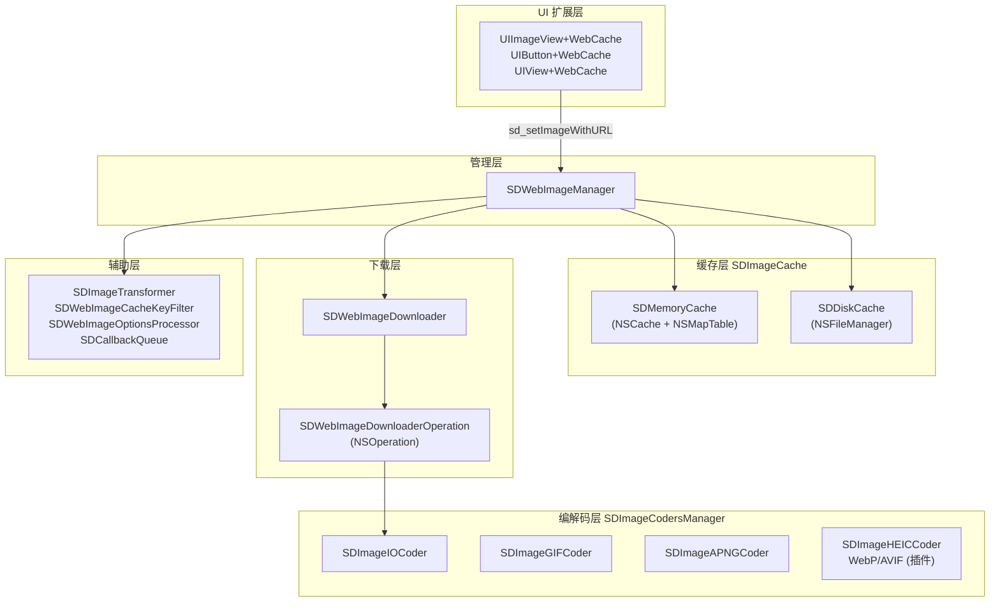
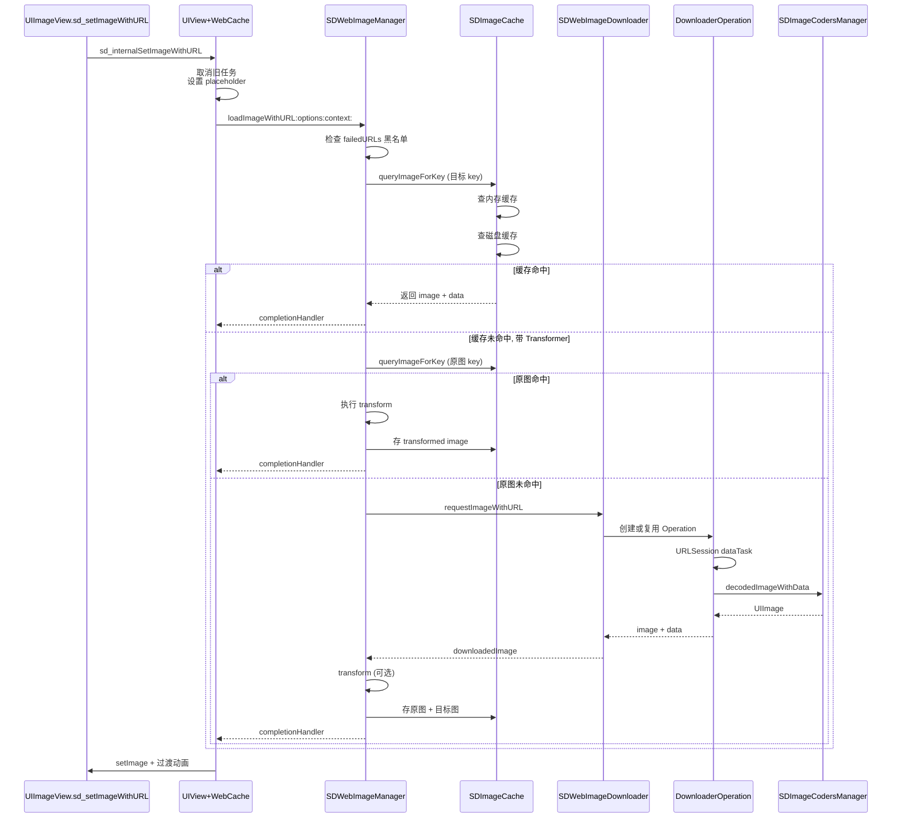
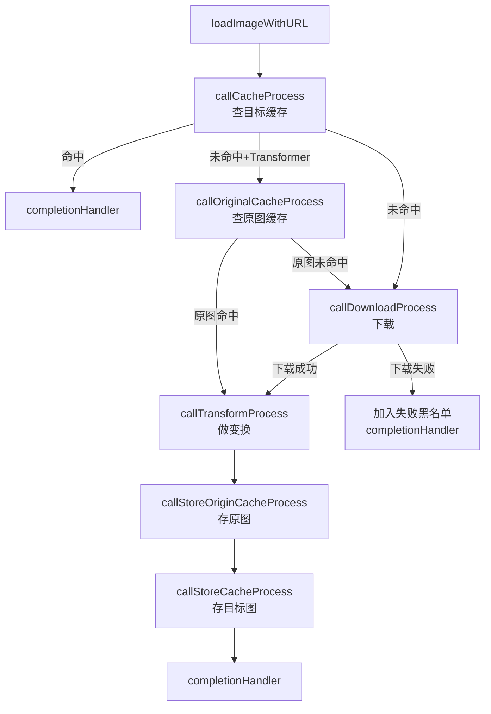
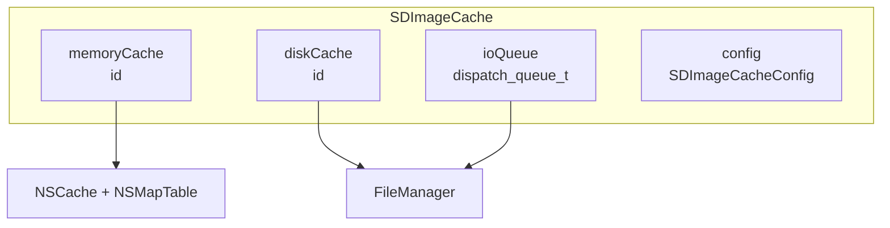
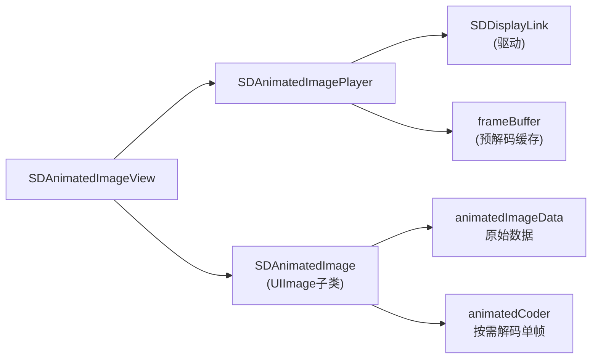

+++
title = "SDWebImage源码导读"
date = '2026-05-02T22:32:27+08:00'
draft = false
weight = 6
tags = ["iOS", "源码分析"]
categories = ["iOS开发", "源码分析"]
+++
SDWebImage 是 iOS 生态中历史最悠久、最流行的异步图片下载缓存库，由 Olivier Poitrey 在 2009 年创建，如今由社区维护。截至 2026 年 4 月，GitHub Star 数已超过 25.6k，最新稳定版本为 **5.21.7**（2026 年 2 月）。5.21 系列引入了 HDR 图片编解码支持，并持续完善线程安全和 iOS 26 的兼容性。本文基于 master 分支源码（Objective-C 实现）进行分析。

---

## 一、整体架构

SDWebImage 采用**协议导向 + 责任链**的模块化设计，核心由五大子系统构成：Manager 协调层、Cache 缓存层、Downloader 下载层、Coder 编解码层和 UI 扩展层。



**源码目录结构：**

```
SDWebImage/
├── Core/                          # 核心模块
│   ├── SDWebImageManager.{h,m}    # 中央协调器
│   ├── SDImageCache.{h,m}         # 二级缓存门面
│   ├── SDMemoryCache.{h,m}        # 内存缓存
│   ├── SDDiskCache.{h,m}          # 磁盘缓存
│   ├── SDWebImageDownloader.{h,m} # 下载器
│   ├── SDWebImageDownloaderOperation.{h,m}  # 下载任务
│   ├── SDImageCodersManager.{h,m} # 编解码管理器
│   ├── SDImageIOCoder.{h,m}       # 系统 ImageIO 解码器
│   ├── SDImageGIFCoder.{h,m}      # GIF 解码器
│   ├── SDImageAPNGCoder.{h,m}     # APNG 解码器
│   ├── SDImageTransformer.{h,m}   # 图片变换
│   ├── SDAnimatedImage.{h,m}      # 动图
│   ├── SDAnimatedImageView.{h,m}  # 动图播放
│   ├── UIImageView+WebCache.{h,m} # UIImageView 扩展
│   ├── UIView+WebCache.{h,m}      # UIView 通用扩展
│   └── ...
└── Private/                       # 内部辅助
    ├── SDInternalMacros.h         # 锁、weakify 等宏
    ├── SDCallbackQueue.{h,m}      # 回调队列抽象
    └── ...
```

---

## 二、调用链路全景

一次 `sd_setImageWithURL:` 的完整流程跨越了所有核心模块：



整个流程在 `SDWebImageManager.m` 的头部注释中被精炼地概括为：

```objc
// Steps without transformer:
// 1. query image from cache, miss
// 2. download data and image
// 3. store image to cache

// Steps with transformer:
// 1. query transformed image from cache, miss
// 2. query original image from cache, miss
// 3. download data and image
// 4. do transform in CPU
// 5. store original image to cache
// 6. store transformed image to cache
```

---

## 三、SDWebImageManager — 九阶段状态机

`SDWebImageManager` 是整个库的大脑，负责把缓存、下载、变换、存储等操作串联成一个完整的状态机。它使用**递归回调**的方式在各个阶段之间跳转。

### 3.1 组合操作与任务管理

每次加载都会创建一个 `SDWebImageCombinedOperation`，持有缓存操作和下载操作两个子任务：

```objc
@interface SDWebImageCombinedOperation : NSObject <SDWebImageOperation>
@property (strong, nonatomic, nullable, readonly) id<SDWebImageOperation> cacheOperation;
@property (strong, nonatomic, nullable, readonly) id<SDWebImageOperation> loaderOperation;
@end
```

外部通过 `[operation cancel]` 可以同时取消两个子任务：

```objc
- (void)cancel {
    @synchronized(self) {
        if (_cancelled) return;
        _cancelled = YES;
        if (self.cacheOperation) {
            [self.cacheOperation cancel];
            self.cacheOperation = nil;
        }
        if (self.loaderOperation) {
            [self.loaderOperation cancel];
            self.loaderOperation = nil;
        }
        [self.manager safelyRemoveOperationFromRunning:self];
    }
}
```

Manager 内部使用 `NSMutableSet` + 锁来保护运行中的任务集合：

```objc
@interface SDWebImageManager () {
    SD_LOCK_DECLARE(_failedURLsLock);
    SD_LOCK_DECLARE(_runningOperationsLock);
}
@property (strong, nonatomic, nonnull) NSMutableSet<NSURL *> *failedURLs;
@property (strong, nonatomic, nonnull) NSMutableSet<SDWebImageCombinedOperation *> *runningOperations;
@end
```

### 3.2 失败 URL 黑名单

SDWebImage 维护了一个失败 URL 黑名单，对于永久失败的 URL（如 404、无效数据）会直接短路返回错误，避免重复尝试：

```objc
BOOL isFailedUrl = NO;
if (url) {
    SD_LOCK(_failedURLsLock);
    isFailedUrl = [self.failedURLs containsObject:url];
    SD_UNLOCK(_failedURLsLock);
}

if (url.absoluteString.length == 0 ||
    (!(result.options & SDWebImageRetryFailed) && isFailedUrl)) {
    NSString *description = isFailedUrl ? @"Image url is blacklisted" : @"Image url is nil";
    NSInteger code = isFailedUrl ? SDWebImageErrorBlackListed : SDWebImageErrorInvalidURL;
    [self callCompletionBlockForOperation:operation ...];
    return operation;
}
```

什么样的错误会被拉黑？由 `shouldBlockFailedURLWithURL:error:` 决定：

```objc
if ([error.domain isEqualToString:NSURLErrorDomain]) {
    shouldBlockFailedURL = ( error.code != NSURLErrorNotConnectedToInternet
                          && error.code != NSURLErrorCancelled
                          && error.code != NSURLErrorTimedOut
                          && error.code != NSURLErrorInternationalRoamingOff
                          && error.code != NSURLErrorDataNotAllowed
                          && error.code != NSURLErrorCannotFindHost
                          && error.code != NSURLErrorCannotConnectToHost
                          && error.code != NSURLErrorNetworkConnectionLost);
}
```

只有"**稳定的失败**"（比如 400/404/500 等业务错误）才会被拉黑；网络波动、超时、离线等临时错误不会。用户可以通过 `SDWebImageRetryFailed` 选项强制重试，或调用 `removeFailedURL:` 手动清除。

### 3.3 九阶段回调接力

Manager 把整个流程拆分为 6 个私有方法，通过回调接力的方式串联：



这种**链式回调 + 职责单一**的设计，使得每个阶段都可以独立测试和扩展。每一阶段的方法签名都遵循统一模式：接收 `operation`、`url`、`options`、`context` 和 `completedBlock`，在阶段完成后调用下一阶段。

### 3.4 缓存 Key 生成策略

SDWebImage 有两套缓存 Key：**原图 Key** 和 **目标 Key**。它们的区别在于是否带有变换信息：

```objc
- (nullable NSString *)cacheKeyForURL:(nullable NSURL *)url context:(nullable SDWebImageContext *)context {
    NSString *key;
    id<SDWebImageCacheKeyFilter> cacheKeyFilter = self.cacheKeyFilter;
    if (context[SDWebImageContextCacheKeyFilter]) {
        cacheKeyFilter = context[SDWebImageContextCacheKeyFilter];
    }
    if (cacheKeyFilter) {
        key = [cacheKeyFilter cacheKeyForURL:url];
    } else {
        key = url.absoluteString;
    }
    
    // Thumbnail Key Appending
    NSValue *thumbnailSizeValue = context[SDWebImageContextImageThumbnailPixelSize];
    if (thumbnailSizeValue != nil) {
        key = SDThumbnailedKeyForKey(key, thumbnailSize, preserveAspectRatio);
    }
    
    // Transformer Key Appending
    id<SDImageTransformer> transformer = self.transformer;
    if (context[SDWebImageContextImageTransformer]) {
        transformer = context[SDWebImageContextImageTransformer];
    }
    if (transformer) {
        key = SDTransformedKeyForKey(key, transformer.transformerKey);
    }
    
    return key;
}
```

Key 的组成结构形如 `url-Thumbnail({100,100},1)-Transformed(round-corner)`。这让同一张原图可以在缓存中共存多个不同尺寸、不同变换的版本，互不干扰。

### 3.5 OptionsProcessor — 全局选项拦截

5.0 版本引入的 `SDWebImageOptionsProcessor` 允许用户在 Manager 层面统一处理所有请求的选项：

```objc
SDWebImageManager.sharedManager.optionsProcessor = [SDWebImageOptionsProcessor optionsProcessorWithBlock:^SDWebImageOptionsResult * _Nullable(NSURL * _Nullable url, SDWebImageOptions options, SDWebImageContext * _Nullable context) {
    // Only do animation on `SDAnimatedImageView`
    if (!context[SDWebImageContextAnimatedImageClass]) {
        options |= SDWebImageDecodeFirstFrameOnly;
    }
    if ([url.lastPathComponent isEqualToString:@"png"]) {
        options |= SDWebImageAvoidDecodeImage;
    }
    return [[SDWebImageOptionsResult alloc] initWithOptions:options context:context];
}];
```

这是一个非常实用的切面机制，可以集中处理**鉴权、域名替换、强制选项**等跨 URL 的共性需求。

---

## 四、SDImageCache — 双层缓存体系

`SDImageCache` 是对内存和磁盘两层缓存的统一封装，对外暴露统一的查询、存储、删除接口。

### 4.1 架构



**初始化流程：**

```objc
- (nonnull instancetype)initWithNamespace:(nonnull NSString *)ns
                        diskCacheDirectory:(nullable NSString *)directory
                                    config:(nullable SDImageCacheConfig *)config {
    // Create IO queue (默认 serial)
    _ioQueue = dispatch_queue_create("com.hackemist.SDImageCache.ioQueue", ioQueueAttributes);
    
    // Init memory cache via protocol
    _memoryCache = [[config.memoryCacheClass alloc] initWithConfig:_config];
    
    // Init disk cache under ~/Library/Caches/com.hackemist.SDImageCache/<namespace>/
    _diskCachePath = [directory stringByAppendingPathComponent:ns];
    _diskCache = [[config.diskCacheClass alloc] initWithCachePath:_diskCachePath config:_config];
    
    // 订阅 App 终止/进入后台通知进行清理
}
```

所有磁盘 IO 都在 `ioQueue` 上执行，避免阻塞主线程和多线程竞争。

### 4.2 查询流程 — SDImageCacheToken

查询方法返回一个 `SDImageCacheToken`，支持在进行中取消：

```objc
- (nullable SDImageCacheToken *)queryCacheOperationForKey:(nullable NSString *)key
                                                  options:(SDImageCacheOptions)options
                                                  context:(nullable SDWebImageContext *)context
                                                cacheType:(SDImageCacheType)queryCacheType
                                                     done:(nullable SDImageCacheQueryCompletionBlock)doneBlock {
    // 1. 先查内存缓存 (同步)
    UIImage *image;
    BOOL shouldQueryDiskOnly = (queryCacheType == SDImageCacheTypeDisk);
    if (!shouldQueryDiskOnly) {
        image = [self imageFromMemoryCacheForKey:key];
    }
    
    // 仅查内存 或 命中内存且不需要 data
    BOOL shouldQueryMemoryOnly = (queryCacheType == SDImageCacheTypeMemory) ||
                                  (image && !(options & SDWebImageQueryMemoryData));
    if (shouldQueryMemoryOnly) {
        doneBlock(image, nil, SDImageCacheTypeMemory);
        return nil;
    }
    
    // 2. 异步查磁盘缓存
    SDImageCacheToken *operation = [[SDImageCacheToken alloc] initWithDoneBlock:doneBlock];
    dispatch_async(self.ioQueue, ^{
        NSData* diskData = [self diskImageDataBySearchingAllPathsForKey:key];
        UIImage* diskImage = [self diskImageForKey:key data:diskData options:options context:context];
        
        @synchronized (operation) {
            if (operation.isCancelled) return;
        }
        [(queue ?: SDCallbackQueue.mainQueue) async:^{
            // 派发到主队列后再次检查取消状态，避免双回调
            @synchronized (operation) {
                if (operation.isCancelled) return;
            }
            doneBlock(diskImage, diskData, SDImageCacheTypeDisk);
        }];
    });
    return operation;
}
```

注意这里有两处**取消检查**：一次在 IO 完成、派发到主队列前，一次在主队列执行时。这是为了解决"**IO 完成后、主队列执行前**"的窗口期内发生取消的情况。

### 4.3 Token 取消机制

`SDImageCacheToken` 的取消非常巧妙：

```objc
- (void)cancel {
    @synchronized (self) {
        if (self.isCancelled) return;
        self.cancelled = YES;
        
        SDImageCacheQueryCompletionBlock doneBlock = self.doneBlock;
        self.doneBlock = nil;
        if (doneBlock) {
            [(self.callbackQueue ?: SDCallbackQueue.mainQueue) async:^{
                doneBlock(nil, nil, SDImageCacheTypeNone);
            }];
        }
    }
}
```

取消时**主动调用**一次 `doneBlock(nil, nil, None)`，通知上层"此操作已结束"。这和 URLSession 取消会调用 completion 的行为一致，让上层逻辑得以统一处理。

### 4.4 存储流程

存储同时写入内存和磁盘：

```objc
- (void)storeImage:(nullable UIImage *)image
         imageData:(nullable NSData *)imageData
            forKey:(nullable NSString *)key
           options:(SDWebImageOptions)options
           context:(nullable SDWebImageContext *)context
         cacheType:(SDImageCacheType)cacheType
        completion:(nullable SDWebImageNoParamsBlock)completionBlock {
    // 1. 内存缓存
    if (image && toMemory && self.config.shouldCacheImagesInMemory) {
        NSUInteger cost = image.sd_memoryCost;
        [self.memoryCache setObject:image forKey:key cost:cost];
    }
    
    // 2. 磁盘缓存 - 若无 data 则编码
    if (!data && image) {
        dispatch_async(dispatch_get_global_queue(DISPATCH_QUEUE_PRIORITY_HIGH, 0), ^{
            SDImageFormat format = image.sd_imageFormat;
            if (format == SDImageFormatUndefined) {
                // 根据动图/Alpha 通道选择默认格式
                if (image.sd_imageFrameCount > 1) {
                    format = SDImageFormatPNG;  // iOS 12+, 支持 APNG
                } else {
                    format = [SDImageCoderHelper CGImageContainsAlpha:image.CGImage] 
                             ? SDImageFormatPNG : SDImageFormatJPEG;
                }
            }
            NSData *encodedData = [imageCoder encodedDataWithImage:image format:format options:...];
            dispatch_async(self.ioQueue, ^{
                [self _storeImageDataToDisk:encodedData forKey:key];
                [self _archivedDataWithImage:image forKey:key];  // 扩展元数据
                // callback
            });
        });
    }
}
```

这里的细节：

1. **内存 cost 计算**：通过 `image.sd_memoryCost` 计算（`width * height * scale * scale * bytesPerPixel`），供 NSCache 的 `totalCostLimit` 驱逐使用
2. **异步编码**：图片编码是 CPU 密集操作，派发到 `DISPATCH_QUEUE_PRIORITY_HIGH` 全局队列
3. **IO 串行**：实际写磁盘在 `ioQueue`（默认串行）上进行，避免并发写
4. **扩展元数据**：通过 `sd_extendedObject` 机制，可以把任意遵循 NSCoding 的对象作为附加数据写入磁盘扩展属性（xattr）

---

## 五、SDMemoryCache — 带弱引用的内存缓存

`SDMemoryCache` 继承自 `NSCache`，并在此基础上扩展了**弱引用缓存**能力。

### 5.1 双层结构

```objc
@interface SDMemoryCache () {
    SD_LOCK_DECLARE(_weakCacheLock);
}
@property (nonatomic, strong, nonnull) NSMapTable<KeyType, ObjectType> *weakCache;
@end
```

两层结构：
- **父类 NSCache**：强引用，受 `totalCostLimit` 和系统内存压力控制
- **weakCache (NSMapTable)**：`NSPointerFunctionsStrongMemory` + `NSPointerFunctionsWeakMemory`，对 value 是**弱引用**

### 5.2 写入与读取的协同

```objc
- (void)setObject:(id)obj forKey:(id)key cost:(NSUInteger)g {
    [super setObject:obj forKey:key cost:g];  // 父类强引用
    if (!self.config.shouldUseWeakMemoryCache) return;
    if (key && obj) {
        SD_LOCK(_weakCacheLock);
        [self.weakCache setObject:obj forKey:key];  // 弱引用表也存一份
        SD_UNLOCK(_weakCacheLock);
    }
}

- (id)objectForKey:(id)key {
    id obj = [super objectForKey:key];
    if (!self.config.shouldUseWeakMemoryCache) return obj;
    
    if (key && !obj) {
        // NSCache 可能因为内存压力清理了，但 weakCache 里的对象如果被其他引用持有就还活着
        SD_LOCK(_weakCacheLock);
        obj = [self.weakCache objectForKey:key];
        SD_UNLOCK(_weakCacheLock);
        if (obj) {
            // 回写到 NSCache
            NSUInteger cost = [(UIImage *)obj sd_memoryCost];
            [super setObject:obj forKey:key cost:cost];
        }
    }
    return obj;
}
```

**使用场景：** 一个 UIImage 正在被多个 UIImageView 显示，此时 NSCache 收到内存警告清空了自己。按理说下次查询应该 miss，但这张图其实**还在内存中**（被 UIImageView 持有）。弱引用缓存让 SDWebImage 能感知到这种情况，避免不必要的重新解码。

### 5.3 内存警告处理

```objc
#if SD_UIKIT
- (void)didReceiveMemoryWarning:(NSNotification *)notification {
    // 只清 NSCache, 保留 weakCache
    [super removeAllObjects];
}
#endif
```

收到内存警告时**只清强引用缓存**，弱引用表不动。因为那些仍被持有的对象从 OS 视角看就不是"可回收"的，保留引用也不会增加内存压力。

---

## 六、SDDiskCache — 基于 FileManager 的磁盘缓存

### 6.1 文件名生成

磁盘文件名使用 MD5 哈希 + 原扩展名：

```objc
static inline NSString * _Nonnull SDDiskCacheFileNameForKey(NSString * _Nullable key) {
    const char *str = key.UTF8String;
    unsigned char r[CC_MD5_DIGEST_LENGTH];
    CC_MD5(str, (CC_LONG)strlen(str), r);
    NSString *ext;
    // 优先使用 URL path extension, 其次 file extension
    NSURL *keyURL = [NSURL URLWithString:key];
    if (keyURL) ext = keyURL.pathExtension;
    if (!ext) ext = key.pathExtension;
    ext = SDSanitizeFileNameString(ext);
    if (ext.length > SD_MAX_FILE_EXTENSION_LENGTH) ext = nil;
    
    NSString *filename = [NSString stringWithFormat:@"%02x%02x...%@",
                          r[0], r[1], ..., r[15],
                          ext.length == 0 ? @"" : [NSString stringWithFormat:@".%@", ext]];
    return filename;
}
```

为什么保留扩展名？因为有些场景下（如 `sd_imageFormatForImageData:`）可以快速通过文件扩展名推断图片格式，避免读文件头。扩展名还要做**长度检查**和**非法字符过滤**（`:` 和 `\0`）。

### 6.2 LRU 清理策略（5.20 重要改进）

`removeExpiredData` 实现了**两遍扫描**的过期数据清理：

```objc
- (void)removeExpiredData {
    NSURLResourceKey cacheContentDateKey;
    switch (self.config.diskCacheExpireType) {
        case SDImageCacheConfigExpireTypeModificationDate:
            cacheContentDateKey = NSURLContentModificationDateKey; break;
        case SDImageCacheConfigExpireTypeCreationDate:
            cacheContentDateKey = NSURLCreationDateKey; break;
        case SDImageCacheConfigExpireTypeChangeDate:
            cacheContentDateKey = NSURLAttributeModificationDateKey; break;
        case SDImageCacheConfigExpireTypeAccessDate:
        default:
            cacheContentDateKey = NSURLContentAccessDateKey; break;  // 5.20 默认
    }
    
    // 第一遍: 删除超过 maxDiskAge (默认 7 天) 的文件,同时统计总大小
    NSDate *expirationDate = [NSDate dateWithTimeIntervalSinceNow:-self.config.maxDiskAge];
    for (NSURL *fileURL in fileEnumerator) {
        NSDate *modifiedDate = resourceValues[cacheContentDateKey];
        if (expirationDate && [[modifiedDate laterDate:expirationDate] isEqualToDate:expirationDate]) {
            [urlsToDelete addObject:fileURL];
            continue;
        }
        currentCacheSize += totalAllocatedSize.unsignedIntegerValue;
        cacheFiles[fileURL] = resourceValues;
    }
    
    // 第二遍: 若剩余仍超过 maxDiskSize, 按时间排序继续删除直到低于 maxDiskSize / 2
    if (maxDiskSize > 0 && currentCacheSize > maxDiskSize) {
        const NSUInteger desiredCacheSize = maxDiskSize / 2;
        NSArray<NSURL *> *sortedFiles = [cacheFiles keysSortedByValueWithOptions:NSSortConcurrent
                                          usingComparator:^NSComparisonResult(id obj1, id obj2) {
            return [obj1[cacheContentDateKey] compare:obj2[cacheContentDateKey]];
        }];
        for (NSURL *fileURL in sortedFiles) {
            if ([self.fileManager removeItemAtURL:fileURL error:nil]) {
                currentCacheSize -= totalAllocatedSize.unsignedIntegerValue;
                if (currentCacheSize < desiredCacheSize) break;
            }
        }
    }
}
```

**5.20 的重要修复：** 之前版本默认使用 `NSURLContentModificationDateKey`（修改时间），但这意味着只要文件写入后再没改过，就永远按创建时间算 LRU——这并不是真正的 LRU。5.20 改为默认使用 `NSURLContentAccessDateKey`（访问时间），并在 `dataForKey:` 中主动更新访问时间：

```objc
- (NSData *)dataForKey:(NSString *)key {
    NSData *data = [NSData dataWithContentsOfFile:filePath ...];
    if (data) {
        [[NSURL fileURLWithPath:filePath] setResourceValue:[NSDate date]
                                                    forKey:NSURLContentAccessDateKey 
                                                     error:nil];
        return data;
    }
}
```

这才是真正意义上的 LRU。

### 6.3 清理触发时机

`SDImageCache` 通过 App 生命周期通知触发磁盘清理：

```objc
// applicationWillTerminate - 同步清理,保证完成
- (void)applicationWillTerminate:(NSNotification *)notification {
    if (!self.config.shouldRemoveExpiredDataWhenTerminate) return;
    dispatch_sync(self.ioQueue, ^{
        [self.diskCache removeExpiredData];
    });
}

// applicationDidEnterBackground - 用 beginBackgroundTask 在后台完成
- (void)applicationDidEnterBackground:(NSNotification *)notification {
    if (!self.config.shouldRemoveExpiredDataWhenEnterBackground) return;
    __block UIBackgroundTaskIdentifier bgTask = [application beginBackgroundTaskWithExpirationHandler:^{
        [application endBackgroundTask:bgTask];
    }];
    [self deleteOldFilesWithCompletionBlock:^{
        [application endBackgroundTask:bgTask];
    }];
}
```

**注意：** 默认不在每次启动时做清理，避免启动耗时。

### 6.4 扩展属性 — 附带元数据

`SDDiskCache` 支持通过 xattr（扩展文件属性）存储额外元数据：

```objc
- (void)setExtendedData:(NSData *)extendedData forKey:(NSString *)key {
    NSString *cachePathForKey = [self cachePathForKey:key];
    [SDFileAttributeHelper setExtendedAttribute:@"com.hackemist.SDDiskCache"
                                          value:extendedData 
                                         atPath:cachePathForKey 
                                   traverseLink:NO 
                                      overwrite:YES 
                                          error:nil];
}
```

通过 `setxattr` 系统调用把数据写入文件的扩展属性区，这样可以给每个缓存文件附加**与图片数据分离**的元信息（如图片格式、原始尺寸、DPR 等），读取时不需要解码图片就能拿到。

---

## 七、SDWebImageDownloader — 下载调度器

### 7.1 核心数据结构

```objc
@interface SDWebImageDownloader () <NSURLSessionTaskDelegate, NSURLSessionDataDelegate> {
    SD_LOCK_DECLARE(_HTTPHeadersLock);
    SD_LOCK_DECLARE(_operationsLock);
}
@property (strong, nonatomic, nonnull) NSOperationQueue *downloadQueue;
@property (strong, nonatomic, nonnull) NSMutableDictionary<NSURL *, NSOperation<SDWebImageDownloaderOperation> *> *URLOperations;
@property (strong, nonatomic, nullable) NSMutableDictionary<NSString *, NSString *> *HTTPHeaders;
@property (strong, nonatomic) NSURLSession *session;
@end
```

- `downloadQueue`：NSOperationQueue，默认并发数 `SDWebImageDownloaderConfig.maxConcurrentDownloads = 6`
- `URLOperations`：URL -> Operation 的映射，用于任务去重
- `session`：URLSession，`delegateQueue = nil` 表示系统会为 delegate 回调创建一个独立的串行队列
- **SDWebImageDownloader 自己是 URLSession 的 delegate**，然后把回调分发到对应的 Operation

### 7.2 任务去重

多个请求同一 URL 时，只创建一个真正的网络请求：

```objc
- (nullable SDWebImageDownloadToken *)downloadImageWithURL:(NSURL *)url ... {
    SD_LOCK(_operationsLock);
    NSOperation<SDWebImageDownloaderOperation> *operation = [self.URLOperations objectForKey:url];
    BOOL shouldNotReuseOperation;
    if (operation) {
        @synchronized (operation) {
            shouldNotReuseOperation = operation.isFinished || operation.isCancelled;
        }
    } else {
        shouldNotReuseOperation = YES;
    }
    
    if (shouldNotReuseOperation) {
        // 新建 Operation
        operation = [self createDownloaderOperationWithUrl:url options:options context:context];
        operation.completionBlock = ^{
            SD_LOCK(self->_operationsLock);
            [self.URLOperations removeObjectForKey:url];
            SD_UNLOCK(self->_operationsLock);
        };
        [self.URLOperations setObject:operation forKey:url];
        downloadOperationCancelToken = [operation addHandlersForProgress:progressBlock 
                                                               completed:completedBlock 
                                                           decodeOptions:decodeOptions];
        [self.downloadQueue addOperation:operation];
    } else {
        // 复用已有 Operation,只追加回调
        @synchronized (operation) {
            downloadOperationCancelToken = [operation addHandlersForProgress:progressBlock 
                                                                   completed:completedBlock 
                                                               decodeOptions:decodeOptions];
        }
    }
    SD_UNLOCK(_operationsLock);
    
    return [[SDWebImageDownloadToken alloc] initWith...];
}
```

这里的细节很多：

1. **双重锁**：外层 `_operationsLock` 保护字典，内层 `@synchronized(operation)` 保护 Operation 的回调列表
2. **isFinished 检查**：NSOperation 已完成但回调尚未触发移除时，不能复用
3. **completionBlock 自动清理**：Operation 完成时自动从字典中移除自己
4. **Token 机制**：每个调用者拿到独立的 `cancelToken`，取消时只移除自己的回调而不影响其他调用者

### 7.3 LIFO 执行顺序

在列表滚动场景中，最新进入视野的图片应当**优先下载**。SDWebImage 通过 NSOperation 的依赖机制模拟 LIFO：

```objc
if (self.config.executionOrder == SDWebImageDownloaderLIFOExecutionOrder) {
    // 让之前所有排队中的 operation 都依赖新 operation
    // 这样新 operation 会先执行
    for (NSOperation *pendingOperation in self.downloadQueue.operations) {
        [pendingOperation addDependency:operation];
    }
}
```

**原理：** NSOperationQueue 默认是 FIFO，但通过给旧 Operation 添加对新 Operation 的依赖，强迫队列调度新的先执行。

### 7.4 URLSession delegate 的分发

由于 SDWebImageDownloader 自己是 session 的 delegate，而实际处理逻辑在 Operation 中，需要一层分发：

```objc
- (NSOperation<SDWebImageDownloaderOperation> *)operationWithTask:(NSURLSessionTask *)task {
    NSOperation<SDWebImageDownloaderOperation> *returnOperation = nil;
    for (NSOperation<SDWebImageDownloaderOperation> *operation in self.downloadQueue.operations) {
        NSURLSessionTask *operationTask;
        @synchronized (operation) {
            operationTask = operation.dataTask;
        }
        if (operationTask.taskIdentifier == task.taskIdentifier) {
            returnOperation = operation;
            break;
        }
    }
    return returnOperation;
}

- (void)URLSession:(NSURLSession *)session dataTask:(NSURLSessionDataTask *)dataTask didReceiveData:(NSData *)data {
    NSOperation<SDWebImageDownloaderOperation> *dataOperation = [self operationWithTask:dataTask];
    if ([dataOperation respondsToSelector:@selector(URLSession:dataTask:didReceiveData:)]) {
        [dataOperation URLSession:session dataTask:dataTask didReceiveData:data];
    }
}
```

通过 `taskIdentifier` 反查 Operation，然后转发所有 URLSession 回调。这种集中式 delegate 设计让整个 Session 共享同一个连接池，对性能更友好。

---

## 八、SDWebImageDownloaderOperation — 单个下载任务

`SDWebImageDownloaderOperation` 是一个**并发 NSOperation**（`isAsynchronous = YES`），持有 URLSession dataTask 并管理它的完整生命周期。

### 8.1 Token 与多回调

一个下载 Operation 可能被多个调用者共享（因为任务去重），每个调用者有自己的进度回调、完成回调和解码选项：

```objc
@interface SDWebImageDownloaderOperationToken : NSObject
@property (nonatomic, copy) SDWebImageDownloaderCompletedBlock completedBlock;
@property (nonatomic, copy) SDWebImageDownloaderProgressBlock progressBlock;
@property (nonatomic, copy) SDImageCoderOptions *decodeOptions;
@end

@interface SDWebImageDownloaderOperation ()
@property (strong, nonatomic, nonnull) NSMutableArray<SDWebImageDownloaderOperationToken *> *callbackTokens;
@property (strong, nonatomic, nonnull) NSMapTable *imageMap;  // decodeOptions -> UIImage (弱引用)
@end
```

每个回调的 `decodeOptions` 可能不同（比如同一 URL 不同 thumbnail size），因此解码后的图片也不同。`imageMap` 作为一个**弱引用字典**缓存每种 decodeOptions 的解码结果，避免同步重复解码。

### 8.2 取消 — 单回调取消 vs 整体取消

```objc
- (BOOL)cancel:(nullable id)token {
    BOOL shouldCancel = NO;
    @synchronized (self) {
        NSArray<SDWebImageDownloaderOperationToken *> *tokens = self.callbackTokens;
        if (tokens.count == 1 && [tokens indexOfObjectIdenticalTo:token] != NSNotFound) {
            shouldCancel = YES;  // 最后一个了, 整体取消
        }
    }
    if (shouldCancel) {
        [self cancel];
    } else {
        // 只移除这一个回调
        @synchronized (self) {
            [self.callbackTokens removeObjectIdenticalTo:token];
        }
        [self callCompletionBlockWithToken:token image:nil imageData:nil 
                                     error:[NSError errorWithDomain:SDWebImageErrorDomain 
                                                               code:SDWebImageErrorCancelled ...] 
                                  finished:YES];
    }
    return shouldCancel;
}
```

只有当**最后一个回调**被取消时，才真正取消底层 URLSession 任务。这和 Kingfisher 的做法一致，也是几乎所有图片库的共识——因为一旦有请求发出，完成下载和丢弃结果是等价的，但对其他调用者是不公平的。

### 8.3 渐进式解码（Progressive JPEG）

SDWebImage 支持在下载过程中**流式解码部分图片**，实现"先模糊后清晰"的效果：

```objc
- (void)URLSession:(NSURLSession *)session dataTask:(NSURLSessionDataTask *)dataTask didReceiveData:(NSData *)data {
    if (!self.imageData) {
        self.imageData = [[NSMutableData alloc] initWithCapacity:self.expectedSize];
    }
    [self.imageData appendData:data];
    self.receivedSize = self.imageData.length;
    
    // 进度节流 - 避免频繁回调
    double progressInterval = currentProgress - previousProgress;
    if (!finished && (progressInterval < self.minimumProgressInterval)) return;
    self.previousProgress = currentProgress;
    
    BOOL supportProgressive = (self.options & SDWebImageDownloaderProgressiveLoad) && !self.decryptor;
    if (supportProgressive && !finished) {
        NSData *imageData = self.imageData;
        // 同时只允许一个渐进式解码进行中
        if (imageData && self.coderQueue.operationCount == 0) {
            [self.coderQueue addOperationWithBlock:^{
                @synchronized (self) {
                    if (self.isCancelled || self.isDownloadCompleted) return;
                }
                UIImage *image = SDImageLoaderDecodeProgressiveImageData(imageData, 
                                                                          self.request.URL, 
                                                                          NO, self, ...);
                if (image) {
                    // finished=NO 表示部分结果
                    [self callCompletionBlocksWithImage:image imageData:nil error:nil finished:NO];
                }
            }];
        }
    }
    
    // 进度回调
    for (SDWebImageDownloaderOperationToken *token in tokens) {
        if (token.progressBlock) {
            token.progressBlock(self.receivedSize, self.expectedSize, self.request.URL);
        }
    }
}
```

**关键细节：**
- `coderQueue` 是**串行**队列（`maxConcurrentOperationCount = 1`）
- `coderQueue.operationCount == 0` 保证同时最多 1 个渐进式解码任务，避免解码慢于下载导致队列堆积
- 渐进式只支持 JPEG / PNG / WebP 等格式（具体由 coder 实现决定）
- 数据解密（`decryptor`）与渐进式**互斥**，因为分块数据无法独立解密

### 8.4 完成后的解码

下载完成时，对所有 token 并发解码（因为每个 token 可能有不同的 decodeOptions）：

```objc
- (void)startCoderOperationWithImageData:(NSData *)imageData
                           pendingTokens:(NSArray *)pendingTokens
                          finishedTokens:(NSArray *)finishedTokens {
    for (SDWebImageDownloaderOperationToken *token in pendingTokens) {
        [self.coderQueue addOperationWithBlock:^{
            UIImage *image;
            // 命中同 decodeOptions 的缓存
            if (token.decodeOptions) {
                image = [self.imageMap objectForKey:token.decodeOptions];
            }
            if (!image) {
                image = SDImageLoaderDecodeImageData(imageData, ...);
                if (image && token.decodeOptions) {
                    [self.imageMap setObject:image forKey:token.decodeOptions];
                }
            }
            [self callCompletionBlockWithToken:token image:image imageData:imageData 
                                         error:nil finished:YES];
        }];
    }
    
    dispatch_block_t doneBlock = ^{
        [self checkDoneWithImageData:imageData
                      finishedTokens:[finishedTokens arrayByAddingObjectsFromArray:pendingTokens]];
    };
    // iOS 13+ 使用 addBarrierBlock, 更高效
    if (@available(iOS 13, tvOS 13, macOS 10.15, watchOS 6, *)) {
        [self.coderQueue addBarrierBlock:doneBlock];
    } else {
        [self.coderQueue addOperationWithBlock:doneBlock];
    }
}
```

这里使用 `checkDoneWithImageData:finishedTokens:` 递归检查——因为解码期间可能有新的 token 添加进来，需要处理完才能真正结束 Operation。

### 8.5 后台任务延续

`SDWebImageDownloaderContinueInBackground` 选项使下载能在 App 进入后台后继续：

```objc
#if SD_UIKIT
if (hasApplication && [self shouldContinueWhenAppEntersBackground]) {
    __weak typeof(self) wself = self;
    UIApplication *app = [UIApplicationClass performSelector:@selector(sharedApplication)];
    self.backgroundTaskId = [app beginBackgroundTaskWithExpirationHandler:^{
        [wself cancel];
    }];
}
#endif
```

系统给的后台时间到期时（约 30 秒），expirationHandler 触发 cancel，避免被系统强杀。

---

## 九、SDImageCodersManager — 责任链模式的编解码

### 9.1 责任链结构

```objc
@implementation SDImageCodersManager {
    SD_LOCK_DECLARE(_codersLock);
}

- (instancetype)init {
    if (self = [super init]) {
        _imageCoders = [NSMutableArray arrayWithArray:@[
            [SDImageIOCoder sharedCoder],
            [SDImageGIFCoder sharedCoder],
            [SDImageAPNGCoder sharedCoder]
        ]];
    }
    return self;
}

- (BOOL)canDecodeFromData:(NSData *)data {
    NSArray<id<SDImageCoder>> *coders = self.coders;
    // 注意是反向遍历 - 后添加的优先级更高
    for (id<SDImageCoder> coder in coders.reverseObjectEnumerator) {
        if ([coder canDecodeFromData:data]) {
            return YES;
        }
    }
    return NO;
}

- (UIImage *)decodedImageWithData:(NSData *)data options:(nullable SDImageCoderOptions *)options {
    for (id<SDImageCoder> coder in coders.reverseObjectEnumerator) {
        if ([coder canDecodeFromData:data]) {
            return [coder decodedImageWithData:data options:options];
        }
    }
    return nil;
}
```

**设计要点：**
- 使用 `reverseObjectEnumerator` 反向遍历，让**后注册的 coder 优先匹配**——用户自定义 coder 自然覆盖默认行为
- 每个 coder 自己决定能否处理某份数据（基于魔数判断文件格式）
- 默认注册顺序：ImageIO（兜底）→ GIF → APNG，所以反向遍历后 APNG 最先尝试

### 9.2 内置 Coder

| Coder | 支持格式 | 说明 |
|-------|---------|------|
| `SDImageIOCoder` | JPEG/PNG/TIFF/BMP/HEIC 等 | 基于系统 ImageIO 框架，支持 HDR (iOS 17+) |
| `SDImageGIFCoder` | GIF | 支持动图播放 |
| `SDImageAPNGCoder` | APNG | 支持动画 PNG |
| `SDImageHEICCoder` | HEIC/HEIF | iOS 11+ 高效格式 |

**插件式扩展：**
- [SDWebImageWebPCoder](https://github.com/SDWebImage/SDWebImageWebPCoder) — WebP 支持
- [SDWebImageAVIFCoder](https://github.com/SDWebImage/SDWebImageAVIFCoder) — AVIF 支持
- [SDWebImageHEIFCoder](https://github.com/SDWebImage/SDWebImageHEIFCoder) — HEIF 独立实现
- [SDWebImageLottieCoder](https://github.com/SDWebImage/SDWebImageLottieCoder) — Lottie 动画
- [SDWebImageSVGCoder](https://github.com/SDWebImage/SDWebImageSVGCoder) — SVG 矢量

注册方式：

```objc
[[SDImageCodersManager sharedManager] addCoder:[SDImageWebPCoder sharedCoder]];
```

### 9.3 HDR 解码（5.21 新特性）

5.21.0 版本新增的 HDR 支持通过 context 选项开启：

```objc
// HDR 解码
[imageView sd_setImageWithURL:url
                  placeholder:nil
                      options:0
                      context:@{SDWebImageContextDecodeToHDR: @(YES)}];

// HDR 编码 (5.21)
// SDImageHDRTypeISOHDR          - ISO 标准 HDR (HEIC/HEIF)
// SDImageHDRTypeISOGainMap      - ISO Gain Map HDR (兼容性更好,如 JPEG)
```

需要 iOS 17+ / macOS 14+（解码）、iOS 18+ / macOS 15+（编码）。在 HDR 图片的渲染上，App 还需要配合 `preferredImageDynamicRange`、`EDR headroom` 等 API 做完整适配。

---

## 十、UIView+WebCache — 统一的 UI 入口

`UIImageView+WebCache`、`UIButton+WebCache`、`NSButton+WebCache` 等都是 `UIView+WebCache` 的薄封装。这是为了**多种 UI 类型共用同一套加载逻辑**。

### 10.1 Cell 复用安全

```objc
- (nullable id<SDWebImageOperation>)sd_internalSetImageWithURL:(nullable NSURL *)url
                                              placeholderImage:(nullable UIImage *)placeholder
                                                       options:(SDWebImageOptions)options
                                                       context:(nullable SDWebImageContext *)context
                                                 setImageBlock:(nullable SDSetImageBlock)setImageBlock
                                                      progress:...
                                                     completed:...{
    NSString *validOperationKey = context[SDWebImageContextSetImageOperationKey];
    if (!validOperationKey) {
        validOperationKey = NSStringFromClass([self class]);
    }
    self.sd_latestOperationKey = validOperationKey;
    if (!(SD_OPTIONS_CONTAINS(options, SDWebImageAvoidAutoCancelImage))) {
        // 默认: 同一个 operationKey 的旧操作会被取消
        [self sd_cancelImageLoadOperationWithKey:validOperationKey];
    }
    // ...
}
```

每次调用 `sd_setImageWithURL:`，如果 UIImageView 上已有进行中的加载，就会**先取消旧的**。这是 Cell 复用场景下的关键——避免旧请求的回调把错图设置到复用后的 Cell 上。

`operationKey` 默认是类名字符串（如 `UIImageView`），所以同一个 view 上的多次 `setImage` 会互相取消。UIButton 由于可以同时设置多个 state 的图片，使用的是类名+state 的复合 key。

### 10.2 过渡动画

下载完成后的图片设置支持 `SDWebImageTransition` 做过渡动画：

```objc
// 决定是否使用过渡
BOOL shouldUseTransition = NO;
if (options & SDWebImageForceTransition) {
    shouldUseTransition = YES;
} else if (cacheType == SDImageCacheTypeNone) {
    shouldUseTransition = YES;  // 来自网络
} else if (cacheType == SDImageCacheTypeDisk) {
    // 同步磁盘查询不做动画 (没有视觉延迟)
    if (options & SDWebImageQueryMemoryDataSync || options & SDWebImageQueryDiskDataSync) {
        shouldUseTransition = NO;
    } else {
        shouldUseTransition = YES;
    }
} else if (cacheType == SDImageCacheTypeMemory) {
    shouldUseTransition = NO;  // 内存命中就是瞬时,不需要动画
}
```

这个策略非常合理：**只有"用户能感知到加载"的场景才做动画**，从内存缓存瞬时返回的时候强行加动画反而不自然。

### 10.3 Indicator 集成

`sd_imageIndicator` 是通过关联对象绑定的加载指示器：

```objc
- (void)sd_startImageIndicatorWithQueue:(SDCallbackQueue *)queue {
    id<SDWebImageIndicator> imageIndicator = self.sd_imageIndicator;
    if (!imageIndicator) return;
    [(queue ?: SDCallbackQueue.mainQueue) async:^{
        [imageIndicator startAnimatingIndicator];
    }];
}
```

SDWebImage 内置了 `SDWebImageActivityIndicator`（菊花）和 `SDWebImageProgressIndicator`（进度条）两种实现。用户也可以实现 `SDWebImageIndicator` 协议自定义。

### 10.4 进度跟踪

通过 `NSProgress` 对象跟踪加载进度，支持 KVO 监听：

```objc
SDImageLoaderProgressBlock combinedProgressBlock = ^(NSInteger receivedSize, 
                                                      NSInteger expectedSize, 
                                                      NSURL * _Nullable targetURL) {
    if (imageProgress) {
        imageProgress.totalUnitCount = expectedSize;
        imageProgress.completedUnitCount = receivedSize;
    }
    if ([imageIndicator respondsToSelector:@selector(updateIndicatorProgress:)]) {
        double progress = (double)receivedSize / expectedSize;
        dispatch_async(dispatch_get_main_queue(), ^{
            [imageIndicator updateIndicatorProgress:progress];
        });
    }
    if (progressBlock) {
        progressBlock(receivedSize, expectedSize, targetURL);
    }
};
```

---

## 十一、SDAnimatedImage — 动图播放架构

传统的 UIImageView 动画依赖 `UIImage.animatedImage`，一次性把所有帧解码到内存——对几十帧的 GIF 来说非常占内存。SDWebImage 从 5.0 开始提供了 `SDAnimatedImage` + `SDAnimatedImageView` 的组合方案。



**核心机制：**

1. **按需解码**：`SDAnimatedImage` 不预先解码所有帧，只在播放器需要时按索引解码
2. **预缓冲**：`SDAnimatedImagePlayer` 维护一个 `maxBufferSize` 控制的前瞻缓冲区（根据内存和帧数量动态调整）
3. **CADisplayLink 驱动**：跟随屏幕刷新率播放，避免漂移
4. **内存自动回收**：收到内存警告时清空缓冲区，只保留当前帧

这个设计让 SDWebImage 可以流畅播放几 MB 的 GIF/APNG 而不爆内存，也是它相比其他库的主要优势之一。

---

## 十二、SDCallbackQueue — 回调队列抽象

5.15 引入的 `SDCallbackQueue` 统一了异步回调的派发机制：

```objc
// 主队列 async (默认)
context[SDWebImageContextCallbackQueue] = SDCallbackQueue.mainQueue;

// 主队列 sync (已在主队列时直接执行)
context[SDWebImageContextCallbackQueue] = [[SDCallbackQueue alloc] initWithDispatchQueue:dispatch_get_main_queue()];
SDCallbackQueue.mainQueue.policy = SDCallbackPolicyInvoke;

// 自定义队列
context[SDWebImageContextCallbackQueue] = [[SDCallbackQueue alloc] initWithDispatchQueue:myQueue];
```

其中的 `SDCallbackPolicy` 控制执行方式：

| Policy | 行为 |
|--------|------|
| `SDCallbackPolicySafeExecute` | 主队列时直接执行，非主队列时 async |
| `SDCallbackPolicyDispatch` | 总是 async（默认） |
| `SDCallbackPolicyInvoke` | 总是同步 invoke |

这个抽象的价值在 5.21 版本更加凸显——某些 iOS API（如 `UICollectionViewDiffableDataSource` 的 apply）虽然在主线程但不在主队列，`dispatch_get_main_queue()` 的 `dispatch_async` 会延迟到下一个 runloop，此时使用 `SDCallbackPolicyInvoke` 可以立即设置图片。

---

## 十三、并发安全设计

SDWebImage 作为老牌 OC 库，并发安全主要依赖 **Lock + 串行队列 + @synchronized**。核心模块使用 `SD_LOCK_DECLARE` 宏声明 `os_unfair_lock`：

```objc
// SDInternalMacros.h 节选概念
#define SD_LOCK_DECLARE(lock)  os_unfair_lock lock
#define SD_LOCK_INIT(lock)     lock = OS_UNFAIR_LOCK_INIT
#define SD_LOCK(lock)          os_unfair_lock_lock(&lock)
#define SD_UNLOCK(lock)        os_unfair_lock_unlock(&lock)
```

**为什么用 os_unfair_lock？**
- 在 iOS 10+ 推荐，性能优于 OSSpinLock（避免优先级反转问题）
- 比 pthread_mutex 轻量
- 比 NSLock 快很多（NSLock 是 OC 对象，每次操作有方法分发开销）

**各模块的锁粒度：**

| 组件 | 并发控制 |
|------|---------|
| `SDWebImageManager` | `failedURLs` 和 `runningOperations` 各用独立锁 |
| `SDWebImageDownloader` | `URLOperations` 用 `_operationsLock`，`HTTPHeaders` 用 `_HTTPHeadersLock` |
| `SDWebImageDownloaderOperation` | `@synchronized(self)` 保护 callbackTokens、dataTask 等 |
| `SDImageCache` | 所有磁盘 IO 收敛到 `ioQueue`（串行） |
| `SDMemoryCache` | `weakCache` 用独立锁，父类 NSCache 本身线程安全 |
| `SDImageCodersManager` | `_codersLock` 保护 coders 数组 |
| `SDImageCacheToken` / `SDWebImageCombinedOperation` | `@synchronized(self)`（支持递归，用户 cancel block 中可能检查 isCancelled） |

**iOS 26 的线程安全修复：** 5.21.4 版本专门处理了 iOS 26 上的一个崩溃，把缓存/下载操作的锁**全部改为 `@synchronized`**，因为新系统对某些跨队列访问的校验更严格。这也反映出并发代码在新系统上的持续维护成本。

---

## 十四、SDImageTransformer — 图片变换管线

### 14.1 协议定义

```objc
@protocol SDImageTransformer <NSObject>
@property (nonatomic, copy, readonly) NSString *transformerKey;  // 用于缓存 key
- (nullable UIImage *)transformedImageWithImage:(nonnull UIImage *)image 
                                          forKey:(nonnull NSString *)key;
@end
```

### 14.2 内置 Transformer

| Transformer | 功能 |
|-------------|------|
| `SDImageFlippingTransformer` | 水平/垂直翻转 |
| `SDImageRotationTransformer` | 旋转 |
| `SDImageResizingTransformer` | 缩放 (支持多种 scaleMode) |
| `SDImageCroppingTransformer` | 裁剪 |
| `SDImageRoundCornerTransformer` | 圆角 (支持指定角) |
| `SDImageTintTransformer` | 着色 (5.20 改为 sourceIn) |
| `SDImageBlurTransformer` | 模糊 |
| `SDImageFilterTransformer` | 自定义 CIFilter |
| `SDImagePipelineTransformer` | 组合多个 transformer |

### 14.3 Pipeline 组合

`SDImagePipelineTransformer` 实现了 transformer 的链式组合：

```objc
SDImagePipelineTransformer *pipeline = [SDImagePipelineTransformer transformerWithTransformers:@[
    [SDImageResizingTransformer transformerWithSize:CGSizeMake(100, 100) scaleMode:SDImageScaleModeAspectFill],
    [SDImageRoundCornerTransformer transformerWithRadius:20 corners:UIRectCornerAllCorners borderWidth:0 borderColor:nil]
]];
```

组合后的 `transformerKey` 会拼接每个子 transformer 的 key，保证不同组合产生不同缓存。

### 14.4 Transformer 与缓存的协同

回顾 Manager 的流程，Transformer 的存在改变了缓存策略：

```
1. 查目标缓存 (cacheKey = url + transformerKey)
     ↓ miss
2. 查原图缓存 (originalCacheKey = url)
     ↓ hit
3. 对原图执行 transform
     ↓
4. 存 transformed image 到目标缓存
```

这样可以避免"**每次换个圆角就要重新下载整张图**"的问题。下次请求同样变换时直接命中目标缓存；请求不同变换时命中原图缓存只需重新变换即可。

### 14.5 动图变换（5.20 新增）

5.20 版本前，transformer 对动图只对第一帧生效。现在支持对 `SDAnimatedImage` 的每一帧独立变换：

```
SDAnimatedImagePlayer 每解码一帧
    ↓
在 global decode queue 上执行 transform
    ↓
结果写回 frameBuffer (复用 maxBufferSize 控制)
```

这让"动图 + 圆角"、"GIF + 着色"等场景终于能正常工作。

---

## 十五、SDImagePrefetcher — 批量预取

`SDImagePrefetcher` 提供批量 URL 的预下载能力，用于优化列表滚动体验：

```objc
SDImagePrefetcher *prefetcher = [SDImagePrefetcher sharedImagePrefetcher];
prefetcher.maxConcurrentPrefetchCount = 3;  // 限制并发
prefetcher.delegate = self;

[prefetcher prefetchURLs:urls progress:^(NSUInteger noOfFinishedUrls, NSUInteger noOfTotalUrls) {
    // ...
} completed:^(NSUInteger noOfFinishedUrls, NSUInteger noOfSkippedUrls) {
    // ...
}];
```

**核心设计：**
- 内部使用 `SDWebImageManager` 的 `loadImageWithURL:` 接口
- 使用 `SDWebImageLowPriority` 选项，让真正的滚动请求能抢占优先级
- 维护 `SDWebImagePrefetchToken` 支持单次预取任务的整体取消

---

## 十六、SwiftUI 桥接 — SDWebImageSwiftUI

SDWebImage 核心库是 Objective-C 的，SwiftUI 支持通过独立的 [SDWebImageSwiftUI](https://github.com/SDWebImage/SDWebImageSwiftUI) 仓库提供：

```swift
// 声明式 API
WebImage(url: URL(string: "https://example.com/image.jpg"))
    .resizable()
    .placeholder(Image(systemName: "photo"))
    .transition(.fade(duration: 0.5))
    .aspectRatio(contentMode: .fit)

// 动画版本
AnimatedImage(url: URL(string: "https://example.com/animated.gif"))
    .resizable()
    .aspectRatio(contentMode: .fit)
```

内部使用 `UIViewRepresentable` / `NSViewRepresentable` 包装 `UIImageView` / `SDAnimatedImageView`，通过 `@StateObject ImageManager` 管理加载状态。

---

## 十七、设计模式运用

| 设计模式 | 应用场景 |
|---------|---------|
| **单例模式** | `SDWebImageManager.sharedManager`、`SDImageCache.sharedImageCache`、`SDWebImageDownloader.sharedDownloader`、`SDImageCodersManager.sharedManager` |
| **外观模式** | `SDWebImageManager` 封装下载 + 缓存 + 变换 + UI 集成 |
| **责任链模式** | `SDImageCodersManager` 反向遍历 coder 数组，找到能处理的 coder |
| **策略模式** | `SDImageTransformer`、`SDWebImageCacheKeyFilter`、`SDWebImageCacheSerializer` 等协议及其实现 |
| **组合模式** | `SDImagePipelineTransformer` 组合多个变换 |
| **代理模式** | `SDWebImageManagerDelegate`、`SDImagePrefetcherDelegate`、URLSession delegate 分发 |
| **观察者模式** | 通过 NSNotification 广播下载开始/响应/停止/完成事件 |
| **命令模式** | `SDWebImageCombinedOperation` 将取消封装为命令对象 |
| **协议导向** | `SDImageCache` / `SDImageLoader` / `SDMemoryCache` / `SDDiskCache` 等协议允许完全替换实现 |
| **工厂模式** | `SDImageCacheConfig.memoryCacheClass` / `diskCacheClass` 通过元类创建实例 |

---

## 十八、与 Kingfisher 的对比

| 维度 | SDWebImage | Kingfisher |
|------|-----------|------------|
| 语言 | Objective-C (Swift 兼容) | Pure Swift |
| 首版时间 | 2009 | 2015 |
| 架构风格 | Category + Delegate | KingfisherWrapper (`.kf`) + Builder |
| 缓存 Key | `url + thumbnailKey + transformerKey` 拼接 | `url + processorIdentifier` |
| 动图方案 | `SDAnimatedImage` + `SDAnimatedImageView`（按需解码） | `KFAnimatedImage` + `AnimatedImageView` |
| 并发安全 | os_unfair_lock + @synchronized | `@unchecked Sendable` + DispatchQueue + actor |
| SwiftUI | 独立仓库 SDWebImageSwiftUI | 内置 KFImage |
| 编解码扩展 | 独立插件 (WebP/AVIF/HEIF/Lottie/SVG) | 部分内置 + processor 扩展 |
| HDR 支持 | 5.21 引入 | 暂未支持 |
| Swift Concurrency | async/await 封装层 | 全面适配 Swift 6 |
| 渐进式解码 | 支持 (Progressive JPEG) | 支持 |
| 后台下载 | `SDWebImageDownloaderContinueInBackground` | 不直接支持 |

**选型建议：**
- 混合工程（OC + Swift）、需要丰富图片格式支持、需要 HDR：**SDWebImage**
- 纯 Swift 工程、重度使用 SwiftUI、追求 Swift 6 并发严格模型：**Kingfisher**

---

## 十九、性能优化总结

基于源码，我们可以提炼 SDWebImage 在高性能图片加载上的核心策略：

1. **下载任务去重**：同一 URL 的并发请求复用同一个 Operation，多个 callbackToken 共享结果
2. **LIFO 执行顺序**：通过 NSOperation 依赖模拟，让最新请求优先下载
3. **渐进式解码**：Progressive JPEG 边下边渲染，提升感知速度
4. **两级缓存**：先查处理后缓存，再查原图缓存，避免重复下载
5. **弱引用内存缓存**：NSCache 被清后仍能从 weak table 恢复活着的对象
6. **扩展属性 xattr**：图片元数据与图片文件分离存储，读取无需解码
7. **过期数据两遍扫描**：先按时间过滤，再按大小 LRU 清理
8. **真正的磁盘 LRU**（5.20）：使用 `accessDate` 并主动更新
9. **后台清理**：App 进入后台时用 `beginBackgroundTask` 完成磁盘清理
10. **过渡动画分场景**：内存命中不做动画，避免视觉冗余
11. **CallbackQueue 抽象**：支持主线程直接 invoke，避免 dispatch_async 的 runloop 延迟
12. **动图按需解码**：`SDAnimatedImage` + 前瞻缓冲控制，几 MB 的 GIF 也不爆内存
13. **解码结果缓存**：同 Operation 内同 `decodeOptions` 的解码结果用 NSMapTable 弱引用保留
14. **串行 ioQueue**：所有磁盘 IO 收敛到单一串行队列，避免并发写

---

## 二十、版本演进与未来方向

SDWebImage 从 2.x 的 Category-Only 设计，演进到 3.x/4.x 的模块化，再到 5.x 的**协议导向 + 插件化架构**，已经走过了近 17 年。近期版本的重点方向：

- **5.0（2018）**：重写架构，引入协议化的 `SDImageCache` / `SDImageLoader` / `SDImageCoder`，支持完全自定义实现
- **5.15（2024）**：`SDCallbackQueue` 抽象，解决 DiffableDataSource 等非主队列主线程场景
- **5.20（2024 Q4）**：真正的磁盘 LRU、动图 transformer
- **5.21（2026 Q1）**：HDR 编解码支持，iOS 26 兼容
- **Swift Concurrency**：目前通过独立的 `SDWebImageSwiftUI` 提供 SwiftUI 支持，但核心库仍是 OC。未来可能会有更深度的 Swift async/await 集成

对于老项目，SDWebImage 是成熟稳定的选择；对新项目，可以根据团队 Swift 化程度在 SDWebImage 和 Kingfisher 之间做选型。无论哪个，其源码都是理解"**一个工业级异步图片库应该怎么设计**"的绝佳范本。
