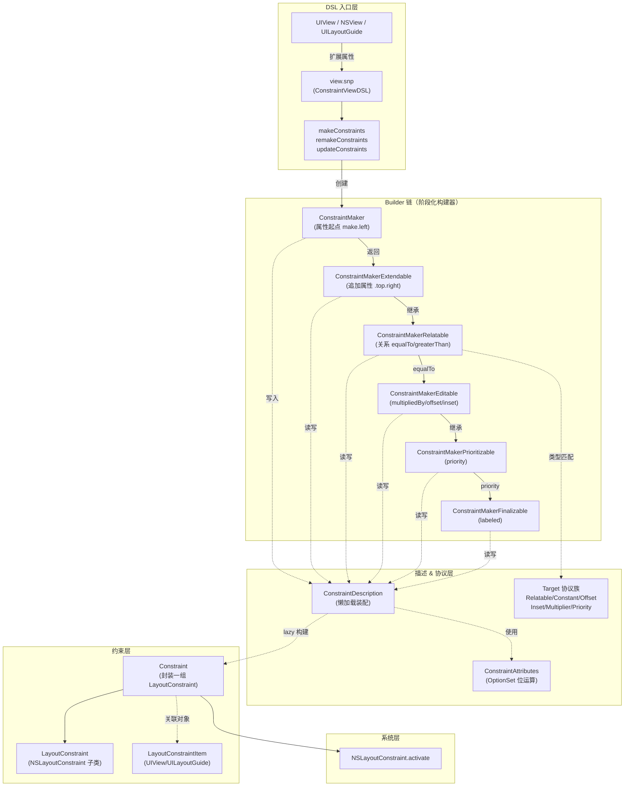
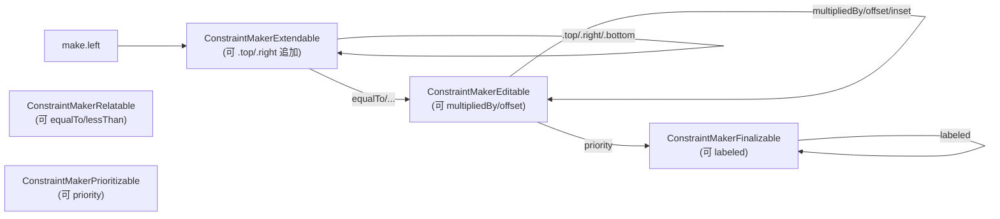
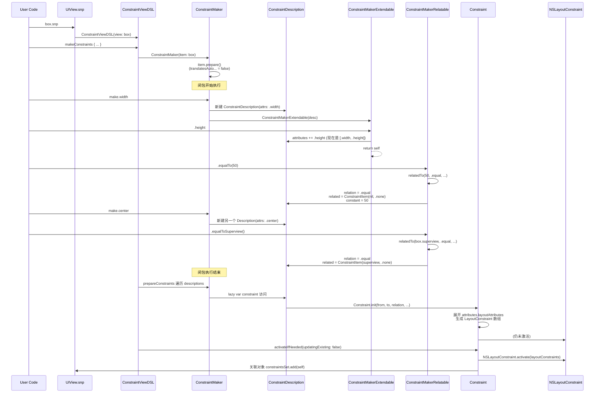

+++
title = "SnapKit源码导读"
date = '2026-05-02T22:32:27+08:00'
draft = false
weight = 7
tags = ["iOS", "源码分析"]
categories = ["iOS开发", "源码分析"]
+++
SnapKit 是 iOS / macOS 社区最广泛使用的 Auto Layout DSL 库，由 Robert Payne 等人维护，目前在 GitHub 已收获 **20k+ star**。它在 `NSLayoutConstraint` 之上构建了一整套链式、类型安全、面向协议的声明式约束语法。本文基于 **v5.7.1**（2025 年 2 月发布，最后 master commit 2025-05-08 `19f59a6`）源码进行分析，代码总量不足 **3500 行**，却用一个分级的 Builder 链路，把 `NSLayoutConstraint` 那套冗长的 API 封装成了今天我们习惯的 `make.left.equalTo(x).offset(10)`。

---

## 一、整体架构

SnapKit 的核心设计可以用一句话概括：**用编译期强约束的链式 Builder，驱动一个延迟构建的 `ConstraintDescription`，最终在闭包结束后一次性生成 `NSLayoutConstraint` 并激活**。



### 源码目录（`Sources/`，约 3500 行）

```
Sources/
├── ConstraintView.swift                       # typealias UIView/NSView → ConstraintView
├── ConstraintLayoutGuide.swift                # typealias UILayoutGuide/NSLayoutGuide
├── ConstraintLayoutSupport.swift              # typealias UILayoutSupport
├── Typealiases.swift                          # LayoutRelation / LayoutAttribute / LayoutPriority
├── ConstraintConfig.swift                     # interfaceLayoutDirection 全局开关
│
├── ConstraintView+Extensions.swift            # view.snp 入口（含 snp_ 老别名）
├── ConstraintLayoutGuide+Extensions.swift     # guide.snp 入口
├── UILayoutSupport+Extensions.swift           # topLayoutGuide.snp（iOS 11 前）
├── ConstraintViewDSL.swift                    # makeConstraints / remake / update / remove
├── ConstraintLayoutGuideDSL.swift             # LayoutGuide 版 DSL
├── ConstraintLayoutSupportDSL.swift           # LayoutSupport 版 DSL
├── ConstraintDSL.swift                        # DSL 协议 + 属性定义（left/top/edges/...）
│
├── ConstraintMaker.swift                      # 属性起点（make.left / make.edges / ...）
├── ConstraintMakerExtendable.swift            # 可追加属性（.top.right）
├── ConstraintMakerRelatable.swift             # equalTo / lessThanOrEqual / greaterThanOrEqual
├── ConstraintMakerRelatable+Extensions.swift  # equalToSuperview 闭包版
├── ConstraintMakerEditable.swift              # multipliedBy / dividedBy / offset / inset
├── ConstraintMakerPrioritizable.swift         # priority(...)
├── ConstraintMakerFinalizable.swift           # labeled(...) + .constraint
│
├── ConstraintAttributes.swift                 # OptionSet 属性位图
├── ConstraintRelation.swift                   # equal / lessThanOrEqual / greaterThanOrEqual
├── ConstraintPriority.swift                   # required/high/medium/low
├── ConstraintDescription.swift                # Builder 中间态 + lazy Constraint
├── ConstraintItem.swift                       # (target, attributes) 二元组（弱引用）
├── LayoutConstraintItem.swift                 # UIView/UILayoutGuide 统一协议
├── ConstraintInsets.swift                     # UIEdgeInsets typealias
├── ConstraintDirectionalInsets.swift          # NSDirectionalEdgeInsets（iOS 11+）
│
├── ConstraintRelatableTarget.swift            # 可作为 equalTo 参数的类型标记
├── ConstraintConstantTarget.swift             # constant 目标 + 属性→CGFloat 的派发
├── ConstraintOffsetTarget.swift               # offset 目标
├── ConstraintInsetTarget.swift                # inset 目标（含标量→insets 转换）
├── ConstraintDirectionalInsetTarget.swift     # 方向 insets 目标
├── ConstraintMultiplierTarget.swift           # multiplier 目标
├── ConstraintPriorityTarget.swift             # priority 目标（Int/Float/UILayoutPriority）
│
├── Constraint.swift                           # 真正的约束对象 + activate/deactivate
├── LayoutConstraint.swift                     # NSLayoutConstraint 子类，回指 Constraint
├── Debugging.swift                            # LayoutConstraint.description 美化
└── PrivacyInfo.xcprivacy                      # 隐私清单
```

### 核心设计思想

| 模式 | 作用 | 源码体现 |
|------|------|----------|
| **阶段化 Builder**（Staged Builder / Step Builder） | 通过继承链控制链式调用的合法顺序，让 `make.left.offset(10).equalTo(...)` 这类非法组合在编译期报错 | `ConstraintMaker → Extendable → Relatable → Editable → Prioritizable → Finalizable` |
| **协议 + 类型擦除**（POP） | 让 `Int / Float / CGFloat / CGSize / CGPoint / UIEdgeInsets / UIView / ConstraintItem` 等异构类型可以统一作为 `equalTo` / `offset` / `priority` 的参数 | `Constraint*Target` 协议族 |
| **OptionSet 位运算** | 用 32 位整型表达「属性集合」，`.edges = [.left, .top, .right, .bottom]` 这类聚合用位或实现，避免反复建数组 | `ConstraintAttributes` |
| **Associated Object** | 在不污染 `UIView` 原类的前提下，为每个 View 绑定「它持有的 SnapKit Constraint 集合」和「snp.label」 | `LayoutConstraintItem.constraintsSet` + `ConstraintDSL.setLabel` |
| **Lazy 求值** | `ConstraintDescription.constraint` 是 `lazy var`，闭包执行结束前只是收集参数，真正的 `Constraint` 构造和 `NSLayoutConstraint` 生成都推迟到最后 | `ConstraintDescription.constraint` |
| **跨平台 typealias** | 通过一组 typealias 把 iOS / macOS / tvOS 的 `UIView`/`NSView`、`UIEdgeInsets`/`NSEdgeInsets`、`UILayoutPriority`/`NSLayoutConstraint.Priority` 等抹平 | `ConstraintView.swift` / `Typealiases.swift` |

---

## 二、DSL 入口：`view.snp`

SnapKit 没有像 Masonry 那样污染 `UIView` 的命名空间，而是通过一个**命名空间结构体**暴露 DSL。

### 2.1 `snp` 扩展

```31:152:Sources/ConstraintView+Extensions.swift
public extension ConstraintView {
    // ... 省略一大堆 @available(*, deprecated) 的老 snp_xxx 别名 ...
    var snp: ConstraintViewDSL {
        return ConstraintViewDSL(view: self)
    }
}
```

`ConstraintView` 本身只是个跨平台 typealias：

```31:35:Sources/ConstraintView.swift
#if canImport(UIKit)
    public typealias ConstraintView = UIView
#else
    public typealias ConstraintView = NSView
#endif
```

注意这里的 `ConstraintViewDSL` 是**每次访问都新建**的结构体，因为它只持有一个 `view` 引用 + 几个无状态方法，所以这种"廉价"的值类型完全可以接受，也避免了把 DSL 状态挂在 View 上导致内存泄漏。

### 2.2 `ConstraintViewDSL` 的四把钥匙

```31:52:Sources/ConstraintViewDSL.swift
public struct ConstraintViewDSL: ConstraintAttributesDSL {
    
    @discardableResult
    public func prepareConstraints(_ closure: (_ make: ConstraintMaker) -> Void) -> [Constraint] {
        return ConstraintMaker.prepareConstraints(item: self.view, closure: closure)
    }
    
    public func makeConstraints(_ closure: (_ make: ConstraintMaker) -> Void) {
        ConstraintMaker.makeConstraints(item: self.view, closure: closure)
    }
    
    public func remakeConstraints(_ closure: (_ make: ConstraintMaker) -> Void) {
        ConstraintMaker.remakeConstraints(item: self.view, closure: closure)
    }
    
    public func updateConstraints(_ closure: (_ make: ConstraintMaker) -> Void) {
        ConstraintMaker.updateConstraints(item: self.view, closure: closure)
    }
    
    public func removeConstraints() {
        ConstraintMaker.removeConstraints(item: self.view)
    }
    // ...
}
```

这四个方法——`make` / `remake` / `update` / `remove`——覆盖了约束的完整生命周期，它们全部转发给 `ConstraintMaker` 的类方法。其语义差别在下文「七、`make` / `remake` / `update` 的差别」中详述。

此外，`snp` 还把「抗压缩/抗拉伸优先级」也一并暴露，这些是直接转发到 `UIView` 的 `contentHuggingPriority` 等方法：

```54:88:Sources/ConstraintViewDSL.swift
public var contentHuggingHorizontalPriority: Float {
    get { return self.view.contentHuggingPriority(for: .horizontal).rawValue }
    nonmutating set {
        self.view.setContentHuggingPriority(LayoutPriority(rawValue: newValue), for: .horizontal)
    }
}
// ... contentHuggingVerticalPriority / contentCompressionResistanceHorizontalPriority ...
```

`nonmutating set` 保证这些 setter 可以作用在 `let` 的 `snp`（其实也必须，因为 `snp` 是返回值而不是存储属性）。

### 2.3 `ConstraintDSL` / `ConstraintBasicAttributesDSL` / `ConstraintAttributesDSL`

`ConstraintViewDSL`（以及 `ConstraintLayoutGuideDSL`、`ConstraintLayoutSupportDSL`）都遵循 `ConstraintAttributesDSL` 协议。这个协议继承关系控制着「谁能访问哪些属性」：

```31:131:Sources/ConstraintDSL.swift
public protocol ConstraintDSL {
    var target: AnyObject? { get }
    func setLabel(_ value: String?)
    func label() -> String?
}
extension ConstraintDSL {
    public func setLabel(_ value: String?) {
        objc_setAssociatedObject(self.target as Any, &labelKey, value, .OBJC_ASSOCIATION_COPY_NONATOMIC)
    }
    public func label() -> String? {
        return objc_getAssociatedObject(self.target as Any, &labelKey) as? String
    }
}
private var labelKey: UInt8 = 0

public protocol ConstraintBasicAttributesDSL : ConstraintDSL {}
extension ConstraintBasicAttributesDSL {
    public var left: ConstraintItem {
        return ConstraintItem(target: self.target, attributes: ConstraintAttributes.left)
    }
    // ... top / right / bottom / leading / trailing / width / height / centerX / centerY / edges / size / center ...
}

public protocol ConstraintAttributesDSL : ConstraintBasicAttributesDSL {}
extension ConstraintAttributesDSL {
    // baseline / firstBaseline / lastBaseline
    // leftMargin / rightMargin / topMargin / bottomMargin
    // margins / directionalMargins / centerWithinMargins ...
}
```

这里有两点值得注意：

1. **协议扩展 = 零实现继承**：所有 `left` / `top` / `edges` 这些属性的实现都是协议 extension 里的默认实现，`ConstraintViewDSL`、`ConstraintLayoutGuideDSL` 一个字不写就都有了。
2. **`BasicAttributesDSL` vs `AttributesDSL`**：基础属性（`left/top/width/...`）是跨平台可用的，但 `margin` 系列、`firstBaseline` 只在 iOS 8+ 才有，所以被拆到子协议里。这也是 `UILayoutSupportDSL` 只实现基础协议的原因——`topLayoutGuide` 本身就没有 margin 的概念。
3. **`label()` 用关联对象存在 View 上**：这样当 SnapKit 打印约束时可以给出人类可读的名字（见 `Debugging.swift`）。

访问 `view.snp.left` 时，返回的是 `ConstraintItem(target: view, attributes: .left)`——这是一个**到 View 的弱引用 + 属性位图**的轻量结构体，可作为 `equalTo(...)` 的参数。

---

## 三、ConstraintMaker：链式 Builder 的起点

当我们写 `box.snp.makeConstraints { make in ... }` 时，闭包里拿到的 `make` 就是 `ConstraintMaker`：

```169:222:Sources/ConstraintMaker.swift
public let item: LayoutConstraintItem
private var descriptions = [ConstraintDescription]()

internal init(item: LayoutConstraintItem) {
    self.item = item
    self.item.prepare()            // ← 关键：设置 translatesAutoresizingMaskIntoConstraints = false
}

internal func makeExtendableWithAttributes(_ attributes: ConstraintAttributes) -> ConstraintMakerExtendable {
    let description = ConstraintDescription(item: self.item, attributes: attributes)
    self.descriptions.append(description)
    return ConstraintMakerExtendable(description)
}

internal static func makeConstraints(item: LayoutConstraintItem, closure: (_ make: ConstraintMaker) -> Void) {
    let constraints = prepareConstraints(item: item, closure: closure)
    for constraint in constraints {
        constraint.activateIfNeeded(updatingExisting: false)
    }
}
```

### 3.1 `prepare()`：关掉 autoresizing mask

```42:49:Sources/LayoutConstraintItem.swift
extension LayoutConstraintItem {
    internal func prepare() {
        if let view = self as? ConstraintView {
            view.translatesAutoresizingMaskIntoConstraints = false
        }
    }
    // ...
}
```

这一行隐藏在 `ConstraintMaker` 的 `init` 里，是 SnapKit 最良心的"无感魔法"——用户根本不需要记得关 `translatesAutoresizingMaskIntoConstraints`，否则 Auto Layout 约束会和系统自动生成的 frame 约束冲突。

### 3.2 属性入口：`make.left` / `make.edges` / ...

```30:165:Sources/ConstraintMaker.swift
public var left: ConstraintMakerExtendable {
    return self.makeExtendableWithAttributes(.left)
}
public var edges: ConstraintMakerExtendable {
    return self.makeExtendableWithAttributes(.edges)
}
public var directionalEdges: ConstraintMakerExtendable {
    return self.makeExtendableWithAttributes(.directionalEdges)
}
public var horizontalEdges: ConstraintMakerExtendable {       // v5.6 新增
    return self.makeExtendableWithAttributes(.horizontalEdges)
}
public var verticalEdges: ConstraintMakerExtendable {         // v5.6 新增
    return self.makeExtendableWithAttributes(.verticalEdges)
}
// ... 一共 20+ 个属性
```

每调用一次 `make.left`，就新建一个 `ConstraintDescription` 加入 `descriptions` 数组，并返回 `ConstraintMakerExtendable` 让用户继续链。这就是为什么一个闭包里可以写多个 `make.xxx`——它们彼此独立，互不影响。

### 3.3 `descriptions` 数组：延迟收集

`ConstraintMaker` 本身不立即生成任何 `NSLayoutConstraint`，只是把所有 `ConstraintDescription` 收集到一个数组里。闭包跑完之后：

```180:198:Sources/ConstraintMaker.swift
internal static func prepareConstraints(item: LayoutConstraintItem, closure: (_ make: ConstraintMaker) -> Void) -> [Constraint] {
    let maker = ConstraintMaker(item: item)
    closure(maker)
    var constraints: [Constraint] = []
    for description in maker.descriptions {
        guard let constraint = description.constraint else {
            continue
        }
        constraints.append(constraint)
    }
    return constraints
}

internal static func makeConstraints(item: LayoutConstraintItem, closure: (_ make: ConstraintMaker) -> Void) {
    let constraints = prepareConstraints(item: item, closure: closure)
    for constraint in constraints {
        constraint.activateIfNeeded(updatingExisting: false)
    }
}
```

注意 `description.constraint` 是 `lazy var`——只有在这里被**首次读取**时才真正构造 `Constraint` 并生成 `NSLayoutConstraint`，这也就是下一节要讲的内容。

---

## 四、阶段化 Builder：六级继承链

SnapKit 的链式 API 最精妙的地方在于：**用 Swift 的继承 + `@discardableResult` 把合法的链式顺序编译进类型系统**。来看下 `make.left.top.equalTo(other).multipliedBy(2).offset(5).priority(.high).labeled("xxx")` 的每一步返回什么：



六个类的继承链是：

```
ConstraintMakerFinalizable
    └── ConstraintMakerPrioritizable
        └── ConstraintMakerEditable
            └── ConstraintMakerRelatable
                └── ConstraintMakerExtendable  (注意：这条线反过来)
```

### 4.1 ConstraintMakerExtendable：继续追加属性

```31:195:Sources/ConstraintMakerExtendable.swift
public class ConstraintMakerExtendable: ConstraintMakerRelatable {
    
    public var left: ConstraintMakerExtendable {
        self.description.attributes += .left       // ← OptionSet 位或
        return self
    }
    
    public var top: ConstraintMakerExtendable {
        self.description.attributes += .top
        return self
    }
    
    public var edges: ConstraintMakerExtendable {
        self.description.attributes += .edges
        return self
    }
    // ... 所有属性都一样
}
```

**注意 `Extendable` 是 `Relatable` 的子类**——这意味着在 `Extendable` 状态下，你同时有「继续追加属性」和「调用 `equalTo`」两种选择。这就是为什么 `make.left.top.equalTo(...)` 是合法的：`make.left` 返回 `Extendable`，可以继续 `.top`，然后 `.equalTo` 是从父类 `Relatable` 继承来的。

`self.description.attributes += .left` 这个 `+=` 是在 `ConstraintAttributes.swift` 里重载过的，本质是 `OptionSet.formUnion`：

```193:195:Sources/ConstraintAttributes.swift
internal func +=(left: inout ConstraintAttributes, right: ConstraintAttributes) {
    left.formUnion(right)
}
```

### 4.2 ConstraintMakerRelatable：声明关系

```31:115:Sources/ConstraintMakerRelatable.swift
public class ConstraintMakerRelatable {
    internal let description: ConstraintDescription
    
    internal func relatedTo(_ other: ConstraintRelatableTarget, relation: ConstraintRelation, file: String, line: UInt) -> ConstraintMakerEditable {
        let related: ConstraintItem
        let constant: ConstraintConstantTarget
        
        if let other = other as? ConstraintItem {
            guard other.attributes == ConstraintAttributes.none ||
                  other.attributes.layoutAttributes.count <= 1 ||
                  other.attributes.layoutAttributes == self.description.attributes.layoutAttributes ||
                  other.attributes == .edges && self.description.attributes == .margins ||
                  /* ... 一堆合法的属性组合 ... */ else {
                fatalError("Cannot constraint to multiple non identical attributes. (\(file), \(line))");
            }
            related = other
            constant = 0.0
        } else if let other = other as? ConstraintView {
            related = ConstraintItem(target: other, attributes: ConstraintAttributes.none)
            constant = 0.0
        } else if let other = other as? ConstraintConstantTarget {
            related = ConstraintItem(target: nil, attributes: ConstraintAttributes.none)
            constant = other
        } else if #available(iOS 9.0, OSX 10.11, *), let other = other as? ConstraintLayoutGuide {
            related = ConstraintItem(target: other, attributes: ConstraintAttributes.none)
            constant = 0.0
        } else {
            fatalError("Invalid constraint. (\(file), \(line))")
        }
        
        let editable = ConstraintMakerEditable(self.description)
        editable.description.sourceLocation = (file, line)
        editable.description.relation = relation
        editable.description.related = related
        editable.description.constant = constant
        return editable
    }
    
    @discardableResult
    public func equalTo(_ other: ConstraintRelatableTarget, _ file: String = #fileID, _ line: UInt = #line) -> ConstraintMakerEditable {
        return self.relatedTo(other, relation: .equal, file: file, line: line)
    }
    // ... lessThanOrEqualTo / greaterThanOrEqualTo / equalToSuperview ...
}
```

这里是整个 DSL 的**"分派枢纽"**，`relatedTo(_:)` 做了四件大事：

1. **运行时类型分派**：根据 `other` 的实际类型（`ConstraintItem` / `ConstraintView` / `ConstraintConstantTarget` / `ConstraintLayoutGuide`）选择不同的组装方式。Swift 里不能对协议做"尾递归"模式匹配，所以这里是一串 `if let`。
2. **属性合法性校验**：例如 `make.left.equalTo(other.snp.top)` 会被 `fatalError` 掉，因为 `layoutAttributes.count == 1` 但两边不相等。这是运行时的"编译期约束"补丁。
3. **`#fileID` / `#line`**：在 5.7.1 里从 `#file` 改成了 `#fileID`（master 最新 commit `19f59a6` 就是为此），避免把完整路径编译进二进制、泄漏开发机信息。
4. **把参数写入 `description`**：这是 Builder 模式的关键——调用者不持有 `description`，但每一步都在修改共享的 `ConstraintDescription`。

注意 `equalTo(100)` 这种"直接传数值"的场景走的是 `ConstraintConstantTarget` 分支，`related` 的 `target = nil`，这种约束会在后面生成一条 `width = 100` 的纯 `constant` 约束。

### 4.3 ConstraintMakerEditable：修饰 constant / multiplier

```31:64:Sources/ConstraintMakerEditable.swift
public class ConstraintMakerEditable: ConstraintMakerPrioritizable {

    @discardableResult
    public func multipliedBy(_ amount: ConstraintMultiplierTarget) -> ConstraintMakerEditable {
        self.description.multiplier = amount
        return self
    }
    
    @discardableResult
    public func dividedBy(_ amount: ConstraintMultiplierTarget) -> ConstraintMakerEditable {
        return self.multipliedBy(1.0 / amount.constraintMultiplierTargetValue)
    }
    
    @discardableResult
    public func offset(_ amount: ConstraintOffsetTarget) -> ConstraintMakerEditable {
        self.description.constant = amount.constraintOffsetTargetValue
        return self
    }
    
    @discardableResult
    public func inset(_ amount: ConstraintInsetTarget) -> ConstraintMakerEditable {
        self.description.constant = amount.constraintInsetTargetValue
        return self
    }
    
    #if canImport(UIKit)
    @discardableResult
    @available(iOS 11.0, tvOS 11.0, *)
    public func inset(_ amount: ConstraintDirectionalInsetTarget) -> ConstraintMakerEditable {
        self.description.constant = amount.constraintDirectionalInsetTargetValue
        return self
    }
    #endif
}
```

`offset` / `inset` 有一个微妙的区别：`offset(10)` 是"朝内偏 10"，`inset(10)` 是"向内缩 10"，两者在 `top / left` 上符号一致，在 `right / bottom` 上符号相反。这个符号差异不是在这里处理的，而是在 `ConstraintConstantTarget.constraintConstantTargetValueFor(layoutAttribute:)` 里——见下一节。

### 4.4 ConstraintMakerPrioritizable / Finalizable

```33:70:Sources/ConstraintMakerPrioritizable.swift
public class ConstraintMakerPrioritizable: ConstraintMakerFinalizable {
    
    @discardableResult
    public func priority(_ amount: ConstraintPriority) -> ConstraintMakerFinalizable {
        self.description.priority = amount.value
        return self
    }
    
    @discardableResult
    public func priority(_ amount: ConstraintPriorityTarget) -> ConstraintMakerFinalizable {
        self.description.priority = amount
        return self
    }
    // ... 废弃的 priorityRequired/High/Medium/Low ...
}
```

```31:49:Sources/ConstraintMakerFinalizable.swift
public class ConstraintMakerFinalizable {
    
    internal let description: ConstraintDescription
    
    internal init(_ description: ConstraintDescription) {
        self.description = description
    }
    
    @discardableResult
    public func labeled(_ label: String) -> ConstraintMakerFinalizable {
        self.description.label = label
        return self
    }
    
    public var constraint: Constraint {
        return self.description.constraint!
    }
}
```

`Finalizable.constraint` 是整条链的**终点产物**——但它其实并不是必须显式访问的。像我们平时写 `make.width.equalTo(50)`，根本不会用 `.constraint` 属性，因为链条的值被 `@discardableResult` 丢弃了，真正起作用的是 `ConstraintMaker` 持有的 `descriptions` 数组。只有当你需要把 `Constraint` 引用存起来（用来后续动态更新/停用）时才会用它。

### 4.5 为什么要分六级？—— Staged Builder 的威力

用这样一条继承链，SnapKit 获得了一组编译期保证：

- `make.left.offset(10)` ❌ —— `Extendable` 没有 `offset`
- `make.left.priority(.high)` ❌ —— `Extendable` 没有 `priority`
- `make.left.equalTo(other).offset(10).equalTo(another)` ❌ —— `equalTo` 只在 `Relatable` 上，返回的 `Editable` 不再暴露 `equalTo`
- `make.left.top.equalTo(other).offset(10).priority(.high).labeled("x")` ✅ —— 每一步都合法

这种「**让不合法的状态在语法层面不可表达**」的设计是 Swift 静态类型系统的最佳实践之一。

---

## 五、ConstraintDescription：Builder 的共享状态

所有六级 Builder 的 `description` 其实指向同一个对象：

```31:69:Sources/ConstraintDescription.swift
public class ConstraintDescription {
    
    internal let item: LayoutConstraintItem
    internal var attributes: ConstraintAttributes
    internal var relation: ConstraintRelation? = nil
    internal var sourceLocation: (String, UInt)? = nil
    internal var label: String? = nil
    internal var related: ConstraintItem? = nil
    internal var multiplier: ConstraintMultiplierTarget = 1.0
    internal var constant: ConstraintConstantTarget = 0.0
    internal var priority: ConstraintPriorityTarget = 1000.0
    internal lazy var constraint: Constraint? = {
        guard let relation = self.relation,
              let related = self.related,
              let sourceLocation = self.sourceLocation else {
            return nil
        }
        let from = ConstraintItem(target: self.item, attributes: self.attributes)
        
        return Constraint(
            from: from,
            to: related,
            relation: relation,
            sourceLocation: sourceLocation,
            label: self.label,
            multiplier: self.multiplier,
            constant: self.constant,
            priority: self.priority
        )
    }()
    
    internal init(item: LayoutConstraintItem, attributes: ConstraintAttributes) {
        self.item = item
        self.attributes = attributes
    }
}
```

关键点：

- **`class` 而不是 `struct`**：Builder 链中的每个对象都只存一个 `description` 引用，通过引用语义共享状态，任何一步的修改都对后续可见。
- **`lazy var constraint`**：真正的 `Constraint`（以及它内部的 `NSLayoutConstraint`）直到被访问时才构造。用户正常调用 `makeConstraints` 时，构造发生在 `ConstraintMaker.prepareConstraints` 里——也就是闭包跑完之后。
- **`relation`/`related`/`sourceLocation` 是可选的**：如果一个 `make.left` 后面啥也没接（既没 `equalTo` 也没 `offset`），那 `constraint` 闭包会返回 `nil`，这条 `description` 就被 `prepareConstraints` 忽略。这是 SnapKit 对"残缺链"的容错策略。

---

## 六、Target 协议族：POP 类型擦除

SnapKit 的第二大设计亮点是一组「Target」协议，它们让 `equalTo(100)`、`equalTo(view)`、`equalTo(view.snp.top)`、`equalTo(CGSize(...))` 这些类型完全不同的参数能走同一个 API。

### 6.1 `ConstraintRelatableTarget`：`equalTo` 参数的总入口

```31:73:Sources/ConstraintRelatableTarget.swift
public protocol ConstraintRelatableTarget {}

extension Int: ConstraintRelatableTarget {}
extension UInt: ConstraintRelatableTarget {}
extension Float: ConstraintRelatableTarget {}
extension Double: ConstraintRelatableTarget {}
extension CGFloat: ConstraintRelatableTarget {}
extension CGSize: ConstraintRelatableTarget {}
extension CGPoint: ConstraintRelatableTarget {}
extension ConstraintInsets: ConstraintRelatableTarget {}
#if canImport(UIKit)
@available(iOS 11.0, tvOS 11.0, *)
extension ConstraintDirectionalInsets: ConstraintRelatableTarget {}
#endif
extension ConstraintItem: ConstraintRelatableTarget {}
extension ConstraintView: ConstraintRelatableTarget {}
@available(iOS 9.0, OSX 10.11, *)
extension ConstraintLayoutGuide: ConstraintRelatableTarget {}
```

这是一个**空协议**——它唯一的作用就是给 `equalTo` 的参数位开一个白名单。任何没 extend 过这个协议的类型，即便用 `Any` 强转也过不了编译。

### 6.2 `ConstraintConstantTarget`：把异构类型折算成 `CGFloat`

`Constraint` 最终塞给 `NSLayoutConstraint` 的 `constant` 是 `CGFloat`，但用户传进来的 `constant` 可能是 `Int`、`Float`、`CGSize`、`UIEdgeInsets`——这都需要在初始化约束时按**属性类型**折算。

```49:211:Sources/ConstraintConstantTarget.swift
extension ConstraintConstantTarget {
    internal func constraintConstantTargetValueFor(layoutAttribute: LayoutAttribute) -> CGFloat {
        if let value = self as? CGFloat { return value }
        if let value = self as? Float { return CGFloat(value) }
        // ... Double/Int/UInt 转 CGFloat ...
        
        if let value = self as? CGSize {
            if layoutAttribute == .width { return value.width }
            else if layoutAttribute == .height { return value.height }
            else { return 0.0 }
        }
        
        if let value = self as? CGPoint {
            switch layoutAttribute {
            case .left, .right, .leading, .trailing, .centerX, .leftMargin, ...:
                return value.x
            case .top, .bottom, .centerY, .topMargin, ..., .lastBaseline, .firstBaseline:
                return value.y
            // ...
            }
        }
        
        if let value = self as? ConstraintInsets {
            switch layoutAttribute {
            case .left, .leftMargin:            return value.left
            case .top, .topMargin, .firstBaseline:
                                                return value.top
            case .right, .rightMargin:          return -value.right     // ← 符号翻转
            case .bottom, .bottomMargin, .lastBaseline:
                                                return -value.bottom    // ← 符号翻转
            case .leading, .leadingMargin:
                return (ConstraintConfig.interfaceLayoutDirection == .leftToRight) ? value.left : value.right
            case .trailing, .trailingMargin:
                return (ConstraintConfig.interfaceLayoutDirection == .leftToRight) ? -value.right : -value.left
            case .centerX, .centerXWithinMargins:
                                                return (value.left - value.right) / 2
            case .centerY, .centerYWithinMargins:
                                                return (value.top - value.bottom) / 2
            case .width:                        return -(value.left + value.right)
            case .height:                       return -(value.top + value.bottom)
            // ...
            }
        }
        
        // ConstraintDirectionalInsets ... 与 ConstraintInsets 类似但 leading/trailing 不看 interfaceLayoutDirection
        return 0.0
    }
}
```

这里面藏着很多「为什么 `make.edges.equalTo(superview).inset(10)` 能对的上 Frame」的秘密：

- `right`/`bottom` 的 inset 值会被**取反**（因为 Auto Layout 的约束方程是 `first - second = constant`，右边越向内 constant 越负）。
- `leading`/`trailing` 会根据 `ConstraintConfig.interfaceLayoutDirection` 自动选择实际使用 `left` 还是 `right`，这正是 RTL 适配的关键。
- `edges.equalTo(size).width/height` 会返回 `-(left + right)`，对应"等于父视图宽 - 左右 inset"。

### 6.3 全家福：6 个 Target 协议

| 协议 | 用途 | 接受类型 |
|------|------|---------|
| `ConstraintRelatableTarget` | `equalTo / greaterThanOrEqualTo / lessThanOrEqualTo` 的参数 | 所有数值 + `ConstraintItem` + View + LayoutGuide + Insets |
| `ConstraintConstantTarget` | `Constraint.constant` 的底层存储 | 数值 + `CGSize` + `CGPoint` + `Insets` + `DirectionalInsets` |
| `ConstraintOffsetTarget` | `offset(...)` 的参数 | 数值类型（标量） |
| `ConstraintInsetTarget` | `inset(...)` 的参数 | 数值（转成四向相同的 insets）+ `UIEdgeInsets` |
| `ConstraintDirectionalInsetTarget` | `inset(...)` 的方向版（iOS 11+） | 数值 + `NSDirectionalEdgeInsets` |
| `ConstraintMultiplierTarget` | `multipliedBy / dividedBy` 的参数 | 数值 |
| `ConstraintPriorityTarget` | `priority(...)` 的参数 | 数值 + `UILayoutPriority` |

例如 `ConstraintInsetTarget` 的"标量自动扩展成四向相同 insets"的小聪明：

```52:71:Sources/ConstraintInsetTarget.swift
extension ConstraintInsetTarget {
    internal var constraintInsetTargetValue: ConstraintInsets {
        if let amount = self as? ConstraintInsets {
            return amount
        } else if let amount = self as? Float {
            return ConstraintInsets(top: CGFloat(amount), left: CGFloat(amount), bottom: CGFloat(amount), right: CGFloat(amount))
        } else if let amount = self as? Double {
            return ConstraintInsets(top: CGFloat(amount), left: CGFloat(amount), bottom: CGFloat(amount), right: CGFloat(amount))
        } else if let amount = self as? CGFloat {
            return ConstraintInsets(top: amount, left: amount, bottom: amount, right: amount)
        }
        // ...
    }
}
```

这就是为什么 `make.edges.equalTo(superview).inset(10)` 里的 `10` 会自动变成 `UIEdgeInsets(10, 10, 10, 10)`。

---

## 七、ConstraintAttributes：用位图表达聚合属性

SnapKit 用 `OptionSet` 来表达属性集合，使得 `.edges` 这类聚合属性只是一个位或。

```31:117:Sources/ConstraintAttributes.swift
internal struct ConstraintAttributes : OptionSet, ExpressibleByIntegerLiteral {
    
    internal private(set) var rawValue: UInt
    
    // normal
    internal static let none: ConstraintAttributes = 0
    internal static let left: ConstraintAttributes = ConstraintAttributes(UInt(1) << 0)
    internal static let top: ConstraintAttributes = ConstraintAttributes(UInt(1) << 1)
    internal static let right: ConstraintAttributes = ConstraintAttributes(UInt(1) << 2)
    internal static let bottom: ConstraintAttributes = ConstraintAttributes(UInt(1) << 3)
    internal static let leading: ConstraintAttributes = ConstraintAttributes(UInt(1) << 4)
    internal static let trailing: ConstraintAttributes = ConstraintAttributes(UInt(1) << 5)
    internal static let width: ConstraintAttributes = ConstraintAttributes(UInt(1) << 6)
    internal static let height: ConstraintAttributes = ConstraintAttributes(UInt(1) << 7)
    internal static let centerX: ConstraintAttributes = ConstraintAttributes(UInt(1) << 8)
    internal static let centerY: ConstraintAttributes = ConstraintAttributes(UInt(1) << 9)
    internal static let lastBaseline: ConstraintAttributes = ConstraintAttributes(UInt(1) << 10)
    @available(iOS 8.0, OSX 10.11, *)
    internal static let firstBaseline: ConstraintAttributes = ConstraintAttributes(UInt(1) << 11)
    // leftMargin(1<<12), rightMargin(1<<13), ...
    
    // aggregates
    internal static let edges: ConstraintAttributes = [.horizontalEdges, .verticalEdges]
    internal static let horizontalEdges: ConstraintAttributes = [.left, .right]
    internal static let verticalEdges: ConstraintAttributes = [.top, .bottom]
    internal static let directionalEdges: ConstraintAttributes = [.directionalHorizontalEdges, .directionalVerticalEdges]
    internal static let directionalHorizontalEdges: ConstraintAttributes = [.leading, .trailing]
    internal static let directionalVerticalEdges: ConstraintAttributes = [.top, .bottom]
    internal static let size: ConstraintAttributes = [.width, .height]
    internal static let center: ConstraintAttributes = [.centerX, .centerY]
    @available(iOS 8.0, *)
    internal static let margins: ConstraintAttributes = [.leftMargin, .topMargin, .rightMargin, .bottomMargin]
    @available(iOS 8.0, *)
    internal static let directionalMargins: ConstraintAttributes = [.leadingMargin, .topMargin, .trailingMargin, .bottomMargin]
    @available(iOS 8.0, *)
    internal static let centerWithinMargins: ConstraintAttributes = [.centerXWithinMargins, .centerYWithinMargins]
    
    internal var layoutAttributes:[LayoutAttribute] {
        var attrs = [LayoutAttribute]()
        if (self.contains(ConstraintAttributes.left))  { attrs.append(.left) }
        if (self.contains(ConstraintAttributes.top))   { attrs.append(.top) }
        // ... 十几个 if
        return attrs
    }
}
```

亮点：

- **聚合只是位或**：`.edges` 在编译期就是 `UInt(1<<0 | 1<<1 | 1<<2 | 1<<3) = 15`，而不是一个 `[Attribute]` 数组。
- **`layoutAttributes` 在需要的时候再展开**：当 `Constraint` 初始化需要为每个属性分别生成一条 `NSLayoutConstraint` 时，才调用这个 getter 展开成 `[LayoutAttribute]`。
- **跨平台差异**：只有 iOS 版本才把 margin 属性加进展开列表，macOS 的 `NSView` 没有 `margins` 概念，所以 macOS 下即便有 `margins` 也只展开成空数组。

这就直接回答了一个经典问题：「`make.edges.equalTo(view)` 底层生成几条 `NSLayoutConstraint`？」——四条：`top/left/bottom/right` 各一条。

---

## 八、Constraint：把 Description 烧录成 NSLayoutConstraint

`Constraint` 是 SnapKit 对一组**语义相关**的 `NSLayoutConstraint`（例如 `.edges` 展开后的四条）的打包封装。

```30:90:Sources/Constraint.swift
public final class Constraint {

    internal let sourceLocation: (String, UInt)
    internal let label: String?
    private let from: ConstraintItem
    private let to: ConstraintItem
    private let relation: ConstraintRelation
    private let multiplier: ConstraintMultiplierTarget
    private var constant: ConstraintConstantTarget {
        didSet { self.updateConstantAndPriorityIfNeeded() }
    }
    private var priority: ConstraintPriorityTarget {
        didSet { self.updateConstantAndPriorityIfNeeded() }
    }
    public var layoutConstraints: [LayoutConstraint]
    
    public var isActive: Bool {
        set { newValue ? activate() : deactivate() }
        get {
            for layoutConstraint in self.layoutConstraints {
                if layoutConstraint.isActive { return true }
            }
            return false
        }
    }
```

关键点：

- **`final class`**：禁止继承，有利于编译器做 devirtualization 优化。
- **`constant` / `priority` 用 `didSet`**：一旦后续 `update(offset:)` 修改了 `constant`，就自动把所有内部 `LayoutConstraint` 都刷一遍——这就是 `snp.updateConstraints` 和 `constraint.update(offset:)` 为什么能动态修改约束而不需要 `invalidateLayout`。

### 8.1 初始化：属性展开 + 跨属性映射

`init` 里的核心循环（摘录）：

```101:213:Sources/Constraint.swift
for layoutFromAttribute in layoutFromAttributes {
    let layoutToAttribute: LayoutAttribute
    #if canImport(UIKit)
        if layoutToAttributes.count > 0 {
            if self.from.attributes == .edges && self.to.attributes == .margins {
                switch layoutFromAttribute {
                case .left:   layoutToAttribute = .leftMargin
                case .right:  layoutToAttribute = .rightMargin
                case .top:    layoutToAttribute = .topMargin
                case .bottom: layoutToAttribute = .bottomMargin
                default: fatalError()
                }
            } else if /* margins → edges / directionalEdges → directionalMargins / ... */ {
                // ...
            } else if self.from.attributes == self.to.attributes {
                layoutToAttribute = layoutFromAttribute
            } else {
                layoutToAttribute = layoutToAttributes[0]
            }
        } else {
            if self.to.target == nil && (layoutFromAttribute == .centerX || layoutFromAttribute == .centerY) {
                layoutToAttribute = layoutFromAttribute == .centerX ? .left : .top
            } else {
                layoutToAttribute = layoutFromAttribute
            }
        }
    #else
        // macOS 简化版
    #endif

    let layoutConstant: CGFloat = self.constant.constraintConstantTargetValueFor(layoutAttribute: layoutToAttribute)
    var layoutTo: AnyObject? = self.to.target

    // 没指定对端 View？那就用 superview（除了 width/height 这种不需要参考系的）
    if layoutTo == nil && layoutToAttribute != .width && layoutToAttribute != .height {
        layoutTo = layoutFrom.superview
    }

    let layoutConstraint = LayoutConstraint(
        item: layoutFrom,
        attribute: layoutFromAttribute,
        relatedBy: layoutRelation,
        toItem: layoutTo,
        attribute: layoutToAttribute,
        multiplier: self.multiplier.constraintMultiplierTargetValue,
        constant: layoutConstant
    )
    layoutConstraint.label = self.label
    layoutConstraint.priority = LayoutPriority(rawValue: self.priority.constraintPriorityTargetValue)
    layoutConstraint.constraint = self
    self.layoutConstraints.append(layoutConstraint)
}
```

这段长代码（200+ 行）解决了一连串"看似不对称"的需求：

1. **`edges` ↔ `margins` 的互译**：`make.edges.equalTo(superview.snp.margins)` 时需要 `from.left` 对 `to.leftMargin`，`from.top` 对 `to.topMargin`，而不是简单的 `layoutFromAttribute == layoutToAttribute`。`directionalEdges ↔ directionalMargins` 也同理。
2. **不写 `equalTo(superview)` 默认走 superview**：`make.left.equalTo(100)` 里 `to.target == nil`，此时 SnapKit 会自动把 `layoutTo` 指向 `layoutFrom.superview`（`width`/`height` 除外——它们不需要参考系）。
3. **`centerX/Y` 对常量的特殊处理**：`make.centerX.equalTo(100)` 其实相当于「centerX 位于 superview 左侧 100 处」，所以 `layoutToAttribute` 会从 `centerX` 改成 `left`（centerY 改成 top）。这个 hack 是历史遗留。

### 8.2 activate / deactivate

```304:340:Sources/Constraint.swift
internal func activateIfNeeded(updatingExisting: Bool = false) {
    guard let item = self.from.layoutConstraintItem else {
        print("WARNING: SnapKit failed to get from item from constraint. Activate will be a no-op.")
        return
    }
    let layoutConstraints = self.layoutConstraints

    if updatingExisting {
        var existingLayoutConstraints: [LayoutConstraint] = []
        for constraint in item.constraints {
            existingLayoutConstraints += constraint.layoutConstraints
        }
        for layoutConstraint in layoutConstraints {
            let existingLayoutConstraint = existingLayoutConstraints.first { $0 == layoutConstraint }
            guard let updateLayoutConstraint = existingLayoutConstraint else {
                fatalError("Updated constraint could not find existing matching constraint to update: \(layoutConstraint)")
            }
            let updateLayoutAttribute = (updateLayoutConstraint.secondAttribute == .notAnAttribute) ? updateLayoutConstraint.firstAttribute : updateLayoutConstraint.secondAttribute
            updateLayoutConstraint.constant = self.constant.constraintConstantTargetValueFor(layoutAttribute: updateLayoutAttribute)
        }
    } else {
        NSLayoutConstraint.activate(layoutConstraints)
        item.add(constraints: [self])
    }
}

internal func deactivateIfNeeded() {
    guard let item = self.from.layoutConstraintItem else {
        print("WARNING: SnapKit failed to get from item from constraint. Deactivate will be a no-op.")
        return
    }
    let layoutConstraints = self.layoutConstraints
    NSLayoutConstraint.deactivate(layoutConstraints)
    item.remove(constraints: [self])
}
```

- `updatingExisting = false`（`make`）：直接调 `NSLayoutConstraint.activate`，把 Constraint 塞进 view 的 `constraintsSet`。
- `updatingExisting = true`（`update`）：不创建新约束，而是在 view 现有约束里用 `==` 找"等价"约束，只改它的 `constant`。
- `LayoutConstraint` 的 `==` 比较了 `firstItem/secondItem/firstAttribute/secondAttribute/relation/priority/multiplier`（见 `LayoutConstraint.swift`），正好是除 `constant` 之外的所有字段——所以等价就是"除了数值一样"，`update` 自然只能改数值。

---

## 九、`make` / `remake` / `update` 的差别

```180:222:Sources/ConstraintMaker.swift
internal static func makeConstraints(item: LayoutConstraintItem, closure: (_ make: ConstraintMaker) -> Void) {
    let constraints = prepareConstraints(item: item, closure: closure)
    for constraint in constraints {
        constraint.activateIfNeeded(updatingExisting: false)
    }
}

internal static func remakeConstraints(item: LayoutConstraintItem, closure: (_ make: ConstraintMaker) -> Void) {
    self.removeConstraints(item: item)
    self.makeConstraints(item: item, closure: closure)
}

internal static func updateConstraints(item: LayoutConstraintItem, closure: (_ make: ConstraintMaker) -> Void) {
    guard item.constraints.count > 0 else {
        self.makeConstraints(item: item, closure: closure)
        return
    }
    let constraints = prepareConstraints(item: item, closure: closure)
    for constraint in constraints {
        constraint.activateIfNeeded(updatingExisting: true)
    }
}

internal static func removeConstraints(item: LayoutConstraintItem) {
    let constraints = item.constraints
    for constraint in constraints {
        constraint.deactivateIfNeeded()
    }
}
```

| API | 行为 | 典型场景 |
|-----|------|---------|
| `makeConstraints` | **追加**新约束，不清除旧的 | 初次布局 |
| `remakeConstraints` | **移除全部**已有 SnapKit 约束，再走 `make` | 布局规则整体变了（例如不同形态切换） |
| `updateConstraints` | 查找等价约束**改 `constant`**；如果 view 没有任何 SnapKit 约束，**降级**成 `make` | 只改边距/宽高数值 |
| `removeConstraints` | 移除全部 SnapKit 约束 | 手动清理 |

最容易踩坑的就是 `update`：如果你改了 `multiplier`、`priority` 或 `relation`，`update` 会因为找不到等价约束而 `fatalError`。这是典型的「SnapKit 不能改结构，只能改值」规则。

---

## 十、View ↔ Constraint 的关联

SnapKit 通过 **Associated Object** 把 `[Constraint]` 挂在 `UIView` / `UILayoutGuide` 上，用于支持 `update` / `remove`。

```42:93:Sources/LayoutConstraintItem.swift
extension LayoutConstraintItem {
    
    internal func prepare() {
        if let view = self as? ConstraintView {
            view.translatesAutoresizingMaskIntoConstraints = false
        }
    }
    
    internal var superview: ConstraintView? {
        if let view = self as? ConstraintView { return view.superview }
        if #available(iOS 9.0, OSX 10.11, *), let guide = self as? ConstraintLayoutGuide {
            return guide.owningView
        }
        return nil
    }
    
    internal var constraints: [Constraint] {
        return self.constraintsSet.allObjects as! [Constraint]
    }
    
    internal func add(constraints: [Constraint]) {
        let constraintsSet = self.constraintsSet
        for constraint in constraints {
            constraintsSet.add(constraint)
        }
    }
    
    internal func remove(constraints: [Constraint]) {
        let constraintsSet = self.constraintsSet
        for constraint in constraints {
            constraintsSet.remove(constraint)
        }
    }
    
    private var constraintsSet: NSMutableSet {
        let constraintsSet: NSMutableSet
        if let existing = objc_getAssociatedObject(self, &constraintsKey) as? NSMutableSet {
            constraintsSet = existing
        } else {
            constraintsSet = NSMutableSet()
            objc_setAssociatedObject(self, &constraintsKey, constraintsSet, .OBJC_ASSOCIATION_RETAIN_NONATOMIC)
        }
        return constraintsSet
    }
}
private var constraintsKey: UInt8 = 0
```

细节：

- 使用 `NSMutableSet` 而不是 `Array`，`Set` 保证去重和 `O(1)` 的 `add`/`remove`。
- `OBJC_ASSOCIATION_RETAIN_NONATOMIC`，因为 `NSMutableSet` 自身不是线程安全的，所以 SnapKit 约定**只在主线程使用**，这也是 UIKit 的一般要求。
- `ConstraintItem.target` 是 `weak`，而 `Constraint` 本身被 view 的关联 Set 强持有。这意味着只要 view 存在，它身上的约束就不会被释放；view 释放后，约束随关联对象一起消散。

### ConstraintItem 的弱引用

```31:45:Sources/ConstraintItem.swift
public final class ConstraintItem {
    internal weak var target: AnyObject?    // ← weak
    internal let attributes: ConstraintAttributes
    
    internal init(target: AnyObject?, attributes: ConstraintAttributes) {
        self.target = target
        self.attributes = attributes
    }
    
    internal var layoutConstraintItem: LayoutConstraintItem? {
        return self.target as? LayoutConstraintItem
    }
}
```

这一行 `weak` 至关重要——它保证了 `make.top.equalTo(otherView.snp.bottom)` 不会让 `otherView` 被 `self` 间接持有，从而避免了循环引用（SnapKit 历史上就因为这个被诟病过，`LayoutConstraint.swift` 里的注释甚至专门提到了"如果 View 被提前释放会导致崩溃"）。

---

## 十一、Debugging：可读的 Layout 日志

当 Auto Layout 引擎崩溃/打冲突警告时，`NSLayoutConstraint` 默认的 `description` 非常难读——SnapKit 给它重写了：

```31:77:Sources/Debugging.swift
public extension LayoutConstraint {
    
    override var description: String {
        var description = "<"
        description += descriptionForObject(self)
        
        if let firstItem = conditionalOptional(from: self.firstItem) {
            description += " \(descriptionForObject(firstItem))"
        }
        if self.firstAttribute != .notAnAttribute {
            description += ".\(descriptionForAttribute(self.firstAttribute))"
        }
        description += " \(descriptionForRelation(self.relation))"
        if let secondItem = self.secondItem {
            description += " \(descriptionForObject(secondItem))"
        }
        if self.secondAttribute != .notAnAttribute {
            description += ".\(descriptionForAttribute(self.secondAttribute))"
        }
        if self.multiplier != 1.0 {
            description += " * \(self.multiplier)"
        }
        if self.secondAttribute == .notAnAttribute {
            description += " \(self.constant)"
        } else {
            if self.constant > 0.0 {
                description += " + \(self.constant)"
            } else if self.constant < 0.0 {
                description += " - \(abs(self.constant))"
            }
        }
        if self.priority.rawValue != 1000.0 {
            description += " ^\(self.priority)"
        }
        description += ">"
        return description
    }
}
```

结合 `ConstraintMakerRelatable` 里记录的 `sourceLocation`（`#fileID` + `#line`），就能打印出：

```
<LayoutConstraint:redBox@ViewController.swift#42 UIView:redBox.top == UIView:superview.top + 20>
```

这比系统默认的 `<NSLayoutConstraint:0x600003...>` 可读性不知道高到哪里去了。

---

## 十二、全景流程示例

让我们把前面所有环节串起来，走一遍经典的：

```swift
box.snp.makeConstraints { make in
    make.width.height.equalTo(50)
    make.center.equalToSuperview()
}
```



用户看到的一行 `make.width.height.equalTo(50)`，底层其实经历了：

1. `make.width` → `Extendable(desc1, attrs=[.width])`
2. `.height` → `Extendable(desc1, attrs=[.width, .height])`
3. `.equalTo(50)` → `Editable(desc1, constant=50, related=(nil, .none))`
4. 闭包结束后 `desc1.constraint` 被触发 → `Constraint.init(...)` → 展开成两条 `LayoutConstraint(width == 50)` 和 `LayoutConstraint(height == 50)`
5. `NSLayoutConstraint.activate([...])`

共生成 **4 条**原生 `NSLayoutConstraint`（width=50、height=50、centerX==superview.centerX、centerY==superview.centerY）。

---

## 十三、SnapKit 设计亮点总结

通过把整个库精读一遍，可以提炼出以下可借鉴的设计经验：

### 13.1 类型驱动的 DSL

通过**阶段化继承**（Staged Builder）让 DSL 的每一步只暴露当前阶段合法的 API，把"链式调用顺序正确"这件事交给编译器。这比用 `if/else` 或者运行时断言优雅得多，也是 Swift 类型系统在 DSL 场景的最佳实践之一。

### 13.2 协议导向抹平异构类型

`ConstraintRelatableTarget` / `ConstraintConstantTarget` 这套"空协议 + 扩展"的写法在 Swift 2 时代就有，直到今天也是 Swift 实现 "Haskell 的 Any-typeclass" 最简洁的办法。它把六种数值类型 + 四种集合类型 + 两种 View 类型统一到了同一个 API 上，而调用方完全无感。

### 13.3 懒加载延迟生效

`ConstraintDescription.constraint` 用 `lazy var` 实现"只在闭包结束时才物化约束"，让 `ConstraintMaker` 的闭包里的每一步都是纯粹的参数收集，既便于批量 `activate`（比一条一条激活快得多），又保留了中途反悔（`make.left`没接 `equalTo` 的话直接丢弃）的能力。

### 13.4 位运算做属性集合

`ConstraintAttributes` 用 `OptionSet` 在编译期就把 `.edges` 算成 `15`，`.contains(.left)` 是一次位与——这在每次 `makeConstraints` 循环里都会执行大量次数的场景，性能开销几乎为零。

### 13.5 Associated Object 做容器

不修改 `UIView`/`UILayoutGuide` 原类，而是通过 `objc_setAssociatedObject` 附加一个 `NSMutableSet`。这种做法在 Swift-only 类型（值类型、纯 Swift class）上不可行，但 SnapKit 能用是因为 UIKit/AppKit 所有的视图都继承自 `NSObject`。

### 13.6 跨平台抽象

SnapKit 用一组 typealias（`ConstraintView` / `ConstraintInsets` / `ConstraintLayoutGuide` / `LayoutPriority` / `LayoutAttribute` / `LayoutRelation`）统一了 UIKit / AppKit 两套 API，整个代码库里只有极少数地方需要 `#if canImport(UIKit)`——绝大多数业务逻辑跨平台复用。

### 13.7 优雅的降级策略

- `snp.updateConstraints` 在 view 没有任何约束时自动降级成 `make`
- `make.left.equalTo(100)` 的 `to.target == nil` 时自动指向 `superview`
- `make.centerX.equalTo(100)` 自动把 `centerX` 映射成 `left`
- 「属性不完整」的 description 被静默丢弃而不是崩溃

这些"用户写错也能跑"的降级让 SnapKit 在高频业务场景下的鲁棒性远超原生 API。

---

## 十四、使用建议与常见陷阱

1. **`make.edges.equalTo(superview)` 比 `make.top/.left/.bottom/.right.equalTo(superview)` 更高效**——前者生成 1 个 `Constraint`（内含 4 条 `NSLayoutConstraint`），后者生成 4 个 `Constraint`。在 `deactivate` 时前者只需 1 次集合操作。

2. **`update` 不能改 `multiplier`/`priority`/`relation`**——这些在 `LayoutConstraint ==` 里被用于等价性判定，改了就找不到旧约束，会 `fatalError`。结构性变化请用 `remake`。

3. **存 `Constraint` 引用用来手动切换时要注意**——`Constraint` 是 `Constraint.layoutConstraints` 的强引用持有者，而 `LayoutConstraint.constraint` 是 `weak`。如果你自己从 `view.constraints` 里拿到的 `NSLayoutConstraint`，它的 `constraint` 属性可能为 `nil`，那就得不到 SnapKit 的 `Constraint` 对象。

4. **`make.left.equalTo(view.snp.leading)` 会 `fatalError`**——`Relatable.relatedTo` 里对 `from.attributes != to.attributes` 的组合做了校验。要跨属性约束请用 `ConstraintItem` 形式并保证属性集合至多 1 个元素。

5. **RTL 支持依赖 `ConstraintConfig.interfaceLayoutDirection`**——如果你的 App 要支持阿拉伯语等 RTL 语言，记得在启动时设置 `ConstraintConfig.interfaceLayoutDirection = .rightToLeft`，否则 `inset` 和 `leading/trailing` 的映射都是按 LTR 计算的。

6. **主线程使用**——`constraintsSet` 是 `NSMutableSet` 且无锁，`snp` 的所有操作都要求主线程。

7. **`snp.label()` 用关联对象存在 view 上**——如果你 `view.snp.setLabel("header")`，那整个 view 的生命周期里 `Debugging.swift` 打印约束时都会用这个名字，很适合线上 Auto Layout 冲突追踪。

---

## 参考资料

- [SnapKit GitHub 仓库](https://github.com/SnapKit/SnapKit) - v5.7.1
- [SnapKit 官方文档](https://snapkit.github.io/SnapKit/docs/)
- Masonry - SnapKit 的 Objective-C 前辈，API 几乎一一对应
- [Apple Auto Layout Guide](https://developer.apple.com/library/archive/documentation/UserExperience/Conceptual/AutolayoutPG/)
