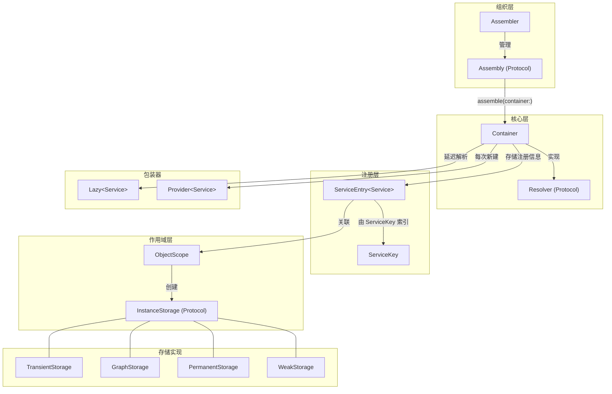
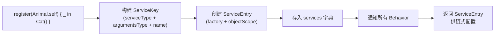
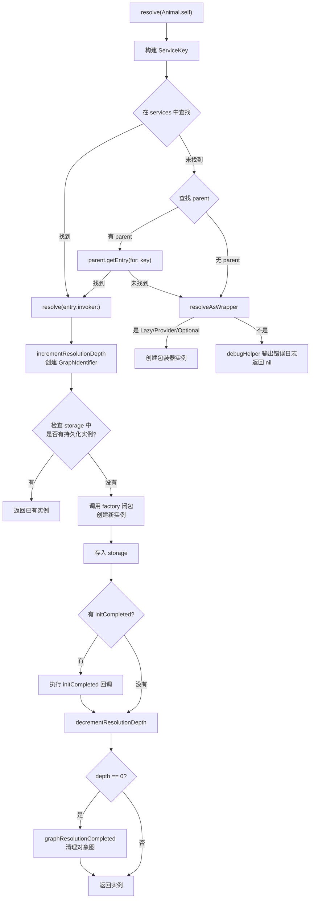
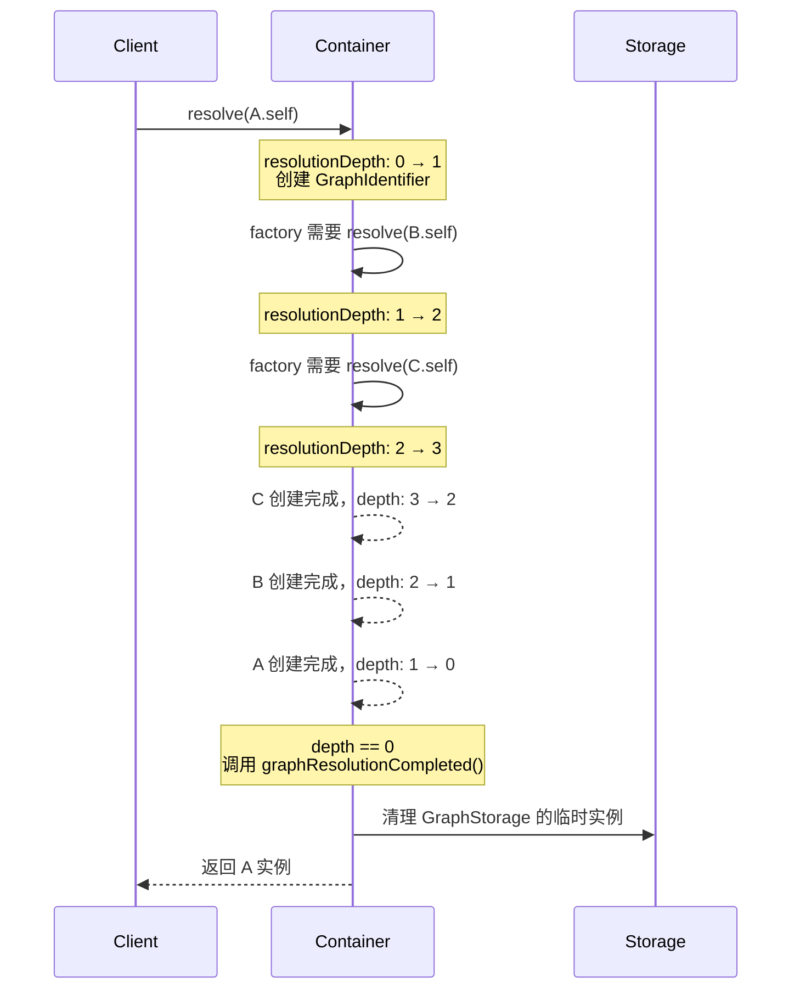
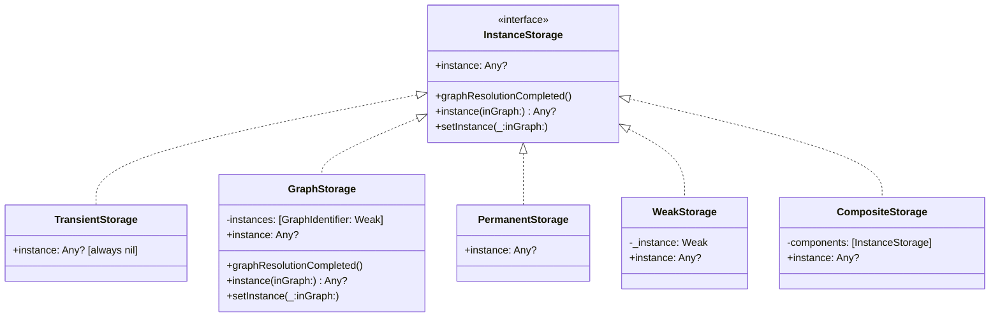
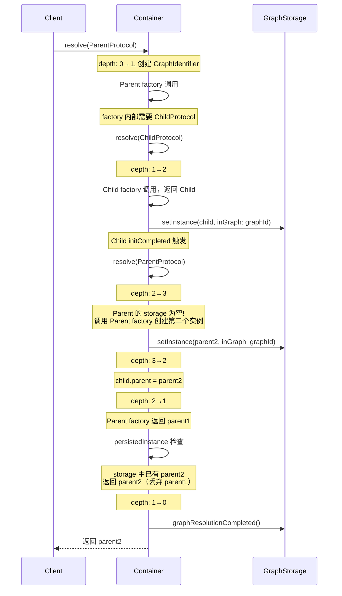

+++
title = "Swinject源码导读"
date = '2026-05-02T22:32:27+08:00'
draft = false
weight = 8
tags = ["iOS", "源码分析"]
categories = ["iOS开发", "源码分析"]
+++
Swinject 是一款轻量级的 Swift 依赖注入（Dependency Injection）框架，灵感来自 .NET 的 Ninject。它通过**类型安全的方式**管理对象之间的依赖关系，将对象的创建和使用解耦。本文基于 **v2.8.3** 源码进行分析。

---

## 一、整体架构

Swinject 的核心设计围绕**注册-解析（Register-Resolve）**模式展开，整个框架仅约 20 个源码文件，代码极为精简。



**源码文件结构：**

```
Sources/
├── Container.swift                 # 核心容器：注册、解析、对象图管理
├── Container.Arguments.swift       # 带参数的注册/解析（ERB 自动生成，支持 1~9 个参数）
├── Container.TypeForwarding.swift  # 类型转发：forward(_:to:)
├── Container.Logging.swift         # 日志功能
├── Resolver.swift                  # Resolver 协议定义（ERB 自动生成）
├── _Resolver.swift                 # 内部 _Resolver 协议，供扩展使用
├── ServiceEntry.swift              # 服务注册条目
├── ServiceEntry.TypeForwarding.swift # implements() 类型转发扩展
├── ServiceKey.swift                # 服务查找键（ServiceType + ArgumentsType + Name + Option）
├── ObjectScope.swift               # 对象作用域协议与基类
├── ObjectScope.Standard.swift      # 四种标准作用域定义
├── InstanceStorage.swift           # 实例存储协议与五种实现
├── GraphIdentifier.swift           # 对象图唯一标识
├── InstanceWrapper.swift           # Lazy / Provider / Optional 包装器
├── Assembler.swift                 # 模块化组装器
├── Assembly.swift                  # Assembly 协议
├── Behavior.swift                  # 行为扩展协议
├── RecursiveLock.swift             # 递归锁封装
├── DebugHelper.swift               # 调试辅助（解析失败日志）
├── FunctionType.swift              # 工厂闭包类型别名
└── UnavailableItems.swift          # v1 -> v2 迁移标记
```

---

## 二、核心概念 — 注册与解析

Swinject 的核心工作流程可以用两行代码概括：

```swift
// 注册：告诉容器"当需要 Animal 时，创建一个 Cat"
container.register(Animal.self) { _ in Cat() }

// 解析：从容器中获取 Animal 的实例
let animal = container.resolve(Animal.self)!
```

这背后涉及三个核心类型的协作：`Container`、`ServiceKey`、`ServiceEntry`。

---

## 三、ServiceKey — 服务查找键

`ServiceKey` 是注册表的"索引键"，决定了一个注册条目如何被唯一标识和检索。

```swift
internal struct ServiceKey {
    internal let serviceType: Any.Type
    internal let argumentsType: Any.Type
    internal let name: String?
    internal let option: ServiceKeyOption?
}
```

**四个维度共同确定唯一性：**

| 维度 | 说明 |
|------|------|
| `serviceType` | 要解析的服务类型（如 `Animal.self`） |
| `argumentsType` | 工厂闭包的参数类型（如 `(Resolver)` 或 `(Resolver, String)`） |
| `name` | 可选的注册名称，用于同一类型的多个注册 |
| `option` | 扩展点，供 SwinjectStoryboard 等插件使用 |

**Hashable 实现：**

```swift
extension ServiceKey: Hashable {
    public func hash(into hasher: inout Hasher) {
        ObjectIdentifier(serviceType).hash(into: &hasher)
        ObjectIdentifier(argumentsType).hash(into: &hasher)
        name?.hash(into: &hasher)
        option?.hash(into: &hasher)
    }
}
```

`serviceType` 和 `argumentsType` 都是 `Any.Type` 元类型，无法直接 Hash，Swinject 使用 `ObjectIdentifier` 将元类型转为可 Hash 的值。`ObjectIdentifier` 实际上是类型在运行时 metadata 的指针地址，对于同一个类型始终唯一。

**设计意义：** 这意味着以下两个注册会被视为不同的条目：

```swift
container.register(Animal.self) { _ in Cat() }                     // argumentsType = (Resolver)
container.register(Animal.self) { (_, name: String) in Cat(name) }  // argumentsType = (Resolver, String)
```

即使 `serviceType` 相同，`argumentsType` 不同就是不同的注册。

---

## 四、ServiceEntry — 服务注册条目

`ServiceEntry<Service>` 存储了一个服务注册的所有信息，是 `Container` 注册表中的"值"。

```swift
public final class ServiceEntry<Service>: ServiceEntryProtocol {
    internal let serviceType: Any.Type
    internal let argumentsType: Any.Type
    internal let factory: FunctionType    // 实际是 Any，存储工厂闭包
    internal weak var container: Container?

    internal var objectScope: ObjectScopeProtocol = ObjectScope.graph
    internal lazy var storage: InstanceStorage = { [unowned self] in
        self.objectScope.makeStorage()
    }()

    fileprivate var initCompletedActions: [(Resolver, Service) -> Void] = []
}
```

**关键属性：**

| 属性 | 说明 |
|------|------|
| `factory` | 工厂闭包，类型擦除为 `FunctionType`（即 `Any`） |
| `objectScope` | 对象作用域，决定实例的生命周期 |
| `storage` | 由 `objectScope` 创建的实例存储，延迟初始化 |
| `initCompletedActions` | 初始化完成后的回调数组，用于属性注入和循环依赖 |

### 4.1 链式配置 API

`ServiceEntry` 采用链式调用风格，所有配置方法返回 `self`：

```swift
container.register(Animal.self) { _ in Cat() }
    .inObjectScope(.container)          // 设置作用域
    .initCompleted { resolver, cat in   // 初始化完成回调
        cat.friend = resolver.resolve(Animal.self)
    }
    .implements(Cat.self)               // 类型转发
```

### 4.2 initCompleted 机制

`initCompleted` 的核心作用是**解决循环依赖**。在 `resolve` 过程中，对象已创建但尚未完成所有属性注入时，如果遇到循环引用，可以通过 `initCompleted` 延迟注入：

```swift
internal var initCompleted: FunctionType? {
    guard !initCompletedActions.isEmpty else { return nil }

    return { [weak self] (resolver: Resolver, service: Any) -> Void in
        guard let strongSelf = self else { return }
        strongSelf.initCompletedActions.forEach { $0(resolver, service as! Service) }
    }
}
```

多次调用 `initCompleted` 会追加到 `initCompletedActions` 数组中，所有回调都会按注册顺序依次执行。返回的闭包将泛型 `Service` 擦除为 `Any`，以便存储在协议类型中。

### 4.3 FunctionType 类型擦除

```swift
internal typealias FunctionType = Any
```

`FunctionType` 只是 `Any` 的别名。工厂闭包的实际类型可能是 `(Resolver) -> Service`、`(Resolver, String) -> Service` 等，Swinject 将它们统一擦除为 `Any`，在解析时再通过 `as!` 强转回具体类型。这是一种"信任编译器"的设计——注册和解析时的泛型参数保证了类型安全，运行时的强转不会失败。

---

## 五、Container — 依赖注入容器

`Container` 是 Swinject 的核心，承担注册表管理、服务解析、对象图追踪、父子层级四大职责。

### 5.1 类定义

```swift
public final class Container {
    internal var services = [ServiceKey: ServiceEntryProtocol]()
    private let parent: Container?
    private var resolutionDepth = 0
    private let debugHelper: DebugHelper
    private let defaultObjectScope: ObjectScope
    private let synchronized: Bool
    internal var currentObjectGraph: GraphIdentifier?
    internal let lock: RecursiveLock
    internal var behaviors = [Behavior]()
}
```

| 属性 | 说明 |
|------|------|
| `services` | 注册表，ServiceKey -> ServiceEntry 的字典 |
| `parent` | 父容器，支持层级结构 |
| `resolutionDepth` | 当前解析深度，用于检测循环依赖 |
| `defaultObjectScope` | 默认作用域，未指定时使用（默认 `.graph`） |
| `synchronized` | 是否为同步容器（由 `synchronize()` 创建） |
| `currentObjectGraph` | 当前正在解析的对象图标识 |
| `lock` | 递归锁，父子容器共享同一把锁 |

### 5.2 注册流程

```swift
@discardableResult
public func register<Service>(
    _ serviceType: Service.Type,
    name: String? = nil,
    factory: @escaping (Resolver) -> Service
) -> ServiceEntry<Service> {
    return _register(serviceType, factory: factory, name: name)
}
```

所有 `register` 方法最终汇聚到内部的 `_register` 方法：

```swift
public func _register<Service, Arguments>(
    _ serviceType: Service.Type,
    factory: @escaping (Arguments) -> Any,
    name: String? = nil,
    option: ServiceKeyOption? = nil
) -> ServiceEntry<Service> {
    let key = ServiceKey(serviceType: Service.self, argumentsType: Arguments.self, name: name, option: option)
    let entry = ServiceEntry(
        serviceType: serviceType,
        argumentsType: Arguments.self,
        factory: factory,
        objectScope: defaultObjectScope
    )
    entry.container = self
    services[key] = entry

    behaviors.forEach { $0.container(self, didRegisterType: serviceType, toService: entry, withName: name) }

    return entry
}
```

注册流程：



### 5.3 解析流程

`resolve` 是整个框架最核心的方法。完整解析流程如下：



关键源码分析：

```swift
fileprivate func resolve<Service, Factory>(
    entry: ServiceEntryProtocol,
    invoker: @escaping (Factory) -> Any
) -> Service? {
    let resolution: () -> Service? = { [self] in
        self.incrementResolutionDepth()
        defer { self.decrementResolutionDepth() }

        guard let currentObjectGraph = self.currentObjectGraph else {
            fatalError("If accessing container from multiple threads, make sure to use a synchronized resolver.")
        }

        // 1. 先检查是否已有持久化实例（处理循环依赖和 container scope）
        if let persistedInstance = self.persistedInstance(Service.self, from: entry, in: currentObjectGraph) {
            return persistedInstance
        }

        // 2. 调用工厂闭包创建新实例
        let resolvedInstance = invoker(entry.factory as! Factory)

        // 3. 再次检查（factory 内部可能触发了同一 entry 的解析）
        if let persistedInstance = self.persistedInstance(Service.self, from: entry, in: currentObjectGraph) {
            return persistedInstance
        }

        // 4. 存入 storage
        entry.storage.setInstance(resolvedInstance as Any, inGraph: currentObjectGraph)

        // 5. 执行 initCompleted 回调
        if let completed = entry.initCompleted as? (Resolver, Any) -> Void,
            let resolvedInstance = resolvedInstance as? Service {
            completed(self, resolvedInstance)
        }

        return resolvedInstance as? Service
    }

    if synchronized {
        return lock.sync { return resolution() }
    } else {
        return resolution()
    }
}
```

**双重 persistedInstance 检查的意义：**

第一次检查（步骤 1）处理的是正常情况：如果 storage 中已有实例（如 `container` scope 的单例），直接返回。

第二次检查（步骤 3）处理的是一种边缘情况：`factory` 闭包内部可能通过 `resolver.resolve()` 触发了对同一 `ServiceEntry` 的递归解析（循环依赖场景），此时 `GraphStorage` 已经在更深的递归层中存储了实例。如果不做第二次检查，就会创建重复实例。

### 5.4 对象图追踪



`resolutionDepth` 和 `GraphIdentifier` 构成了对象图追踪机制：

- 首次 `resolve` 调用（`resolutionDepth == 0`）时创建 `GraphIdentifier`
- 每次进入 `resolve` 递增 depth，退出时递减
- 当 depth 回到 0，表示整个对象图解析完成，调用 `graphResolutionCompleted()` 清理临时数据
- 如果 depth 达到 200，触发 `fatalError`，提示循环依赖

`GraphIdentifier` 本质是一个 UUID 包装：

```swift
public struct GraphIdentifier: Identifiable {
    public let id = UUID()
}
```

它的作用是让 `GraphStorage` 能区分不同的解析过程。同一次 `resolve` 调用链中的所有子解析共享同一个 `GraphIdentifier`，而不同的顶层 `resolve` 调用拥有不同的标识。

### 5.5 父子容器层级

Container 支持父子层级结构，子容器可以继承父容器的注册：

```swift
let parent = Container()
parent.register(Animal.self) { _ in Cat() }

let child = Container(parent: parent)
child.resolve(Animal.self) // 在子容器中找不到，会向上查找父容器
```

查找逻辑在 `getEntry` 方法中：

```swift
fileprivate func getEntry(for key: ServiceKey) -> ServiceEntryProtocol? {
    if let entry = services[key] {
        return entry
    } else {
        return parent?.getEntry(for: key)
    }
}
```

**父子容器共享同一把递归锁：**

```swift
internal init(parent: Container? = nil, ...) {
    lock = parent.map { $0.lock } ?? RecursiveLock()
}
```

子容器不创建新锁，而是复用父容器的锁。这保证了在同步模式下，整个容器层级的解析操作是串行的，避免了跨层级的竞态条件。

### 5.6 线程安全 — synchronize()

Container 本身不是线程安全的，需要通过 `synchronize()` 获取线程安全的 Resolver：

```swift
public func synchronize() -> Resolver {
    return Container(parent: self,
                     debugHelper: debugHelper,
                     defaultObjectScope: defaultObjectScope,
                     synchronized: true)
}
```

`synchronize()` 创建一个新的子容器，设置 `synchronized = true`。当 `synchronized` 为 true 时，`resolve` 方法会在递归锁保护下执行：

```swift
if synchronized {
    return lock.sync { return resolution() }
} else {
    return resolution()
}
```

**设计考量：**

- 返回类型是 `Resolver` 而不是 `Container`，因为同步容器不应该再注册新服务
- 作为子容器，它可以访问原容器的所有注册
- 使用 `RecursiveLock`（基于 `NSRecursiveLock`）而非普通锁，因为 `resolve` 过程中 factory 可能触发嵌套的 `resolve` 调用

---

## 六、ObjectScope — 对象作用域

`ObjectScope` 控制已解析实例的生命周期。它是 Swinject 中最精妙的设计之一。

### 6.1 协议与基类

```swift
public protocol ObjectScopeProtocol: AnyObject {
    func makeStorage() -> InstanceStorage
}

public class ObjectScope: ObjectScopeProtocol, CustomStringConvertible {
    private var storageFactory: () -> InstanceStorage
    private let parent: ObjectScopeProtocol?

    public func makeStorage() -> InstanceStorage {
        if let parent = parent {
            return CompositeStorage([storageFactory(), parent.makeStorage()])
        } else {
            return storageFactory()
        }
    }
}
```

`ObjectScope` 的核心职责只有一个：通过 `makeStorage()` 创建 `InstanceStorage`。`parent` 参数支持组合多种存储策略。

### 6.2 四种标准作用域

```swift
extension ObjectScope {
    public static let transient  = ObjectScope(storageFactory: TransientStorage.init, description: "transient")
    public static let graph      = ObjectScope(storageFactory: GraphStorage.init, description: "graph")
    public static let container  = ObjectScope(storageFactory: PermanentStorage.init, description: "container")
    public static let weak       = ObjectScope(storageFactory: WeakStorage.init, description: "weak",
                                               parent: ObjectScope.graph)
}
```

各作用域的行为对比：

| 作用域 | 存储类型 | 行为 | 适用场景 |
|--------|---------|------|---------|
| `.transient` | `TransientStorage` | 每次 resolve 都创建新实例 | 无状态服务、值对象 |
| `.graph` | `GraphStorage` | 同一对象图内共享，图解析完成后释放 | 默认作用域，处理循环依赖 |
| `.container` | `PermanentStorage` | 容器生命周期内单例 | 全局服务、Manager |
| `.weak` | `CompositeStorage(WeakStorage + GraphStorage)` | 有强引用时共享，无引用后重新创建 | ViewModel 等中间对象 |

### 6.3 InstanceStorage 实现



**TransientStorage** — 永不持久化：

```swift
public final class TransientStorage: InstanceStorage {
    public var instance: Any? {
        get { return nil }
        set {}
    }
}
```

getter 始终返回 nil，setter 什么也不做。这意味着每次 `resolve` 都会调用 factory 创建新实例。

**GraphStorage** — 对象图级共享：

```swift
public final class GraphStorage: InstanceStorage {
    private var instances = [GraphIdentifier: Weak<Any>]()
    public var instance: Any?

    public func graphResolutionCompleted() {
        instance = nil
    }

    public func instance(inGraph graph: GraphIdentifier) -> Any? {
        return instances[graph]?.value
    }

    public func setInstance(_ instance: Any?, inGraph graph: GraphIdentifier) {
        self.instance = instance
        if instances[graph] == nil { instances[graph] = Weak() }
        instances[graph]?.value = instance
    }
}
```

`GraphStorage` 维护了一个以 `GraphIdentifier` 为 key 的弱引用字典。在同一次解析过程中（同一个 `GraphIdentifier`），相同的服务只会创建一次。当 `graphResolutionCompleted()` 被调用时，清除 `instance` 属性，但字典中的弱引用仍然存在——只要外部还持有强引用，通过相同的 `GraphIdentifier` 仍可取回。

这对处理循环依赖至关重要：A 依赖 B，B 依赖 A，在同一个对象图中，A 只会被创建一次。

**WeakStorage** — 弱引用持久化：

```swift
public final class WeakStorage: InstanceStorage {
    private var _instance = Weak<Any>()

    public var instance: Any? {
        get { return _instance.value }
        set { _instance.value = newValue }
    }
}
```

`Weak<Any>` 内部使用 `weak var object: AnyObject?` 实现弱引用。对于引用类型，只要外部有强引用就会返回同一实例；一旦所有强引用释放，下次 resolve 会创建新实例。对于值类型，由于值类型无法被 `weak` 引用，效果等同于 `TransientStorage`。

**CompositeStorage** — 组合存储：

```swift
public final class CompositeStorage: InstanceStorage {
    private let components: [InstanceStorage]

    public var instance: Any? {
        get { return components.compactMap { $0.instance }.first }
        set { components.forEach { $0.instance = newValue } }
    }
}
```

`CompositeStorage` 组合多个 storage，读取时返回第一个非 nil 的值，写入时广播到所有 storage。`.weak` 作用域使用 `CompositeStorage([WeakStorage, GraphStorage])`，兼具弱引用持久化和对象图内共享两种能力。

---

## 七、类型转发（Type Forwarding）

类型转发允许一个具体类型通过多个协议/类型来解析，共享同一个 `ServiceEntry`：

```swift
container.register(Dog.self) { _ in Dog() }
    .implements(Animal.self)
    .implements(Pet.self)

let dog = container.resolve(Dog.self)!
let animal = container.resolve(Animal.self)!
let pet = container.resolve(Pet.self)!
```

### 7.1 实现原理

**Container 端：** `forward` 方法将同一个 `ServiceEntry` 注册到不同的 `ServiceKey` 下：

```swift
public func forward<T, S>(_ type: T.Type, name: String? = nil, to service: ServiceEntry<S>) {
    let key = ServiceKey(
        serviceType: T.self,
        argumentsType: service.argumentsType,
        name: name,
        option: nil
    )
    services[key] = service
    behaviors.forEach { $0.container(self, didRegisterType: type, toService: service, withName: name) }
}
```

**ServiceEntry 端：** `implements` 方法是 `forward` 的语法糖：

```swift
public func implements<T>(_ type: T.Type, name: String? = nil) -> ServiceEntry<Service> {
    container?.forward(type, name: name, to: self)
    return self
}
```

**效果：** 多个 `ServiceKey` 指向同一个 `ServiceEntry`。当使用 `.container` 或 `.graph` 作用域时，通过不同类型解析出的是**同一个实例**（因为它们共享同一个 `InstanceStorage`）。

---

## 八、InstanceWrapper — 延迟解析

Swinject 提供了 `Lazy<Service>` 和 `Provider<Service>` 两种包装器，无需显式注册即可使用。

### 8.1 Lazy — 惰性单次解析

```swift
public final class Lazy<Service>: InstanceWrapper {
    private let factory: (GraphIdentifier?) -> Any?
    private let graphIdentifier: GraphIdentifier?
    private var _instance: Service?

    public var instance: Service {
        if let instance = _instance {
            return instance
        } else {
            _instance = makeInstance()
            return _instance!
        }
    }
}
```

`Lazy<Service>` 延迟到首次访问 `.instance` 时才触发解析，之后缓存结果。它还会记住创建时的 `GraphIdentifier`，在解析时恢复对象图上下文。

### 8.2 Provider — 每次新建

```swift
public final class Provider<Service>: InstanceWrapper {
    private let factory: (GraphIdentifier?) -> Any?

    public var instance: Service {
        return factory(.none) as! Service
    }
}
```

`Provider<Service>` 每次访问 `.instance` 都会触发一次新的解析，不做缓存。

### 8.3 Optional — 安全解析

```swift
extension Optional: InstanceWrapper {
    static var wrappedType: Any.Type { return Wrapped.self }

    init?(inContainer _: Container, withInstanceFactory factory: ((GraphIdentifier?) -> Any?)?) {
        self = factory?(.none) as? Wrapped
    }
}
```

`Optional` 也实现了 `InstanceWrapper`。当解析 `Optional<Service>` 时，如果找不到注册会返回 `nil` 而不是 crash。

### 8.4 解析包装器的机制

当普通解析失败时，Container 会尝试将目标类型作为 `InstanceWrapper` 处理：

```swift
public func _resolve<Service, Arguments>(...) -> Service? {
    var resolvedInstance: Service?
    let key = ServiceKey(serviceType: Service.self, ...)

    if let entry = getEntry(for: key) {
        resolvedInstance = resolve(entry: entry, invoker: invoker)
    }

    // 普通解析失败，尝试作为包装器解析
    if resolvedInstance == nil {
        resolvedInstance = resolveAsWrapper(name: name, option: option, invoker: invoker)
    }

    return resolvedInstance
}
```

`resolveAsWrapper` 检查目标类型是否遵循 `InstanceWrapper` 协议，如果是，则用 `wrappedType` 查找注册并创建包装器实例。

---

## 九、Assembly 与 Assembler — 模块化组装

### 9.1 Assembly 协议

```swift
public protocol Assembly {
    func assemble(container: Container)
    func loaded(resolver: Resolver)
}
```

`Assembly` 将相关的服务注册组织为一个模块。`assemble` 负责注册，`loaded` 在所有 Assembly 加载完成后调用。

### 9.2 Assembler 组装器

```swift
public final class Assembler {
    private let container: Container

    public var resolver: Resolver {
        return container
    }

    private func run(assemblies: [Assembly]) {
        // 第一遍：所有 Assembly 注册服务
        for assembly in assemblies {
            assembly.assemble(container: container)
        }
        // 第二遍：通知所有 Assembly 加载完成
        for assembly in assemblies {
            assembly.loaded(resolver: resolver)
        }
    }
}
```

**两遍遍历的设计：** 第一遍让所有 Assembly 完成注册，确保容器中所有服务都已就绪；第二遍通知加载完成，此时 Assembly 可以安全地 resolve 其他 Assembly 注册的服务。

`Assembler` 只暴露 `resolver` 属性（`Resolver` 协议类型），不暴露 `container`，确保了 Assembly 注册完成后，外部只能解析而不能再注册新服务。

### 9.3 使用示例

```swift
class NetworkAssembly: Assembly {
    func assemble(container: Container) {
        container.register(HTTPClient.self) { _ in URLSessionClient() }
            .inObjectScope(.container)
        container.register(APIService.self) { r in
            APIServiceImpl(client: r.resolve(HTTPClient.self)!)
        }
    }
}

class DatabaseAssembly: Assembly {
    func assemble(container: Container) {
        container.register(Database.self) { _ in SQLiteDatabase() }
            .inObjectScope(.container)
    }
}

let assembler = Assembler([NetworkAssembly(), DatabaseAssembly()])
let apiService = assembler.resolver.resolve(APIService.self)!
```

### 9.4 Assembler 的层级支持

```swift
public init(
    _ assemblies: [Assembly],
    parent: Assembler?,
    defaultObjectScope: ObjectScope = .graph,
    behaviors: [Behavior] = []
) {
    container = Container(parent: parent?.container, defaultObjectScope: defaultObjectScope, behaviors: behaviors)
    run(assemblies: assemblies)
}
```

通过 `parent` 参数，Assembler 也支持层级结构。子 Assembler 的容器以父 Assembler 的容器为 parent，可以访问父级的所有注册。

---

## 十、Behavior — 行为扩展

`Behavior` 协议提供了一种 AOP（面向切面）风格的扩展机制：

```swift
public protocol Behavior {
    func container<Type, Service>(
        _ container: Container,
        didRegisterType type: Type.Type,
        toService entry: ServiceEntry<Service>,
        withName name: String?
    )
}
```

每当有新的服务注册（包括类型转发），所有已添加的 Behavior 都会收到通知。

**典型应用场景：**

```swift
class LoggingBehavior: Behavior {
    func container<Type, Service>(
        _ container: Container,
        didRegisterType type: Type.Type,
        toService entry: ServiceEntry<Service>,
        withName name: String?
    ) {
        print("Registered: \(type) -> \(Service.self), name: \(name ?? "nil")")
    }
}

let container = Container(behaviors: [LoggingBehavior()])
```

Behavior 可以用于日志记录、自动添加 `initCompleted`、验证注册完整性等。

---

## 十一、参数传递的实现技巧

Swinject 支持向 factory 传递最多 9 个参数。由于 Swift 不支持可变泛型参数（Variadic Generics），它通过**代码生成**（ERB 模板）实现了多参数支持。

### 11.1 注册端

```swift
// 1 参数
public func register<Service, Arg1>(
    _ serviceType: Service.Type,
    name: String? = nil,
    factory: @escaping (Resolver, Arg1) -> Service
) -> ServiceEntry<Service> {
    return _register(serviceType, factory: factory, name: name)
}

// 2 参数
public func register<Service, Arg1, Arg2>(
    _ serviceType: Service.Type,
    name: String? = nil,
    factory: @escaping (Resolver, Arg1, Arg2) -> Service
) -> ServiceEntry<Service> {
    return _register(serviceType, factory: factory, name: name)
}
```

### 11.2 解析端 — 元组技巧

```swift
public func resolve<Service, Arg1>(
    _: Service.Type,
    name: String?,
    argument: Arg1
) -> Service? {
    typealias FactoryType = ((Resolver, Arg1)) -> Any
    return _resolve(name: name) { (factory: FactoryType) in factory((self, argument)) }
}
```

这里有一个精妙的设计：`(Resolver, Arg1) -> Service` 多参数闭包在 Swift 中可以被当作 `((Resolver, Arg1)) -> Service` 单参数元组闭包来调用（SE-0110 在实践中的体现）。Swinject 利用这一点，将多参数统一打包为元组传递给 `invoker` 闭包，最终在 `_resolve` 中通过 `entry.factory as! Factory` 强转回正确的闭包类型并调用。

### 11.3 代码生成

`Resolver.swift`、`Container.Arguments.swift`、`ServiceEntry.TypeForwarding.swift` 三个文件都是由 ERB 模板自动生成的：

```
// NOTICE:
// Container.Arguments.swift is generated from Container.Arguments.erb by ERB.
// Do NOT modify Container.Arguments.swift directly.
```

ERB 模板为 1~9 个参数分别生成对应的 `register` 和 `resolve` 方法重载，避免了大量手写重复代码。

---

## 十二、调试辅助

当解析失败时，`DebugHelper` 提供详细的错误日志：

```swift
internal final class LoggingDebugHelper: DebugHelper {
    func resolutionFailed<Service>(
        serviceType: Service.Type,
        key: ServiceKey,
        availableRegistrations: [ServiceKey: ServiceEntryProtocol]
    ) {
        var output = [
            "Swinject: Resolution failed. Expected registration:",
            "\t{ \(description(serviceType: serviceType, serviceKey: key)) }",
            "Available registrations:",
        ]
        output += availableRegistrations
            .filter { $0.1 is ServiceEntry<Service> }
            .map { "\t{ " + $0.1.describeWithKey($0.0) + " }" }

        Container.log(output.joined(separator: "\n"))
    }
}
```

输出格式类似：

```
Swinject: Resolution failed. Expected registration:
    { Service: Animal, Factory: (Resolver) -> Animal }
Available registrations:
    { Service: Animal, Factory: (Resolver, String) -> Animal, ObjectScope: graph }
```

日志不仅显示了期望的注册信息，还列出了所有**同类型**的可用注册，方便快速定位问题（通常是参数类型或名称不匹配）。

日志功能可以通过 `Container.loggingFunction` 自定义或关闭：

```swift
Container.loggingFunction = nil           // 关闭日志
Container.loggingFunction = { os_log($0) } // 自定义输出
```

---

## 十三、循环依赖处理

循环依赖是 DI 容器面临的经典问题。Swinject 通过 `initCompleted` + `GraphStorage` 来解决。

### 13.1 问题场景

```swift
class Parent {
    var child: Child?
}

class Child {
    var parent: Parent?
}
```

如果在 factory 中直接注入双向依赖，会导致无限递归：

```swift
container.register(Parent.self) { r in
    let parent = Parent()
    parent.child = r.resolve(Child.self) // 这会再次 resolve Parent → 无限循环
    return parent
}
```

### 13.2 解决方案

将**回指方向**的依赖注入放到 `initCompleted` 中。有两种典型模式：

**模式一：初始化器/属性注入**

```swift
container.register(ParentProtocol.self) { r in
    Parent(child: r.resolve(ChildProtocol.self)!)  // 构造器注入
}
container.register(ChildProtocol.self) { _ in Child() }
    .initCompleted { r, c in
        let child = c as! Child
        child.parent = r.resolve(ParentProtocol.self)  // 属性注入（延迟到 initCompleted）
    }
```

**模式二：属性/属性注入（推荐，避免 factory 被调用两次）**

```swift
container.register(ParentProtocol.self) { _ in Parent() }
    .initCompleted { r, p in
        let parent = p as! Parent
        parent.child = r.resolve(ChildProtocol.self)
    }
container.register(ChildProtocol.self) { _ in Child() }
    .initCompleted { r, c in
        let child = c as! Child
        child.parent = r.resolve(ParentProtocol.self)
    }
```

**模式一的执行流程：**



这里有一个关键细节：在模式一中，Parent 的 factory 可能被**调用两次**。官方文档中也明确提到了这一点：

> When resolving circular dependencies one of the factory methods (one containing resolution of circular dependency) might be invoked twice. Only one of the resulting instances will be used in the final object graph.

这就是 `resolve` 方法中**双重 `persistedInstance` 检查**的价值所在。第一次 factory 返回后，发现 storage 中已经有了更深层递归创建的实例，于是丢弃自己创建的实例，返回 storage 中的版本。这保证了最终对象图中只有一个 Parent 实例。

**如果 factory 有副作用（如网络请求、数据库操作），应使用模式二**，将所有依赖注入都放到 `initCompleted` 中，避免 factory 被重复调用。

**不支持的情况：初始化器/初始化器循环依赖** — 如果两边都通过构造器注入对方，会导致无限递归，Swinject 在 `resolutionDepth` 达到 200 时触发 `fatalError`。

深度保护确保即使循环依赖配置错误，也不会真的无限递归：

```swift
guard resolutionDepth < maxResolutionDepth else {
    fatalError("Infinite recursive call for circular dependency has been detected. " +
        "To avoid the infinite call, 'initCompleted' handler should be used to inject circular dependency.")
}
```

---

## 十四、设计模式运用

| 设计模式 | 应用场景 |
|---------|---------|
| **工厂模式** | `register` 注册的 factory 闭包，延迟创建实例 |
| **策略模式** | `InstanceStorage` 的多种实现，通过 `ObjectScope` 选择 |
| **组合模式** | `CompositeStorage` 组合多个 storage 策略 |
| **建造者模式** | `ServiceEntry` 的链式配置 API（`inObjectScope().initCompleted().implements()`） |
| **代理模式** | `Assembler.resolver` 隐藏 Container，只暴露 Resolver 接口 |
| **观察者模式** | `Behavior` 协议，监听注册事件 |
| **模板方法模式** | `Assembly` 协议定义 `assemble` / `loaded` 两步流程 |
| **装饰器模式** | `Lazy<T>` / `Provider<T>` 包装解析行为，添加延迟/重复创建能力 |

---

## 十五、设计亮点

1. **极简的核心概念**：整个框架只有 Container、ServiceEntry、ServiceKey、ObjectScope 四个核心概念，代码量不到 1000 行有效代码
2. **类型安全**：通过 Swift 泛型在编译期保证注册和解析的类型匹配，运行时的类型擦除（`FunctionType = Any`）是安全的
3. **可扩展性**：`ServiceKeyOption`、`Behavior`、`_Resolver` 等扩展点使得 SwinjectStoryboard、SwinjectAutoregistration 等插件能无缝集成
4. **对象图感知**：`GraphStorage` + `GraphIdentifier` 机制优雅地解决了循环依赖问题
5. **渐进式线程安全**：默认不加锁（性能优先），通过 `synchronize()` 按需开启线程安全
6. **代码生成减少重复**：使用 ERB 模板自动生成多参数重载，避免手写 9 x 2 = 18 个 register/resolve 方法
