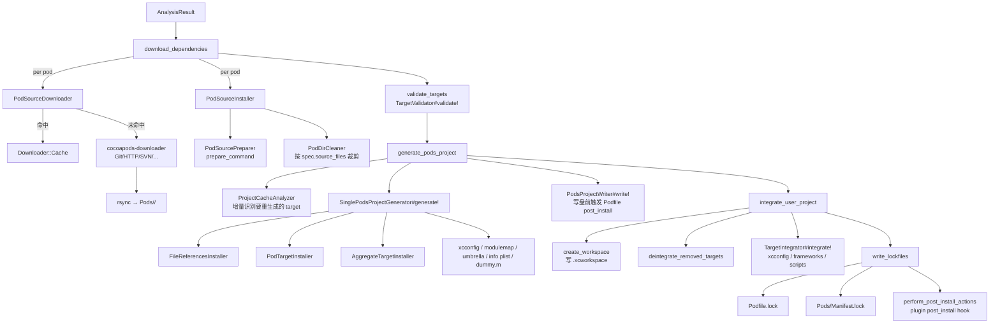

+++
title = "CocoaPods 源码导读：从下载到工程集成"
date = '2026-05-02T22:32:27+08:00'
draft = false
weight = 11
tags = ["iOS", "源码分析", "CocoaPods"]
categories = ["iOS开发", "源码分析"]
+++
> 本文是系列第三篇，基于 CocoaPods 1.16.2 源码。上一篇我们停在 `Analyzer` 产出 `AnalysisResult`，本文继续走完 `download_dependencies` → `validate_targets` → `generate_pods_project` → `integrate_user_project` → `write_lockfiles` 这五个阶段。
>
> 上一篇：[从命令到依赖求解]() · 首篇：[架构总览]()

---

## 一、全景：从 spec 到可编译的工程

先把本文要走的流程重新放一遍，让你带着地图读代码：



对应的 `Installer#install!` 片段：

```ruby
# CocoaPods/lib/cocoapods/installer.rb : 160
def install!
  prepare
  resolve_dependencies
  download_dependencies       # §2
  validate_targets            # §3
  clean_sandbox
  if installation_options.skip_pods_project_generation?
    show_skip_pods_project_generation_message
    run_podfile_post_install_hooks
  else
    integrate                 # §4 + §5
  end
  write_lockfiles             # §6
  perform_post_install_actions
end
```

---

## 二、`download_dependencies`：下载与缓存

### 2.1 顶层：可并发的三步走

```ruby
# installer.rb : 185
def download_dependencies
  UI.section 'Downloading dependencies' do
    install_pod_sources
    run_podfile_pre_install_hooks
    clean_pod_sources
  end
end
```

真正干活的是 `install_pod_sources`：

```ruby
# installer.rb : 505
def install_pod_sources
  @downloaded_specs = []
  @installed_specs = []
  pods_to_install = sandbox_state.added | sandbox_state.changed
  sorted_root_specs = root_specs.sort_by(&:name)

  if installation_options.parallel_pod_downloads
    require 'concurrent/executor/fixed_thread_pool'
    thread_pool_size = installation_options.parallel_pod_download_thread_pool_size
    thread_pool = Concurrent::FixedThreadPool.new(thread_pool_size, :idletime => 300)

    sorted_root_specs.each do |spec|
      next unless pods_to_install.include?(spec.name)
      title = section_title(spec, 'Downloading')
      UI.titled_section(title.green, title_options) do
        thread_pool.post { download_source_of_pod(spec.name) }
      end
    end
    thread_pool.shutdown
    thread_pool.wait_for_termination
  end

  sorted_root_specs.each do |spec|
    if pods_to_install.include?(spec.name)
      UI.titled_section(section_title(spec, 'Installing').green, title_options) do
        install_source_of_pod(spec.name)        # 复用已下载内容 / 本地拷贝
      end
    else
      UI.section("Using #{spec}", '-> '.green) { create_pod_installer(spec.name) }
    end
  end
end
```

几个要点：

1. **`pods_to_install = added | changed`**：`unchanged` 的 pod 直接 `Using ...`，不会触发下载/拷贝。
2. **`parallel_pod_downloads` 默认开**（1.11+）：先在线程池里并发 `download_source_of_pod`，然后回主线程顺序跑 `install_source_of_pod`（这步含写 sandbox 状态，不是线程安全的）。
3. **`root_specs.sort_by(&:name)`**：主线程步骤严格按字母序，保证多次 `pod install` 产出的 `Pods.xcodeproj` 稳定。
4. **`UI.titled_section`**：对 CI 日志友好——你看到的 `Downloading AFNetworking 4.0.2`/`Installing AFNetworking 4.0.2` 两条输出就是来自这里。

### 2.2 `PodSourceInstaller#install!`：三种来源的分叉

```ruby
# CocoaPods/lib/cocoapods/installer/pod_source_installer.rb : 66
def install!
  download_source unless predownloaded? || local?
  PodSourcePreparer.new(root_spec, root).prepare! if local?
  sandbox.remove_local_podspec(name) unless predownloaded? || local? || external?
end
```

对应三类 pod：

| 类型 | 判断 | 处理 |
| --- | --- | --- |
| **本地 pod**（`:path`） | `sandbox.local?(name)` | 不下载；直接对源目录跑 `prepare!`（跑 `prepare_command`，如果有的话） |
| **预下载 pod**（求 podspec 时已拉过） | `sandbox.predownloaded_pods.include?` | 跳过 |
| **常规 / external（:git/:podspec）** | 其他 | 经 `PodSourceDownloader` 走缓存下载 |

注意最后一行：非 external / 非 local 的 pod 会删掉 `Pods/Local Podspecs/` 里的 podspec——正常的 pod 应该从 `Specs/` 走，没必要留本地副本。

### 2.3 `Downloader::Cache`：缓存的三级地址

CocoaPods 的缓存是 `~/Library/Caches/CocoaPods` 下的 "**源码缓存** + **spec 索引**" 两棵树：

```text
~/Library/Caches/CocoaPods/
├── VERSION                       # 当前 CocoaPods 版本，不匹配就清空
├── Pods/
│   ├── Release/<Name>/<Version>-<checksum5>/   # 发布版 pod 的缓存
│   └── External/<Name>/<md5 of params>-<checksum5>/  # :git / :podspec 的缓存
└── Specs/
    ├── Release/<Name>/<Version>-<checksum5>.podspec.json
    └── External/<Name>/<md5 of params>-<checksum5>.podspec.json
```

`slug` 逻辑就一个函数：

```ruby
# CocoaPods/lib/cocoapods/downloader/request.rb : 61
def slug(name: self.name, params: self.params, spec: self.spec)
  checksum = spec && spec.checksum && '-' << spec.checksum[0, 5]
  if released_pod?
    "Release/#{name}/#{spec.version}#{checksum}"
  else
    opts = params.to_a.sort_by(&:first).map { |k, v| "#{k}=#{v}" }.join('-')
    digest = Digest::MD5.hexdigest(opts)
    "External/#{name}/#{digest}#{checksum}"
  end
end
```

为什么要把 `checksum` 拼到路径里？防止同名同版本但内容不同的 podspec（比如私有修改）互相覆盖。

`download_pod` 的逻辑非常干净：

```ruby
# CocoaPods/lib/cocoapods/downloader/cache.rb : 32
def download_pod(request)
  cached_pod(request) || uncached_pod(request)
end
```

未命中时走 `uncached_pod`：

```ruby
# downloader/cache.rb : 237
def uncached_pod(request)
  in_tmpdir do |target|
    result, podspecs = download(request, target)
    result.location = nil

    podspecs.each do |name, spec|
      destination = path_for_pod(request, :name => name, :params => result.checkout_options)
      copy_and_clean(target, destination, spec)
      write_spec(spec, path_for_spec(request, :name => name, :params => result.checkout_options))
      if request.name == name
        result.location = destination
      end
    end
    result
  end
end
```

注意两个细节：
- **先下到 tmpdir，再 rsync 到缓存**：保证被中断的下载不会污染缓存。
- **一次下载可能产出多个 podspec**：同一个仓库里带多个 `.podspec` 时（比如 `Firebase/`），会被切成多个 cache entry。

`copy_and_clean` 里最后一步 `PodDirCleaner#clean!` 会按 spec 声明剔掉不用的文件：

```ruby
# downloader/cache.rb : 282
def copy_and_clean(source, destination, spec)
  specs_by_platform = group_subspecs_by_platform(spec)
  destination.parent.mkpath
  Cache.write_lock(destination) do
    rsync_contents(source, destination)
    Pod::Installer::PodSourcePreparer.new(spec, destination).prepare!
    Sandbox::PodDirCleaner.new(destination, specs_by_platform).clean!
  end
end
```

这就是为什么同一个 pod 在不同项目里，`~/Library/Caches/CocoaPods/Pods/Release/<Name>/<Version>/` 里的内容只是 spec 声明包含的子集，而不是整个仓库。

### 2.4 并发安全：`read_lock` / `write_lock`

`Cache` 用 `flock` 做读写锁：

```ruby
# downloader/cache.rb : 113
def self.write_lock(location, &block)
  lock(location, File::LOCK_EX, &block)
end

def self.read_lock(location, &block)
  lock(location, File::LOCK_SH, &block)
end

def self.lock(location, lock_type)
  lockfile = "#{location}.lock"
  File.open(lockfile, File::CREAT, 0o644) do |f|
    f.flock(lock_type)
    yield
  end
ensure
  FileUtils.rm_f(lockfile) if File.exist?(lockfile) && lock_type == File::LOCK_EX
end
```

`path_for_pod` 读取时加 `LOCK_SH`，`copy_and_clean` 写入时加 `LOCK_EX`。这样在 CI 里多个 job 并发 `pod install` 同一个缓存目录就不会踩到对方。

> 副作用：`.lock` 文件会短暂出现在缓存里；看到别跟 `Podfile.lock` 混淆。

### 2.5 `cocoapods-downloader` 里的 Git 策略

真正执行下载的是 `cocoapods-downloader` gem。以最常见的 Git 为例：

```ruby
# cocoapods-downloader/lib/cocoapods-downloader/git.rb : 72
def download!
  clone
  checkout_commit if options[:commit]
end

def clone(force_head = false, shallow_clone = true)
  ui_sub_action('Git download') do
    begin
      git! clone_arguments(force_head, shallow_clone)
      update_submodules
    rescue DownloaderError => e
      if e.message =~ /^fatal:.*does not support (--depth|shallow capabilities)$/im
        clone(force_head, false)                 # 服务端不支持 shallow 时自动降级
      else
        raise
      end
    end
  end
end

def clone_arguments(force_head, shallow_clone)
  command = ['clone', url, target_path, '--template=']
  command += %w(--single-branch --depth 1) if shallow_clone && !options[:commit]
  unless force_head
    if tag_or_branch = options[:tag] || options[:branch]
      command += ['--branch', tag_or_branch]
    end
  end
  command
end
```

几个工程化实现值得学：

- **`--template=`**：禁用 `~/.git-template` 里的 hook，避免个别用户配置污染 clone。
- **默认 shallow**：`--single-branch --depth 1`，除非显式给了 `:commit`（shallow clone 无法 checkout 任意 commit）。
- **自动降级**：老 git server 不支持 shallow 时会自动 fallback 成全量 clone。
- **`preprocess_options`**：带 `:branch` 的依赖会先 `git ls-remote` 拿到当前 HEAD commit，把 `:branch` 替换成 `:commit`。这就是 Lockfile 里哪怕 Podfile 写的是 `:branch => 'develop'`，锁下来的也是一个具体的 SHA。
- **`validate_input`**：所有参数检查 `--` 前缀，防 argument injection。这是 2022 年 [CVE-2022-24436] 之后加的。

HTTP、SVN、Mercurial、SCP 的实现都在同一个 gem 下，结构类似，都是 `Base#download!` 的子类。

### 2.6 `PodSourceDownloader`：Sandbox 侧的编排

`PodSourceInstaller#download_source` 只是把工作交给 `PodSourceDownloader`：

```ruby
# installer/pod_source_downloader.rb
def download!
  result = Downloader.download(download_request, root, :can_cache => can_cache?)
  if (!specification.local? && sandbox.predownloaded?(root_spec.name)) || sandbox.checkout_sources[root_spec.name].nil?
    sandbox.store_checkout_source(root_spec.name, result.checkout_options)
  end
end
```

拿到下载结果后把 `checkout_options`（commit SHA、zip 校验和等）存到 `sandbox.checkout_sources`——后面写 Podfile.lock 时这个字典会序列化成 `CHECKOUT OPTIONS` 段。这就是为什么 Podfile 里只写 `:branch` 时，Lockfile 里依然能有确定的 `:commit` 值。

---

## 三、`validate_targets`：提交前的最后一道网

```ruby
# installer.rb : 664
def validate_targets
  validator = Xcode::TargetValidator.new(aggregate_targets, pod_targets, installation_options)
  validator.validate!
end
```

`TargetValidator#validate!` 会检查：

1. **aggregate target 之间的 swift 版本兼容性**：同一用户 target 依赖的所有 swift pod 的 `swift_versions` 交集不为空。
2. **xcframework 签名的一致性**：静态/动态框架不能混用于同一个 aggregate。
3. **Host target / Embedded target 平台一致**：比如 iOS App Extension 的 platform 必须和 host App 相同。
4. **跨 target 的 pod 变体冲突**：同一个 pod 不同 target 解出了不同子 spec 组合时，提前报错。

这一步是"运行期契约"：任何因为 Podfile 设计不合理导致的内部不一致，应该在这里拦截而不是留到 Xcode 报错。失败直接抛 `Informative`，工程根本不会被生成。

---

## 四、`generate_pods_project`：`Pods.xcodeproj` 从无到有

```ruby
# installer.rb : 285
def generate_pods_project
  stage_sandbox(sandbox, pod_targets)
  cache_analysis_result = analyze_project_cache
  pod_targets_to_generate = cache_analysis_result.pod_targets_to_generate
  aggregate_targets_to_generate = cache_analysis_result.aggregate_targets_to_generate

  pod_targets_to_generate.each do |pod_target|
    pod_target.build_headers.implode_path!(pod_target.headers_sandbox)
    sandbox.public_headers.implode_path!(pod_target.headers_sandbox)
  end

  create_and_save_projects(pod_targets_to_generate, aggregate_targets_to_generate,
                           cache_analysis_result.build_configurations, cache_analysis_result.project_object_version)
  SandboxDirCleaner.new(sandbox, pod_targets, aggregate_targets).clean!

  update_project_cache(cache_analysis_result, target_installation_results)
end
```

四件事：**识别哪些 target 需要重新生成** → **爆破旧的 Headers 目录** → **生成新的 `Pods.xcodeproj`** → **清 sandbox 多余目录**。

### 4.1 增量安装：`ProjectCacheAnalyzer`

CocoaPods 1.9+ 的 incremental install 在这里：

```ruby
# installer/project_cache/project_cache_analyzer.rb : 73
def analyze
  target_by_label = Hash[(pod_targets + aggregate_targets).map { |target| [target.label, target] }]
  cache_key_by_target_label = create_cache_key_mappings(target_by_label)

  full_install_results = ProjectCacheAnalysisResult.new(pod_targets, aggregate_targets, cache_key_by_target_label,
                                                        build_configurations, project_object_version)
  if clean_install
    UI.message 'Ignoring project cache from the provided `--clean-install` flag.'
    return full_install_results
  end

  if cache.build_configurations != build_configurations ||
      cache.project_object_version != project_object_version ||
      YAMLHelper.convert(cache.podfile_plugins) != YAMLHelper.convert(podfile_plugins) ||
      YAMLHelper.convert(cache.installation_options) != YAMLHelper.convert(installation_options)
    UI.message 'Ignoring project cache due to project configuration changes.'
    return full_install_results
  end

  if project_names_changed?(pod_targets, cache)
    UI.message 'Ignoring project cache due to project name changes.'
    return full_install_results
  end

  pod_targets_to_generate = Set[]
  aggregate_targets_to_generate = Set[]
  added_targets = compute_added_targets(target_by_label, cache_key_by_target_label.keys, cache.cache_key_by_target_label.keys)
  # ... changed / deleted ...
end
```

核心概念：**`TargetCacheKey`**。对每个 target 把"影响它 Xcode 描述"的所有输入（spec checksum、platform、子 spec 组合、开关项……）哈希进一个 key。前后两次 key 一致就说明这个 target 不必重生成。

cache 存放位置：`Pods/.project_cache/`，由 `ProjectInstallationCache` 序列化成 YAML。哪些情况会整盘退回 full install：

- `--clean-install`；
- build configuration 集合变了；
- `installation_options` / plugin 列表变了；
- pod target 所属工程名改了（generate_multiple_pod_projects 切换）。

### 4.2 `SinglePodsProjectGenerator#generate!`

`generate!` 内部基本是"下面这一堆子 installer 顺序执行"：

```ruby
# installer/xcode/pods_project_generator.rb (骨架)
install_file_references(project, pod_targets_to_generate)    # FileReferencesInstaller
install_pod_targets(project, pod_targets_to_generate)        # 每个 PodTarget → PodTargetInstaller
install_aggregate_targets(project, aggregate_targets_to_generate)  # 每个 AggregateTarget → AggregateTargetInstaller
integrate_targets(pod_target_installation_results)           # PodTargetDependencyInstaller / AggregateTargetDependencyInstaller
wire_resource_bundle_targets(...)
```

#### 4.2.1 `FileReferencesInstaller`：文件入项目

这一步把 `Pods/<PodName>/` 下（以及 development pod 指向的本地路径）每个被 spec 引用的文件，加到 `Pods.xcodeproj` 的 Group 结构里。`preserve_pod_file_structure` 开关决定是保留原目录结构，还是拍平。

这一步产生的 `PBXFileReference` 会被 target installer 按角色（source / resource / header）塞进相应 build phase。

#### 4.2.2 `PodTargetInstaller#install!`

每个 `PodTarget` 对应一个 `PBXNativeTarget`，`install!` 方法 300 多行，步骤很多但可以一眼看全：

```ruby
# installer/xcode/pods_project_generator/pod_target_installer.rb : 39
def install!
  UI.message "- Installing target `#{target.name}` #{target.platform}" do
    create_support_files_dir                                 # Pods/Target Support Files/<Pod>
    # ... 拆出 library/test/app file accessors

    native_target = target.should_build? ? add_target : add_placeholder_target
    resource_bundle_targets = add_resources_bundle_targets(library_file_accessors).values.flatten
    test_native_targets = add_test_targets
    test_app_host_targets = add_test_app_host_targets
    app_native_targets = add_app_targets

    add_files_to_build_phases(native_target, test_native_targets, app_native_targets)

    create_xcconfig_file(native_target, resource_bundle_targets)
    create_test_xcconfig_files(test_native_targets, test_resource_bundle_targets)
    create_app_xcconfig_files(app_native_targets, app_resource_bundle_targets)

    if target.should_build? && target.defines_module? && !skip_modulemap?(target.library_specs)
      create_module_map(native_target) do |generator| ... end
      create_umbrella_header(native_target) do |generator| ... end
    end

    if target.should_build? && target.build_as_framework?
      create_info_plist_file(...) unless skip_info_plist?(native_target)
      create_build_phase_to_symlink_header_folders(native_target)
    end

    create_prefix_header(...) unless skip_pch?(target.library_specs)
    create_dummy_source(native_target) if target.should_build?
    # ... 静态库、on-demand resources、vendored frameworks、scheme 等
  end
end
```

关键产物：

- **`Pods/Target Support Files/<PodName>/<PodName>.xcconfig`**：由 `Generator::XCConfig::PodXCConfig` 生成，聚合所有 sub-spec 的 `pod_target_xcconfig`、`compiler_flags`、`libraries`、`frameworks`。
- **modulemap / umbrella header**：静态/动态库都可能生成，用于在 Swift `import` 时让 OC 头可见。
- **Info.plist**：framework target 必备，静态库不需要。
- **prefix.pch**：从 spec 的 `prefix_header_contents` / `prefix_header_file` 合并而来。
- **dummy.m**：为纯 Swift pod 的 `Pods-xxx.framework` 提供一个 OC 编译单元，防止 Xcode 拒绝"只有 .swift 的 framework target"。

#### 4.2.3 `AggregateTargetInstaller`

比 `PodTargetInstaller` 薄很多，主要产出：

- `Pods-MyApp.xcconfig` / `Pods-MyApp.debug.xcconfig` / `Pods-MyApp.release.xcconfig`（合并自所有 pod_target 的 user_target_xcconfig）；
- `Pods-MyApp-acknowledgements.{plist,markdown}`（License 汇总）；
- `Pods-MyApp-frameworks.sh`、`Pods-MyApp-resources.sh`、`Pods-MyApp-umbrella.h`、`Pods-MyApp-Info.plist`、`Pods-MyApp-dummy.m`；
- 空的 `PBXNativeTarget`（`libPods-MyApp.a` 或 `Pods_MyApp.framework`），真正链接的内容走 `PodsFrameworks.xcconfig` 的 `OTHER_LDFLAGS`。

### 4.3 `PodsProjectWriter#write!`：唯一的落盘位置

```ruby
# installer.rb : 334
projects_writer = Xcode::PodsProjectWriter.new(sandbox, generated_projects,
                                               target_installation_results.pod_target_installation_results, installation_options)
projects_writer.write! do
  run_podfile_post_install_hooks        # ← Podfile 的 post_install 在这里
end
```

`PodsProjectWriter#write!` 会：

1. 先把 pod target 的自动生成文件（umbrella、modulemap、prefix.pch 等）挂到 `PBXProject.support_files_group`；
2. 调 block（也就是跑 `Podfile.post_install!`）——这里你对 `installer.pods_project.targets` 做的修改都会被保留；
3. 调用 `Xcodeproj::Project#save` 把 pbxproj 序列化。

> 为什么 `post_install` 一定要写在这个时机？因为它是**在 Xcode 工程写盘之前**，对象树可直接增删改；等写盘了再改，Xcode 下次打开会把你改过的值覆盖掉。

### 4.4 `Xcodeproj` 的半桶水介绍

`Xcodeproj` gem 整个体系是一份"Objective-C runtime 对象模型"的 Ruby 再实现：

- **`Xcodeproj::Project`**：`.xcodeproj` 的根对象，内部是一颗 `AbstractObject` 树。
- **`Nanaimo`**：`.pbxproj` 本质是 OpenStep/ASCII plist，Nanaimo 是它的 pure-Ruby 解析器。
- **`PBXNativeTarget` / `PBXGroup` / `PBXFileReference` / `XCBuildConfiguration` ...**：和 Xcode 内部的 isa 一一对应。
- **UUID 稳定化**：`predictabilize_uuids` 会基于对象路径生成 SHA，让同一份 Podfile 多次 `pod install` 产出 byte-for-byte 相同的 pbxproj——这对 git diff 可读性至关重要。

Generator 侧用到的主要 API：

```ruby
project.new_target(:framework, 'AFNetworking-iOS13.0', :ios, '13.0', product_group)
native_target.add_file_references([source_ref, header_ref])
native_target.build_configurations.each { |c| c.base_configuration_reference = xcconfig_ref }
```

如果你需要写 post_install hook 调整 build settings，熟悉这几个类的 API 就够。

---

## 五、`integrate_user_project`：把 Pods 注入用户工程

```ruby
# installer/user_project_integrator.rb : 70
def integrate!
  create_workspace
  deintegrated_projects = deintegrate_removed_targets
  integrate_user_targets
  warn_about_xcconfig_overrides
  projects_to_save = (user_projects_to_integrate + deintegrated_projects).uniq
  save_projects(projects_to_save)
end
```

### 5.1 `create_workspace`：写 `.xcworkspace`

```ruby
# user_project_integrator.rb : 94
def create_workspace
  all_projects = user_project_paths.sort.push(sandbox.project_path).uniq
  file_references = all_projects.map do |path|
    relative_path = path.relative_path_from(workspace_path.dirname).to_s
    Xcodeproj::Workspace::FileReference.new(relative_path, 'group')
  end

  if workspace_path.exist?
    workspace = Xcodeproj::Workspace.new_from_xcworkspace(workspace_path)
    new_file_references = file_references - workspace.file_references
    unless new_file_references.empty?
      new_file_references.each { |fr| workspace << fr }
      workspace.save_as(workspace_path)
    end
  else
    UI.notice "Please close any current Xcode sessions and use `#{workspace_path.basename}` for this project from now on."
    workspace = Xcodeproj::Workspace.new(*file_references)
    workspace.save_as(workspace_path)
  end
end
```

这解释了三个常见现象：

- **"请关闭当前 Xcode，从现在起打开 `.xcworkspace`"**：首次 `pod install` 才会出现，因为 `workspace_path.exist? == false`。
- **已有 workspace 时不重写**：只在有新增 file reference 时保存，避免触发 Xcode"是否恢复磁盘版本"的弹窗。
- **xcworkspace 里 path 用 `group` 风格**：相对于 workspace 所在目录，这是为什么用 `git mv` 搬迁用户工程时 workspace 可以不动。

### 5.2 `deintegrate_removed_targets`

如果用户把 Podfile 里某个 target 删了，那个 target 之前被注入的 Pods 痕迹要清掉。具体做法是调 `cocoapods-deintegrate` gem 的 `Deintegrator` 对那个 `PBXNativeTarget` 做完整反集成（移除 Pods library、三个 script phase、xcconfig 引用等）。

### 5.3 `TargetIntegrator#integrate!`：对每个用户 target 做的事

```ruby
# installer/user_project_integrator/target_integrator.rb : 559
def integrate!
  UI.section(integration_message) do
    XCConfigIntegrator.integrate(target, native_targets)         # ① 注入 xcconfig

    remove_obsolete_script_phases                                 # ② 清理老版本遗留的 script phase
    add_pods_library                                              # ③ 链上 libPods-xxx.a / Pods_xxx.framework
    add_embed_frameworks_script_phase                             # ④ Embed frameworks 脚本
    remove_embed_frameworks_script_phase_from_embedded_targets
    add_copy_resources_script_phase                               # ⑤ Copy resources 脚本
    add_check_manifest_lock_script_phase                          # ⑥ 校验 Podfile.lock / Manifest.lock 一致
    add_user_script_phases                                        # ⑦ Podfile 里 `script_phase` 声明
    add_on_demand_resources
  end
end
```

每一步都各有典型症状：

- **①`XCConfigIntegrator`**：把用户 target 每个 build configuration 的 `baseConfigurationReference` 指向 `Pods-MyApp.<config>.xcconfig`。**如果你直接在 Xcode UI 里改了 `HEADER_SEARCH_PATHS` 这种设置**，`warn_about_xcconfig_overrides` 会专门警告——因为你的值会覆盖 CocoaPods 的 xcconfig 值。
- **③`add_pods_library`**：这就是工程里 `Link Binary With Libraries` 里出现 `Pods_MyApp.framework` 的原因。切换静态/动态库时，老的 reference 会被识别为 "old product reference" 自动删除。
- **⑥`Check Pods Manifest.lock`**：内容如下，正是你每次 Xcode build 看到的第一个 script phase：

  ```bash
  diff "${PODS_PODFILE_DIR_PATH}/Podfile.lock" "${PODS_ROOT}/Manifest.lock" > /dev/null
  if [ $? != 0 ] ; then
      echo "error: The sandbox is not in sync with the Podfile.lock. Run 'pod install' or update your CocoaPods installation." >&2
      exit 1
  fi
  echo "SUCCESS" > "${SCRIPT_OUTPUT_FILE_0}"
  ```

  这是为什么别人 pull 了你的 Podfile.lock 但没跑 `pod install` 时，Xcode 会卡在这里报错。

### 5.4 `warn_about_xcconfig_overrides`

```ruby
# user_project_integrator.rb : 180
def warn_about_xcconfig_overrides
  targets_to_integrate.each do |aggregate_target|
    aggregate_target.user_targets.each do |user_target|
      user_target.build_configurations.each do |config|
        xcconfig = aggregate_target.xcconfigs[config.name]
        if xcconfig
          (xcconfig.to_hash.keys - IGNORED_KEYS).each do |key|
            target_values = config.build_settings[key]
            if target_values &&
                !INHERITED_FLAGS.any? { |flag| target_values.include?(flag) }
              print_override_warning(aggregate_target, user_target, config, key)
            end
          end
        end
      end
    end
  end
end
```

规则很简单：对每个 xcconfig 里的 key，如果 user target 的 build settings 里设置了同名 key，并且值里**没有 `$(inherited)`**，就警告"你的值覆盖了 CocoaPods 的值"。新手最常踩的是 `OTHER_LDFLAGS = -ObjC` —— 应该写成 `OTHER_LDFLAGS = $(inherited) -ObjC`。

---

## 六、`write_lockfiles`：两份 lockfile 的故事

```ruby
# installer.rb : 756  (简化)
def write_lockfiles
  @lockfile = generate_lockfile
  UI.message "- Writing Lockfile in #{UI.path config.lockfile_path}" do
    @lockfile.write_to_disk(config.lockfile_path)
  end
  UI.message "- Writing Manifest in #{UI.path sandbox.manifest_path}" do
    FileUtils.cp(config.lockfile_path, sandbox.manifest_path)
  end
end
```

`Podfile.lock` 的生成：

```ruby
def generate_lockfile
  external_source_pods = analysis_result.podfile_dependency_cache.podfile_dependencies.select(&:external_source).map(&:root_name).uniq
  checkout_options = sandbox.checkout_sources.select { |root_name, _| external_source_pods.include? root_name }
  Lockfile.generate(podfile, analysis_result.specifications, checkout_options, analysis_result.specs_by_source)
end
```

`Lockfile` 是 `Core/lib/cocoapods-core/lockfile.rb` 的 `YAML` 输出，包含 7 段：

1. `PODS` — 扁平的依赖解析结果（每条 spec 的版本 + 它直接依赖的 spec）；
2. `DEPENDENCIES` — 直接从 Podfile 写进来的依赖声明；
3. `SPEC REPOS` — 每个 spec 的来源 repo；
4. `EXTERNAL SOURCES` — `:git` / `:path` / `:podspec` 等的原始参数；
5. `CHECKOUT OPTIONS` — external source 的精确 revision（commit SHA、zip sha）；
6. `SPEC CHECKSUMS` — podspec 文件的 SHA1；
7. `PODFILE CHECKSUM` / `COCOAPODS` — Podfile 本身的 SHA1 + CocoaPods 版本。

`Manifest.lock` 是 `Podfile.lock` 的一个字节拷贝，放到 `Pods/Manifest.lock`，由 `Check Pods Manifest.lock` script phase 做版本校验。提交到 git 的只有 `Podfile.lock`；`Pods/Manifest.lock` 跟 `Pods/` 一起（通常）被 gitignore。

---

## 七、`perform_post_install_actions`：收尾

```ruby
# installer.rb : 682
def perform_post_install_actions
  run_plugins_post_install_hooks           # 插件侧 post_install
  warn_for_deprecations                    # deprecated spec / 对应替代方案
  warn_for_installed_script_phases         # Podfile 里 script_phase 声明时警告
  warn_for_removing_git_master_specs_repo  # 还在用 master spec repo 的项目
  print_post_install_message               # "Pod installation complete! ..."
end
```

这里就是你最后看到的那行绿色 "Pod installation complete!" 的源头。

---

## 八、端到端：`pod install --repo-update` 的本文阶段复盘

接着上一篇的 AFNetworking 升版本例子：

1. **`download_dependencies`**
   - `sandbox_state = { changed: [AFNetworking] }`；
   - 进入线程池：`PodSourceDownloader` 查缓存 `~/Library/Caches/CocoaPods/Pods/Release/AFNetworking/4.0.2-<checksum5>/`；
     - 如果刚 `--repo-update` 过但缓存里没有，触发 Git 下载（shallow、切到 `4.0.2` tag）；
     - `rsync` 到 `Pods/AFNetworking/`，`PodSourcePreparer` 跑 `prepare_command`（AFNetworking 没有），`PodDirCleaner` 按 source_files 剪裁。
   - `run_podfile_pre_install_hooks` 给 Podfile 的 `pre_install` block 一次机会。

2. **`validate_targets`**：无冲突，通过。

3. **`generate_pods_project`**
   - `ProjectCacheAnalyzer` 发现 AFNetworking 的 `TargetCacheKey` 变了（版本升了），把 `AFNetworking-iOS13.0` 的 `PodTarget` 放进重生成集合；其它 pod target 继续用缓存里的版本。
   - `SinglePodsProjectGenerator`：
     - `FileReferencesInstaller` 重新同步 AFNetworking 的文件引用；
     - `PodTargetInstaller` 为 AFNetworking 重建 target、xcconfig、modulemap、umbrella、dummy.m；
     - `AggregateTargetInstaller` 如果 AggregateTarget 的 cache key 没变则跳过（常见），否则重生成 `Pods-MyApp.xcconfig`。
   - `PodsProjectWriter#write!` 跑 Podfile 的 `post_install do |installer| ... end`，落盘 `Pods.xcodeproj`。

4. **`integrate_user_project`**
   - `xcworkspace` 已存在，file reference 没变，不改；
   - 旧 target 无删除，跳过 deintegrate；
   - `TargetIntegrator#integrate!` 对 `MyApp` / `MyAppTests` 两个 user target 逐一跑 7 步——由于 xcconfig 文件名没变（还是 `Pods-MyApp.debug.xcconfig`），这一步几乎是空跑；
   - `warn_about_xcconfig_overrides` 检查用户工程里的 build settings 是否"吃掉"了 CocoaPods 的 key，有就打 warning。

5. **`write_lockfiles`**
   - `Podfile.lock` 里 AFNetworking 从 `(4.0.1)` 改成 `(4.0.2)`，`SPEC CHECKSUMS` 和 `PODFILE CHECKSUM` 对应更新；
   - `Manifest.lock` 拷贝覆盖。

6. **`perform_post_install_actions`**
   - 插件 `post_install` 钩子；
   - `Pod installation complete! There is 1 dependency from the Podfile and 1 total pod installed.`

---

## 九、调试 & 扩展建议

- **查看某 pod 最终生成的 xcconfig**：`cat Pods/Target\ Support\ Files/AFNetworking/AFNetworking.xcconfig`，它是所有 `pod_target_xcconfig`、`compiler_flags`、系统库合并的产物。有歧义就去 `Generator::XCConfig::PodXCConfig` 看构造顺序。
- **看 embed frameworks 脚本逻辑**：`Pods/Target Support Files/Pods-MyApp/Pods-MyApp-frameworks.sh`，本体不是每次生成，模板是 `Generator::EmbedFrameworksScript`。
- **看增量安装到底命中没**：`Pods/.project_cache/installation_cache.yml` 里存着 TargetCacheKey；搭配 `--verbose` 可以看到每个 target 是 "Using cache" 还是 "Regenerating"。
- **开 parallel**：`install! 'cocoapods', :parallel_pod_downloads => true` 已是默认。关它只在极个别网络诊断时有用。
- **Hook 哪个阶段**：
  - 改 build settings / script phase → **Podfile `post_install`**；
  - 改 Pods 源文件 / 修 podspec → **Podfile `pre_install`** 或 prepare_command；
  - 动态注入新的 pod → **插件 `pre_install` hook**（比 Podfile pre_install 更早，sandbox 还没开始下载）；
  - 动态挂新的 spec repo → **插件 `source_provider` hook**；
  - 改用户工程（少见） → **插件 `post_integrate` hook**。

---

## 十、三篇系列收束

到这里，你已经走完了 `pod install --repo-update` 从 shell 到工程产物的全部路径：

- **第 0 篇** 告诉你整个生态由哪些 gem 组成、`Installer#install!` 的 9 个阶段长什么样。
- **第 1 篇** 带你看了命令行分发、Podfile DSL 求值、Analyzer 的七步走、Molinillo 的回溯求解。
- **第 2 篇**（本文）带你走了下载与缓存、Pods.xcodeproj 生成、用户工程集成、lockfile 写入。

CocoaPods 代码规模不小，但核心概念并不复杂：**把 Podfile + Lockfile + Sandbox + SpecRepos 四类输入喂给 Molinillo 求解，再用 Xcodeproj 把结果序列化成 Xcode 能认的东西。** 记住这条主线，源码里绝大多数绕来绕去的辅助方法都只是"让这条主线在各种边界情况（subspec、test_spec、xcframework、external source、multi-platform、incremental install……）下依然成立"。
