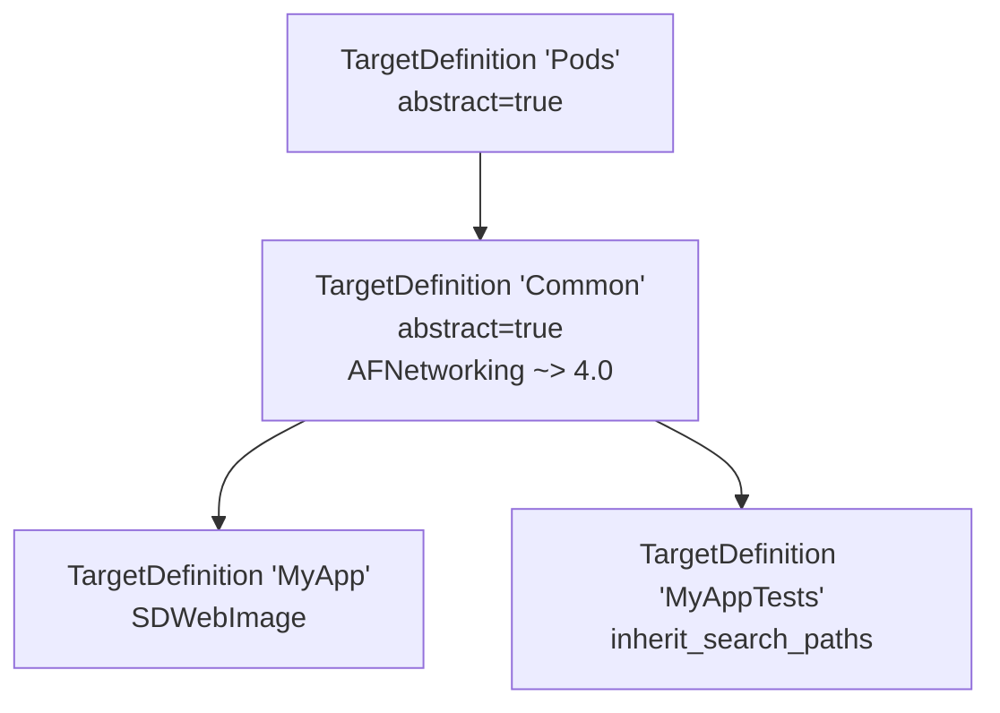

+++
title = "CocoaPods 源码导读：从命令到依赖求解"
date = '2026-05-02T22:32:27+08:00'
draft = false
weight = 12
tags = ["iOS", "源码分析", "CocoaPods"]
categories = ["iOS开发", "源码分析"]
+++
> 本文是系列第二篇，基于 CocoaPods 1.16.2 源码。我们从 `bin/pod` 进场，走完 CLAide 的命令分发、`Podfile` 的 DSL 求值、`Analyzer` 的七步分析、`Resolver + Molinillo` 的回溯求解，最后交付 `AggregateTarget`/`PodTarget` 给下一篇讲的下载与集成。
>
> 上一篇：[架构总览]() · 下一篇：[从下载到工程集成]()
>
> 运行示例贯穿全文：`pod install --repo-update`

---

## 一、`bin/pod`：16 行的入口

CocoaPods 的可执行文件非常薄，核心逻辑全在 `require 'cocoapods'` 之后的 `Pod::Command.run`：

```ruby
# CocoaPods/bin/pod : 24
if $PROGRAM_NAME == __FILE__ && !ENV['COCOAPODS_NO_BUNDLER']
  ENV['BUNDLE_GEMFILE'] = File.expand_path('../../Gemfile', __FILE__)
  require 'rubygems'
  require 'bundler/setup'
  $LOAD_PATH.unshift File.expand_path('../../lib', __FILE__)
elsif ENV['COCOAPODS_NO_BUNDLER']
  require 'rubygems'
  gem 'cocoapods'
end

STDOUT.sync = true if ENV['CP_STDOUT_SYNC'] == 'TRUE'
require 'cocoapods'

if profile_filename = ENV['COCOAPODS_PROFILE']
  # 开 ruby-prof 做性能剖析
  # ...
  reporter.new(RubyProf.profile { Pod::Command.run(ARGV) }).print(io)
else
  Pod::Command.run(ARGV)
end
```

这里有两个工程化细节值得留意：

1. **`COCOAPODS_NO_BUNDLER`**：默认 `pod` 跑在 Bundler 沙盒里，便于锁定 gem 版本；线上机器如果 `Gemfile` 路径不存在，可以设这个环境变量退回到系统 gem。
2. **`COCOAPODS_PROFILE=/tmp/x.html`**：直接集成了 `ruby-prof`，输出格式根据扩展名决定（`.txt`、`.html`、`.callgrind`）。排查"为什么 pod install 慢"时这是第一把武器。

进入 `Pod::Command.run` 之前，先绕一下 `Pod::Command` 的注册过程。

---

## 二、CLAide：命令行 DSL 与子命令分发

### 2.1 `Pod::Command` 的层级

```ruby
# CocoaPods/lib/cocoapods/command.rb : 16
class Command < CLAide::Command
  require 'cocoapods/command/options/repo_update'
  require 'cocoapods/command/options/project_directory'
  include Options

  require 'cocoapods/command/cache'
  require 'cocoapods/command/env'
  require 'cocoapods/command/init'
  require 'cocoapods/command/install'
  # ...

  self.abstract_command = true
  self.command = 'pod'
  self.version = VERSION
  self.description = 'CocoaPods, the Cocoa library package manager.'
  self.plugin_prefixes = %w(claide cocoapods)
  # ...
end
```

这里有两个关键机制：

- **子命令自动注册**：`CLAide::Command` 里定义了 `self.inherited(subclass)` 钩子，每个 `class Install < Command` 被加载时，都会自动挂到父命令的 `subcommands` 列表。所以只要 `require 'cocoapods/command/install'`，`pod install` 就能被识别。
- **插件前缀**：`plugin_prefixes = %w(claide cocoapods)` 告诉 CLAide 去 RubyGems 里扫描 `claide-*` / `cocoapods-*` 名字的 gem，自动加载它们。这就是 `cocoapods-keys`、`cocoapods-binary` 等插件"装了就有命令"的原理。

### 2.2 `Pod::Command.run` 的生命周期

```ruby
# CocoaPods/lib/cocoapods/command.rb : 47
def self.run(argv)
  ensure_not_root_or_allowed! argv    # 不允许 root 运行 (除非 --allow-root)
  verify_minimum_git_version!         # git >= 1.8.5
  verify_xcode_license_approved!      # xcodebuild -license
  super(argv)                         # ← 进 CLAide::Command.run
ensure
  UI.print_warnings                   # 打印积累的 warning
end
```

进到父类 CLAide：

```ruby
# CLAide/lib/claide/command.rb : 324
def self.run(argv = [])
  plugin_prefixes.each do |plugin_prefix|
    PluginManager.load_plugins(plugin_prefix)   # ① 加载插件
  end

  argv = ARGV.coerce(argv)
  command = parse(argv)                          # ② 解析到具体 Command 实例
  ANSI.disabled = !command.ansi_output?
  unless command.handle_root_options(argv)
    command.validate!                            # ③ 参数校验
    command.run                                  # ④ 执行
  end
rescue Object => exception
  handle_exception(command, exception)
end
```

`parse` 是一层层往下钻：

```ruby
# CLAide/lib/claide/command.rb : 347
def self.parse(argv)
  argv = ARGV.coerce(argv)
  cmd = argv.arguments.first
  if cmd && subcommand = find_subcommand(cmd)
    argv.shift_argument
    subcommand.parse(argv)          # 递归 → Command::Install.parse
  elsif abstract_command? && default_subcommand
    load_default_subcommand(argv)
  else
    new(argv)                       # 叶子节点，实例化
  end
end
```

对 `pod install --repo-update` 来说，调用栈是：

```text
Pod::Command.parse(['install', '--repo-update'])
 └─ Pod::Command::Install.parse(['--repo-update'])
     └─ Pod::Command::Install.new(ARGV.new(['--repo-update']))
```

### 2.3 `Command::Install`：极薄的控制器

`Command::Install` 本身只有 56 行，真正的职责是"把 flag 翻译成 `Installer` 的配置"：

```ruby
# CocoaPods/lib/cocoapods/command/install.rb : 1
class Install < Command
  include RepoUpdate
  include ProjectDirectory

  def self.options
    [
      ['--repo-update',  'Force running `pod repo update` before install'],
      ['--deployment',   'Disallow any changes to the Podfile or the Podfile.lock during installation'],
      ['--clean-install','Ignore the contents of the project cache and force a full pod installation. ...'],
    ].concat(super).reject { |(name, _)| name == '--no-repo-update' }
  end

  def initialize(argv)
    super
    @deployment = argv.flag?('deployment', false)
    @clean_install = argv.flag?('clean-install', false)
  end

  def run
    verify_podfile_exists!
    installer = installer_for_config
    installer.repo_update = repo_update?(:default => false)
    installer.update = false
    installer.deployment = @deployment
    installer.clean_install = @clean_install
    installer.install!
  end
end
```

`installer_for_config` 在父类里：

```ruby
# CocoaPods/lib/cocoapods/command.rb : 149
def installer_for_config
  Installer.new(config.sandbox, config.podfile, config.lockfile)
end
```

`config` 是 `Pod::Config.instance`（`Config::Mixin`），它会：
- 根据当前工作目录向上查找 `Podfile`；
- 按需 lazy-load `Podfile`、`Lockfile`、`Sandbox`；
- 读 `~/.cocoapods/config.yaml` 合并用户全局配置。

至此命令行阶段结束，接下来进入 `Installer#install!`。

---

## 三、`Podfile.from_ruby`：DSL 怎么变成对象树

`config.podfile` 会触发 `Podfile.from_file(podfile_path)`，对 `Podfile` / `*.podfile` / `*.rb` 都走 `from_ruby` 分支：

```ruby
# Core/lib/cocoapods-core/podfile.rb : 311
def self.from_ruby(path, contents = nil)
  contents ||= File.open(path, 'r:utf-8', &:read)

  # ... 编码修正 + 智能引号转换 ...

  podfile = Podfile.new(path) do
    begin
      eval(contents, nil, path.to_s)   # ← 关键
    rescue Exception => e
      message = "Invalid `#{path.basename}` file: #{e.message}"
      raise DSLError.new(message, path, e, contents)
    end
  end
  podfile
end
```

注意 `Podfile.new` 接收一个 block，在构造函数里调用 `instance_eval(&block)`：

```ruby
# Core/lib/cocoapods-core/podfile.rb : 42
def initialize(defined_in_file = nil, internal_hash = {}, &block)
  self.defined_in_file = defined_in_file
  @internal_hash = internal_hash
  if block
    default_target_def = TargetDefinition.new('Pods', self)
    default_target_def.abstract = true
    @root_target_definitions = [default_target_def]
    @current_target_definition = default_target_def
    instance_eval(&block)       # ← 在 Podfile 实例上执行 block
  else
    @root_target_definitions = []
  end
end
```

`instance_eval` 让 block 里的 `self` 变成 `Podfile` 实例，这样 `pod 'AFNetworking'` 就等价于 `self.pod('AFNetworking')`，而 `self` 又 `include Podfile::DSL`：

```ruby
# Core/lib/cocoapods-core/podfile/dsl.rb : 301
def pod(name = nil, *requirements)
  raise StandardError, 'A dependency requires a name.' unless name
  current_target_definition.store_pod(name, *requirements)
end

# Core/lib/cocoapods-core/podfile/dsl.rb : 395
def target(name, options = nil)
  raise Informative, "Unsupported options `#{options}` ..." if options

  parent = current_target_definition
  definition = TargetDefinition.new(name, parent)
  self.current_target_definition = definition
  yield if block_given?
ensure
  self.current_target_definition = parent
end
```

于是这段 Podfile：

```ruby
platform :ios, '13.0'
source 'https://cdn.cocoapods.org'

abstract_target 'Common' do
  pod 'AFNetworking', '~> 4.0'

  target 'MyApp' do
    pod 'SDWebImage'
  end

  target 'MyAppTests' do
    inherit! :search_paths
  end
end
```

会被解析成如下对象树（也就是上一篇里讲的"声明侧那棵树"）：



几个容易踩坑的细节：

- **`current_target_definition` 是一个栈语义**：通过 `ensure` 子句保证异常时也能恢复父作用域。这是为什么嵌套 `target` 能正常工作。
- **`abstract_target` / `target` 都走同一个 `target` 方法**：`abstract_target` 只是语义糖，会在内部设 `abstract = true`。
- **`inherit! :search_paths`** 不会让子 target 拥有父 target 的 pod，只会把搜索路径抄过去——后面 `Analyzer#generate_aggregate_target` 里专门有 `search_paths_aggregate_targets` 这一列表来处理它。

解析完成后，`Podfile` 会被存到 `Config.instance.podfile`，等 `Installer` 拿去分析。

---

## 四、`Installer#install!`：阶段骨架回顾

```ruby
# CocoaPods/lib/cocoapods/installer.rb : 160
def install!
  prepare                    # 本文：§5
  resolve_dependencies       # 本文：§6~§9
  download_dependencies      # 下一篇
  validate_targets           # 下一篇
  clean_sandbox
  if installation_options.skip_pods_project_generation?
    show_skip_pods_project_generation_message
    run_podfile_post_install_hooks
  else
    integrate                # 下一篇
  end
  write_lockfiles
  perform_post_install_actions
end
```

本文覆盖前两个阶段。

---

## 五、`prepare`：清场与插件加载

```ruby
# CocoaPods/lib/cocoapods/installer.rb : 218
def prepare
  if Dir.pwd.start_with?(sandbox.root.to_path)
    raise Informative, 'Command should be run from a directory outside Pods directory.' \
      "\n\n\tCurrent directory is #{UI.path(Pathname.pwd)}\n"
  end
  UI.message 'Preparing' do
    deintegrate_if_different_major_version
    sandbox.prepare
    ensure_plugins_are_installed!
    run_plugins_pre_install_hooks
  end
end
```

四件事：

1. **大版本跨越时自动反集成**：
   ```ruby
   # installer.rb : 767
   def deintegrate_if_different_major_version
     return unless lockfile
     return if lockfile.cocoapods_version.major == Version.create(VERSION).major
     UI.section('Re-creating CocoaPods due to major version update.') do
       projects = Pathname.glob(config.installation_root + '*.xcodeproj').map { |path| Xcodeproj::Project.open(path) }
       deintegrator = Deintegrator.new
       projects.each do |project|
         config.with_changes(:silent => true) { deintegrator.deintegrate_project(project) }
         project.save if project.dirty?
       end
     end
   end
   ```
   从 1.x 升到 2.x（理论上）会自动跑一遍 `cocoapods-deintegrate`。

2. **准备 Sandbox 目录**：确保 `Pods/`、`Pods/Headers/`、`Pods/Target Support Files/` 等目录存在。

3. **校验插件是否装好**：Podfile 里 `plugin 'cocoapods-foo'` 声明的插件必须在 RubyGems 环境里找得到，否则直接报错。

4. **执行 `pre_install` 插件钩子**：注意是"插件侧"的 `pre_install`，Podfile 级别的 `pre_install do ... end` 要到 `download_dependencies` 那里才跑（这是 1.6 之后的行为，别混淆）。

---

## 六、`resolve_dependencies`：依赖分析主流程

```ruby
# CocoaPods/lib/cocoapods/installer.rb : 235
def resolve_dependencies
  plugin_sources = run_source_provider_hooks
  analyzer = create_analyzer(plugin_sources)

  UI.section 'Updating local specs repositories' do
    analyzer.update_repositories                   # --repo-update 落点
  end if repo_update?

  UI.section 'Analyzing dependencies' do
    analyze(analyzer)
    validate_build_configurations
  end

  UI.section 'Verifying no changes' do
    verify_no_podfile_changes!
    verify_no_lockfile_changes!
  end if deployment?

  analyzer
end
```

整个方法做三件事：

1. **可能更新 spec 仓**（`--repo-update` 或 `pod update`）。
2. **调用 `Analyzer#analyze`** 得到完整的 `AnalysisResult`。
3. **`--deployment` 模式下验证**：Podfile 与 Lockfile 不能因为这次安装而改变（CI 常用）。

我们把 `Analyzer` 单独讲。

---

## 七、`Analyzer#analyze`：七步走

`analyzer.rb` 有 1208 行，但 `analyze` 方法本身只有 40 行，能把全部步骤一眼看全：

```ruby
# CocoaPods/lib/cocoapods/installer/analyzer.rb : 102
def analyze(allow_fetches = true)
  return @result if @result
  validate_podfile!                                    # ① 校验 Podfile
  validate_lockfile_version!                           # ② 校验 Lockfile 版本
  if installation_options.integrate_targets?
    target_inspections = inspect_targets_to_integrate  # ③ 扫描用户工程
  else
    verify_platforms_specified!
    target_inspections = {}
  end
  podfile_state = generate_podfile_state               # ④ 对比 Podfile vs Lockfile

  store_existing_checkout_options
  if allow_fetches == :outdated
    # 特殊路径：pod outdated
  elsif allow_fetches == true
    fetch_external_sources(podfile_state)              # ⑤ 拉 :path/:git/:podspec 的 podspec
  elsif !dependencies_to_fetch(podfile_state).all?(&:local?)
    raise Informative, 'Cannot analyze without fetching ...'
  end

  locked_dependencies = generate_version_locking_dependencies(podfile_state)  # ⑥ 生成锁定约束
  resolver_specs_by_target = resolve_dependencies(locked_dependencies)        # ⑦ 调 Resolver
  validate_platforms(resolver_specs_by_target)
  specifications = generate_specifications(resolver_specs_by_target)
  aggregate_targets, pod_targets = generate_targets(resolver_specs_by_target, target_inspections)
  sandbox_state = generate_sandbox_state(specifications)
  # ... 汇总 specs_by_source / specs_by_target ...
  @result = AnalysisResult.new(podfile_state, specs_by_target, specs_by_source, specifications, sandbox_state,
                               aggregate_targets, pod_targets, @podfile_dependency_cache)
end
```

> 这个方法值得你在心里默画一遍：几乎 CocoaPods 所有的"诡异现象"都能在这 7 步里找到解释。

下面逐步拆解关键步骤。

### 7.1 扫描用户工程（`inspect_targets_to_integrate`）

`TargetInspector` 会去读 Podfile 声明里提到的 `.xcodeproj`，抽取：
- 所有构建配置名（Debug/Release/自定义）；
- 每个 user target 的 UUID、平台、架构、Swift 版本；
- `project`/`host_target` 关系（App Extension、Watch App、测试 bundle）。

这些是后面 `generate_aggregate_target` 在决定"要不要注入 `$(inherited)`"、"需要挂哪些 xcconfig"时的全部输入。

### 7.2 `generate_podfile_state`：Podfile vs Lockfile 的差分

```ruby
# analyzer.rb : 260
def generate_podfile_state
  if lockfile
    pods_state = nil
    UI.section 'Finding Podfile changes' do
      pods_by_state = lockfile.detect_changes_with_podfile(podfile)
      pods_state = SpecsState.new(pods_by_state)
      pods_state.print if config.verbose?
    end
    pods_state
  else
    state = SpecsState.new
    state.added.merge(podfile_dependencies.map(&:root_name))
    state
  end
end
```

`SpecsState` 分成 4 个集合：`added` / `changed` / `deleted` / `unchanged`。判定规则（`Lockfile#detect_changes_with_podfile`）：

| 情景 | 归类 |
| --- | --- |
| Podfile 里新增的 pod | `added` |
| Podfile 里移除的 pod | `deleted` |
| requirement 变了、external source 变了、或 source 变了 | `changed` |
| 其余 | `unchanged` |

这个状态贯穿后面所有步骤：
- 决定 `fetch_external_sources` 要不要重新拉；
- 决定 `generate_version_locking_dependencies` 要不要把某个 pod 从锁定图里摘下来；
- 决定 `install_pod_sources` 要不要重新下载。

### 7.3 `fetch_external_sources`：预下载 external source 的 podspec

对 `:path`/`:git`/`:podspec`/`:http` 这类 external source，resolver 没法从 spec repo 里拿 spec，必须先把 podspec 拉到 `Pods/Local Podspecs/`：

```ruby
# analyzer.rb : 969
def fetch_external_sources(podfile_state)
  verify_no_pods_with_different_sources!
  deps = dependencies_to_fetch(podfile_state)
  pods = pods_to_fetch(podfile_state)
  return if deps.empty?
  UI.section 'Fetching external sources' do
    deps.sort.each do |dependency|
      fetch_external_source(dependency, !pods.include?(dependency.root_name))
    end
  end
end
```

`dependencies_to_fetch` 决定哪些要拉：

```ruby
# analyzer.rb : 1000
def dependencies_to_fetch(podfile_state)
  @deps_to_fetch ||= begin
    deps_to_fetch = []
    deps_with_external_source = podfile_dependencies.select(&:external_source)

    if update_mode == :all
      deps_to_fetch = deps_with_external_source
    else
      deps_to_fetch = deps_with_external_source.select { |dep| pods_to_fetch(podfile_state).include?(dep.root_name) }
      deps_to_fetch_if_needed = deps_with_external_source.select { |dep| podfile_state.unchanged.include?(dep.root_name) }
      deps_to_fetch += deps_to_fetch_if_needed.select do |dep|
        sandbox.specification_path(dep.root_name).nil? ||
          !dep.external_source[:path].nil? ||
          !sandbox.pod_dir(dep.root_name).directory? ||
          checkout_requires_update?(dep)
      end
    end
    deps_to_fetch.uniq(&:root_name)
  end
end
```

核心策略：
- **`pod update`（所有）模式** → 全部重拉；
- **`pod install`** → 只拉 added/changed 的；
- **`:path`** → 每次都拉（便宜，就是文件复制）；
- **unchanged 但本地找不到 podspec 的** → 兜底补拉。

拉完后 podspec 会被 `sandbox.store_podspec` 登记，`Resolver` 稍后就能通过 `sandbox.specification(name)` 查到。

> 为什么 resolver 需要 podspec？因为 podspec 里的 `dependency` 声明才是递归求解的输入。不先拿到它们，求解器连图都构不出来。

### 7.4 `generate_version_locking_dependencies`：把 Lockfile 变成锁定图

`LockingDependencyAnalyzer` 把 Lockfile 转成一张 `Molinillo::DependencyGraph`，传给 resolver 做 base。关键代码在 `analyzer/locking_dependency_analyzer.rb`：

```ruby
# locking_dependency_analyzer.rb : 32
def self.generate_version_locking_dependencies(lockfile, pods_to_update, pods_to_unlock = [])
  dependency_graph = Molinillo::DependencyGraph.new

  if lockfile
    added_dependency_strings = Set.new

    explicit_dependencies = lockfile.dependencies
    explicit_dependencies.each do |dependency|
      dependency_graph.add_vertex(dependency.name, dependency, true)
    end

    pods = lockfile.to_hash['PODS'] || []
    pods.each do |pod|
      add_to_dependency_graph(pod, [], dependency_graph, pods_to_unlock, added_dependency_strings)
    end

    pods_to_update = pods_to_update.flat_map do |u|
      root_name = Specification.root_name(u).downcase
      dependency_graph.vertices.each_key.select { |n| Specification.root_name(n).downcase == root_name }
    end

    pods_to_update.each do |u|
      dependency_graph.detach_vertex_named(u)   # ← 要 update 的 pod 从锁图里摘掉
    end
    # ...
  end

  dependency_graph
end
```

调用点在 Analyzer：

```ruby
# analyzer.rb : 934
def generate_version_locking_dependencies(podfile_state)
  if update_mode == :all || !lockfile
    LockingDependencyAnalyzer.unlocked_dependency_graph       # 全解
  else
    deleted_and_changed = podfile_state.changed + podfile_state.deleted
    deleted_and_changed += pods_to_update[:pods] if update_mode == :selected
    local_pod_names = podfile_dependencies.select(&:local?).map(&:root_name)
    pods_to_unlock = local_pod_names.to_set.delete_if do |pod_name|
      next unless sandbox_specification = sandbox.specification(pod_name)
      sandbox_specification.checksum == lockfile.checksum(pod_name)
    end
    LockingDependencyAnalyzer.generate_version_locking_dependencies(lockfile, deleted_and_changed, pods_to_unlock)
  end
end
```

一条规则三句话：
- **`pod install`**：只摘掉 `added` / `changed` / `deleted` 涉及的 pod，其余都锁死 —— 这就是为什么 `pod install` 不会乱升版本。
- **`pod update`**：全部从锁图里摘掉 —— 所以 `pod update` 等价于 `rm Podfile.lock && pod install`。
- **`pod update XXX`**：只摘 `XXX` 和它的递归依赖。

### 7.5 `resolve_dependencies`：调 Molinillo

```ruby
# analyzer.rb : 1071
def resolve_dependencies(locked_dependencies)
  duplicate_dependencies = podfile_dependencies.group_by(&:name).
    select { |_name, dependencies| dependencies.count > 1 }
  duplicate_dependencies.each do |name, dependencies|
    UI.warn "There are duplicate dependencies on `#{name}` in #{UI.path podfile.defined_in_file}:\n\n" \
     "- #{dependencies.map(&:to_s).join("\n- ")}"
  end

  resolver_specs_by_target = nil
  UI.section "Resolving dependencies of #{UI.path(podfile.defined_in_file) || 'Podfile'}" do
    resolver = Pod::Resolver.new(sandbox, podfile, locked_dependencies, sources, @specs_updated, :sources_manager => sources_manager)
    resolver_specs_by_target = resolver.resolve
    resolver_specs_by_target.values.flatten(1).map(&:spec).each(&:validate_cocoapods_version)
  end
  resolver_specs_by_target
end
```

Resolver 被委派出去之后，返回的 `resolver_specs_by_target` 是一个 `Hash{TargetDefinition => Array<ResolverSpecification>}`。下一节专门看它。

### 7.6 `generate_targets`：从"解出的 spec"到 `PodTarget` / `AggregateTarget`

`generate_targets` 的逻辑较长，主骨架是：

```ruby
# analyzer.rb : 430
def generate_targets(resolver_specs_by_target, target_inspections)
  resolver_specs_by_target = resolver_specs_by_target.reject { |td, _| td.abstract? && !td.platform }
  pod_targets = generate_pod_targets(resolver_specs_by_target, target_inspections)
  pod_targets_by_target_definition = group_pod_targets_by_target_definition(pod_targets, resolver_specs_by_target)
  aggregate_targets = resolver_specs_by_target.keys.reject(&:abstract?).map do |target_definition|
    generate_aggregate_target(target_definition, target_inspections, pod_targets_by_target_definition)
  end
  # search_paths_aggregate_targets 回填、embedded target 处理
  [aggregate_targets, pod_targets]
end
```

关键点：

- **`PodTarget` 按 `(root spec, platform, subspec combination)` 去重**：也就是说，如果 `AFNetworking` 同时被 iOS App 和 Mac App 依赖，就会生成两个 `PodTarget`，名字像 `AFNetworking-iOS13.0`。`PodVariantSet` 专门负责这种 de-duplication。
- **`AggregateTarget` 一个用户 target 一个**：除了 `abstract_target` 不会生成 `AggregateTarget`（它只是个容器）。
- **`search_paths_aggregate_targets`**：对应 `inherit! :search_paths`，只继承 header 搜索路径，不链接到父 target 的 pod。
- **Extension / Watch / Test target**：会被识别为 `embedded_aggregate_targets`，走 `embedded_target_pod_targets_by_host` 的特殊路径，把自己需要但 host 没有的 pod 复制给 host。

### 7.7 `generate_sandbox_state`：添加/修改/删除分类

```ruby
# analyzer.rb : 1123
def generate_sandbox_state(specifications)
  sandbox_state = nil
  UI.section 'Comparing resolved specification to the sandbox manifest' do
    sandbox_analyzer = SandboxAnalyzer.new(sandbox, podfile, specifications, update_mode?)
    sandbox_state = sandbox_analyzer.analyze
    sandbox_state.print
  end
  sandbox_state
end
```

`SandboxAnalyzer` 的注释已经把规则讲清楚了：

```ruby
# analyzer/sandbox_analyzer.rb : 9
# Added
# - If not present in the sandbox lockfile.
# - The directory of the Pod doesn't exits.
#
# Changed
# - The version of the Pod changed.
# - The SHA of the specification file changed.
# - The specific installed (sub)specs of the same Pod changed.
# - The specification is from an external source and the
#   installation process is in update mode.
# - The directory of the Pod is empty.
# - The Pod has been pre-downloaded.
#
# Removed
# - If a specification is present in the lockfile but not in the resolved
#   specs.
```

这个 `sandbox_state` 才是下一篇 `install_pod_sources` 真正依赖的输入——它告诉我们"哪些要下载/重新下载"。

---

## 八、`Resolver` + `Molinillo`：依赖求解器深入

这是整个 CocoaPods 里最"算法味"的一块。分两层看：`Pod::Resolver` 是适配层，`Molinillo::Resolution` 是算法核心。

### 8.1 `Pod::Resolver#resolve`：两行核心

```ruby
# CocoaPods/lib/cocoapods/resolver.rb : 86
def resolve
  dependencies = @podfile_dependency_cache.target_definition_list.flat_map do |target|
    @podfile_dependency_cache.target_definition_dependencies(target).each do |dep|
      next unless target.platform
      @platforms_by_dependency[dep].push(target.platform)
    end
  end.uniq
  @platforms_by_dependency.each_value(&:uniq!)
  @activated = Molinillo::Resolver.new(self, self).resolve(dependencies, locked_dependencies)
  resolver_specs_by_target
rescue Molinillo::ResolverError => e
  handle_resolver_error(e)
end
```

两个"`self`"很关键：`Molinillo::Resolver.new(self, self)` 里第一个 `self` 是 `SpecificationProvider`，第二个是 `UI`。也就是说 `Pod::Resolver` 要给 Molinillo 实现两组协议：

**① SpecificationProvider（Molinillo 问，Resolver 答）**

| Molinillo 回调 | Resolver 实现要点 |
| --- | --- |
| `search_for(dependency)` | 返回所有满足 requirement 的候选 spec（见下文缓存） |
| `dependencies_for(specification)` | 返回该 spec 自身的子依赖 |
| `name_for(dependency)` | 直接 `dependency.name`（subspec 也用全名） |
| `requirement_satisfied_by?(req, activated, spec)` | 版本匹配 + 平台兼容 + 避免 prerelease 误入 |
| `sort_dependencies(deps, activated, conflicts)` | 启发式排序，见下 |

`sort_dependencies` 是让求解速度可接受的关键启发式：

```ruby
# resolver.rb : 266
def sort_dependencies(dependencies, activated, conflicts)
  dependencies.sort_by! do |dependency|
    name = name_for(dependency)
    [
      activated.vertex_named(name).payload ? 0 : 1,    # 已激活的优先
      dependency.external_source ? 0 : 1,               # external 优先（它只有一个版本）
      dependency.prerelease? ? 0 : 1,                   # 明确要 prerelease 的优先
      conflicts[name] ? 0 : 1,                          # 以前冲突过的优先（尽早失败）
      search_for(dependency).count,                     # 候选越少越先解（MRV）
    ]
  end
end
```

最后一条就是经典的 **Minimum Remaining Values (MRV)** 启发式，CSP 求解常用。

**② UI（Molinillo 通知 Resolver 进度）**

CocoaPods 选择"什么都不打印"——你平时看到的是 `UI.section 'Resolving dependencies'`，而非求解内部的细节：

```ruby
# resolver.rb : 295
def before_resolution;    end
def after_resolution;     end
def indicate_progress;    end
```

### 8.2 `search_for` 的缓存与懒加载

每次 Molinillo 问"X 有哪些候选版本？"都会触发 `search_for`：

```ruby
# resolver.rb : 157
def search_for(dependency)
  @search[dependency] ||= begin
    additional_requirements = if locked_requirement = requirement_for_locked_pod_named(dependency.name)
                                [locked_requirement]
                              else
                                Array(@podfile_requirements_by_root_name[dependency.root_name])
                              end
    specifications_for_dependency(dependency, additional_requirements).freeze
  end
end
```

这里做了三件事：
1. **按 dependency 缓存**：同样的 requirement 在求解循环里会被问几十次，不缓存就爆炸。
2. **合并 locked requirement**：从 Lockfile 来的版本锁定会作为额外约束加入。
3. **合并 Podfile 的其他 requirement**：比如 Podfile 里 `AFNetworking` 在两个 target 里写了 `~> 4.0` 和 `>= 4.0.1`，`specifications_for_dependency` 要同时满足这两个。

背后是 `Set`（每个 pod 按名字在 sources 里聚合所有版本），再调 `subspec_by_name`：

```ruby
# resolver.rb : 356
def specifications_for_dependency(dependency, additional_requirements = [])
  requirement_list = dependency.requirement.as_list + additional_requirements.flat_map(&:as_list)
  requirement_list.uniq!
  requirement = Requirement.new(requirement_list)
  find_cached_set(dependency).
    all_specifications(warn_for_multiple_pod_sources, requirement).
    map { |s| s.subspec_by_name(dependency.name, false, true) }.
    compact
end
```

`find_cached_set` 要么从 sandbox 拿 external source 的 spec，要么从 spec repo 搜：

```ruby
# resolver.rb : 374
def find_cached_set(dependency)
  name = dependency.root_name
  cached_sets[name] ||= begin
    if dependency.external_source
      spec = sandbox.specification(name)
      raise StandardError, "[Bug] Unable to find the specification for `#{dependency}`." unless spec
      set = Specification::Set::External.new(spec)
    else
      set = create_set_from_sources(dependency)
    end
    raise Molinillo::NoSuchDependencyError.new(dependency) unless set
    set
  end
end
```

`create_set_from_sources` 最终落到 `Source::Aggregate#search(dependency)`：对 Git-based source 是去 `repos_dir` 里扫目录，对 CDN source 是按 shard 拉索引文件，这部分我们在下一篇讲 sources 时再细化。

### 8.3 `Molinillo::Resolution#resolve`：回溯求解主循环

算法入口非常短：

```ruby
# Molinillo/lib/molinillo/resolution.rb : 167
def resolve
  start_resolution

  while state
    break if !state.requirement && state.requirements.empty?
    indicate_progress
    if state.respond_to?(:pop_possibility_state) # DependencyState
      debug(depth) { "Creating possibility state for #{requirement} (#{possibilities.count} remaining)" }
      state.pop_possibility_state.tap do |s|
        if s
          states.push(s)
          activated.tag(s)
        end
      end
    end
    process_topmost_state
  end

  resolve_activated_specs
ensure
  end_resolution
end
```

关键对象：

- **`states`**：栈，每一层是一个 `DependencyState` 或 `PossibilityState`。
- **`activated`**：`DependencyGraph`，记录当前已经选中了哪些 spec 及其子依赖关系。
- **`possibilities`**：当前 `DependencyState` 下剩余可尝试的版本集合（由高到低排）。

`process_topmost_state` 就是一次"尝试激活"：

```ruby
# resolution.rb : 252
def process_topmost_state
  if possibility
    attempt_to_activate
  else
    create_conflict
    unwind_for_conflict      # ← 回溯
  end
rescue CircularDependencyError => underlying_error
  create_conflict(underlying_error)
  unwind_for_conflict
end
```

`attempt_to_activate` 有两条分支：

```ruby
# resolution.rb : 667
def attempt_to_activate
  debug(depth) { 'Attempting to activate ' + possibility.to_s }
  existing_vertex = activated.vertex_named(name)
  if existing_vertex.payload
    debug(depth) { "Found existing spec (#{existing_vertex.payload})" }
    attempt_to_filter_existing_spec(existing_vertex)   # A. 已经有了，收紧候选
  else
    latest = possibility.latest_version
    possibility.possibilities.select! do |possibility|
      requirement_satisfied_by?(requirement, activated, possibility)
    end
    if possibility.latest_version.nil?
      possibility.possibilities << latest if latest
      create_conflict
      unwind_for_conflict                              # B. 没候选了，回溯
    else
      activate_new_spec                                # C. 取最高版本，激活
    end
  end
end
```

**激活成功后的递归展开**：

```ruby
# resolution.rb : 734
def require_nested_dependencies_for(possibility_set)
  nested_dependencies = dependencies_for(possibility_set.latest_version)
  debug(depth) { "Requiring nested dependencies (#{nested_dependencies.join(', ')})" }
  nested_dependencies.each do |d|
    activated.add_child_vertex(name_for(d), nil, [name_for(possibility_set.latest_version)], d)
    parent_index = states.size - 1
    parents = @parents_of[d]
    parents << parent_index if parents.empty?
  end

  push_state_for_requirements(requirements + nested_dependencies, !nested_dependencies.empty?)
end
```

### 8.4 冲突与回溯：`unwind_for_conflict` 的智能跳层

Molinillo 最能体现工程实力的地方是它的 **非盲回溯**。传统 DPLL 回溯到上一层；Molinillo 会分析冲突原因，直接跳到"能真正改变结果的那一层"：

```ruby
# resolution.rb : 293
def unwind_for_conflict
  details_for_unwind = build_details_for_unwind
  unwind_options = unused_unwind_options
  debug(depth) { "Unwinding for conflict: #{requirement} to #{details_for_unwind.state_index / 2}" }
  conflicts.tap do |c|
    sliced_states = states.slice!((details_for_unwind.state_index + 1)..-1)
    raise_error_unless_state(c)
    activated.rewind_to(sliced_states.first || :initial_state) if sliced_states
    state.conflicts = c
    state.unused_unwind_options = unwind_options
    filter_possibilities_after_unwind(details_for_unwind)     # 关键：修剪候选
    index = states.size - 1
    @parents_of.each { |_, a| a.reject! { |i| i >= index } }
    state.unused_unwind_options.reject! { |uw| uw.state_index >= index }
  end
end
```

`build_details_for_unwind` 会枚举三种可能的回跳目标：

1. **Primary unwind**：直接回到引发冲突的那个 requirement 的 state，尝试它的其它版本。
2. **Parent unwind**：回到"选择了把这个冲突 requirement 加入"的那个父 state，换一个不产生此子依赖的版本。
3. **Grandparent and up**：递归往上，找"避免生成父 requirement 本身"的祖先 state。

然后 `UnwindDetails#<=>` 用 `state_index` 优先、再比 `reversed_requirement_tree_index` 的规则挑"最靠后且最精确"的那个。回跳完之后还要 `filter_possibilities_after_unwind` 把已知会再次失败的候选提前剔掉——否则就会陷入同样的死循环。

> 这一块是经典的 **Conflict-Driven Clause Learning** 思想在 Ruby 里的实现。详细证明看 Molinillo 论文 `ARCHITECTURE.md`，源码里 `UnwindDetails` 的注释也非常值得一读（`resolution.rb:62` 开始那段）。

### 8.5 收敛：`resolve_activated_specs`

循环退出后，`activated` 图里每个 `vertex.payload` 还是 `PossibilitySet`（一组候选）。最后要敲定具体版本：

```ruby
# resolution.rb : 216
def resolve_activated_specs
  activated.vertices.each do |_, vertex|
    next unless vertex.payload

    latest_version = vertex.payload.possibilities.reverse_each.find do |possibility|
      vertex.requirements.all? { |req| requirement_satisfied_by?(req, activated, possibility) }
    end

    activated.set_payload(vertex.name, latest_version)
  end
  activated.freeze
end
```

这里用了一个重要事实：由于前面的激活与收紧保证了 `possibilities` 里的任何元素都能满足当前 requirements 集合，所以只需挑版本最高的（倒序找）即可——也就是 **"每次尽量选最高版本，遇到冲突再降级"** 这一广为人知的 CocoaPods 选版本策略。

### 8.6 回到 `Pod::Resolver`：按 target 分组

Molinillo 返回的是"活的"的 `DependencyGraph`（节点是 spec name、payload 是 spec）。`Pod::Resolver` 要把它重新按 Podfile 的 target 切开：

```ruby
# resolver.rb : 105
def resolver_specs_by_target
  @resolver_specs_by_target ||= {}.tap do |resolver_specs_by_target|
    @podfile_dependency_cache.target_definition_list.each do |target|
      next if target.abstract? && !target.platform

      explicit_dependencies = @podfile_dependency_cache.target_definition_dependencies(target).map(&:name).to_set
      used_by_aggregate_target_by_spec_name = {}
      used_vertices_by_spec_name = {}

      @activated.tsort.reverse_each do |vertex|      # ← 拓扑排序
        spec_name = vertex.name
        explicitly_included = explicit_dependencies.include?(spec_name)
        if explicitly_included || vertex.incoming_edges.any? { |edge| used_vertices_by_spec_name.key?(edge.origin.name) && edge_is_valid_for_target_platform?(edge, target.platform) }
          validate_platform(vertex.payload, target)
          used_vertices_by_spec_name[spec_name] = vertex
          used_by_aggregate_target_by_spec_name[spec_name] = vertex.payload.library_specification? &&
            (explicitly_included || vertex.predecessors.any? { |predecessor| used_by_aggregate_target_by_spec_name.fetch(predecessor.name, false) })
        end
      end

      resolver_specs_by_target[target] = used_vertices_by_spec_name.each_value.
        map do |vertex|
          payload = vertex.payload
          non_library = !used_by_aggregate_target_by_spec_name.fetch(vertex.name)
          spec_source = payload.respond_to?(:spec_source) && payload.spec_source
          ResolverSpecification.new(payload, non_library, spec_source)
        end.
        sort_by(&:name)
    end
  end
end
```

这里的拓扑遍历用了 `TSort` 模块（Ruby 标准库）。一条 spec 被归到某 target，当且仅当它被这个 target 显式声明，或者被该 target 已经确认使用的 spec 所依赖。`non_library` 标志用来区分"用于库的 spec"和"只用于 test/app spec 的 spec"——非库 spec 会从 aggregate target 的最终链接里排除。

---

## 九、最终产物：`AnalysisResult`

走完 7 步，`Analyzer` 返回一个 `AnalysisResult`：

```ruby
# CocoaPods/lib/cocoapods/installer/analyzer/analysis_result.rb
AnalysisResult = Struct.new(
  :podfile_state,             # SpecsState：added / changed / deleted / unchanged
  :specs_by_target,           # {TargetDefinition => [Specification]}
  :specs_by_source,           # {Source => [Specification]}
  :specifications,            # [Specification]（全部，用于生成 Manifest）
  :sandbox_state,             # SpecsState：Sandbox 侧的 add/change/delete
  :targets,                   # [AggregateTarget]
  :pod_targets,               # [PodTarget]
  :podfile_dependency_cache,  # 给下游用的缓存
)
```

`Installer` 会把它存到 `@analysis_result`，并拆成 `@aggregate_targets` / `@pod_targets`：

```ruby
# installer.rb : 421
def analyze(analyzer = create_analyzer)
  @analysis_result = analyzer.analyze
  @aggregate_targets = @analysis_result.targets
  @pod_targets = @analysis_result.pod_targets
end
```

至此，`pod install --repo-update` 的前两个阶段就走完了：

- **用户意图** → `Podfile` 对象树
- **历史状态** → `Lockfile` 锁图
- **机器状态** → `Manifest.lock`（由 `Sandbox` 加载）
- **spec 仓状态** → `sources`（可能刚刚被 `--repo-update` 更新过）
- **求解结果** → `AnalysisResult`

`AnalysisResult.sandbox_state` 告诉下一篇"要下载哪些"；`aggregate_targets` / `pod_targets` 告诉下一篇"要生成什么样的 Pods.xcodeproj"。

---

## 十、一个典型场景的端到端走查

把所有节点串起来，用一个实际场景收尾：

> 用户把 Podfile 里的 `pod 'AFNetworking', '~> 4.0'` 改成 `pod 'AFNetworking', '~> 4.0.1'`，然后 `pod install --repo-update`。

流程追踪：

1. **`Command::Install#run`** → `installer.repo_update = true; installer.install!`
2. **`prepare`**：`sandbox.prepare`，无插件，无 hook。
3. **`resolve_dependencies`**
   - `run_source_provider_hooks` → 空数组
   - `analyzer.update_repositories` → 对 trunk CDN 拉一次增量索引（见下一篇 `sources` 小节）。`@specs_updated = true`。
   - `analyzer.analyze`
     - `generate_podfile_state` → `AFNetworking` 被归到 `changed`
     - `fetch_external_sources` → 无 external，跳过
     - `generate_version_locking_dependencies` → Lockfile 解析出完整锁图，但把 `AFNetworking` 及其递归依赖从图中 `detach_vertex_named` 掉
     - `resolve_dependencies` → `Resolver` 调 `Molinillo::Resolution#resolve`
       - `search_for(AFNetworking ~> 4.0.1)` 命中 CDN 索引，返回 `[4.0.1, 4.0.2]`（假设）
       - 其它 pod 因为在锁图里，`possibilities_for_requirement` 只返回 Lockfile 版本
       - 激活 `AFNetworking 4.0.2`，展开它的子依赖（大多被锁住，直接命中）
       - 无冲突，`resolve_activated_specs` 收敛
     - `generate_targets` → 产出 `Pods-MyApp` / `Pods-MyAppTests` 两个 AggregateTarget 和一组 PodTarget（`AFNetworking-iOS13.0` 新版本）
     - `generate_sandbox_state` → `AFNetworking: :changed`，其它 `:unchanged`
4. **之后**：`download_dependencies` 只会重下 `AFNetworking`，`generate_pods_project` 只需增量更新——下一篇见。

---

## 十一、调试与扩展建议

- **`MOLINILLO_DEBUG=1 pod install`**：打开 Molinillo 内部的 debug 日志。想直观理解回溯过程，没有比这更快的方式。
- **`pod install --verbose`**：会打印 `SpecsState.print` 的 added/changed/deleted 列表、`fetch_external_sources` 的每一条 git clone 命令。
- **写一个 source_provider 插件**：私有 CDN 接入、多仓并存都靠它。入口是 `Pod::HooksManager.register('my-plugin', :source_provider) { |ctx, _| ctx.add_source(...) }`。
- **本地打 patch**：`bundle config local.cocoapods /path/to/fork`，然后 `bundle install`，就能让项目用你本地改过的 CocoaPods 跑 `pod install`，调试比 gem install 方便一个数量级。

---

下一篇我们从 `Installer#download_dependencies` 开始，看 `PodSourceInstaller` / `Downloader::Cache` 怎么把 spec 变成 `Pods/<name>` 目录，再看 `Xcode::SinglePodsProjectGenerator` 怎么构造 `Pods.xcodeproj`，最后看 `UserProjectIntegrator` 怎么把这些塞进用户工程。
