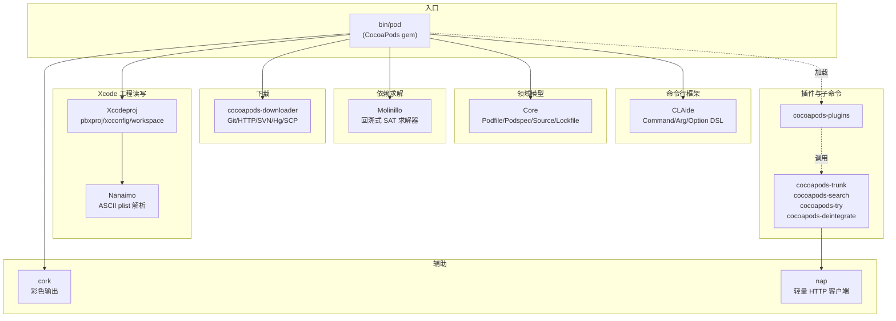
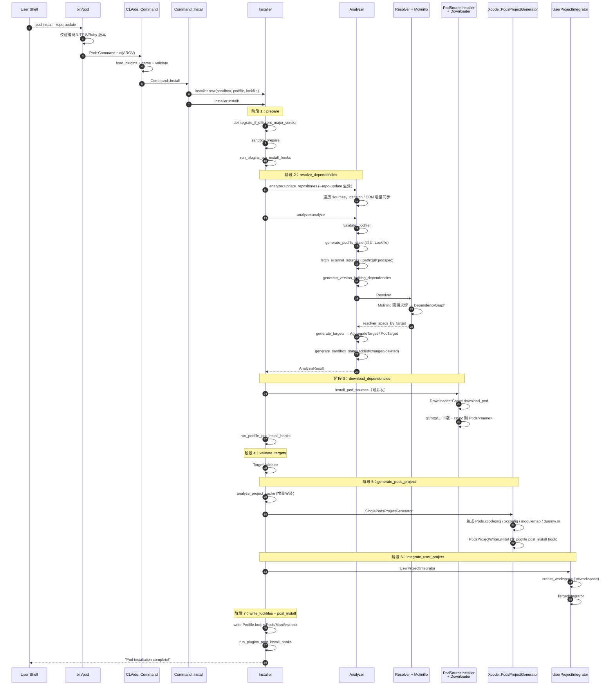
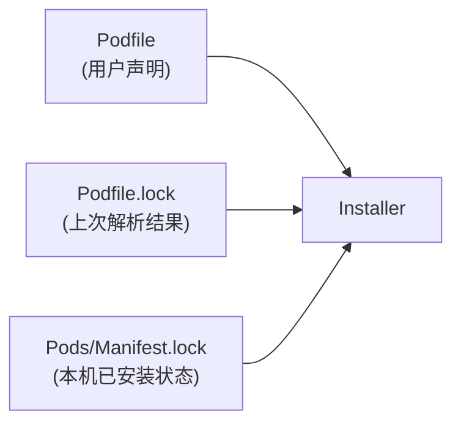
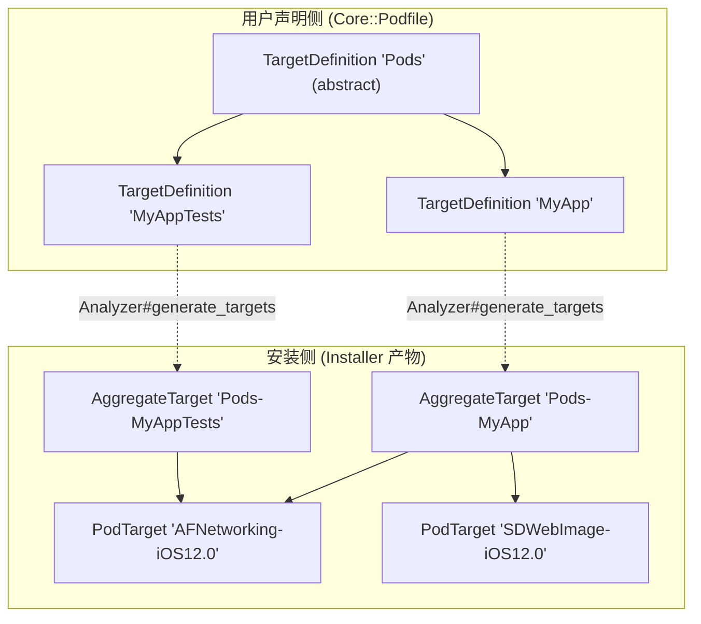

+++
title = "CocoaPods 源码导读：架构总览"
date = '2026-05-02T22:32:27+08:00'
draft = false
weight = 13
tags = ["iOS", "源码分析", "CocoaPods"]
categories = ["iOS开发", "源码分析"]
+++
> 本系列基于 **CocoaPods 1.16.2**（2026 年 4 月）源码进行分析。源码仓库由 15 个 Ruby Gem 组成，本文先从整体架构与职责拆分讲起，再以 `pod install --repo-update` 为主线绘制全景执行图，串起后续两篇专题的切入点。
>
> 系列目录：
> - **架构总览**（本文）
> - [从命令到依赖求解]()
> - [从下载到工程集成]()

---

## 一、CocoaPods 不是单一仓库

很多人以为 CocoaPods 就是一个 Ruby 项目，其实官方仓库 `CocoaPods/CocoaPods` 只是入口，真正的能力被拆成 15 个独立 gem，每个 gem 只做一件事。用 `gem dependency cocoapods` 会看到这样的依赖拓扑：



各 gem 的一句话职责：

| Gem | 行数量级 | 核心职责 |
| --- | --- | --- |
| **CocoaPods** | ~20k | 主工程，命令调度 + 安装流程编排（`Installer`/`Analyzer`） |
| **CLAide** | ~3k | 命令行 DSL，`pod xxx` 的子命令注册与路由 |
| **Core** | ~8k | `Podfile`、`Specification`、`Lockfile`、`Source` 等不变的领域对象 |
| **Molinillo** | ~1.5k | 与 Bundler 共用的依赖求解器，回溯算法核心 |
| **Xcodeproj** | ~15k | 读写 `.xcodeproj`、`.xcworkspace`、`.xcconfig` |
| **Nanaimo** | ~1k | 解析 Xcode 使用的 OpenStep/ASCII plist（`Xcodeproj` 的后端） |
| **cocoapods-downloader** | ~1.5k | Git（含 shallow/submodule）、HTTP、SVN、Hg、SCP 下载实现 |
| **cocoapods-deintegrate** | ~500 | 反集成：从用户工程里把 CocoaPods 痕迹清干净 |
| **cocoapods-plugins** | ~500 | `pod plugins` 子命令，插件列表/安装/发布 |
| **cocoapods-trunk** | ~1k | `pod trunk push` 到官方 CDN 的命令 |
| **cocoapods-search** | ~300 | `pod search` 子命令 |
| **cocoapods-try** | ~300 | `pod try` 拉起示例工程 |
| **cork** | ~200 | 终端彩色输出（`Pod::UserInterface` 的底座） |
| **nap** | ~200 | `cocoapods-trunk` 使用的极简 HTTP 客户端 |

> 这种拆分带来的好处：`Xcodeproj` 和 `cocoapods-downloader` 可以被 fastlane、xcake 等其他工具复用；`Molinillo` 可以被 Bundler 共用；CocoaPods 主包只需要关心"怎么把这些能力编排起来"。

---

## 二、CocoaPods 主工程的目录结构

我们后续两篇文章几乎都在这个目录里打转，先把它记住：

```text
CocoaPods/lib/cocoapods/
├── command.rb                   # Pod::Command 基类 (继承 CLAide::Command)
├── command/
│   ├── install.rb               # pod install
│   ├── update.rb                # pod update
│   ├── setup.rb                 # pod setup
│   ├── repo.rb, cache.rb, ...   # 其它子命令
│   └── options/
│       ├── repo_update.rb       # --repo-update flag 的 mixin
│       └── project_directory.rb
├── config.rb                    # 全局配置单例（~/.cocoapods/config.yaml）
├── installer.rb                 # Installer 主流程编排（1112 行，核心中的核心）
├── installer/
│   ├── analyzer.rb              # 依赖分析入口（1208 行）
│   ├── analyzer/
│   │   ├── podfile_dependency_cache.rb
│   │   ├── sandbox_analyzer.rb       # 判定哪些 pod 需要 add/change/delete
│   │   ├── locking_dependency_analyzer.rb  # 解析 Lockfile 生成锁定约束
│   │   ├── analysis_result.rb
│   │   └── ...
│   ├── pod_source_downloader.rb       # 单个 Pod 的下载控制器
│   ├── pod_source_installer.rb        # 单个 Pod 的安装控制器
│   ├── project_cache/                 # 增量安装缓存
│   ├── xcode/                         # Pods.xcodeproj 生成
│   │   ├── single_pods_project_generator.rb
│   │   ├── multi_pods_project_generator.rb
│   │   ├── pods_project_generator.rb
│   │   └── target_validator.rb
│   └── user_project_integrator/       # 把 Pods 注入用户工程
│       └── target_integrator.rb
├── resolver.rb                   # 套了 Molinillo 的一层 SpecificationProvider
├── resolver/
│   ├── lazy_specification.rb
│   └── resolver_specification.rb
├── sandbox.rb / sandbox/         # Pods/ 目录的抽象层
├── sources_manager.rb            # 扩展 Core::Source::Manager，加入 git 操作
├── downloader.rb / downloader/   # 下载缓存（基于 cocoapods-downloader）
├── target.rb / target/           # AggregateTarget / PodTarget 模型
├── generator/                    # xcconfig/prefix.pch/dummy.m/markdown 等文件生成
├── external_sources.rb           # 解析 `:path`/`:git`/`:podspec` 等 external source
├── hooks_manager.rb              # pre_install / post_install 钩子系统
├── user_interface.rb             # Pod::UI (基于 cork)
└── validator.rb                  # pod lib lint 的校验器
```

**一个经验判断**：如果你怀疑某个现象是"pod install 阶段产生的"，99% 能在 `installer.rb` 或 `installer/` 子目录里找到入口。

---

## 三、`pod install --repo-update` 全景图

这是本系列的主线示例。先给出时序图，再逐阶段拆解。



对应到 `Installer#install!` 这个方法，它几乎是整个流程的"目录索引"：

```ruby
# CocoaPods/lib/cocoapods/installer.rb : 160
def install!
  prepare
  resolve_dependencies
  download_dependencies
  validate_targets
  clean_sandbox
  if installation_options.skip_pods_project_generation?
    show_skip_pods_project_generation_message
    run_podfile_post_install_hooks
  else
    integrate
  end
  write_lockfiles
  perform_post_install_actions
end
```

这 9 行是后续两篇文章的骨架：
- **第 1 篇**讲 `prepare` + `resolve_dependencies`（包括 `--repo-update` 的真实落点）
- **第 2 篇**讲 `download_dependencies` + `validate_targets` + `integrate` + `write_lockfiles`

---

## 四、关键对象模型

读源码前先在脑子里建立对象模型，能省很多来回翻页的时间。

### 4.1 输入三要素



- **Podfile**：用户写的依赖声明，DSL 形式（见第 1 篇的 `Podfile.from_ruby`）。
- **Podfile.lock**：提交到仓库的锁文件，存放上次解析出来的精确版本。
- **Manifest.lock**：`Pods/Manifest.lock` 是本机 Pods 目录的快照（不入库），用来判断 `Pods/` 是否被人手改过。

`Installer` 的初始化就靠这三个：

```ruby
# CocoaPods/lib/cocoapods/installer.rb : 76
def initialize(sandbox, podfile, lockfile = nil)
  @sandbox  = sandbox || raise(ArgumentError, 'Missing required argument `sandbox`')
  @podfile  = podfile || raise(ArgumentError, 'Missing required argument `podfile`')
  @lockfile = lockfile
  @use_default_plugins = true
  @has_dependencies = true
  @pod_installers = []
end
```

### 4.2 两棵"树"

CocoaPods 运行期有两棵与 target 相关的树，很多同学第一次读代码时会把它们搞混：



- **TargetDefinition**：Podfile DSL 解析出来的"用户意图"。父子关系和 `target/abstract_target/inherit!` 等语法严格对应。
- **AggregateTarget**：一个用户 target 对应一个（或多个）`AggregateTarget`，就是最终链进你 App 里的 `libPods-MyApp.a` / `Pods_MyApp.framework`。
- **PodTarget**：每个 pod 的 root spec 对应一个（或多个，按平台/配置去重）`PodTarget`，就是 `Pods.xcodeproj` 里的 `AFNetworking-iOS12.0` 这种节点。

`Analyzer#generate_targets` 就是把上面那棵树转成下面这棵树（第 1 篇会细讲）：

```ruby
# CocoaPods/lib/cocoapods/installer/analyzer.rb : 430
def generate_targets(resolver_specs_by_target, target_inspections)
  resolver_specs_by_target = resolver_specs_by_target.reject { |td, _| td.abstract? && !td.platform }
  pod_targets = generate_pod_targets(resolver_specs_by_target, target_inspections)
  pod_targets_by_target_definition = group_pod_targets_by_target_definition(pod_targets, resolver_specs_by_target)
  aggregate_targets = resolver_specs_by_target.keys.reject(&:abstract?).map do |target_definition|
    generate_aggregate_target(target_definition, target_inspections, pod_targets_by_target_definition)
  end
  # ... search_paths / embedded targets 后处理
  [aggregate_targets, pod_targets]
end
```

### 4.3 Sandbox：`Pods/` 目录的对象化

`Pod::Sandbox` 是 `Pods/` 目录的单一抽象。它的头注释本身就是最好的目录说明：

```ruby
# CocoaPods/lib/cocoapods/sandbox.rb : 10
#     Pods
#     |
#     +-- Headers
#     |   +-- Private / Public / [Pod Name]
#     +-- Local Podspecs
#     |   +-- External Sources / Normal Sources
#     +-- Target Support Files
#     |   +-- [Target Name]
#     |       +-- Pods-acknowledgements.{markdown,plist}
#     |       +-- Pods-dummy.m
#     |       +-- Pods-prefix.pch
#     |       +-- Pods.xcconfig
#     +-- [Pod Name]              # 下载下来的源码
#     +-- Manifest.lock
#     +-- Pods.xcodeproj          # 单工程模式
```

Sandbox 还会记录一些运行期状态：

```ruby
# CocoaPods/lib/cocoapods/sandbox.rb : 65
def initialize(root)
  FileUtils.mkdir_p(root)
  @root = Pathname.new(root).realpath
  @public_headers = HeadersStore.new(self, 'Public', :public)
  @predownloaded_pods = []      # 为拿 podspec 预下载过的 pod
  @downloaded_pods = []         # 已下载完成的 pod
  @checkout_sources = {}        # external source 的精确 revision
  @development_pods = {}        # :path 指向的本地 pod
  @pods_with_absolute_path = []
  @stored_podspecs = {}
end
```

这些状态会被 `Analyzer`、`PodSourceInstaller`、`Lockfile` 相互读取，理解它们对后面读代码非常关键。

---

## 五、`--repo-update` 到底做了什么？

这是示例命令里最"神秘"的 flag，很多同学只知道它会"更新 repo"，具体落到哪段代码却说不上来。我们直接追一下：

```ruby
# CocoaPods/lib/cocoapods/command/install.rb : 30
def self.options
  [
    ['--repo-update', 'Force running `pod repo update` before install'],
    # ...
  ]
end

# Command::Install#run
def run
  verify_podfile_exists!
  installer = installer_for_config
  installer.repo_update = repo_update?(:default => false)  # ← 传给 Installer
  installer.update = false
  installer.deployment = @deployment
  installer.clean_install = @clean_install
  installer.install!
end
```

进到 `Installer`：

```ruby
# CocoaPods/lib/cocoapods/installer.rb : 235
def resolve_dependencies
  plugin_sources = run_source_provider_hooks
  analyzer = create_analyzer(plugin_sources)

  UI.section 'Updating local specs repositories' do
    analyzer.update_repositories                          # ← 真正的落点
  end if repo_update?

  UI.section 'Analyzing dependencies' do
    analyze(analyzer)
    validate_build_configurations
  end
  # ...
end
```

进到 `Analyzer`：

```ruby
# CocoaPods/lib/cocoapods/installer/analyzer.rb : 143
def update_repositories
  sources.each do |source|
    if source.updateable?
      sources_manager.update(source.name, true)           # ← 递进到 SourcesManager
    else
      UI.message "Skipping `#{source.name}` update because the repository is not an updateable repository."
    end
  end
  @specs_updated = true
end
```

最后在 `SourcesManager#update` 里加锁遍历每一个 source：

```ruby
# CocoaPods/lib/cocoapods/sources_manager.rb : 126
def update(source_name = nil, show_output = false)
  sources = source_name ? [updateable_source_named(source_name)] : updateable_sources
  changed_spec_paths = {}
  return unless repos_dir.exist?

  File.open("#{repos_dir}/Spec_Lock", File::CREAT) do |f|
    f.flock(File::LOCK_EX)                                # ← 并发保护
    sources.each do |source|
      UI.section "Updating spec repo `#{source.name}`" do
        changed_source_paths = source.update(show_output) # ← git fetch 或 CDN 增量同步
        changed_spec_paths[source] = changed_source_paths if changed_source_paths.count > 0
        source.verify_compatibility!
      end
    end
  end
  update_search_index_if_needed_in_background(changed_spec_paths)
end
```

几个值得记住的点：

1. **只对 `updateable?` 的 source 生效**：CDN source 是 updateable 的（会增量同步索引），`:path` 式本地 source 不是。
2. **`Spec_Lock` 文件加锁**：防止并发 `pod install` 互相踩踏同一个 repo。
3. **`@specs_updated = true`** 这个标志位后面会被 `Resolver` 在报错时看：没更新过 repo 时，冲突信息里会额外提示"试试 --repo-update"。

在第 1 篇我们会继续深入 `source.update` 里具体的 git 调用与 CDN `CocoaPods-version.yml` 增量协议。

---

## 六、扩展点：HooksManager

CocoaPods 的可扩展性全靠 `HooksManager`，它在整个 `install!` 流程里一共预留了 **5 个切点**：

| 钩子 | 触发时机 | 典型使用 |
| --- | --- | --- |
| `source_provider` | `resolve_dependencies` 之前 | 插件注入额外的 spec repo（比如私有 CDN） |
| `pre_install` | `download_dependencies` 开始前 | 修改 `podfile`/`sandbox`（比如 `cocoapods-binary`） |
| `pre_integrate` | 生成 `Pods.xcodeproj` 前 | 修改即将生成的 aggregate/pod targets |
| `post_install` | `Pods.xcodeproj` 写盘前 | 改 build settings、注入脚本阶段（最常见） |
| `post_integrate` | `Pods.xcodeproj` 已写盘、用户工程集成完之后 | 改用户工程（少见） |

`Installer` 里调用点非常集中，一眼能数清：

```ruby
# Installer#install! 中的顺序
prepare                       # → run_plugins_pre_install_hooks (:pre_install)
resolve_dependencies          # → run_source_provider_hooks (:source_provider)
download_dependencies         # → run_podfile_pre_install_hooks
integrate
  ├─ run_podfile_pre_integrate_hooks (:pre_integrate)
  ├─ generate_pods_project    # → run_podfile_post_install_hooks (写盘前)
  └─ integrate_user_project   # → run_podfile_post_integrate_hooks (:post_integrate)
perform_post_install_actions  # → run_plugins_post_install_hooks (:post_install)
```

Podfile 里写的 `post_install do |installer| ... end` 本质上就是一段 block，被挂到 `podfile.post_install!` 上，等 `Installer` 在合适的时机调用它。

---

## 七、读源码的建议路线

如果你打算顺着我们这个系列读源码，推荐以下顺序：

1. **先读入口**：`bin/pod` → `Pod::Command` → `Command::Install` → `Installer#install!`。10 分钟就能把骨架走通。
2. **再读 `Analyzer#analyze`**：它是整个 CocoaPods 最重的一块，但逻辑非常线性（1208 行里绝大部分是辅助方法）。
3. **跳到 `Resolver` + `Molinillo::Resolution#resolve`**：`Resolver` 是适配层，`Resolution` 才是真正的求解循环。
4. **再看 `PodSourceInstaller`/`Downloader::Cache`**：下载 + 缓存 + 清理三件套。
5. **最后攻 `Xcode::SinglePodsProjectGenerator` 和 `UserProjectIntegrator`**：这两块依赖 Xcodeproj 的 PBX 对象体系，先熟悉 `Xcodeproj` 自己的 API 再回头读会轻松很多。

> 调试小技巧：`COCOAPODS_PROFILE=/tmp/cp.html pod install` 可以开 `ruby-prof`，输出 call graph HTML，对找热点函数非常友好（见 `bin/pod:38`）。想看 Molinillo 的回溯日志，设 `MOLINILLO_DEBUG=1`。

---

## 八、下文预告

- **[从命令到依赖求解]()**：从 `Pod::Command.run` 切入，讲 CLAide 的子命令 DSL、`Podfile.from_ruby` 的 `instance_eval` 机制、`Analyzer` 的七步走、Molinillo 的回溯算法与 `Resolver` 适配层，最后看 `generate_targets` 是怎么产出 `AggregateTarget`/`PodTarget` 的。
- **[从下载到工程集成]()**：跟进 `PodSourceInstaller` 的下载与缓存、`Sandbox` 的目录分层、`Xcode::PodsProjectGenerator` 如何生成 `Pods.xcodeproj` / xcconfig / modulemap / dummy.m、`UserProjectIntegrator` 如何把这些产物塞进用户工程，最后讨论 Incremental Install 的 `project_cache` 设计。

读完三篇你应该能做到：

- 看到任何一条 `pod install` 的 UI 输出，能大致定位到代码文件和方法。
- 想写一个 CocoaPods 插件时，知道应该挂哪个钩子、从 `Installer` 哪个状态里拿数据。
- 碰到构建异常（比如"Multiple commands produce..."、xcconfig 被覆盖）时，能顺着生成器定位到具体的代码片段。
